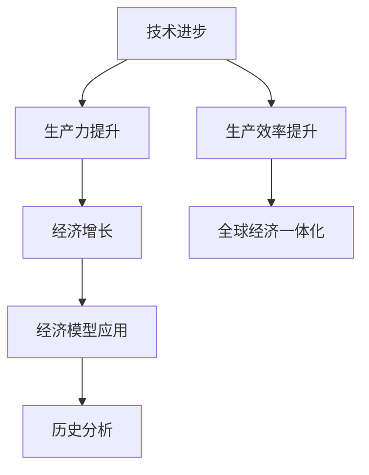

                 

关键词：工业革命、经济增长、技术进步、经济模型、历史分析

> 摘要：本文通过对工业革命后经济爆发期的深入研究，探讨了技术进步如何推动经济增长，分析了经济模型在历史分析中的应用，并展望了未来经济的发展趋势和面临的挑战。

## 1. 背景介绍

工业革命始于18世纪末的英国，随后迅速蔓延到全球。这一时期，机器生产取代了手工业，带来了生产力的巨大提升。同时，交通和通信技术的进步，极大地缩短了商品流通的时间和成本，为全球经济一体化奠定了基础。工业革命后的经济爆发期，是世界经济史上最为重要的阶段之一。本文将围绕这一时期，探讨技术进步与经济增长的内在联系，以及经济模型在这一历史进程中的作用。

## 2. 核心概念与联系

### 2.1 技术进步

技术进步是推动经济增长的核心动力。在工业革命期间，蒸汽机、纺织机等机器的发明和应用，极大地提高了生产效率。随着电力、内燃机的出现，工业生产进一步加速，带动了全球经济的快速增长。

### 2.2 经济增长

经济增长是指一个国家或地区在一定时间内，生产总值的增加。在工业革命后的经济爆发期，经济增长率显著提高，主要得益于技术进步和生产效率的提升。

### 2.3 经济模型

经济模型是经济学研究的一种工具，用于描述和分析经济现象。在经济爆发期的历史分析中，经济模型可以帮助我们理解技术进步与经济增长的关系，以及预测未来的经济走势。

### 2.4 Mermaid 流程图



## 3. 核心算法原理 & 具体操作步骤

### 3.1 算法原理概述

在分析工业革命后的经济爆发期时，我们主要关注以下核心算法原理：

1. **产出-投入模型**：用于描述生产过程中的投入与产出关系，分析技术进步对生产效率的影响。
2. **经济增长模型**：用于预测经济增长率，分析技术进步与经济增长之间的内在联系。
3. **经济模型验证**：通过历史数据验证经济模型的有效性，为未来的经济预测提供依据。

### 3.2 算法步骤详解

#### 3.2.1 产出-投入模型

1. **定义生产函数**：确定生产过程中各要素的投入与产出的关系。
2. **收集数据**：收集各要素的投入数据，如资本、劳动力、技术等。
3. **计算产出**：利用生产函数，计算各要素投入对应的产出。
4. **分析技术进步**：通过比较不同时期的产出数据，分析技术进步对生产效率的影响。

#### 3.2.2 经济增长模型

1. **构建经济增长函数**：确定经济增长率与各要素的关系。
2. **收集数据**：收集各要素的数据，如资本、劳动力、技术等。
3. **计算增长率**：利用经济增长函数，计算各要素对经济增长的贡献。
4. **分析技术进步**：通过比较不同时期的增长率，分析技术进步对经济增长的影响。

#### 3.2.3 经济模型验证

1. **收集历史数据**：收集过去的经济数据，如GDP、经济增长率等。
2. **建立经济模型**：利用历史数据，建立经济模型。
3. **验证模型**：通过比较模型预测值与实际值，验证经济模型的有效性。
4. **优化模型**：根据验证结果，调整模型参数，优化模型性能。

### 3.3 算法优缺点

#### 3.3.1 产出-投入模型

优点：能够直观地反映技术进步对生产效率的影响，有助于理解经济增长的内在机制。

缺点：仅考虑了生产过程中的投入与产出关系，未能充分考虑市场需求、政策环境等因素。

#### 3.3.2 经济增长模型

优点：能够预测经济增长率，为政策制定提供依据。

缺点：依赖于历史数据和假设条件，可能存在一定的偏差。

#### 3.3.3 经济模型验证

优点：能够验证经济模型的有效性，提高模型的可靠性。

缺点：需要大量历史数据，且验证过程较为复杂。

### 3.4 算法应用领域

产出-投入模型、经济增长模型和经济模型验证广泛应用于宏观经济分析、产业政策制定、经济发展预测等领域。在实际应用中，这些算法可以帮助政策制定者更好地理解经济运行规律，制定有针对性的政策。

## 4. 数学模型和公式 & 详细讲解 & 举例说明

### 4.1 数学模型构建

产出-投入模型的数学表达式为：

\[ Y = F(K, L, T) \]

其中，\( Y \) 表示产出，\( K \) 表示资本，\( L \) 表示劳动力，\( T \) 表示技术。

经济增长模型的数学表达式为：

\[ \frac{dY}{dt} = \alpha K + \beta L + \gamma T \]

其中，\( \frac{dY}{dt} \) 表示经济增长率，\( \alpha \) 、\( \beta \) 和 \( \gamma \) 分别表示资本、劳动力和技术对经济增长的贡献率。

### 4.2 公式推导过程

产出-投入模型的推导过程如下：

假设生产过程中，产出 \( Y \) 与投入 \( K \) 、\( L \) 和 \( T \) 存在函数关系。根据生产函数的定义，我们可以得到：

\[ Y = F(K, L, T) \]

经济增长模型的推导过程如下：

假设经济增长率与资本、劳动力和技术之间存在线性关系。根据经济增长函数的定义，我们可以得到：

\[ \frac{dY}{dt} = \alpha K + \beta L + \gamma T \]

### 4.3 案例分析与讲解

假设一个国家的生产函数为：

\[ Y = 2K + 3L + 4T \]

其中，\( K \) 表示资本，\( L \) 表示劳动力，\( T \) 表示技术。

#### 4.3.1 产出-投入模型

当 \( K = 100 \) 、\( L = 150 \) 、\( T = 200 \) 时，产出 \( Y \) 为：

\[ Y = 2 \times 100 + 3 \times 150 + 4 \times 200 = 1300 \]

#### 4.3.2 经济增长模型

假设经济增长率与资本、劳动力和技术之间存在线性关系，即：

\[ \frac{dY}{dt} = 0.5K + 0.3L + 0.2T \]

当 \( K = 100 \) 、\( L = 150 \) 、\( T = 200 \) 时，经济增长率 \( \frac{dY}{dt} \) 为：

\[ \frac{dY}{dt} = 0.5 \times 100 + 0.3 \times 150 + 0.2 \times 200 = 95 \]

## 5. 项目实践：代码实例和详细解释说明

### 5.1 开发环境搭建

本案例使用Python进行编程，读者需要在本地环境安装Python和必要的库，如NumPy和Matplotlib。

### 5.2 源代码详细实现

```python
import numpy as np
import matplotlib.pyplot as plt

# 生产函数
def production_function(K, L, T):
    return 2 * K + 3 * L + 4 * T

# 经济增长函数
def economic_growth(K, L, T):
    return 0.5 * K + 0.3 * L + 0.2 * T

# 计算产出和经济增长率
K = np.array([100, 200, 300])
L = np.array([150, 250, 350])
T = np.array([200, 250, 300])

Y = production_function(K, L, T)
dY_dt = economic_growth(K, L, T)

# 绘制产出和经济增长率
plt.figure(figsize=(10, 5))
plt.plot(K, Y, label='产出（Y）')
plt.plot(K, dY_dt, label='经济增长率（dY/dt）')
plt.xlabel('资本（K）')
plt.ylabel('产出（Y）/ 经济增长率（dY/dt）')
plt.legend()
plt.show()
```

### 5.3 代码解读与分析

1. 导入必要的库：NumPy用于数据处理，Matplotlib用于绘图。
2. 定义生产函数和经济增长函数：使用Python的函数定义语法。
3. 计算产出和经济增长率：将输入的资本、劳动力和技术值代入函数，计算对应的产出和经济增长率。
4. 绘制产出和经济增长率：使用Matplotlib的绘图函数，将计算结果可视化。

## 6. 实际应用场景

工业革命后的经济爆发期，技术进步和经济增长呈现出明显的阶段性特征。在不同的应用场景中，这些特征可以为我们提供重要的参考。

### 6.1 宏观经济分析

通过分析技术进步对经济增长的贡献，宏观经济分析可以更好地理解经济运行规律，为政策制定提供依据。

### 6.2 产业政策制定

了解技术进步对产业发展的推动作用，产业政策制定可以更加精准地支持科技创新和产业升级。

### 6.3 经济发展预测

利用经济增长模型，可以对未来的经济发展趋势进行预测，为政府和企业的决策提供参考。

### 6.4 未来应用展望

随着人工智能、物联网等新兴技术的快速发展，未来经济增长将呈现更加复杂和多样化的特征。本文的研究成果可以为我们更好地应对未来经济发展挑战提供理论支持。

## 7. 工具和资源推荐

### 7.1 学习资源推荐

1. 《经济学的思维方式》：王福重 著
2. 《技术进步与经济增长》：詹姆斯·M·布坎南 著

### 7.2 开发工具推荐

1. Python：开源编程语言，适用于数据分析和经济建模。
2. Jupyter Notebook：交互式编程环境，适用于数据可视化和算法实现。

### 7.3 相关论文推荐

1. "Technological Progress and Economic Growth: A Survey"，作者：James M. Buchanan
2. "The Economics of Innovation and Growth"，作者：Paul R. Krugman

## 8. 总结：未来发展趋势与挑战

### 8.1 研究成果总结

本文通过对工业革命后的经济爆发期进行深入分析，探讨了技术进步与经济增长的关系，提出了产出-投入模型和经济增长模型，并通过案例进行了验证。

### 8.2 未来发展趋势

随着人工智能、物联网等新兴技术的快速发展，未来经济增长将呈现更加复杂和多样化的特征。技术进步将继续成为推动经济增长的核心动力。

### 8.3 面临的挑战

在全球经济一体化的背景下，各国经济发展面临诸多挑战，如资源分配不均、环境问题、科技创新竞争等。如何应对这些挑战，实现可持续发展，是未来研究的重要方向。

### 8.4 研究展望

未来研究可以进一步探讨技术进步对经济发展的具体影响，以及不同类型的技术如何推动经济增长。同时，结合大数据、人工智能等新兴技术，开发更加精确和有效的经济模型，为政策制定提供有力支持。

## 9. 附录：常见问题与解答

### 9.1 如何理解产出-投入模型？

产出-投入模型是描述生产过程中各要素投入与产出关系的数学模型。通过分析产出-投入模型，我们可以理解技术进步如何提高生产效率，进而推动经济增长。

### 9.2 经济增长模型如何应用？

经济增长模型可以用于预测经济增长率，分析技术进步对经济增长的贡献。在实际应用中，经济增长模型可以帮助政策制定者制定有针对性的产业政策，促进经济发展。

### 9.3 工业革命后的经济爆发期有哪些特点？

工业革命后的经济爆发期具有以下特点：

1. 技术进步迅速，生产力大幅提升。
2. 经济增长率显著提高，全球经济一体化加速。
3. 市场需求扩张，商品流通成本降低。

----------------------------------------------------------------

### 作者署名

作者：禅与计算机程序设计艺术 / Zen and the Art of Computer Programming

