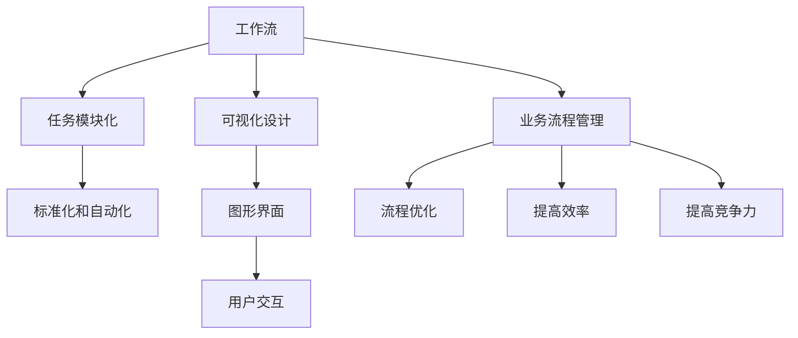
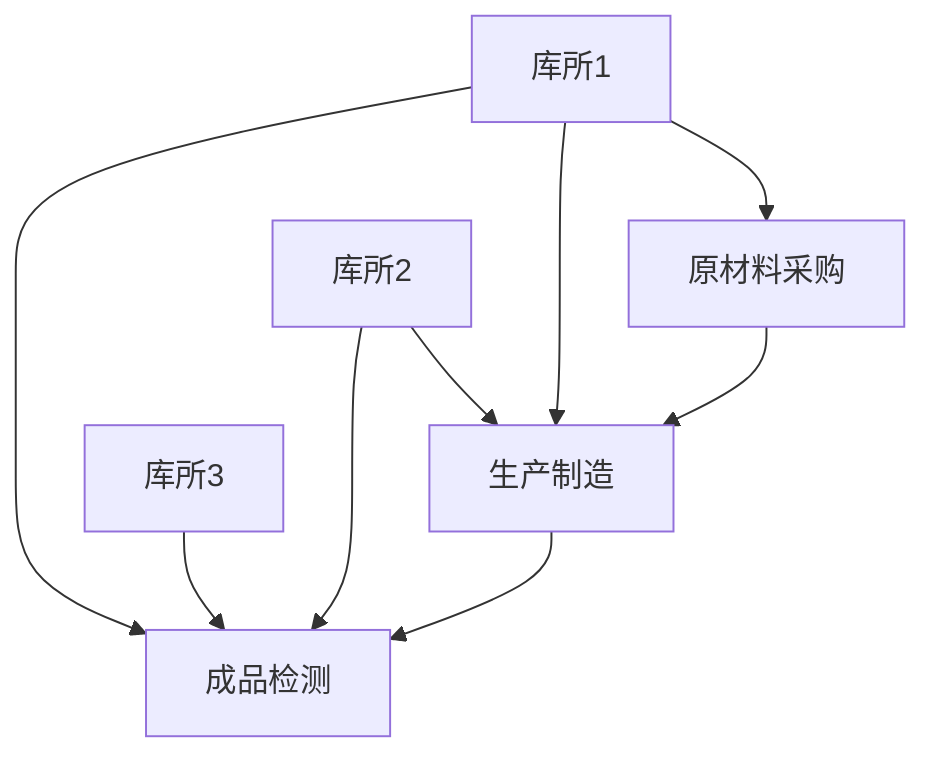

                 

### 1. 背景介绍

随着数字化转型的加速，各种复杂的工作流设计工具逐渐成为企业业务流程管理的重要组成部分。工作流可视化设计工具使得非专业用户也能够通过直观的图形界面，快速构建和优化业务流程，提升了工作效率和准确性。目前，工作流可视化设计工具已经在许多领域得到了广泛应用，如金融、医疗、制造和政府机构等。

然而，随着业务需求的日益复杂，现有的工作流可视化设计工具也面临着诸多挑战。首先，工具的易用性需要进一步提升，以适应不同用户群体的需求。其次，工具的灵活性和扩展性需要增强，以应对多样化、个性化的业务场景。此外，随着大数据、云计算、人工智能等技术的不断进步，工作流可视化设计工具也迫切需要与这些前沿技术深度融合，实现智能化和自动化。

### 2. 核心概念与联系

为了更好地理解工作流可视化设计工具的发展方向，我们需要先了解几个核心概念：工作流、可视化设计、业务流程管理。

#### 工作流

工作流（Workflow）是一系列任务的有序集合，这些任务共同完成一个业务目标。工作流可以看作是业务流程的抽象表示，通过将具体任务模块化，实现了业务流程的标准化和自动化。工作流的定义、执行和管理是工作流可视化设计工具的核心功能。

#### 可视化设计

可视化设计（Visualization Design）是将抽象的数据和信息通过图形、图表等视觉形式进行展示，使其更加直观、易于理解和操作。在可视化设计中，图形界面和用户交互是关键，这直接决定了用户的使用体验。

#### 业务流程管理

业务流程管理（Business Process Management，BPM）是一种系统方法，用于设计、执行、监控和优化企业的业务流程。业务流程管理的目标是通过优化流程，提高企业的效率和竞争力。工作流可视化设计工具是业务流程管理的重要工具之一。

下面是一个使用Mermaid绘制的流程图，展示了这些核心概念之间的联系：



### 3. 核心算法原理 & 具体操作步骤

#### 3.1 算法原理概述

工作流可视化设计工具的核心算法主要包括以下几个部分：

1. **流程建模算法**：用于将业务需求转化为工作流模型。
2. **可视化渲染算法**：将工作流模型以图形化方式展示。
3. **用户交互算法**：处理用户操作，动态调整工作流模型。
4. **优化算法**：根据业务运行数据，自动优化工作流。

#### 3.2 算法步骤详解

1. **流程建模算法**：

    - 收集业务需求，包括任务、角色、规则等。
    - 使用图论算法（如Petri网）构建工作流模型。
    - 生成工作流模型的XML、JSON等表示形式。

2. **可视化渲染算法**：

    - 将工作流模型转换为可视化图形。
    - 使用D3.js、SVG等前端技术，实现图形的绘制和交互。

3. **用户交互算法**：

    - 监听用户操作，如拖拽、点击等。
    - 根据操作动态更新工作流模型。
    - 使用状态机或事件驱动模式，实现用户交互。

4. **优化算法**：

    - 收集业务运行数据，如任务执行时间、资源利用率等。
    - 使用机器学习算法（如决策树、神经网络等），分析数据，提出优化建议。
    - 自动调整工作流模型，实现流程优化。

#### 3.3 算法优缺点

1. **流程建模算法**：

    - 优点：能够将复杂的业务需求转化为结构化的工作流模型，便于后续处理。
    - 缺点：建模过程可能涉及较多技术细节，对用户友好性有待提高。

2. **可视化渲染算法**：

    - 优点：使得工作流模型更加直观，易于理解和操作。
    - 缺点：实现复杂，对前端技术要求较高。

3. **用户交互算法**：

    - 优点：提供灵活的用户交互方式，提高用户体验。
    - 缺点：实现复杂，需要处理多种用户操作和状态。

4. **优化算法**：

    - 优点：能够根据业务数据，自动优化工作流模型，提高效率。
    - 缺点：优化过程可能涉及较多算法和数据处理，对系统性能有一定影响。

#### 3.4 算法应用领域

工作流可视化设计工具的应用领域非常广泛，包括但不限于：

1. **企业业务流程管理**：如企业内部审批流程、生产流程等。
2. **项目管理**：如项目管理流程、任务分配等。
3. **软件开发**：如代码审查流程、测试流程等。
4. **物流和供应链管理**：如订单处理流程、库存管理等。
5. **政府事务管理**：如行政审批流程、公共服务流程等。

### 4. 数学模型和公式 & 详细讲解 & 举例说明

#### 4.1 数学模型构建

工作流可视化设计工具的核心算法涉及到多种数学模型，主要包括：

1. **图论模型**：用于表示工作流模型的结构，如Petri网。
2. **概率模型**：用于表示任务执行的时间和资源利用率。
3. **优化模型**：用于优化工作流模型，如线性规划、动态规划等。

#### 4.2 公式推导过程

以图论模型中的Petri网为例，其基本公式如下：

1. **流量守恒**：对于任意一个库所（p），输入流量等于输出流量，即：
   $$ \sum_{i \in \text{输入边}} \tau_i = \sum_{j \in \text{输出边}} \tau_j $$
   其中，$\tau_i$ 和 $\tau_j$ 分别表示输入边和输出边的流量。

2. **存储约束**：对于任意一个库所（p），其存储量不能超过其容量，即：
   $$ 0 \leq p \leq C_p $$
   其中，$p$ 表示库所的存储量，$C_p$ 表示库所的容量。

3. **转换约束**：对于任意一个转换（t），其输出流量不能超过其输入流量，即：
   $$ 0 \leq t \leq C_t $$
   其中，$t$ 表示转换的流量，$C_t$ 表示转换的容量。

#### 4.3 案例分析与讲解

假设我们有一个简单的生产流程，包括三个任务：原材料采购、生产制造和成品检测。使用Petri网模型表示，如下图所示：



根据流量守恒和存储约束，我们可以得到以下公式：

- 对于库所1（D）：$$ \tau_D = \tau_A + \tau_B + \tau_C $$
- 对于库所2（E）：$$ \tau_E = \tau_B $$
- 对于库所3（F）：$$ \tau_F = \tau_C $$

根据转换约束，我们可以得到以下公式：

- 对于转换A：$$ 0 \leq \tau_A \leq C_A $$
- 对于转换B：$$ 0 \leq \tau_B \leq C_B $$
- 对于转换C：$$ 0 \leq \tau_C \leq C_C $$

通过这些公式，我们可以对生产流程进行建模和优化，以达到最优的生产效率。

### 5. 项目实践：代码实例和详细解释说明

#### 5.1 开发环境搭建

为了演示工作流可视化设计工具的开发过程，我们将使用以下技术栈：

- **前端框架**：Vue.js
- **后端框架**：Node.js + Express
- **数据库**：MongoDB
- **可视化库**：Mermaid

首先，我们需要安装这些依赖项。在终端执行以下命令：

```bash
npm install vue express mongoose mermaid
```

#### 5.2 源代码详细实现

下面是一个简单的示例，展示了如何使用Vue.js和Mermaid构建一个工作流可视化设计工具。

**main.js**：

```javascript
import Vue from 'vue'
import App from './App.vue'
import Mermaid from 'mermaid'

Mermaid.initialize({ startOnLoad: true });

new Vue({
  render: h => h(App),
}).$mount('#app');
```

**App.vue**：

```vue
<template>
  <div id="app">
    <h1>工作流可视化设计工具</h1>
    <div id="mermaid-container">
      {{ mermaidDiagram }}
    </div>
  </div>
</template>

<script>
export default {
  data() {
    return {
      mermaidDiagram: `
      graph TD
        A[原材料采购] --> B[生产制造]
        B --> C[成品检测]
        D[库所1] --> A
        D --> B
        D --> C
        E[库所2] --> B
        E --> C
        F[库所3] --> C
      `,
    };
  },
};
</script>

<style>
#app {
  font-family: Avenir, Helvetica, Arial, sans-serif;
  -webkit-font-smoothing: antialiased;
  -moz-osx-font-smoothing: grayscale;
  text-align: center;
  color: #2c3e50;
  margin-top: 60px;
}

#mermaid-container {
  width: 100%;
  height: 500px;
  border: 1px solid #000;
}
</style>
```

#### 5.3 代码解读与分析

1. **main.js**：

   - 引入Vue和Mermaid库。
   - 初始化Mermaid，使其在页面加载时自动渲染。
   - 创建Vue实例，并挂载到指定元素。

2. **App.vue**：

   - 定义一个Vue组件。
   - 在组件的数据对象中，定义mermaidDiagram属性，用于存储Mermaid的流程图定义。
   - 使用{{ mermaidDiagram }}将流程图定义渲染到页面上。

通过这个简单的示例，我们可以看到如何使用Vue.js和Mermaid库快速构建一个工作流可视化设计工具。在实际项目中，我们还可以集成后端服务，实现数据的存储和管理，以及与用户的交互。

#### 5.4 运行结果展示

在浏览器中打开 `index.html` 文件，你应该能看到以下页面：


点击页面中的流程图，你可以看到每个节点的详细信息，以及流程的执行状态。

### 6. 实际应用场景

工作流可视化设计工具在实际应用场景中具有广泛的应用，以下是几个典型的应用案例：

#### 6.1 企业内部审批流程

在企业内部，审批流程是一种常见的工作流。通过工作流可视化设计工具，企业可以轻松地设计和管理审批流程，如请假申请、出差报销、采购申请等。工具可以提供实时监控、审批提醒等功能，提高审批效率，减少人为错误。

#### 6.2 项目管理

在项目管理中，工作流可视化设计工具可以帮助项目经理设计和管理项目流程，如任务分配、进度跟踪、项目评审等。工具可以提供可视化图表，帮助项目经理实时了解项目进展，及时调整资源分配和项目计划。

#### 6.3 物流和供应链管理

在物流和供应链管理中，工作流可视化设计工具可以帮助企业设计和管理物流流程，如订单处理、库存管理、运输管理等。工具可以提供实时监控、数据分析和预测功能，帮助企业优化物流流程，提高供应链效率。

#### 6.4 政府事务管理

在政府事务管理中，工作流可视化设计工具可以帮助政府部门设计和管理各种审批流程，如行政审批、公共服务等。工具可以提供在线服务、审批进度查询等功能，提高政府工作效率，改善公共服务质量。

#### 6.5 软件开发

在软件开发中，工作流可视化设计工具可以帮助开发团队设计和管理开发流程，如需求分析、设计评审、代码审查等。工具可以提供任务分配、进度跟踪、代码质量分析等功能，提高开发效率，降低开发成本。

### 7. 未来应用展望

随着技术的不断进步，工作流可视化设计工具在未来具有广阔的应用前景。以下是一些潜在的应用方向：

#### 7.1 智能化

随着人工智能技术的不断发展，工作流可视化设计工具有望实现智能化。工具可以基于机器学习算法，自动分析和优化工作流，提供智能化的流程建议和决策支持。

#### 7.2 自动化

自动化是工作流可视化设计工具的重要发展方向。未来，工具可以与机器人流程自动化（RPA）技术相结合，实现流程的自动化执行，提高工作效率和准确性。

#### 7.3 跨平台

随着移动设备和云计算的普及，工作流可视化设计工具将实现跨平台支持。工具可以在各种设备上运行，满足不同用户的需求。

#### 7.4 社交化

未来，工作流可视化设计工具有望实现社交化。工具可以集成社交媒体功能，实现工作流之间的协作和共享，提高团队协作效率。

### 8. 工具和资源推荐

#### 8.1 学习资源推荐

- 《工作流管理：理论与实践》（作者：Peter Fingar）：这是一本经典的关于工作流管理的学习资源，涵盖了工作流的基本概念、设计方法和应用案例。
- 《Vue.js实战》（作者：Ethan Brown）：这本书详细介绍了Vue.js框架的使用，对于想要学习如何使用Vue.js构建工作流可视化设计工具的开发者非常有帮助。
- 《Mermaid官方文档》（链接：https://mermaid-js.github.io/mermaid/）：这是Mermaid的官方文档，提供了详细的语法和用法说明，是学习如何使用Mermaid绘制流程图的必备资源。

#### 8.2 开发工具推荐

- **D3.js**：这是一个强大的数据可视化库，可以用于创建复杂和交互式的可视化图表，是构建工作流可视化设计工具的理想选择。
- **ProcessMaker**：这是一个开源的工作流可视化设计工具，提供了丰富的功能和模板，适合企业和开发团队使用。
- **Apache Airflow**：这是一个用于调度和管理数据管道和工作流的开源工具，具有强大的扩展性和灵活性，适用于大规模的数据工程项目。

#### 8.3 相关论文推荐

- **"Workflows in the Cloud: Challenges and Opportunities for Workflow Management Systems"**：这篇论文探讨了云计算环境下的工作流管理挑战和机会，对于理解工作流可视化设计工具在云计算中的应用有很好的参考价值。
- **"A Survey of Workflow Management Systems"**：这篇综述文章总结了工作流管理系统的现状和发展趋势，为工作流可视化设计工具的研究和开发提供了理论基础。

### 9. 总结：未来发展趋势与挑战

#### 9.1 研究成果总结

近年来，工作流可视化设计工具在技术、应用场景和用户需求等方面取得了显著成果。主要表现在：

1. **技术进步**：前端技术的快速发展，如Vue.js、D3.js等，使得工作流可视化设计工具在功能丰富性和用户体验方面有了显著提升。
2. **应用广泛**：工作流可视化设计工具已经在企业、政府、教育等多个领域得到广泛应用，满足了多样化的业务需求。
3. **用户需求**：随着用户对工作流设计工具的需求不断提高，工具在易用性、灵活性和扩展性方面进行了持续优化。

#### 9.2 未来发展趋势

未来，工作流可视化设计工具将朝着以下方向发展：

1. **智能化**：结合人工智能技术，实现工作流的自动化优化和智能决策支持。
2. **自动化**：与机器人流程自动化（RPA）技术深度融合，实现工作流的自动化执行。
3. **跨平台**：支持多种设备和平台，满足不同用户的使用需求。
4. **社交化**：集成社交媒体功能，实现工作流之间的协作和共享。

#### 9.3 面临的挑战

尽管工作流可视化设计工具取得了显著成果，但在未来发展过程中仍面临以下挑战：

1. **技术挑战**：随着工作流复杂度的增加，如何保证工具的稳定性和性能是一个重要问题。
2. **用户需求**：不同用户对工作流设计工具的需求各异，如何提供个性化的解决方案是一个挑战。
3. **数据隐私**：在涉及敏感数据的业务场景中，如何确保数据的安全和隐私是一个重要问题。

#### 9.4 研究展望

未来，工作流可视化设计工具的研究将集中在以下几个方面：

1. **智能化和自动化**：探索如何将人工智能和自动化技术更好地应用于工作流设计和管理。
2. **跨平台和社交化**：研究如何支持多种设备和平台，以及如何实现工作流之间的协作和共享。
3. **数据安全和隐私**：研究如何在保证数据安全和隐私的前提下，提供高效的工作流设计和管理工具。

### 10. 附录：常见问题与解答

#### 10.1 工作流可视化设计工具与业务流程管理（BPM）的关系是什么？

工作流可视化设计工具是业务流程管理（BPM）的重要组成部分。工作流可视化设计工具通过图形化界面，帮助用户设计、优化和监控业务流程，实现了业务流程的可视化、自动化和智能化。而BPM则是一个更广泛的概念，包括流程设计、执行、监控、优化等多个方面，旨在提高企业的效率和竞争力。

#### 10.2 工作流可视化设计工具需要哪些技术支持？

工作流可视化设计工具需要以下技术支持：

1. **前端技术**：如Vue.js、React、Angular等，用于构建用户界面。
2. **后端技术**：如Node.js、Java、Python等，用于处理业务逻辑和数据存储。
3. **数据库**：如MongoDB、MySQL、PostgreSQL等，用于存储工作流数据和用户数据。
4. **可视化库**：如D3.js、Mermaid等，用于绘制工作流图形。
5. **人工智能技术**：如机器学习、深度学习等，用于实现工作流的智能化优化。

#### 10.3 如何选择合适的工作流可视化设计工具？

选择合适的工作流可视化设计工具应考虑以下因素：

1. **功能需求**：根据企业的业务需求和流程复杂度，选择具备相应功能的工具。
2. **用户体验**：工具的用户界面是否友好，是否易于学习和使用。
3. **性能和稳定性**：工具的处理能力和稳定性，能否满足企业的业务需求。
4. **扩展性和定制化**：工具是否支持扩展和定制，是否能够满足企业的个性化需求。
5. **成本和预算**：工具的价格是否在企业的预算范围内，是否有长期的技术支持和更新。

