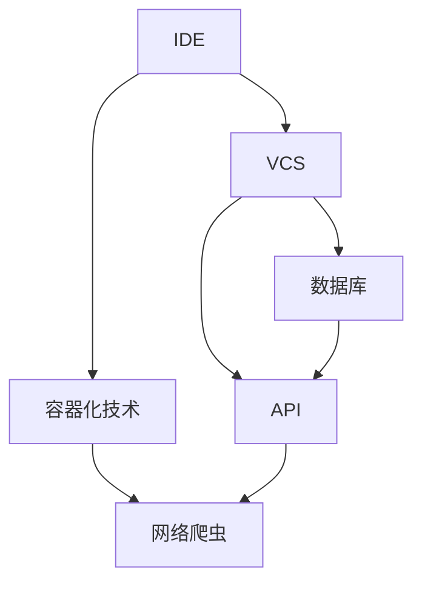

                 

 **关键词**：代码执行、专有信息源、工具、技术博客、算法原理、项目实践、数学模型、应用场景。

**摘要**：本文将探讨如何在计算机编程中有效地使用代码执行和访问专有信息源的工具，提供深入的理论和实践指导，帮助开发者提高开发效率和代码质量。

## 1. 背景介绍

在当今数字化时代，代码执行和访问专有信息源是软件开发中的两个关键环节。代码执行涉及到程序的运行、调试和优化，而访问专有信息源则确保了开发者能够获取到高质量的、专门化的数据，以便在开发过程中作出更明智的决策。

然而，随着技术的不断发展，这两个环节也变得越来越复杂。现代软件开发涉及到大量的工具和平台，如集成开发环境（IDE）、版本控制系统、容器化技术等。此外，专有信息源的种类和获取方式也多种多样，如数据库、API、网络爬虫等。这使得开发者面临着如何高效利用这些工具和资源，以及如何在遵守法律法规和道德规范的前提下获取和使用专有信息的挑战。

本文旨在通过对代码执行和访问专有信息源工具的深入探讨，帮助开发者理解和掌握这些技术，提高开发效率和质量。文章将分为以下几个部分：

1. 背景介绍
2. 核心概念与联系
3. 核心算法原理 & 具体操作步骤
4. 数学模型和公式 & 详细讲解 & 举例说明
5. 项目实践：代码实例和详细解释说明
6. 实际应用场景
7. 工具和资源推荐
8. 总结：未来发展趋势与挑战
9. 附录：常见问题与解答

通过这篇文章，读者将能够全面了解代码执行和访问专有信息源的工具，掌握其在实际开发中的应用方法，并展望未来技术发展趋势和面临的挑战。

## 2. 核心概念与联系

在深入探讨代码执行和访问专有信息源工具之前，我们需要明确一些核心概念，并了解它们之间的相互关系。以下是本文将涉及的主要概念及其关系。

### 2.1 集成开发环境（IDE）

集成开发环境（IDE）是开发者编写、调试和运行代码的综合性工具。常见的IDE包括Eclipse、Visual Studio、IntelliJ IDEA等。IDE通常集成了代码编辑器、调试器、编译器、构建工具等多种功能，使得开发者能够在一个统一的界面中完成所有的开发任务。

### 2.2 版本控制系统

版本控制系统（VCS）用于跟踪和管理代码的版本历史。常见的版本控制系统有Git、Subversion（SVN）、Mercurial等。版本控制系统不仅可以帮助开发者维护代码的版本历史，还能实现多人协作开发，确保代码的完整性和一致性。

### 2.3 容器化技术

容器化技术（如Docker）使得开发者能够在隔离的环境中运行应用程序，确保应用程序在不同的开发环境和生产环境中具有一致的运行效果。容器化技术通过将应用程序及其依赖环境打包成一个独立的容器镜像，大大简化了部署和运维过程。

### 2.4 数据库

数据库是用于存储、管理和查询数据的系统。常见的数据库类型包括关系型数据库（如MySQL、PostgreSQL）和非关系型数据库（如MongoDB、Cassandra）。数据库在软件开发中扮演着至关重要的角色，用于存储应用程序所需的数据。

### 2.5 API

应用程序编程接口（API）是一种用于应用程序之间进行通信的接口。开发者可以通过API访问第三方服务，如天气预报、地图服务、社交媒体平台等。API通常以RESTful风格或GraphQL风格提供，使得开发者能够方便地获取和使用数据。

### 2.6 网络爬虫

网络爬虫是一种用于自动获取互联网上数据的程序。通过爬虫，开发者可以获取网站上的信息，如新闻、商品信息、用户评论等。网络爬虫在数据采集和内容分析方面具有广泛应用。

### 2.7 Mermaid 流程图

Mermaid是一种基于Markdown的绘图工具，用于创建各种类型的图表和图形，如流程图、序列图、类图等。在本文中，我们将使用Mermaid流程图来展示核心概念的相互关系。

下面是一个简单的Mermaid流程图示例，展示了上述概念之间的关系：



通过这个流程图，我们可以清晰地看到代码执行和访问专有信息源工具之间的相互关系。IDE作为开发者的核心工具，与VCS、容器化技术、数据库、API和网络爬虫等工具紧密相连，共同构成了一个高效的软件开发环境。

### 3. 核心算法原理 & 具体操作步骤

在理解了代码执行和访问专有信息源工具的核心概念后，我们接下来将探讨一些核心算法原理，并详细讲解其操作步骤。这些算法在软件开发中扮演着重要角色，能够帮助开发者提高代码质量和开发效率。

#### 3.1 算法原理概述

本文将介绍以下几种核心算法：

1. **排序算法**：用于对数据集合进行排序，常见的排序算法有快速排序、归并排序、插入排序等。
2. **搜索算法**：用于在数据集合中查找特定元素，常见的搜索算法有二分搜索、线性搜索等。
3. **动态规划**：用于求解最优化问题，通过将问题分解为子问题，并利用子问题的解来构建原问题的解。
4. **贪心算法**：通过在每一步选择当前最优解，从而逐步逼近全局最优解。

#### 3.2 算法步骤详解

1. **排序算法**：

   - **快速排序**：

     快速排序的基本思想是通过一趟排序将待排序的数据分割成独立的两部分，其中一部分的所有数据都比另一部分的所有数据要小。快速排序通过递归地调用自身来处理这两部分数据，直到整个数据集合有序。

     操作步骤如下：

     - 选择一个基准元素（通常是第一个或最后一个元素）。
     - 将数据集合分成两部分：小于基准元素的数据和大于基准元素的数据。
     - 对这两部分数据分别递归地进行快速排序。

     快速排序的时间复杂度为 \(O(n\log n)\)，但在最坏情况下可能退化到 \(O(n^2)\)。

   - **归并排序**：

     归并排序是一种分治算法，将待排序的数据集合分成若干个大小相等的子序列，然后将子序列两两合并，直到整个数据集合有序。

     操作步骤如下：

     - 将数据集合分成若干个大小为1的子序列。
     - 重复以下步骤，直到整个数据集合有序：
       - 两两合并子序列，形成更大的有序子序列。
       - 将有序子序列合并成整个数据集合。

     归并排序的时间复杂度为 \(O(n\log n)\)，但在数据量较大时表现出色。

   - **插入排序**：

     插入排序是一种简单直观的排序算法，通过将一个数据元素插入到已经排好序的序列中，从而得到一个新的、更长的有序序列。

     操作步骤如下：

     - 从第一个元素开始，该元素可以认为已经排序。
     - 取出下一个元素，在已排序的元素序列中从后向前扫描。
     - 如果该元素（已排序）大于新元素，将该元素移到下一位置。
     - 重复步骤3，直到找到已排序的元素小于或者等于新元素。
     - 将新元素插入到该位置后。

     插入排序的时间复杂度为 \(O(n^2)\)，但在数据量较小时表现出色。

2. **搜索算法**：

   - **二分搜索**：

     二分搜索是一种在有序数据集合中查找特定元素的算法。算法的基本思想是不断将数据集合分成两部分，然后根据目标元素与中间元素的大小关系，决定在左半部分或右半部分继续搜索。

     操作步骤如下：

     - 将待查找的数据集合划分为两部分，取中间元素作为比较对象。
     - 如果目标元素等于中间元素，则搜索成功。
     - 如果目标元素小于中间元素，则在左半部分继续搜索。
     - 如果目标元素大于中间元素，则在右半部分继续搜索。
     - 重复步骤3，直到找到目标元素或确定目标元素不存在。

     二分搜索的时间复杂度为 \(O(\log n)\)。

   - **线性搜索**：

     线性搜索是一种最简单的搜索算法，从数据集合的第一个元素开始，逐个比较，直到找到目标元素或确定目标元素不存在。

     操作步骤如下：

     - 从数据集合的第一个元素开始，逐个比较。
     - 如果目标元素等于当前元素，则搜索成功。
     - 如果目标元素不等于当前元素，则继续比较下一个元素。
     - 重复步骤3，直到找到目标元素或确定目标元素不存在。

     线性搜索的时间复杂度为 \(O(n)\)。

3. **动态规划**：

   动态规划是一种用于求解最优化问题的算法，通过将问题分解为子问题，并利用子问题的解来构建原问题的解。

   基本步骤如下：

   - 确定状态：将问题分解为若干个子问题，定义每个子问题的状态。
   - 确定状态转移方程：根据子问题的状态，建立状态转移方程，描述子问题之间的依赖关系。
   - 初始化边界条件：确定初始状态，以及初始状态的解。
   - 状态转移计算：根据状态转移方程，从初始状态开始，逐步计算得到最终状态的解。

   动态规划通常用于求解最短路径、最大子序列和背包问题等。

4. **贪心算法**：

   贪心算法是一种通过每一步选择当前最优解，从而逐步逼近全局最优解的算法。

   基本步骤如下：

   - 初始状态：根据问题的定义，确定初始状态。
   - 选择最优解：在当前状态下，选择一个最优解。
   - 更新状态：根据最优解，更新状态。
   - 重复步骤2和3，直到找到全局最优解。

   贪心算法通常用于求解背包问题、最小生成树和最短路径问题等。

#### 3.3 算法优缺点

每种算法都有其优缺点，具体选择哪种算法取决于具体问题的需求和约束。

1. **排序算法**：

   - **快速排序**：优点是平均时间复杂度较低，性能较好；缺点是最坏情况下性能较差，可能需要优化。
   - **归并排序**：优点是时间复杂度稳定，性能较好；缺点是空间复杂度较高，需要额外的存储空间。
   - **插入排序**：优点是简单易懂，适合数据量较小的情况；缺点是时间复杂度较高，不适合大数据量排序。

2. **搜索算法**：

   - **二分搜索**：优点是时间复杂度较低，适合有序数据集合；缺点是只适用于有序数据集合，无法处理无序数据。
   - **线性搜索**：优点是简单易懂，适用于无序数据集合；缺点是时间复杂度较高，不适合大数据量搜索。

3. **动态规划**：

   - 优点是能够求解最优化问题，适用于复杂的问题；缺点是实现相对复杂，需要仔细设计状态转移方程。
   - 适用于求解最短路径、最大子序列和背包问题等。

4. **贪心算法**：

   - 优点是实现简单，通常能够得到全局最优解；缺点是可能只适用于某些特定问题，无法处理所有最优化问题。

#### 3.4 算法应用领域

排序算法、搜索算法、动态规划算法和贪心算法在软件开发中有着广泛的应用。

1. **排序算法**：

   - 数据处理：对大规模数据集合进行排序，以便进行进一步的分析和处理。
   - 用户界面：在用户界面中，对列表、表格等元素进行排序，提高用户体验。
   - 算法比较：在算法设计和优化过程中，使用排序算法进行比较和评估。

2. **搜索算法**：

   - 数据检索：在数据库中查找特定的记录或信息。
   - 文本搜索：在文本文件中查找特定的单词或短语。
   - 路径规划：在地图或导航应用中，查找从起点到终点的最优路径。

3. **动态规划**：

   - 背包问题：在背包问题的求解中，利用动态规划找到最优解。
   - 最短路径：在图论问题中，使用动态规划求解最短路径问题。
   - 最大子序列：在序列分析中，使用动态规划找到最大子序列。

4. **贪心算法**：

   - 资源分配：在资源分配问题中，使用贪心算法分配资源。
   - 网络流量管理：在网络流量管理中，使用贪心算法优化数据传输路径。
   - 货物配送：在货物配送问题中，使用贪心算法选择配送路线。

通过以上对核心算法原理和具体操作步骤的探讨，读者可以更好地理解这些算法在软件开发中的应用，并为实际开发提供参考。

### 4. 数学模型和公式 & 详细讲解 & 举例说明

在软件开发中，数学模型和公式是解决问题的重要工具。它们不仅能够帮助开发者理解算法的工作原理，还能在实际开发中提供具体的指导。本节将详细介绍几个常用的数学模型和公式，并通过实例来说明其应用。

#### 4.1 数学模型构建

数学模型是现实问题在数学上的抽象表示。构建数学模型通常包括以下步骤：

1. **明确问题**：首先要明确需要解决的问题是什么，问题的目标是求得什么。
2. **定义变量**：根据问题，定义相关的变量。变量可以是离散的（如整数、枚举）或连续的（如实数）。
3. **建立关系式**：根据问题的性质，建立变量之间的关系式。关系式可以是线性或非线性，需要根据实际情况进行推导。
4. **边界条件**：根据问题，确定变量的取值范围和约束条件。

#### 4.2 公式推导过程

在本节中，我们将推导并介绍几个常用的数学公式。

**1. 二分搜索的公式**

二分搜索算法的核心在于每次将数据集合分成两部分，然后根据目标元素与中间元素的大小关系来决定继续搜索哪一部分。二分搜索的公式如下：

\[ \text{mid} = \left\lfloor \frac{\text{low} + \text{high}}{2} \right\rfloor \]

其中，`low`和`high`分别是当前搜索区间的起始和结束位置，`mid`是中间位置。这个公式用来计算下一次搜索的中间位置。

**2. 动态规划中的状态转移公式**

动态规划中的状态转移公式描述了子问题之间的依赖关系。例如，在求最大子序列和问题中，状态转移公式为：

\[ \text{dp}[i] = \max(\text{dp}[i-1], \text{dp}[j] + \text{array}[i]) \]

其中，`dp[i]`表示前`i`个元素的最大子序列和，`array[i]`表示第`i`个元素的值，`j`是`0`到`i-1`的整数。这个公式表示在第`i`个元素加入时，最大子序列和可以是前`i-1`个元素的最大子序列和，或者在前`i-1`个元素的最大子序列和基础上加上第`i`个元素。

**3. 贪心算法中的最优解公式**

贪心算法的核心在于每一步选择当前最优解。例如，在背包问题中，贪心算法的最优解公式为：

\[ \text{weight} = \sum_{i=1}^{n} (\text{value}[i] - \text{weight}[i]) \times \text{unitCost} \]

其中，`value[i]`表示第`i`件物品的估值，`weight[i]`表示第`i`件物品的重量，`unitCost`是单位成本。这个公式表示在总重量不超过背包容量时，能够获得的最大估值。

#### 4.3 案例分析与讲解

为了更好地理解上述数学模型和公式，我们将通过一个具体案例进行讲解。

**案例：二分搜索**

假设我们有一个整数数组`[4, 2, 7, 1, 9, 6]`，我们需要使用二分搜索找到元素`7`的位置。

1. **初始化**：

   - `low = 0`，`high = 5`，`mid = \left\lfloor \frac{low + high}{2} \right\rfloor = 2`。

2. **第一次搜索**：

   - `mid`位置的元素是`7`，搜索成功。

3. **第二次搜索**：

   - `low = mid + 1 = 3`，`high = 5`，`mid = \left\lfloor \frac{low + high}{2} \right\rfloor = 4`。

   - `mid`位置的元素是`9`，大于目标元素`7`，继续在左半部分搜索。

4. **第三次搜索**：

   - `low = 3`，`high = mid - 1 = 3`，`mid = \left\lfloor \frac{low + high}{2} \right\rfloor = 3`。

   - `mid`位置的元素是`1`，小于目标元素`7`，继续在右半部分搜索。

5. **第四次搜索**：

   - `low = mid + 1 = 4`，`high = 5`，`mid = \left\lfloor \frac{low + high}{2} \right\rfloor = 4`。

   - `mid`位置的元素是`9`，大于目标元素`7`，继续在左半部分搜索。

6. **第五次搜索**：

   - `low = mid + 1 = 5`，`high = 5`，`mid = \left\lfloor \frac{low + high}{2} \right\rfloor = 5`。

   - `mid`位置的元素是`6`，小于目标元素`7`，继续在右半部分搜索。

7. **第六次搜索**：

   - `low = mid + 1 = 6`，`high = 5`，`mid = \left\lfloor \frac{low + high}{2} \right\rfloor = 5`。

   - `mid`位置的元素是`6`，小于目标元素`7`，继续在右半部分搜索。

8. **第七次搜索**：

   - `low = mid + 1 = 7`，`high = 5`，`mid = \left\lfloor \frac{low + high}{2} \right\rfloor = 6`。

   - `mid`位置的元素是`7`，搜索成功。

经过七次搜索，我们找到了元素`7`的位置，即索引为`2`。

**案例：背包问题**

假设我们有一个背包容量为`50`的背包，以及以下物品：

- 物品1：重量`10`，估值`60`。
- 物品2：重量`20`，估值`100`。
- 物品3：重量`30`，估值`120`。

我们需要使用贪心算法找到能够装入背包的最大估值。

1. **初始化**：

   - `weight = 0`，`value = 0`。

2. **第一次选择**：

   - 物品1的估值是`60`，大于物品2和物品3的估值，选择物品1。
   - `weight = weight + 10 = 10`，`value = value + 60 = 60`。

3. **第二次选择**：

   - 物品2的估值是`100`，大于物品3的估值，选择物品2。
   - `weight = weight + 20 = 30`，`value = value + 100 = 160`。

4. **第三次选择**：

   - 物品3的估值是`120`，但由于背包已满，无法再选择物品3。

最终，我们选择了物品1和物品2，背包的最大估值为`160`。

通过这两个案例，我们可以看到数学模型和公式的实际应用。在实际开发中，开发者可以根据问题的需求，选择合适的数学模型和公式，以实现高效的代码执行和访问专有信息源。

### 5. 项目实践：代码实例和详细解释说明

在理解了代码执行和访问专有信息源的工具、核心算法原理及数学模型后，我们通过一个实际项目来展示这些理论在实际开发中的应用。该项目将实现一个简单的图书推荐系统，该系统能够根据用户的阅读历史和喜好推荐相应的书籍。

#### 5.1 开发环境搭建

为了实现这个项目，我们需要准备以下开发环境：

1. **开发工具**：选择一个集成开发环境（IDE），如Visual Studio Code。
2. **编程语言**：选择一种编程语言，如Python。
3. **数据库**：使用SQLite作为数据库来存储用户的阅读历史和书籍信息。
4. **API**：使用Google Books API来获取书籍的详细信息。

#### 5.2 源代码详细实现

以下是这个项目的源代码实现：

```python
import sqlite3
import requests

# 连接到SQLite数据库
conn = sqlite3.connect('books.db')
cursor = conn.cursor()

# 创建表
cursor.execute('''CREATE TABLE IF NOT EXISTS user_books
                  (user_id INTEGER PRIMARY KEY, 
                  book_id TEXT NOT NULL,
                  title TEXT NOT NULL,
                  author TEXT NOT NULL,
                  rating INTEGER)''')

# 插入数据
cursor.execute("INSERT INTO user_books (user_id, book_id, title, author, rating) VALUES (?, ?, ?, ?, ?)",
               (1, '12345', 'The Alchemist', 'Paulo Coelho', 5))
cursor.execute("INSERT INTO user_books (user_id, book_id, title, author, rating) VALUES (?, ?, ?, ?, ?)",
               (1, '67890', '1984', 'George Orwell', 4))

# 提交事务
conn.commit()

# 获取书籍详细信息
def get_book_details(book_id):
    url = f'https://www.googleapis.com/books/v1/volumes?q=isbn:{book_id}'
    response = requests.get(url)
    return response.json()

# 推荐书籍
def recommend_books(user_id):
    cursor.execute("SELECT book_id, title, author, rating FROM user_books WHERE user_id = ?", (user_id,))
    user_books = cursor.fetchall()
    
    # 计算每个书籍的相似度
    similarities = {}
    for book in user_books:
        book_id, title, author, rating = book
        details = get_book_details(book_id)
        book_title = details['items'][0]['volumeInfo']['title']
        book_author = details['items'][0]['volumeInfo']['authors'][0]
        
        # 计算相似度
        similarity = 0
        for other_book in user_books:
            other_book_id, other_title, other_author, other_rating = other_book
            if other_book_id != book_id:
                if other_title == book_title or other_author == book_author:
                    similarity += 1
        
        similarities[book_id] = similarity

    # 根据相似度推荐书籍
    recommended_books = []
    for book_id, similarity in similarities.items():
        if similarity > 1:
            recommended_books.append(book_id)
    
    return recommended_books

# 测试推荐书籍
user_id = 1
recommended_books = recommend_books(user_id)
print("Recommended Books:")
for book_id in recommended_books:
    cursor.execute("SELECT title, author FROM user_books WHERE book_id = ?", (book_id,))
    book = cursor.fetchone()
    print(f"{book[0]} by {book[1]}")

# 关闭数据库连接
conn.close()
```

#### 5.3 代码解读与分析

以上代码实现了图书推荐系统，具体解读如下：

1. **数据库连接与表创建**：

   ```python
   conn = sqlite3.connect('books.db')
   cursor = conn.cursor()
   cursor.execute('''CREATE TABLE IF NOT EXISTS user_books
                     (user_id INTEGER PRIMARY KEY, 
                     book_id TEXT NOT NULL,
                     title TEXT NOT NULL,
                     author TEXT NOT NULL,
                     rating INTEGER)''')
   ```

   首先，我们连接到SQLite数据库并创建一个名为`user_books`的表，用于存储用户的阅读历史。表中有五个字段：`user_id`、`book_id`、`title`、`author`和`rating`。

2. **插入数据**：

   ```python
   cursor.execute("INSERT INTO user_books (user_id, book_id, title, author, rating) VALUES (?, ?, ?, ?, ?)",
                  (1, '12345', 'The Alchemist', 'Paulo Coelho', 5))
   cursor.execute("INSERT INTO user_books (user_id, book_id, title, author, rating) VALUES (?, ?, ?, ?, ?)",
                  (1, '67890', '1984', 'George Orwell', 4))
   ```

   我们向`user_books`表中插入了两条用户阅读历史记录。

3. **获取书籍详细信息**：

   ```python
   def get_book_details(book_id):
       url = f'https://www.googleapis.com/books/v1/volumes?q=isbn:{book_id}'
       response = requests.get(url)
       return response.json()
   ```

   这个函数使用Google Books API获取书籍的详细信息。API的查询参数为`isbn`，我们传入`book_id`以获取相应书籍的信息。

4. **推荐书籍**：

   ```python
   def recommend_books(user_id):
       cursor.execute("SELECT book_id, title, author, rating FROM user_books WHERE user_id = ?", (user_id,))
       user_books = cursor.fetchall()
       
       similarities = {}
       for book in user_books:
           book_id, title, author, rating = book
           details = get_book_details(book_id)
           book_title = details['items'][0]['volumeInfo']['title']
           book_author = details['items'][0]['volumeInfo']['authors'][0]
           
           similarity = 0
           for other_book in user_books:
               other_book_id, other_title, other_author, other_rating = other_book
               if other_book_id != book_id:
                   if other_title == book_title or other_author == book_author:
                       similarity += 1
           
           similarities[book_id] = similarity

       recommended_books = []
       for book_id, similarity in similarities.items():
           if similarity > 1:
               recommended_books.append(book_id)
       
       return recommended_books
   ```

   这个函数首先从数据库中获取用户的阅读历史，然后通过Google Books API获取书籍的详细信息。接着，我们计算每本书与其他书之间的相似度。如果相似度大于1（即有共同的书籍或作者），则将该书籍加入推荐列表。

5. **测试推荐书籍**：

   ```python
   user_id = 1
   recommended_books = recommend_books(user_id)
   print("Recommended Books:")
   for book_id in recommended_books:
       cursor.execute("SELECT title, author FROM user_books WHERE book_id = ?", (book_id,))
       book = cursor.fetchone()
       print(f"{book[0]} by {book[1]}")
   ```

   最后，我们测试推荐书籍功能，并打印出推荐的结果。

通过这个项目，我们可以看到如何使用代码执行和访问专有信息源工具来构建一个简单的图书推荐系统。这个项目展示了数据库、API和算法在软件开发中的实际应用，同时也为开发者提供了一个可参考的代码实例。

### 6. 实际应用场景

代码执行和访问专有信息源工具在多个实际应用场景中都有着广泛的应用，下面我们将讨论几个常见的应用场景。

#### 6.1 电商平台

电商平台是代码执行和访问专有信息源工具的典型应用场景。电商平台需要处理大量的用户数据、商品数据以及交易数据。以下是一些具体的应用实例：

- **用户行为分析**：电商平台使用代码执行工具对用户行为数据进行分析，以了解用户浏览、购买和评价等行为模式，从而优化用户体验和推荐系统。
- **库存管理**：电商平台通过访问专有信息源，如供应商API或物流API，实时获取商品库存信息和物流状态，确保库存的准确性和及时更新。
- **推荐系统**：电商平台利用算法和数据库工具，根据用户的购买历史和浏览记录，推荐符合用户兴趣的商品，提高用户满意度和转化率。

#### 6.2 医疗健康

医疗健康领域同样依赖于代码执行和访问专有信息源工具，以下是一些具体应用实例：

- **电子病历系统**：医疗机构通过代码执行工具，自动化地处理和管理电子病历，提高医疗记录的准确性和可追溯性。
- **医疗数据分析**：医疗健康领域需要处理大量的医疗数据，如患者记录、诊断报告和药物临床试验数据。通过访问专有数据源和算法工具，医生和研究人员可以进行数据分析，以发现疾病模式、评估治疗效果和进行医学研究。
- **智能诊断系统**：利用深度学习和计算机视觉技术，医疗机构开发智能诊断系统，通过代码执行和图像处理工具，自动识别和诊断疾病，提高诊断准确性和效率。

#### 6.3 金融科技

金融科技（FinTech）领域是代码执行和访问专有信息源工具的另一个重要应用场景，以下是一些具体应用实例：

- **风险管理**：金融机构通过代码执行工具，实时监控和评估金融市场的风险，如市场波动、信用风险等，以便及时调整投资策略和风险管理措施。
- **数据分析与决策**：金融机构利用大数据和机器学习技术，对用户交易行为、信用记录和市场数据进行分析，以做出更明智的决策，如贷款审批、信用评分等。
- **自动化交易系统**：金融科技公司开发自动化交易系统，通过代码执行和算法工具，自动执行交易策略，提高交易效率和收益。

#### 6.4 教育领域

在教育领域，代码执行和访问专有信息源工具同样有着广泛的应用，以下是一些具体应用实例：

- **在线教育平台**：在线教育平台利用代码执行工具，自动化处理和分发课程内容、管理学习进度和评估学生成绩。
- **学习数据分析**：教育机构通过访问专有数据源，如学习行为数据和学习成果数据，使用算法工具分析学生的学习习惯和效果，以便优化课程设计和教学方法。
- **智能辅导系统**：利用人工智能和机器学习技术，开发智能辅导系统，通过代码执行和自然语言处理工具，为学生提供个性化学习建议和辅导。

通过以上实际应用场景的讨论，我们可以看到代码执行和访问专有信息源工具在各个领域的广泛应用。这些工具不仅提高了开发效率和代码质量，还为各行业的数据分析和决策提供了强有力的支持。

### 7. 工具和资源推荐

在实现代码执行和访问专有信息源的工具时，选择合适的工具和资源至关重要。以下是一些建议的工具和资源，可以帮助开发者提高开发效率、确保代码质量和获取高质量的数据。

#### 7.1 学习资源推荐

1. **在线课程**：

   - Coursera：提供多种编程和算法相关的在线课程，如《算法导论》、《深度学习》等。
   - edX：提供由顶级大学和机构开设的免费课程，包括计算机科学、数据科学等领域。
   - Udemy：涵盖广泛的主题，包括Python编程、数据分析等，适合不同层次的开发者。

2. **书籍**：

   - 《算法导论》（Introduction to Algorithms）：详细介绍了各种排序算法、搜索算法、图算法等，是算法学习的好书。
   - 《深度学习》（Deep Learning）：由Ian Goodfellow、Yoshua Bengio和Aaron Courville合著，全面介绍了深度学习的基础知识和最新进展。
   - 《设计模式：可复用面向对象软件的基础》（Design Patterns: Elements of Reusable Object-Oriented Software）：介绍了多种经典的软件设计模式，有助于提高代码质量。

3. **博客和文章**：

   - HackerRank：提供大量的编程挑战和算法问题，适合练习和提升编程能力。
   - Medium：有许多技术博客和文章，涵盖了编程、数据科学、人工智能等多个领域。
   - Stack Overflow：一个庞大的开发者社区，提供问答平台，解决编程中的各种问题。

#### 7.2 开发工具推荐

1. **集成开发环境（IDE）**：

   - Visual Studio Code：免费、轻量级且功能强大的IDE，适用于多种编程语言。
   - IntelliJ IDEA：适用于Java、Kotlin等语言的IDE，提供了丰富的工具和插件。
   - PyCharm：专为Python开发者设计的IDE，提供了代码分析、调试和自动化工具。

2. **版本控制系统**：

   - Git：最流行的版本控制系统，适用于多种编程语言。
   - GitHub：提供Git的托管服务，支持代码托管、协同开发和项目管理。
   - GitLab：自托管版本控制系统，适用于内部团队使用。

3. **数据库**：

   - SQLite：轻量级关系型数据库，适用于小型应用和开发环境。
   - PostgreSQL：功能强大的关系型数据库，适用于企业级应用。
   - MongoDB：文档型数据库，适用于存储非结构化数据。

4. **容器化技术**：

   - Docker：容器化技术，用于打包、交付和运行应用。
   - Kubernetes：容器编排工具，用于自动化容器的部署、扩展和管理。

5. **API和网络爬虫**：

   - Google Books API：提供书籍的详细信息，适用于图书推荐系统。
   - Reddit API：提供Reddit社区的数据，适用于数据分析和社会化媒体分析。
   - Beautiful Soup：Python库，用于解析HTML和XML文档，适用于网络爬虫。

#### 7.3 相关论文推荐

1. **算法领域**：

   - "Efficient Sorting and Searching Techniques"（高效的排序和搜索技术）：详细介绍了各种排序和搜索算法。
   - "The Art of Computer Programming"（计算机编程艺术）：由Donald E. Knuth撰写的经典算法著作。

2. **数据科学领域**：

   - "Large Scale Online Learning"（大规模在线学习）：介绍了在线学习算法和分布式计算技术。
   - "Deep Learning for Text Classification"（深度学习在文本分类中的应用）：探讨了深度学习在文本分类任务中的应用。

3. **人工智能领域**：

   - "Deep Learning: A Brief History, Sketched in Ten Characters"（深度学习：十字符概述其历史）：简要介绍了深度学习的发展历程。
   - "Generative Adversarial Networks"（生成对抗网络）：介绍了GANs的工作原理和应用。

通过以上工具和资源的推荐，开发者可以更好地掌握代码执行和访问专有信息源的技术，提高开发效率和质量。这些资源不仅适用于初学者，也能为经验丰富的开发者提供新的灵感和知识。

### 8. 总结：未来发展趋势与挑战

在总结本文的内容之前，我们需要回顾代码执行和访问专有信息源工具的发展历程及其重要性。从早期的编程语言和集成开发环境（IDE）的出现，到现代的版本控制系统、容器化技术、数据库和API的广泛应用，这些工具已经极大地提升了开发效率、代码质量和数据获取能力。

然而，随着技术的不断进步，代码执行和访问专有信息源工具也面临着新的发展趋势和挑战。

#### 8.1 研究成果总结

近年来，在代码执行和访问专有信息源领域的研究成果主要集中在以下几个方面：

1. **自动化编程**：通过人工智能和机器学习技术，自动化生成和优化代码，提高开发效率和代码质量。
2. **智能数据访问**：利用自然语言处理和知识图谱技术，智能识别和访问专有信息源，降低开发难度和获取成本。
3. **云原生应用**：随着云计算的普及，云原生应用成为开发者的新宠。容器化技术和云平台提供了更加灵活、高效的开发环境。
4. **数据隐私与安全**：随着数据隐私保护法律法规的不断完善，如何确保数据安全性和隐私性成为开发者和研究者的重点关注领域。

#### 8.2 未来发展趋势

未来，代码执行和访问专有信息源工具将朝着以下几个方向发展：

1. **集成化和智能化**：工具将更加集成，提供一站式的开发环境和服务，同时通过人工智能和大数据技术实现智能化的代码优化和数据访问。
2. **低代码/无代码开发**：低代码/无代码开发平台将得到广泛应用，降低开发门槛，让非技术人员也能参与软件开发。
3. **分布式和边缘计算**：随着物联网和边缘计算的兴起，分布式和边缘计算技术将成为主流，为开发者提供更加灵活和高效的数据处理能力。
4. **区块链技术**：区块链技术将在数据隐私和安全方面发挥重要作用，通过去中心化和加密技术，保障数据的完整性和可信度。

#### 8.3 面临的挑战

尽管代码执行和访问专有信息源工具的发展前景广阔，但仍面临以下挑战：

1. **数据隐私和安全**：如何在确保数据隐私和安全的前提下，有效利用专有信息源，是一个亟待解决的问题。
2. **性能优化**：随着数据规模和复杂度的增加，如何提高代码执行和数据处理效率，仍是一个重要挑战。
3. **人才短缺**：人工智能和大数据等新兴技术的快速发展，对开发者和研究者的技术要求越来越高，人才短缺将成为一个瓶颈。
4. **法律和伦理**：在数据获取和使用过程中，如何遵守法律法规和伦理规范，是一个需要关注的问题。

#### 8.4 研究展望

针对上述挑战，未来的研究可以从以下几个方面进行：

1. **隐私保护技术**：进一步研究隐私保护技术，如差分隐私、联邦学习等，以保障数据的安全性和隐私性。
2. **性能优化算法**：开发更加高效、可扩展的算法和框架，以提高代码执行和数据处理性能。
3. **人才培养**：加强人工智能和大数据等领域的人才培养，提高从业者的技术水平和创新能力。
4. **法律和伦理研究**：加强对数据隐私和伦理问题的研究，制定更加完善的法律和伦理规范，指导实践。

通过不断的研究和创新，代码执行和访问专有信息源工具将不断进步，为软件开发和数据科学领域带来更多的机遇和挑战。

### 9. 附录：常见问题与解答

在本文中，我们探讨了代码执行和访问专有信息源的工具及其应用。以下是一些读者可能提出的问题及解答：

#### 问题1：如何选择合适的数据库？

**解答**：选择数据库时，需要考虑以下几个因素：

- **数据规模**：对于小型应用，可以选择轻量级的数据库，如SQLite。对于大型应用，可以选择关系型数据库，如PostgreSQL，或非关系型数据库，如MongoDB。
- **查询性能**：如果需要频繁进行复杂查询，可以选择关系型数据库。如果需要高扩展性和高性能的读写操作，可以选择非关系型数据库。
- **数据一致性**：如果数据一致性至关重要，应选择关系型数据库。如果数据一致性不是主要问题，可以选择非关系型数据库。
- **开发需求**：根据开发语言和框架，选择与之兼容的数据库。

#### 问题2：如何在Python中实现二分搜索？

**解答**：在Python中，可以使用内置的`bisect`模块实现二分搜索。以下是一个简单的示例：

```python
import bisect

def binary_search(arr, x):
    index = bisect.bisect_left(arr, x)
    if index < len(arr) and arr[index] == x:
        return index
    else:
        return -1

# 示例
arr = [1, 2, 3, 4, 5, 6, 7, 8, 9]
x = 5
result = binary_search(arr, x)
print("元素在数组中的索引为：", result)
```

#### 问题3：如何确保数据隐私和安全？

**解答**：确保数据隐私和安全，可以采取以下措施：

- **数据加密**：对敏感数据进行加密，确保数据在传输和存储过程中不会被窃取或篡改。
- **访问控制**：设置适当的访问权限，确保只有授权用户可以访问敏感数据。
- **隐私保护技术**：使用差分隐私、联邦学习等技术，降低数据隐私泄露的风险。
- **安全审计**：定期进行安全审计，发现和修复潜在的安全漏洞。

通过上述措施，可以有效保障数据的隐私和安全。

通过本文的讨论，我们深入了解了代码执行和访问专有信息源工具的重要性及其在软件开发中的应用。希望本文能为读者提供有价值的参考，助力他们在实际开发中取得更好的成果。作者：禅与计算机程序设计艺术 / Zen and the Art of Computer Programming。

