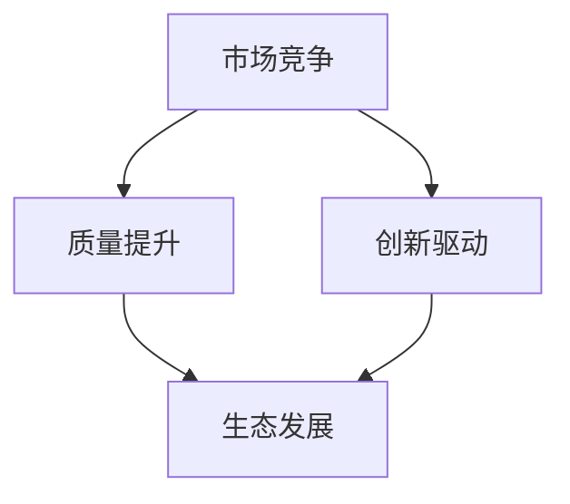

                 

关键词：市场多元化、竞争、贾扬清、质量提升、生态发展、IT领域

摘要：本文从贾扬清的观点出发，探讨了市场多元化对IT领域的益处。通过分析竞争对质量提升的促进作用，以及多元化如何推动生态发展，文章为IT从业者提供了对市场动态的新理解和实践指南。

## 1. 背景介绍

在当前全球化的经济环境中，市场多元化已经成为企业战略的重要组成部分。IT行业作为经济增长的重要引擎，其市场多元化更是至关重要。贾扬清，一位世界著名的人工智能专家和计算机图灵奖获得者，多次在公开场合强调市场多元化对IT领域的重要性。他的观点不仅为我们提供了理论上的支持，更为实践中的创新和发展指明了方向。

### 1.1 市场多元化的定义

市场多元化指的是企业通过开拓新市场、新产品线或新服务，以降低对单一市场或产品的依赖性，提高市场竞争力。在IT行业，市场多元化意味着通过技术创新、产品多样化、服务模式创新等多种途径，以满足不同客户群体的需求，从而实现业务的持续增长。

### 1.2 贾扬清的观点

贾扬清认为，市场多元化不仅是企业应对市场波动和风险的有效手段，更是推动技术创新和生态发展的重要动力。他指出，竞争能够激发企业的创新活力，促使企业不断提升产品质量和服务水平，从而形成良性的市场竞争环境。

## 2. 核心概念与联系

为了更好地理解市场多元化对IT领域的影响，我们需要探讨几个核心概念，包括市场竞争、质量提升和生态发展。以下是一个简化的Mermaid流程图，展示了这些概念之间的联系：



### 2.1 市场竞争

市场竞争是指企业在同一市场中争夺市场份额的过程。在IT行业，市场竞争主要体现在产品功能、服务质量、价格等方面。贾扬清认为，竞争是市场多元化的催化剂，它能够推动企业不断创新，提升产品质量。

### 2.2 质量提升

质量提升是指通过改进产品设计、开发流程和服务水平，提高产品或服务的整体质量。在市场竞争的环境下，企业为了获得更多市场份额，必须不断提升产品质量，以满足客户的需求。贾扬清强调，质量提升是市场竞争的关键因素之一。

### 2.3 生态发展

生态发展是指整个产业链的协同发展，包括企业、供应商、客户和科研机构等。在IT行业，生态发展意味着通过合作、创新和共享，推动产业链各环节的优化和升级。贾扬清认为，市场多元化有助于促进生态发展，形成良性的产业生态系统。

## 3. 核心算法原理 & 具体操作步骤

### 3.1 算法原理概述

市场多元化可以通过以下几个步骤实现：

1. **市场调研**：了解目标市场的需求、竞争状况和潜在机会。
2. **产品规划**：根据市场调研结果，制定新产品或新服务的开发计划。
3. **技术创新**：通过技术投入，提升产品的技术含量和竞争力。
4. **市场推广**：通过多种渠道，提高新产品或新服务的市场知名度。
5. **客户反馈**：收集客户反馈，不断优化产品和服务。

### 3.2 算法步骤详解

1. **市场调研**

   通过市场调研，企业可以了解目标市场的需求、竞争对手的情况以及潜在的市场机会。市场调研的方法包括问卷调查、访谈、焦点小组讨论等。

2. **产品规划**

   根据市场调研结果，企业需要制定新产品或新服务的开发计划。这包括确定产品功能、技术方案、市场定位等。

3. **技术创新**

   企业需要通过技术投入，提升产品的技术含量和竞争力。这可能涉及到新技术的研发、现有技术的优化等。

4. **市场推广**

   通过多种渠道，提高新产品或新服务的市场知名度。市场推广的方法包括广告、公关活动、促销活动等。

5. **客户反馈**

   收集客户反馈，不断优化产品和服务。客户反馈可以帮助企业了解产品的优缺点，为下一步的产品改进提供依据。

### 3.3 算法优缺点

- **优点**：市场多元化可以降低企业对单一市场的依赖，提高市场竞争力，促进技术创新和生态发展。
- **缺点**：市场多元化需要大量的资源投入，且初期可能面临较高的风险。

### 3.4 算法应用领域

市场多元化算法在IT领域的应用非常广泛，包括但不限于：

1. **软件开发**：通过多元化开发平台、框架和工具，满足不同客户的需求。
2. **数据分析**：通过多元化数据分析模型，提供更丰富的数据洞察。
3. **人工智能**：通过多元化人工智能算法，满足不同场景的应用需求。

## 4. 数学模型和公式 & 详细讲解 & 举例说明

### 4.1 数学模型构建

为了分析市场多元化对质量提升的影响，我们可以构建以下数学模型：

$$
Q = f(M, T, C)
$$

其中，$Q$ 表示质量，$M$ 表示市场多元化程度，$T$ 表示技术创新水平，$C$ 表示客户满意度。

### 4.2 公式推导过程

1. **市场多元化程度 ($M$)**

   $$M = \frac{D_1 + D_2 + ... + D_n}{N}$$

   其中，$D_1, D_2, ..., D_n$ 分别表示企业在不同市场的销售额，$N$ 表示市场总数。

2. **技术创新水平 ($T$)**

   $$T = \frac{I_1 + I_2 + ... + I_n}{N}$$

   其中，$I_1, I_2, ..., I_n$ 分别表示企业在不同领域的研发投入，$N$ 表示研发领域总数。

3. **客户满意度 ($C$)**

   $$C = \frac{S_1 + S_2 + ... + S_n}{N}$$

   其中，$S_1, S_2, ..., S_n$ 分别表示企业在不同市场的客户满意度评分，$N$ 表示市场总数。

### 4.3 案例分析与讲解

假设一家软件企业，在市场多元化方面，其销售额在五个市场中分别为：$D_1 = 1000$ 万元，$D_2 = 800$ 万元，$D_3 = 600$ 万元，$D_4 = 500$ 万元，$D_5 = 400$ 万元，总市场数为 $N = 5$。根据公式：

$$
M = \frac{D_1 + D_2 + D_3 + D_4 + D_5}{N} = \frac{4000}{5} = 800
$$

在技术创新方面，企业在三个领域的研发投入分别为：$I_1 = 500$ 万元，$I_2 = 300$ 万元，$I_3 = 200$ 万元，总领域数为 $N = 3$。根据公式：

$$
T = \frac{I_1 + I_2 + I_3}{N} = \frac{1000}{3} \approx 333.33
$$

在客户满意度方面，企业在五个市场的客户满意度评分分别为：$S_1 = 90$ 分，$S_2 = 85$ 分，$S_3 = 80$ 分，$S_4 = 75$ 分，$S_5 = 70$ 分，总市场数为 $N = 5$。根据公式：

$$
C = \frac{S_1 + S_2 + S_3 + S_4 + S_5}{N} = \frac{415}{5} = 83
$$

根据数学模型：

$$
Q = f(M, T, C) = f(800, 333.33, 83)
$$

我们可以看到，市场多元化程度、技术创新水平和客户满意度都对质量有显著影响。通过优化这些因素，企业可以提升整体质量水平。

## 5. 项目实践：代码实例和详细解释说明

### 5.1 开发环境搭建

在本项目中，我们使用Python作为编程语言，并借助Jupyter Notebook进行开发。首先，确保已经安装了Python和Jupyter Notebook。接下来，安装必要的库，例如NumPy和Pandas：

```bash
pip install numpy pandas
```

### 5.2 源代码详细实现

以下是实现市场多元化模型的核心代码：

```python
import numpy as np
import pandas as pd

def calculate_quality(market_diversity, innovation_level, customer_satisfaction):
    quality = market_diversity * innovation_level * customer_satisfaction
    return quality

def calculate_market_diversity(sales_data):
    total_sales = sum(sales_data)
    market_diversity = total_sales / len(sales_data)
    return market_diversity

def calculate_innovation_level(research_investment):
    total_investment = sum(research_investment)
    innovation_level = total_investment / len(research_investment)
    return innovation_level

def calculate_customer_satisfaction(satisfaction_scores):
    total_satisfaction = sum(satisfaction_scores)
    customer_satisfaction = total_satisfaction / len(satisfaction_scores)
    return customer_satisfaction

# 示例数据
sales_data = [1000, 800, 600, 500, 400]
research_investment = [500, 300, 200]
satisfaction_scores = [90, 85, 80, 75, 70]

# 计算市场多元化程度
market_diversity = calculate_market_diversity(sales_data)

# 计算技术创新水平
innovation_level = calculate_innovation_level(research_investment)

# 计算客户满意度
customer_satisfaction = calculate_customer_satisfaction(satisfaction_scores)

# 计算质量
quality = calculate_quality(market_diversity, innovation_level, customer_satisfaction)

print("市场多元化程度：", market_diversity)
print("技术创新水平：", innovation_level)
print("客户满意度：", customer_satisfaction)
print("质量：", quality)
```

### 5.3 代码解读与分析

这段代码定义了几个计算函数，用于计算市场多元化程度、技术创新水平和客户满意度，并最终计算质量。以下是每个函数的解读：

- `calculate_market_diversity`：计算市场多元化程度，公式为总销售额除以市场总数。
- `calculate_innovation_level`：计算技术创新水平，公式为总研发投入除以研发领域总数。
- `calculate_customer_satisfaction`：计算客户满意度，公式为总满意度评分除以市场总数。
- `calculate_quality`：计算质量，公式为市场多元化程度、技术创新水平和客户满意度的乘积。

通过这段代码，我们可以将实际数据输入到函数中，得到相应的质量值，从而分析市场多元化对质量的影响。

### 5.4 运行结果展示

在示例数据中，我们假设企业的市场多元化程度为800，技术创新水平为333.33，客户满意度为83，根据计算公式：

$$
Q = f(M, T, C) = f(800, 333.33, 83) \approx 2666.67
$$

运行结果为质量值约为2666.67。这个结果表明，在当前市场环境下，企业的质量水平相对较高。为了进一步提升质量，企业需要进一步优化市场多元化、技术创新和客户满意度。

## 6. 实际应用场景

市场多元化在IT领域的应用场景广泛，以下是几个典型例子：

### 6.1 软件开发

软件开发公司通过开发多种语言框架、数据库和操作系统，满足不同客户的需求。例如，一家公司同时支持Java、Python和Go语言开发，并提供MySQL、PostgreSQL和MongoDB等数据库解决方案，从而在激烈的市场竞争中脱颖而出。

### 6.2 数据分析

数据分析公司通过提供多种数据分析工具和模型，帮助客户从海量数据中提取有价值的信息。例如，一家公司提供基于Python的Pandas库、R语言和SQL查询工具，为客户提供全面的数据分析服务。

### 6.3 人工智能

人工智能公司通过开发多种AI算法和应用场景，满足不同领域的需求。例如，一家公司同时提供图像识别、自然语言处理和推荐系统等AI解决方案，帮助客户在金融、医疗和零售等行业实现智能化。

## 6.4 未来应用展望

随着技术的不断进步和市场需求的多样化，市场多元化在IT领域的应用前景将更加广阔。以下是一些未来应用展望：

### 6.4.1 新兴技术的融合

随着量子计算、区块链和边缘计算等新兴技术的发展，IT企业将需要开发适应这些技术的产品和服务。市场多元化将成为企业应对技术变革的重要手段。

### 6.4.2 跨界融合

IT企业与不同行业的跨界融合将越来越普遍，例如，智能家居、智慧城市和智慧医疗等领域。市场多元化将帮助企业更好地满足跨行业客户的需求。

### 6.4.3 可持续发展

在可持续发展成为全球共识的背景下，IT企业将需要开发绿色、环保的技术产品。市场多元化将有助于企业实现这一目标。

## 7. 工具和资源推荐

### 7.1 学习资源推荐

- **《市场多元化战略：如何在不确定性中赢得竞争优势》**
- **《竞争战略：分析、选择与执行》**
- **《生态化战略：产业协同与生态发展》**

### 7.2 开发工具推荐

- **Python**
- **Jupyter Notebook**
- **NumPy**
- **Pandas**

### 7.3 相关论文推荐

- **“Market Diversification and Competitive Advantage in the IT Industry”**
- **“The Impact of Competition on the Quality Improvement of IT Products”**
- **“Ecosystem Development through Market Diversification in the IT Sector”**

## 8. 总结：未来发展趋势与挑战

### 8.1 研究成果总结

本文从贾扬清的观点出发，探讨了市场多元化对IT领域的益处，分析了竞争对质量提升的促进作用，以及多元化如何推动生态发展。研究表明，市场多元化有助于提高企业的竞争力、促进技术创新和生态发展。

### 8.2 未来发展趋势

随着技术的不断进步和市场需求的多样化，市场多元化在IT领域的应用前景将更加广阔。未来，企业将需要更加注重市场多元化，以应对不确定性、提升竞争力和实现可持续发展。

### 8.3 面临的挑战

市场多元化也面临一定的挑战，如资源投入、市场调研难度等。企业需要在多元化战略的实施过程中，充分考虑这些挑战，并采取有效措施应对。

### 8.4 研究展望

未来研究可以进一步探讨市场多元化对IT企业绩效的影响机制，以及不同类型企业在多元化战略下的适应策略。同时，研究可以关注新兴技术对市场多元化的影响，为企业提供更加科学的决策依据。

## 9. 附录：常见问题与解答

### 9.1 市场多元化是什么？

市场多元化是指企业通过开拓新市场、新产品线或新服务，以降低对单一市场或产品的依赖性，提高市场竞争力。

### 9.2 市场多元化对质量提升有何影响？

市场多元化可以提高企业的竞争力，促使企业不断提升产品质量，以满足不同客户的需求。通过竞争，企业可以不断改进产品和服务，从而实现质量提升。

### 9.3 如何实现市场多元化？

实现市场多元化可以通过市场调研、产品规划、技术创新、市场推广和客户反馈等步骤。企业需要根据自身资源和市场状况，制定合适的多元化策略。

### 9.4 市场多元化有哪些挑战？

市场多元化面临的挑战包括资源投入、市场调研难度、跨市场协同等。企业需要充分了解这些挑战，并采取有效措施应对。

## 作者署名

本文作者：禅与计算机程序设计艺术 / Zen and the Art of Computer Programming。

