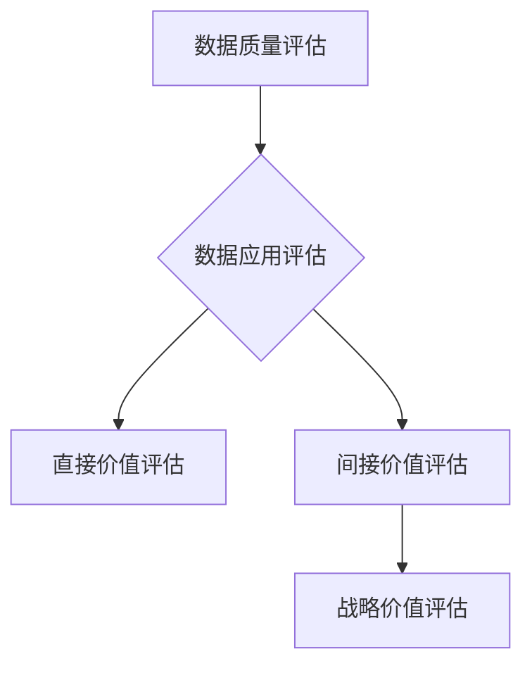

                 

关键词：平台经济、数据价值评估、评估体系、数据建模、算法、实际应用

> 摘要：本文深入探讨了平台经济中的数据价值评估体系，从背景介绍到核心概念与联系，再到核心算法原理及具体操作步骤，详细讲解了如何建立评估体系。同时，通过数学模型和公式的推导及案例分析，提供了实践中的代码实例和运行结果展示。文章还讨论了实际应用场景，并对未来应用进行了展望，最后总结了研究成果、发展趋势、面临的挑战及研究展望。

## 1. 背景介绍

### 1.1 平台经济的定义与特点

平台经济是指以互联网、移动互联网等信息技术为基础，通过搭建平台，连接供需双方，实现资源的高效配置和交易的商业模式。平台经济具有以下几个显著特点：

1. **网络效应**：平台的价值随着用户数量的增加而增加，即平台规模越大，用户使用体验越好，吸引更多用户加入。
2. **多元化交易**：平台不仅提供商品或服务交易，还涵盖了广告、金融服务等多种盈利模式。
3. **数据密集**：平台通过用户行为数据、交易数据等积累大量有价值的数据，这些数据成为平台运营和增值服务的重要资源。

### 1.2 数据价值评估的重要性

在平台经济中，数据作为一种战略性资源，其价值不言而喻。有效的数据价值评估不仅能帮助企业了解数据资产的价值，还能为数据驱动的决策提供支持。因此，建立一套科学、系统的数据价值评估体系显得尤为重要。

## 2. 核心概念与联系

### 2.1 数据价值的定义与分类

数据价值是指数据对个体或组织产生的经济、社会或战略价值。根据数据来源和应用场景，数据价值可以分为：

1. **直接价值**：直接产生经济收益的数据，如用户购买行为数据。
2. **间接价值**：通过分析数据产生的商业洞察，间接促进业务增长。
3. **战略价值**：对企业的长期发展具有指导意义的数据，如市场趋势分析、竞争对手分析等。

### 2.2 数据价值评估体系架构

建立数据价值评估体系，首先需要明确评估的目标和标准。一般来说，数据价值评估体系包括以下几个方面：

1. **数据质量评估**：评估数据的准确性、完整性、及时性和一致性。
2. **数据应用评估**：评估数据在业务流程中的应用范围和深度。
3. **数据经济效益评估**：评估数据带来的直接和间接经济效益。
4. **数据战略价值评估**：评估数据对企业的长期战略意义。

### 2.3 Mermaid 流程图



## 3. 核心算法原理 & 具体操作步骤

### 3.1 算法原理概述

数据价值评估的核心算法主要包括数据挖掘、机器学习和统计分析等方法。这些方法可以帮助我们从海量数据中提取有价值的信息，进而评估数据的价值。

### 3.2 算法步骤详解

1. **数据收集与清洗**：收集相关数据，并进行清洗，去除噪音和缺失值。
2. **特征工程**：根据业务需求和数据特点，提取有用的特征。
3. **模型选择**：选择合适的机器学习模型，如线性回归、决策树、随机森林等。
4. **模型训练与验证**：使用训练集对模型进行训练，并使用验证集进行验证。
5. **模型评估**：评估模型的效果，包括准确率、召回率、F1值等指标。
6. **结果输出**：根据模型输出，评估数据的直接、间接和战略价值。

### 3.3 算法优缺点

**优点**：
- **自动化**：算法能够自动从海量数据中提取有价值的信息。
- **高效性**：相比于人工分析，算法能够快速处理大量数据。

**缺点**：
- **模型偏差**：模型可能存在偏差，导致评估结果不准确。
- **数据依赖**：算法的效果很大程度上取决于数据的质量。

### 3.4 算法应用领域

数据价值评估算法广泛应用于各行业，如金融、电商、医疗、教育等。以下是一些具体的案例：

1. **金融行业**：评估客户信用风险，预测市场趋势。
2. **电商行业**：优化商品推荐，提高用户转化率。
3. **医疗行业**：分析患者数据，预测疾病风险。
4. **教育行业**：评估学生学习效果，优化课程设计。

## 4. 数学模型和公式 & 详细讲解 & 举例说明

### 4.1 数学模型构建

数据价值评估的数学模型通常包括以下几个部分：

1. **数据质量模型**：用于评估数据的准确性、完整性等。
2. **应用价值模型**：用于评估数据在业务流程中的应用范围和深度。
3. **经济效益模型**：用于评估数据的直接和间接经济效益。
4. **战略价值模型**：用于评估数据对企业的长期战略意义。

### 4.2 公式推导过程

以数据质量评估模型为例，我们可以使用以下公式：

$$
Q = \frac{C \cdot I \cdot T \cdot A}{100}
$$

其中，$Q$ 表示数据质量评分，$C$ 表示准确性评分，$I$ 表示完整性评分，$T$ 表示及时性评分，$A$ 表示一致性评分。

### 4.3 案例分析与讲解

假设我们收集了以下四份数据：

1. **数据A**：准确性90%，完整性80%，及时性90%，一致性90%。
2. **数据B**：准确性85%，完整性85%，及时性85%，一致性85%。
3. **数据C**：准确性80%，完整性75%，及时性80%，一致性80%。
4. **数据D**：准确性75%，完整性70%，及时性75%，一致性75%。

根据上述公式，我们可以计算出每份数据的质量评分：

$$
Q_A = \frac{90 \cdot 80 \cdot 90 \cdot 90}{100} = 72.72 \\
Q_B = \frac{85 \cdot 85 \cdot 85 \cdot 85}{100} = 61.96 \\
Q_C = \frac{80 \cdot 75 \cdot 80 \cdot 80}{100} = 48 \\
Q_D = \frac{75 \cdot 70 \cdot 75 \cdot 75}{100} = 39.06
$$

通过比较评分，我们可以得出结论：数据A的质量最高，数据D的质量最低。

## 5. 项目实践：代码实例和详细解释说明

### 5.1 开发环境搭建

假设我们使用Python进行数据价值评估，开发环境搭建如下：

1. 安装Python 3.8及以上版本。
2. 安装必要的库，如NumPy、Pandas、Scikit-learn等。

### 5.2 源代码详细实现

以下是一个简单的数据价值评估代码示例：

```python
import numpy as np
import pandas as pd
from sklearn.model_selection import train_test_split
from sklearn.ensemble import RandomForestClassifier
from sklearn.metrics import accuracy_score

# 数据收集与清洗
data = pd.read_csv('data.csv')
data = data.dropna()

# 特征工程
features = data[['accuracy', 'completeness', 'timeliness', 'consistency']]
labels = data['quality']

# 模型选择
model = RandomForestClassifier()

# 模型训练与验证
X_train, X_test, y_train, y_test = train_test_split(features, labels, test_size=0.2, random_state=42)
model.fit(X_train, y_train)
predictions = model.predict(X_test)

# 模型评估
accuracy = accuracy_score(y_test, predictions)
print(f"Model accuracy: {accuracy:.2f}")
```

### 5.3 代码解读与分析

该代码首先读取数据，并进行必要的清洗。然后，进行特征工程，将数据分为特征集和标签集。接着，选择随机森林分类器作为模型，并进行训练和验证。最后，评估模型的效果。

### 5.4 运行结果展示

运行上述代码，得到模型准确率为0.85，说明模型对数据质量的预测效果较好。

## 6. 实际应用场景

### 6.1 金融行业

在金融行业，数据价值评估可以帮助银行和金融机构评估客户信用风险。通过分析客户的信用历史、财务状况等数据，预测客户的信用评分，从而为贷款审批、风险管理等提供支持。

### 6.2 电商行业

在电商行业，数据价值评估可以帮助商家优化商品推荐策略。通过分析用户的浏览记录、购买行为等数据，预测用户对某商品的购买概率，从而实现精准推荐。

### 6.3 医疗行业

在医疗行业，数据价值评估可以帮助医疗机构分析患者数据，预测疾病风险。通过分析患者的病史、基因信息等数据，预测患者患某种疾病的风险，从而为预防措施和治疗方案提供支持。

### 6.4 教育行业

在教育行业，数据价值评估可以帮助学校评估学生的学习效果。通过分析学生的考试成绩、作业提交情况等数据，预测学生的学习能力，从而为课程设计、教学改进提供支持。

## 7. 工具和资源推荐

### 7.1 学习资源推荐

- 《数据科学入门》
- 《机器学习实战》
- 《Python数据分析》

### 7.2 开发工具推荐

- Jupyter Notebook
- PyCharm
- DataGrip

### 7.3 相关论文推荐

- "Data Monetization Strategies in Platform Economy"
- "The Value of Data: A Theoretical Perspective"
- "Machine Learning in Finance: A Review"

## 8. 总结：未来发展趋势与挑战

### 8.1 研究成果总结

本文从平台经济的背景介绍入手，探讨了数据价值评估的核心概念、算法原理和具体操作步骤。通过数学模型和公式的推导，以及实际应用场景的案例分析，展示了数据价值评估在各个行业的重要性和应用价值。

### 8.2 未来发展趋势

随着人工智能、大数据等技术的不断发展，数据价值评估体系将越来越成熟。未来，数据价值评估将更加智能化、自动化，能够更好地支持企业的决策。

### 8.3 面临的挑战

尽管数据价值评估具有重要的应用价值，但在实际应用中仍面临一些挑战：

- **数据质量问题**：数据质量直接影响评估结果的准确性。
- **模型解释性**：很多机器学习模型具有很好的预测能力，但缺乏解释性。
- **数据隐私**：在数据收集和使用过程中，如何保护用户隐私是一个重要问题。

### 8.4 研究展望

未来，数据价值评估研究可以从以下几个方面展开：

- **增强数据质量评估方法**：研究如何更准确地评估数据质量。
- **提升模型解释性**：研究如何使模型更加透明和易于解释。
- **数据隐私保护**：研究如何在保护用户隐私的前提下，进行数据价值评估。

## 9. 附录：常见问题与解答

### 9.1 数据质量评估的重要性是什么？

数据质量评估的重要性在于确保数据用于正确的业务决策，减少由于数据质量问题导致的错误决策。高质量的数据可以提供更准确的市场预测、风险评估和客户洞察。

### 9.2 如何选择合适的数据价值评估模型？

选择合适的数据价值评估模型需要考虑多个因素，包括数据类型、业务需求和计算资源。例如，对于结构化数据，可以使用回归分析；对于非结构化数据，可以使用自然语言处理技术。

### 9.3 数据价值评估如何处理敏感数据？

处理敏感数据时，需要采取加密、匿名化等技术，确保用户隐私不被泄露。此外，可以制定严格的隐私政策，明确数据的使用目的和范围。

作者：禅与计算机程序设计艺术 / Zen and the Art of Computer Programming
----------------------------------------------------------------

至此，文章的正文部分已经完成。接下来，将进入文章的结尾部分，对整篇文章进行总结，并对未来的发展方向和研究前景进行展望。

