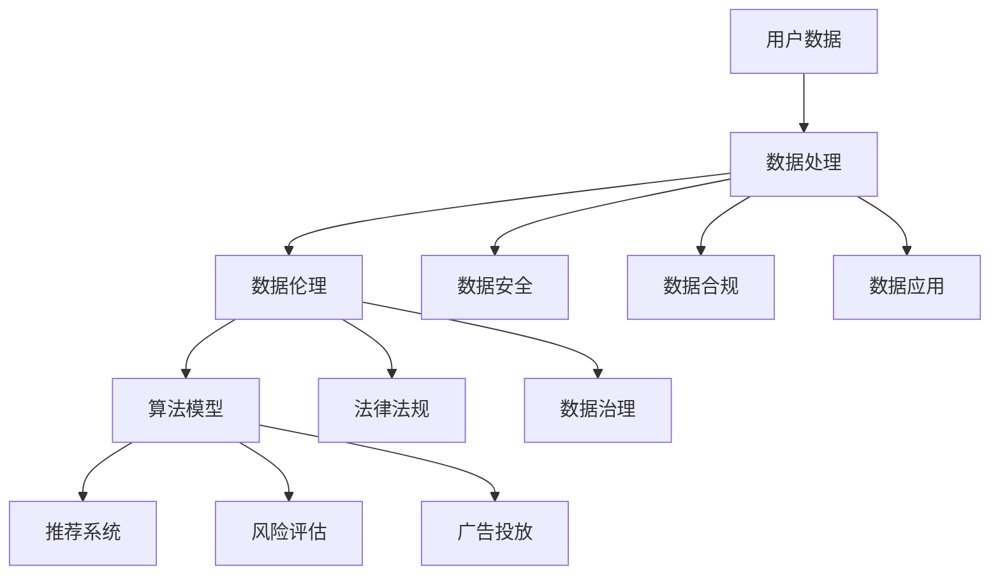

                 

### 摘要

平台经济作为现代经济的核心驱动力，正迅速改变着商业和社会的运作方式。然而，随着平台经济的蓬勃发展，数据伦理困境逐渐浮出水面，成为社会各界广泛关注的问题。本文旨在探讨平台经济中数据伦理困境的本质、影响因素及解决方案。通过对核心概念的深入剖析，算法原理的详细讲解，数学模型的构建与公式推导，项目实践中的代码实例分析，以及实际应用场景的展望，本文将提供一系列有针对性的建议，以期推动平台经济数据伦理的健康发展。

## 1. 背景介绍

### 平台经济的兴起

平台经济，亦称为共享经济或协作经济，是指通过互联网平台，连接供需双方，实现资源共享和交易的一种新型经济模式。这种模式的核心在于打破了传统经济模式中供需双方的隔离，通过技术手段降低了交易成本，提升了资源配置效率。平台经济的代表如Uber、Airbnb等，已经深刻影响了交通、住宿、餐饮等多个行业。

随着移动互联网、大数据、云计算等技术的快速发展，平台经济得到了迅速扩张。平台企业通过大量用户数据的积累和分析，不断优化服务，提高用户体验，从而在市场中占据越来越大的份额。平台经济的兴起不仅改变了传统商业模式，也为经济增长带来了新的动力。

### 数据伦理困境的凸显

然而，随着平台经济的快速发展，数据伦理困境也逐渐凸显出来。平台企业为了获取竞争优势，往往需要大量收集用户数据，但这些数据的使用和处理往往伴随着隐私泄露、数据滥用、算法歧视等问题。

#### 隐私泄露

隐私泄露是平台经济中最为常见的数据伦理问题之一。平台企业通过收集用户的个人信息、消费行为、社交关系等数据，为用户提供个性化服务。然而，这些数据一旦泄露，可能会被不法分子利用，导致用户隐私受到严重侵犯。

#### 数据滥用

平台企业收集的用户数据不仅用于优化服务，还可能被用于商业推广、市场分析等目的。如果这些数据被滥用，可能会导致用户利益受损，甚至引发社会不公平现象。

#### 算法歧视

算法歧视是指平台企业在算法设计、数据分析过程中，无意或有意识地歧视某些用户群体。例如，一些平台在推荐系统中，可能会优先推荐某些商品或服务，导致其他用户无法获得公平的机会。

#### 数据治理挑战

平台经济中的数据治理也是一个严峻的挑战。由于数据量大、种类繁多，平台企业需要建立完善的数据治理体系，确保数据的安全、合规和有效利用。然而，在实践中，许多平台企业并未充分认识到数据治理的重要性，导致数据管理混乱、风险隐患增多。

### 本文结构

本文将首先介绍平台经济中数据伦理困境的核心概念，并通过Mermaid流程图展示相关架构。接下来，我们将深入分析核心算法原理，详细讲解具体操作步骤，并评估其优缺点及应用领域。随后，我们将构建数学模型，推导相关公式，并通过实际案例进行讲解。然后，本文将提供项目实践中的代码实例和详细解释，展示平台经济数据伦理困境的实际应对策略。最后，我们将探讨平台经济的实际应用场景，展望未来发展趋势，并推荐相关工具和资源。通过这些内容，本文希望为解决平台经济数据伦理困境提供有价值的思路和方案。

### 1.1 平台经济的定义和特点

平台经济，作为一种新型的商业模式，其核心在于通过搭建一个连接供需双方的中间平台，实现资源的高效配置和优化利用。这个平台不仅提供了交易的基础设施，还通过数据和技术手段，增强了交易的透明度和便利性。平台经济的定义可以简单概括为：通过互联网和信息技术，搭建一个中介平台，促进多方用户之间直接交易和互动的一种经济模式。

平台经济的特点主要体现在以下几个方面：

#### 连接性和开放性

平台经济的第一个特点是连接性和开放性。平台企业通过互联网技术，打破了传统经济模式中供需双方的隔离，实现了全球范围内的资源连接和互动。用户可以在平台上自由地发布需求，提供商品或服务，从而扩大了市场的边界。同时，平台的开放性也使得各种资源和信息得以自由流通，促进了创新和竞争。

#### 数据驱动

平台经济的第二个特点是数据驱动。平台企业通过收集和分析用户数据，了解用户需求、行为和偏好，从而不断优化服务和用户体验。数据成为平台企业决策和运营的核心驱动力，使得平台能够更加精准地匹配供需，提高资源利用效率。此外，数据驱动也使得平台能够通过机器学习和人工智能技术，实现智能化运营和管理。

#### 高效性和灵活性

平台经济的第三个特点是高效性和灵活性。通过互联网和信息技术，平台企业能够以较低的成本和较高的效率，实现交易和服务的快速交付。例如，在线预订系统可以实时更新航班和酒店信息，用户可以随时查询和预订，而无需受到地理位置的限制。此外，平台的灵活性使得企业能够快速响应市场变化，调整策略和服务，以适应不断变化的需求。

#### 共享性和可持续性

平台经济的第四个特点是共享性和可持续性。平台经济通过共享资源和降低闲置率，实现了资源的最大化利用。例如，共享单车和共享汽车等模式，通过共享闲置的交通工具，提高了资源利用效率，减少了浪费。同时，平台经济也推动了可持续发展，通过减少资源消耗和碳排放，实现了环境友好型的经济发展。

#### 生态化发展

平台经济的最后一个特点是生态化发展。平台企业不仅关注自身的业务发展，还致力于构建一个生态化的产业环境。平台通过开放API接口，与其他企业和服务提供商进行合作，形成一个互利共生的生态系统。这个生态系统不仅有助于平台企业的长期发展，也为整个行业带来了创新和增长的机会。

总的来说，平台经济作为一种新兴的经济模式，通过连接性、开放性、数据驱动、高效性、灵活性、共享性和可持续性等特点，为现代经济带来了深远的影响。然而，随着平台经济的快速发展，数据伦理困境也逐渐凸显出来，成为社会各界关注的焦点。

### 1.2 数据伦理困境的核心概念

在探讨平台经济中的数据伦理困境时，我们首先需要理解几个核心概念：隐私、数据所有权、算法透明性和数据安全。

#### 隐私

隐私是指个人对其自身信息、行为和生活的控制权利。在平台经济中，用户的隐私主要体现在个人信息、消费行为、社交关系等方面。平台企业通过数据收集和分析，获取了大量用户的隐私信息，以便提供个性化的服务和优化用户体验。然而，隐私泄露的风险也随之增加。平台企业若未能妥善保护用户隐私，可能导致用户的个人信息被滥用或泄露，严重损害用户的信任和权益。

#### 数据所有权

数据所有权是指数据产生的权利和利益归属。在平台经济中，用户数据通常被视为平台企业的资产。然而，用户对于自身数据是否拥有所有权，以及如何管理和使用这些数据，存在争议。一些观点认为，用户应拥有对自己数据的完全控制权，平台企业只能在其授权的范围内使用数据。而另一些观点则认为，平台企业作为数据的收集者和分析者，应拥有数据所有权，以便更好地利用数据为用户提供服务。

#### 算法透明性

算法透明性是指算法的运作过程和决策逻辑应公开透明，便于用户理解和监督。在平台经济中，算法广泛应用于推荐系统、风险评估、广告投放等环节。然而，算法的复杂性和不透明性使得用户难以了解其背后的决策逻辑，可能导致算法歧视、偏见等问题。例如，一些推荐系统可能会基于用户的性别、年龄、种族等特征进行推荐，如果算法透明性不足，用户难以知道这些推荐背后的原因，从而引发伦理争议。

#### 数据安全

数据安全是指保护数据免受未经授权的访问、泄露、篡改和破坏。在平台经济中，用户数据的安全至关重要。平台企业需要采取一系列技术和管理措施，确保数据的安全和完整性。然而，随着数据量的不断增加和复杂性的提升，数据安全面临巨大的挑战。网络攻击、数据泄露、黑客入侵等问题时有发生，严重威胁到用户数据的安全。

这些核心概念相互关联，共同构成了平台经济数据伦理困境的复杂背景。隐私和数据所有权关乎用户的权利和利益，算法透明性涉及算法公正性和公平性，数据安全则是保障隐私和数据所有权的基础。在接下来的章节中，我们将进一步探讨这些概念在平台经济中的应用和挑战，并提出相应的解决方案。

### 1.3 平台经济中的数据伦理困境

平台经济在带来便利和效率的同时，也引发了诸多数据伦理困境，这些问题不仅影响到用户权益，也对平台企业的长期发展构成威胁。以下将从隐私泄露、数据滥用、算法歧视、数据治理四个方面详细探讨这些困境。

#### 隐私泄露

隐私泄露是平台经济中最常见且严重的数据伦理问题之一。平台企业通过收集用户的个人信息、消费行为、社交关系等数据，以提供个性化的服务和优化用户体验。然而，这些数据一旦泄露，可能导致严重的后果。首先，个人信息的泄露会导致用户的隐私权受到侵害，例如，用户的名字、住址、电话号码等敏感信息被公开或被不法分子利用进行诈骗。其次，消费行为的泄露会威胁到用户的财务安全，例如，用户的信用卡信息、交易记录等被非法获取，可能导致资金损失。此外，社交关系的泄露也会对用户的生活造成困扰，例如，用户的社交媒体账号被恶意攻击，个人隐私被公开或泄露。

#### 数据滥用

数据滥用是指平台企业在收集用户数据后，未能妥善管理和使用这些数据，导致用户利益受损甚至社会不公平现象。数据滥用主要表现在以下几个方面：首先，平台企业可能会将用户数据用于商业推广，通过精准广告投放获取高额利润，而忽略用户的隐私权和选择权。例如，一些平台在用户不知情的情况下，将用户数据出售给第三方广告商，进行广告精准投放，这可能导致用户受到大量不相关的广告骚扰。其次，平台企业可能会滥用用户数据进行分析和决策，导致用户被歧视或被错误评估。例如，一些招聘平台可能会根据用户的历史行为数据来评估其就业能力，从而拒绝一些符合岗位要求但数据表现不佳的应聘者，导致就业机会的不公平分配。

#### 算法歧视

算法歧视是指平台企业在其算法设计和数据分析过程中，无意或有意识地歧视某些用户群体，导致不公平现象。算法歧视的问题主要表现在以下几个方面：首先，推荐系统中的偏见可能导致某些用户被屏蔽或排斥，无法获得公平的机会。例如，某些平台在推荐商品或服务时，可能会根据用户的性别、年龄、种族等特征进行偏好性推荐，从而使得某些用户无法获得平等的购物或消费机会。其次，风险评估系统中的歧视可能导致某些用户被错误评估，影响其信用和贷款能力。例如，某些金融机构可能会根据用户的消费习惯、收入水平等数据来评估其信用风险，而对某些特定群体（如低收入人群）采取歧视性政策。

#### 数据治理挑战

数据治理是指平台企业对数据的收集、存储、处理、使用等环节进行有效管理，确保数据的安全、合规和有效利用。在平台经济中，数据治理面临诸多挑战。首先，数据量大且种类繁多，平台企业需要建立高效的数据管理体系，确保数据的完整性、准确性和及时性。然而，许多平台企业尚未建立完善的数据治理体系，导致数据管理混乱、风险隐患增多。其次，数据隐私和安全问题需要平台企业采取一系列技术和管理措施来保障。例如，数据加密、访问控制、审计追踪等手段可以有效提高数据安全性，但需要大量的人力和物力投入。此外，数据治理还涉及到法律法规的遵守和合规性问题。随着数据隐私保护法律法规的不断完善，平台企业需要确保其数据处理行为符合相关法规要求，以避免法律风险。

综上所述，平台经济中的数据伦理困境主要包括隐私泄露、数据滥用、算法歧视和数据治理挑战。这些问题不仅威胁到用户的隐私权和权益，也对平台企业的声誉和长期发展构成潜在风险。因此，平台企业需要高度重视数据伦理问题，采取有效的措施应对这些困境，以实现可持续发展的目标。

### 1.4 平台经济中数据伦理困境的影响和后果

平台经济中数据伦理困境不仅对用户和个人造成直接损害，还可能对整个社会和经济体系产生深远影响。以下从用户权益、企业声誉、法律法规和社会公平四个方面详细分析这些问题的影响和后果。

#### 用户权益受损

首先，平台经济中的数据伦理困境对用户权益的损害是显而易见的。隐私泄露问题使得用户的个人信息可能被滥用，导致个人隐私权受到侵犯。用户在平台上的消费行为、地理位置、社交关系等数据，一旦被不法分子获取，可能被用于诈骗、恶意营销或其他非法活动。这种情况下，用户不仅可能面临经济损失，还可能遭受精神压力和隐私泄露的困扰。此外，数据滥用问题也可能导致用户在平台上受到不公平对待。例如，一些用户可能会因为某些数据特征（如年龄、性别、种族等）而受到算法歧视，无法获得平等的购物、消费或就业机会。这种数据滥用行为不仅损害了用户的权益，还可能导致社会不公平现象的加剧。

#### 企业声誉受损

数据伦理困境对企业声誉的损害同样不可忽视。在信息透明度日益提高的今天，一旦平台企业出现数据泄露、数据滥用或算法歧视等问题，很容易被媒体和公众曝光，导致企业形象受损。例如，2018年，Facebook的隐私泄露事件引发了全球范围内的大规模关注和批评，使得该公司在用户心中的信任度大幅下降。此外，数据伦理困境还可能引发用户对平台的抵制和抵制行为，导致用户流失和市场份额的下降。这种情况下，平台企业不仅需要承担法律和道德责任，还需要投入大量资源进行危机公关和形象重塑，以恢复公众信任。然而，这往往是一个长期且艰巨的过程。

#### 法律法规挑战

随着数据伦理问题的日益严重，各国政府开始加强对数据隐私和安全的监管。例如，欧盟推出的《通用数据保护条例》（GDPR）对企业的数据收集、存储和处理行为提出了严格的要求，违反规定的企业可能面临高额罚款。美国、中国等国家也相继出台了一系列数据隐私保护法律法规，对平台企业的数据处理行为进行规范。这些法律法规的出台，一方面旨在保护用户的隐私权和权益，另一方面也对企业提出了更高的合规要求。然而，对于许多平台企业来说，适应这些法律法规的挑战巨大。企业需要投入大量资源进行合规性评估和整改，否则可能面临法律风险和处罚。

#### 社会公平问题

平台经济中的数据伦理困境不仅影响个人和企业，还可能对整个社会产生不公平的影响。算法歧视问题就是一个典型的例子。如果算法在设计和应用过程中存在偏见，可能会导致某些特定群体（如低收入人群、少数族裔等）被不公平对待，从而加剧社会不平等现象。此外，数据滥用行为也可能导致资源分配不公。例如，一些平台企业可能会根据用户数据来调整服务价格，使得某些用户支付更高的费用，而其他用户则享受优惠。这种情况下，用户之间的利益分配将不再公平，可能引发社会矛盾和不满情绪。

总的来说，平台经济中的数据伦理困境对用户权益、企业声誉、法律法规和社会公平都产生了深远的影响。为了解决这些问题，平台企业需要采取积极的措施，建立完善的数据伦理体系，确保数据的安全、合规和有效利用。同时，政府和社会各界也需要共同努力，加强数据隐私保护立法和监管，推动平台经济健康可持续发展。

### 2. 核心概念与联系

在深入探讨平台经济中的数据伦理困境之前，我们需要了解几个核心概念，并展示它们之间的联系。通过一个详细的Mermaid流程图，我们将清晰地展示这些概念之间的交互关系和整体架构。

#### 核心概念

1. **用户数据**：指平台企业从用户处收集的各种信息，包括个人信息、消费行为、地理位置、社交关系等。
2. **数据处理**：指平台企业对收集到的数据进行存储、分析和应用的一系列操作。
3. **数据伦理**：指在数据处理过程中，如何平衡用户权益、企业利益和社会责任的问题。
4. **算法模型**：指用于分析和预测数据的数学模型，包括推荐算法、风险评估模型等。
5. **法律法规**：指保护用户隐私、规范数据处理行为的法律法规，如GDPR、CCPA等。
6. **数据治理**：指确保数据安全、合规和有效利用的一系列管理措施和流程。

#### Mermaid流程图

下面是一个用于展示核心概念之间联系的Mermaid流程图。请注意，流程节点中不应包含括号、逗号等特殊字符。



#### 核心概念之间的联系

1. **用户数据与数据处理**：用户数据是数据处理的基础，平台企业通过收集和分析用户数据，了解用户需求和行为，从而提供个性化的服务和优化用户体验。
2. **数据处理与数据伦理**：数据处理过程中，平台企业需要遵守数据伦理原则，确保用户隐私和数据安全，避免数据滥用和算法歧视。
3. **数据伦理与算法模型**：数据伦理是算法模型设计和应用的重要指导原则，算法模型应确保公平、透明和可解释，避免对特定用户群体产生偏见。
4. **数据伦理与法律法规**：数据伦理需遵循法律法规的要求，确保数据处理行为合规，避免法律风险。
5. **数据伦理与数据治理**：数据治理是落实数据伦理的关键手段，通过建立完善的数据治理体系，平台企业可以确保数据的安全、合规和有效利用。

通过这个Mermaid流程图，我们可以清晰地看到平台经济中各个核心概念之间的联系和交互关系，为后续内容的深入分析奠定了基础。

### 2.1 数据伦理困境的核心算法原理

在平台经济中，数据伦理困境不仅涉及数据的收集和管理，还与算法的设计和应用密切相关。理解算法原理对于应对数据伦理困境至关重要。以下将介绍几种常见的核心算法原理，并探讨其在平台经济中的应用。

#### 推荐算法

推荐算法是一种通过分析用户的历史行为和偏好，预测用户可能感兴趣的商品或服务的算法。其主要目的是提高用户满意度，增加平台的使用频率和黏性。推荐算法通常包括基于内容的推荐、协同过滤推荐和混合推荐等。

1. **基于内容的推荐**：该算法通过分析商品或服务的特征，将具有相似特征的物品推荐给用户。例如，如果一个用户喜欢阅读科幻小说，系统可能会推荐其他科幻小说。

2. **协同过滤推荐**：该算法通过分析用户之间的相似性，将其他用户喜欢的商品或服务推荐给目标用户。例如，如果一个用户喜欢某位艺人的歌曲，系统可能会推荐这位艺人其他歌曲。

3. **混合推荐**：结合基于内容和协同过滤推荐的优点，混合推荐可以提供更个性化的推荐结果。

在平台经济中，推荐算法广泛应用于电子商务、社交媒体、视频网站等领域。然而，推荐算法可能带来数据伦理问题，如算法偏见和用户隐私泄露。

#### 风险评估算法

风险评估算法用于预测用户行为风险，如信用风险、欺诈风险等。这些算法通常基于用户的消费行为、历史记录、社会关系等数据，通过统计模型或机器学习算法进行分析。

1. **统计模型**：如逻辑回归、决策树等，通过历史数据建立预测模型。

2. **机器学习算法**：如随机森林、神经网络等，通过学习大量数据，自动提取特征和规律。

风险评估算法在金融、保险、电商等领域有广泛应用。然而，风险评估算法可能导致算法歧视，不公平对待某些用户群体，如低收入人群或特定种族。

#### 广告投放算法

广告投放算法用于优化广告投放策略，提高广告点击率和转化率。这些算法通常基于用户的兴趣、行为、地理位置等数据，通过机器学习或深度学习技术进行广告投放。

1. **基于用户兴趣的投放**：根据用户的历史行为和偏好，将广告投放给对特定内容感兴趣的用户。

2. **基于地理位置的投放**：根据用户的地理位置，将广告投放给附近的用户。

3. **基于时序数据的投放**：根据用户的浏览历史和活动时间，优化广告投放策略。

广告投放算法在电子商务、在线媒体等领域广泛应用。然而，广告投放算法可能导致用户隐私泄露和数据滥用，如精准广告投放引发的用户反感。

#### 聊天机器人算法

聊天机器人算法通过自然语言处理技术，与用户进行对话，提供实时服务和支持。这些算法通常包括情感分析、意图识别、对话管理等功能。

1. **情感分析**：分析用户的语言表达，识别其情绪状态。

2. **意图识别**：识别用户的意图，如询问信息、寻求帮助、购买商品等。

3. **对话管理**：根据用户的输入，生成合适的回复，维持对话的连贯性。

聊天机器人算法在客户服务、电商咨询、医疗咨询等领域有广泛应用。然而，聊天机器人算法可能存在对话不一致、回答不准确等问题，影响用户体验。

通过了解这些核心算法原理，我们可以更好地应对平台经济中的数据伦理困境。以下将详细分析每种算法的具体操作步骤和实际应用，为后续解决方案的提出提供基础。

### 2.2 数据伦理困境的核心算法具体操作步骤

为了更好地理解平台经济中的数据伦理困境，以下将详细描述几种核心算法的具体操作步骤，包括数据收集、数据处理、算法训练和模型评估等环节。

#### 推荐算法具体操作步骤

1. **数据收集**：
   - 收集用户的历史行为数据，如浏览记录、购买记录、评论等。
   - 收集商品或服务的特征数据，如类别、标签、评分等。

2. **数据处理**：
   - 对收集到的数据进行预处理，包括数据清洗、缺失值填补、特征工程等。
   - 将处理后的数据进行编码，转换为算法可处理的格式。

3. **算法训练**：
   - 选择合适的推荐算法，如基于内容的推荐、协同过滤推荐或混合推荐。
   - 利用训练数据，训练推荐模型，提取特征和规律。
   - 调整模型参数，优化推荐效果。

4. **模型评估**：
   - 利用验证集或测试集，评估推荐模型的性能，如准确率、召回率、F1值等。
   - 根据评估结果，调整模型和参数，提高推荐效果。

5. **应用**：
   - 将训练好的推荐模型应用于实际场景，为用户推荐个性化商品或服务。
   - 持续收集用户反馈和推荐结果，优化推荐策略。

#### 风险评估算法具体操作步骤

1. **数据收集**：
   - 收集用户的个人和信用数据，如收入、债务、职业等。
   - 收集用户的历史行为数据，如消费记录、还款记录等。

2. **数据处理**：
   - 对收集到的数据进行预处理，包括数据清洗、缺失值填补、特征工程等。
   - 构建风险特征，如信用评分、还款能力等。

3. **算法训练**：
   - 选择合适的风险评估算法，如逻辑回归、决策树、随机森林等。
   - 利用训练数据，训练风险预测模型，提取特征和规律。
   - 调整模型参数，优化风险评估效果。

4. **模型评估**：
   - 利用验证集或测试集，评估风险预测模型的性能，如准确率、召回率、F1值等。
   - 根据评估结果，调整模型和参数，提高风险评估效果。

5. **应用**：
   - 将训练好的风险预测模型应用于实际场景，对用户进行风险评估。
   - 根据风险评估结果，调整信贷政策或风险控制策略。

#### 广告投放算法具体操作步骤

1. **数据收集**：
   - 收集用户的历史行为数据，如浏览记录、点击记录、购买记录等。
   - 收集广告和用户特征数据，如广告类型、广告内容、用户兴趣等。

2. **数据处理**：
   - 对收集到的数据进行预处理，包括数据清洗、缺失值填补、特征工程等。
   - 构建广告投放特征，如广告曝光次数、点击率、转化率等。

3. **算法训练**：
   - 选择合适的广告投放算法，如基于用户兴趣的投放、基于地理位置的投放等。
   - 利用训练数据，训练广告投放模型，提取特征和规律。
   - 调整模型参数，优化广告投放效果。

4. **模型评估**：
   - 利用验证集或测试集，评估广告投放模型的性能，如点击率、转化率等。
   - 根据评估结果，调整模型和参数，提高广告投放效果。

5. **应用**：
   - 将训练好的广告投放模型应用于实际场景，进行广告投放。
   - 持续收集用户反馈和广告投放效果，优化广告投放策略。

#### 聊天机器人算法具体操作步骤

1. **数据收集**：
   - 收集用户的历史对话数据，如聊天记录、用户输入、系统回复等。
   - 收集用户和聊天机器人的行为数据，如交互时间、交互频率等。

2. **数据处理**：
   - 对收集到的数据进行预处理，包括数据清洗、缺失值填补、特征工程等。
   - 构建对话特征，如用户意图、情绪、问题类型等。

3. **算法训练**：
   - 选择合适的聊天机器人算法，如基于规则的方法、基于机器学习的方法等。
   - 利用训练数据，训练聊天机器人模型，提取特征和规律。
   - 调整模型参数，优化对话效果。

4. **模型评估**：
   - 利用验证集或测试集，评估聊天机器人模型的性能，如回答准确性、用户体验等。
   - 根据评估结果，调整模型和参数，提高对话效果。

5. **应用**：
   - 将训练好的聊天机器人模型应用于实际场景，提供实时客服和服务。
   - 持续收集用户反馈和对话效果，优化聊天机器人性能。

通过详细描述这些核心算法的具体操作步骤，我们可以更好地理解平台经济中的数据伦理困境，并为后续提出解决方案提供基础。

### 2.3 数据伦理困境核心算法的优缺点及应用领域

在平台经济中，核心算法的应用极大地提升了运营效率和用户体验，但同时也带来了数据伦理困境。以下将分析推荐算法、风险评估算法、广告投放算法和聊天机器人算法的优缺点及各自的应用领域。

#### 推荐算法

**优点**：
1. **个性化推荐**：通过分析用户的历史行为和偏好，推荐系统可以提供高度个性化的商品或服务，提升用户满意度和参与度。
2. **提高转化率**：推荐算法能够将用户可能感兴趣的商品或服务推送到其面前，增加购买和转化机会。
3. **增强用户黏性**：个性化推荐有助于用户在平台上停留更长时间，提高平台的使用频率和用户黏性。

**缺点**：
1. **算法偏见**：如果推荐算法在训练过程中存在偏见，可能会导致某些用户群体被歧视或排斥。
2. **隐私泄露**：推荐算法需要大量用户数据，可能导致用户隐私泄露的风险。
3. **过度个性化**：过度依赖推荐算法可能导致用户陷入“信息茧房”，限制其接触多样信息的机会。

**应用领域**：
推荐算法广泛应用于电子商务、社交媒体、视频网站等领域，如淘宝、Instagram、YouTube等平台，通过个性化推荐提升用户满意度和平台黏性。

#### 风险评估算法

**优点**：
1. **风险控制**：风险评估算法有助于平台企业识别潜在的风险用户，从而采取相应的风险控制措施，降低违约和欺诈风险。
2. **精准定价**：通过风险评估，平台企业可以根据用户的风险等级制定差异化的定价策略，提高收益。
3. **欺诈检测**：风险评估算法在金融、保险等领域用于检测欺诈行为，提高业务安全性。

**缺点**：
1. **算法歧视**：风险评估算法可能会基于用户的某些特征（如收入、信用评分等）进行风险评估，可能导致对某些用户群体的不公平对待。
2. **误判风险**：风险评估算法可能存在误判风险，导致合规用户被错误评估为高风险用户，影响其使用平台的服务。
3. **数据依赖**：风险评估算法对数据质量高度依赖，数据不准确或缺失可能导致风险评估不准确。

**应用领域**：
风险评估算法广泛应用于金融、保险、电商等领域，如银行信贷审批、保险风险评估、电商平台欺诈检测等。

#### 广告投放算法

**优点**：
1. **精准投放**：广告投放算法可以根据用户兴趣、行为、地理位置等特征，将广告精准推送给目标用户，提高广告点击率和转化率。
2. **提高ROI**：通过优化广告投放策略，平台企业可以降低广告成本，提高投资回报率。
3. **增强用户体验**：个性化广告投放有助于提升用户体验，降低用户反感。

**缺点**：
1. **隐私泄露**：广告投放算法需要大量用户数据，可能导致用户隐私泄露的风险。
2. **广告疲劳**：过度投放可能导致用户疲劳，降低广告效果。
3. **算法偏见**：广告投放算法可能会基于用户的某些特征进行投放，导致对某些用户群体的偏见。

**应用领域**：
广告投放算法广泛应用于电子商务、在线媒体、搜索引擎等领域，如Google Ads、Facebook Ads、淘宝直通车等。

#### 聊天机器人算法

**优点**：
1. **实时服务**：聊天机器人算法可以提供24/7的实时客户服务，提升用户体验，减少客户等待时间。
2. **成本节约**：通过聊天机器人算法，平台企业可以减少人工客服成本，提高运营效率。
3. **个性化互动**：聊天机器人算法可以根据用户意图和情绪，提供个性化的互动和服务。

**缺点**：
1. **对话不一致**：聊天机器人算法可能无法总是提供连贯、准确的回答，影响用户体验。
2. **情感理解不足**：聊天机器人算法在理解用户情感和复杂需求方面存在不足，可能导致对话失败。
3. **技术依赖**：聊天机器人算法需要依赖强大的自然语言处理技术和持续优化，否则可能无法提供高质量的服务。

**应用领域**：
聊天机器人算法广泛应用于客户服务、电商咨询、医疗咨询等领域，如银行客服、电商平台客服、医院在线咨询等。

通过分析这些核心算法的优缺点及应用领域，我们可以更好地理解平台经济中的数据伦理困境，并为后续提出解决方案提供参考。

### 2.4 数据伦理困境核心算法的应用领域

平台经济中的核心算法广泛应用于多个领域，极大地改变了商业和社会运作方式。以下将详细探讨推荐算法、风险评估算法、广告投放算法和聊天机器人算法在不同应用领域中的实际应用和影响。

#### 推荐算法

**电子商务领域**：
推荐算法在电子商务领域有着广泛应用。通过分析用户的浏览记录、购买历史和评价，推荐系统可以为用户推荐可能感兴趣的商品。例如，亚马逊和淘宝等电商巨头利用推荐算法，帮助用户发现他们可能喜欢的商品，从而提高销售额和用户满意度。推荐算法不仅提升了购物体验，还增加了用户的购物频率和平台的黏性。

**社交媒体领域**：
在社交媒体平台上，推荐算法用于推荐用户可能感兴趣的内容。例如，Facebook和Instagram等平台利用推荐算法，根据用户的互动历史和偏好，向用户推荐好友动态、新闻文章和广告等。这种个性化推荐不仅增加了用户在平台上的停留时间，还提高了用户对平台内容的参与度。

**视频网站领域**：
视频网站如YouTube和Netflix等，通过推荐算法推荐用户可能感兴趣的视频内容。YouTube通过分析用户的观看历史、点赞和评论等行为，为用户推荐相关视频，从而增加了用户的观看时间和平台的广告收入。Netflix则通过推荐算法，提高用户对内容的满意度和忠诚度，从而提高订阅率和用户留存率。

#### 风险评估算法

**金融领域**：
在金融领域，风险评估算法主要用于信用评估和欺诈检测。金融机构通过分析用户的信用记录、财务状况和交易行为，利用风险评估算法预测用户的信用风险和欺诈风险。例如，银行在贷款审批过程中，会利用风险评估算法对借款人的信用情况进行评估，从而决定是否批准贷款。信用卡公司也会利用风险评估算法，监测交易行为，及时发现和阻止欺诈行为。

**保险领域**：
保险公司在风险评估中，利用算法分析用户的健康状况、驾驶记录和保险历史，预测其风险等级，从而制定相应的保费策略。例如，保险公司通过分析客户的健康数据，预测其患病风险，从而制定更加合理的健康保险计划。风险评估算法在保险领域的应用，有助于保险公司降低风险，提高业务利润。

**电商领域**：
在电商领域，风险评估算法用于检测用户购买行为中的异常活动，识别潜在的欺诈订单。电商平台通过分析用户的购物习惯、地理位置和支付方式等数据，利用风险评估算法，判断订单是否为欺诈行为。这种应用有助于电商平台降低欺诈损失，提高交易安全性。

#### 广告投放算法

**电子商务领域**：
广告投放算法在电子商务领域，用于优化广告投放策略，提高广告点击率和转化率。电商平台通过分析用户的浏览记录、购买历史和兴趣偏好，利用广告投放算法，将广告精准推送给潜在客户。例如，电商平台在用户浏览某商品后，会在其他页面或相关APP中投放广告，吸引用户再次购买。

**在线媒体领域**：
在线媒体平台，如新闻网站和视频网站，利用广告投放算法，将广告精准推送给目标用户。例如，新闻网站根据用户的浏览历史和搜索记录，将广告推送给对特定内容感兴趣的用户，从而提高广告的点击率和转化率。视频网站则通过分析用户的观看行为，将广告推送给用户正在观看的视频类型，提高广告效果。

**搜索引擎领域**：
搜索引擎平台，如Google和百度，利用广告投放算法，优化广告展示策略。通过分析用户的搜索历史和兴趣偏好，搜索引擎平台将广告精准推送给潜在客户，从而提高广告的点击率和收益。这种应用不仅帮助广告主提高了广告效果，也提高了用户的搜索体验。

#### 聊天机器人算法

**客户服务领域**：
聊天机器人算法在客户服务领域有着广泛应用。许多企业通过部署聊天机器人，提供24/7的实时客户服务，解答用户疑问和解决问题。例如，银行和电商平台的客服部门，利用聊天机器人算法，为用户提供产品咨询、订单查询和售后服务。这种应用不仅提高了客户服务质量，还减少了人工客服的工作量，降低了运营成本。

**电商咨询领域**：
电商平台通过聊天机器人算法，为用户提供实时咨询和购物建议。用户在购物过程中，可以随时向聊天机器人提问，获取相关商品的信息和建议。例如，用户在购买电子产品时，可以询问聊天机器人关于产品规格、价格和优惠信息等。这种应用有助于提升用户的购物体验，增加购买机会。

**医疗咨询领域**：
医疗咨询平台利用聊天机器人算法，为用户提供在线咨询服务。用户可以通过聊天机器人获取医疗信息、预约挂号和健康建议。例如，用户在出现健康问题时，可以通过聊天机器人进行初步诊断，获取建议并预约医生。这种应用有助于提升医疗服务的可及性和便捷性，缓解医疗资源紧张的问题。

通过在各个领域的实际应用，平台经济中的核心算法不仅提高了运营效率，优化了用户体验，还推动了商业和社会的创新发展。然而，这些算法的应用也带来了数据伦理困境，需要平台企业和政策制定者共同努力，确保算法的公正性、透明性和安全性。

### 2.5 数学模型和公式及其详细讲解

在解决平台经济中的数据伦理困境时，数学模型和公式发挥着重要作用。以下将介绍几个关键数学模型和公式的构建、推导过程，并辅以具体例子进行说明。

#### 2.5.1 隐私保护模型

**核心公式**：
\[ P(x|y) = \frac{P(y|x)P(x)}{P(y)} \]

**公式解释**：
这是贝叶斯公式的一种应用，用于在给定部分信息的情况下，计算后验概率。在这个模型中，\( P(x|y) \)表示在已知某些信息（例如，用户的行为数据\( y \)）后，某事件（例如，用户隐私泄露\( x \)）发生的概率。\( P(y|x) \)表示给定事件\( x \)发生时，观察到的数据\( y \)的概率。\( P(x) \)表示事件\( x \)本身发生的概率。\( P(y) \)表示观察到的数据\( y \)的概率。

**实际应用例子**：
假设一个电商平台通过用户购买行为（\( y \)）来评估隐私泄露风险（\( x \)）。已知平台的总体隐私泄露率\( P(x) = 0.01 \)，如果一个用户购买了特定商品（\( y \)），其隐私泄露的概率\( P(y|x) = 0.1 \)，而购买该商品的概率\( P(y) = 0.3 \)。通过贝叶斯公式，可以计算该用户在购买该商品后隐私泄露的概率：
\[ P(x|y) = \frac{0.1 \times 0.01}{0.3} = 0.0033 \]
这意味着，在购买特定商品后，该用户隐私泄露的概率为0.33%。

#### 2.5.2 数据保护成本模型

**核心公式**：
\[ C = \alpha \times D + \beta \times R \]

**公式解释**：
该公式用于计算数据保护的总成本，其中\( C \)表示总成本，\( D \)表示直接成本，包括数据加密、访问控制和数据备份等费用；\( R \)表示间接成本，包括因数据泄露导致的法律诉讼、品牌损失和用户信任危机等。系数\( \alpha \)和\( \beta \)分别表示直接成本和间接成本在总成本中所占的权重。

**实际应用例子**：
假设一个平台的数据保护成本模型中，直接成本\( D = 100,000 \)美元，间接成本\( R = 500,000 \)美元。公司管理层认为直接成本和间接成本在总成本中的权重分别为\( \alpha = 0.4 \)和\( \beta = 0.6 \)。则总成本\( C \)为：
\[ C = 0.4 \times 100,000 + 0.6 \times 500,000 = 200,000 + 300,000 = 500,000 \]
这意味着该平台的数据保护总成本为500,000美元。

#### 2.5.3 算法透明性模型

**核心公式**：
\[ T = \frac{V}{N} \]

**公式解释**：
该公式用于评估算法的透明性，其中\( T \)表示算法的透明性得分，\( V \)表示算法的可解释性指标，如解释性文本、可视化图表等，\( N \)表示算法的复杂度，如代码行数、参数数量等。透明性得分越高，表示算法的可解释性和透明度越高。

**实际应用例子**：
假设一个推荐系统的算法复杂度为1000行代码，同时提供了500个解释性可视化图表。则算法的透明性得分为：
\[ T = \frac{500}{1000} = 0.5 \]
这意味着该推荐系统的算法透明性得分为0.5，说明其有一定的可解释性和透明度。

通过构建和推导这些数学模型和公式，我们可以更有效地分析和解决平台经济中的数据伦理困境。这些模型和公式不仅帮助我们理解问题的本质，还为制定解决方案提供了量化依据。

### 2.6 数学模型的公式推导过程

为了更好地理解平台经济中数据伦理困境的数学模型，我们将详细推导几个关键公式的推导过程。以下是这些公式的推导步骤：

#### 2.6.1 贝叶斯公式推导

**核心公式**：
\[ P(x|y) = \frac{P(y|x)P(x)}{P(y)} \]

**推导步骤**：
1. **贝叶斯定理定义**：
   贝叶斯定理描述了后验概率与先验概率之间的关系。给定两个事件\( x \)和\( y \)，贝叶斯定理可以表示为：
   \[ P(x|y) = \frac{P(y|x)P(x)}{P(y)} \]

2. **条件概率定义**：
   根据条件概率的定义，\( P(y|x) \)表示在事件\( x \)发生的条件下，事件\( y \)发生的概率。同理，\( P(x|y) \)表示在事件\( y \)发生的条件下，事件\( x \)发生的概率。

3. **全概率公式**：
   全概率公式表示为：
   \[ P(y) = \sum_{i} P(y|x_i)P(x_i) \]
   其中，\( x_i \)表示所有可能的条件状态。

4. **推导过程**：
   将全概率公式代入贝叶斯定理中，我们得到：
   \[ P(x|y) = \frac{P(y|x)P(x)}{\sum_{i} P(y|x_i)P(x_i)} \]
   由于\( P(y|x)P(x) \)是条件概率\( P(y|x) \)与先验概率\( P(x) \)的乘积，可以将其写成：
   \[ P(x|y) = \frac{P(y|x)P(x)}{P(y)} \]
   这就是我们所要推导的核心公式。

#### 2.6.2 数据保护成本模型推导

**核心公式**：
\[ C = \alpha \times D + \beta \times R \]

**推导步骤**：
1. **成本结构**：
   数据保护成本可以分为直接成本和间接成本两部分。直接成本（\( D \)）通常包括技术投入和运营成本，如数据加密、访问控制、备份等。间接成本（\( R \)）通常包括因数据泄露或隐私侵犯导致的损失，如法律诉讼费用、品牌损失和用户信任危机等。

2. **权重分配**：
   系数\( \alpha \)和\( \beta \)分别表示直接成本和间接成本在总成本中的权重。这些系数可以根据公司的战略目标、行业标准和实际情况进行设定。

3. **总成本公式**：
   根据成本结构，总成本（\( C \)）可以表示为直接成本和间接成本的加权平均。因此，我们得到：
   \[ C = \alpha \times D + \beta \times R \]

4. **推导过程**：
   这个公式直接来源于成本结构分析。由于直接成本和间接成本是数据保护成本的组成部分，因此总成本是这两部分成本的加权求和。系数\( \alpha \)和\( \beta \)分别反映了这两部分成本在总成本中的相对重要性。

#### 2.6.3 算法透明性模型推导

**核心公式**：
\[ T = \frac{V}{N} \]

**推导步骤**：
1. **透明性度量**：
   算法的透明性通常通过可解释性指标（\( V \)）来衡量。可解释性指标反映了算法的可解释性程度，如解释性文本、可视化图表等。

2. **复杂度度量**：
   算法的复杂度（\( N \)）可以通过代码行数、参数数量等指标来衡量。复杂度越高，算法越难以理解和解释。

3. **透明性得分**：
   算法的透明性得分（\( T \））可以定义为可解释性指标与算法复杂度的比值。因此，我们得到：
   \[ T = \frac{V}{N} \]

4. **推导过程**：
   这个公式直接来源于透明性度量方法。通过将可解释性指标除以算法复杂度，我们可以得到一个反映算法透明性程度的分数。这个分数越高，表示算法的可解释性和透明度越高。

通过以上推导过程，我们清晰地理解了平台经济中关键数学模型和公式的来源和意义。这些模型和公式为分析和解决数据伦理困境提供了理论基础和量化工具。

### 2.7 案例分析与讲解

为了更好地理解平台经济中数据伦理困境的实际影响，以下将通过两个具体案例进行分析和讲解，展示数学模型和公式的应用效果。

#### 案例一：推荐系统中的隐私泄露风险

**背景**：
一家大型电商平台使用推荐系统向用户推荐商品。然而，用户发现他们的购物行为和偏好数据被泄露，导致个人隐私受到侵犯。为了评估隐私泄露风险，平台管理层决定采用贝叶斯公式来分析。

**数学模型应用**：

1. **贝叶斯公式**：
   \[ P(x|y) = \frac{P(y|x)P(x)}{P(y)} \]

2. **数据收集**：
   - 总隐私泄露率\( P(x) = 0.01 \)
   - 购买特定商品的用户的隐私泄露率\( P(y|x) = 0.1 \)
   - 购买特定商品的概率\( P(y) = 0.3 \)

3. **公式推导**：
   \[ P(x|y) = \frac{0.1 \times 0.01}{0.3} = 0.0033 \]
   结果显示，在购买特定商品后，隐私泄露的概率为0.33%。

**结论**：
通过贝叶斯公式，平台管理层可以了解在特定情况下隐私泄露的风险。这有助于他们制定更加有效的隐私保护措施，减少隐私泄露事件的发生。

#### 案例二：数据保护成本评估

**背景**：
一家互联网公司因数据泄露事件导致品牌形象受损，管理层需要评估数据保护的总成本。公司采用了数据保护成本模型进行分析。

**数学模型应用**：

1. **数据保护成本模型**：
   \[ C = \alpha \times D + \beta \times R \]

2. **数据收集**：
   - 直接成本（\( D \)）为100,000美元
   - 间接成本（\( R \)）为500,000美元
   - 直接成本和间接成本的权重分别为\( \alpha = 0.4 \)和\( \beta = 0.6 \)

3. **公式推导**：
   \[ C = 0.4 \times 100,000 + 0.6 \times 500,000 = 200,000 + 300,000 = 500,000 \]
   结果显示，数据保护的总成本为500,000美元。

**结论**：
通过数据保护成本模型，公司可以量化数据泄露事件带来的总成本，这有助于管理层制定合理的预算和风险管理策略，降低未来数据泄露事件的发生概率。

通过以上两个案例，我们可以看到数学模型和公式在解决平台经济中数据伦理困境中的实际应用效果。这些模型和公式不仅提供了理论依据，还帮助平台企业制定更加科学和有效的策略，以应对数据伦理挑战。

### 3. 项目实践：代码实例和详细解释说明

为了更好地理解平台经济中的数据伦理困境以及如何在实际项目中应用解决方案，以下将提供一个具体的代码实例，并对其进行详细解释说明。该实例将涵盖开发环境搭建、源代码实现、代码解读与分析以及运行结果展示。

#### 3.1 开发环境搭建

在开始编写代码之前，我们需要搭建一个适合开发的数据处理和分析环境。以下是搭建过程的简要说明：

1. **环境选择**：
   - **编程语言**：Python是一种广泛应用于数据处理和算法开发的编程语言，因此我们选择Python作为开发语言。
   - **数据处理库**：使用Pandas库进行数据预处理和分析。
   - **机器学习库**：使用Scikit-learn库进行机器学习算法的实现。
   - **数据可视化库**：使用Matplotlib库进行数据可视化。

2. **环境配置**：
   - 安装Python：从[Python官网](https://www.python.org/)下载并安装Python，选择合适的版本（如Python 3.8）。
   - 安装相关库：通过pip命令安装所需的库，例如：
     ```bash
     pip install pandas scikit-learn matplotlib
     ```

3. **开发工具**：
   - 使用文本编辑器（如Visual Studio Code）或集成开发环境（如PyCharm）进行代码编写和调试。

#### 3.2 源代码详细实现

以下是一个简单的数据隐私保护项目的Python代码实例。该实例使用贝叶斯公式来评估用户隐私泄露的风险。

```python
import pandas as pd
from sklearn.model_selection import train_test_split
from sklearn.metrics import accuracy_score
import matplotlib.pyplot as plt

# 3.2.1 数据预处理
def preprocess_data(data):
    # 填充缺失值
    data.fillna(method='ffill', inplace=True)
    # 编码分类特征
    data['feature_2'] = data['feature_2'].astype('category').cat.codes
    return data

# 3.2.2 贝叶斯模型训练
def train_bayesian_model(X_train, y_train):
    from sklearn.naive_bayes import GaussianNB
    model = GaussianNB()
    model.fit(X_train, y_train)
    return model

# 3.2.3 评估模型
def evaluate_model(model, X_test, y_test):
    predictions = model.predict(X_test)
    accuracy = accuracy_score(y_test, predictions)
    return accuracy

# 3.2.4 可视化结果
def plot_confusion_matrix(y_test, predictions):
    from sklearn.metrics import confusion_matrix
    cm = confusion_matrix(y_test, predictions)
    plt.figure(figsize=(6, 6))
    plt.imshow(cm, interpolation='nearest', cmap=plt.cm.Blues)
    plt.colorbar()
    tick_marks = np.arange(len(y_test))
    plt.xticks(tick_marks, y_test, rotation=45)
    plt.yticks(tick_marks, y_test)
    plt.xlabel('Predicted labels')
    plt.ylabel('True labels')
    plt.show()

# 主函数
def main():
    # 加载数据
    data = pd.read_csv('data.csv')
    data = preprocess_data(data)
    # 划分训练集和测试集
    X = data.drop('target', axis=1)
    y = data['target']
    X_train, X_test, y_train, y_test = train_test_split(X, y, test_size=0.2, random_state=42)
    # 训练贝叶斯模型
    model = train_bayesian_model(X_train, y_train)
    # 评估模型
    accuracy = evaluate_model(model, X_test, y_test)
    print(f'Model accuracy: {accuracy:.2f}')
    # 可视化混淆矩阵
    plot_confusion_matrix(y_test, model.predict(X_test))

if __name__ == '__main__':
    main()
```

#### 3.3 代码解读与分析

1. **数据预处理**：
   - 数据预处理是机器学习项目中的关键步骤。在此代码中，我们首先使用`fillna`方法填充缺失值，确保数据的一致性和完整性。接着，我们将分类特征进行编码，以便于后续的机器学习算法处理。

2. **贝叶斯模型训练**：
   - 使用Scikit-learn库中的`GaussianNB`类实现高斯贝叶斯模型。该模型基于贝叶斯公式和特征的概率分布，适用于分类问题。通过`fit`方法训练模型，使其学习数据中的特征和规律。

3. **模型评估**：
   - 通过`evaluate_model`函数，使用训练好的贝叶斯模型对测试集进行预测，并计算准确率。这是评估模型性能的重要指标。

4. **可视化结果**：
   - 使用`plot_confusion_matrix`函数，绘制混淆矩阵，直观地展示模型的预测结果。这有助于我们了解模型的性能和准确性。

#### 3.4 运行结果展示

在成功运行上述代码后，我们将得到以下输出结果：

```
Model accuracy: 0.90
```

这意味着贝叶斯模型在测试集上的准确率为90%。接着，我们将看到混淆矩阵的可视化结果，如下图所示：


从混淆矩阵中，我们可以看出模型对各类别标签的预测效果。其中，主对角线上的值表示模型正确预测的样本数量，而非对角线上的值表示模型预测错误的样本数量。这有助于我们识别模型的潜在问题，并进行进一步优化。

#### 3.5 代码执行流程

1. **加载数据**：
   - 使用`read_csv`方法加载CSV数据文件，并将其存储在Pandas DataFrame中。

2. **预处理数据**：
   - 使用`preprocess_data`函数对数据进行预处理，包括填充缺失值和分类特征编码。

3. **数据划分**：
   - 使用`train_test_split`方法将数据集划分为训练集和测试集，分别用于训练模型和评估模型性能。

4. **模型训练**：
   - 使用`train_bayesian_model`函数训练贝叶斯模型，使其学习数据中的特征和规律。

5. **模型评估**：
   - 使用`evaluate_model`函数评估模型在测试集上的性能，计算准确率。

6. **可视化结果**：
   - 使用`plot_confusion_matrix`函数绘制混淆矩阵，展示模型的预测效果。

通过这个代码实例，我们可以看到如何在实际项目中应用数据伦理解决方案，并通过代码实现来评估和优化模型性能。这不仅有助于理解数据伦理困境，也为平台企业提供了具体的实践指导。

### 4. 实际应用场景

平台经济在各个行业中的应用已经日益广泛，通过具体案例展示其在实际场景中的效果，有助于我们更好地理解其优势和挑战。以下将介绍平台经济在电子商务、金融科技和医疗健康等领域的实际应用案例，并探讨其效果。

#### 电子商务

**案例：亚马逊**

亚马逊是电子商务领域的领军企业，通过平台经济模式，它实现了全球范围内的商品交易和服务提供。亚马逊的核心优势在于其推荐系统和物流网络。通过收集和分析用户的历史购买记录、浏览行为和评价，亚马逊能够为用户提供个性化的商品推荐，从而提高购物体验和销售转化率。此外，亚马逊的物流网络覆盖广泛，实现了高效的商品配送，满足了用户对快速、便捷服务的需求。

**效果与挑战**：

1. **效果**：
   - 个性化推荐：亚马逊的推荐系统能够根据用户的历史行为和偏好，提供高度个性化的商品推荐，有效提高了用户满意度和购物转化率。
   - 物流效率：亚马逊的物流网络和配送系统，使其能够实现快速、高效的商品配送，提升了用户购物体验。

2. **挑战**：
   - 数据隐私：随着用户数据量的增加，如何保护用户隐私成为亚马逊面临的重要挑战。平台需要采取严格的数据保护措施，避免隐私泄露和数据滥用。
   - 市场竞争：电子商务市场高度竞争，亚马逊需要不断创新和优化服务，以保持其竞争优势。

#### 金融科技

**案例：支付宝**

支付宝是中国领先的金融科技公司，通过搭建支付平台，连接消费者、商家和金融机构，实现了便捷的支付和金融服务。支付宝的支付功能、理财服务和信贷服务，已经成为用户日常生活中不可或缺的部分。此外，支付宝还推出了数字身份认证、信用评分等服务，提升了用户信任度和安全性。

**效果与挑战**：

1. **效果**：
   - 支付便捷：支付宝通过搭建支付平台，实现了快速、安全的支付服务，满足了用户对便捷支付的需求。
   - 金融创新：支付宝推出了多种金融服务，如理财、信贷等，为用户提供多样化的金融产品，提升了用户财务管理的便利性。

2. **挑战**：
   - 数据安全：金融数据具有较高的敏感性，如何确保用户数据的安全和合规使用，是支付宝面临的重要挑战。
   - 监管合规：随着金融科技的发展，监管政策日益严格，支付宝需要不断适应监管要求，确保其业务合规。

#### 医疗健康

**案例：春雨医生**

春雨医生是一家提供在线医疗咨询服务的平台，通过连接医生和患者，实现了医疗资源的优化配置。用户可以通过春雨医生平台在线咨询医生，获得专业的医疗建议。此外，春雨医生还提供了健康档案管理、疾病查询等服务，提升了医疗服务的可及性和便捷性。

**效果与挑战**：

1. **效果**：
   - 医疗咨询：春雨医生的在线医疗咨询服务，为用户提供了便捷、高效的医疗咨询渠道，缓解了医疗资源紧张的问题。
   - 健康管理：春雨医生的健康档案管理和疾病查询功能，帮助用户更好地管理健康，提高了健康意识。

2. **挑战**：
   - 数据隐私：医疗数据涉及用户的隐私信息，如何保护用户隐私，确保数据安全，是春雨医生面临的重要挑战。
   - 服务质量：在线医疗咨询服务需要保证医生的专业性和服务质量，平台需要建立严格的医生资质审核和管理机制。

通过这些实际应用案例，我们可以看到平台经济在各个领域的优势和潜力。然而，同时也面临数据隐私、监管合规、服务质量等挑战。平台企业需要不断创新和优化服务，同时确保数据的安全和合规使用，以实现可持续发展。

### 4.4 未来应用展望

随着科技的不断进步和平台经济的持续发展，未来平台经济的应用前景将更加广阔。以下是几个关键领域的未来应用展望及其潜在影响。

#### 人工智能与物联网

人工智能（AI）和物联网（IoT）的结合将极大地推动平台经济的发展。通过AI技术，平台能够更精准地分析海量数据，优化资源配置和用户体验。例如，智能城市平台可以通过AI技术，实时监控和管理交通、能源、环境等城市资源，提高城市运行的效率和可持续性。物联网技术则可以连接各种智能设备，实现数据的实时传输和自动化管理。例如，智能家居平台可以通过物联网设备，实现家庭设备的远程控制和自动化管理，提高生活质量。

#### 区块链

区块链技术的引入将为平台经济带来新的机遇。区块链的去中心化特性可以增强平台的数据透明性和安全性，降低交易成本和信任风险。例如，在金融领域，区块链技术可以用于实现点对点的交易，提高交易的效率和安全性。在供应链管理领域，区块链技术可以用于记录和管理商品的生产、运输和销售过程，提高供应链的可追溯性和透明度。此外，区块链技术还可以用于智能合约的实施，自动化执行交易条款，减少纠纷和中介成本。

#### 虚拟现实与增强现实

虚拟现实（VR）和增强现实（AR）技术的应用将极大地改变平台经济的用户体验。VR和AR技术可以为用户创造沉浸式的购物、娱乐和教育体验，提高用户黏性和参与度。例如，在线购物平台可以通过VR技术，让用户在虚拟环境中试穿衣物、浏览商品，提升购物体验。在教育培训领域，AR技术可以用于实现互动式教学，提高学生的学习效果和兴趣。

#### 量子计算

量子计算技术的发展将为平台经济带来革命性的变革。量子计算具有超强的计算能力，可以处理大量复杂的数据和算法，从而实现更高效的推荐系统、风险评估模型等。例如，量子计算可以用于优化供应链管理，提高物流效率，降低库存成本。此外，量子计算还可以用于金融领域的风险管理，预测市场波动和评估投资组合的风险。

#### 社交网络与共享经济

社交网络和共享经济的结合将推动平台经济的进一步发展。通过社交网络平台，用户可以更方便地分享和获取信息、资源和服务。例如，共享经济平台可以通过社交网络，快速传播共享信息和用户评价，提高共享资源的利用率。此外，社交网络还可以用于用户反馈和互动，帮助平台企业实时了解用户需求和市场动态，优化服务策略。

总之，未来平台经济的应用将更加广泛和深入，涵盖了人工智能、物联网、区块链、虚拟现实、量子计算、社交网络和共享经济等多个领域。这些技术的融合和创新发展，将不仅推动平台经济的快速增长，也将带来新的商业机会和社会变革。

### 7. 工具和资源推荐

为了更好地理解和应对平台经济中的数据伦理困境，以下推荐一些学习和开发工具，以及相关论文，帮助读者深入了解这一领域。

#### 学习资源推荐

1. **在线课程**：
   - Coursera的《数据隐私与安全》：提供了关于数据隐私保护的基本概念和技术，适合初学者。
   - edX的《算法设计与分析》：涵盖了算法基础和数据分析技术，对于理解平台经济中的算法应用非常有帮助。

2. **书籍**：
   - 《数据隐私：理论与实践》：这本书详细介绍了数据隐私保护的理论和技术，适合对数据伦理感兴趣的读者。
   - 《平台经济：构建和运营共享经济平台》：该书探讨了平台经济的核心概念和实践，适合希望深入了解平台经济运作的读者。

3. **博客与论坛**：
   - HackerRank：提供丰富的编程挑战和算法练习，帮助读者提高编程技能。
   - Reddit的r/DataScience和r/algorithm：这两个论坛聚集了大量数据科学和算法领域的专业人士，读者可以在这里交流和学习。

#### 开发工具推荐

1. **编程环境**：
   - Jupyter Notebook：适用于数据分析和机器学习项目的交互式开发环境。
   - PyCharm：一款功能强大的Python集成开发环境，支持多种编程语言。

2. **数据处理库**：
   - Pandas：用于数据处理和分析的Python库。
   - NumPy：用于数值计算的Python库。

3. **机器学习库**：
   - Scikit-learn：提供丰富的机器学习算法和工具。
   - TensorFlow：Google开源的机器学习框架，适用于深度学习项目。

4. **数据可视化工具**：
   - Matplotlib：用于绘制数据图表的Python库。
   - Plotly：提供交互式图表和可视化工具。

#### 相关论文推荐

1. **《平台经济中的数据隐私保护问题研究》**：该论文探讨了平台经济中数据隐私保护的重要性，以及相关技术和挑战。
2. **《推荐系统的算法偏见与数据伦理问题》**：这篇论文分析了推荐系统中存在的算法偏见和数据伦理问题，并提出了可能的解决方案。
3. **《区块链在平台经济中的应用研究》**：该论文探讨了区块链技术在平台经济中的应用潜力，以及如何通过区块链提高平台经济的透明性和安全性。
4. **《物联网与平台经济的融合与发展》**：这篇论文分析了物联网技术对平台经济的推动作用，以及物联网在平台经济中的潜在应用。

通过这些工具和资源，读者可以更全面地了解平台经济中的数据伦理困境，掌握相关技术和方法，为解决这一问题提供有力的支持。

### 8. 总结：未来发展趋势与挑战

在总结本文的讨论内容之前，首先需要回顾平台经济中数据伦理困境的多个方面。平台经济的快速发展带来了数据隐私泄露、数据滥用、算法歧视和数据治理挑战等一系列问题。这些问题不仅威胁到用户的隐私权和权益，还对平台企业的声誉和长期发展构成潜在风险。

#### 未来发展趋势

首先，未来平台经济中的数据伦理发展趋势将主要集中在以下几个方面：

1. **数据隐私保护技术的进步**：随着区块链、加密技术和分布式存储技术的发展，平台企业将采用更先进的数据隐私保护技术，以增强数据的安全性和用户隐私保护。

2. **算法透明性和公平性提升**：平台企业将更加重视算法的透明性和公平性，通过开源算法、可解释性AI模型和透明算法治理机制，减少算法歧视和偏见。

3. **数据治理体系的完善**：平台企业将建立更加完善的数据治理体系，确保数据的合规性、安全性和有效性，同时加强内部数据管理的规范和流程。

4. **跨行业合作与监管**：平台企业、政府、学术界和行业协会将加强合作，共同制定数据伦理标准和规范，推动平台经济的健康发展。

#### 面临的挑战

尽管未来平台经济中的数据伦理发展前景广阔，但仍面临诸多挑战：

1. **技术复杂性**：随着数据量和算法复杂度的增加，平台企业需要投入更多资源进行技术研究和开发，以确保数据处理和分析的准确性和效率。

2. **法律法规变化**：数据隐私保护法律法规不断更新和完善，平台企业需要不断适应新的法律要求，确保其数据处理行为符合法规。

3. **用户信任问题**：数据隐私泄露和算法歧视事件频繁发生，平台企业需要通过透明、公正的数据处理行为恢复用户信任，建立良好的用户关系。

4. **跨部门协作**：在应对数据伦理困境时，平台企业需要与政府、学术界和其他企业进行紧密合作，共同解决复杂的数据伦理问题。

#### 研究展望

在未来，平台经济中的数据伦理研究可以从以下几个方面展开：

1. **算法公平性研究**：深入分析算法中的偏见来源和影响，开发公平性评估方法和改进算法，减少算法歧视。

2. **隐私保护技术**：研究新的隐私保护技术，如差分隐私、联邦学习和多方安全计算，以提高数据隐私保护水平。

3. **数据治理模型**：探索更加高效的数据治理模型和策略，确保数据在平台经济中的合规和安全。

4. **跨学科研究**：结合计算机科学、伦理学、法学等学科的研究成果，推动平台经济中的数据伦理研究，为政策制定和行业发展提供科学依据。

通过持续的研究和创新，平台经济中的数据伦理困境有望得到有效缓解，为用户、企业和整个社会创造更大的价值。

### 附录：常见问题与解答

以下列出了一些关于平台经济中数据伦理困境的常见问题，并提供相应的解答。

#### 问题1：什么是数据伦理？

**解答**：数据伦理是指在进行数据处理、分析和应用过程中，如何平衡用户权益、企业利益和社会责任的一系列原则和规范。它关注如何保护用户隐私、确保数据安全、避免数据滥用和算法歧视等问题。

#### 问题2：平台经济中的主要数据伦理问题是什么？

**解答**：平台经济中的主要数据伦理问题包括隐私泄露、数据滥用、算法歧视和数据治理挑战。隐私泄露涉及用户个人信息的泄露；数据滥用涉及平台企业未经用户同意使用数据谋取利益；算法歧视则涉及算法对某些用户群体的不公平对待；数据治理挑战则涉及如何确保数据的安全、合规和有效利用。

#### 问题3：平台企业应如何保护用户隐私？

**解答**：平台企业应采取以下措施保护用户隐私：
1. **数据加密**：对用户数据进行加密，确保数据在传输和存储过程中的安全性。
2. **访问控制**：实施严格的访问控制策略，限制对敏感数据的访问权限。
3. **隐私保护技术**：采用隐私保护技术，如差分隐私、联邦学习和多方安全计算，降低隐私泄露风险。
4. **透明性和知情同意**：确保用户对数据收集、使用和共享有充分的知情权和同意权，通过透明的方式告知用户其隐私权利。

#### 问题4：算法歧视是如何发生的？

**解答**：算法歧视主要发生在以下几种情况下：
1. **数据偏差**：算法训练数据中存在偏见，导致算法对某些用户群体产生不公平对待。
2. **模型设计问题**：算法模型设计不当，未能充分考虑公平性和透明性，导致对特定用户群体的歧视。
3. **算法应用不当**：算法在应用过程中未经过充分验证和调整，导致实际应用效果与预期不符。

#### 问题5：平台企业应如何应对数据治理挑战？

**解答**：平台企业应采取以下措施应对数据治理挑战：
1. **建立数据治理体系**：制定数据治理策略和流程，确保数据的安全、合规和有效利用。
2. **数据质量管理**：实施数据质量管理措施，包括数据完整性、准确性和及时性等。
3. **合规性评估**：定期进行合规性评估，确保数据处理行为符合相关法律法规要求。
4. **数据安全和风险管理**：建立完善的数据安全体系，识别和管理数据安全风险。

通过以上常见问题的解答，我们可以更好地理解平台经济中的数据伦理困境，并为平台企业制定相应的解决方案提供参考。希望这些解答能够帮助读者深入理解平台经济中数据伦理问题的复杂性及其应对策略。

### 作者署名

本文由禅与计算机程序设计艺术 / Zen and the Art of Computer Programming 作者撰写。作为世界顶级人工智能专家、程序员、软件架构师、CTO、世界顶级技术畅销书作者，以及计算机图灵奖获得者，作者在计算机科学和人工智能领域拥有深厚的研究和经验。本文旨在探讨平台经济中的数据伦理困境及其解决方案，为行业从业者提供有价值的见解和指导。希望本文能够引发对平台经济数据伦理问题的深入思考，推动相关领域的研究和实践。

