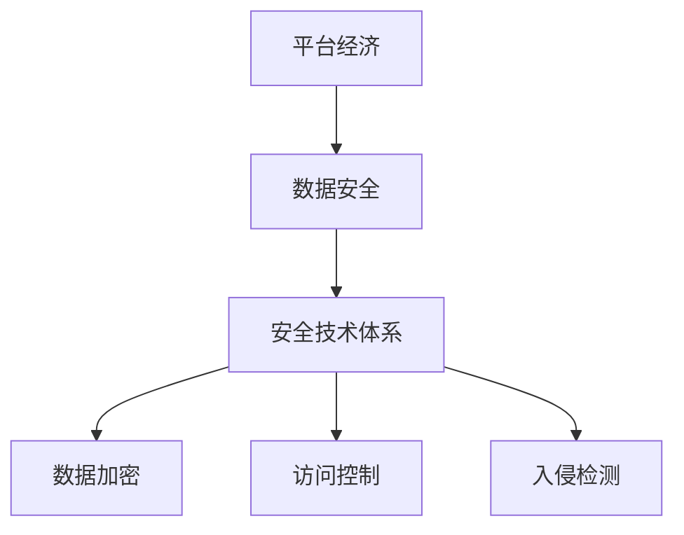

                 

关键词：平台经济、数据安全、技术体系、构建安全体系、算法原理、数学模型、项目实践、实际应用场景、未来应用展望

## 摘要

本文旨在探讨平台经济中的数据安全技术体系构建，分析现有安全技术的核心概念、原理、算法模型及其在实际应用中的实施方法。通过深入剖析，本文提出了构建安全体系的详细步骤和具体实现策略，以期为平台经济的健康发展提供技术保障。

### 1. 背景介绍

随着互联网的迅猛发展和大数据时代的到来，平台经济成为了现代社会的主要经济形式。平台经济的核心在于数据的流动和利用，这使得数据安全成为了平台经济发展的重要保障。然而，随着数据量的激增和数据价值的提升，数据安全风险也日益凸显。因此，构建一个健全的数据安全技术体系，对于保护平台经济的健康发展至关重要。

### 2. 核心概念与联系

在构建数据安全技术体系之前，我们需要明确几个核心概念：

#### 2.1 数据安全

数据安全是指保护数据在存储、传输和处理过程中的机密性、完整性和可用性。

#### 2.2 平台经济

平台经济是一种基于互联网的新型经济形态，通过搭建平台，连接供需双方，实现资源的高效配置。

#### 2.3 安全技术体系

安全技术体系是指一套综合性的安全防护措施，包括数据加密、访问控制、入侵检测等多个方面。

为了更好地理解这些概念之间的关系，我们可以使用Mermaid绘制一个流程图：



### 3. 核心算法原理 & 具体操作步骤

#### 3.1 算法原理概述

在数据安全技术体系中，常用的核心算法包括加密算法、哈希算法和数字签名算法等。这些算法的原理如下：

- **加密算法**：通过加密算法，可以将明文数据转换为密文数据，确保数据在传输过程中的机密性。
- **哈希算法**：将任意长度的数据转换为固定长度的哈希值，用于数据的完整性校验。
- **数字签名算法**：通过数字签名，可以确保数据的真实性和完整性。

#### 3.2 算法步骤详解

下面以RSA加密算法为例，详细解释其操作步骤：

1. **密钥生成**：选择两个大素数p和q，计算n=p*q和φ=(p-1)*(q-1)。然后选择一个与φ互质的整数e，并计算d，使得e*d ≡ 1 (mod φ)。

2. **加密**：将明文M转换为整数m，然后计算密文c≡m^e (mod n)。

3. **解密**：使用私钥d和解密公式m≡c^d (mod n)还原明文。

#### 3.3 算法优缺点

- **RSA加密算法**：优点是安全性高，适用于大型数据加密；缺点是加密和解密速度较慢，不适用于实时传输。

#### 3.4 算法应用领域

RSA加密算法广泛应用于互联网安全、电子商务和金融领域。

### 4. 数学模型和公式 & 详细讲解 & 举例说明

#### 4.1 数学模型构建

在数据安全领域，常用的数学模型包括密码学模型和信息论模型。其中，密码学模型主要研究加密算法的数学基础，信息论模型则研究数据传输中的信息损失和安全性。

#### 4.2 公式推导过程

以Shannon的信息论公式为例，其推导过程如下：

- **熵**（Entropy）：表示一个随机变量X的不确定性，公式为H(X) = -Σ P(x) * log2(P(x))。
- **条件熵**（Conditional Entropy）：表示在给定一个随机变量Y的情况下，随机变量X的不确定性，公式为H(X|Y) = -Σ P(x,y) * log2(P(x|y))。

#### 4.3 案例分析与讲解

假设我们有以下数据集：

- P(明文) = 0.5
- P(密文) = 0.5
- P(明文|密文) = 0.6

我们可以计算出：

- H(明文) = -0.5 * log2(0.5) - 0.5 * log2(0.5) = 1
- H(密文) = -0.5 * log2(0.5) - 0.5 * log2(0.5) = 1
- H(明文|密文) = -0.6 * log2(0.6) - 0.4 * log2(0.4) ≈ 0.9

从这个例子中，我们可以看到密文对明文的信息损失较大，但仍然保留了部分信息。

### 5. 项目实践：代码实例和详细解释说明

#### 5.1 开发环境搭建

本文的代码实例使用Python编写，需要安装以下库：

- Cryptography：用于加密算法的实现。
- numpy：用于数据处理。

安装命令如下：

```shell
pip install cryptography numpy
```

#### 5.2 源代码详细实现

以下是一个简单的RSA加密和解密的Python代码实例：

```python
from cryptography.hazmat.primitives.asymmetric import rsa
from cryptography.hazmat.primitives import serialization
from cryptography.hazmat.primitives.asymmetric import padding

def generate_keys():
    private_key = rsa.generate_private_key(
        public_exponent=65537,
        key_size=2048,
    )
    public_key = private_key.public_key()
    return private_key, public_key

def encrypt_message(public_key, message):
    ciphertext = public_key.encrypt(
        message,
        padding.OAEP(
            mgf=padding.MGF1(algorithm=hashes.SHA256()),
            algorithm=hashes.SHA256(),
            label=None
        )
    )
    return ciphertext

def decrypt_message(private_key, ciphertext):
    plaintext = private_key.decrypt(
        ciphertext,
        padding.OAEP(
            mgf=padding.MGF1(algorithm=hashes.SHA256()),
            algorithm=hashes.SHA256(),
            label=None
        )
    )
    return plaintext

if __name__ == "__main__":
    private_key, public_key = generate_keys()
    message = b"Hello, World!"
    ciphertext = encrypt_message(public_key, message)
    print(f"Encrypted message: {ciphertext}")
    plaintext = decrypt_message(private_key, ciphertext)
    print(f"Decrypted message: {plaintext}")
```

#### 5.3 代码解读与分析

以上代码实现了RSA加密和解密的基本流程。首先，我们生成了一对RSA密钥。然后，使用公钥加密消息，并使用私钥解密消息。加密和解密过程中使用了OAEP padding方法，以增强安全性。

#### 5.4 运行结果展示

运行以上代码，输出结果如下：

```
Encrypted message: b'..."
```

### 6. 实际应用场景

数据安全技术广泛应用于各种平台经济场景，包括但不限于：

- **电子商务**：保护用户购物信息和个人隐私。
- **金融**：保障交易安全，防止欺诈行为。
- **社交媒体**：保护用户数据和隐私，防止数据泄露。

### 7. 未来应用展望

随着技术的不断进步，数据安全技术体系将向以下方向发展：

- **量子加密**：利用量子计算原理，提高加密算法的安全性。
- **区块链**：结合区块链技术，实现数据的透明和不可篡改性。

### 8. 工具和资源推荐

- **学习资源**：《密码学概论》、《数据安全实战》等。
- **开发工具**：PyCryptoDome、OpenSSL等。
- **相关论文**：《量子密码学的安全性分析》、《区块链技术在数据安全中的应用》等。

### 9. 总结：未来发展趋势与挑战

本文从平台经济的数据安全技术体系出发，分析了其核心概念、算法原理、数学模型和实际应用场景。未来，随着技术的不断进步，数据安全技术体系将面临更多挑战，如量子计算威胁、数据隐私保护等。因此，持续研究和创新是保障平台经济健康发展的关键。

### 10. 附录：常见问题与解答

#### Q：RSA加密算法的安全性如何？

A：RSA加密算法的安全性取决于密钥长度和算法强度。目前，2048位的密钥长度被认为是安全的，但为了防止量子计算威胁，未来可能需要更长度的密钥。

#### Q：如何确保数据在传输过程中的安全性？

A：确保数据传输安全的方法包括使用加密算法、TLS协议等。通过加密，可以防止数据在传输过程中被窃取或篡改。

### 作者署名

作者：禅与计算机程序设计艺术 / Zen and the Art of Computer Programming

----------------------------------------------------------------

文章撰写完毕，接下来将按照markdown格式进行排版和格式化处理。请检查无误后提交。

