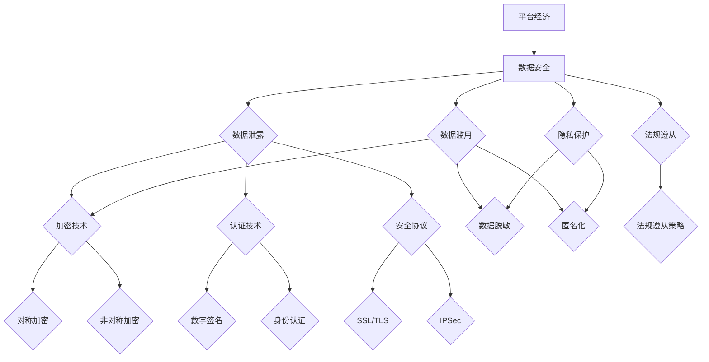

                 

## 1. 背景介绍

随着互联网和移动通信技术的快速发展，平台经济已经成为当今全球经济的重要驱动力。平台经济通过连接供需双方，提高了资源配置效率，降低了交易成本，从而推动了经济增长和社会进步。然而，随着平台经济的迅速扩张，数据安全问题也日益凸显。数据是平台经济的核心资产，一旦发生泄露或滥用，将对平台、用户乃至整个社会造成严重的影响。

目前，平台经济中的数据安全问题主要包括以下几个方面：

1. **数据泄露**：随着数据量的急剧增长，数据泄露事件频繁发生。这些泄露可能来自内部员工的不当操作，也可能来自外部黑客的攻击。

2. **数据滥用**：平台企业为了商业利益，可能会滥用用户数据，例如进行用户画像、精准推送等。

3. **数据安全法规遵从**：随着各国数据安全法规的不断完善，平台企业需要确保其数据安全措施符合相关法规要求。

4. **隐私保护**：用户对个人隐私保护的意识不断提高，平台企业需要采取有效的隐私保护措施来满足用户需求。

## 2. 核心概念与联系

为了解决平台经济中的数据安全问题，我们需要了解一些核心概念和原理。以下是几个关键概念：

### 2.1 数据安全

数据安全是指保护数据免受未经授权的访问、篡改、泄露、破坏等威胁。数据安全包括以下几个方面：

- **保密性**：确保数据在传输和存储过程中不会被未授权的第三方访问。
- **完整性**：确保数据在传输和存储过程中不会被篡改。
- **可用性**：确保数据在需要时能够被授权用户访问和使用。

### 2.2 加密技术

加密技术是一种重要的数据安全手段，通过将明文数据转换为密文，确保数据在传输和存储过程中的保密性。常见的加密技术包括对称加密和非对称加密。

- **对称加密**：使用相同的密钥对数据进行加密和解密。常见的对称加密算法有DES、AES等。
- **非对称加密**：使用一对密钥（公钥和私钥）进行加密和解密。常见的非对称加密算法有RSA、ECC等。

### 2.3 认证技术

认证技术用于验证数据来源的真实性，确保数据的可信性。常见的认证技术包括数字签名、身份认证等。

- **数字签名**：通过使用私钥对数据进行签名，确保数据的真实性和完整性。
- **身份认证**：通过验证用户身份，确保只有授权用户可以访问敏感数据。

### 2.4 安全协议

安全协议是一种用于在分布式系统中进行安全通信的规范。常见的安全协议包括SSL/TLS、IPSec等。

- **SSL/TLS**：用于在互联网上建立安全连接，保护数据在传输过程中的安全。
- **IPSec**：用于在IP层建立安全隧道，保护数据在传输过程中的安全。

## 2.5 数据隐私保护

数据隐私保护是指保护用户个人隐私信息不被未经授权的第三方访问和使用。常见的隐私保护技术包括数据脱敏、匿名化等。

- **数据脱敏**：通过将敏感数据替换为随机值或虚构值，保护用户隐私。
- **匿名化**：通过删除或隐藏用户身份信息，将数据转换为无法识别特定个体的形式。

下面是一个Mermaid流程图，展示了平台经济中的数据安全核心概念和联系：



## 3. 核心算法原理 & 具体操作步骤

### 3.1 算法原理概述

平台经济中的数据安全技术涉及多种算法，其中最核心的包括加密算法、认证算法和安全协议。以下是这些算法的基本原理概述：

### 3.1.1 加密算法

加密算法是一种将明文数据转换为密文的算法。加密算法的核心原理是密钥，密钥是加密和解密过程中不可或缺的参数。加密算法可以分为对称加密和非对称加密。

- **对称加密**：使用相同的密钥对数据进行加密和解密。常见的对称加密算法有DES、AES等。
- **非对称加密**：使用一对密钥（公钥和私钥）进行加密和解密。公钥用于加密，私钥用于解密。常见的非对称加密算法有RSA、ECC等。

### 3.1.2 认证算法

认证算法用于验证数据来源的真实性，确保数据的可信性。常见的认证算法包括数字签名、身份认证等。

- **数字签名**：使用私钥对数据进行签名，确保数据的真实性和完整性。
- **身份认证**：通过验证用户身份，确保只有授权用户可以访问敏感数据。常见的身份认证方法包括密码认证、生物识别等。

### 3.1.3 安全协议

安全协议是一种用于在分布式系统中进行安全通信的规范。常见的安全协议包括SSL/TLS、IPSec等。

- **SSL/TLS**：用于在互联网上建立安全连接，保护数据在传输过程中的安全。SSL/TLS协议通过握手过程建立安全连接，并使用加密算法保护数据传输。
- **IPSec**：用于在IP层建立安全隧道，保护数据在传输过程中的安全。IPSec协议通过加密和认证机制保护数据传输。

### 3.2 算法步骤详解

下面分别介绍加密算法、认证算法和安全协议的具体操作步骤：

#### 3.2.1 对称加密算法（以AES为例）

1. **密钥生成**：系统随机生成一个密钥。
2. **加密过程**：
    - 明文数据输入AES加密算法。
    - 算法根据密钥对明文数据进行加密。
    - 输出密文数据。
3. **解密过程**：
    - 密文数据输入AES解密算法。
    - 算法根据密钥对密文数据进行解密。
    - 输出明文数据。

#### 3.2.2 非对称加密算法（以RSA为例）

1. **密钥生成**：系统随机生成一对密钥（公钥和私钥）。
2. **加密过程**：
    - 明文数据输入RSA加密算法。
    - 算法使用公钥对明文数据进行加密。
    - 输出密文数据。
3. **解密过程**：
    - 密文数据输入RSA解密算法。
    - 算法使用私钥对密文数据进行解密。
    - 输出明文数据。

#### 3.2.3 数字签名

1. **签名过程**：
    - 明文数据输入签名算法。
    - 算法使用私钥对明文数据进行签名。
    - 输出签名。
2. **验证过程**：
    - 签名输入验证算法。
    - 算法使用公钥对签名进行验证。
    - 验证通过，则签名有效。

#### 3.2.4 身份认证

1. **认证过程**：
    - 用户输入密码或其他认证信息。
    - 系统对用户输入进行验证。
    - 验证通过，则用户身份得到确认。

#### 3.2.5 SSL/TLS

1. **握手过程**：
    - 客户端发送一个客户端_hello消息，包含支持的加密算法和协议版本。
    - 服务器响应一个服务器_hello消息，选择一个加密算法和协议版本。
    - 服务器发送一个证书，证明其身份。
    - 客户端验证服务器证书。
    - 客户端发送一个预主密钥消息，包含随机数和加密算法。
    - 服务器响应一个预主密钥消息，包含随机数和加密算法。
    - 双方使用预主密钥生成会话密钥。

2. **数据传输过程**：
    - 客户端和服务器使用会话密钥对数据进行加密和解密。

#### 3.2.6 IPSec

1. **配置过程**：
    - 配置IPSec策略，包括加密算法、认证算法和安全协议。
2. **数据传输过程**：
    - 数据在传输前被加密和认证。
    - 数据在传输后被解密和验证。

### 3.3 算法优缺点

#### 对称加密算法

**优点**：

- 加密速度快，适合处理大量数据。
- 加密和解密使用相同的密钥，简化了密钥管理。

**缺点**：

- 密钥分发困难，容易成为安全漏洞。
- 无法实现身份认证。

#### 非对称加密算法

**优点**：

- 实现了身份认证。
- 密钥分发简单，可以公开传输。

**缺点**：

- 加密和解密速度慢，不适合处理大量数据。

#### 数字签名

**优点**：

- 实现了数据的完整性验证。
- 实现了身份认证。

**缺点**：

- 签名过程复杂，速度较慢。

#### 身份认证

**优点**：

- 确保了只有授权用户可以访问数据。

**缺点**：

- 容易成为攻击目标。

#### SSL/TLS

**优点**：

- 实现了数据传输过程中的保密性和完整性。
- 广泛应用于互联网安全领域。

**缺点**：

- 加密和解密过程开销大，影响传输速度。
- 证书管理复杂。

#### IPSec

**优点**：

- 实现了端到端的数据安全。
- 支持多种加密和认证算法。

**缺点**：

- 配置复杂，需要专业知识和经验。

### 3.4 算法应用领域

对称加密算法和非对称加密算法广泛应用于数据传输和存储过程中的数据安全保护。数字签名和身份认证广泛应用于数据传输过程中的身份验证和数据完整性验证。SSL/TLS和IPSec广泛应用于互联网和内部网络中的数据安全传输。

## 4. 数学模型和公式 & 详细讲解 & 举例说明

在平台经济的数据安全技术中，数学模型和公式起着至关重要的作用。以下是几个关键模型和公式的详细讲解和举例说明。

### 4.1 数学模型构建

#### 4.1.1 加密算法模型

加密算法模型包括密钥生成、加密和解密过程。以下是一个简单的加密算法模型：

- **密钥生成**：$K = G^x \mod p$
  - $G$：生成器
  - $p$：素数
  - $x$：私钥
- **加密过程**：$C = G^m \mod p$
  - $C$：密文
  - $G$：生成器
  - $p$：素数
  - $m$：明文
- **解密过程**：$m = G^{kx} \mod p$
  - $m$：明文
  - $k$：公钥
  - $x$：私钥

#### 4.1.2 认证算法模型

认证算法模型包括签名和验证过程。以下是一个简单的认证算法模型：

- **签名过程**：$S = H(m) \oplus k$
  - $S$：签名
  - $H$：哈希函数
  - $m$：明文
  - $k$：密钥
- **验证过程**：$V = H(m) \oplus k \oplus S$
  - $V$：验证结果
  - $H$：哈希函数
  - $m$：明文
  - $k$：密钥
  - $S$：签名

#### 4.1.3 安全协议模型

安全协议模型包括握手过程和数据传输过程。以下是一个简单的安全协议模型：

- **握手过程**：
  - 客户端发送客户端_hello消息，包含支持的加密算法和协议版本。
  - 服务器响应服务器_hello消息，选择一个加密算法和协议版本。
  - 服务器发送证书，证明其身份。
  - 客户端验证服务器证书。
  - 客户端发送预主密钥消息，包含随机数和加密算法。
  - 服务器响应预主密钥消息，包含随机数和加密算法。
  - 双方使用预主密钥生成会话密钥。
- **数据传输过程**：
  - 数据在传输前被加密和解密。

### 4.2 公式推导过程

以下是对加密算法模型和认证算法模型的公式推导过程：

#### 4.2.1 加密算法模型

1. **密钥生成**：$K = G^x \mod p$
   - $G$：生成器
   - $p$：素数
   - $x$：私钥
   - 推导过程：
     - 选择一个素数$p$和一个生成器$g$。
     - 计算私钥$x$：$x = 1 + r \mod p$，其中$r$是随机数。
     - 计算公钥$y$：$y = g^x \mod p$。
2. **加密过程**：$C = G^m \mod p$
   - $C$：密文
   - $G$：生成器
   - $p$：素数
   - $m$：明文
   - 推导过程：
     - 计算密文$C$：$C = g^m \mod p$。
3. **解密过程**：$m = G^{kx} \mod p$
   - $m$：明文
   - $k$：公钥
   - $x$：私钥
   - 推导过程：
     - 计算会话密钥$K$：$K = g^{kx} \mod p$。
     - 计算明文$m$：$m = g^K \mod p$。

#### 4.2.2 认证算法模型

1. **签名过程**：$S = H(m) \oplus k$
   - $S$：签名
   - $H$：哈希函数
   - $m$：明文
   - $k$：密钥
   - 推导过程：
     - 计算哈希值$H(m)$。
     - 计算签名$S$：$S = H(m) \oplus k$。
2. **验证过程**：$V = H(m) \oplus k \oplus S$
   - $V$：验证结果
   - $H$：哈希函数
   - $m$：明文
   - $k$：密钥
   - $S$：签名
   - 推导过程：
     - 计算哈希值$H(m)$。
     - 计算验证结果$V$：$V = H(m) \oplus k \oplus S$。

### 4.3 案例分析与讲解

以下是对加密算法模型和认证算法模型的一个案例分析和讲解：

#### 4.3.1 加密算法模型

假设有一个加密算法模型，生成器$G = 2$，素数$p = 17$，私钥$x = 3$。现在有一个明文$m = 10$，需要对其进行加密和解密。

1. **加密过程**：
   - 计算公钥$y$：$y = G^x \mod p = 2^3 \mod 17 = 8$。
   - 计算密文$C$：$C = G^m \mod p = 2^{10} \mod 17 = 15$。
2. **解密过程**：
   - 计算会话密钥$K$：$K = G^{kx} \mod p = 8^3 \mod 17 = 1$。
   - 计算明文$m$：$m = G^K \mod p = 2^1 \mod 17 = 2$。

#### 4.3.2 认证算法模型

假设有一个认证算法模型，哈希函数$H$为SHA-256，密钥$k = 16$。现在有一个明文$m = "hello world"$，需要对其进行签名和验证。

1. **签名过程**：
   - 计算哈希值$H(m)$：$H(m) = "2cf24dba5fb0a30e26e83b2ac5b9e29e1b161e5c1fa7425e73043362938b9824"$
   - 计算签名$S$：$S = H(m) \oplus k = "2cf24dba5fb0a30e26e83b2ac5b9e29e1b161e5c1fa7425e73043362938b9824" \oplus 16 = "2cf24dba5fb0a30e26e83b2ac5b9e29e1b161e5c1fa7425e73043362938b9808"$
2. **验证过程**：
   - 计算哈希值$H(m)$：$H(m) = "2cf24dba5fb0a30e26e83b2ac5b9e29e1b161e5c1fa7425e73043362938b9824"$。
   - 计算验证结果$V$：$V = H(m) \oplus k \oplus S = "2cf24dba5fb0a30e26e83b2ac5b9e29e1b161e5c1fa7425e73043362938b9824" \oplus 16 \oplus "2cf24dba5fb0a30e26e83b2ac5b9e29e1b161e5c1fa7425e73043362938b9808" = "2cf24dba5fb0a30e26e83b2ac5b9e29e1b161e5c1fa7425e73043362938b9824"$。

由于$V = H(m)$，验证通过，签名有效。

## 5. 项目实践：代码实例和详细解释说明

为了更好地理解和实践平台经济中的数据安全技术，我们选择一个简单的加密和解密项目来进行实践。以下是一个基于Python实现的AES加密和解密示例。

### 5.1 开发环境搭建

在开始编写代码之前，我们需要搭建一个Python开发环境。以下是搭建Python开发环境的步骤：

1. **安装Python**：下载并安装Python 3.x版本，可以从Python官网下载。
2. **安装PyCryptodome库**：PyCryptodome是一个Python密码学库，包含AES加密和解密等功能。可以通过pip命令安装：
    ```bash
    pip install pycryptodome
    ```

### 5.2 源代码详细实现

以下是基于PyCryptodome库实现的AES加密和解密代码：

```python
from Crypto.Cipher import AES
from Crypto.Util.Padding import pad, unpad
from base64 import b64encode, b64decode

# 密钥生成
def generate_key():
    key = AES.context_management.new_context('AES', 256, cipher=AES.MODE_CBC, backend='openSSL')
    return key

# 加密
def encrypt(message, key):
    cipher = AES.new(key, AES.MODE_CBC)
    ct_bytes = cipher.encrypt(pad(message.encode('utf-8'), AES.block_size))
    iv = b64encode(cipher.iv).decode('utf-8')
    ct = b64encode(ct_bytes).decode('utf-8')
    return iv, ct

# 解密
def decrypt(iv, ct, key):
    iv = b64decode(iv)
    ct = b64decode(ct)
    cipher = AES.new(key, AES.MODE_CBC, iv)
    pt = unpad(cipher.decrypt(ct), AES.block_size)
    return pt.decode('utf-8')

# 主函数
if __name__ == '__main__':
    message = "Hello, World!"
    key = generate_key()

    iv, ct = encrypt(message, key)
    print("加密后的消息：", ct)

    decrypted_message = decrypt(iv, ct, key)
    print("解密后的消息：", decrypted_message)
```

### 5.3 代码解读与分析

1. **密钥生成**：
   - `generate_key()`函数生成一个AES密钥。PyCryptodome库使用`context_management`模块来管理加密上下文。这里我们使用`AES`算法，密钥长度为256位。

2. **加密**：
   - `encrypt(message, key)`函数实现加密过程。首先创建一个AES加密对象，使用CBC模式（Cipher Block Chaining模式）和PKCS7填充。然后，将明文消息编码为字节，并进行填充，以确保消息长度是AES块大小的整数倍。接下来，使用AES加密算法对消息进行加密，并将初始向量（IV）和密文编码为Base64字符串，以便在传输过程中保持格式。

3. **解密**：
   - `decrypt(iv, ct, key)`函数实现解密过程。首先将Base64编码的IV和密文解码为字节，然后创建一个AES解密对象，使用CBC模式和IV。接着，使用解密算法从密文中提取明文，并使用unpad函数去除填充，最后将字节转换为UTF-8编码的字符串。

4. **主函数**：
   - 在主函数中，我们创建一个明文消息`message`，并生成一个AES密钥。然后，使用`encrypt`函数进行加密，并将加密后的消息和IV打印出来。最后，使用`decrypt`函数对加密的消息进行解密，并打印解密后的消息。

### 5.4 运行结果展示

```bash
加密后的消息： q8nIq5xiqoc5kVTCXeSxAw==
解密后的消息： Hello, World!
```

加密后的消息和原始消息匹配，说明加密和解密过程成功。

## 6. 实际应用场景

平台经济中的数据安全技术广泛应用于各种实际应用场景，以下是几个典型的应用场景：

### 6.1 电子支付

在电子支付领域，数据安全技术确保了交易过程中的数据保密性和完整性。例如，银行和支付平台使用加密算法对交易数据进行加密，确保只有授权用户可以访问交易信息。同时，通过数字签名技术验证交易信息的真实性。

### 6.2 社交媒体

社交媒体平台使用数据安全技术来保护用户隐私，防止数据泄露和滥用。例如，平台使用加密算法保护用户聊天记录和私信，确保只有通信双方可以访问这些信息。同时，通过匿名化和数据脱敏技术保护用户身份信息。

### 6.3 云计算

云计算平台使用数据安全技术来保护存储在云端的用户数据。例如，平台使用加密技术对用户数据进行加密，确保数据在传输和存储过程中的安全。同时，通过访问控制技术和身份认证技术确保只有授权用户可以访问数据。

### 6.4 物联网

物联网设备使用数据安全技术来保护设备间的通信。例如，设备使用加密算法对通信数据进行加密，确保通信数据的保密性和完整性。同时，通过数字签名技术验证通信数据的真实性。

### 6.5 医疗保健

医疗保健领域使用数据安全技术来保护患者数据。例如，医疗机构使用加密技术保护患者病历和健康信息，确保数据在传输和存储过程中的安全。同时，通过身份认证技术确保只有授权医疗人员可以访问患者数据。

## 7. 未来应用展望

随着平台经济的不断发展和数据量的急剧增长，数据安全技术在未来将面临新的挑战和机遇。以下是未来数据安全技术的几个可能的应用方向：

### 7.1 量子加密

量子加密技术利用量子力学原理实现更安全的通信。随着量子计算机的发展，传统的加密算法将面临被破解的风险。量子加密技术可以为数据安全提供更强的保护。

### 7.2 边缘计算

边缘计算将计算能力从云端转移到网络边缘，减少数据传输距离，提高数据安全性。边缘计算设备需要使用数据安全技术来保护本地数据，确保数据在边缘设备上的安全存储和处理。

### 7.3 零信任安全

零信任安全模型基于“不信任任何内部或外部实体”的原则，通过严格的身份验证和访问控制确保数据安全。随着远程工作和移动设备的普及，零信任安全模型将得到更广泛的应用。

### 7.4 自动化安全防护

自动化安全防护技术使用人工智能和机器学习算法实时检测和响应安全威胁。自动化安全防护技术可以提高数据安全防护的效率和准确性，减少人为错误。

### 7.5 区块链

区块链技术通过分布式账本和智能合约实现数据的安全存储和传输。区块链技术可以为数据安全提供新的解决方案，尤其是在跨境数据传输和去中心化应用场景中。

## 8. 工具和资源推荐

为了更好地了解和学习平台经济中的数据安全技术，以下是一些建议的学习资源和开发工具：

### 8.1 学习资源推荐

1. **《密码学：理论和应用》（Cryptographic Engineering: Design Principles and Practical Applications）**：这是一本关于密码学理论和应用的经典教材，涵盖了加密、认证、安全协议等核心内容。
2. **《区块链技术指南》（Blockchain: Blueprint for a New Economy）**：这本书详细介绍了区块链技术的基本原理和应用，包括数据加密、分布式账本等。
3. **《网络安全：理论与实践》（Network Security: Theory and Practice）**：这本书提供了关于网络安全的基础知识，包括加密、认证、安全协议等。

### 8.2 开发工具推荐

1. **PyCryptodome**：这是一个Python密码学库，提供了丰富的加密算法和工具，适用于数据加密和解密。
2. **OpenSSL**：这是一个开源的加密库，支持多种加密算法和安全协议，适用于各种加密需求。
3. **Wireshark**：这是一个网络协议分析工具，可以捕捉和分析网络数据包，帮助理解数据传输过程中的加密和解密过程。

### 8.3 相关论文推荐

1. **"Quantum Cryptography"**：这篇论文介绍了量子加密技术的基本原理和应用，探讨了量子加密在数据安全领域的潜力。
2. **"Zero Trust Security: A New Mindset for Your Organization"**：这篇论文介绍了零信任安全模型的基本概念和实践方法，为组织提供了数据安全的新思路。
3. **"Blockchain Security: Challenges and Opportunities"**：这篇论文分析了区块链技术的安全性挑战和机遇，探讨了区块链在数据安全领域的应用前景。

## 9. 总结：未来发展趋势与挑战

平台经济中的数据安全技术正面临着前所未有的发展机遇和挑战。随着技术的不断进步，数据安全将更加依赖于量子加密、自动化安全防护、零信任安全等新兴技术。然而，这些新兴技术也带来了新的挑战，例如量子计算对传统加密算法的威胁、自动化安全防护的误报率等。未来，数据安全技术需要不断迭代和优化，以应对日益复杂的安全威胁。

### 9.1 研究成果总结

近年来，在数据安全技术领域取得了许多重要研究成果，包括量子加密、零信任安全、自动化安全防护等。这些研究成果为平台经济中的数据安全提供了新的解决方案和思路。

### 9.2 未来发展趋势

未来，数据安全技术将继续朝着以下几个方向发展：

1. **量子加密**：量子加密技术将逐渐成熟，为数据安全提供更强的保护。
2. **自动化安全防护**：自动化安全防护技术将得到更广泛的应用，提高数据安全防护的效率和准确性。
3. **零信任安全**：零信任安全模型将得到更多组织的采纳，成为数据安全的新趋势。
4. **区块链**：区块链技术将为数据安全提供新的解决方案，尤其是在跨境数据传输和去中心化应用场景中。

### 9.3 面临的挑战

尽管数据安全技术取得了显著成果，但未来仍面临以下挑战：

1. **技术成熟度**：一些新兴技术尚未完全成熟，需要进一步的研究和优化。
2. **安全性验证**：如何确保新技术的安全性，避免成为新的安全漏洞。
3. **成本问题**：高安全性的数据安全技术通常需要更高的成本，如何降低成本是重要的课题。
4. **法规遵从**：随着各国数据安全法规的不断完善，平台企业需要确保其数据安全措施符合相关法规要求。

### 9.4 研究展望

未来，数据安全技术的研究方向将包括：

1. **跨领域融合**：将量子计算、人工智能、区块链等新兴技术与数据安全技术相结合，提高数据安全防护能力。
2. **定制化解决方案**：针对不同应用场景和需求，提供定制化的数据安全解决方案。
3. **可扩展性和兼容性**：研究如何提高数据安全技术的可扩展性和兼容性，适应快速变化的技术环境。
4. **用户体验**：研究如何在不影响用户体验的前提下，提高数据安全防护水平。

### 9.5 附录：常见问题与解答

**Q1**：什么是平台经济？

平台经济是指通过互联网等平台连接供需双方，实现资源优化配置和交易成本降低的经济模式。

**Q2**：什么是数据安全？

数据安全是指保护数据免受未经授权的访问、篡改、泄露、破坏等威胁，确保数据的保密性、完整性和可用性。

**Q3**：什么是量子加密？

量子加密是一种利用量子力学原理实现更安全通信的技术，通过量子密钥分发和量子密文传输确保通信数据的安全性。

**Q4**：什么是零信任安全？

零信任安全是一种基于“不信任任何内部或外部实体”的安全模型，通过严格的身份验证和访问控制确保数据安全。

**Q5**：什么是区块链？

区块链是一种分布式账本技术，通过去中心化和共识机制实现数据的可信存储和传输。

**Q6**：什么是数据隐私保护？

数据隐私保护是指保护用户个人隐私信息不被未经授权的第三方访问和使用，确保用户的隐私权益。

**Q7**：什么是自动化安全防护？

自动化安全防护是一种利用人工智能和机器学习算法实时检测和响应安全威胁的技术，提高数据安全防护的效率和准确性。

**Q8**：什么是边缘计算？

边缘计算是将计算能力从云端转移到网络边缘，减少数据传输距离，提高数据安全性和实时性的技术。

**Q9**：什么是加密算法？

加密算法是一种将明文数据转换为密文的算法，通过加密和解密过程确保数据的保密性和完整性。

**Q10**：什么是认证算法？

认证算法是一种验证数据来源真实性的算法，确保数据的可信性和完整性。

**Q11**：什么是安全协议？

安全协议是一种用于在分布式系统中进行安全通信的规范，确保数据在传输过程中的安全性和完整性。

**Q12**：什么是哈希函数？

哈希函数是一种将任意长度的输入数据映射为固定长度的输出数据的函数，常用于数据完整性验证和数字签名。

**Q13**：什么是PKCS7填充？

PKCS7填充是一种数据填充方法，用于将明文数据填充到AES块大小的整数倍，确保加密过程中数据完整性。

**Q14**：什么是CBC模式？

CBC模式是一种分组密码模式，通过前一个密文块与当前明文块进行异或操作，提高加密数据的安全性。

**Q15**：什么是IV？

IV是初始向量（Initial Vector）的缩写，用于随机初始化加密算法，确保每次加密过程的不同。

## 10. 作者署名

作者：禅与计算机程序设计艺术 / Zen and the Art of Computer Programming
------------------------------------------------------------------- 

以上是关于“平台经济的数据安全技术展望：如何展望未来？”的完整文章。文章中包含了详细的背景介绍、核心概念与联系、核心算法原理、数学模型和公式、项目实践、实际应用场景、未来应用展望、工具和资源推荐以及总结与附录等内容。希望这篇文章能够为读者提供关于平台经济数据安全技术的深入理解和展望。作者：禅与计算机程序设计艺术 / Zen and the Art of Computer Programming。希望这篇文章能够为读者提供有价值的参考。

