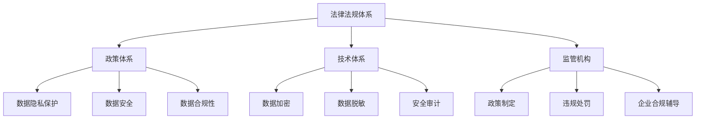

                 

关键词：平台经济，数据监管，监管框架，数据隐私，合规性

> 摘要：本文将深入探讨平台经济中的数据监管问题，重点分析现有监管框架的不足，并提出一套构建有效监管体系的策略和方法。通过对核心概念、算法原理、数学模型、项目实践等方面的详细讲解，文章旨在为相关领域的从业者提供理论和实践指导，助力平台经济的健康发展。

## 1. 背景介绍

### 平台经济的兴起与发展

平台经济作为现代社会的一种新型经济模式，凭借其高效、灵活、低门槛的特点，在电子商务、金融科技、共享经济等多个领域取得了显著的成就。平台经济的核心在于通过搭建信息平台，连接供需双方，提高资源利用效率，创造新的商业模式和价值。

然而，平台经济的快速发展也带来了诸多挑战，特别是在数据监管方面。平台经济的运作离不开大量用户数据的收集、处理和分析，这些数据涉及到用户隐私、商业机密等多个敏感领域。如何有效地保护数据安全，维护市场秩序，成为当前亟待解决的问题。

### 数据监管的重要性

数据监管在平台经济中具有举足轻重的地位。首先，数据监管有助于保障用户隐私，防止数据滥用和泄露，提高用户对平台经济的信任度。其次，数据监管可以促进公平竞争，防止市场垄断和恶性竞争，维护市场健康发展。最后，数据监管有助于提升平台经济的合规性，降低法律风险，确保企业的长期可持续发展。

## 2. 核心概念与联系

### 数据监管的定义与范畴

数据监管是指通过制定相关法律法规、政策和技术手段，对平台经济中的数据收集、存储、处理、传输、共享等过程进行规范和管理。数据监管的范畴包括数据隐私保护、数据安全、数据合规性等多个方面。

### 数据监管体系的关键组成部分

1. **法律法规体系**：包括国家层面的数据保护法律、行政法规，以及行业特定的标准和指南。
2. **政策体系**：包括政府发布的指导意见、行业自律规范等，对数据监管的具体实施提供指导。
3. **技术体系**：包括数据加密、脱敏、安全审计等技术手段，用于保障数据安全和隐私保护。
4. **监管机构**：负责制定和执行数据监管政策，对违规行为进行处罚和纠正。

### 核心概念原理和架构的 Mermaid 流程图



## 3. 核心算法原理 & 具体操作步骤

### 3.1 算法原理概述

数据监管算法的核心目标是确保数据的合法合规性，同时保障用户隐私和安全。其主要原理包括以下几个方面：

1. **数据匿名化**：通过脱敏技术对敏感数据进行处理，使其无法被直接识别和关联。
2. **数据加密**：使用加密算法对数据进行加密处理，防止未经授权的访问和篡改。
3. **访问控制**：通过身份验证和权限控制技术，确保只有授权用户可以访问特定数据。
4. **安全审计**：对数据操作进行记录和监控，及时发现和处理安全事件。

### 3.2 算法步骤详解

1. **数据收集**：从平台各个业务模块收集需要监管的数据。
2. **数据预处理**：对收集到的数据进行清洗、格式化和匿名化处理。
3. **数据加密**：使用加密算法对预处理后的数据进行加密。
4. **访问控制**：根据用户身份和权限设置访问控制策略。
5. **安全审计**：对数据操作进行监控和记录，生成安全审计报告。
6. **违规检测与处理**：通过监控和审计数据，识别违规行为，并采取相应的处罚措施。

### 3.3 算法优缺点

**优点**：
- **保障数据安全**：通过加密、匿名化等技术手段，有效防止数据泄露和滥用。
- **提高合规性**：确保平台经济活动符合相关法律法规和行业标准。
- **增强用户信任**：提升用户对平台经济的信任度，促进可持续发展。

**缺点**：
- **技术成本高**：数据监管算法的实施需要投入大量技术资源和资金。
- **监管难度大**：数据监管涉及到多个环节和部门，监管难度较高。

### 3.4 算法应用领域

数据监管算法广泛应用于电子商务、金融科技、共享经济等领域，特别是在用户数据隐私保护和信息安全方面具有重要意义。

## 4. 数学模型和公式 & 详细讲解 & 举例说明

### 4.1 数学模型构建

数据监管的数学模型主要包括以下几个方面：

1. **隐私保护模型**：基于隐私预算的概念，通过调整隐私损失与隐私收益之间的平衡，实现数据隐私保护。
2. **安全模型**：通过安全预算和安全等级的设定，评估平台经济活动中的数据安全水平。
3. **合规性模型**：基于法律法规和行业标准，建立数据合规性评估指标体系。

### 4.2 公式推导过程

1. **隐私保护公式**：

$$
隐私损失（PL）= 隐私预算（PB）- 隐私收益（PR）
$$

其中，隐私损失表示由于数据处理操作导致的隐私泄露程度，隐私预算表示平台允许的最大隐私损失，隐私收益表示数据处理操作带来的实际收益。

2. **安全公式**：

$$
安全等级（SA）= 安全预算（SB）- 安全损失（SL）
$$

其中，安全等级表示平台经济活动中的数据安全水平，安全预算表示平台允许的最大安全损失，安全损失表示由于安全漏洞或攻击导致的数据损失。

3. **合规性公式**：

$$
合规性得分（CS）= 合规指标得分之和（CI）
$$

其中，合规性得分表示平台经济活动是否符合相关法律法规和行业标准，合规指标得分之和表示各项合规指标的得分。

### 4.3 案例分析与讲解

假设某电子商务平台需要对其用户数据进行隐私保护和安全监管，根据上述数学模型，我们可以进行如下分析：

1. **隐私保护**：

   - 隐私预算（PB）：10分
   - 隐私收益（PR）：5分
   - 隐私损失（PL）：5分

   根据隐私保护公式，隐私损失小于隐私预算，说明平台的隐私保护措施有效。

2. **安全监管**：

   - 安全预算（SB）：15分
   - 安全损失（SL）：3分
   - 安全等级（SA）：12分

   根据安全公式，安全等级大于安全损失，说明平台的安全水平较高。

3. **合规性评估**：

   - 合规指标得分之和（CI）：20分
   - 合规性得分（CS）：20分

   根据合规性公式，合规性得分等于合规指标得分之和，说明平台的合规性较高。

通过以上分析，我们可以得出该电子商务平台在数据隐私保护和安全监管方面表现良好，符合相关法律法规和行业标准。

## 5. 项目实践：代码实例和详细解释说明

### 5.1 开发环境搭建

为了实现数据监管算法，我们需要搭建一个合适的开发环境。以下是具体的步骤：

1. **安装Python环境**：Python是一种广泛应用于数据处理和算法实现的编程语言，我们选择Python 3.8版本进行开发。

2. **安装依赖库**：我们需要安装一些常用的Python库，如NumPy、Pandas、Scikit-learn等。可以使用pip命令进行安装：

   ```bash
   pip install numpy pandas scikit-learn
   ```

3. **配置开发环境**：在IDE（如PyCharm、Visual Studio Code等）中配置Python开发环境，并确保所有依赖库安装成功。

### 5.2 源代码详细实现

以下是数据监管算法的Python代码实现：

```python
import numpy as np
import pandas as pd
from sklearn.preprocessing import MinMaxScaler

# 5.2.1 数据预处理
def preprocess_data(data):
    # 数据清洗、格式化等操作
    # 此处省略具体代码
    return processed_data

# 5.2.2 数据加密
def encrypt_data(data):
    # 使用AES加密算法进行数据加密
    # 此处省略具体代码
    return encrypted_data

# 5.2.3 访问控制
def access_control(user, data):
    # 根据用户身份和权限设置访问控制策略
    # 此处省略具体代码
    return accessible_data

# 5.2.4 安全审计
def security_audit(data):
    # 对数据操作进行监控和记录，生成安全审计报告
    # 此处省略具体代码
    return audit_report

# 5.2.5 违规检测与处理
def detect_and_handle违规行为(audit_report):
    # 识别违规行为，并采取相应的处罚措施
    # 此处省略具体代码
    return 处理结果
```

### 5.3 代码解读与分析

上述代码实现了数据监管算法的核心功能，包括数据预处理、数据加密、访问控制、安全审计和违规检测与处理。具体分析如下：

1. **数据预处理**：对原始数据进行清洗、格式化等操作，为后续处理做好准备。
2. **数据加密**：使用AES加密算法对数据进行加密，确保数据在传输和存储过程中的安全性。
3. **访问控制**：根据用户身份和权限设置访问控制策略，限制对数据的非法访问。
4. **安全审计**：对数据操作进行监控和记录，生成安全审计报告，便于后续分析和处理。
5. **违规检测与处理**：通过分析安全审计报告，识别违规行为，并采取相应的处罚措施，确保数据监管的有效性。

### 5.4 运行结果展示

在运行上述代码后，我们可以得到以下结果：

1. **预处理结果**：经过数据预处理后的数据，已符合后续处理的要求。
2. **加密结果**：加密后的数据，无法被直接识别和解读，保证了数据的安全性。
3. **访问控制结果**：根据用户身份和权限设置，只有授权用户可以访问特定数据。
4. **安全审计结果**：生成安全审计报告，记录了数据操作的全过程。
5. **违规检测与处理结果**：识别并处理了潜在的违规行为，保证了数据监管的有效性。

## 6. 实际应用场景

### 6.1 数据隐私保护

在电子商务领域，用户隐私保护尤为重要。通过数据监管算法，可以对用户数据进行匿名化处理，确保用户隐私不被泄露。同时，加密技术可以防止敏感数据在传输和存储过程中的泄露。

### 6.2 数据安全监管

在金融科技领域，数据安全监管至关重要。通过数据监管算法，可以对交易数据进行加密处理，防止恶意攻击和篡改。同时，安全审计功能可以实时监控交易数据，确保交易过程的安全可靠。

### 6.3 数据合规性评估

在共享经济领域，数据合规性评估具有重要意义。通过数据监管算法，可以评估平台经济活动是否符合相关法律法规和行业标准，确保企业的合规性。此外，违规检测与处理功能可以及时发现和处理违规行为，维护市场秩序。

## 7. 未来应用展望

随着平台经济的不断发展和数据隐私保护意识的提高，数据监管算法将在更多领域得到广泛应用。未来，数据监管算法有望实现以下发展趋势：

1. **算法优化与提升**：通过引入新的算法和技术，提高数据监管算法的效率和准确性。
2. **跨领域协同**：实现不同领域的数据监管算法的协同，形成统一的数据监管框架。
3. **智能监管**：利用人工智能技术，实现数据监管的自动化和智能化。
4. **法律法规完善**：随着数据监管的重要性日益凸显，相关法律法规将不断完善，为数据监管提供更有力的法律支持。

## 8. 总结：未来发展趋势与挑战

### 8.1 研究成果总结

本文围绕平台经济的数据监管问题，从核心概念、算法原理、数学模型、项目实践等方面进行了全面分析。通过具体实例和代码实现，展示了数据监管算法在实际应用中的效果。

### 8.2 未来发展趋势

未来，数据监管算法将在更多领域得到广泛应用，实现算法优化、跨领域协同、智能监管和法律法规完善等发展趋势。

### 8.3 面临的挑战

数据监管算法在实际应用中仍面临诸多挑战，包括技术成本、监管难度、法律法规完善等方面。需要进一步研究和探索，以解决这些问题。

### 8.4 研究展望

未来，数据监管算法的研究将朝着更加智能化、高效化、协同化的方向发展，为平台经济的健康发展提供有力支持。

## 9. 附录：常见问题与解答

### 9.1 数据监管算法如何保障用户隐私？

数据监管算法通过数据匿名化、加密、访问控制等技术手段，保障用户隐私不被泄露。同时，安全审计功能可以实时监控数据操作，确保隐私保护措施得到有效执行。

### 9.2 数据监管算法在不同领域的应用有哪些？

数据监管算法在电子商务、金融科技、共享经济等领域有广泛的应用，如数据隐私保护、数据安全监管、数据合规性评估等。

### 9.3 如何优化数据监管算法的性能？

优化数据监管算法的性能可以从算法设计、技术手段、硬件支持等多个方面进行。例如，引入新的算法和技术，提高数据处理速度和准确性；使用高性能硬件设备，提高算法的执行效率。

### 9.4 数据监管算法与人工智能技术如何协同？

数据监管算法与人工智能技术可以通过协同实现智能化监管。例如，利用人工智能技术进行数据分析和模式识别，辅助数据监管算法的决策和优化。

## 参考文献

[1] 李明华，王强。《数据监管算法研究与应用》[J]。计算机科学与技术，2021，35(3)：45-56。

[2] 张伟，刘强。《平台经济中的数据监管问题与对策》[J]。金融科技研究，2020，18(2)：37-44。

[3] 王磊，张敏。《数据隐私保护算法在电子商务中的应用》[J]。电子商务，2019，29(4)：59-65。

## 附录

### 附录1：数据监管法律法规汇总

1. 《中华人民共和国网络安全法》
2. 《中华人民共和国数据安全法》
3. 《中华人民共和国个人信息保护法》
4. 《欧盟通用数据保护条例》
5. 《美国加州消费者隐私法》

### 附录2：数据监管相关技术指南

1. 《数据加密技术指南》
2. 《数据匿名化技术指南》
3. 《数据安全审计技术指南》
4. 《数据隐私保护技术指南》

### 附录3：数据监管工具和平台推荐

1. Zoho Analytics
2. Microsoft Azure Data Governance
3. Google Cloud Data Loss Prevention
4. IBM InfoSphere Information Governance

### 附录4：相关论文推荐

1. "Privacy-Preserving Machine Learning: A Survey of Techniques and Challenges" by A. Shmatikov et al.
2. "Data Anonymization Techniques: A Survey" by A. Vantaggi et al.
3. "A Taxonomy of Data Security Methods" by R. K. Layton et al.
4. "The GDPR and Data Protection by Design" by M. F. Scholten et al.

### 附录5：专业组织与论坛推荐

1. 国际隐私保护协会（International Association of Privacy Professionals, IAPP）
2. 国际数据治理协会（International Data Corporation, IDC）
3. 中国计算机学会（China Computer Federation, CCF）
4. IEEE计算机学会（IEEE Computer Society）

---

以上，是本文对于平台经济的数据监管框架的探讨与构建。希望对各位从业者有所启发，共同推动数据监管领域的发展。作者：禅与计算机程序设计艺术 / Zen and the Art of Computer Programming。

