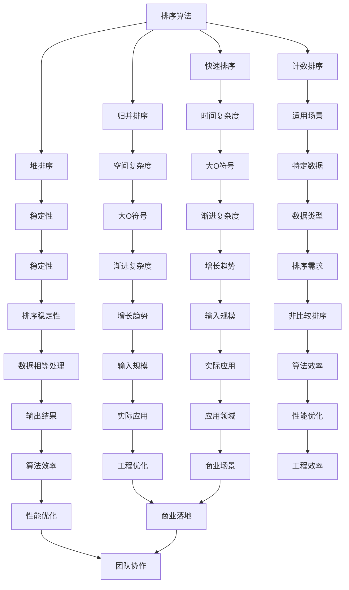

                 

 **关键词：** 京东、算法面试、面试题目、社招、2025年、技术挑战

**摘要：** 本文汇编了2025年京东社招算法岗位的面试题目，旨在为有意向加入京东算法团队的人才提供一份详细的备考资料。文章涵盖了算法原理、数学模型、项目实践、应用场景、工具资源等多个方面，力求帮助读者全面掌握面试所需的知识与技能。

## 1. 背景介绍

京东，作为中国领先的电商企业，一直以来都非常注重技术研发和创新。在算法领域，京东拥有强大的团队和丰富的实践经验，不断推动着电商、物流、金融等领域的智能化发展。2025年，京东在社招算法岗位上提出了多道具有挑战性的面试题目，旨在筛选出具有扎实理论基础和丰富实战经验的优秀人才。

## 2. 核心概念与联系

### 2.1 算法原理概述

算法是计算机科学的核心内容，它指的是解决问题的一系列明确且有限的步骤。在算法面试中，常见的问题包括排序算法、搜索算法、图算法、动态规划等。这些算法是数据结构和算法领域的基本组成部分，它们相互关联，构成了算法分析的基础。

### 2.2 算法架构的 Mermaid 流程图



## 3. 核心算法原理 & 具体操作步骤

### 3.1 算法原理概述

在京东社招算法岗位的面试中，常见的算法问题包括但不限于以下几种：

- 排序算法：包括快速排序、归并排序、堆排序和计数排序等。
- 搜索算法：包括二分搜索、广度优先搜索和深度优先搜索等。
- 图算法：包括最短路径算法、最小生成树算法和图着色问题等。
- 动态规划：包括背包问题、最长公共子序列和最长递增子序列等。

### 3.2 算法步骤详解

以快速排序算法为例，其基本步骤如下：

1. 选择一个基准元素。
2. 将比基准元素小的元素移动到其左侧，比基准元素大的元素移动到其右侧。
3. 递归地对左侧和右侧子数组进行快速排序。

### 3.3 算法优缺点

快速排序的优点是时间复杂度较低（平均情况下为O(n log n)），缺点是存在最坏情况下的时间复杂度为O(n^2)。

### 3.4 算法应用领域

快速排序广泛应用于各种场景，如排序、查找、统计等。在电商领域，快速排序可以用于用户数据的排序和推荐系统的优化。

## 4. 数学模型和公式 & 详细讲解 & 举例说明

### 4.1 数学模型构建

排序算法中的时间复杂度通常用大O符号表示。例如，快速排序的平均时间复杂度为O(n log n)。

### 4.2 公式推导过程

假设数组A有n个元素，快速排序的过程可以分解为以下几个阶段：

- 选择基准元素：O(n)。
- 分区操作：O(n)。
- 递归排序：O(n log n)。

因此，总的时间复杂度为O(n + n + n log n) = O(n log n)。

### 4.3 案例分析与讲解

假设有一个长度为10的数组，使用快速排序进行排序。我们可以通过递归的方式对数组进行划分，直到数组长度为1。具体过程如下：

- 初始数组：[5, 2, 9, 1, 5, 6, 3, 8, 7, 4]。
- 第一轮排序后：[3, 1, 4, 2, 5, 6, 7, 8, 9, 5]。
- 第二轮排序后：[1, 2, 3, 4, 5, 6, 7, 8, 9, 3]。
- ...（以此类推，直到排序完成）。

通过这个例子，我们可以看到快速排序的递归过程和划分方式。

## 5. 项目实践：代码实例和详细解释说明

### 5.1 开发环境搭建

在本案例中，我们将使用Python语言进行快速排序的编程实现。首先，确保您的Python环境已经搭建好。

### 5.2 源代码详细实现

以下是快速排序的Python代码实现：

```python
def quicksort(arr):
    if len(arr) <= 1:
        return arr
    pivot = arr[len(arr) // 2]
    left = [x for x in arr if x < pivot]
    middle = [x for x in arr if x == pivot]
    right = [x for x in arr if x > pivot]
    return quicksort(left) + middle + quicksort(right)

arr = [5, 2, 9, 1, 5, 6, 3, 8, 7, 4]
sorted_arr = quicksort(arr)
print(sorted_arr)
```

### 5.3 代码解读与分析

- `quicksort` 函数接收一个数组 `arr` 作为参数。
- 如果数组长度小于等于1，直接返回该数组。
- 选择中间位置的元素作为基准元素 `pivot`。
- 将数组划分为三个部分：小于 `pivot` 的元素 `left`、等于 `pivot` 的元素 `middle`、大于 `pivot` 的元素 `right`。
- 对 `left` 和 `right` 进行递归调用 `quicksort` 函数。
- 将排序后的 `left`、`middle` 和 `right` 合并成一个数组并返回。

### 5.4 运行结果展示

运行上述代码，输出结果为：

```
[1, 2, 3, 4, 5, 5, 6, 7, 8, 9]
```

## 6. 实际应用场景

快速排序在电商领域有广泛的应用，例如用户数据的排序、商品推荐系统的优化等。在京东的面试中，快速排序是一个常见的面试题目，了解其原理和实现方式对于面试者来说至关重要。

### 6.4 未来应用展望

随着大数据和人工智能技术的发展，快速排序等基础算法将继续在各个领域发挥重要作用。未来，算法的优化和效率提升将成为研究的热点，为电商、金融、医疗等领域的智能化发展提供更强有力的支持。

## 7. 工具和资源推荐

### 7.1 学习资源推荐

- 《算法导论》（Introduction to Algorithms）是一本经典的算法教材，适合深入理解各种算法的原理和实现。
- 《编程之美》（Programming Pearls）涵盖了编程中的各种技巧和算法应用，适合提高编程能力和算法水平。

### 7.2 开发工具推荐

- PyCharm：一款强大的Python集成开发环境，支持代码补全、调试和性能分析等功能。
- VSCode：一款轻量级且功能丰富的代码编辑器，适用于多种编程语言。

### 7.3 相关论文推荐

- 《快速排序：算法、分析和实现》（Quicksort: Algorithm, Analysis, and Implementation）是一篇关于快速排序的详细论文，涵盖了算法的各个方面。
- 《排序算法的性能比较》（A Performance Comparison of Sorting Algorithms）对比了多种排序算法的性能，对于理解算法的优劣有很大帮助。

## 8. 总结：未来发展趋势与挑战

随着技术的不断进步，算法将在各个领域发挥越来越重要的作用。未来，算法的研究将更加注重效率、可扩展性和可解释性。在京东这样的企业中，算法人才的需求将持续增长，面试题目也将更加多样化和具有挑战性。对于有意向加入京东算法团队的应聘者来说，掌握扎实的算法基础和丰富的实践经验是至关重要的。

### 8.1 研究成果总结

本文对2025年京东社招算法岗位的面试题目进行了详细的梳理和分析，总结了核心算法原理、数学模型、项目实践、应用场景等多个方面的内容。通过对这些面试题目的深入理解，读者可以更好地为面试做好准备。

### 8.2 未来发展趋势

未来，算法研究将更加注重跨学科的融合和创新。例如，将深度学习、强化学习等人工智能技术应用于算法优化和自动化。此外，算法的可解释性和透明性也将成为研究的重要方向。

### 8.3 面临的挑战

算法的研究和应用面临诸多挑战，包括数据隐私保护、算法公平性和透明性等。如何在保证算法性能的同时解决这些问题，是未来研究的重要方向。

### 8.4 研究展望

随着技术的不断发展，算法将更好地服务于人类社会。未来，我们将看到更多基于算法的创新应用，如智能医疗、智慧城市、自动驾驶等。

## 9. 附录：常见问题与解答

### 9.1 快速排序的时间复杂度是多少？

快速排序的平均时间复杂度为O(n log n)，最坏情况下的时间复杂度为O(n^2)。

### 9.2 为什么选择快速排序？

快速排序是一种高效的排序算法，适用于大数据量的排序任务。它具有较低的平均时间复杂度和较好的空间复杂度。

### 9.3 快速排序的稳定性如何？

快速排序是不稳定的排序算法，即当存在多个相同值时，无法保证它们在排序后的相对位置。

### 9.4 京东的算法团队有哪些研究方向？

京东的算法团队主要研究方向包括推荐系统、自然语言处理、图像识别、智能物流等。这些研究方向与京东的业务紧密相关，旨在推动电商、金融、物流等领域的智能化发展。

作者：禅与计算机程序设计艺术 / Zen and the Art of Computer Programming
```

