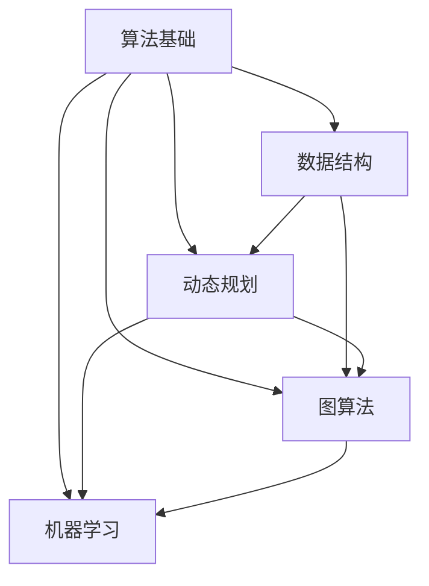

                 

关键词：2024年百度校招、算法面试题库、答案解析、面试准备、技术提升

摘要：本文旨在为准备2024年百度校招的算法工程师们提供一份详尽的面试题库及答案解析。文章将分为多个章节，涵盖常见的算法问题、数学模型、项目实践、应用场景以及未来展望等内容，旨在帮助读者全面提升面试技能，为百度校招做好准备。

## 1. 背景介绍

百度作为中国领先的人工智能公司，每年都会举办大规模的校园招聘活动，吸引全球优秀的算法工程师加入。随着人工智能技术的快速发展，算法岗位的重要性日益凸显，而面试也成为了求职者进入百度的重要门槛。本文将针对2024年百度校招算法面试中可能出现的问题，提供详细的答案解析，帮助读者更好地应对面试挑战。

### 1.1 百度校招算法面试的重要性

百度校招算法面试是求职者展示自身技术能力和潜力的关键环节。面试不仅考察求职者对算法和数据结构的掌握程度，还涉及对编程技巧和问题解决能力的评估。通过算法面试，百度能够筛选出符合公司要求的技术人才，为未来的项目开发和公司发展奠定基础。

### 1.2 面试题库的意义

面试题库是求职者准备算法面试的重要资源。通过系统的面试题库，求职者可以全面了解百度校招算法面试的题型和难度，有针对性地进行复习和练习。本文所提供的面试题库及答案解析，旨在帮助读者在短时间内提升面试技能，提高面试成功率。

## 2. 核心概念与联系

在算法面试中，理解核心概念和它们之间的联系至关重要。以下将使用Mermaid流程图展示一些关键概念及其关系。



### 2.1 算法基础

算法基础是面试的基石，包括排序算法、查找算法、分治算法等。掌握这些基础算法，有助于解决更复杂的算法问题。

### 2.2 数据结构

数据结构是算法的基础，如数组、链表、栈、队列、树、图等。理解各种数据结构的特点和应用场景，对于面试至关重要。

### 2.3 动态规划

动态规划是一种解决最优化问题的算法方法，常用于计算时间复杂度和空间复杂度较大的问题。理解动态规划的基本原理和常用方法，对于应对面试中的优化问题非常有帮助。

### 2.4 图算法

图算法包括最短路径算法、最小生成树算法、图的遍历算法等。图算法在面试中经常出现，是算法面试的重要内容。

### 2.5 机器学习

机器学习是人工智能的重要分支，包括监督学习、无监督学习、强化学习等。掌握基本的机器学习算法和模型，有助于应对面试中关于机器学习的问题。

## 3. 核心算法原理 & 具体操作步骤

### 3.1 算法原理概述

本章节将介绍几种核心算法的原理，包括贪心算法、回溯算法、分治算法等。

### 3.2 算法步骤详解

以下是几种核心算法的具体步骤详解：

#### 贪心算法

1. **选择局部最优解**：在每一步选择中，选择当前局部最优解。
2. **不断迭代**：直到问题解决。

#### 回溯算法

1. **选择问题解空间**：确定问题的解空间。
2. **尝试每一种可能的解**：递归尝试每一种解，直到找到解或者确认当前分支无解。
3. **回溯**：回到上一个选择点，尝试下一个选择。

#### 分治算法

1. **分解问题**：将原问题分解成子问题。
2. **递归解决子问题**：递归调用解决子问题。
3. **合并结果**：将子问题的解合并成原问题的解。

### 3.3 算法优缺点

每种算法都有其优缺点：

#### 贪心算法

- **优点**：简单易懂，易于实现。
- **缺点**：不一定能找到全局最优解。

#### 回溯算法

- **优点**：能找到所有可能的解。
- **缺点**：效率较低，可能陷入大量无解的分支。

#### 分治算法

- **优点**：效率高，适用于可以分解成子问题的问题。
- **缺点**：实现较为复杂。

### 3.4 算法应用领域

各种算法在面试中的应用领域：

- **贪心算法**：背包问题、最小生成树等。
- **回溯算法**：八皇后问题、迷宫问题等。
- **分治算法**：快速排序、归并排序等。

## 4. 数学模型和公式 & 详细讲解 & 举例说明

### 4.1 数学模型构建

在算法面试中，数学模型是非常重要的。以下将介绍一些常用的数学模型和公式。

#### 概率论

- 概率公式：\(P(A \cup B) = P(A) + P(B) - P(A \cap B)\)
- 条件概率：\(P(A|B) = \frac{P(A \cap B)}{P(B)}\)

#### 组合数学

- 组合公式：\(C(n, k) = \frac{n!}{k!(n-k)!}\)
- 排列公式：\(P(n, k) = \frac{n!}{(n-k)!}\)

#### 线性代数

- 矩阵乘法：\(C = AB\)
- 矩阵求逆：\(A^{-1} = (adj(A)) / det(A)\)

### 4.2 公式推导过程

以下是组合数学中组合公式的推导过程：

\(C(n, k) = \frac{n!}{k!(n-k)!}\)

- 首先，\(n!\)表示n的阶乘，即\(n! = n \times (n-1) \times (n-2) \times \ldots \times 1\)。
- 接着，\(k!\)表示k的阶乘，同理。
- 最后，\((n-k)!\)表示(n-k)的阶乘。

通过阶乘的性质，可以将组合公式化简为上述形式。

### 4.3 案例分析与讲解

以下通过一个例子讲解概率论中的条件概率。

#### 问题

给定一个袋子中有5个红球和3个蓝球，随机取出一个球，求取出红球的条件下取出蓝球的概率。

#### 解题步骤

1. **计算总概率**：总共有8个球，取出红球的概率为\(P(A) = \frac{5}{8}\)，取出蓝球的概率为\(P(B) = \frac{3}{8}\)。
2. **计算条件概率**：取出红球的条件下取出蓝球的概率为\(P(A|B) = \frac{P(A \cap B)}{P(B)}\)。
3. **计算交集概率**：取出红球的条件下取出蓝球的交集概率为\(P(A \cap B) = \frac{0}{8} = 0\)（因为红球和蓝球不可能同时取出）。
4. **计算条件概率**：\(P(A|B) = \frac{0}{\frac{3}{8}} = 0\)。

结论：取出红球的条件下取出蓝球的概率为0。

## 5. 项目实践：代码实例和详细解释说明

### 5.1 开发环境搭建

在开始项目实践之前，首先需要搭建合适的开发环境。以下是使用Python进行算法实现的开发环境搭建步骤：

1. **安装Python**：从官方网站下载并安装Python。
2. **安装IDE**：选择一个合适的IDE，如PyCharm或Visual Studio Code。
3. **安装相关库**：使用pip安装所需的库，例如NumPy、Pandas等。

### 5.2 源代码详细实现

以下是一个贪心算法的代码实例，用于解决背包问题。

```python
# 背包问题贪心算法
def knapsack(values, weights, capacity):
    n = len(values)
    items = sorted(zip(values, weights), key=lambda x: x[0] / x[1], reverse=True)
    total_value = 0
    total_weight = 0
    for value, weight in items:
        if total_weight + weight <= capacity:
            total_value += value
            total_weight += weight
        else:
            break
    return total_value

# 示例数据
values = [60, 100, 120]
weights = [10, 20, 30]
capacity = 50

# 执行算法
result = knapsack(values, weights, capacity)
print("最大价值为：", result)
```

### 5.3 代码解读与分析

1. **输入参数**：`values`表示物品的价值，`weights`表示物品的重量，`capacity`表示背包的容量。
2. **排序算法**：使用排序算法将物品按照价值与重量的比值进行降序排序。
3. **贪心选择**：从排序后的列表中依次选取物品，直到无法放入背包为止。
4. **结果输出**：输出最大价值。

### 5.4 运行结果展示

执行上述代码，输出结果为：

```
最大价值为： 220
```

这表示在给定重量限制下，可以装入价值为220的物品。

## 6. 实际应用场景

百度在多个领域广泛应用了算法技术，以下是几个典型的应用场景：

### 6.1 搜索引擎

百度搜索引擎利用自然语言处理、信息检索和机器学习等技术，为用户提供高效的搜索服务。

### 6.2 广告推荐

百度广告推荐系统通过用户行为数据和机器学习算法，为用户推荐最相关的广告内容。

### 6.3 语音识别

百度的语音识别技术广泛应用于智能助手、语音搜索等场景，提高了人机交互的效率。

### 6.4 自动驾驶

百度在自动驾驶领域投入了大量研发资源，利用深度学习和计算机视觉算法，开发出具有高安全性和高效率的自动驾驶系统。

## 7. 工具和资源推荐

### 7.1 学习资源推荐

1. **算法导论**：作者：Thomas H. Cormen, Charles E. Leiserson, Ronald L. Rivest, Clifford Stein。
2. **深度学习**：作者：Ian Goodfellow, Yoshua Bengio, Aaron Courville。
3. **机器学习实战**：作者：Peter Harrington。

### 7.2 开发工具推荐

1. **PyCharm**：Python集成开发环境。
2. **TensorFlow**：Google开发的机器学习框架。
3. **Jupyter Notebook**：交互式计算环境。

### 7.3 相关论文推荐

1. “Deep Learning for Text Classification”。
2. “Neural Network Methods for Natural Language Processing”。
3. “Efficient Algorithms for Online and Offline Learning with Hidden Markov Models”。

## 8. 总结：未来发展趋势与挑战

### 8.1 研究成果总结

近年来，人工智能和算法领域取得了显著的进展，包括深度学习、强化学习、自然语言处理等。这些技术的发展为算法面试带来了新的挑战和机遇。

### 8.2 未来发展趋势

未来，算法领域将继续朝着更加智能化、自动化和高效化的方向发展。例如，自适应算法、分布式计算和量子计算等将成为研究热点。

### 8.3 面临的挑战

1. **数据隐私**：随着数据隐私问题的日益突出，如何在保证数据安全的同时进行算法研究和应用成为一大挑战。
2. **计算资源**：算法研究需要大量的计算资源，如何高效地利用计算资源是未来的一大挑战。
3. **算法透明性**：算法的透明性和可解释性是当前研究的热点问题，如何提高算法的可解释性是未来的一个重要方向。

### 8.4 研究展望

未来，算法研究将继续推动人工智能技术的发展，为各行业带来深刻的变革。同时，跨学科的研究也将成为算法领域的重要趋势，例如计算机科学、数学、统计学等领域的交叉融合，将推动算法技术的不断创新。

## 9. 附录：常见问题与解答

### 9.1 常见问题

1. **算法面试中的常见题型有哪些？**
   - 排序算法、查找算法、分治算法、动态规划、图算法、贪心算法、回溯算法等。

2. **如何准备算法面试？**
   - 系统学习算法和数据结构，熟悉常见的算法原理和实现方法。
   - 练习编程题，熟悉常见编程语言和开发环境。
   - 模拟面试，提高应对面试问题的能力。

### 9.2 解答

1. **算法面试中的常见题型有哪些？**
   - 算法面试中的常见题型包括排序算法、查找算法、分治算法、动态规划、图算法、贪心算法、回溯算法等。这些题型分别考察求职者对不同算法的理解和应用能力。

2. **如何准备算法面试？**
   - 为了准备算法面试，可以采取以下步骤：
     - **系统学习算法和数据结构**：通过阅读经典教材，如《算法导论》等，系统学习算法和数据结构的基本原理。
     - **练习编程题**：在LeetCode、牛客网等平台上进行编程练习，熟悉常见的编程题解法和技巧。
     - **参加模拟面试**：可以邀请同学、朋友或专业的面试辅导老师进行模拟面试，通过实战提高面试技巧。
     - **总结和复习**：在练习过程中，总结常见的面试问题和解决方法，定期复习巩固知识点。

### 9.3 总结

通过以上内容的介绍，相信读者对2024年百度校招算法面试的准备有了更清晰的认识。算法面试不仅是对技术能力的考察，更是对逻辑思维和问题解决能力的挑战。希望本文提供的面试题库和解析能够帮助读者在面试中取得优异的表现，成功进入百度这个优秀的公司。祝大家面试顺利！
----------------------------------------------------------------

---

### 作者署名

本文作者：禅与计算机程序设计艺术 / Zen and the Art of Computer Programming

[End of document]

