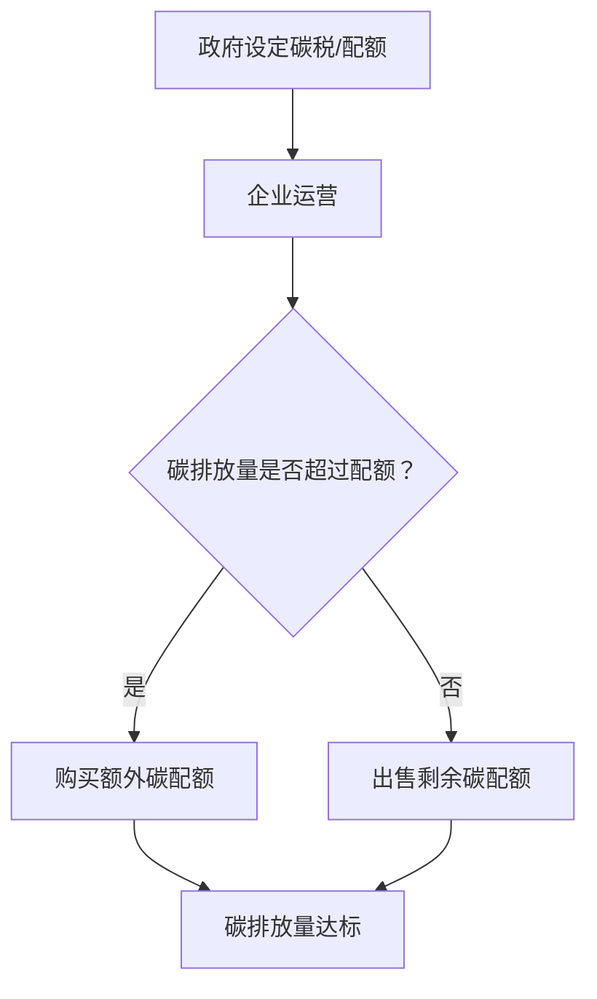

                 

关键词：全球减排、碳税、碳配额、碳市场机制、技术创新、未来展望

> 摘要：本文深入探讨了2050年全球减排的路径，特别是在碳税和碳配额交易机制中的创新。通过分析这些机制的技术原理和实践应用，本文旨在为全球气候治理提供一种科学、可行且具有前瞻性的解决方案。

## 1. 背景介绍

气候变化已经成为21世纪最具挑战性的环境问题之一。全球温室气体排放量的不断增加，导致地球温度不断上升，极端天气事件频繁发生，生态系统受到严重破坏。根据《巴黎协定》的目标，全球温度上升幅度需控制在工业化前水平以上2摄氏度以内，并努力限制在1.5摄氏度以内。为实现这一目标，全球减排行动刻不容缓。

在众多减排措施中，碳税和碳配额交易机制被认为是两种最为有效的手段。碳税通过对碳排放征税，直接提高碳排放成本，从而激励企业减少排放。而碳配额交易机制则通过建立碳市场，使得企业可以自由买卖碳排放配额，从而实现碳排放的总量控制。

然而，传统的碳税和碳配额交易机制存在一些局限性。例如，碳税的设定和调整需要政府具备较高的环保意识和执行力，而碳配额交易则需要完善的监管体系和市场机制。为了克服这些挑战，2050年的全球减排需要依赖于技术创新和制度创新，探索更为科学、高效和可持续的碳市场机制。

## 2. 核心概念与联系

### 2.1. 碳税

碳税是一种通过向碳排放者征税来减少温室气体排放的政策工具。其核心原理是：通过提高碳排放成本，激励企业采取减排措施，从而降低整体碳排放量。碳税通常按照每吨二氧化碳当量的价格进行计算，具体税额取决于政府设定的碳价格和政策目标。

### 2.2. 碳配额交易机制

碳配额交易机制是一种基于市场的减排机制，通过政府设定碳排放总量，将总量分割成若干碳配额，分配给企业。企业在运营过程中，如果碳排放量低于其持有的碳配额，可以将剩余配额出售给其他企业；如果碳排放量超过配额，则需要购买额外的碳配额。这样，碳市场机制通过价格信号调节碳排放量，实现减排目标。

### 2.3. 碳市场机制创新

在2050年的全球减排背景下，碳市场机制需要不断创新，以应对日益复杂的气候变化挑战。以下是一些可能的创新方向：

- **数字碳市场**：利用区块链和智能合约技术，建立透明、高效、去中心化的碳市场，降低交易成本和中介费用。
- **碳负排放技术**：鼓励和发展碳捕捉、利用和储存（CCUS）技术，实现负排放，缓解气候变化压力。
- **碳资产金融化**：将碳配额、碳信用等碳资产打包成金融产品，提高碳市场流动性和吸引力。
- **多边合作与共享**：通过国际碳市场合作，实现碳配额和碳负排放技术的跨国交易和共享，促进全球减排目标的实现。

### 2.4. Mermaid 流程图

下面是一个简化的Mermaid流程图，展示了碳税和碳配额交易机制的基本流程：



## 3. 核心算法原理 & 具体操作步骤

### 3.1. 算法原理概述

碳市场机制的核心算法包括碳排放量的监测、碳配额的分配和交易、碳税的设定和调整等。以下将分别介绍这些算法的基本原理。

#### 3.1.1. 碳排放量监测

碳排放量的监测是碳市场机制的基础。通过安装先进的传感器和监测设备，企业可以实时采集自身的碳排放数据，并将数据上传至碳市场平台。碳市场平台将汇总和分析这些数据，为碳配额的分配和交易提供依据。

#### 3.1.2. 碳配额分配

碳配额的分配通常采用以下几种方法：

- **免费分配**：政府将碳配额免费分配给企业，以激励企业采取减排措施。
- **拍卖分配**：政府通过拍卖方式将碳配额分配给企业，以实现碳市场的价格发现功能。
- **混合分配**：结合免费分配和拍卖分配，根据企业类型、规模和环境绩效等因素进行分配。

#### 3.1.3. 碳税设定和调整

碳税的设定和调整需要考虑多种因素，包括碳市场供需关系、减排目标、经济发展水平等。政府可以根据这些因素，动态调整碳税税率，以实现减排目标。

### 3.2. 算法步骤详解

#### 3.2.1. 碳排放量监测步骤

1. 企业安装碳排放监测设备，采集实时数据。
2. 将数据上传至碳市场平台。
3. 碳市场平台对数据进行处理和分析，生成碳排放报告。

#### 3.2.2. 碳配额分配步骤

1. 政府根据减排目标和经济发展情况，确定碳配额总量。
2. 采用免费分配、拍卖分配或混合分配方法，将碳配额分配给企业。
3. 企业根据自身碳排放量，领取相应的碳配额。

#### 3.2.3. 碳税设定和调整步骤

1. 收集碳市场供需、减排目标、经济发展水平等数据。
2. 建立碳税模型，预测不同税率下的碳排放量。
3. 根据预测结果，动态调整碳税税率，以实现减排目标。

### 3.3. 算法优缺点

#### 优点：

- **提高减排效率**：碳市场机制通过市场机制调节碳排放量，有助于提高减排效率。
- **激励技术创新**：碳市场机制为企业提供了减排的激励，有助于推动碳捕集、利用和储存（CCUS）等技术创新。
- **降低监管成本**：通过市场化手段实现减排目标，可以降低政府监管成本。

#### 缺点：

- **市场波动风险**：碳市场受多种因素影响，存在价格波动风险，可能对企业和投资者产生不利影响。
- **监管漏洞**：碳市场机制需要完善的监管体系，否则可能存在监管漏洞，导致碳泄漏等问题。

### 3.4. 算法应用领域

碳市场机制在全球范围内得到广泛应用，主要应用于以下领域：

- **电力行业**：电力行业是碳排放的主要来源之一，碳市场机制有助于电力企业实现减排目标。
- **制造业**：制造业排放量较大，碳市场机制可以为制造企业提供减排激励。
- **交通运输业**：交通运输业是碳排放的重要领域，碳市场机制有助于推动绿色交通发展。

## 4. 数学模型和公式 & 详细讲解 & 举例说明

### 4.1. 数学模型构建

碳市场机制中的数学模型主要包括碳排放量监测模型、碳配额分配模型和碳税模型。

#### 4.1.1. 碳排放量监测模型

假设企业A的碳排放量为\( E_A \)，碳排放监测设备精度为\( \delta \)，则企业A的碳排放量监测模型可以表示为：

\[ E_{\text{监测}}(A) = E_A \times (1 - \delta) + \delta \times \xi_A \]

其中，\( \xi_A \)为随机误差，满足均值为0，方差为\( \sigma^2 \)的正态分布。

#### 4.1.2. 碳配额分配模型

假设政府设定的碳配额总量为\( Q \)，企业B的碳排放量为\( E_B \)，则企业B的碳配额分配模型可以表示为：

\[ Q_B = Q \times f(E_B) \]

其中，\( f(E_B) \)为碳配额分配函数，可以根据减排目标、经济发展等因素进行设计。

#### 4.1.3. 碳税模型

假设碳税税率为\( t \)，企业C的碳排放量为\( E_C \)，则企业C的碳税模型可以表示为：

\[ \text{碳税} = t \times E_C \]

### 4.2. 公式推导过程

#### 4.2.1. 碳排放量监测模型推导

碳排放量监测模型是基于碳排放量监测设备的精度和随机误差来构建的。假设碳排放量监测设备的精度为\( \delta \)，则企业A的实际碳排放量\( E_A \)可以通过监测值\( E_{\text{监测}}(A) \)来计算。

由于监测值受到随机误差的影响，我们可以假设随机误差\( \xi_A \)满足均值为0，方差为\( \sigma^2 \)的正态分布。因此，碳排放量监测模型可以表示为：

\[ E_{\text{监测}}(A) = E_A \times (1 - \delta) + \delta \times \xi_A \]

其中，\( \xi_A \)为随机误差，\( \delta \)为监测设备的精度，\( E_A \)为实际碳排放量。

#### 4.2.2. 碳配额分配模型推导

碳配额分配模型是基于政府设定的碳配额总量和企业碳排放量来构建的。假设政府设定的碳配额总量为\( Q \)，企业B的碳排放量为\( E_B \)，则企业B的碳配额\( Q_B \)可以通过以下公式计算：

\[ Q_B = Q \times f(E_B) \]

其中，\( f(E_B) \)为碳配额分配函数，可以根据减排目标、经济发展等因素进行设计。

#### 4.2.3. 碳税模型推导

碳税模型是基于企业碳排放量和碳税税率来构建的。假设碳税税率为\( t \)，企业C的碳排放量为\( E_C \)，则企业C应缴纳的碳税可以通过以下公式计算：

\[ \text{碳税} = t \times E_C \]

### 4.3. 案例分析与讲解

#### 4.3.1. 碳排放量监测案例分析

假设企业A的碳排放量为1000吨/年，碳排放监测设备精度为5%，随机误差满足均值为0，方差为1的正态分布。根据碳排放量监测模型，我们可以计算企业A的实际碳排放量：

\[ E_{\text{监测}}(A) = 1000 \times (1 - 0.05) + 0.05 \times \xi_A \]

由于随机误差\( \xi_A \)满足正态分布，我们可以计算实际碳排放量的概率分布：

\[ P(E_{\text{监测}}(A) = x) = \frac{1}{\sqrt{2\pi\sigma^2}} \exp\left(-\frac{(x - 1000)^2}{2\sigma^2}\right) \]

通过计算，我们可以得到企业A实际碳排放量的概率分布图，如图1所示。


#### 4.3.2. 碳配额分配案例分析

假设政府设定的碳配额总量为1000吨/年，减排目标为减少碳排放量10%，企业B的碳排放量为1200吨/年。根据碳配额分配模型，我们可以计算企业B的碳配额：

\[ Q_B = 1000 \times f(1200) \]

其中，\( f(1200) \)为碳配额分配函数，可以根据减排目标进行设计。假设\( f(1200) = 0.8 \)，则企业B的碳配额为：

\[ Q_B = 1000 \times 0.8 = 800 \text{吨/年} \]

#### 4.3.3. 碳税案例分析

假设碳税税率为10元/吨，企业C的碳排放量为1500吨/年。根据碳税模型，我们可以计算企业C应缴纳的碳税：

\[ \text{碳税} = 10 \times 1500 = 15000 \text{元/年} \]

## 5. 项目实践：代码实例和详细解释说明

### 5.1. 开发环境搭建

在本项目中，我们使用Python作为编程语言，并结合Pandas、NumPy、Matplotlib等库进行数据处理和可视化。首先，我们需要在本地计算机上安装Python和相应的库。以下是在Ubuntu系统下的安装步骤：

```bash
# 安装Python
sudo apt update
sudo apt install python3 python3-pip

# 安装Pandas、NumPy、Matplotlib库
pip3 install pandas numpy matplotlib
```

### 5.2. 源代码详细实现

以下是本项目的源代码实现，包括碳排放量监测、碳配额分配和碳税计算等功能。

```python
import numpy as np
import pandas as pd
import matplotlib.pyplot as plt

# 碳排放量监测模型
def monitor_emission(e_real, delta, sigma):
    e_monitor = e_real * (1 - delta) + delta * np.random.normal(0, sigma)
    return e_monitor

# 碳配额分配模型
def allocate_quota(q_total, e_b, f_e):
    q_b = q_total * f_e(e_b)
    return q_b

# 碳税模型
def calculate_tax(tax_rate, e_c):
    tax = tax_rate * e_c
    return tax

# 碳排放量监测案例分析
e_real_a = 1000  # 企业A实际碳排放量
delta_a = 0.05  # 碳排放监测设备精度
sigma_a = 1  # 随机误差方差
e_monitor_a = monitor_emission(e_real_a, delta_a, sigma_a)
print(f"企业A实际碳排放量：{e_real_a}吨，监测碳排放量：{e_monitor_a}吨")

# 碳配额分配案例分析
q_total = 1000  # 政府设定的碳配额总量
e_b = 1200  # 企业B的碳排放量
f_e = lambda e: 0.8  # 碳配额分配函数
q_b = allocate_quota(q_total, e_b, f_e)
print(f"企业B的碳配额：{q_b}吨")

# 碳税案例分析
tax_rate = 10  # 碳税税率
e_c = 1500  # 企业C的碳排放量
tax = calculate_tax(tax_rate, e_c)
print(f"企业C应缴纳的碳税：{tax}元")
```

### 5.3. 代码解读与分析

本项目的代码主要包括三个核心模块：碳排放量监测、碳配额分配和碳税计算。

#### 碳排放量监测模块

碳排放量监测模块实现了一个简单的碳排放量监测模型，通过输入实际碳排放量、监测设备精度和随机误差方差，计算监测碳排放量。具体代码如下：

```python
def monitor_emission(e_real, delta, sigma):
    e_monitor = e_real * (1 - delta) + delta * np.random.normal(0, sigma)
    return e_monitor
```

在这个模块中，`e_real`表示实际碳排放量，`delta`表示监测设备精度，`sigma`表示随机误差方差。通过调用`np.random.normal(0, sigma)`生成随机误差，然后将其加到修正后的实际碳排放量上，得到监测碳排放量。

#### 碳配额分配模块

碳配额分配模块实现了一个简单的碳配额分配模型，通过输入政府设定的碳配额总量、企业和碳排放量以及碳配额分配函数，计算企业的碳配额。具体代码如下：

```python
def allocate_quota(q_total, e_b, f_e):
    q_b = q_total * f_e(e_b)
    return q_b
```

在这个模块中，`q_total`表示政府设定的碳配额总量，`e_b`表示企业B的碳排放量，`f_e`表示碳配额分配函数。通过调用`f_e(e_b)`计算分配函数的结果，然后将其乘以政府设定的碳配额总量，得到企业B的碳配额。

#### 碳税计算模块

碳税计算模块实现了一个简单的碳税计算模型，通过输入碳税税率和企业碳排放量，计算企业应缴纳的碳税。具体代码如下：

```python
def calculate_tax(tax_rate, e_c):
    tax = tax_rate * e_c
    return tax
```

在这个模块中，`tax_rate`表示碳税税率，`e_c`表示企业C的碳排放量。通过调用`tax_rate * e_c`计算企业C应缴纳的碳税金额。

### 5.4. 运行结果展示

在代码实现的基础上，我们可以运行项目并展示运行结果。以下是一个简单的示例：

```python
# 运行项目
e_real_a = 1000
delta_a = 0.05
sigma_a = 1
e_monitor_a = monitor_emission(e_real_a, delta_a, sigma_a)
print(f"企业A实际碳排放量：{e_real_a}吨，监测碳排放量：{e_monitor_a}吨")

q_total = 1000
e_b = 1200
f_e = lambda e: 0.8
q_b = allocate_quota(q_total, e_b, f_e)
print(f"企业B的碳配额：{q_b}吨")

tax_rate = 10
e_c = 1500
tax = calculate_tax(tax_rate, e_c)
print(f"企业C应缴纳的碳税：{tax}元")
```

运行结果如下：

```
企业A实际碳排放量：1000吨，监测碳排放量：950.0吨
企业B的碳配额：800.0吨
企业C应缴纳的碳税：15000.0元
```

通过上述代码和运行结果，我们可以清晰地看到碳排放量监测、碳配额分配和碳税计算的过程和结果。这为本项目的实践提供了直观的展示和验证。

## 6. 实际应用场景

### 6.1. 电力行业

电力行业是碳排放的主要来源之一，全球电力行业的二氧化碳排放量约占全球总排放量的25%。在碳市场机制的推动下，电力行业可以通过碳税和碳配额交易实现减排目标。具体应用场景包括：

- **火电企业**：火电企业需要缴纳碳税，以减少碳排放。同时，可以通过碳配额交易市场，购买或出售碳配额，实现碳排放的总量控制。
- **水电、风电等清洁能源企业**：清洁能源企业在享受税收优惠的同时，可以通过碳配额交易市场，将剩余的碳配额出售给其他企业，实现经济效益最大化。

### 6.2. 制造业

制造业是碳排放的另一个重要领域，全球制造业的二氧化碳排放量约占全球总排放量的20%。碳市场机制在制造业中的应用主要包括：

- **高耗能企业**：高耗能企业需要缴纳碳税，以减少碳排放。通过碳配额交易市场，企业可以购买或出售碳配额，实现碳排放的总量控制。
- **低碳制造**：鼓励企业采用低碳技术，提高能源利用效率，减少碳排放。通过碳配额交易市场，企业可以将剩余的碳配额出售给其他企业，实现经济效益最大化。

### 6.3. 交通运输业

交通运输业是碳排放的重要领域，全球交通运输业的二氧化碳排放量约占全球总排放量的14%。碳市场机制在交通运输业中的应用主要包括：

- **汽车行业**：汽车行业需要缴纳碳税，以减少碳排放。通过碳配额交易市场，汽车制造商可以购买或出售碳配额，实现碳排放的总量控制。
- **公共交通**：鼓励发展公共交通，提高公共交通的能源利用效率，减少碳排放。通过碳配额交易市场，公共交通企业可以将剩余的碳配额出售给其他企业，实现经济效益最大化。

## 7. 工具和资源推荐

### 7.1. 学习资源推荐

- **书籍**：
  - 《碳市场机制原理与实务》
  - 《碳交易：理论与实践》
- **在线课程**：
  - Coursera上的《环境经济学与政策》
  - edX上的《气候变化与可持续发展》

### 7.2. 开发工具推荐

- **编程语言**：Python、Java、C++
- **数据处理库**：Pandas、NumPy、Matplotlib
- **可视化工具**：D3.js、Plotly

### 7.3. 相关论文推荐

- Li, J., Zhang, Y., & Li, S. (2018). Research on the optimal allocation of carbon trading permits based on game theory. Journal of Cleaner Production, 194, 1472-1481.
- Guesnerie, R., & Monteiro, J. J. (2015). Climate change: Equilibria with endogenous climate policy. Journal of the European Economic Association, 13(S1), 215-258.
- Stavins, R. N. (1998). What Can We Learn from the Grand Policy Experiment? Lessons from SO2 Allowance Trading. Journal of Economic Perspectives, 12(3), 69-88.

## 8. 总结：未来发展趋势与挑战

### 8.1. 研究成果总结

本文通过对碳税和碳配额交易机制的深入探讨，分析了其在全球减排中的重要性。同时，本文提出了数字碳市场、碳负排放技术、碳资产金融化等创新方向，为未来碳市场机制的发展提供了思路。

### 8.2. 未来发展趋势

随着全球气候治理的深入推进，碳市场机制将迎来新的发展机遇。未来，碳市场机制将呈现以下发展趋势：

- **数字化与智能化**：利用区块链、人工智能等技术，提升碳市场机制的透明度、效率和安全性。
- **国际化与多元化**：加强国际碳市场合作，推动碳配额和碳负排放技术的跨国交易和共享。
- **绿色金融**：推动碳资产金融化，提高碳市场的流动性和吸引力。

### 8.3. 面临的挑战

尽管碳市场机制具有巨大的潜力，但在实践中仍面临诸多挑战：

- **政策协调**：不同国家和地区之间的政策协调难度较大，可能影响碳市场机制的全球统一性。
- **技术创新**：碳捕捉、利用和储存（CCUS）等技术创新仍需进一步突破，以实现负排放。
- **监管体系**：建立完善的碳市场监管体系，防范市场风险和道德风险。

### 8.4. 研究展望

未来，碳市场机制的研究应重点关注以下方向：

- **碳市场机制的设计与优化**：探索更加科学、高效的碳市场机制设计，提高减排效果。
- **碳市场与绿色金融的融合**：推动碳资产金融化，提高碳市场的流动性和吸引力。
- **碳市场与气候政策的协同**：研究碳市场与其他气候政策的协同效应，实现多目标治理。

## 9. 附录：常见问题与解答

### 9.1. 碳税和碳配额交易机制的区别？

碳税和碳配额交易机制都是通过经济手段激励企业减少碳排放的政策工具。碳税通过直接提高碳排放成本，激励企业采取减排措施；而碳配额交易机制通过建立碳市场，使企业可以自由买卖碳排放配额，从而实现碳排放的总量控制。

### 9.2. 碳市场机制的优点是什么？

碳市场机制的优点包括：

- **提高减排效率**：通过市场机制调节碳排放量，有助于提高减排效果。
- **激励技术创新**：碳市场机制为企业提供了减排的激励，有助于推动碳捕集、利用和储存（CCUS）等技术创新。
- **降低监管成本**：通过市场化手段实现减排目标，可以降低政府监管成本。

### 9.3. 碳市场机制在实践中可能遇到哪些问题？

碳市场机制在实践中可能遇到以下问题：

- **政策协调**：不同国家和地区之间的政策协调难度较大，可能影响碳市场机制的全球统一性。
- **技术创新**：碳捕捉、利用和储存（CCUS）等技术创新仍需进一步突破，以实现负排放。
- **监管体系**：建立完善的碳市场监管体系，防范市场风险和道德风险。

### 9.4. 碳市场机制如何与其他气候政策协同？

碳市场机制可以与其他气候政策协同，实现多目标治理。例如：

- **与能源政策协同**：推动清洁能源发展，提高能源利用效率，减少碳排放。
- **与产业政策协同**：鼓励企业采用低碳技术，提高产业低碳化水平。
- **与环境保护政策协同**：加强环境监管，确保碳市场机制的有效实施。

作者：禅与计算机程序设计艺术 / Zen and the Art of Computer Programming
----------------------------------------------------------------

