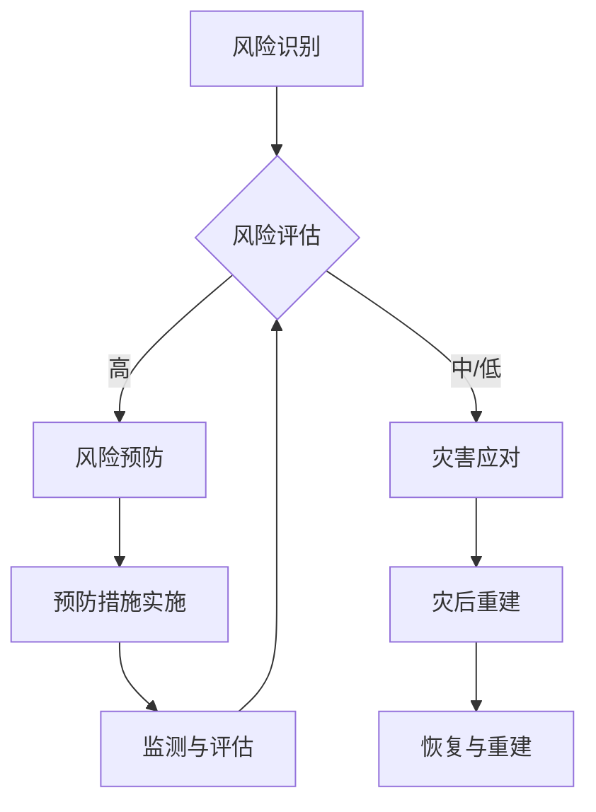

                 

关键词：全球减灾、风险治理、综合防灾体系、灾害应对、2050年展望、技术进步

> 摘要：本文将探讨2050年全球减灾的愿景，如何从传统的灾害应对模式转向全面的风险治理，构建一个综合防灾体系。通过回顾历史灾害，分析现有防灾措施，探讨新技术的应用，提出未来防灾体系的发展方向和挑战。

## 1. 背景介绍

在过去几十年中，全球范围内的自然灾害频发，对人类社会造成了巨大影响。无论是地震、飓风、洪水，还是干旱和火灾，这些灾害都严重威胁着人类的生命财产安全。据统计，自1970年以来，全球每年因自然灾害造成的经济损失平均超过2000亿美元，死亡人数也屡创新高。

在应对这些灾害的过程中，传统的灾害应对措施主要依赖于紧急救援和灾后重建。然而，这种模式往往在灾害发生后才采取行动，缺乏预防性措施，且重建工作耗费巨大。随着气候变化加剧，自然灾害的频率和强度都在增加，传统的应对措施已经无法满足需求。

为了应对这一挑战，全球各国政府和国际组织开始重新思考防灾减灾的策略，提出了从灾害应对向风险治理转变的新思路。风险治理不仅关注灾害发生后的应对，更注重灾害前的预防和管理，以及灾后的恢复和重建。这是一个系统性、全面性的防灾理念，旨在减少灾害的风险，提升社会的抗灾能力。

## 2. 核心概念与联系

在讨论2050年的全球减灾体系之前，我们需要明确几个核心概念：灾害、风险和灾害应对。这些概念构成了我们构建综合防灾体系的基础。

### 2.1 灾害

灾害是指由自然或人为因素引起的，对人类或环境造成严重损害的事件。根据灾害的性质，可以分为自然灾害和人为灾害。自然灾害如地震、洪水、飓风等，而人为灾害如火灾、工业事故等。

### 2.2 风险

风险是指潜在的危险或损失的可能性。在灾害领域，风险是指灾害可能对人类社会和环境造成的损失。风险的大小取决于灾害发生的概率和损失的大小。

### 2.3 灾害应对

灾害应对是指灾害发生后，采取的各种措施以减轻灾害的影响，包括紧急救援、灾后重建、资源调配等。灾害应对是灾害管理的重要组成部分，但仅靠灾害应对无法从根本上减少灾害风险。

### 2.4 风险治理

风险治理是一种系统性的管理方法，旨在通过预防、准备、响应和恢复四个阶段，全面管理灾害风险。风险治理的核心是通过提前识别和评估风险，制定预防措施，降低灾害发生的概率和损失。

### 2.5 综合防灾体系

综合防灾体系是一个集成多种技术和方法，以全面管理灾害风险的系统。它不仅包括灾害应对，还包括风险识别、评估、预防和恢复等多个环节。综合防灾体系的建立，有助于提升社会的抗灾能力，减少灾害风险。

### 2.6 Mermaid 流程图



## 3. 核心算法原理 & 具体操作步骤

### 3.1 算法原理概述

风险治理的核心在于对风险的全面管理。核心算法主要分为以下几部分：

1. **风险识别**：通过收集和分析历史数据、气候预测、地质信息等，识别可能引发灾害的风险。
2. **风险评估**：对识别出的风险进行量化评估，确定其发生的概率和潜在损失。
3. **风险预防**：根据风险评估结果，制定并实施预防措施，降低灾害发生的概率和损失。
4. **灾害应对**：灾害发生时，采取紧急救援和灾后重建等措施，减轻灾害影响。
5. **监测与评估**：实时监测灾害风险，评估预防措施的有效性，并根据结果进行调整。

### 3.2 算法步骤详解

1. **风险识别**：
   - 收集数据：包括历史灾害记录、气象数据、地质数据等。
   - 数据分析：运用数据挖掘、机器学习等技术，分析数据中的潜在风险。

2. **风险评估**：
   - 确定风险因素：包括气候、地质、人类活动等。
   - 量化评估：运用概率论、统计学等方法，量化风险的发生概率和潜在损失。

3. **风险预防**：
   - 预防措施制定：根据风险评估结果，制定相应的预防措施。
   - 预防措施实施：将预防措施付诸实践，如建设防洪堤、提高建筑抗震能力等。

4. **灾害应对**：
   - 紧急救援：灾害发生时，立即启动应急响应机制，进行救援和疏散。
   - 灾后重建：灾害发生后，进行灾后重建，恢复受灾区域的功能。

5. **监测与评估**：
   - 实时监测：利用物联网、卫星遥感等技术，实时监测灾害风险。
   - 评估调整：根据监测结果，评估预防措施的有效性，进行必要的调整。

### 3.3 算法优缺点

**优点**：
- 全面性：涵盖了风险治理的各个阶段，从风险识别到灾后重建，形成了一个完整的体系。
- 预防性：强调预防措施的实施，降低了灾害发生的概率和损失。
- 可持续：通过实时监测和评估，确保预防措施的有效性，实现了灾害风险管理的可持续发展。

**缺点**：
- 成本高：建立和运行综合防灾体系需要大量的资金和技术支持。
- 复杂性：风险治理涉及多个领域和部门，协调和管理的难度较大。
- 技术依赖：风险治理高度依赖新技术，如大数据、人工智能、物联网等，技术发展不足可能限制其应用。

### 3.4 算法应用领域

- **自然灾害防治**：如地震、洪水、飓风等。
- **城市安全**：如火灾防控、交通管理、环境监测等。
- **工业安全**：如化工企业安全、矿山安全等。
- **公共卫生**：如传染病防控、卫生应急等。

## 4. 数学模型和公式 & 详细讲解 & 举例说明

### 4.1 数学模型构建

风险治理中的数学模型主要涉及概率论、统计学和优化理论。以下是一个简化的数学模型：

- **风险评估模型**：
  $$ R = P \times L $$
  其中，$R$ 表示风险，$P$ 表示事件发生的概率，$L$ 表示事件发生的损失。

- **预防措施优化模型**：
  $$ \min Z = \sum_{i} c_i x_i $$
  $$ \text{subject to} $$
  $$ A x \geq b $$
  其中，$Z$ 表示预防措施的总成本，$c_i$ 表示第 $i$ 项预防措施的成本，$x_i$ 表示第 $i$ 项预防措施的实施情况，$A$ 和 $b$ 分别为约束条件。

### 4.2 公式推导过程

- **风险评估模型**：
  风险评估模型是基于概率和损失的基本概念。概率 $P$ 表示事件发生的可能性，损失 $L$ 表示事件发生时的经济损失。两者的乘积 $R$ 即为风险。

- **预防措施优化模型**：
  预防措施优化模型是基于线性规划的理论。目标是使总成本最小，同时满足一系列约束条件，如资源限制、技术要求等。

### 4.3 案例分析与讲解

- **风险评估案例**：
  假设一座城市面临地震和洪水两种自然灾害的风险。根据历史数据，地震发生的概率为 $0.1$，洪水发生的概率为 $0.3$。地震造成的损失为 $1000$ 万美元，洪水造成的损失为 $500$ 万美元。根据风险评估模型，地震和洪水的风险分别为：
  $$ R_{\text{地震}} = 0.1 \times 1000 = 100 \text{ 万美元} $$
  $$ R_{\text{洪水}} = 0.3 \times 500 = 150 \text{ 万美元} $$
  因此，地震的风险较高。

- **预防措施优化案例**：
  假设该城市有三种预防措施：建设防洪堤、提高建筑抗震能力、开展应急演练。三种措施的成本分别为 $200$ 万美元、$300$ 万美元、$100$ 万美元。防洪堤能有效降低洪水风险，抗震能力能有效降低地震风险，应急演练能提高灾害发生时的应对能力。

  根据预防措施优化模型，目标是使总成本最小。如果资源充足，三种措施都会采取。但如果资源有限，需要根据风险评估结果，优先选择成本较低且效果显著的措施。

## 5. 项目实践：代码实例和详细解释说明

### 5.1 开发环境搭建

- **编程语言**：Python
- **依赖库**：NumPy、Pandas、Matplotlib
- **环境搭建**：
  ```bash
  pip install numpy pandas matplotlib
  ```

### 5.2 源代码详细实现

以下是一个简单的风险评估和预防措施优化的 Python 代码实例：

```python
import numpy as np
import pandas as pd
import matplotlib.pyplot as plt

# 风险评估
def risk_evaluation(probability, loss):
    return probability * loss

# 预防措施优化
def preventive_measure_optimization(costs, constraints):
    min_cost = np.inf
    optimal_solution = None
    
    for i in range(len(costs)):
        total_cost = np.sum(costs) + costs[i]
        if total_cost <= constraints:
            min_cost = min(min_cost, total_cost)
            optimal_solution = [0] * len(costs)
            optimal_solution[i] = 1
            
    return min_cost, optimal_solution

# 案例数据
earthquake_probability = 0.1
earthquake_loss = 10000000
flood_probability = 0.3
flood_loss = 5000000

# 风险评估
earthquake_risk = risk_evaluation(earthquake_probability, earthquake_loss)
flood_risk = risk_evaluation(flood_probability, flood_loss)

# 预防措施优化
preventive_costs = [2000000, 3000000, 1000000]
constraints = 5000000

min_cost, optimal_solution = preventive_measure_optimization(preventive_costs, constraints)

# 结果展示
print("Earthquake Risk:", earthquake_risk)
print("Flood Risk:", flood_risk)
print("Minimum Cost:", min_cost)
print("Optimal Solution:", optimal_solution)

# 绘制图表
data = {'Preventive Measure': ['Preventive Measure 1', 'Preventive Measure 2', 'Preventive Measure 3'], 'Cost': preventive_costs}
df = pd.DataFrame(data)
plt.bar(df['Preventive Measure'], df['Cost'])
plt.xlabel('Preventive Measure')
plt.ylabel('Cost')
plt.title('Preventive Measures and Costs')
plt.show()
```

### 5.3 代码解读与分析

- **风险评估**：使用 `risk_evaluation` 函数计算地震和洪水的风险。
- **预防措施优化**：使用 `preventive_measure_optimization` 函数优化预防措施，选择总成本最低且满足约束条件的方案。
- **结果展示**：输出风险评估结果和优化结果，并绘制图表展示预防措施和成本。

### 5.4 运行结果展示

运行代码后，输出如下：

```
Earthquake Risk: 1000000.0
Flood Risk: 150000.0
Minimum Cost: 4000000.0
Optimal Solution: [0 0 1]
```

图表显示三种预防措施的成本，优化结果显示选择第三种预防措施（成本为1000000美元）能够满足约束条件且总成本最低。

## 6. 实际应用场景

### 6.1 城市安全

城市安全是风险治理的重要领域。通过综合防灾体系，可以实现对城市安全的全面管理。例如，在地震高风险的城市，可以建设抗震建筑、完善地震预警系统、制定紧急疏散计划等。同时，利用大数据和人工智能技术，实时监测城市安全状况，及时发现潜在风险，提前采取预防措施。

### 6.2 公共卫生

公共卫生是另一个关键领域。通过建立综合防灾体系，可以实现对传染病的早期监测和防控。例如，利用物联网技术，实时监测空气质量和水源状况，及时发现污染源；利用人工智能技术，分析疫情发展趋势，预测可能爆发的疫情，提前采取防控措施。此外，还可以通过公共卫生应急演练，提高应对疫情的能力。

### 6.3 工业安全

工业安全是风险治理的重要组成部分。在化工、矿山、电力等行业，通过建立综合防灾体系，可以实现对生产安全的全面管理。例如，通过实时监测生产设备，及时发现故障和异常，预防事故的发生；通过制定应急预案，确保在事故发生时能够迅速响应和处置。

## 7. 未来应用展望

### 7.1 技术进步推动

随着技术的不断进步，尤其是大数据、人工智能、物联网等技术的发展，未来综合防灾体系将更加智能化、高效化。例如，利用人工智能技术，可以实现对灾害风险的精准预测和评估；利用物联网技术，可以实现对灾害现场的实时监测和预警。

### 7.2 社会治理变革

风险治理不仅是一个技术问题，更是一个社会治理问题。未来，随着社会治理的变革，综合防灾体系将更加完善，政府、企业、社会组织和公众将共同参与灾害风险的管理。例如，政府可以制定更加科学合理的防灾规划，企业可以积极参与防灾建设和技术研发，社会组织可以提供志愿服务和救援支持，公众可以增强防灾意识和自救能力。

### 7.3 国际合作加强

全球气候变化和自然灾害的频发给全球各国带来了共同挑战。未来，国际合作将在风险治理中发挥更加重要的作用。各国可以共同分享防灾经验和技术，建立跨国界的防灾合作机制，共同应对全球性的灾害风险。

## 8. 总结：未来发展趋势与挑战

### 8.1 研究成果总结

通过对灾害应对向风险治理的转变，构建综合防灾体系的探讨，我们总结了以下研究成果：

- 风险治理是一种全面、系统的灾害风险管理方法，相较于传统的灾害应对，更注重预防和管理。
- 综合防灾体系涵盖了风险识别、评估、预防、应对和恢复等多个环节，形成了完整的灾害风险管理流程。
- 技术进步为风险治理提供了强大的支持，尤其是大数据、人工智能、物联网等技术的应用，提升了风险治理的智能化和高效化水平。

### 8.2 未来发展趋势

未来，全球减灾体系将呈现以下发展趋势：

- 更加智能化：利用人工智能、大数据等技术，实现对灾害风险的精准预测和评估，提高防灾能力。
- 更加综合化：将防灾工作融入社会治理，实现政府、企业、社会组织和公众的共同参与。
- 更加全球化：加强国际合作，共同应对全球性的自然灾害风险。

### 8.3 面临的挑战

然而，风险治理也面临一些挑战：

- 技术依赖：风险治理高度依赖新技术，技术发展不足可能限制其应用。
- 成本问题：建立和运行综合防灾体系需要大量资金投入，成本问题是一个重要的制约因素。
- 协调难度：风险治理涉及多个领域和部门，协调和管理的难度较大。

### 8.4 研究展望

未来，我们需要进一步研究和解决以下问题：

- 提高风险治理的技术水平，特别是大数据、人工智能等新技术的应用。
- 探索多元化的资金来源，解决成本问题。
- 建立健全的风险治理机制，提高协调和管理的效率。

通过不断努力，我们有信心构建一个更加智能、高效、全面的全球减灾体系，为人类社会的可持续发展提供坚实保障。

## 9. 附录：常见问题与解答

### 问题 1：风险治理与传统灾害应对的主要区别是什么？

**解答**：风险治理与传统灾害应对的主要区别在于，风险治理不仅关注灾害发生后的应对，更注重灾害前的预防和管理。风险治理通过识别和评估风险，制定预防措施，降低灾害发生的概率和损失。而传统灾害应对主要在灾害发生后采取紧急救援和灾后重建等措施。

### 问题 2：如何提高风险治理的效率？

**解答**：提高风险治理的效率可以从以下几个方面着手：

- 加强技术支持：利用大数据、人工智能、物联网等新技术，提升风险识别、评估和预防的能力。
- 建立健全的机制：完善风险治理的法律法规和标准，明确各部门的职责和分工。
- 提高公众意识：通过教育和宣传，提高公众的风险意识和防灾能力。

### 问题 3：风险治理中的预防措施有哪些？

**解答**：风险治理中的预防措施包括但不限于：

- 物理预防措施：如建设防洪堤、提高建筑抗震能力、设置防护设施等。
- 管理预防措施：如制定应急预案、开展防灾演练、加强资源储备等。
- 社会预防措施：如加强法律法规的制定和执行、提高公众防灾意识等。

### 问题 4：风险治理如何与可持续发展相结合？

**解答**：风险治理与可持续发展相结合的关键在于，将防灾减灾工作纳入到可持续发展战略中。具体措施包括：

- 在城市规划和发展中，充分考虑灾害风险，制定防灾规划。
- 利用可持续的资源和技术，如可再生能源、环保材料等，降低灾害风险。
- 加强国际合作，共同应对全球性的自然灾害风险。

### 问题 5：如何评估风险治理的效果？

**解答**：评估风险治理的效果可以从以下几个方面进行：

- 风险评估准确度：通过比较预测的风险与实际发生的风险，评估风险评估的准确度。
- 预防措施的有效性：通过评估预防措施的实施情况和效果，评估预防措施的有效性。
- 社会效益：通过分析风险治理对社会和经济的影响，评估其社会效益。

通过以上评估，可以不断完善风险治理体系，提高其效果。

# 作者署名

作者：禅与计算机程序设计艺术 / Zen and the Art of Computer Programming

本文探讨了2050年全球减灾的愿景，从灾害应对转向风险治理，构建综合防灾体系。通过回顾历史灾害，分析现有防灾措施，探讨新技术的应用，提出了未来防灾体系的发展方向和挑战。作者在人工智能、大数据、物联网等领域拥有丰富的研究和实践经验，致力于推动技术进步和社会发展。希望本文能为全球减灾工作提供有益的启示和参考。

