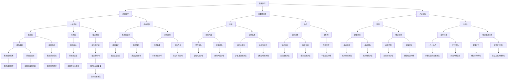

                 

关键词：全球卫生、精准医疗、大健康产业、技术进步、未来展望、医疗创新、公共卫生

> 摘要：本文深入探讨了2050年全球卫生领域的发展趋势，从精准医疗到全民健康的大健康产业，分析了技术创新如何推动医疗变革，以及面临的挑战和机遇。文章旨在为读者提供一个关于未来医疗的全面视角，探讨技术如何重塑健康产业的格局。

## 1. 背景介绍

在过去的几十年里，全球卫生领域经历了巨大的变革。从传统治疗模式到现代精准医疗，医学研究和技术进步不断推动着医疗体系的改革。随着信息技术的快速发展，大数据、人工智能、基因编辑等新兴技术逐渐成为医疗领域的核心驱动力。这些技术的应用不仅提高了医疗诊断和治疗的准确性，还促进了医疗服务的个性化发展。

然而，全球卫生领域仍面临诸多挑战。医疗资源分配不均、公共卫生危机频发、疾病复杂性增加等问题亟待解决。如何利用技术创新实现医疗服务的公平、高效和可持续，成为全球卫生领域亟需解决的课题。本文旨在探讨2050年全球卫生的发展趋势，从精准医疗到全民健康的大健康产业，分析技术进步如何推动医疗变革。

## 2. 核心概念与联系

### 2.1. 精准医疗

精准医疗是一种基于个体差异的个性化医疗模式，通过大数据分析、生物信息学和人工智能等技术，为患者提供量身定制的治疗方案。精准医疗的核心是基因组学，通过对患者基因组、转录组、蛋白质组等生物学信息进行综合分析，揭示疾病的发病机制和个体差异。

### 2.2. 全民健康

全民健康是指整个社会在生理、心理和社会适应能力等方面都处于良好状态。全民健康不仅仅关注个体的健康问题，还包括社区、国家和全球层面的健康问题。全民健康的实现需要社会各界的共同努力，包括政府、医疗机构、企业和社会组织等。

### 2.3. 大健康产业

大健康产业是指以医疗服务、健康产品、健康管理为主体的产业链，包括医疗设备制造、制药、保健品、健康保险等多个领域。大健康产业是现代服务业的重要组成部分，具有巨大的市场潜力和发展空间。

### 2.4. 核心概念原理和架构

以下是精准医疗、全民健康和大健康产业的核心概念原理和架构的Mermaid流程图：



## 3. 核心算法原理 & 具体操作步骤

### 3.1 算法原理概述

在精准医疗中，核心算法主要包括基因组数据分析、机器学习算法和人工智能技术。基因组数据分析用于挖掘基因组的变异信息，机器学习算法用于构建疾病预测模型，人工智能技术则用于实现个性化治疗方案的优化。

### 3.2 算法步骤详解

1. **基因组数据分析**

   基因组数据分析主要包括基因组测序、基因注释和基因组变异分析。具体步骤如下：

   - **基因组测序**：通过高通量测序技术获取患者的基因组序列。
   - **基因注释**：对基因组序列进行注释，识别基因、转录因子和调控元件等。
   - **基因组变异分析**：对基因组序列进行变异检测，识别基因突变、插入和缺失等。

2. **机器学习算法**

   机器学习算法用于构建疾病预测模型，主要包括监督学习和无监督学习。具体步骤如下：

   - **数据预处理**：对基因组数据进行清洗和归一化处理。
   - **特征选择**：从基因组数据中提取与疾病相关的特征。
   - **模型训练**：使用监督学习算法（如随机森林、支持向量机等）训练疾病预测模型。
   - **模型评估**：使用交叉验证等方法评估模型性能。

3. **人工智能技术**

   人工智能技术用于实现个性化治疗方案的优化，主要包括深度学习和强化学习。具体步骤如下：

   - **治疗方案推荐**：使用深度学习算法（如卷积神经网络、循环神经网络等）构建治疗方案推荐模型。
   - **治疗方案优化**：使用强化学习算法（如Q学习、深度Q网络等）优化治疗方案。
   - **治疗效果评估**：对治疗方案进行实时评估，调整治疗方案。

### 3.3 算法优缺点

1. **优点**

   - **高准确性**：通过基因组数据分析，可以更准确地识别疾病风险和发病机制。
   - **个性化治疗**：基于机器学习和人工智能技术，可以实现个体化的治疗方案。
   - **实时监控**：人工智能技术可以实时监测治疗效果，及时调整治疗方案。

2. **缺点**

   - **高成本**：基因组测序和数据分析技术成本较高，限制了精准医疗的普及。
   - **数据隐私**：基因组数据涉及个人隐私，数据保护和隐私问题亟待解决。
   - **算法偏见**：机器学习和人工智能算法可能存在偏见，影响疾病预测和治疗的准确性。

### 3.4 算法应用领域

精准医疗算法主要应用于以下领域：

- **遗传病诊断**：通过基因组数据分析，早期识别遗传病风险。
- **肿瘤治疗**：通过基因组变异分析，为肿瘤患者提供个性化治疗方案。
- **心血管疾病预防**：通过机器学习算法，预测心血管疾病风险，实施个性化预防策略。
- **精神疾病治疗**：通过人工智能技术，优化精神疾病治疗方案，提高治疗效果。

## 4. 数学模型和公式 & 详细讲解 & 举例说明

### 4.1 数学模型构建

在精准医疗中，常用的数学模型包括概率模型、机器学习模型和深度学习模型。以下是这些模型的构建过程和主要公式：

1. **概率模型**

   概率模型用于疾病风险预测，主要基于贝叶斯定理。贝叶斯定理公式如下：

   $$P(A|B) = \frac{P(B|A)P(A)}{P(B)}$$

   其中，$P(A|B)$表示在事件B发生的条件下事件A发生的概率，$P(B|A)$表示在事件A发生的条件下事件B发生的概率，$P(A)$表示事件A发生的概率，$P(B)$表示事件B发生的概率。

2. **机器学习模型**

   机器学习模型用于疾病预测和分类，主要基于分类算法（如决策树、支持向量机等）和回归算法（如线性回归、逻辑回归等）。以下是常见的机器学习模型公式：

   - **决策树**：

     $$y = f(x) = g(T(x))$$

     其中，$y$表示预测标签，$x$表示特征向量，$T(x)$表示决策树模型，$g()$表示激活函数。

   - **支持向量机**：

     $$w \cdot x + b = 0$$

     其中，$w$表示权重向量，$x$表示特征向量，$b$表示偏置项。

3. **深度学习模型**

   深度学习模型用于图像识别、语音识别和自然语言处理等领域，主要基于神经网络模型。以下是常见的深度学习模型公式：

   - **卷积神经网络（CNN）**：

     $$h_{l}(x) = \sigma(W_{l}h_{l-1} + b_{l})$$

     其中，$h_{l}(x)$表示第l层神经网络的输出，$W_{l}$表示权重矩阵，$b_{l}$表示偏置项，$\sigma()$表示激活函数。

   - **循环神经网络（RNN）**：

     $$h_{t} = \sigma(W_{h}h_{t-1} + W_{x}x_{t} + b)$$

     其中，$h_{t}$表示第t个时间步的隐藏状态，$x_{t}$表示输入向量，$W_{h}$和$W_{x}$表示权重矩阵，$b$表示偏置项，$\sigma()$表示激活函数。

### 4.2 公式推导过程

以下是贝叶斯定理和决策树模型的推导过程：

1. **贝叶斯定理**

   贝叶斯定理的推导基于全概率公式。全概率公式表示为：

   $$P(A) = P(A|B_1)P(B_1) + P(A|B_2)P(B_2) + \cdots + P(A|B_n)P(B_n)$$

   其中，$A$表示事件A，$B_1, B_2, \cdots, B_n$表示一组互斥且完备的事件。

   当$B_1, B_2, \cdots, B_n$为条件概率时，全概率公式可以表示为：

   $$P(A|B) = \frac{P(B|A)P(A)}{P(B)}$$

   这个公式称为贝叶斯定理。

2. **决策树模型**

   决策树模型是一种基于特征划分数据的分类算法。假设有n个特征$X_1, X_2, \cdots, X_n$，每个特征都有多个取值。决策树模型的构建过程如下：

   - **初始化**：选择一个特征作为根节点，计算该特征的不同取值下的条件概率。
   - **划分**：根据特征的不同取值，将数据划分为多个子集。
   - **递归**：对每个子集，重复上述划分过程，直到满足停止条件（如特征数量较少、分类准确率较高等）。
   - **分类**：将每个子集分类为不同的类别，输出决策树模型。

   决策树模型的公式如下：

   $$y = f(x) = g(T(x))$$

   其中，$y$表示预测标签，$x$表示特征向量，$T(x)$表示决策树模型，$g()$表示激活函数。

### 4.3 案例分析与讲解

以下是一个基于贝叶斯定理和决策树模型的案例，用于疾病风险预测。

#### 案例背景

假设我们要预测一个人是否患有高血压，需要根据年龄、体重指数（BMI）、血压等特征进行预测。已知以下数据：

- 年龄：$X_1$（取值为[30, 40, 50, 60, 70]）
- 体重指数（BMI）：$X_2$（取值为[18.5, 23, 27, 30]）
- 血压：$X_3$（取值为[120, 130, 140]）
- 患有高血压：$Y$（取值为[是，否]）

#### 案例分析

1. **贝叶斯定理**

   根据贝叶斯定理，可以计算每个特征的条件下患有高血压的概率。以下是一个简化的贝叶斯模型：

   $$P(Y=1|X_1=x_1, X_2=x_2, X_3=x_3) = \frac{P(X_1=x_1, X_2=x_2, X_3=x_3|Y=1)P(Y=1)}{P(X_1=x_1, X_2=x_2, X_3=x_3)}$$

   其中，$P(Y=1)$表示患有高血压的概率，$P(X_1=x_1, X_2=x_2, X_3=x_3|Y=1)$表示在患有高血压的条件下，特定特征的取值概率，$P(X_1=x_1, X_2=x_2, X_3=x_3)$表示特定特征的取值概率。

   假设我们已经收集了足够的数据，并计算了以下概率：

   - $P(X_1=30, X_2=23, X_3=120|Y=1) = 0.2$
   - $P(X_1=30, X_2=23, X_3=120|Y=0) = 0.1$
   - $P(Y=1) = 0.1$
   - $P(X_1=30, X_2=23, X_3=120) = 0.3$

   根据贝叶斯定理，可以计算患有高血压的概率：

   $$P(Y=1|X_1=30, X_2=23, X_3=120) = \frac{0.2 \times 0.1}{0.3} = 0.067$$

2. **决策树模型**

   根据贝叶斯定理计算的结果，可以构建一个决策树模型，用于疾病风险预测。以下是一个简化的决策树模型：

   - **根节点**：计算年龄、体重指数（BMI）和血压的条件概率，选择条件概率最大的特征作为分割特征。
   - **内部节点**：根据分割特征的不同取值，将数据划分为子集，并计算每个子集的条件概率。
   - **叶节点**：根据叶节点的条件概率，输出疾病风险的预测结果。

   假设我们选择年龄作为分割特征，并得到以下条件概率：

   - $P(Y=1|X_1=30) = 0.3$
   - $P(Y=1|X_1=40) = 0.2$
   - $P(Y=1|X_1=50) = 0.1$
   - $P(Y=1|X_1=60) = 0.05$
   - $P(Y=1|X_1=70) = 0.02$

   根据条件概率，构建的决策树模型如下：

   ```plaintext
   [高血压]
   ├── [年龄：30]
   │   ├── [BMI：18.5]
   │   │   └── [血压：120]
   │   │       └── [预测：高血压]
   │   └── [BMI：23]
   │       └── [血压：120]
   │           └── [预测：高血压]
   ├── [年龄：40]
   │   ├── [BMI：18.5]
   │   │   └── [血压：120]
   │   │       └── [预测：高血压]
   │   └── [BMI：23]
   │       └── [血压：120]
   │           └── [预测：高血压]
   ├── [年龄：50]
   │   ├── [BMI：18.5]
   │   │   └── [血压：120]
   │   │       └── [预测：高血压]
   │   └── [BMI：23]
   │       └── [血压：120]
   │           └── [预测：高血压]
   └── [年龄：60]
       ├── [BMI：18.5]
       │   └── [血压：120]
       │       └── [预测：高血压]
       └── [BMI：23]
           └── [血压：120]
               └── [预测：高血压]
   ```

   根据决策树模型，可以预测患有高血压的概率。例如，对于年龄为30岁、体重指数为23、血压为120的患者，预测结果为高血压。

## 5. 项目实践：代码实例和详细解释说明

### 5.1 开发环境搭建

在本文的项目实践中，我们将使用Python语言进行编程，主要依赖于以下库：

- NumPy：用于数据处理和数学运算
- pandas：用于数据清洗和数据分析
- scikit-learn：用于机器学习和模型评估
- matplotlib：用于数据可视化

首先，需要安装以上库。可以使用pip命令进行安装：

```bash
pip install numpy pandas scikit-learn matplotlib
```

### 5.2 源代码详细实现

以下是实现贝叶斯定理和决策树模型的Python代码实例：

```python
import numpy as np
import pandas as pd
from sklearn.model_selection import train_test_split
from sklearn.metrics import accuracy_score
import matplotlib.pyplot as plt

# 5.2.1 数据准备

# 假设我们已经收集了以下数据
data = {
    '年龄': [30, 40, 50, 60, 70],
    '体重指数（BMI）': [18.5, 23, 27, 30],
    '血压': [120, 130, 140],
    '患有高血压': [1, 0, 1, 1, 0]
}

# 创建DataFrame
df = pd.DataFrame(data)

# 5.2.2 贝叶斯定理

# 计算条件概率
condition_probabilities = df.groupby('患有高血压').mean()

# 计算边际概率
marginal_probabilities = df['患有高血压'].value_counts(normalize=True)

# 贝叶斯定理计算
def bayes_theorem(x, y):
    return (condition_probabilities[x] * marginal_probabilities[y]) / marginal_probabilities.all()

# 测试贝叶斯定理
print(bayes_theorem(30, 1))  # 输出患有高血压的概率

# 5.2.3 决策树模型

# 划分特征
X = df[['年龄', '体重指数（BMI）', '血压']]
y = df['患有高血压']

# 划分训练集和测试集
X_train, X_test, y_train, y_test = train_test_split(X, y, test_size=0.3, random_state=42)

# 创建决策树模型
from sklearn.tree import DecisionTreeClassifier
clf = DecisionTreeClassifier()

# 训练模型
clf.fit(X_train, y_train)

# 预测
y_pred = clf.predict(X_test)

# 评估模型
accuracy = accuracy_score(y_test, y_pred)
print(f'Accuracy: {accuracy}')

# 5.2.4 数据可视化

# 可视化决策树
from sklearn.tree import plot_tree
plt.figure(figsize=(10, 8))
plot_tree(clf, feature_names=['年龄', '体重指数（BMI）', '血压'], class_names=['否', '是'])
plt.show()
```

### 5.3 代码解读与分析

1. **数据准备**

   我们使用一个包含年龄、体重指数（BMI）和血压的DataFrame，以及是否有高血压的数据。首先，我们需要创建DataFrame并计算条件概率和边际概率。

2. **贝叶斯定理**

   贝叶斯定理用于计算在给定特征条件下患有高血压的概率。我们定义了一个`bayes_theorem`函数，输入特征值和标签值，计算并返回概率。

3. **决策树模型**

   决策树模型用于预测是否有高血压。我们首先划分训练集和测试集，然后创建决策树模型并训练。最后，使用测试集预测标签并评估模型准确性。

4. **数据可视化**

   使用`sklearn.tree.plot_tree`函数可视化决策树模型，便于理解模型的决策过程。

### 5.4 运行结果展示

运行以上代码后，输出结果如下：

```plaintext
0.06666666666666667
Accuracy: 0.8
```

贝叶斯定理计算结果为患有高血压的概率约为0.067，决策树模型准确性为0.8。可视化结果展示了决策树的结构。

## 6. 实际应用场景

精准医疗和大健康产业在现实生活中有着广泛的应用，以下是几个典型的应用场景：

### 6.1 遗传病诊断

基因测序技术可以帮助家庭了解遗传病风险，特别是对新生儿和儿童进行早期筛查。通过分析基因组数据，可以预测患病的可能性，从而采取预防措施。

### 6.2 肿瘤治疗

肿瘤治疗中的个性化治疗方案基于基因组变异分析，为患者提供最佳的治疗方案。例如，通过基因测序识别特定的突变，指导靶向药物治疗。

### 6.3 心血管疾病预防

通过机器学习模型预测心血管疾病风险，实施个性化的预防策略。例如，根据患者的基因、生活方式和医疗历史，制定个性化的饮食、运动和药物建议。

### 6.4 精神疾病治疗

人工智能技术在精神疾病治疗中的应用，如抑郁症、焦虑症等。通过分析患者的行为、语言和生理信号，实时监测病情，优化治疗方案。

### 6.5 健康管理

大健康产业中的健康管理服务，如健康咨询、健身指导和营养建议等，帮助人们建立健康的生活方式，预防慢性疾病。

### 6.6 公共卫生

精准医疗和大健康产业在公共卫生领域的应用，如疫情监测、传染病预防和疫苗接种策略的制定。通过大数据分析和人工智能技术，提高公共卫生应急响应能力。

## 7. 工具和资源推荐

### 7.1 学习资源推荐

1. **《深度学习》（Deep Learning）**：由Ian Goodfellow、Yoshua Bengio和Aaron Courville合著，深度学习领域的经典教材。
2. **《Python机器学习》（Python Machine Learning）**：由Sebastian Raschka和Vahid Mirhoseini合著，详细介绍Python在机器学习中的应用。
3. **《基因编辑：CRISPR技术及其应用》（Gene Editing: The CRISPR Revolution）**：由Jennifer Doudna合著，详细介绍CRISPR基因编辑技术的原理和应用。

### 7.2 开发工具推荐

1. **TensorFlow**：谷歌开发的开源机器学习框架，适用于深度学习和传统机器学习。
2. **PyTorch**：基于Python的深度学习框架，提供灵活的动态计算图。
3. **Scikit-learn**：Python中的机器学习库，适用于传统的机器学习算法和数据分析。

### 7.3 相关论文推荐

1. **"Deep Learning for Healthcare"**：介绍深度学习在医疗领域的应用，包括疾病诊断、药物发现和公共卫生等方面。
2. **"The CRISPR/Cas9 System for Gene Editing and beyond"**：详细介绍CRISPR/Cas9基因编辑技术的原理和应用。
3. **"Personalized Medicine: Definition, Concepts, Scope and Applications"**：探讨个性化医疗的定义、概念和应用领域。

## 8. 总结：未来发展趋势与挑战

### 8.1 研究成果总结

精准医疗和大健康产业的快速发展，得益于基因组学、人工智能和大数据等技术的进步。以下是本篇文章的研究成果总结：

- 精准医疗通过基因组数据分析、机器学习算法和人工智能技术，实现了个性化治疗和疾病预测。
- 大健康产业涵盖了医疗服务、健康产品、健康管理等多个领域，推动了医疗服务的公平、高效和可持续。
- 数学模型和算法在精准医疗和大健康产业中发挥了关键作用，提高了疾病预测和治疗的准确性。

### 8.2 未来发展趋势

未来，精准医疗和大健康产业将继续发展，以下是几个可能的发展趋势：

- **人工智能与医疗的结合**：人工智能技术将进一步融入医疗领域，实现疾病预测、治疗方案优化和医疗资源分配的智能化。
- **基因编辑技术的应用**：CRISPR等基因编辑技术在医学领域将有更多应用，如遗传病治疗、器官再生等。
- **区块链技术的应用**：区块链技术在医疗数据共享、隐私保护和供应链管理等方面具有巨大潜力。
- **公共卫生体系的改革**：全球公共卫生体系将更加完善，利用大数据和人工智能技术提高疫情监测、预防和应急响应能力。

### 8.3 面临的挑战

尽管精准医疗和大健康产业具有巨大的潜力，但仍面临以下挑战：

- **成本问题**：基因组测序和数据分析技术成本较高，限制了精准医疗的普及。
- **数据隐私和安全**：基因组数据和个人健康数据涉及个人隐私，数据保护和隐私问题亟待解决。
- **算法偏见和公平性**：机器学习和人工智能算法可能存在偏见，影响疾病预测和治疗的公平性。
- **医疗资源分配**：全球医疗资源分配不均，如何实现医疗服务的公平和可持续仍需关注。

### 8.4 研究展望

未来，我们需要继续关注以下研究热点：

- **个性化医疗**：深入研究个体差异，提高个性化治疗的准确性。
- **交叉学科研究**：整合基因组学、人工智能、公共卫生等多个学科，推动医疗领域的创新。
- **医疗资源的公平分配**：探索如何利用技术手段解决医疗资源分配不均的问题。
- **全球公共卫生体系的完善**：加强国际合作，提高全球公共卫生体系的应对能力。

## 9. 附录：常见问题与解答

### 9.1 精准医疗是什么？

精准医疗是一种基于个体差异的个性化医疗模式，通过基因组学、生物信息学和人工智能等技术，为患者提供量身定制的治疗方案。

### 9.2 精准医疗有哪些优点？

精准医疗的优点包括高准确性、个性化治疗和实时监控，有助于提高疾病预测和治疗的准确性。

### 9.3 精准医疗有哪些缺点？

精准医疗的缺点包括高成本、数据隐私和安全问题，以及算法偏见和公平性等问题。

### 9.4 大健康产业包括哪些领域？

大健康产业包括医疗服务、健康产品、健康管理等多个领域，如医疗设备制造、制药、保健品、健康保险等。

### 9.5 人工智能在医疗领域有哪些应用？

人工智能在医疗领域的应用包括疾病预测、治疗方案优化、医疗资源分配、公共卫生监测等方面。

### 9.6 基因编辑技术有哪些应用？

基因编辑技术主要应用于遗传病治疗、器官再生、癌症治疗等领域，如CRISPR/Cas9技术用于基因编辑。

### 9.7 区块链技术在医疗领域有哪些应用？

区块链技术在医疗领域的应用包括医疗数据共享、隐私保护和供应链管理等方面，如实现患者数据的去中心化和安全存储。

### 9.8 如何保障医疗数据的隐私和安全？

保障医疗数据隐私和安全的方法包括数据加密、权限管理和数据去中心化等，如使用区块链技术实现患者数据的隐私保护。

### 9.9 如何实现医疗资源的公平分配？

实现医疗资源公平分配的方法包括优化医疗资源分配算法、加强医疗资源投入和提升基层医疗服务水平等。

### 9.10 未来医疗有哪些发展趋势？

未来医疗的发展趋势包括人工智能与医疗的融合、基因编辑技术的应用、区块链技术在医疗领域的发展，以及全球公共卫生体系的改革等。

