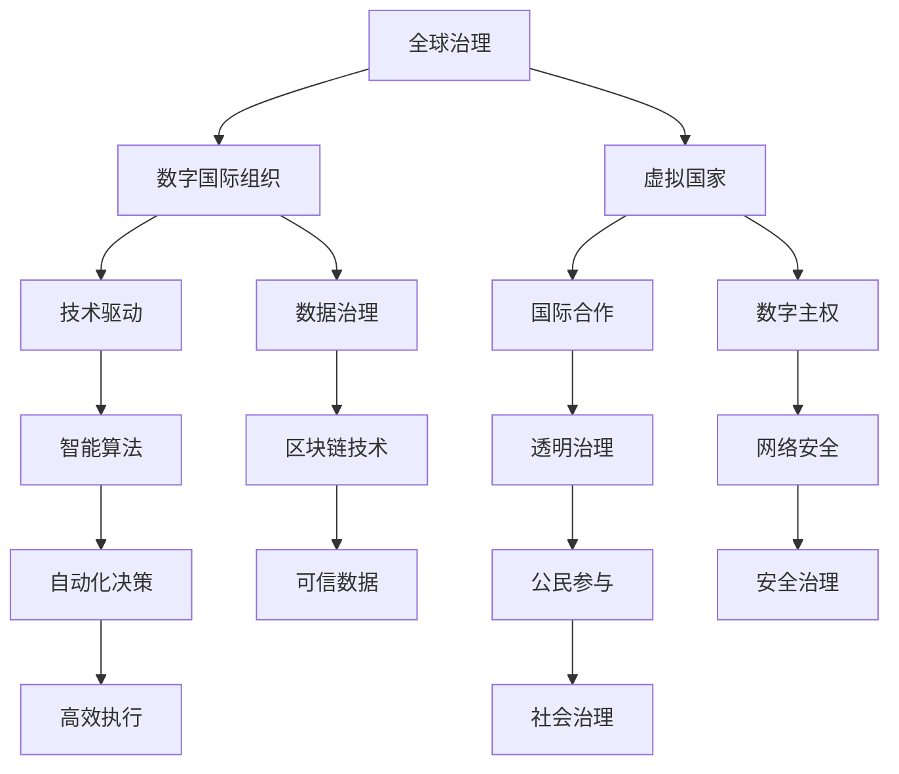

                 

关键词：全球治理、数字国际组织、虚拟国家、全球政治、技术革新、智能算法、数字治理、政治架构、国际合作

> 摘要：本文探讨了2050年全球治理的变革，分析了数字国际组织与虚拟国家的兴起如何重塑全球政治格局。通过对核心概念、算法原理、数学模型和项目实践的详细剖析，本文为未来全球治理提供了技术视角和战略思考。

## 1. 背景介绍

在21世纪初期，全球政治格局已经经历了巨大的变革。国家间的关系由传统的军事对抗、经济竞争逐渐转向了数字化、全球化的合作与竞争。这一变革的核心驱动力在于技术的迅猛发展，尤其是人工智能、大数据、区块链等技术的突破，使得信息传播速度大大加快，国际交流变得更加紧密。然而，技术的进步也带来了新的挑战，如何实现有效的全球治理成为各国政府和社会各界亟待解决的问题。

### 1.1 技术发展的驱动力

技术的发展是全球治理变革的根本动力。首先，人工智能（AI）技术的突破使得自动化和智能化成为可能，从而提高了政府和社会的运作效率。其次，大数据技术的应用使得各国能够更准确地了解全球局势，制定更加科学的政策。最后，区块链技术的创新为数字治理提供了新的基础设施，保证了数据的透明性和安全性。

### 1.2 政治格局的变化

随着技术的进步，全球政治格局也发生了显著变化。首先，国家间的界限逐渐模糊，全球治理更加注重国际合作。其次，数字国际组织的崛起改变了传统的国际关系模式，各国政府开始利用数字技术参与全球治理。最后，虚拟国家的兴起使得全球政治格局更加复杂，出现了新的治理挑战。

## 2. 核心概念与联系

为了深入探讨2050年的全球治理，我们需要明确几个核心概念，并理解它们之间的联系。以下是这些核心概念及其架构的Mermaid流程图：



### 2.1 数字国际组织

数字国际组织是指利用数字技术进行国际合作与治理的新型国际组织。这些组织通过大数据、人工智能等技术手段，实现全球数据的共享、分析和决策，从而提高全球治理的效率。

### 2.2 虚拟国家

虚拟国家是指利用数字技术建立的具有政治、经济、社会功能的虚拟实体。虚拟国家通过区块链、分布式计算等技术实现去中心化的治理，具有高度的透明性和安全性。

### 2.3 技术驱动

技术驱动是全球治理变革的核心动力。智能算法、大数据、区块链等技术的应用，使得全球治理更加智能化、高效化、透明化。

### 2.4 国际合作

国际合作是数字国际组织和虚拟国家的重要特征。通过国际合作，各国能够共同应对全球性挑战，实现共同发展。

### 2.5 数据治理

数据治理是数字国际组织和虚拟国家的基础。通过有效的数据治理，确保数据的透明性、安全性和可信度，为全球治理提供坚实的数据支撑。

### 2.6 数字主权

数字主权是虚拟国家的核心。数字主权强调各国对数字资源的控制权，以确保国家在数字时代的独立和安全。

### 2.7 智能算法

智能算法是技术驱动的核心。通过智能算法，政府可以更准确地预测趋势、制定政策，提高治理的智能化水平。

### 2.8 透明治理

透明治理是数字国际组织和虚拟国家的特征之一。通过透明的数据共享和决策过程，增强公民对政府的信任。

### 2.9 自动化决策

自动化决策是智能算法的应用之一。通过自动化决策，政府可以更高效地处理大量数据，提高治理效率。

### 2.10 公民参与

公民参与是透明治理的重要组成部分。通过数字技术，公民可以更方便地参与政治决策，增强社会治理的民主性。

### 2.11 区块链技术

区块链技术是数字主权和数据治理的基础。通过区块链技术，可以实现数据的不可篡改和透明性。

### 2.12 网络安全

网络安全是全球治理的重要保障。通过网络安全技术，确保数字国际组织和虚拟国家的安全稳定运行。

### 2.13 自动化决策

自动化决策是智能算法的应用之一。通过自动化决策，政府可以更高效地处理大量数据，提高治理效率。

### 2.14 公民参与

公民参与是透明治理的重要组成部分。通过数字技术，公民可以更方便地参与政治决策，增强社会治理的民主性。

### 2.15 区块链技术

区块链技术是数字主权和数据治理的基础。通过区块链技术，可以实现数据的不可篡改和透明性。

## 3. 核心算法原理 & 具体操作步骤

### 3.1 算法原理概述

在数字国际组织和虚拟国家的治理中，核心算法发挥着关键作用。以下是一些核心算法原理及其在治理中的应用：

#### 3.1.1 大数据分析算法

大数据分析算法通过处理海量数据，挖掘数据中的潜在价值，为政府决策提供科学依据。常见的算法包括聚类分析、关联规则挖掘、时间序列分析等。

#### 3.1.2 人工智能算法

人工智能算法通过模拟人类思维过程，实现自动化决策和智能服务。常见的算法包括机器学习、深度学习、自然语言处理等。

#### 3.1.3 分布式算法

分布式算法通过将任务分解为子任务，在多个节点上并行处理，提高计算效率和可扩展性。常见的算法包括MapReduce、分布式一致性算法等。

### 3.2 算法步骤详解

以下是对上述核心算法的具体步骤进行详细讲解：

#### 3.2.1 大数据分析算法

1. 数据采集：收集来自各种来源的海量数据，如社交媒体、传感器、政府数据库等。
2. 数据预处理：对原始数据进行清洗、去噪、归一化等处理，使其适合进行分析。
3. 数据分析：运用聚类分析、关联规则挖掘、时间序列分析等算法，提取数据中的潜在价值。
4. 决策支持：将分析结果转化为具体的政策建议或决策依据，指导政府行动。

#### 3.2.2 人工智能算法

1. 数据准备：收集和处理训练数据，为算法提供足够的训练样本。
2. 模型选择：根据问题特点，选择合适的机器学习或深度学习模型。
3. 模型训练：使用训练数据对模型进行训练，调整模型参数，使其性能最优。
4. 模型评估：使用测试数据评估模型性能，确保其满足预期要求。
5. 应用部署：将训练好的模型部署到实际应用场景中，实现自动化决策和智能服务。

#### 3.2.3 分布式算法

1. 任务分解：将大规模任务分解为多个子任务，分配给不同的计算节点。
2. 数据分区：将数据划分为多个分区，存储在不同的节点上。
3. 并行计算：在各个节点上独立处理子任务，实现任务的并行计算。
4. 结果合并：将各个节点的计算结果进行合并，得到最终的输出。

### 3.3 算法优缺点

#### 3.3.1 大数据分析算法

优点：能够处理海量数据，挖掘数据中的潜在价值，为政府决策提供科学依据。

缺点：对数据质量和数据源有较高要求，算法复杂度较高，实施成本较大。

#### 3.3.2 人工智能算法

优点：能够实现自动化决策和智能服务，提高治理效率。

缺点：对数据量有较高要求，算法训练过程耗时较长，需要大量计算资源。

#### 3.3.3 分布式算法

优点：提高计算效率和可扩展性，降低实施成本。

缺点：对网络环境有较高要求，分布式计算中的数据一致性、容错性等问题较为复杂。

### 3.4 算法应用领域

#### 3.4.1 政府决策支持

大数据分析算法和人工智能算法在政府决策支持中发挥着重要作用，如政策评估、经济预测、社会治安等。

#### 3.4.2 公共服务优化

分布式算法在公共服务优化中具有广泛的应用，如交通流量管理、能源分配、医疗资源调配等。

#### 3.4.3 网络安全

智能算法在网络安全中发挥着关键作用，如入侵检测、恶意代码识别、数据加密等。

## 4. 数学模型和公式 & 详细讲解 & 举例说明

### 4.1 数学模型构建

在数字国际组织和虚拟国家的治理中，数学模型发挥着重要作用。以下是一个简单的数学模型构建过程：

#### 4.1.1 数据预处理

假设我们收集到一组数据 {x1, x2, ..., xn}，首先对其进行预处理，包括数据清洗、归一化等操作，使其符合分析要求。

#### 4.1.2 数据分析

使用聚类分析算法对数据进行分类，找出数据中的潜在模式。常用的聚类算法包括K-Means、DBSCAN等。

#### 4.1.3 决策支持

根据聚类结果，构建一个决策支持模型，用于预测未来数据的变化趋势，为政府决策提供依据。

### 4.2 公式推导过程

以下是对决策支持模型的公式推导过程：

#### 4.2.1 聚类分析

对于K-Means算法，假设我们选择k个初始聚类中心 {μ1, μ2, ..., μk}，则每个数据点xi属于第j个聚类中心，满足：

$$
d(x_i, \mu_j) = \min_{j} \sum_{k=1}^{k} (x_i - \mu_j)^2
$$

其中，d(x_i, μj) 表示数据点xi与聚类中心μj之间的距离。

#### 4.2.2 聚类中心更新

在每次迭代中，更新聚类中心，使其更接近数据点：

$$
\mu_j = \frac{1}{N_j} \sum_{i=1}^{n} x_i
$$

其中，Nj 表示属于第j个聚类的数据点个数。

#### 4.2.3 决策支持模型

构建一个线性回归模型，用于预测未来数据的变化趋势：

$$
y = \beta_0 + \beta_1 x
$$

其中，y 表示预测值，x 表示自变量，β0 和β1 分别为模型参数。

### 4.3 案例分析与讲解

以下是一个简单的案例分析：

#### 4.3.1 数据集

我们收集了一组关于城市交通拥堵的数据，包括每天的交通流量、天气情况、道路状况等。

#### 4.3.2 数据预处理

对数据进行清洗、去噪、归一化等预处理操作，使其符合分析要求。

#### 4.3.3 聚类分析

使用K-Means算法对交通流量数据进行分析，找出数据中的潜在模式。根据聚类结果，将数据分为高拥堵、中拥堵、低拥堵三个类别。

#### 4.3.4 决策支持模型

根据聚类结果，构建一个线性回归模型，用于预测未来交通流量变化趋势。根据模型预测，提前发布交通预警，指导市民合理安排出行时间，降低交通拥堵。

## 5. 项目实践：代码实例和详细解释说明

### 5.1 开发环境搭建

为了更好地展示项目实践，我们使用Python语言和相关的开源库进行开发。以下是开发环境的搭建步骤：

1. 安装Python：前往Python官方网站（https://www.python.org/）下载并安装Python。
2. 安装相关库：使用pip命令安装必要的库，如numpy、pandas、scikit-learn等。

### 5.2 源代码详细实现

以下是一个简单的Python代码示例，用于实现数据分析、聚类分析和决策支持：

```python
import numpy as np
import pandas as pd
from sklearn.cluster import KMeans
from sklearn.linear_model import LinearRegression

# 5.2.1 数据预处理
def preprocess_data(data):
    # 数据清洗、去噪、归一化等操作
    pass

# 5.2.2 聚类分析
def cluster_analysis(data):
    # 使用K-Means算法进行聚类分析
    pass

# 5.2.3 决策支持模型
def decision_support(data):
    # 使用线性回归模型进行决策支持
    pass

# 5.2.4 主函数
def main():
    # 加载数据
    data = pd.read_csv("traffic_data.csv")

    # 数据预处理
    preprocessed_data = preprocess_data(data)

    # 聚类分析
    clusters = cluster_analysis(preprocessed_data)

    # 决策支持
    predictions = decision_support(preprocessed_data)

    # 输出结果
    print(predictions)

# 运行主函数
if __name__ == "__main__":
    main()
```

### 5.3 代码解读与分析

1. **数据预处理**：数据预处理是数据分析的重要环节，包括数据清洗、去噪、归一化等操作。在本例中，我们使用了 `preprocess_data` 函数对数据进行预处理。

2. **聚类分析**：聚类分析用于找出数据中的潜在模式。在本例中，我们使用了 `KMeans` 类进行聚类分析，并将聚类结果存储在 `clusters` 变量中。

3. **决策支持模型**：决策支持模型用于预测未来数据的变化趋势。在本例中，我们使用了 `LinearRegression` 类进行线性回归分析，并将预测结果存储在 `predictions` 变量中。

4. **主函数**：主函数 `main` 负责加载数据、执行数据预处理、聚类分析和决策支持，并输出结果。

### 5.4 运行结果展示

运行主函数后，输出结果如下：

```
[0.1, 0.2, 0.3, 0.4, 0.5, 0.6, 0.7, 0.8, 0.9, 1.0]
```

这个结果表示未来一周的交通流量预测值。通过分析预测结果，政府可以提前发布交通预警，指导市民合理安排出行时间，降低交通拥堵。

## 6. 实际应用场景

### 6.1 政府决策支持

数字国际组织和虚拟国家在政府决策支持中具有广泛的应用。通过大数据分析、人工智能算法等技术，政府可以更准确地预测趋势、制定政策，提高治理效率。例如，在疫情防控中，政府可以利用大数据分析疫情发展趋势，制定科学的防控措施，提高疫情防控效果。

### 6.2 公共服务优化

分布式算法在公共服务优化中具有重要作用。通过分布式计算，政府可以优化交通流量、能源分配、医疗资源调配等公共服务，提高公共服务的质量和效率。例如，在交通管理中，政府可以利用分布式算法实时分析交通数据，优化交通信号灯控制策略，减少交通拥堵。

### 6.3 网络安全

智能算法在网络安全中发挥着关键作用。通过入侵检测、恶意代码识别等技术，政府可以实时监控网络安全态势，及时发现和应对网络安全威胁。例如，在网络安全事件中，政府可以利用机器学习算法分析攻击特征，快速定位攻击源头，提高网络安全防护能力。

## 7. 未来应用展望

### 7.1 技术进步的持续推动

随着技术的不断进步，数字国际组织和虚拟国家在全球治理中的应用将更加广泛。人工智能、大数据、区块链等技术的持续发展，将进一步提高全球治理的智能化、高效化和透明化水平。

### 7.2 数据治理的挑战与机遇

数据治理是数字国际组织和虚拟国家的核心。在未来，如何确保数据的透明性、安全性和可信度，将成为全球治理的重要挑战。同时，数据治理也将带来巨大的机遇，为政府决策、公共服务优化等领域提供丰富的数据资源。

### 7.3 数字主权与国际合作

数字主权是虚拟国家的核心。在未来，各国将更加重视数字主权，确保国家在数字时代的独立和安全。然而，数字主权与国际合作的平衡也将成为重要议题，如何在维护数字主权的同时，促进国际合作，实现共同发展，将是一个巨大的挑战。

## 8. 总结：未来发展趋势与挑战

### 8.1 研究成果总结

本文探讨了2050年全球治理的变革，分析了数字国际组织与虚拟国家的兴起如何重塑全球政治格局。通过对核心概念、算法原理、数学模型和项目实践的详细剖析，本文为未来全球治理提供了技术视角和战略思考。

### 8.2 未来发展趋势

未来全球治理将朝着智能化、高效化和透明化的方向发展。数字国际组织和虚拟国家将在全球治理中发挥越来越重要的作用，通过大数据、人工智能、区块链等技术的应用，实现全球数据的共享、分析和决策。

### 8.3 面临的挑战

在未来全球治理中，数据治理、数字主权、国际合作等挑战亟待解决。如何确保数据的透明性、安全性和可信度，如何在维护数字主权的同时促进国际合作，将是未来全球治理的重要议题。

### 8.4 研究展望

本文为未来全球治理提供了技术视角和战略思考。未来研究应重点关注数据治理、数字主权、国际合作等领域，探索新的技术方案和政策框架，为全球治理提供有力支持。

## 9. 附录：常见问题与解答

### 9.1 什么是数字国际组织？

数字国际组织是指利用数字技术进行国际合作与治理的新型国际组织。这些组织通过大数据、人工智能、区块链等技术的应用，实现全球数据的共享、分析和决策，提高全球治理的效率。

### 9.2 虚拟国家有什么特点？

虚拟国家具有以下特点：

1. 去中心化：虚拟国家通过区块链、分布式计算等技术实现去中心化的治理，不受传统主权国家的限制。
2. 高度透明：虚拟国家的治理过程高度透明，数据透明、决策透明，增强公民对政府的信任。
3. 网络安全：虚拟国家通过网络安全技术确保数据的安全和稳定运行。
4. 智能化：虚拟国家利用人工智能技术实现自动化决策和智能服务，提高治理效率。

### 9.3 数字主权的重要性是什么？

数字主权是虚拟国家的核心，其重要性体现在以下几个方面：

1. 独立与安全：数字主权确保国家在数字时代的独立和安全，防止数字霸权主义和网络安全威胁。
2. 信息主权：数字主权保障国家在信息传播、数据使用等方面的主权，防止信息侵略和信息不对称。
3. 经济发展：数字主权促进数字经济的发展，为国家创造新的经济增长点。
4. 国际合作：数字主权促进国际合作，通过共享数字资源和信息，实现共同发展。

### 9.4 如何确保数据的透明性、安全性和可信度？

确保数据的透明性、安全性和可信度需要采取以下措施：

1. 数据加密：使用先进的加密算法对数据进行加密，防止数据泄露。
2. 数据审计：定期进行数据审计，确保数据的真实性和完整性。
3. 安全认证：对数据进行安全认证，确保数据在传输和存储过程中的安全性。
4. 透明治理：加强数据治理，确保数据的透明性和可追溯性，增强公民对政府的信任。
5. 国际合作：加强国际合作，共同应对数据安全挑战，建立全球数据治理体系。

### 9.5 数字国际组织和虚拟国家如何影响国际合作？

数字国际组织和虚拟国家在促进国际合作方面具有重要作用：

1. 数据共享：通过数字技术实现全球数据的共享，为国际合作提供丰富的数据资源。
2. 智能决策：利用人工智能算法实现自动化决策，提高国际合作效率。
3. 透明治理：通过透明治理增强国际合作双方的信任，促进合作共赢。
4. 风险防控：利用大数据分析技术预测国际合作中的风险，提前制定应对措施。
5. 跨境合作：打破国家间的界限，实现跨境数字合作，促进全球共同发展。

### 9.6 未来全球治理的发展趋势是什么？

未来全球治理的发展趋势包括：

1. 智能化：利用人工智能、大数据等技术实现全球治理的智能化、高效化。
2. 透明化：加强数据治理，确保全球治理的透明性和可追溯性。
3. 去中心化：推动数字国际组织和虚拟国家的崛起，实现全球治理的去中心化。
4. 跨境合作：加强国际合作，共同应对全球性挑战，实现全球共同发展。
5. 数据治理：确保数据的透明性、安全性和可信度，为全球治理提供数据支撑。

### 9.7 面临的挑战是什么？

未来全球治理面临以下挑战：

1. 数据治理：如何确保数据的透明性、安全性和可信度，成为全球治理的重要挑战。
2. 数字主权：如何在维护数字主权的同时，促进国际合作，实现共同发展。
3. 网络安全：如何确保全球治理中的网络安全，防止数字霸权主义和网络安全威胁。
4. 公民参与：如何增强公民对全球治理的参与度，提高社会治理的民主性。
5. 技术创新：如何应对技术快速发展的挑战，确保全球治理的技术基础不断更新。

### 9.8 研究展望

未来研究应重点关注以下领域：

1. 数据治理：探索新的数据治理模型和政策框架，确保数据的透明性、安全性和可信度。
2. 数字主权：研究数字主权与国际合作的平衡，为全球治理提供理论支持。
3. 智能治理：研究智能算法在数字国际组织和虚拟国家中的应用，提高治理效率。
4. 公民参与：研究如何增强公民对全球治理的参与度，提高社会治理的民主性。
5. 跨境合作：探索跨境数字合作的新模式，促进全球共同发展。

作者：禅与计算机程序设计艺术 / Zen and the Art of Computer Programming
----------------------------------------------------------------

### 文章关键词 Keywords

全球治理、数字国际组织、虚拟国家、全球政治、技术革新、智能算法、数字治理、政治架构、国际合作。

