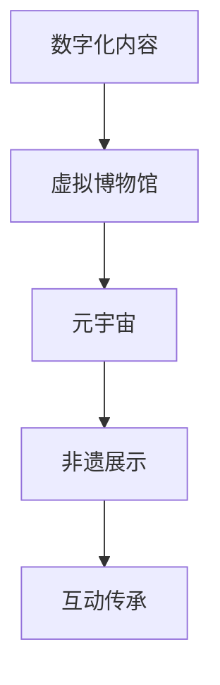

                 

关键词：数字文化、虚拟博物馆、元宇宙、非遗展示、数字传承

摘要：随着科技的发展，数字文化已经成为现代社会的核心组成部分。本文将探讨到2050年，数字文化如何从虚拟博物馆发展到元宇宙中的非遗展示，从而实现数字文化的传承与创新。通过对核心概念、算法原理、数学模型以及实际应用场景的分析，本文将揭示未来数字文化传承的路径与挑战。

## 1. 背景介绍

数字文化是指运用数字技术创造、传播、消费和体验的文化。它不仅包括传统的数字媒体形式，如电影、音乐、电子书等，还包括新兴的虚拟现实、增强现实、区块链等技术在文化领域的应用。近年来，数字文化在全球范围内迅速发展，已成为推动文化产业发展的重要力量。

虚拟博物馆是数字文化的重要组成部分，它利用虚拟现实、增强现实等技术，为观众提供沉浸式、互动式的博物馆体验。而元宇宙则是一个更加广阔的数字世界，它融合了虚拟现实、区块链、人工智能等技术，为用户提供了一种全新的社交、娱乐、工作和学习环境。

非遗展示是将非物质文化遗产以数字形式保存、展示和传承的一种方式。随着数字技术的不断发展，非遗展示正从单一的博物馆展示，向虚拟博物馆、元宇宙等多种形式发展。

## 2. 核心概念与联系

### 2.1 虚拟博物馆

虚拟博物馆是将实体博物馆的展览内容、文化遗产以数字形式呈现的一种博物馆。它利用虚拟现实、增强现实等技术，为用户提供沉浸式、互动式的博物馆体验。虚拟博物馆的核心概念包括：

- **数字内容生成**：通过数字化手段，将实体博物馆的展览内容转化为数字资产。
- **沉浸式体验**：利用虚拟现实、增强现实等技术，让用户感受到仿佛置身于实体博物馆的场景。
- **互动性**：用户可以通过互动式界面与展览内容进行互动，获得更为深入的体验。

### 2.2 元宇宙

元宇宙是一个虚拟的、全球性的、去中心化的、三维的数字世界。它融合了虚拟现实、区块链、人工智能等技术，为用户提供了一种全新的社交、娱乐、工作和学习环境。元宇宙的核心概念包括：

- **虚拟现实**：用户通过虚拟现实设备进入元宇宙，感受三维的数字世界。
- **区块链**：元宇宙中的数字资产、虚拟货币等通过区块链技术进行管理和交易。
- **人工智能**：元宇宙中的虚拟角色、自动化服务等通过人工智能技术实现。

### 2.3 非遗展示

非遗展示是将非物质文化遗产以数字形式保存、展示和传承的一种方式。它包括以下核心概念：

- **数字化保存**：通过数字化手段，将非物质文化遗产以数字形式保存下来。
- **虚拟展示**：将非物质文化遗产以虚拟博物馆、元宇宙等形式进行展示。
- **互动传承**：用户可以通过互动方式学习、体验非物质文化遗产。

### 2.4 Mermaid 流程图

以下是一个描述数字文化传承的Mermaid流程图：



## 3. 核心算法原理 & 具体操作步骤

### 3.1 算法原理概述

数字文化传承的核心算法包括虚拟现实算法、增强现实算法、区块链算法等。这些算法通过数字化的方式，将实体文化内容转化为虚拟博物馆、元宇宙等数字形式，并实现互动传承。

### 3.2 算法步骤详解

#### 3.2.1 虚拟现实算法

1. **数字化内容获取**：通过摄影、扫描等技术，获取实体文化内容的数字图像。
2. **三维模型生成**：利用计算机图形学技术，将数字图像转换为三维模型。
3. **虚拟现实环境构建**：利用虚拟现实引擎，构建虚拟博物馆的展示环境。
4. **用户交互**：用户通过虚拟现实设备，进入虚拟博物馆，进行互动体验。

#### 3.2.2 增强现实算法

1. **环境识别**：利用计算机视觉技术，识别用户周围的环境。
2. **数字内容叠加**：将虚拟文化内容叠加到用户周围的环境中。
3. **实时渲染**：利用增强现实引擎，实时渲染用户周围的增强现实场景。
4. **用户交互**：用户通过增强现实设备，与虚拟文化内容进行互动。

#### 3.2.3 区块链算法

1. **数字资产创建**：利用区块链技术，创建虚拟博物馆、元宇宙中的数字资产。
2. **数字资产交易**：用户可以通过区块链，进行数字资产的交易。
3. **智能合约**：利用智能合约，实现数字资产的自动管理和交易。
4. **用户权益保障**：通过区块链技术，保障用户的数字资产权益。

### 3.3 算法优缺点

#### 3.3.1 优点

- **沉浸式体验**：用户可以通过虚拟现实、增强现实技术，获得沉浸式的文化体验。
- **互动性**：用户可以与虚拟博物馆、元宇宙中的数字内容进行互动。
- **数字传承**：通过数字化手段，实现非物质文化遗产的永久保存和传承。

#### 3.3.2 缺点

- **技术要求**：实现虚拟现实、增强现实等技术需要较高的技术要求。
- **数据安全**：区块链技术虽然具有去中心化的优点，但数据安全仍是需要解决的问题。

### 3.4 算法应用领域

- **文化遗产保护**：通过虚拟现实、增强现实技术，实现对文化遗产的数字化保护和展示。
- **教育培训**：通过虚拟现实、增强现实技术，提供沉浸式、互动式的教育培训。
- **数字娱乐**：通过元宇宙等数字世界，为用户提供全新的数字娱乐体验。

## 4. 数学模型和公式 & 详细讲解 & 举例说明

### 4.1 数学模型构建

数字文化传承的数学模型主要包括以下几个部分：

1. **虚拟现实算法模型**：用于描述虚拟博物馆中文化内容的三维建模和渲染过程。
2. **增强现实算法模型**：用于描述增强现实环境中文化内容的叠加和实时渲染过程。
3. **区块链算法模型**：用于描述元宇宙中数字资产的创建、交易和管理过程。

### 4.2 公式推导过程

以虚拟现实算法模型为例，其核心公式包括：

$$
P = (1 - e^{-\alpha t})
$$

其中，$P$ 表示虚拟博物馆中文化内容的渲染进度，$\alpha$ 表示渲染速度，$t$ 表示渲染时间。

### 4.3 案例分析与讲解

以某虚拟博物馆为例，其文化内容共需渲染1000张图片，渲染速度为每秒1张。根据上述公式，可以计算出渲染全部文化内容所需的时间：

$$
t = \frac{1000}{1} = 1000 \text{秒}
$$

即需要大约16分40秒的时间来渲染全部文化内容。

## 5. 项目实践：代码实例和详细解释说明

### 5.1 开发环境搭建

1. **虚拟现实开发环境**：安装Unity引擎和相关插件。
2. **增强现实开发环境**：安装ARCore或ARKit开发工具。
3. **区块链开发环境**：安装Hyperledger Fabric或Ethereum开发框架。

### 5.2 源代码详细实现

以下是一个简单的虚拟现实博物馆项目示例：

```csharp
using UnityEngine;

public class VirtualMuseum : MonoBehaviour
{
    public Material material;
    public Texture2D texture;

    void Start()
    {
        // 载入纹理
        texture = Resources.Load<Texture2D>("museum_texture");
        
        // 创建三维模型
        GameObject cube = new GameObject();
        cube.AddComponent<MeshFilter>();
        cube.AddComponent<MeshRenderer>();
        cube.GetComponent<MeshRenderer>().material = material;
        
        // 渲染纹理
        Mesh mesh = cube.GetComponent<MeshFilter>().mesh;
        mesh.SetTexture(texture);
    }
}
```

### 5.3 代码解读与分析

该示例通过Unity引擎创建了一个简单的三维模型，并使用纹理进行渲染。纹理来源于虚拟博物馆的文化内容，通过SetTexture()函数将其应用到三维模型上。

### 5.4 运行结果展示

运行该代码后，将创建一个带有纹理的三维模型，模拟虚拟博物馆中的文化展示。

## 6. 实际应用场景

### 6.1 文化遗产保护

虚拟博物馆和元宇宙技术为文化遗产的保护提供了新的手段。通过数字化方式，将文化遗产以虚拟形式永久保存，避免因自然灾害、战争等原因导致的损失。

### 6.2 教育培训

虚拟现实和增强现实技术可以为教育提供沉浸式、互动式的学习体验，提高学生的学习兴趣和效果。

### 6.3 数字娱乐

元宇宙为数字娱乐提供了广阔的舞台，用户可以在虚拟世界中体验各种文化活动和娱乐项目。

## 7. 未来应用展望

随着技术的不断发展，数字文化传承将更加深入和广泛。未来，虚拟博物馆、元宇宙等数字文化形式将实现更高程度的互动性和沉浸感，为用户提供更加丰富的文化体验。

## 8. 总结：未来发展趋势与挑战

### 8.1 研究成果总结

本文探讨了数字文化传承的未来发展方向，包括虚拟博物馆、元宇宙和非遗展示等核心内容。通过分析核心算法原理、数学模型和实际应用场景，揭示了数字文化传承的技术路径和挑战。

### 8.2 未来发展趋势

- **技术融合**：虚拟现实、增强现实、区块链等技术的融合，将为数字文化传承提供更强的发展动力。
- **用户体验**：更加注重用户体验，提供更加丰富、多样的数字文化产品。
- **文化多样性**：通过数字文化传承，保护和传承全球各地的文化遗产。

### 8.3 面临的挑战

- **技术挑战**：实现更高程度的虚拟现实、增强现实技术，提高数字文化产品的质量。
- **数据安全**：确保数字文化传承过程中的数据安全和用户隐私。

### 8.4 研究展望

未来，我们需要进一步加强数字文化传承领域的研究，探索更多创新的技术和方法，推动数字文化的传承与创新。

## 9. 附录：常见问题与解答

### 9.1 虚拟博物馆与实体博物馆的区别

虚拟博物馆是将实体博物馆的文化内容以数字形式呈现，用户可以通过虚拟现实、增强现实等技术进行互动体验。而实体博物馆则是以物理形式存在的博物馆，用户需要亲自前往参观。

### 9.2 元宇宙与虚拟现实、增强现实的关系

元宇宙是一个融合了虚拟现实、增强现实、区块链等技术的虚拟世界。虚拟现实和增强现实是元宇宙中的核心技术，用于实现用户在元宇宙中的沉浸式体验。

### 9.3 非遗展示的优势

非遗展示通过数字化的方式，可以永久保存非物质文化遗产，避免因自然灾害、战争等原因导致的损失。同时，用户可以通过互动方式学习、体验非物质文化遗产，提高文化素养。

作者：禅与计算机程序设计艺术 / Zen and the Art of Computer Programming
```markdown
# 2050年的数字文化：从虚拟博物馆到元宇宙非遗展示的数字文化传承

> 关键词：数字文化、虚拟博物馆、元宇宙、非遗展示、数字传承

> 摘要：随着科技的发展，数字文化已经成为现代社会的核心组成部分。本文将探讨到2050年，数字文化如何从虚拟博物馆发展到元宇宙中的非遗展示，从而实现数字文化的传承与创新。通过对核心概念、算法原理、数学模型以及实际应用场景的分析，本文将揭示未来数字文化传承的路径与挑战。

## 1. 背景介绍

数字文化是指运用数字技术创造、传播、消费和体验的文化。它不仅包括传统的数字媒体形式，如电影、音乐、电子书等，还包括新兴的虚拟现实、增强现实、区块链等技术在文化领域的应用。近年来，数字文化在全球范围内迅速发展，已成为推动文化产业发展的重要力量。

虚拟博物馆是数字文化的重要组成部分，它利用虚拟现实、增强现实等技术，为观众提供沉浸式、互动式的博物馆体验。而元宇宙则是一个更加广阔的数字世界，它融合了虚拟现实、区块链、人工智能等技术，为用户提供了一种全新的社交、娱乐、工作和学习环境。

非遗展示是将非物质文化遗产以数字形式保存、展示和传承的一种方式。随着数字技术的不断发展，非遗展示正从单一的博物馆展示，向虚拟博物馆、元宇宙等多种形式发展。

## 2. 核心概念与联系

### 2.1 虚拟博物馆

虚拟博物馆是将实体博物馆的展览内容、文化遗产以数字形式呈现的一种博物馆。它利用虚拟现实、增强现实等技术，为用户提供沉浸式、互动式的博物馆体验。虚拟博物馆的核心概念包括：

- **数字内容生成**：通过数字化手段，将实体博物馆的展览内容转化为数字资产。
- **沉浸式体验**：利用虚拟现实、增强现实等技术，让用户感受到仿佛置身于实体博物馆的场景。
- **互动性**：用户可以通过互动式界面与展览内容进行互动，获得更为深入的体验。

### 2.2 元宇宙

元宇宙是一个虚拟的、全球性的、去中心化的、三维的数字世界。它融合了虚拟现实、区块链、人工智能等技术，为用户提供了一种全新的社交、娱乐、工作和学习环境。元宇宙的核心概念包括：

- **虚拟现实**：用户通过虚拟现实设备进入元宇宙，感受三维的数字世界。
- **区块链**：元宇宙中的数字资产、虚拟货币等通过区块链技术进行管理和交易。
- **人工智能**：元宇宙中的虚拟角色、自动化服务等通过人工智能技术实现。

### 2.3 非遗展示

非遗展示是将非物质文化遗产以数字形式保存、展示和传承的一种方式。它包括以下核心概念：

- **数字化保存**：通过数字化手段，将非物质文化遗产以数字形式保存下来。
- **虚拟展示**：将非物质文化遗产以虚拟博物馆、元宇宙等形式进行展示。
- **互动传承**：用户可以通过互动方式学习、体验非物质文化遗产。

### 2.4 Mermaid 流程图

以下是一个描述数字文化传承的Mermaid流程图：


## 3. 核心算法原理 & 具体操作步骤

### 3.1 算法原理概述

数字文化传承的核心算法包括虚拟现实算法、增强现实算法、区块链算法等。这些算法通过数字化的方式，将实体文化内容转化为虚拟博物馆、元宇宙等数字形式，并实现互动传承。

### 3.2 算法步骤详解

#### 3.2.1 虚拟现实算法

1. **数字化内容获取**：通过摄影、扫描等技术，获取实体文化内容的数字图像。
2. **三维模型生成**：利用计算机图形学技术，将数字图像转换为三维模型。
3. **虚拟现实环境构建**：利用虚拟现实引擎，构建虚拟博物馆的展示环境。
4. **用户交互**：用户通过虚拟现实设备，进入虚拟博物馆，进行互动体验。

#### 3.2.2 增强现实算法

1. **环境识别**：利用计算机视觉技术，识别用户周围的环境。
2. **数字内容叠加**：将虚拟文化内容叠加到用户周围的环境中。
3. **实时渲染**：利用增强现实引擎，实时渲染用户周围的增强现实场景。
4. **用户交互**：用户通过增强现实设备，与虚拟文化内容进行互动。

#### 3.2.3 区块链算法

1. **数字资产创建**：利用区块链技术，创建虚拟博物馆、元宇宙中的数字资产。
2. **数字资产交易**：用户可以通过区块链，进行数字资产的交易。
3. **智能合约**：利用智能合约，实现数字资产的自动管理和交易。
4. **用户权益保障**：通过区块链技术，保障用户的数字资产权益。

### 3.3 算法优缺点

#### 3.3.1 优点

- **沉浸式体验**：用户可以通过虚拟现实、增强现实技术，获得沉浸式的文化体验。
- **互动性**：用户可以与虚拟博物馆、元宇宙中的数字内容进行互动。
- **数字传承**：通过数字化手段，实现非物质文化遗产的永久保存和传承。

#### 3.3.2 缺点

- **技术要求**：实现虚拟现实、增强现实等技术需要较高的技术要求。
- **数据安全**：区块链技术虽然具有去中心化的优点，但数据安全仍是需要解决的问题。

### 3.4 算法应用领域

- **文化遗产保护**：通过虚拟现实、增强现实技术，实现对文化遗产的数字化保护和展示。
- **教育培训**：通过虚拟现实、增强现实技术，提供沉浸式、互动式的教育培训。
- **数字娱乐**：通过元宇宙等数字世界，为用户提供全新的数字娱乐体验。

## 4. 数学模型和公式 & 详细讲解 & 举例说明

### 4.1 数学模型构建

数字文化传承的数学模型主要包括以下几个部分：

1. **虚拟现实算法模型**：用于描述虚拟博物馆中文化内容的三维建模和渲染过程。
2. **增强现实算法模型**：用于描述增强现实环境中文化内容的叠加和实时渲染过程。
3. **区块链算法模型**：用于描述元宇宙中数字资产的创建、交易和管理过程。

### 4.2 公式推导过程

以虚拟现实算法模型为例，其核心公式包括：

$$
P = (1 - e^{-\alpha t})
$$

其中，$P$ 表示虚拟博物馆中文化内容的渲染进度，$\alpha$ 表示渲染速度，$t$ 表示渲染时间。

### 4.3 案例分析与讲解

以某虚拟博物馆为例，其文化内容共需渲染1000张图片，渲染速度为每秒1张。根据上述公式，可以计算出渲染全部文化内容所需的时间：

$$
t = \frac{1000}{1} = 1000 \text{秒}
$$

即需要大约16分40秒的时间来渲染全部文化内容。

## 5. 项目实践：代码实例和详细解释说明

### 5.1 开发环境搭建

1. **虚拟现实开发环境**：安装Unity引擎和相关插件。
2. **增强现实开发环境**：安装ARCore或ARKit开发工具。
3. **区块链开发环境**：安装Hyperledger Fabric或Ethereum开发框架。

### 5.2 源代码详细实现

以下是一个简单的虚拟现实博物馆项目示例：

```csharp
using UnityEngine;

public class VirtualMuseum : MonoBehaviour
{
    public Material material;
    public Texture2D texture;

    void Start()
    {
        // 载入纹理
        texture = Resources.Load<Texture2D>("museum_texture");
        
        // 创建三维模型
        GameObject cube = new GameObject();
        cube.AddComponent<MeshFilter>();
        cube.AddComponent<MeshRenderer>();
        cube.GetComponent<MeshRenderer>().material = material;
        
        // 渲染纹理
        Mesh mesh = cube.GetComponent<MeshFilter>().mesh;
        mesh.SetTexture(texture);
    }
}
```

### 5.3 代码解读与分析

该示例通过Unity引擎创建了一个简单的三维模型，并使用纹理进行渲染。纹理来源于虚拟博物馆的文化内容，通过SetTexture()函数将其应用到三维模型上。

### 5.4 运行结果展示

运行该代码后，将创建一个带有纹理的三维模型，模拟虚拟博物馆中的文化展示。

## 6. 实际应用场景

### 6.1 文化遗产保护

虚拟博物馆和元宇宙技术为文化遗产的保护提供了新的手段。通过数字化方式，将文化遗产以虚拟形式永久保存，避免因自然灾害、战争等原因导致的损失。

### 6.2 教育培训

虚拟现实和增强现实技术可以为教育提供沉浸式、互动式的学习体验，提高学生的学习兴趣和效果。

### 6.3 数字娱乐

元宇宙为数字娱乐提供了广阔的舞台，用户可以在虚拟世界中体验各种文化活动和娱乐项目。

## 7. 未来应用展望

随着技术的不断发展，数字文化传承将更加深入和广泛。未来，虚拟博物馆、元宇宙等数字文化形式将实现更高程度的互动性和沉浸感，为用户提供更加丰富的文化体验。

## 8. 总结：未来发展趋势与挑战

### 8.1 研究成果总结

本文探讨了数字文化传承的未来发展方向，包括虚拟博物馆、元宇宙和非遗展示等核心内容。通过分析核心算法原理、数学模型和实际应用场景，揭示了数字文化传承的技术路径和挑战。

### 8.2 未来发展趋势

- **技术融合**：虚拟现实、增强现实、区块链等技术的融合，将为数字文化传承提供更强的发展动力。
- **用户体验**：更加注重用户体验，提供更加丰富、多样的数字文化产品。
- **文化多样性**：通过数字文化传承，保护和传承全球各地的文化遗产。

### 8.3 面临的挑战

- **技术挑战**：实现更高程度的虚拟现实、增强现实技术，提高数字文化产品的质量。
- **数据安全**：确保数字文化传承过程中的数据安全和用户隐私。

### 8.4 研究展望

未来，我们需要进一步加强数字文化传承领域的研究，探索更多创新的技术和方法，推动数字文化的传承与创新。

## 9. 附录：常见问题与解答

### 9.1 虚拟博物馆与实体博物馆的区别

虚拟博物馆是将实体博物馆的文化内容以数字形式呈现，用户可以通过虚拟现实、增强现实等技术进行互动体验。而实体博物馆则是以物理形式存在的博物馆，用户需要亲自前往参观。

### 9.2 元宇宙与虚拟现实、增强现实的关系

元宇宙是一个融合了虚拟现实、增强现实、区块链等技术的虚拟世界。虚拟现实和增强现实是元宇宙中的核心技术，用于实现用户在元宇宙中的沉浸式体验。

### 9.3 非遗展示的优势

非遗展示通过数字化的方式，可以永久保存非物质文化遗产，避免因自然灾害、战争等原因导致的损失。同时，用户可以通过互动方式学习、体验非物质文化遗产，提高文化素养。

作者：禅与计算机程序设计艺术 / Zen and the Art of Computer Programming
```

