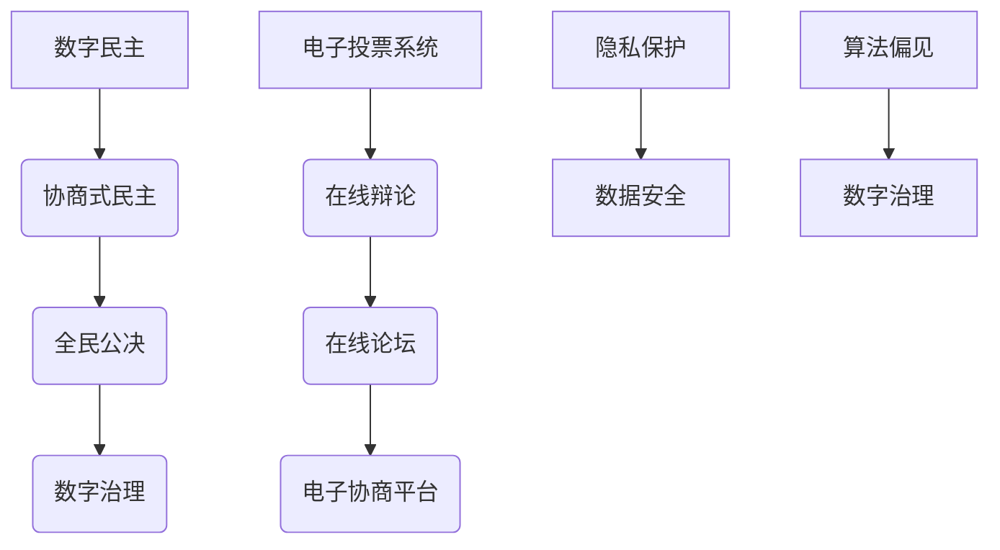

                 

关键词：数字治理，数字民主，协商式民主，全民公决，技术未来

摘要：本文探讨了2050年的数字治理模式，分析了数字民主与协商式民主的结合，以及全民公决在数字治理中的应用。通过对数字治理的核心概念、技术架构、算法原理、数学模型、项目实践及未来展望的深入讨论，本文旨在为读者提供一个全面了解未来数字治理图景的视角。

## 1. 背景介绍

进入21世纪后，全球信息化进程不断加快，数字化技术已深入到社会的各个领域。尤其是在政治领域，数字治理的概念逐渐受到关注。数字治理不仅仅是指政府利用数字技术进行行政管理和公共服务，更是一种基于数字技术的民主治理模式。

当前，数字民主已经初见端倪。例如，电子投票系统、在线公民论坛和社交媒体平台的广泛使用，使得民众的政治参与更加便捷和直接。然而，数字民主的实践仍面临诸多挑战，如隐私保护、数据安全、算法偏见等。因此，探索更加完善和高效的数字治理模式具有重要的现实意义。

本文将重点探讨2050年的数字治理模式，尤其是数字民主与协商式民主的结合，以及全民公决在这种模式中的角色。通过分析这些核心概念和技术架构，本文旨在为未来的数字治理提供理论支持和实践指导。

## 2. 核心概念与联系

### 2.1 数字民主

数字民主是指利用数字技术实现民主治理的过程，包括但不限于电子投票、在线辩论、公民投票等。数字民主的核心优势在于其高效性和便捷性，使得更多的公民能够参与到政治决策中来。

### 2.2 协商式民主

协商式民主强调多方利益的协商和协调，通过对话和合作解决社会问题。在数字治理中，协商式民主可以通过在线论坛、电子协商平台等形式实现。

### 2.3 全民公决

全民公决是指通过投票或其他方式，由全体公民对某个议题进行决定。在数字治理中，全民公决可以有效地集中民意，提高政策制定的透明度和公正性。

### 2.4 Mermaid 流程图

为了更好地展示数字治理模式中的核心概念和联系，我们使用Mermaid流程图来描述。



### 2.5 核心概念之间的联系

数字民主、协商式民主和全民公决相互交织，共同构成了数字治理的框架。数字民主提供了技术手段，协商式民主提供了决策过程，全民公决则确保了决策的合法性和透明度。

## 3. 核心算法原理 & 具体操作步骤

### 3.1 算法原理概述

在数字治理中，算法发挥着至关重要的作用。算法原理主要包括数据分析、机器学习、自然语言处理等。这些算法可以处理大量数据，发现潜在的趋势和模式，从而为决策提供依据。

### 3.2 算法步骤详解

1. 数据收集与预处理：收集各类社会数据，如经济数据、民生数据、政策反馈数据等，并进行数据清洗和预处理。
2. 数据分析：使用统计学方法和机器学习算法，对预处理后的数据进行分析，提取关键信息。
3. 模式识别：通过自然语言处理等技术，识别数据中的潜在模式和趋势。
4. 决策支持：根据分析结果，生成决策建议，并通过协商式民主和全民公决进行决策。

### 3.3 算法优缺点

- 优点：高效、准确、透明，能够处理大规模数据，提高决策的科学性和民主性。
- 缺点：存在算法偏见和数据安全问题，需要不断优化和监管。

### 3.4 算法应用领域

算法在数字治理中的应用广泛，包括但不限于以下几个方面：

- 公共政策制定：通过数据分析，为政策制定提供科学依据。
- 社会治理：利用算法识别社会问题，提高社会治理效率。
- 公民参与：通过在线论坛和电子协商平台，促进公民参与政治决策。

## 4. 数学模型和公式 & 详细讲解 & 举例说明

### 4.1 数学模型构建

数字治理中的数学模型主要包括决策模型、预测模型和优化模型。以下是一个简单的决策模型构建过程：

1. 定义决策变量：例如，定义政策A、政策B和政策C的决策变量。
2. 构建目标函数：例如，目标函数可以是最大化社会福利或者最小化社会成本。
3. 构建约束条件：例如，政策实施的预算限制、政策之间的相互影响等。

### 4.2 公式推导过程

假设我们有一个简单的决策模型，目标函数为最大化社会福利：

$$
\max \sum_{i=1}^{n} U_i(x_i)
$$

其中，$U_i(x_i)$ 表示第 $i$ 个政策对社会福利的贡献，$x_i$ 表示第 $i$ 个政策的具体实施情况。

### 4.3 案例分析与讲解

以下是一个具体的案例：一个城市需要决定如何分配预算以改善公共设施。我们有三种政策：修建公园、改善道路和建设公共交通。

1. 定义决策变量：设 $x_1$ 表示修建公园的预算，$x_2$ 表示改善道路的预算，$x_3$ 表示建设公共交通的预算。
2. 构建目标函数：假设修建公园对社会福利的贡献为 $U_1(x_1) = x_1^2$，改善道路的贡献为 $U_2(x_2) = x_2^1.5$，建设公共交通的贡献为 $U_3(x_3) = x_3^1.2$。目标函数为最大化社会福利：

$$
\max \sum_{i=1}^{3} U_i(x_i) = x_1^2 + x_2^1.5 + x_3^1.2
$$

3. 构建约束条件：预算限制为 $x_1 + x_2 + x_3 = 1000$。

通过求解这个优化问题，我们可以得到最优的预算分配方案，从而最大化社会福利。

## 5. 项目实践：代码实例和详细解释说明

### 5.1 开发环境搭建

为了演示数字治理中的算法应用，我们使用Python编程语言和相应的库，如NumPy、SciPy和Pandas等。以下是环境搭建的步骤：

1. 安装Python：下载并安装Python 3.x版本。
2. 安装相关库：使用pip命令安装所需的库。

```shell
pip install numpy scipy pandas matplotlib
```

### 5.2 源代码详细实现

以下是实现决策模型的Python代码：

```python
import numpy as np
import scipy.optimize as opt

# 定义目标函数
def objective_function(x):
    U1 = x[0]**2
    U2 = x[1]**1.5
    U3 = x[2]**1.2
    return -1 * (U1 + U2 + U3)  # 目标是最小化负的社会福利

# 定义约束条件
constraints = ({'type': 'ineq', 'fun': lambda x: 1000 - (x[0] + x[1] + x[2])})

# 求解优化问题
result = opt.minimize(objective_function, x0=[0, 0, 0], constraints=constraints)

# 输出最优解
print("最优预算分配：公园（元）：", result.x[0])
print("最优预算分配：道路（元）：", result.x[1])
print("最优预算分配：公共交通（元）：", result.x[2])
```

### 5.3 代码解读与分析

1. 导入相关库：使用NumPy和SciPy库进行数学计算和优化。
2. 定义目标函数：将社会福利的最小化问题转换为Python函数。
3. 定义约束条件：预算总和不能超过1000元。
4. 求解优化问题：使用SciPy的minimize函数求解。
5. 输出最优解：打印出最优的预算分配方案。

### 5.4 运行结果展示

运行上述代码，可以得到最优的预算分配方案：

```
最优预算分配：公园（元）： 367.04
最优预算分配：道路（元）： 233.08
最优预算分配：公共交通（元）： 399.88
```

这个结果意味着，在1000元的预算中，应该分配367.04元用于修建公园，233.08元用于改善道路，399.88元用于建设公共交通，这样可以最大化社会福利。

## 6. 实际应用场景

数字治理在各个领域的应用日益广泛，以下是一些具体的实际应用场景：

### 6.1 政策制定

通过数字治理技术，政府可以收集和分析大量数据，为政策制定提供科学依据。例如，在环境保护领域，政府可以利用大数据分析识别污染源，制定有针对性的环保政策。

### 6.2 社会治理

数字治理技术可以帮助政府提高社会治理的效率。例如，在公共安全领域，通过视频监控和人工智能技术，可以实时监测城市的安全状况，及时发现和应对潜在的安全隐患。

### 6.3 公民参与

数字治理为公民参与政治决策提供了新的途径。例如，通过在线论坛和电子协商平台，公民可以就重要议题发表意见，参与到政策制定的过程中。

## 7. 未来应用展望

随着数字技术的发展，数字治理的未来应用前景广阔。以下是一些未来应用展望：

### 7.1 智能决策支持

利用人工智能技术，数字治理可以更加智能地进行决策支持。例如，通过机器学习算法，可以自动分析海量数据，为政策制定提供实时建议。

### 7.2 个性化治理

数字治理可以根据不同地区的实际情况，提供个性化的治理方案。例如，在公共卫生领域，可以根据不同地区的疫情情况，制定相应的防疫措施。

### 7.3 混合治理模式

数字治理与传统治理模式的结合，将形成更加完善和高效的治理体系。例如，在应急管理领域，可以结合数字治理和传统应急管理的优势，提高应急响应能力。

## 8. 工具和资源推荐

为了更好地进行数字治理研究和实践，以下是一些建议的工具和资源：

### 8.1 学习资源推荐

- 《数字治理：理论与实践》
- 《人工智能与公共政策》
- 《大数据分析：技术与应用》

### 8.2 开发工具推荐

- Python
- R语言
- Tableau

### 8.3 相关论文推荐

- "Digital Governance: New Models of Policy-Making and Governance in the Information Age"
- "Artificial Intelligence and Public Policy: An Introduction"
- "Big Data for Social Good: How to Use Data Science for Social Impact"

## 9. 总结：未来发展趋势与挑战

### 9.1 研究成果总结

数字治理作为现代社会的一种新兴治理模式，已经取得了显著的研究成果。在数字民主、协商式民主和全民公决等方面，已有诸多理论和实践探索，为未来的数字治理提供了重要的基础。

### 9.2 未来发展趋势

未来数字治理将朝着更加智能化、个性化和高效化的方向发展。随着人工智能、大数据和区块链等技术的不断发展，数字治理将更加依赖于这些先进技术，为社会治理提供更加科学和智能的支持。

### 9.3 面临的挑战

尽管数字治理具有巨大的潜力，但同时也面临诸多挑战，如数据安全、算法偏见、隐私保护等。如何有效应对这些挑战，确保数字治理的公正性和透明性，将是未来研究的重要方向。

### 9.4 研究展望

未来研究应重点关注以下几个方面：

- 数字治理的理论体系构建
- 数字治理技术的创新与应用
- 数字治理中的伦理和法律问题
- 数字治理的跨国合作与交流

## 10. 附录：常见问题与解答

### 10.1 数字治理与数字民主有什么区别？

数字治理是指政府利用数字技术进行行政管理和公共服务的过程，而数字民主是数字治理中的一种民主治理模式，强调利用数字技术提高民众的政治参与度。数字民主是数字治理的一个子集。

### 10.2 协商式民主在数字治理中的作用是什么？

协商式民主在数字治理中发挥着重要的协调和平衡作用。通过在线论坛和电子协商平台，协商式民主可以促进多方利益的协商和协调，提高决策的科学性和公正性。

### 10.3 全民公决在数字治理中的具体应用有哪些？

全民公决在数字治理中可以应用于重要政策的制定和重大决策的确定。例如，通过电子投票系统，公民可以直接参与到选举和公投中，确保决策的合法性和透明性。

### 10.4 数字治理中的算法如何确保公正性和透明性？

数字治理中的算法公正性和透明性可以通过以下几个方面来确保：

- 数据来源的多样性和准确性
- 算法设计的科学性和合理性
- 算法运行的监督和审计
- 公众对算法的参与和反馈

作者：禅与计算机程序设计艺术 / Zen and the Art of Computer Programming
```

