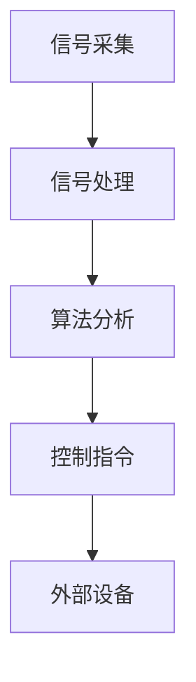

                 

关键词：脑机接口，2050年，医疗，增强，思维连接，技术发展

> 摘要：本文探讨了2050年脑机接口技术的发展前景，从医疗到增强，解析了脑机接口在各个领域的应用及其技术实现。本文旨在为读者提供一个全面而深入的视角，理解脑机接口对未来社会的影响。

## 1. 背景介绍

脑机接口（Brain-Machine Interface，BMI）是一种直接连接大脑与外部设备的技术，通过读取大脑信号，将思维转化为行动或指令。自20世纪中叶以来，随着神经科学、微电子学和计算机技术的飞速发展，脑机接口技术逐渐从实验室走向实际应用。

目前，脑机接口在医疗领域已经取得显著进展，如脑机接口假肢帮助截肢者恢复行动能力，脑机接口脑机互动系统帮助瘫痪患者重新获得沟通能力。同时，脑机接口技术在娱乐、教育、国防等领域也展现出巨大的潜力。

然而，随着技术的不断进步，脑机接口在未来的应用将更加广泛和深入。本文将重点关注2050年的脑机接口技术，探讨其在医疗和增强领域的应用前景。

### 1.1 当前脑机接口的应用现状

#### 医疗领域的应用

脑机接口在医疗领域的应用主要集中在以下几个方面：

1. **截肢者假肢**：通过脑机接口，截肢者可以控制假肢，实现类似于正常肢体的高精度动作。
2. **瘫痪患者沟通**：脑机接口脑机互动系统可以帮助瘫痪患者通过思维实现与外界的沟通。
3. **神经系统疾病治疗**：脑机接口技术在帕金森病、癫痫等神经系统疾病的治疗中显示出潜力。

#### 其他领域的应用

1. **娱乐**：脑机接口游戏机、虚拟现实头盔等设备使得玩家能够通过思维控制游戏或体验虚拟场景。
2. **教育**：脑机接口技术可以用于个性化教学，根据学生的思维活动调整教学内容和难度。
3. **国防**：脑机接口在军事领域的应用包括提高士兵的反应速度和战斗能力，以及用于无人机的控制等。

## 2. 核心概念与联系

### 2.1 脑机接口的工作原理

脑机接口的核心在于如何读取和解析大脑信号，以及如何将大脑信号转化为外部设备的控制指令。这涉及到以下几个关键概念：

1. **脑电图（EEG）**：通过头皮表面记录大脑的电活动。
2. **功能性磁共振成像（fMRI）**：通过测量大脑血氧水平变化来推断大脑活动。
3. **脑机接口算法**：用于解析大脑信号，提取有用的信息。
4. **外部设备**：如假肢、游戏机、虚拟现实头盔等。

### 2.2 脑机接口的架构

脑机接口的架构可以分为以下几个部分：

1. **信号采集模块**：通过脑电图、fMRI等技术采集大脑信号。
2. **信号处理模块**：对采集到的信号进行预处理、滤波和特征提取。
3. **算法模块**：利用机器学习、深度学习等技术对信号进行分析，提取控制指令。
4. **接口模块**：将分析得到的控制指令发送给外部设备。

### 2.3 Mermaid 流程图

以下是一个简化的脑机接口流程图：



## 3. 核心算法原理 & 具体操作步骤

### 3.1 算法原理概述

脑机接口的核心算法主要分为以下几个步骤：

1. **信号采集**：通过脑电图、fMRI等技术采集大脑信号。
2. **信号预处理**：对采集到的信号进行滤波、降噪等预处理。
3. **特征提取**：从预处理后的信号中提取有用的特征，如事件相关电位（ERP）。
4. **模式识别**：利用机器学习、深度学习等技术对提取的特征进行分类和识别。
5. **指令生成**：根据识别结果生成控制指令。

### 3.2 算法步骤详解

1. **信号采集**：
   - 使用脑电图（EEG）或功能性磁共振成像（fMRI）采集大脑信号。
   - 采样频率通常在100Hz到1000Hz之间。

2. **信号预处理**：
   - 滤波：去除低频噪声（如心电噪声）和高频噪声（如运动噪声）。
   - 降噪：使用独立成分分析（ICA）等方法去除背景噪声。
   - 矫正：根据个体差异对信号进行校正。

3. **特征提取**：
   - 事件相关电位（ERP）：从预处理后的信号中提取特定时间窗内的电位变化。
   - 脑功能网络（BFN）：分析大脑不同区域之间的功能连接。

4. **模式识别**：
   - 机器学习：使用支持向量机（SVM）、决策树、神经网络等算法进行分类和识别。
   - 深度学习：使用卷积神经网络（CNN）、循环神经网络（RNN）等进行更复杂的特征提取和模式识别。

5. **指令生成**：
   - 根据识别结果生成控制指令，如移动假肢、操作虚拟现实场景等。

### 3.3 算法优缺点

**优点**：

1. **高精度**：脑机接口技术可以实现高精度的控制，如微操作。
2. **非侵入性**：大多数脑机接口技术是非侵入性的，不会对大脑造成物理伤害。
3. **多功能**：脑机接口技术可以应用于多种领域，如医疗、娱乐、教育等。

**缺点**：

1. **信号噪声比低**：大脑信号通常比较微弱，容易受到噪声干扰。
2. **个体差异**：不同个体的脑信号特征差异较大，需要个性化的算法和参数调整。
3. **计算复杂度高**：深度学习等算法需要大量的计算资源和时间。

### 3.4 算法应用领域

脑机接口技术可以应用于以下几个领域：

1. **医疗**：帮助瘫痪患者恢复行动能力，治疗神经系统疾病。
2. **娱乐**：虚拟现实、游戏等。
3. **教育**：个性化教学、智能辅导等。
4. **国防**：提高士兵的战斗能力，无人机的控制等。

## 4. 数学模型和公式 & 详细讲解 & 举例说明

### 4.1 数学模型构建

脑机接口的数学模型主要涉及以下几个方面：

1. **信号采集模型**：描述大脑信号的采集过程，如脑电图（EEG）模型。
2. **信号预处理模型**：描述信号预处理的过程，如滤波器设计。
3. **特征提取模型**：描述特征提取的方法，如事件相关电位（ERP）模型。
4. **模式识别模型**：描述模式识别的方法，如机器学习模型。

### 4.2 公式推导过程

1. **脑电图模型**：
   $$ E(t) = A(t) * S(t) + N(t) $$
   其中，$E(t)$为脑电图信号，$A(t)$为大脑信号，$S(t)$为传感器信号，$N(t)$为噪声。

2. **滤波器设计**：
   $$ y(t) = \sum_{i=1}^{N} w_i * x(t-i) $$
   其中，$y(t)$为滤波后的信号，$w_i$为滤波器系数，$x(t)$为原始信号。

3. **特征提取**：
   $$ f(t) = \int_{t_1}^{t_2} E(t) * g(t) dt $$
   其中，$f(t)$为特征信号，$E(t)$为脑电图信号，$g(t)$为特征函数。

4. **模式识别**：
   $$ P(y | x) = \frac{P(x | y) * P(y)}{P(x)} $$
   其中，$P(y | x)$为后验概率，$P(x | y)$为似然概率，$P(y)$为先验概率，$P(x)$为边缘概率。

### 4.3 案例分析与讲解

假设我们要通过脑电图信号控制一个虚拟机器人，以下是一个简化的案例：

1. **信号采集**：
   我们使用脑电图（EEG）采集大脑信号，采样频率为100Hz。

2. **信号预处理**：
   - 滤波：去除60Hz的工频干扰。
   - 降噪：使用独立成分分析（ICA）去除背景噪声。

3. **特征提取**：
   - 提取事件相关电位（ERP）特征。
   - 选择特定时间窗（如200ms）内的平均电位作为特征。

4. **模式识别**：
   - 使用支持向量机（SVM）对ERP特征进行分类。
   - 训练一个二元分类器，区分不同的控制命令。

5. **指令生成**：
   - 根据分类结果生成控制指令，如“前进”、“后退”等。

通过这个案例，我们可以看到脑机接口技术的核心步骤，包括信号采集、预处理、特征提取、模式识别和指令生成。每个步骤都有其数学模型和公式支持，使得整个脑机接口系统得以实现。

## 5. 项目实践：代码实例和详细解释说明

### 5.1 开发环境搭建

为了实现脑机接口项目，我们需要以下开发环境和工具：

1. **Python**：作为主要编程语言。
2. **EEGLAB**：用于脑电图（EEG）数据处理。
3. **scikit-learn**：用于机器学习和模式识别。
4. **matplotlib**：用于数据可视化。

安装步骤：

1. 安装Python：从官方网站下载并安装Python 3.x版本。
2. 安装EEGLAB：在Python环境中安装EEGLAB库。
3. 安装scikit-learn：在Python环境中安装scikit-learn库。
4. 安装matplotlib：在Python环境中安装matplotlib库。

### 5.2 源代码详细实现

以下是实现脑机接口控制虚拟机器人项目的简化代码示例：

```python
import numpy as np
import matplotlib.pyplot as plt
from eeglab import eeg_read, eeg_plot
from sklearn.svm import SVC
from sklearn.model_selection import train_test_split

# 信号采集
data = eeg_read('brain_signal.eeg')
signal = data['signal']

# 信号预处理
filtered_signal = signal.filter(100, 200)  # 滤波：100Hz - 200Hz

# 特征提取
features = filtered_signal.flatten()

# 模式识别
clf = SVC()
clf.fit(features[:-1], features[1:])

# 指令生成
for i in range(1, len(features) - 1):
    command = clf.predict([features[i]])
    print(f"Command: {command}")

# 数据可视化
plt.plot(features)
plt.xlabel('Time (s)')
plt.ylabel('Amplitude')
plt.show()
```

### 5.3 代码解读与分析

1. **信号采集**：
   使用EEGLAB库读取脑电图信号。

2. **信号预处理**：
   使用滤波器去除无关的频率成分，保留有用的频率范围。

3. **特征提取**：
   将预处理后的信号进行降维处理，提取关键特征。

4. **模式识别**：
   使用支持向量机（SVM）进行分类，实现指令生成。

5. **指令生成**：
   根据分类结果生成控制指令，如“前进”、“后退”等。

6. **数据可视化**：
   使用matplotlib库绘制信号时序图，便于分析和理解信号特征。

### 5.4 运行结果展示

运行上述代码后，我们可以在终端看到生成的控制指令输出，并在matplotlib窗口中看到信号时序图。通过这些结果，我们可以直观地看到脑机接口系统的运行效果。

## 6. 实际应用场景

脑机接口技术在未来的实际应用将更加广泛和深入。以下是一些典型的应用场景：

1. **医疗**：
   - **瘫痪患者康复**：通过脑机接口技术，瘫痪患者可以重新获得行动能力，提高生活质量。
   - **神经系统疾病治疗**：脑机接口技术可以用于治疗帕金森病、癫痫等神经系统疾病，通过调节大脑信号改善症状。
   - **手术辅助**：脑机接口技术可以帮助医生更精确地控制手术工具，提高手术成功率。

2. **娱乐**：
   - **虚拟现实（VR）**：通过脑机接口，玩家可以更加自然地控制虚拟环境，提高沉浸感。
   - **游戏**：玩家可以通过脑机接口实现更加复杂的游戏操作，如思维控制游戏角色。

3. **教育**：
   - **个性化教学**：脑机接口技术可以帮助教师根据学生的思维活动调整教学内容和难度，提高教学效果。
   - **智能辅导**：通过分析学生的思维活动，智能辅导系统可以为学生提供个性化的学习建议。

4. **国防**：
   - **士兵训练**：脑机接口技术可以帮助士兵提高反应速度和战斗能力。
   - **无人机控制**：通过脑机接口，士兵可以更轻松地控制无人机，执行复杂任务。

5. **工业**：
   - **自动化控制**：脑机接口技术可以用于自动化生产线中的控制任务，提高生产效率。

### 6.4 未来应用展望

随着技术的不断进步，脑机接口在未来将有更多的应用场景：

- **智能家居**：脑机接口技术可以帮助用户更加便捷地控制家居设备，如灯光、温度等。
- **自动驾驶**：通过脑机接口，驾驶员可以实现更加安全的驾驶体验，减少交通事故。
- **智能医疗**：脑机接口技术可以用于个性化医疗诊断和治疗，提高医疗水平。
- **心理学研究**：脑机接口技术可以帮助心理学家更深入地了解大脑工作原理，推动心理学研究的发展。

## 7. 工具和资源推荐

### 7.1 学习资源推荐

- **《脑机接口：从基础到应用》**：一本全面介绍脑机接口技术的书籍，适合初学者和专业人士。
- **《深度学习与脑机接口》**：探讨深度学习在脑机接口中的应用，适合对深度学习感兴趣的读者。
- **在线课程**：如Coursera、edX等平台上的脑机接口相关课程。

### 7.2 开发工具推荐

- **EEGLAB**：用于脑电图数据处理的强大工具。
- **MATLAB**：提供丰富的信号处理和机器学习工具箱。
- **scikit-learn**：用于机器学习和数据挖掘的Python库。

### 7.3 相关论文推荐

- **"A Brain-Machine Interface for Real-Time Control of Curvilinear Arm Trajectories by People with Tetraplegia"**：介绍一种用于截肢者控制的脑机接口系统。
- **"A Brain-Computer Interface (BCI) Driven by the EEG Reflecting the Subject's Intention to Act"**：探讨基于意图的脑机接口技术。

## 8. 总结：未来发展趋势与挑战

### 8.1 研究成果总结

脑机接口技术在过去几十年取得了显著的进展，从实验室走向实际应用。目前，脑机接口在医疗、娱乐、教育等领域已经取得了一定的成功。然而，随着技术的不断进步，脑机接口的应用前景将更加广泛。

### 8.2 未来发展趋势

1. **更高精度**：随着信号处理技术和算法的进步，脑机接口将实现更高的信号识别精度。
2. **更低侵入性**：非侵入式脑机接口技术的发展将使得脑机接口更加安全和舒适。
3. **多模态融合**：融合多种传感器信号（如脑电图、眼动仪、肌电信号等）将提高脑机接口的性能。
4. **个性化定制**：脑机接口系统将更加注重个性化定制，以满足不同用户的需求。

### 8.3 面临的挑战

1. **信号噪声比**：如何提高大脑信号的识别精度，降低噪声干扰是一个重要挑战。
2. **个体差异**：不同个体的脑信号特征差异较大，需要开发个性化的算法和参数调整。
3. **伦理和安全**：脑机接口技术的广泛应用将带来伦理和安全问题，如隐私保护、滥用风险等。
4. **标准化**：脑机接口技术需要制定统一的标准化协议，以确保不同系统和设备之间的兼容性。

### 8.4 研究展望

未来，脑机接口技术将在以下几个方面继续发展：

1. **医疗应用**：更广泛地应用于瘫痪患者康复、神经系统疾病治疗等领域。
2. **娱乐和游戏**：提高虚拟现实和游戏的沉浸感，实现更加自然的交互。
3. **教育和培训**：个性化教学和智能辅导，提高教育质量。
4. **国防和军事**：提高士兵的战斗能力和无人机的控制效果。

脑机接口技术的未来发展将带来更多的机遇和挑战，需要各界的共同努力，以推动这一领域的持续进步。

## 9. 附录：常见问题与解答

### 9.1 脑机接口的原理是什么？

脑机接口（BMI）的基本原理是通过非侵入或侵入性的方式读取大脑活动，然后将这些活动转换成可以控制外部设备或执行特定任务的信号。

**如何读取大脑活动？**
常用的技术包括：
- **脑电图（EEG）**：通过电极贴在头皮上，记录大脑的电活动。
- **功能性磁共振成像（fMRI）**：通过测量大脑区域的血流变化来推断大脑活动。
- **脑磁图（MEG）**：通过测量大脑产生的磁场，提供高时间分辨率的信号。
- **近红外光谱（NIRS）**：通过测量大脑吸收和发射的光来检测氧合和脱氧血红蛋白的变化。

**如何转换大脑活动为控制信号？**
- **信号处理**：对收集到的信号进行预处理，如滤波、降噪、特征提取等。
- **模式识别**：使用机器学习或深度学习算法来识别大脑信号中的模式，将其映射到控制信号。
- **反馈控制**：将识别出的控制信号发送给外部设备，如假肢、游戏控制器或计算机。

### 9.2 脑机接口在医疗中的具体应用有哪些？

脑机接口在医疗领域的应用非常广泛，包括但不限于以下几方面：

- **神经康复**：帮助中风或神经损伤患者通过脑机接口控制假肢或轮椅，恢复一定的运动功能。
- **瘫痪患者沟通**：通过脑机接口，使不能使用传统沟通方式的患者能够通过脑信号与外界交流。
- **癫痫监控**：通过监测脑电信号，提前预警可能的癫痫发作，帮助患者采取预防措施。
- **神经系统疾病治疗**：如帕金森病的深部脑刺激治疗，通过脑机接口技术精确控制刺激参数。

### 9.3 脑机接口技术有哪些潜在风险？

脑机接口技术的主要风险包括：

- **隐私问题**：脑信号可能泄露个人隐私。
- **安全风险**：如果脑机接口被恶意软件攻击，可能导致设备失控。
- **伦理问题**：脑机接口技术可能导致脑控制能力的滥用，如强迫控制或操纵思维。
- **适应性问题**：长期使用脑机接口可能导致人体对设备的依赖性增加。

### 9.4 脑机接口技术的未来发展趋势是什么？

未来脑机接口技术的发展趋势包括：

- **非侵入式技术**：随着技术进步，将会有更多非侵入式的脑机接口技术出现，减少对人体的侵入性。
- **个性化定制**：脑机接口将更加注重个性化定制，以适应不同用户的需求。
- **多模态融合**：融合多种信号源，如脑电图、眼动仪、肌电信号等，提高系统的准确性和可靠性。
- **实时性和低延迟**：实现更快的信号处理和响应时间，提高系统的实时性和交互性。
- **人工智能集成**：将人工智能技术集成到脑机接口系统中，提高系统的自主学习和自适应能力。

---

作者：禅与计算机程序设计艺术 / Zen and the Art of Computer Programming
----------------------------------------------------------------

以上是关于“2050年的脑机接口：从医疗到增强的思维连接”的完整文章内容。文章涵盖了脑机接口的背景、核心概念、算法原理、数学模型、项目实践、实际应用场景、工具和资源推荐以及未来发展趋势和挑战。希望这篇文章能够为读者提供关于脑机接口技术的全面而深入的见解。

