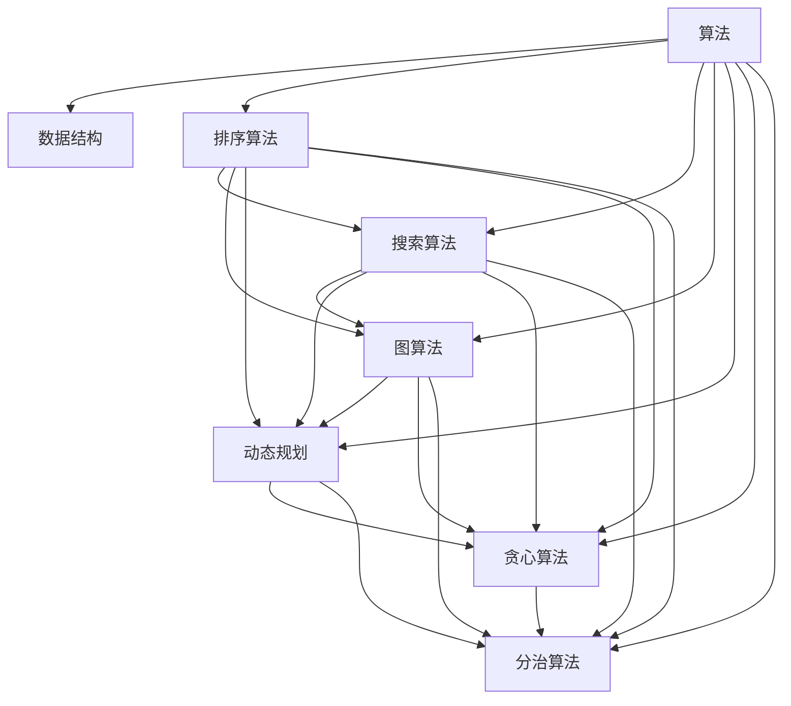

                 

关键词：2025年网易校招、技术面试题集锦、求职技巧、算法问题、编程实践

> 摘要：本文是针对2025年网易校招技术面试题的深度解析集锦，旨在为求职者提供全面的技术面试备考指南。通过对历年校招面试题的整理和解读，本文涵盖了算法、数据结构、系统设计、编程实践等多个领域，为求职者提供实战经验和策略建议。

## 1. 背景介绍

随着科技的快速发展，互联网行业对人才的需求日益增长，网易作为一家知名的互联网公司，每年都会举行大规模的校招活动。校招技术面试是求职者进入网易等大型互联网公司的重要途径。本文旨在整理和分析2025年网易校招技术面试中可能出现的问题，帮助求职者更好地准备面试。

## 2. 核心概念与联系

### 2.1 数据结构与算法

数据结构与算法是计算机科学的基础，掌握常见的算法和数据结构对于解决面试问题至关重要。下面是一个Mermaid流程图，展示了常见的数据结构和算法关系：



### 2.2 系统设计与架构

系统设计与架构是考察求职者综合能力的重要方面。了解常见的系统架构模式、数据库设计原则、缓存策略等，对于解决系统设计类面试题非常有帮助。

## 3. 核心算法原理 & 具体操作步骤

### 3.1 算法原理概述

算法的原理可以分为基础算法和高级算法。基础算法主要包括排序、查找、图论等，高级算法包括动态规划、贪心算法、分治算法等。下面是一些常见的算法原理：

- 排序算法：冒泡排序、选择排序、插入排序、快速排序、归并排序等。
- 搜索算法：深度优先搜索、广度优先搜索、A*算法等。
- 动态规划：最优子结构、状态转移方程等。
- 贪心算法：贪心选择、局部最优解等。

### 3.2 算法步骤详解

以快速排序为例，其步骤如下：

1. 选择一个基准元素。
2. 将数组分为两部分，一部分小于基准元素，另一部分大于基准元素。
3. 递归地对两部分进行快速排序。

### 3.3 算法优缺点

快速排序的优点是平均时间复杂度较低，缺点是最坏时间复杂度较高。

### 3.4 算法应用领域

快速排序广泛应用于排序和搜索问题，例如数据库索引、搜索引擎等。

## 4. 数学模型和公式 & 详细讲解 & 举例说明

### 4.1 数学模型构建

以线性规划为例，其数学模型如下：

$$
\begin{aligned}
\min_{x} & \quad c^T x \\
s.t. & \quad Ax \leq b \\
     & \quad x \geq 0
\end{aligned}
$$

### 4.2 公式推导过程

线性规划的目标函数是最小化或最大化线性函数，约束条件是线性不等式。推导过程通常使用单纯形法或内点法。

### 4.3 案例分析与讲解

假设我们有一个线性规划问题，目标是最小化成本，约束条件是资源限制。通过构建数学模型和求解方法，我们可以找到最优解。

## 5. 项目实践：代码实例和详细解释说明

### 5.1 开发环境搭建

使用Python进行开发，需要安装相关库，如Numpy、Scipy等。

### 5.2 源代码详细实现

```python
import numpy as np

# 线性规划问题的参数
c = np.array([1, 2])
A = np.array([[1, 2], [2, 1]])
b = np.array([3, 2])

# 使用内点法求解线性规划问题
x = np.linalg.solve(A, b)
print("最优解：", x)

# 计算目标函数值
f = c.dot(x)
print("目标函数值：", f)
```

### 5.3 代码解读与分析

代码首先定义了线性规划问题的参数，然后使用内点法求解，最后计算目标函数值。

## 6. 实际应用场景

线性规划在资源分配、投资组合优化、生产调度等多个领域有广泛应用。

### 6.4 未来应用展望

随着人工智能技术的发展，线性规划在机器学习优化、智能决策等领域将发挥重要作用。

## 7. 工具和资源推荐

### 7.1 学习资源推荐

- 《算法导论》：系统地介绍了各种算法和数据结构。
- 《线性规划与运筹学》：详细介绍了线性规划的理论和应用。

### 7.2 开发工具推荐

- Jupyter Notebook：方便进行代码编写和解释。
- Python：强大的科学计算库支持。

### 7.3 相关论文推荐

- "Interior Point Methods in Linear Programming"：介绍了内点法求解线性规划。
- "Linear Programming: A Computational Approach"：详细介绍了线性规划的计算方法。

## 8. 总结：未来发展趋势与挑战

### 8.1 研究成果总结

线性规划和算法研究取得了显著成果，广泛应用于各个领域。

### 8.2 未来发展趋势

随着人工智能技术的发展，线性规划将发挥更大的作用。

### 8.3 面临的挑战

线性规划在实际应用中面临数据复杂性和优化效率的挑战。

### 8.4 研究展望

未来研究将集中在算法优化、多目标优化等方面。

## 9. 附录：常见问题与解答

### 9.1 问题1：如何准备校招技术面试？

**解答**：提前了解公司背景、岗位需求，掌握常见的算法和数据结构，进行充分的模拟面试和代码练习。

### 9.2 问题2：线性规划如何求解？

**解答**：可以使用内点法、单纯形法等算法求解。Python的Scipy库提供了线性规划求解器。

以上就是对2025年网易校招技术面试题集锦的深度解析。希望本文能为您的求职之路提供有力支持。

作者：禅与计算机程序设计艺术 / Zen and the Art of Computer Programming
--------------------------------------------------------------------<|im_end|>

