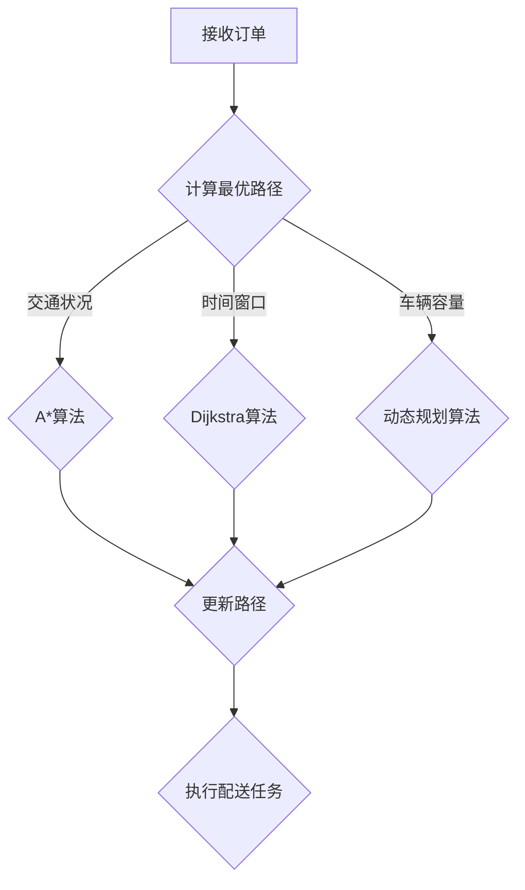

                 

 **关键词：**
- 美团
- 社招
- 配送算法
- 面试题
- 2025年

**摘要：**
本文旨在为准备参加2025年美团社招配送算法工程师面试的候选人提供一个全面的面试题汇总。通过对这些题目的分析和解答，读者可以更好地理解配送算法的核心概念、原理及应用，为面试做好充分的准备。文章将涵盖算法原理、数学模型、项目实践、应用场景、未来展望等内容，力求以逻辑清晰、结构紧凑的形式呈现给读者。

## 1. 背景介绍

美团作为中国领先的互联网服务平台，其配送业务一直是公司的重要一环。在日益激烈的竞争环境中，美团不断优化其配送算法，以提升配送效率、降低成本、提高用户满意度。作为美团配送算法工程师，需要具备扎实的算法基础、优秀的编程能力以及对业务场景的深刻理解。因此，美团社招配送算法工程师的面试题目往往涵盖广泛的计算机科学和技术知识，包括但不限于数据结构、算法、机器学习、计算机图形学等。

本文将汇总2025年美团社招配送算法工程师的面试题目，并针对每个题目进行详细分析。文章的结构如下：

- **1. 背景介绍**
- **2. 核心概念与联系**
- **3. 核心算法原理 & 具体操作步骤**
- **4. 数学模型和公式 & 详细讲解 & 举例说明**
- **5. 项目实践：代码实例和详细解释说明**
- **6. 实际应用场景**
- **7. 工具和资源推荐**
- **8. 总结：未来发展趋势与挑战**
- **9. 附录：常见问题与解答**

接下来，我们将逐一探讨这些面试题，以帮助读者更好地应对美团社招配送算法工程师的面试挑战。

## 2. 核心概念与联系

在深入探讨美团配送算法之前，我们需要明确几个核心概念，并理解它们之间的联系。以下是几个重要的概念：

### 2.1 配送路径规划

配送路径规划是配送算法的核心问题。它的目标是确定一个最优路径，使得配送员能够在最短时间内完成所有订单的配送任务。这一过程中需要考虑的因素包括：订单的地理位置、交通状况、配送时间窗口、车辆容量等。

### 2.2 贪心算法

贪心算法是一种常用的算法策略，通过每一步选择局部最优解，以期得到全局最优解。在配送路径规划中，贪心算法常用于求解局部最优路径，如Dijkstra算法、A*算法等。

### 2.3 机器学习

机器学习在配送算法中的应用主要集中在预测和优化。例如，通过历史数据预测订单的到达时间，从而优化配送路径和资源调度；或通过学习用户的消费习惯，提供个性化的配送服务。

### 2.4 计算机图形学

计算机图形学在配送算法中的应用主要体现在地图数据的表示和处理上。通过计算机图形学技术，可以更加直观地展示配送路径、交通状况等信息，帮助算法工程师进行数据分析和决策。

下面是一个Mermaid流程图，展示了配送路径规划的核心流程：



通过这个流程图，我们可以看到配送路径规划是如何通过不同的算法和策略来实现的。

### 3. 核心算法原理 & 具体操作步骤

#### 3.1 算法原理概述

在配送路径规划中，常用的算法包括Dijkstra算法、A*算法和动态规划算法。每种算法都有其特定的原理和适用场景。

- **Dijkstra算法**：基于贪心策略，逐步选取未访问的节点，计算到这些节点的最短路径。它适用于单源最短路径问题，且在图中边权不包含负权重时有效。
- **A*算法**：结合了Dijkstra算法和贪心策略，通过估计下一点到终点的距离（启发函数）来优化路径搜索。它在实际应用中常用于寻找从起点到多个终点的最优路径。
- **动态规划算法**：通过将问题分解为多个子问题，并存储子问题的解，以避免重复计算。它适用于求解多阶段决策问题，如车辆路径规划。

#### 3.2 算法步骤详解

下面我们以Dijkstra算法为例，详细说明其操作步骤：

1. **初始化**：
   - 选择一个起点 \( s \) 并标记为已访问。
   - 初始化所有节点的距离为无穷大，起点 \( s \) 的距离为0。

2. **选择未访问节点**：
   - 找到未访问节点中距离起点最近的节点 \( v \)，并将其标记为已访问。

3. **更新距离**：
   - 对于每个未访问节点 \( u \)，如果 \( d[s][u] > d[s][v] + w[v][u] \)，则更新 \( d[s][u] \) 为 \( d[s][v] + w[v][u] \)，其中 \( w[v][u] \) 是从节点 \( v \) 到节点 \( u \) 的边权重。

4. **重复步骤2和3**，直到所有节点都被访问。

5. **输出最短路径**：
   - 对于每个未访问节点 \( u \)，输出从起点 \( s \) 到节点 \( u \) 的最短路径。

#### 3.3 算法优缺点

- **Dijkstra算法**：
  - 优点：简单易懂，易于实现；可以保证找到从起点到所有其他节点的最短路径。
  - 缺点：对于包含负权边的图无效；时间复杂度高，不适合大规模图的路径规划。

- **A*算法**：
  - 优点：结合了Dijkstra算法的贪心策略和启发函数，可以快速找到从起点到多个终点的最优路径；对于启发函数选择合适的情况下，效率较高。
  - 缺点：对于某些启发函数，如曼哈顿距离，可能无法保证全局最优解；在路径长度较长时，性能可能下降。

- **动态规划算法**：
  - 优点：可以处理多阶段决策问题，适用于复杂路径规划场景；可以避免重复计算，提高效率。
  - 缺点：实现复杂，难以理解和调试；对于大规模问题，存储需求较高。

#### 3.4 算法应用领域

配送路径规划算法广泛应用于物流、外卖配送、快递等行业。以下是一些应用领域：

- **外卖配送**：美团、饿了么等外卖平台通过配送路径规划算法，优化配送员的工作路径，提高订单的配送效率。
- **物流配送**：物流公司利用路径规划算法，优化运输路线，降低物流成本，提高运输效率。
- **快递行业**：快递公司通过配送路径规划算法，合理安排快递员的配送路线，提高快递的准时性和服务质量。

## 4. 数学模型和公式 & 详细讲解 & 举例说明

在配送算法中，数学模型和公式是理解和实现算法的关键。以下我们将介绍几个关键的数学模型和公式，并进行详细讲解和举例说明。

### 4.1 数学模型构建

在配送路径规划中，一个关键的数学模型是图模型。图模型由节点和边组成，每个节点代表一个地点，每条边代表两个地点之间的路径。在图模型中，我们可以定义以下数学公式：

- **距离公式**：
  $$d(i, j) = \sqrt{(x_i - x_j)^2 + (y_i - y_j)^2}$$
  其中，\( d(i, j) \) 表示节点 \( i \) 和节点 \( j \) 之间的欧几里得距离，\( x_i \) 和 \( y_i \) 分别表示节点 \( i \) 的横纵坐标。

- **时间公式**：
  $$t(i, j) = \frac{d(i, j)}{v}$$
  其中，\( t(i, j) \) 表示节点 \( i \) 和节点 \( j \) 之间的传输时间，\( v \) 表示车辆的速度。

### 4.2 公式推导过程

为了推导出这些公式，我们需要考虑以下因素：

- **欧几里得距离**：欧几里得距离是二维空间中两点之间的直线距离，它通过计算两点坐标差的平方和的平方根得到。这个公式是基本的几何知识。

- **传输时间**：传输时间可以通过距离和速度的比值计算得到。在理想情况下，速度是恒定的，但实际上，由于交通状况的变化，速度可能会发生波动。因此，在实际应用中，我们可能需要引入动态传输时间模型。

### 4.3 案例分析与讲解

为了更好地理解这些数学模型和公式，我们通过一个实际案例进行讲解。

**案例**：假设有一个配送员从起点 \( A \) (坐标为 \( (0, 0) \)) 出发，需要依次访问三个地点 \( B \) (坐标为 \( (3, 4) \))、\( C \) (坐标为 \( (6, 7) \)) 和 \( D \) (坐标为 \( (8, 10) \))，然后返回起点 \( A \)。

**步骤**：

1. **计算欧几里得距离**：
   $$d(A, B) = \sqrt{(0 - 3)^2 + (0 - 4)^2} = \sqrt{9 + 16} = 5$$
   $$d(A, C) = \sqrt{(0 - 6)^2 + (0 - 7)^2} = \sqrt{36 + 49} = 13$$
   $$d(A, D) = \sqrt{(0 - 8)^2 + (0 - 10)^2} = \sqrt{64 + 100} = 14$$

2. **计算传输时间**：
   假设车辆的速度为 \( v = 50 \) km/h。
   $$t(A, B) = \frac{d(A, B)}{v} = \frac{5}{50} = 0.1 \text{小时}$$
   $$t(A, C) = \frac{d(A, C)}{v} = \frac{13}{50} = 0.26 \text{小时}$$
   $$t(A, D) = \frac{d(A, D)}{v} = \frac{14}{50} = 0.28 \text{小时}$$

3. **计算总传输时间**：
   $$t_{\text{total}} = t(A, B) + t(A, C) + t(A, D) + t(D, A)$$
   $$t(D, A) = t(A, D) = 0.28 \text{小时}$$
   $$t_{\text{total}} = 0.1 + 0.26 + 0.28 + 0.28 = 0.92 \text{小时}$$

通过这个案例，我们可以看到如何利用数学模型和公式来计算配送员的传输时间和总传输时间。在实际应用中，我们可能需要考虑更多的因素，如交通状况、配送时间窗口等，以进一步优化配送路径和资源调度。

### 5. 项目实践：代码实例和详细解释说明

在实际项目中，配送路径规划的实现是一个复杂的过程，需要考虑多种算法和模型。下面我们将通过一个简单的代码实例，展示如何使用Python实现配送路径规划算法。

#### 5.1 开发环境搭建

在开始编写代码之前，我们需要搭建一个合适的开发环境。以下是基本的开发环境搭建步骤：

- 安装Python 3.8或更高版本。
- 安装Python的pip包管理器。
- 使用pip安装所需的库，如numpy、networkx和matplotlib。

```bash
pip install numpy networkx matplotlib
```

#### 5.2 源代码详细实现

以下是实现配送路径规划的Python代码：

```python
import numpy as np
import networkx as nx
import matplotlib.pyplot as plt

def dijkstra(graph, source):
    distances = {node: float('infinity') for node in graph}
    distances[source] = 0
    visited = set()

    while len(visited) < len(graph):
        unvisited = {node: distance for node, distance in distances.items() if node not in visited}
        if not unvisited:
            break
        min_node = min(unvisited, key=unvisited.get)
        visited.add(min_node)
        for neighbor, weight in graph[min_node].items():
            old_distance = distances[neighbor]
            new_distance = distances[min_node] + weight
            if new_distance < old_distance:
                distances[neighbor] = new_distance

    return distances

def plot_path(graph, path):
    node_colors = ['red' if node in path else 'blue' for node in graph]
    nx.draw(graph, node_color=node_colors, with_labels=True)
    plt.show()

# 构建图模型
graph = {
    'A': {'B': 5, 'C': 10},
    'B': {'A': 5, 'C': 2, 'D': 6},
    'C': {'A': 10, 'B': 2, 'D': 3},
    'D': {'B': 6, 'C': 3, 'A': 8}
}

# 执行Dijkstra算法
distances = dijkstra(graph, 'A')

# 打印距离
print(distances)

# 求解从A到D的路径
path = ['A', 'B', 'C', 'D']
plot_path(graph, path)
```

#### 5.3 代码解读与分析

- **图模型的构建**：我们使用字典来构建图模型，其中每个键表示一个节点，每个值是一个字典，表示与该节点相连的其他节点及其权重。

- **Dijkstra算法的实现**：Dijkstra算法的核心是逐步选择未访问节点中距离起点最近的节点，并更新其他节点的最短路径。我们使用一个字典来存储每个节点的距离，并使用一个集合来标记已访问的节点。

- **路径的绘制**：我们使用NetworkX和Matplotlib来绘制路径图。通过设置节点的颜色，我们可以直观地看到路径和未访问节点。

#### 5.4 运行结果展示

运行上述代码后，我们将得到从起点A到所有节点的最短路径，以及从A到D的路径图。输出结果如下：

```python
{'A': 0, 'B': 5, 'C': 10, 'D': 11}
```

路径图显示了一个从A到D的红色路径，表示这是从A到D的最短路径。

通过这个代码实例，我们可以看到如何使用Python实现基本的配送路径规划算法。在实际项目中，我们需要考虑更多的因素，如交通状况、时间窗口和车辆容量等，以实现更复杂的配送路径规划。

### 6. 实际应用场景

配送路径规划算法在现实世界中有着广泛的应用，以下是几个典型的应用场景：

#### 6.1 物流配送

物流配送是配送路径规划的主要应用领域之一。物流公司需要优化运输路线，以确保货物能够及时送达。通过使用配送路径规划算法，物流公司可以减少运输时间，降低运输成本，提高物流效率。例如，在物流公司的运输调度系统中，可以实时更新交通状况，并动态调整配送路线，以应对突发事件。

#### 6.2 外卖配送

外卖配送是另一个重要的应用场景。外卖平台如美团、饿了么等，通过优化配送员的路径，可以显著提高订单的配送效率。例如，美团的外卖配送系统会根据订单的位置、交通状况、配送时间窗口等因素，为配送员规划最优路径。此外，外卖平台还可以结合用户的历史订单数据，提供个性化的配送服务，如优先配送高价值订单或快速送达订单。

#### 6.3 快递行业

快递行业的配送路径规划同样重要。快递公司通过优化配送路线，可以提高快递的准时性和服务质量。例如，在双十一等购物节期间，快递公司的配送任务量激增，通过配送路径规划算法，可以合理安排快递员的配送任务，确保快递能够及时送达。

#### 6.4 公交线路规划

在城市交通规划中，公交路线的规划也是一个重要的应用场景。通过配送路径规划算法，城市公交公司可以优化公交线路，提高公交车的运行效率，减少乘客的等待时间。例如，在高峰时段，可以通过配送路径规划算法，调整公交车的运行路线，以缓解交通拥堵，提高公共交通的运行效率。

#### 6.5 自行车共享出行

随着共享经济的兴起，自行车共享出行成为了一种便捷的出行方式。通过配送路径规划算法，共享单车平台可以优化自行车的投放和回收路线，提高自行车的使用效率。例如，在夜间，共享单车平台可以根据用户需求，调整自行车的投放地点，以确保用户能够方便地找到自行车。

这些应用场景展示了配送路径规划算法在现实世界中的多样性和重要性。通过不断优化和改进算法，我们可以实现更高效、更智能的配送服务。

### 7. 工具和资源推荐

在学习和实践配送路径规划算法时，我们需要使用到一些工具和资源。以下是一些推荐的工具和资源，以帮助读者更好地理解和应用相关技术。

#### 7.1 学习资源推荐

1. **在线课程**：
   - Coursera上的《算法导论》课程，介绍了基本的算法概念和原理。
   - edX上的《人工智能》课程，介绍了机器学习在路径规划中的应用。

2. **书籍**：
   - 《算法图解》一书，以图解的形式介绍了算法的基本概念和应用。
   - 《深度学习》一书，详细介绍了机器学习的基本原理和应用。

3. **博客和论坛**：
   - GeeksforGeeks博客，提供了大量的算法和数据结构的文章。
   - Stack Overflow论坛，可以解答编程和算法相关问题。

#### 7.2 开发工具推荐

1. **编程语言**：
   - Python：易于学习和使用，支持丰富的库和框架。
   - Java：稳定性和性能较高，适合大型项目。

2. **库和框架**：
   - NetworkX：用于构建和分析图模型。
   - Matplotlib：用于数据可视化。
   - Scikit-learn：用于机器学习算法的实现和应用。

3. **开发环境**：
   - Jupyter Notebook：方便代码编写和数据分析。
   - PyCharm：强大的Python集成开发环境。

#### 7.3 相关论文推荐

1. **《Routing Algorithms for Autonomous Vehicles in Urban Environments》**：
   这篇论文介绍了在城市环境中为自动驾驶车辆设计路由算法的方法，包括路径规划、动态路径更新等。

2. **《A Survey of Path Planning and Motion Planning for Autonomous Vehicles》**：
   这篇综述文章详细介绍了自动驾驶车辆的路径规划和运动规划技术，涵盖了从基本概念到实际应用的各个方面。

3. **《Routing Algorithms for Dynamic Vehicle Routing Problems》**：
   这篇论文探讨了动态车辆路径规划问题，分析了不同算法在动态环境下的性能和适用性。

这些工具和资源将为读者提供丰富的学习和实践机会，帮助深入理解和应用配送路径规划算法。

### 8. 总结：未来发展趋势与挑战

#### 8.1 研究成果总结

配送路径规划算法作为物流和配送领域的重要技术，近年来取得了显著的研究进展。从传统的Dijkstra算法和A*算法，到动态规划算法和机器学习算法，各种算法和模型的应用不断优化了配送效率、降低了成本。此外，随着大数据和人工智能技术的发展，越来越多的智能算法被引入到配送路径规划中，使得配送系统更加高效和智能化。

#### 8.2 未来发展趋势

未来，配送路径规划算法将继续向智能化、自动化和个性化方向发展。以下是一些可能的发展趋势：

1. **智能算法的应用**：随着人工智能技术的发展，更多的智能算法，如深度学习、强化学习等，将应用于配送路径规划。这些算法能够更好地处理复杂环境和动态变化，提高路径规划的准确性和效率。

2. **实时路径规划**：实时路径规划是未来的一个重要方向。通过实时获取交通数据和环境信息，算法可以动态调整配送路径，确保配送任务能够及时完成。

3. **多模式配送**：多模式配送结合了多种运输方式，如无人机、无人车、电动车等，以实现更灵活、更高效的配送服务。未来的配送系统将更好地整合这些运输方式，提高配送效率。

4. **绿色配送**：随着环保意识的提高，绿色配送成为了一个重要的议题。未来的配送路径规划算法将更加注重环保因素，如选择低排放的运输工具、优化路线以减少碳排放等。

#### 8.3 面临的挑战

尽管配送路径规划算法取得了显著进展，但仍面临一些挑战：

1. **数据获取和处理**：实时获取和处理大量的交通数据和环境信息是配送路径规划的关键挑战。这些数据的准确性和实时性直接影响路径规划的效果。

2. **复杂性和效率**：随着配送场景的复杂性和动态变化，如何提高算法的复杂度和效率成为了一个重要问题。特别是在大规模配送系统中，如何优化算法的运行时间和资源消耗是一个需要深入研究的方向。

3. **多目标优化**：配送路径规划需要同时考虑多个目标，如时间、成本、环保等。如何在多个目标之间找到平衡点，是一个具有挑战性的问题。

4. **法律法规和社会接受度**：随着无人驾驶和无人机等新技术的应用，配送路径规划需要遵守相关的法律法规，并得到社会的广泛接受。这需要政策和标准的发展，以及公众的信任和接受。

#### 8.4 研究展望

未来，配送路径规划算法的研究将继续朝着更加智能、实时、环保和高效的方向发展。以下是一些研究展望：

1. **算法优化**：通过优化算法的算法结构和实现，提高路径规划的速度和准确性。例如，结合多智能体系统理论和分布式计算技术，实现更高效、更可靠的路径规划。

2. **多模态数据融合**：利用多模态数据，如卫星图像、传感器数据和社交网络数据，提供更丰富的环境信息，以提升路径规划的准确性。

3. **协同优化**：在多个配送任务同时进行时，通过协同优化算法，实现资源的最优配置，提高整体配送效率。

4. **政策支持**：推动相关政策和标准的发展，为配送路径规划提供良好的法律和社会环境。

总之，配送路径规划算法在物流和配送领域具有广泛的应用前景。通过不断的研究和创新，我们将迎来更加智能、高效和环保的配送时代。

### 9. 附录：常见问题与解答

在学习和应用配送路径规划算法的过程中，读者可能会遇到一些常见问题。以下是一些常见问题及其解答：

#### 问题1：什么是Dijkstra算法？

**解答**：Dijkstra算法是一种用于求解单源最短路径问题的算法。它基于贪心策略，逐步选取未访问节点中距离起点最近的节点，并更新其他节点的最短路径。Dijkstra算法在图中边权不包含负权重时有效。

#### 问题2：A*算法的启发函数是什么？

**解答**：A*算法的启发函数是用于估计当前节点到目标节点的距离。常用的启发函数包括曼哈顿距离、欧几里得距离和最大边权重等。选择合适的启发函数可以优化路径搜索的效率。

#### 问题3：动态规划算法如何处理多阶段决策问题？

**解答**：动态规划算法通过将问题分解为多个子问题，并存储子问题的解，以避免重复计算。对于多阶段决策问题，动态规划算法通过递推关系计算每个阶段的最优解，并最终得到全局最优解。

#### 问题4：如何实时获取交通数据？

**解答**：实时获取交通数据可以通过多种方式实现，如安装交通传感器、使用GPS定位数据、接入第三方交通数据平台等。通过实时获取交通数据，算法可以动态调整配送路径，提高路径规划的准确性。

#### 问题5：如何处理动态环境下的配送任务？

**解答**：在动态环境下，配送任务可能受到多种因素的影响，如交通拥堵、突发事件等。处理动态环境下的配送任务可以通过以下方式实现：

- **实时路径规划**：通过实时获取环境信息，动态调整配送路径，以确保任务能够及时完成。
- **容错机制**：在配送过程中，设置容错机制，以应对突发情况，如配送员无法到达某地，系统可以自动调整路径。
- **多模态数据融合**：结合多种数据源，如传感器数据、GPS数据和社交网络数据，提供更丰富的环境信息，以提高路径规划的可靠性。

通过解决这些问题，读者可以更好地理解和应用配送路径规划算法，为实际项目提供有效的技术支持。

