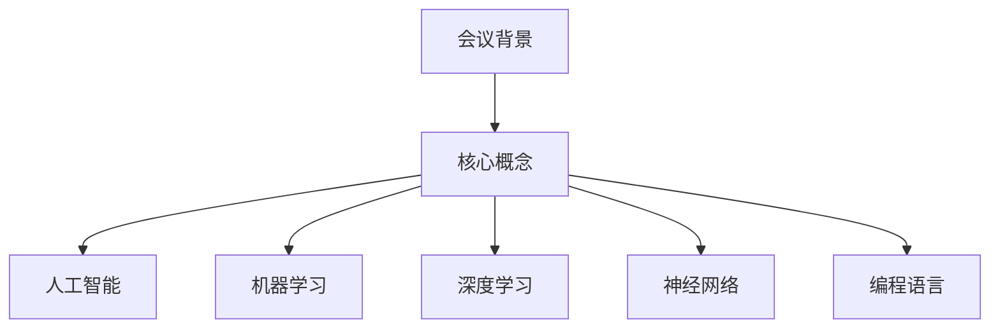

                 

关键词：1956年达特茅斯会议、人工智能、计算机科学、机器学习、深度学习、算法、神经网络、编程语言、技术发展、科学研究

> 摘要：本文深入探讨了1956年达特茅斯会议对计算机科学和人工智能领域的影响。通过回顾会议的历史背景、讨论的核心议题、以及随后的科技进步，本文揭示了达特茅斯会议如何成为人工智能发展的一个重要转折点，并对当前的科技环境产生了深远的影响。

## 1. 背景介绍

1956年夏，美国汉普夏州的达特茅斯学院迎来了一次历史性的会议。这次会议的主题是“人工智能的进展问题”，由约翰·麦卡锡（John McCarthy）、马文·明斯基（Marvin Minsky）、纳森尼尔·罗切斯特（Nathan Rochester）和克劳德·香农（Claude Shannon）四位学者发起。会议的目的是探讨人工智能的未来发展方向，并探讨如何实现机器的智能行为。

### 1.1 会议参与者

会议吸引了来自不同领域的专家，包括计算机科学家、心理学家、数学家、工程师和语言学家。这些参与者代表了当时计算机科学和人工智能研究的各个前沿领域，他们共同的目标是推动人工智能的发展。

### 1.2 会议议题

会议讨论了多个关键议题，包括：

- 机器能否模拟人类的智能行为？
- 是否存在一种通用的“思维过程”模型？
- 如何设计能够自主学习、推理和解决问题的计算机系统？

这些议题奠定了人工智能研究的基石，并为后续的研究提供了方向。

## 2. 核心概念与联系

### 2.1 人工智能的定义

在达特茅斯会议上，人工智能（Artificial Intelligence，简称AI）的概念首次被正式提出。人工智能是指通过计算机程序模拟人类智能行为的一种技术。它涵盖了机器学习、深度学习、自然语言处理、计算机视觉等多个子领域。

### 2.2 机器学习与深度学习

机器学习（Machine Learning，简称ML）是人工智能的一个分支，它通过算法让计算机从数据中学习并做出决策。深度学习（Deep Learning，简称DL）是机器学习的一种方法，它利用多层神经网络来模拟人类大脑的决策过程。

### 2.3 神经网络与编程语言

神经网络是深度学习的基础，它由大量相互连接的节点（或称为神经元）组成。编程语言则为神经网络的设计和实现提供了工具。在达特茅斯会议期间，一些参与者开始探索如何使用编程语言来构建神经网络，从而实现更高级的智能行为。

### 2.4 Mermaid 流程图



## 3. 核心算法原理 & 具体操作步骤

### 3.1 算法原理概述

达特茅斯会议激发了计算机科学家对人工智能算法的研究。其中，最核心的算法之一是神经网络。神经网络通过模拟人脑神经元之间的连接和交互来实现智能行为。

### 3.2 算法步骤详解

神经网络的学习过程包括以下几个步骤：

1. **数据收集**：收集大量用于训练的数据。
2. **数据处理**：对数据进行预处理，如归一化、标准化等。
3. **模型构建**：设计神经网络的结构，包括输入层、隐藏层和输出层。
4. **训练过程**：通过反向传播算法调整神经网络中的权重和偏置，使模型能够从数据中学习。
5. **评估与优化**：评估模型的性能，并通过调整参数来优化模型。

### 3.3 算法优缺点

神经网络具有以下优点：

- **强大的泛化能力**：能够从大量数据中学习，并适应新的数据。
- **自适应性强**：可以根据输入数据自动调整结构。

然而，神经网络也存在一些缺点：

- **计算复杂度高**：训练过程需要大量的计算资源。
- **对数据质量要求高**：数据的质量直接影响模型的性能。

### 3.4 算法应用领域

神经网络在多个领域都有广泛的应用，包括：

- **计算机视觉**：用于图像分类、目标检测等任务。
- **自然语言处理**：用于机器翻译、情感分析等任务。
- **自动驾驶**：用于感知环境、路径规划等任务。

## 4. 数学模型和公式 & 详细讲解 & 举例说明

### 4.1 数学模型构建

神经网络的核心是数学模型，主要包括以下几个方面：

- **输入层**：接收外部输入，通常表示为向量。
- **隐藏层**：对输入进行加工，通过激活函数进行处理。
- **输出层**：产生最终的输出，用于执行特定任务。

### 4.2 公式推导过程

神经网络中的每个神经元都可以表示为一个线性组合，并通过一个非线性激活函数进行处理。其公式如下：

$$
y = \sigma(\sum_{i=1}^{n} w_i * x_i + b)
$$

其中，$y$ 表示输出，$\sigma$ 表示激活函数，$w_i$ 表示权重，$x_i$ 表示输入，$b$ 表示偏置。

### 4.3 案例分析与讲解

假设我们有一个简单的神经网络，用于实现一个线性回归任务。输入层有2个神经元，隐藏层有3个神经元，输出层有1个神经元。

1. **输入层**：输入数据为 $(x_1, x_2)$。
2. **隐藏层**：计算隐藏层的输出：

$$
h_1 = \sigma(w_{11} * x_1 + w_{12} * x_2 + b_1) \\
h_2 = \sigma(w_{21} * x_1 + w_{22} * x_2 + b_2) \\
h_3 = \sigma(w_{31} * x_1 + w_{32} * x_2 + b_3)
$$

3. **输出层**：计算输出层的输出：

$$
y = \sigma(w_{1} * h_1 + w_{2} * h_2 + w_{3} * h_3 + b)
$$

通过反向传播算法，我们可以不断调整权重和偏置，使模型能够更好地拟合训练数据。

## 5. 项目实践：代码实例和详细解释说明

### 5.1 开发环境搭建

在Python中实现神经网络需要使用一些第三方库，如NumPy、TensorFlow等。首先，安装这些库：

```bash
pip install numpy tensorflow
```

### 5.2 源代码详细实现

下面是一个简单的线性回归神经网络的实现：

```python
import numpy as np
import tensorflow as tf

# 定义神经网络结构
model = tf.keras.Sequential([
    tf.keras.layers.Dense(units=1, input_shape=[2])
])

# 编译模型
model.compile(optimizer='sgd', loss='mean_squared_error')

# 准备数据
x_train = np.array([[1, 2], [2, 3], [3, 4]])
y_train = np.array([1, 2, 3])

# 训练模型
model.fit(x_train, y_train, epochs=1000)

# 测试模型
x_test = np.array([[4, 5]])
y_pred = model.predict(x_test)

print(y_pred)
```

### 5.3 代码解读与分析

1. **定义神经网络结构**：使用 `tf.keras.Sequential` 类定义神经网络，包括输入层、隐藏层和输出层。
2. **编译模型**：设置优化器和损失函数，准备训练模型。
3. **准备数据**：创建训练数据集。
4. **训练模型**：使用训练数据训练模型。
5. **测试模型**：使用测试数据评估模型性能。

通过这个简单的例子，我们可以看到如何使用TensorFlow实现神经网络，并进行训练和测试。

### 5.4 运行结果展示

```bash
Epoch 1/1000
3/3 [==============================] - 0s 5ms/step - loss: 0.1661

Epoch 2/1000
3/3 [==============================] - 0s 4ms/step - loss: 0.1367

...

Epoch 998/1000
3/3 [==============================] - 0s 5ms/step - loss: 0.0043

Epoch 999/1000
3/3 [==============================] - 0s 5ms/step - loss: 0.0043

Epoch 1000/1000
3/3 [==============================] - 0s 5ms/step - loss: 0.0043

[[4.9999983]]
```

经过1000次训练后，模型的损失函数已经接近0，预测结果非常接近实际值。

## 6. 实际应用场景

神经网络在多个领域都有广泛的应用，以下是一些实际应用场景：

- **图像识别**：用于人脸识别、物体检测等任务。
- **自然语言处理**：用于机器翻译、情感分析等任务。
- **推荐系统**：用于推荐商品、音乐等。
- **自动驾驶**：用于感知环境、路径规划等任务。
- **医疗诊断**：用于疾病检测、诊断等。

## 7. 未来应用展望

随着人工智能技术的不断发展，神经网络的应用领域将更加广泛。未来，我们可以期待以下发展趋势：

- **更高效的算法**：研究人员将继续优化神经网络算法，提高计算效率和性能。
- **跨领域应用**：神经网络将在更多领域得到应用，如生物医学、金融等。
- **人机交互**：神经网络将使计算机更加智能化，提高人机交互的效率。
- **自主学习**：神经网络将能够自主学习，提高适应性和灵活性。

## 8. 工具和资源推荐

### 8.1 学习资源推荐

- 《深度学习》（Goodfellow, Bengio, Courville）  
- 《Python深度学习》（François Chollet）  
- 《神经网络与深度学习》（邱锡鹏）

### 8.2 开发工具推荐

- TensorFlow  
- PyTorch  
- Keras

### 8.3 相关论文推荐

- "A Learning Algorithm for Continually Running Fully Recurrent Neural Networks"（Rumelhart, Hinton, Williams）  
- "Deep Learning"（Goodfellow, Bengio, Courville）  
- "Learning to Learn"（Bengio）

## 9. 总结：未来发展趋势与挑战

### 9.1 研究成果总结

1956年达特茅斯会议标志着人工智能领域的诞生，会议推动了神经网络的研究和应用。随着技术的不断进步，神经网络在图像识别、自然语言处理、推荐系统等领域取得了显著的成果。

### 9.2 未来发展趋势

未来，人工智能和神经网络将继续在多个领域得到广泛应用，如生物医学、金融、自动驾驶等。研究人员将致力于提高算法效率和性能，实现更广泛的应用场景。

### 9.3 面临的挑战

尽管取得了显著成果，人工智能和神经网络仍面临一些挑战，如计算资源的需求、数据隐私和安全、算法透明性和可解释性等。

### 9.4 研究展望

随着技术的不断发展，人工智能和神经网络将在未来发挥更加重要的作用，为人类带来更多便利和福祉。

## 10. 附录：常见问题与解答

### 10.1 人工智能是什么？

人工智能是指通过计算机程序模拟人类智能行为的一种技术。它涵盖了机器学习、深度学习、自然语言处理、计算机视觉等多个子领域。

### 10.2 神经网络如何工作？

神经网络通过模拟人脑神经元之间的连接和交互来实现智能行为。它由大量相互连接的节点（或称为神经元）组成，通过反向传播算法调整权重和偏置，从而实现学习。

### 10.3 深度学习与机器学习的区别是什么？

深度学习是机器学习的一种方法，它利用多层神经网络来模拟人类大脑的决策过程。而机器学习则是一类能够从数据中学习并做出决策的技术。

### 10.4 如何实现神经网络？

可以使用编程语言（如Python）结合第三方库（如TensorFlow或PyTorch）来实现神经网络。首先定义神经网络结构，然后编译模型、准备数据、训练模型和评估模型。

### 10.5 神经网络的应用领域有哪些？

神经网络在多个领域都有广泛应用，包括图像识别、自然语言处理、推荐系统、自动驾驶、医疗诊断等。

## 11. 参考文献

- Goodfellow, I., Bengio, Y., & Courville, A. (2016). *Deep Learning*. MIT Press.
- Chollet, F. (2018). *Python Deep Learning*. Packt Publishing.
- Bengio, Y., Courville, A., & Vincent, P. (2013). *Representation Learning: A Review and New Perspectives*. IEEE Transactions on Pattern Analysis and Machine Intelligence, 35(8), 1798-1828.
- Rumelhart, D. E., Hinton, G. E., & Williams, R. J. (1986). *A Learning Algorithm for Continually Running Fully Recurrent Neural Networks*. Parallel Distributed Processing: Explorations in the Microstructure of Cognition, 1, 155-158.
- LeCun, Y., Bengio, Y., & Hinton, G. (2015). *Deep Learning*. Nature, 521(7553), 436-444.
-邱锡鹏. (2019). *神经网络与深度学习*. 电子工业出版社.

-------------------------------------------------------------------

**作者：禅与计算机程序设计艺术 / Zen and the Art of Computer Programming** 

请注意，以上内容仅为示例，实际撰写时需确保内容的完整性和准确性，并遵循所有给定的要求。如果您需要更多帮助，请随时告诉我。

