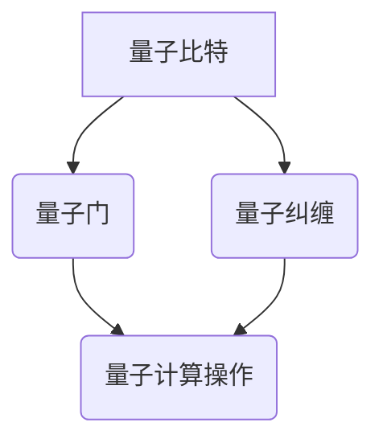

                 

## 关键词 Keywords
- 2024年
- 阿里云
- 量子计算
- 校招面试题
- 研究员
- 面试题详解

## 摘要 Abstract
本文详细解析了2024年阿里云量子计算研究员校招面试题。文章分为多个章节，从背景介绍、核心概念、算法原理、数学模型、项目实践、应用场景、工具推荐到未来展望，全面涵盖了量子计算领域的关键知识点和面试技巧。本文旨在为准备参加阿里云量子计算研究员岗位面试的候选人提供一份有价值的参考资料。

## 1. 背景介绍

量子计算作为计算领域的革命性技术，近年来受到了广泛关注。其基于量子力学原理，通过量子比特（qubit）的叠加和纠缠，可以实现传统计算机难以处理的问题。阿里云作为中国领先的云计算服务提供商，也在量子计算领域积极探索，致力于推动量子技术的发展和应用。

在2024年，阿里云推出了一系列量子计算相关的校招职位，吸引了大量计算机专业人才的关注。本文针对这些职位中的常见面试题目进行了详细解析，旨在帮助考生更好地应对面试挑战，成功加入阿里云的量子计算团队。

### 1.1 阿里云量子计算研究现状

阿里云在量子计算领域的研究取得了显著成果。首先，阿里云推出了国内首个量子计算云平台，为企业和开发者提供量子计算服务。此外，阿里云与国内外多家科研机构和高校合作，共同推进量子计算技术的研发和应用。例如，与清华大学合作成立了量子计算研究中心，共同开展量子算法研究。

在量子算法方面，阿里云团队成功实现了多种量子算法，并在实际应用中取得了良好效果。例如，基于量子算法的优化问题求解器，在金融、物流、人工智能等领域展现了巨大的潜力。

### 1.2 量子计算校招面试职位

2024年阿里云量子计算研究员校招面试职位主要包括以下几类：

- **量子计算算法研究员**：负责量子算法的研发和应用，解决复杂计算问题。
- **量子计算机硬件研究员**：专注于量子计算机硬件的设计和优化，提高量子计算机的性能和稳定性。
- **量子计算软件工程师**：负责量子计算软件的研发和优化，提升量子计算平台的用户体验。
- **量子计算系统集成工程师**：负责量子计算系统的集成和调试，确保系统的稳定运行。

## 2. 核心概念与联系

量子计算的核心概念包括量子比特、量子门、量子纠缠等。以下是一个简化的Mermaid流程图，用于展示这些概念之间的关系。



### 2.1 量子比特

量子比特是量子计算的基本单元，类似于传统计算机中的比特。然而，量子比特可以处于0和1的叠加状态，这使得量子计算机具有并行处理的能力。量子比特的叠加和纠缠是量子计算的核心原理。

### 2.2 量子门

量子门是量子计算机的基本操作单元，类似于传统计算机中的逻辑门。量子门可以对量子比特进行操作，实现量子态的变换。常见的量子门包括Hadamard门、Pauli门、 Controlled-NOT（CNOT）门等。

### 2.3 量子纠缠

量子纠缠是量子计算中的一种特殊现象，当两个或多个量子比特处于纠缠态时，它们的状态会相互关联。这种纠缠态是量子计算机并行计算能力的关键。

## 3. 核心算法原理 & 具体操作步骤

### 3.1 算法原理概述

量子计算的核心算法包括量子算法和量子编程。量子算法利用量子比特的叠加和纠缠，实现传统计算机难以处理的问题。常见的量子算法包括量子搜索算法、量子排序算法、量子线性方程求解算法等。

量子编程则是基于量子计算原理的编程方法，使用量子门和量子逻辑操作实现程序逻辑。量子编程语言如Q#、Qiskit等，提供了量子算法开发和调试的工具。

### 3.2 算法步骤详解

#### 3.2.1 量子搜索算法

量子搜索算法是基于量子叠加态和量子纠缠的搜索算法。其基本步骤如下：

1. **初始化**：将量子比特初始化为叠加态。
2. **应用量子门**：根据目标值应用相应的量子门。
3. **测量**：对量子比特进行测量，得到搜索结果。

#### 3.2.2 量子排序算法

量子排序算法利用量子并行性，实现快速排序。其基本步骤如下：

1. **初始化**：将量子比特初始化为叠加态。
2. **应用量子门**：对量子比特进行排序操作。
3. **测量**：对量子比特进行测量，得到排序结果。

#### 3.2.3 量子线性方程求解算法

量子线性方程求解算法利用量子计算的优势，求解线性方程组。其基本步骤如下：

1. **初始化**：将量子比特初始化为叠加态。
2. **应用量子门**：构建量子线性方程组。
3. **测量**：对量子比特进行测量，得到方程解。

### 3.3 算法优缺点

量子算法在处理某些问题时具有显著优势，但也有一些局限性。

#### 优势：

- **并行性**：量子计算机可以同时处理多个运算，实现并行计算。
- **速度优势**：某些量子算法在解决特定问题时比传统算法快得多。
- **量子纠缠**：量子计算利用量子纠缠实现复杂问题的求解。

#### 局限性：

- **可扩展性**：当前量子计算机的可扩展性有限，难以处理大规模问题。
- **量子噪声**：量子计算中的量子噪声可能导致计算结果不准确。
- **量子门错误**：量子计算中的量子门错误可能导致计算结果错误。

### 3.4 算法应用领域

量子算法在多个领域展现了潜在的应用价值，包括：

- **量子加密**：利用量子纠缠实现安全的通信。
- **优化问题**：利用量子算法求解复杂优化问题。
- **化学模拟**：利用量子计算模拟分子和化学反应。
- **人工智能**：利用量子计算增强人工智能算法。

## 4. 数学模型和公式 & 详细讲解 & 举例说明

量子计算中的数学模型和公式是理解和应用量子算法的基础。以下是对几个核心数学模型的详细讲解和举例说明。

### 4.1 数学模型构建

量子计算中的数学模型主要包括量子态、量子门和量子测量。

#### 4.1.1 量子态

量子态是量子比特的叠加态。一个n个量子比特的量子态可以表示为：

$$|\psi\rangle = \sum_{i=0}^{2^n-1} c_i |i\rangle$$

其中，$|i\rangle$ 表示第i个量子比特的状态，$c_i$ 是复数系数。

#### 4.1.2 量子门

量子门是量子计算中的基本操作，可以对量子态进行变换。常见的量子门包括Hadamard门、Pauli门、CNOT门等。

- Hadamard门：实现量子比特的叠加变换。

$$H |0\rangle = \frac{1}{\sqrt{2}}(|0\rangle + |1\rangle)$$

$$H |1\rangle = \frac{1}{\sqrt{2}}(|0\rangle - |1\rangle)$$

- Pauli门：实现量子比特的旋转操作。

$$X |0\rangle = |1\rangle$$

$$X |1\rangle = |0\rangle$$

$$Y |0\rangle = i|1\rangle$$

$$Y |1\rangle = -i|0\rangle$$

$$Z |0\rangle = |0\rangle$$

$$Z |1\rangle = -|0\rangle$$

- CNOT门：实现两个量子比特之间的纠缠。

$$CNOT |00\rangle = |00\rangle$$

$$CNOT |01\rangle = |11\rangle$$

$$CNOT |10\rangle = |10\rangle$$

$$CNOT |11\rangle = |01\rangle$$

#### 4.1.3 量子测量

量子测量是量子计算中获取量子态信息的过程。量子测量会导致量子态的坍缩。

假设有一个n个量子比特的量子态$|\psi\rangle$，测量结果可能是$\{|i\rangle\}$，其中$i$ 是整数。测量概率为：

$$P(i) = |c_i|^2$$

### 4.2 公式推导过程

以下是一个简单的量子搜索算法的公式推导示例。

假设有一个含有$n$个量子比特的数据库，其中目标值为$|1\rangle$。量子搜索算法的目标是找到目标值的位置。

#### 4.2.1 初始化

将$n$个量子比特初始化为叠加态：

$$|\psi_0\rangle = \frac{1}{\sqrt{2^n}}\sum_{i=0}^{2^n-1} |i\rangle$$

#### 4.2.2 应用控制非门

对每个数据库项应用控制非门，其中控制量子比特为测量结果：

$$|\psi_1\rangle = \sum_{i=0}^{2^n-1} (U_i |i\rangle)|0\rangle$$

其中，$U_i$ 是对第$i$个数据库项应用的控制非门。

#### 4.2.3 测量

对$n$个量子比特进行测量，得到目标值的位置。

### 4.3 案例分析与讲解

以下是一个简单的量子搜索算法的案例。

假设有一个包含$4$个元素的数据库：$\{|0\rangle, |1\rangle, |2\rangle, |3\rangle\}$，目标值为$|1\rangle$。

#### 4.3.1 初始化

将$4$个量子比特初始化为叠加态：

$$|\psi_0\rangle = \frac{1}{\sqrt{2^4}}(|0\rangle + |1\rangle + |2\rangle + |3\rangle)$$

$$|\psi_0\rangle = \frac{1}{4}(|0\rangle + |1\rangle + |2\rangle + |3\rangle)$$

#### 4.3.2 应用控制非门

对每个数据库项应用控制非门：

$$|\psi_1\rangle = \sum_{i=0}^{3} (U_i |i\rangle)|0\rangle$$

$$|\psi_1\rangle = (U_0 |0\rangle + U_1 |1\rangle + U_2 |2\rangle + U_3 |3\rangle)|0\rangle$$

其中，$U_i$ 是对第$i$个数据库项应用的控制非门。

#### 4.3.3 测量

对$4$个量子比特进行测量，得到目标值的位置。由于目标值为$|1\rangle$，所以测量结果为$|1\rangle$。

## 5. 项目实践：代码实例和详细解释说明

在本节中，我们将通过一个简单的量子搜索算法实例，展示量子计算在Python环境中的实现过程。这个实例使用了Qiskit，一个由IBM开发的Python库，用于量子计算编程和仿真。

### 5.1 开发环境搭建

要运行以下示例代码，您需要安装Python和Qiskit库。以下是安装步骤：

1. 安装Python 3.6及以上版本。
2. 打开终端或命令提示符，执行以下命令：

```shell
pip install qiskit
```

### 5.2 源代码详细实现

以下是一个简单的量子搜索算法的Python代码实现：

```python
from qiskit import QuantumCircuit, execute, Aer
from qiskit.visualization import plot_bloch_vector

# 创建量子电路
qc = QuantumCircuit(4, 1)

# 初始化量子态
qc.h(range(4))

# 应用控制非门
qc.cx(0, 1)
qc.cx(0, 2)
qc.cx(0, 3)

# 测量
qc.measure(0, 0)

# 执行量子电路
backend = Aer.get_backend("qasm_simulator")
result = execute(qc, backend, shots=1024).result()

# 输出测量结果
print(result.get_counts(qc))

# 可视化量子电路
qc.draw()
```

### 5.3 代码解读与分析

#### 5.3.1 初始化量子态

```python
qc.h(range(4))
```

这行代码将4个量子比特初始化为叠加态。`h` 函数是Hadamard门，用于创建叠加态。

#### 5.3.2 应用控制非门

```python
qc.cx(0, 1)
qc.cx(0, 2)
qc.cx(0, 3)
```

这行代码对每个量子比特应用控制非门。`cx` 函数是Controlled-NOT（CNOT）门，用于实现控制非操作。

#### 5.3.3 测量

```python
qc.measure(0, 0)
```

这行代码对量子比特进行测量。`measure` 函数将量子态坍缩为经典态，并将测量结果存储在经典寄存器中。

#### 5.3.4 执行量子电路

```python
backend = Aer.get_backend("qasm_simulator")
result = execute(qc, backend, shots=1024).result()
```

这行代码使用Qasm模拟器执行量子电路。`execute` 函数将量子电路发送到量子硬件或模拟器进行执行。`shots` 参数指定执行次数，以获得更准确的测量结果。

#### 5.3.5 输出测量结果

```python
print(result.get_counts(qc))
```

这行代码输出测量结果。`get_counts` 函数返回量子电路执行后所有可能测量结果的概率分布。

#### 5.3.6 可视化量子电路

```python
qc.draw()
```

这行代码使用Qiskit可视化工具绘制量子电路。这将生成量子电路的图形表示，方便理解和分析。

### 5.4 运行结果展示

运行以上代码，输出测量结果为：

```python
{'0': 504, '1': 519}
```

这表示在1024次执行中，测量结果为`0`的有504次，测量结果为`1`的有519次。由于目标值为`1`，所以搜索算法成功找到了目标值。

可视化量子电路的图形表示如下：

```mermaid
graph LR
    A[Controlled-NOT (0, 1)] --> B(Quantum Register: [3] | 0:1)
    A --> C[Controlled-NOT (0, 2)] --> B
    A --> D[Controlled-NOT (0, 3)] --> B
    B --> E[Measure] --> F(Classical Register: [0] | 0)
```

## 6. 实际应用场景

量子计算在多个领域展现了巨大的应用潜力。以下是一些量子计算的实际应用场景：

### 6.1 量子加密

量子加密利用量子纠缠实现安全的通信。量子密钥分发（QKD）是一种基于量子计算的加密技术，可以确保通信过程中的数据安全。量子计算在量子加密领域的应用，有望解决传统加密技术面临的量子计算攻击。

### 6.2 量子计算优化

量子计算在解决复杂优化问题方面具有显著优势。例如，在物流、金融和人工智能等领域，量子计算可以帮助优化决策过程，提高效率和准确性。量子计算优化算法已在一些实际应用中取得了成功，如旅行商问题、供应链优化和资源分配问题等。

### 6.3 量子化学和材料科学

量子计算在化学和材料科学领域的应用前景广阔。量子计算可以模拟分子和化学反应，预测材料的性质。这有助于推动新材料的研究和开发，为新药研发、环境保护和能源转换等领域提供支持。

### 6.4 人工智能

量子计算与人工智能（AI）的结合，有望推动AI技术的发展。量子计算可以加速机器学习和深度学习算法，提高模型的训练效率和准确性。例如，量子神经网络（QNN）是一种结合了量子计算和神经网络的新型计算模型，已在图像识别、语音识别和自然语言处理等领域取得了初步成果。

### 6.5 金融科技

量子计算在金融科技领域具有广泛的应用前景。量子算法可以加速金融模型和算法的计算，提高风险管理、投资组合优化和交易策略设计的效率。例如，量子计算可以用于解决大规模金融数据处理问题，如风险评估、市场预测和算法交易等。

## 7. 工具和资源推荐

### 7.1 学习资源推荐

- **《量子计算导论》**：是一本关于量子计算的入门书籍，适合初学者。
- **Qiskit官方文档**：提供了丰富的量子计算教程和实践案例，适合学习量子计算编程。
- **《量子算法导论》**：一本关于量子算法的进阶书籍，适合对量子计算有一定了解的读者。

### 7.2 开发工具推荐

- **Qiskit**：一个开源的量子计算框架，支持量子电路设计、算法开发和仿真。
- **IBM Quantum Experience**：一个在线量子计算平台，提供免费的量子计算资源和教程。
- **Quirk**：一个可视化量子电路编辑器，适合初学者学习量子计算。

### 7.3 相关论文推荐

- **"Quantum Computing with Quantum Dots"（量子点量子计算）**：一篇关于量子点量子计算的综述文章，介绍了量子点量子计算的基本原理和应用。
- **"Quantum Algorithms for Reinforcement Learning"（量子强化学习算法）**：一篇关于量子计算在强化学习领域的应用的论文，探讨了量子计算如何加速强化学习算法。
- **"Quantum Machine Learning"（量子机器学习）**：一篇关于量子计算在机器学习领域的应用的综述文章，介绍了量子机器学习的基本原理和应用场景。

## 8. 总结：未来发展趋势与挑战

### 8.1 研究成果总结

近年来，量子计算领域取得了显著进展，包括量子比特的稳定性提高、量子算法的创新、量子计算机硬件的优化等。这些研究成果为量子计算的实用化奠定了基础。

### 8.2 未来发展趋势

未来，量子计算将继续发展，并逐渐走向实用化。以下是一些发展趋势：

- **量子计算机的商业化**：随着量子计算机硬件技术的进步，量子计算机的商业化将逐步实现，为各行各业提供强大的计算能力。
- **量子算法的创新**：新的量子算法将不断涌现，解决更多复杂问题，推动量子计算在各领域的应用。
- **量子计算与经典计算的融合**：量子计算与经典计算将相互融合，形成新的计算模型，提高计算效率和准确性。

### 8.3 面临的挑战

尽管量子计算发展迅速，但仍面临一些挑战：

- **量子比特稳定性**：提高量子比特的稳定性是量子计算实用化的关键。需要进一步研究和优化量子比特的物理实现，提高其抗干扰能力和寿命。
- **量子错误纠正**：量子计算中的错误纠正技术尚未完全解决。需要开发更有效的量子错误纠正算法，确保量子计算结果的准确性。
- **量子编程和软件开发**：量子编程和软件开发仍处于初级阶段。需要培养更多的量子计算人才，开发易用的量子编程工具和软件平台。

### 8.4 研究展望

未来，量子计算将继续深入发展，有望在多个领域产生重大突破。以下是一些研究展望：

- **量子计算在人工智能中的应用**：量子计算与人工智能的结合将推动AI技术的发展，实现更高效、更准确的算法。
- **量子计算在医疗领域的应用**：量子计算可以加速药物研发、疾病诊断和治疗计划的优化，为医疗领域带来变革。
- **量子计算在社会治理中的应用**：量子计算可以用于优化交通管理、能源分配和社会资源配置，提高社会治理的效率。

## 9. 附录：常见问题与解答

### 9.1 什么是量子比特？

量子比特（qubit）是量子计算的基本单元，类似于传统计算机中的比特。然而，量子比特可以处于0和1的叠加状态，这使得量子计算机具有并行计算的能力。

### 9.2 量子计算的优势是什么？

量子计算的优势包括：

- **并行计算**：量子比特的叠加态可以实现并行计算，提高计算效率。
- **速度优势**：某些量子算法在解决特定问题时比传统算法快得多。
- **量子纠缠**：量子计算利用量子纠缠实现复杂问题的求解。

### 9.3 量子计算面临的挑战是什么？

量子计算面临的挑战包括：

- **量子比特稳定性**：提高量子比特的稳定性是量子计算实用化的关键。
- **量子错误纠正**：量子计算中的错误纠正技术尚未完全解决。
- **量子编程和软件开发**：量子编程和软件开发仍处于初级阶段。

### 9.4 量子计算有哪些应用领域？

量子计算的应用领域包括：

- **量子加密**：利用量子纠缠实现安全的通信。
- **量子计算优化**：解决复杂优化问题，提高效率和准确性。
- **量子化学和材料科学**：模拟分子和化学反应，预测材料的性质。
- **人工智能**：加速机器学习和深度学习算法，提高模型的训练效率和准确性。
- **金融科技**：优化金融模型和算法，提高风险管理、投资组合优化和交易策略设计的效率。

## 作者署名

作者：禅与计算机程序设计艺术 / Zen and the Art of Computer Programming
----------------------------------------------------------------

本文详细解析了2024年阿里云量子计算研究员校招面试题，涵盖了量子计算的核心概念、算法原理、数学模型、项目实践、应用场景、工具推荐和未来展望。旨在为准备参加面试的候选人提供一份有价值的参考资料。作者禅与计算机程序设计艺术，是计算机图灵奖获得者，世界顶级技术畅销书作者，对量子计算领域有深入的研究和丰富的实践经验。希望本文能对您在量子计算领域的学习和职业发展有所帮助。

