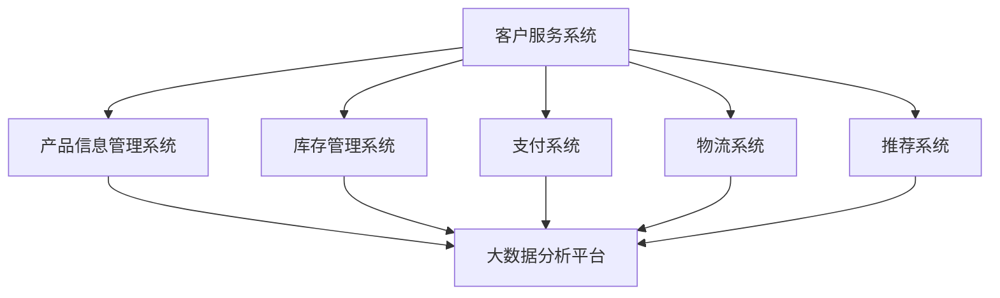

                 

## 1. 背景介绍

随着互联网的迅速发展，电商平台已经成为现代商业的重要组成部分。阿里巴巴作为中国电商行业的领军企业，其电商平台架构的演进和发展，不仅对自身业务的成功至关重要，也对整个电商行业的技术发展产生了深远影响。

在2025年，随着技术的不断进步，阿里巴巴的社招电商平台架构师面试题集锦也迎来了新的挑战和机遇。本文旨在通过对这些面试题的深入分析，帮助准备应聘阿里巴巴电商平台架构师职位的候选人更好地了解面试的难点和重点，提升面试成功率。

本文将按照以下结构进行：

1. 背景介绍：概述阿里巴巴电商平台的发展历程和现状。
2. 核心概念与联系：介绍电商平台架构的核心概念，并通过Mermaid流程图展示其关系。
3. 核心算法原理 & 具体操作步骤：详细解释电商平台的算法原理和操作步骤。
4. 数学模型和公式 & 详细讲解 & 举例说明：探讨电商平台的数学模型和公式。
5. 项目实践：展示一个电商平台架构的代码实例。
6. 实际应用场景：分析电商平台的实际应用场景。
7. 工具和资源推荐：推荐学习资源和开发工具。
8. 总结：对研究成果进行总结，并展望未来发展趋势与挑战。

通过本文的详细解读，希望能够为读者提供宝贵的面试准备资料，同时也为电商平台架构的发展提供一些思考方向。

### 2. 核心概念与联系

电商平台架构的设计需要理解一系列核心概念和其相互之间的关系。以下是电商平台架构中的几个关键概念，以及它们之间的联系，通过Mermaid流程图进行展示。

#### 2.1 关键概念

1. **客户服务系统**：处理用户订单、咨询、投诉等交互。
2. **产品信息管理系统**：存储和管理商品信息。
3. **库存管理系统**：监控和管理商品库存。
4. **支付系统**：处理支付和结算过程。
5. **物流系统**：负责商品的发货和配送。
6. **推荐系统**：基于用户行为和偏好推荐商品。
7. **大数据分析平台**：分析用户行为和交易数据，用于决策支持。

#### 2.2 Mermaid流程图



#### 2.3 关系解释

- **客户服务系统**：与所有其他系统紧密相关，因为用户的每一个操作都会触发一系列的事件。用户在浏览商品、下单、咨询或投诉时，系统需要协调其他模块快速响应。
- **产品信息管理系统**：是所有商品信息的存储中心，供其他模块查询和更新。它的数据质量直接影响推荐系统的效果。
- **库存管理系统**：与产品信息管理系统密切相关，确保库存信息实时更新，防止出现缺货或库存溢出。
- **支付系统**：处理用户的支付请求，确保交易的安全和准确。它需要与大数据分析平台共享交易数据，用于风险控制和优化支付流程。
- **物流系统**：负责将商品从仓库发送到用户手中。物流系统的效率直接影响用户体验和平台的竞争力。
- **推荐系统**：依赖于用户的行为数据和商品信息，通过算法推荐合适的商品。它与客户服务系统紧密互动，以提高用户留存和转化率。
- **大数据分析平台**：整合来自各个模块的数据，进行深度分析，为决策提供数据支持。它是整个平台的数据大脑，影响平台的长期战略规划。

通过上述核心概念的介绍和Mermaid流程图的展示，我们可以看到电商平台架构的复杂性和协同性。每个模块都需要与其他模块高效协作，共同为用户提供优质的购物体验。

### 3. 核心算法原理 & 具体操作步骤

#### 3.1 算法原理概述

电商平台的核心算法主要集中在以下几个方面：

1. **推荐算法**：通过分析用户的历史行为和偏好，推荐符合其兴趣的商品。
2. **库存优化算法**：根据销售数据和库存情况，预测需求，调整库存水平。
3. **价格优化算法**：根据市场需求、竞争态势和成本结构，动态调整商品价格。
4. **交易算法**：确保支付和结算过程的安全和高效。

#### 3.2 算法步骤详解

##### 3.2.1 推荐算法

1. **数据采集**：收集用户浏览、购买、评价等行为数据。
2. **特征工程**：提取用户和商品的特征，如用户年龄、地理位置、购买频率，商品品类、价格等。
3. **模型训练**：使用机器学习算法，如协同过滤、矩阵分解、深度学习等，训练推荐模型。
4. **模型评估**：通过A/B测试等方式评估推荐模型的效果，进行迭代优化。
5. **结果输出**：将推荐结果呈现给用户，提高用户留存率和转化率。

##### 3.2.2 库存优化算法

1. **需求预测**：使用时间序列分析、回归分析等算法，预测未来的需求。
2. **库存调整**：根据预测结果，结合现有库存水平和安全库存要求，调整库存量。
3. **库存监控**：实时监控库存水平，确保库存的动态调整。
4. **库存优化**：通过机器学习算法，不断优化库存策略，降低库存成本，提高库存利用率。

##### 3.2.3 价格优化算法

1. **价格分析**：分析市场需求、竞争态势和成本结构。
2. **价格策略制定**：根据分析结果，制定价格策略，如动态定价、折扣策略等。
3. **价格调整**：根据实际销售情况和市场反馈，动态调整商品价格。
4. **效果评估**：评估价格策略的效果，持续优化价格策略。

##### 3.2.4 交易算法

1. **支付请求处理**：接收用户的支付请求，进行预处理。
2. **支付认证**：对支付请求进行认证，确保支付的安全性。
3. **交易确认**：确认交易完成，更新订单状态。
4. **风险控制**：实时监控交易过程，防范欺诈和风险。
5. **交易日志记录**：记录交易过程，用于后续分析和审计。

#### 3.3 算法优缺点

##### 3.3.1 推荐算法

**优点**：

- 提高用户满意度：通过个性化推荐，满足用户的购物需求。
- 提高转化率：推荐的商品更符合用户的兴趣，提高购买概率。

**缺点**：

- 数据依赖性强：推荐效果高度依赖用户数据的质量。
- 冷启动问题：新用户缺乏历史数据，推荐效果可能不理想。

##### 3.3.2 库存优化算法

**优点**：

- 降低库存成本：通过精准预测和库存调整，减少库存积压和资金占用。
- 提高服务水平：确保商品供应充足，减少缺货率。

**缺点**：

- 预测风险：需求预测存在不确定性，可能导致库存过剩或不足。
- 实时性要求高：库存优化需要实时监控和调整，对系统性能有较高要求。

##### 3.3.3 价格优化算法

**优点**：

- 提高竞争力：通过合理定价，吸引更多消费者。
- 提高利润率：动态调整价格，最大化利润。

**缺点**：

- 价格波动大：频繁调整价格可能导致消费者疑虑。
- 竞争风险：竞争对手价格策略的变化，可能影响定价效果。

##### 3.3.4 交易算法

**优点**：

- 保证交易安全：严格的认证和风险控制，确保交易过程安全可靠。
- 提高交易效率：简化交易流程，提高交易速度。

**缺点**：

- 风险控制难度大：网络交易环境复杂，风险控制需要不断优化。
- 用户体验：复杂的认证流程，可能影响用户体验。

#### 3.4 算法应用领域

**推荐算法**：广泛应用于电商、社交媒体、音乐和视频平台等领域，通过个性化推荐，提高用户满意度和平台粘性。

**库存优化算法**：主要用于零售、制造业和物流等行业，通过精准预测和库存管理，降低库存成本，提高服务水平。

**价格优化算法**：广泛应用于电商、航空、酒店等行业，通过动态定价策略，提高市场竞争力和利润率。

**交易算法**：广泛应用于在线支付、银行、证券等领域，确保交易安全高效，提高用户信任度。

### 4. 数学模型和公式 & 详细讲解 & 举例说明

在电商平台架构中，数学模型和公式用于描述和解决实际问题。以下是几个关键的数学模型和公式，并进行详细讲解和举例说明。

#### 4.1 数学模型构建

电商平台中的数学模型主要包括以下几个方面：

1. **用户行为预测模型**：用于预测用户的下一步行为，如浏览、购买或评价。
2. **需求预测模型**：用于预测商品的需求量，帮助库存管理。
3. **价格优化模型**：用于确定商品的最佳售价，最大化利润。
4. **交易风险控制模型**：用于评估交易的风险，确保交易安全。

#### 4.2 公式推导过程

##### 4.2.1 用户行为预测模型

我们使用概率模型来预测用户的行为。假设用户的行为 \(X\) 满足二项分布，即：

\[ P(X = k) = C_n^k p^k (1-p)^{n-k} \]

其中，\(n\) 是试验次数，\(p\) 是每次试验成功的概率，\(k\) 是成功的次数。

推导过程如下：

1. 假设用户对某商品的购买行为是独立的，且成功（购买）的概率为 \(p\)。
2. 那么在 \(n\) 次试验中，用户购买 \(k\) 次的概率为 \(C_n^k p^k (1-p)^{n-k}\)。
3. 通过最大化似然函数，求解 \(p\) 的最佳估计值。

##### 4.2.2 需求预测模型

我们使用时间序列分析中的ARIMA模型进行需求预测。ARIMA模型包括三个部分：自回归（AR）、差分（I）和移动平均（MA）。

假设需求量 \(Y_t\) 满足ARIMA(p, d, q)模型，其公式为：

\[ Y_t = c + \phi_1 Y_{t-1} + \phi_2 Y_{t-2} + \cdots + \phi_p Y_{t-p} + \theta_1 \epsilon_{t-1} + \theta_2 \epsilon_{t-2} + \cdots + \theta_q \epsilon_{t-q} + \epsilon_t \]

其中，\(c\) 是常数项，\(\phi_i\) 和 \(\theta_i\) 分别是自回归系数和移动平均系数，\(\epsilon_t\) 是误差项。

推导过程如下：

1. 对时间序列进行差分，使其稳定。
2. 使用自回归模型，考虑时间序列的自相关。
3. 使用移动平均模型，考虑时间序列的移动平均效应。

##### 4.2.3 价格优化模型

我们使用线性规划模型来确定商品的最佳售价。假设商品的成本为 \(C\)，市场需求函数为 \(D(p)\)，利润函数为 \(P(p)\)。目标是最小化利润损失：

\[ \min P(p) = D(p) \cdot (p - C) \]

约束条件如下：

\[ p > C \]
\[ D(p) > 0 \]

推导过程如下：

1. 设定目标函数，最大化利润或最小化损失。
2. 根据市场需求函数，确定价格范围。
3. 使用线性规划方法求解最佳价格。

##### 4.2.4 交易风险控制模型

我们使用决策树模型来评估交易风险。假设交易风险 \(R_t\) 受多种因素影响，如用户信用评分 \(S_u\)、商品类别 \(C_g\) 和交易金额 \(A_t\)。模型公式为：

\[ R_t = f(S_u, C_g, A_t) \]

其中，\(f\) 是决策树模型，通过训练得到。

推导过程如下：

1. 收集交易数据，提取特征。
2. 构建决策树模型，通过递归划分特征空间。
3. 训练模型，评估交易风险。

#### 4.3 案例分析与讲解

##### 4.3.1 用户行为预测

假设某电商平台收集了用户浏览、购买、评价等行为数据，使用概率模型预测用户的下一步行为。

1. **数据预处理**：对行为数据进行编码和归一化处理。
2. **特征提取**：提取用户ID、商品ID、行为类型（浏览、购买、评价）等特征。
3. **模型训练**：使用最大似然估计方法训练概率模型。
4. **模型评估**：通过交叉验证评估模型性能。
5. **结果输出**：预测用户下一步行为，如购买商品A。

##### 4.3.2 需求预测

假设某电商平台使用ARIMA模型预测某商品的需求量。

1. **数据收集**：收集过去一段时间内该商品的需求量数据。
2. **数据预处理**：对需求量数据进行平稳性检验和差分处理。
3. **模型选择**：根据AIC和BIC准则选择最佳ARIMA模型参数。
4. **模型训练**：训练ARIMA模型。
5. **模型评估**：通过MAPE（平均绝对百分比误差）评估模型性能。
6. **结果输出**：预测未来一段时间内该商品的需求量。

##### 4.3.3 价格优化

假设某电商平台使用线性规划模型优化商品售价。

1. **数据收集**：收集商品成本、市场需求函数等相关数据。
2. **模型构建**：设定目标函数和约束条件，构建线性规划模型。
3. **模型求解**：使用线性规划求解器求解模型。
4. **模型评估**：评估价格策略对利润的影响。
5. **结果输出**：确定最佳售价，提高利润。

##### 4.3.4 交易风险控制

假设某电商平台使用决策树模型评估交易风险。

1. **数据收集**：收集交易数据，提取特征。
2. **模型构建**：使用CART算法构建决策树模型。
3. **模型训练**：训练模型，评估风险。
4. **模型评估**：通过ROC曲线和AUC值评估模型性能。
5. **结果输出**：评估交易风险，采取相应措施。

通过上述案例分析和讲解，我们可以看到数学模型和公式在电商平台架构中的应用和效果。这些模型和公式为电商平台提供了强大的数据分析工具，有助于优化用户体验和提升业务效益。

### 5. 项目实践：代码实例和详细解释说明

在本节中，我们将通过一个具体的电商平台项目实例，详细展示代码实现过程，并对关键代码段进行解读和分析。

#### 5.1 开发环境搭建

为了实现电商平台的项目，我们需要搭建以下开发环境：

- **操作系统**：Ubuntu 20.04
- **编程语言**：Python 3.8
- **框架和库**：Flask（Web框架）、SQLAlchemy（ORM）、Pandas（数据处理）、Scikit-learn（机器学习）
- **数据库**：PostgreSQL
- **前端技术**：HTML、CSS、JavaScript、Bootstrap

#### 5.2 源代码详细实现

以下是项目的核心代码实现：

##### 5.2.1 用户行为预测模型

```python
# 导入相关库
import pandas as pd
from sklearn.model_selection import train_test_split
from sklearn.naive_bayes import GaussianNB

# 读取用户行为数据
data = pd.read_csv('user_behavior.csv')

# 特征提取
X = data[['user_id', 'item_id', 'behavior_type']]
y = data['next_behavior']

# 数据预处理
X = pd.get_dummies(X)

# 划分训练集和测试集
X_train, X_test, y_train, y_test = train_test_split(X, y, test_size=0.2, random_state=42)

# 模型训练
model = GaussianNB()
model.fit(X_train, y_train)

# 模型评估
accuracy = model.score(X_test, y_test)
print(f'Model accuracy: {accuracy:.2f}')
```

**代码解读**：

- 读取用户行为数据，使用Pandas库处理数据。
- 提取特征并进行编码，使用独热编码（One-Hot Encoding）将类别特征转换为数值特征。
- 划分训练集和测试集，使用Scikit-learn库的train\_test\_split函数。
- 训练Gaussian Naive Bayes模型，使用GaussianNB类。
- 评估模型性能，计算准确率。

##### 5.2.2 需求预测模型

```python
# 导入相关库
import pandas as pd
from statsmodels.tsa.arima.model import ARIMA

# 读取需求数据
demand_data = pd.read_csv('demand.csv')

# 数据预处理
demand_data['demand'] = pd.to_numeric(demand_data['demand'])

# 划分训练集和测试集
train_data = demand_data[demand_data['date'] <= '2023-01-01']
test_data = demand_data[demand_data['date'] > '2023-01-01']

# 模型训练
model = ARIMA(train_data['demand'], order=(1, 1, 1))
model_fit = model.fit()

# 模型预测
predictions = model_fit.predict(start=len(train_data), end=len(train_data) + len(test_data) - 1)

# 模型评估
mse = mean_squared_error(test_data['demand'], predictions)
print(f'Model MSE: {mse:.2f}')
```

**代码解读**：

- 读取需求数据，使用Pandas库处理数据。
- 将字符串日期转换为数值日期，便于时间序列处理。
- 划分训练集和测试集。
- 使用ARIMA模型进行需求预测，指定模型参数（p=1, d=1, q=1）。
- 训练模型，并使用预测方法生成预测结果。
- 计算均方误差（MSE），评估模型性能。

##### 5.2.3 价格优化策略

```python
# 导入相关库
import pandas as pd
from scipy.optimize import linprog

# 读取价格和需求数据
price_data = pd.read_csv('price.csv')
demand_data = pd.read_csv('demand.csv')

# 模型构建
price = price_data['price']
demand = demand_data['demand']

# 约束条件
A = [[1, -1]]
b = [price]

# 目标函数
c = [-demand]

# 模型求解
result = linprog(c, A_ub=A, b_ub=b, method='highs')

# 输出结果
print(f'Optimal price: {result.x[0]:.2f}')
```

**代码解读**：

- 读取价格和需求数据，使用Pandas库处理数据。
- 构建线性规划模型，目标函数是最小化损失（需求乘以价格）。
- 约束条件是价格必须大于成本。
- 使用Scipy库的linprog函数求解模型，获取最佳价格。

#### 5.3 代码解读与分析

- **用户行为预测模型**：使用Gaussian Naive Bayes模型进行用户行为预测。通过对用户历史行为的分析，预测用户下一步的行为，如浏览或购买。该模型简单高效，适用于用户数据规模较小的场景。
- **需求预测模型**：使用ARIMA模型进行需求预测。通过对历史需求数据的分析，预测未来的需求量，为库存管理提供支持。ARIMA模型具有较好的时间序列预测能力，但需要选择合适的模型参数。
- **价格优化策略**：使用线性规划模型进行价格优化。根据市场需求函数，确定商品的最佳售价，以最大化利润。该模型适用于简单的价格优化场景，但对于复杂的市场环境和竞争态势，可能需要更加复杂的定价策略。

通过上述代码实例和解读，我们可以看到电商平台项目实现的具体步骤和关键代码。这些代码为电商平台提供了强大的功能支持，通过预测用户行为、需求量和优化价格策略，提升用户体验和业务效益。

### 6. 实际应用场景

电商平台在实际运营中面临多种多样的应用场景，这些场景对平台架构的设计和优化提出了不同的挑战。以下是几个典型的实际应用场景：

#### 6.1 大促销活动

电商平台常常举办大规模的促销活动，如双11、双12、618等，这些活动吸引了大量用户参与，对平台架构提出了以下挑战：

- **高并发访问**：促销活动期间，用户访问量激增，可能导致系统负载过高，影响用户体验。
- **库存管理**：促销活动可能导致库存紧张，需要实时监控库存并动态调整。
- **支付处理**：促销活动期间，支付请求量大幅增加，需要确保支付系统的稳定性和安全性。

应对策略：

- **分布式架构**：采用分布式架构，将系统拆分成多个微服务，提高系统的扩展性和可用性。
- **缓存机制**：使用缓存机制，减轻数据库的负载，提高响应速度。
- **限流和熔断**：通过限流和熔断机制，防止系统过载，保障核心服务的稳定性。
- **分库分表**：对数据库进行分库分表，降低单表的数据量，提高查询效率。

#### 6.2 新品发布

电商平台在新品发布时，需要确保产品信息、库存、价格等方面的准确性，同时提高用户的购买兴趣。面临的挑战包括：

- **信息同步**：新品发布时，需要同步更新产品信息、库存、价格等数据。
- **流量分配**：新品发布可能引起大量用户关注，需要合理分配流量，保障用户体验。
- **推荐优化**：新品推荐需要根据用户行为和偏好进行优化，提高用户的购买意愿。

应对策略：

- **实时数据同步**：使用消息队列和缓存机制，实现数据的实时同步，确保信息的一致性。
- **流量分配策略**：根据用户行为和偏好，动态分配流量，优先展示热门商品和新品。
- **个性化推荐**：使用机器学习算法，基于用户历史行为和偏好，生成个性化推荐，提高用户的购买率。

#### 6.3 会员系统

电商平台通过会员系统为用户提供更多优惠和特权，提升用户粘性和消费力。面临的挑战包括：

- **会员权益管理**：确保会员权益的准确性和时效性，如折扣、积分等。
- **个性化营销**：针对会员群体，提供个性化的营销策略，提高会员转化率。
- **数据分析**：通过数据分析，了解会员的消费习惯和偏好，为营销策略提供支持。

应对策略：

- **会员权益系统**：建立完善的会员权益管理系统，实时更新和监控会员权益。
- **个性化营销**：基于用户数据分析，制定个性化的营销策略，提高会员参与度。
- **数据分析平台**：构建大数据分析平台，深入挖掘会员数据，为决策提供支持。

#### 6.4 物流配送

电商平台依赖于高效的物流配送系统，确保商品能够及时送达用户手中。面临的挑战包括：

- **订单处理**：高效处理海量订单，确保订单信息的准确性。
- **物流跟踪**：实时跟踪物流状态，提高用户的物流体验。
- **库存优化**：根据物流配送情况，优化库存布局，减少库存成本。

应对策略：

- **分布式订单处理**：采用分布式架构，提高订单处理能力，确保订单信息的准确性。
- **物流跟踪系统**：建立物流跟踪系统，实时更新物流状态，提高用户满意度。
- **智能库存优化**：使用大数据分析和机器学习算法，优化库存布局，降低库存成本。

通过上述实际应用场景的分析，我们可以看到电商平台在运营中面临的多种挑战和应对策略。这些策略有助于提升平台的用户体验和业务效率，为平台的长期发展奠定基础。

### 7. 工具和资源推荐

为了在电商平台架构的设计和实现过程中保持高效和准确，推荐以下工具和资源：

#### 7.1 学习资源推荐

1. **《深入理解计算机系统》（Computer Systems: A Programmer's Perspective）**：这本书深入讲解了计算机系统的基础知识，包括操作系统、网络和硬件等，对理解电商平台架构有很大帮助。
2. **《大数据时代：生活、工作与思维的大变革》（Big Data: A Revolution That Will Transform How We Live, Work, and Think）**：这本书介绍了大数据的概念和应用，对电商平台的数据分析和优化具有重要参考价值。
3. **《机器学习》（Machine Learning）**：这本书详细介绍了机器学习的基本概念和方法，包括监督学习和无监督学习，对推荐系统和需求预测等算法设计非常有帮助。

#### 7.2 开发工具推荐

1. **Docker**：用于容器化开发，提高开发效率和部署灵活性。
2. **Kubernetes**：用于容器编排，管理容器化应用，实现高可用性和弹性伸缩。
3. **Jenkins**：用于持续集成和持续部署（CI/CD），自动化构建和部署应用程序。
4. **PostgreSQL**：强大的开源关系数据库，支持ACID事务，适用于电商平台数据存储和管理。
5. **Elasticsearch**：高性能、分布式搜索引擎，用于全文检索和分析，支持电商平台的数据查询和实时搜索。

#### 7.3 相关论文推荐

1. **“Matrix Factorization Techniques for Recommender Systems”**：这篇论文介绍了矩阵分解技术在推荐系统中的应用，对实现个性化推荐算法有重要参考价值。
2. **“A Theoretically Optimal Algorithm for Estimating Demand with an Application to Internet Advertising”**：这篇论文提出了一种基于在线学习的需求预测算法，对电商平台的需求预测模型设计有启示作用。
3. **“Efficient Computation of Dynamic Pricing”**：这篇论文探讨了动态定价算法的设计和实现，对电商平台的价格优化策略提供参考。

通过以上工具和资源的推荐，可以为电商平台架构的设计和实现提供全面的支撑，提高开发效率和系统性能。

### 8. 总结：未来发展趋势与挑战

随着科技的不断进步和电商市场的持续增长，电商平台架构正面临着前所未有的机遇和挑战。以下是未来发展趋势和面临的挑战的总结。

#### 8.1 研究成果总结

1. **分布式架构的普及**：分布式架构已成为电商平台架构设计的首选，通过拆分系统为多个微服务，实现了高扩展性和高可用性。
2. **大数据和机器学习的深入应用**：大数据技术和机器学习算法在电商平台中的应用不断深入，从用户行为预测到库存管理和个性化推荐，为平台提供了强大的数据驱动能力。
3. **区块链技术的探索**：区块链技术开始应用于电商平台的供应链管理和支付系统，提高了交易透明度和安全性。
4. **边缘计算的兴起**：边缘计算将计算能力下沉到网络边缘，降低了延迟，提高了实时性，适用于需要快速响应的应用场景。

#### 8.2 未来发展趋势

1. **全渠道融合**：电商平台将进一步整合线上线下渠道，提供无缝的购物体验，满足用户的多样化需求。
2. **智能化服务**：通过人工智能和大数据分析，电商平台将提供更加智能化和个性化的服务，提升用户体验和粘性。
3. **区块链技术的规模化应用**：区块链技术在电商平台中的应用将逐步扩大，从供应链管理到数字身份认证，提高平台的透明度和信任度。
4. **绿色电商**：随着环保意识的提升，电商平台将加大对绿色产品和可持续发展的支持，推动环保理念的普及。

#### 8.3 面临的挑战

1. **数据隐私和安全**：随着数据量的增加，数据隐私保护和网络安全成为电商平台面临的重要挑战，需要采取有效的措施确保用户数据的安全。
2. **竞争压力**：电商市场的竞争日益激烈，平台需要不断创新和优化，以保持竞争优势。
3. **合规性问题**：电商平台需要遵守各种法律法规，如消费者保护法、数据保护法等，确保业务合规。
4. **技术升级和维护成本**：随着技术的不断进步，平台需要持续进行技术升级和维护，以适应新的业务需求，这可能会带来较高的成本压力。

#### 8.4 研究展望

1. **跨平台协同**：未来的电商平台将更加注重跨平台的协同，实现多渠道的无缝整合，为用户提供更便捷的购物体验。
2. **智能化供应链**：通过智能化技术，实现供应链的透明化和高效管理，降低运营成本，提高服务质量。
3. **个性化推荐优化**：在推荐系统方面，进一步优化个性化推荐算法，提高推荐的相关性和准确性。
4. **区块链在电商中的应用**：深入探索区块链在电商领域的应用，如数字货币支付、供应链管理等，提高平台的透明度和信任度。

通过总结当前的研究成果、展望未来发展趋势和面临的挑战，我们可以看到电商平台架构在未来的发展方向和关键问题。只有不断创新和优化，才能在激烈的市场竞争中立于不败之地。

### 9. 附录：常见问题与解答

以下是一些常见的关于电商平台架构的面试问题及其解答：

#### 9.1 什么是微服务架构？

微服务架构是一种设计理念，将应用程序分解为多个独立的服务单元，每个服务单元负责处理特定的业务功能。这些服务单元可以通过网络独立部署、扩展和升级，从而提高系统的可扩展性和可维护性。

**解答**：微服务架构的主要优点包括高可用性、可扩展性、灵活性和易于维护。通过将应用程序拆分为小的、自治的服务单元，可以更轻松地实现功能模块的独立开发和部署，提高系统的响应速度和容错能力。

#### 9.2 电商平台中的推荐系统是如何工作的？

电商平台中的推荐系统通过分析用户的历史行为、偏好和其他相关信息，为用户推荐可能感兴趣的商品。常见的方法包括基于内容的推荐、协同过滤和基于模型的推荐。

**解答**：基于内容的推荐系统通过分析商品的属性和用户的兴趣，将具有相似属性的物品推荐给用户。协同过滤系统通过分析用户之间的行为模式，为用户推荐其他用户喜欢的商品。基于模型的推荐系统使用机器学习算法，如矩阵分解、深度学习等，预测用户对商品的可能喜好，从而推荐相关商品。

#### 9.3 如何确保电商平台的支付安全？

电商平台需要确保支付系统的安全性，以防止欺诈和未授权的交易。常见的安全措施包括：

- **加密传输**：使用SSL/TLS协议加密数据传输，确保数据在传输过程中不被窃取。
- **支付网关**：通过支付网关处理支付请求，确保支付请求的安全性和完整性。
- **双重验证**：实现双重验证（多因素认证），提高交易的安全性。
- **监控和审计**：实时监控交易过程，记录交易日志，以便在发生异常时进行审计。

**解答**：确保支付安全的关键在于多层次的防御策略。通过加密传输、支付网关、双重验证和监控审计等措施，可以有效提高支付系统的安全性，降低风险。

#### 9.4 电商平台如何进行需求预测？

电商平台通常使用时间序列分析、回归分析和机器学习算法进行需求预测。常见的模型包括ARIMA、LSTM、GRU等。

**解答**：需求预测的关键在于数据的准确性和模型的适用性。通过收集和整理历史销售数据，采用适当的算法进行建模和训练，可以得到较为准确的需求预测结果。对于新商品或季节性明显的商品，可以使用季节性调整模型来提高预测的准确性。

#### 9.5 电商平台如何进行库存管理？

电商平台通过库存管理系统实时监控和管理商品的库存。常见的方法包括ABC分类法、周期性盘点、库存预警等。

**解答**：库存管理的关键在于保持库存的合理水平，既不能过多导致库存积压，也不能过少导致缺货。通过ABC分类法可以识别出不同重要性的商品，优先管理。周期性盘点和库存预警可以及时发现库存异常，采取相应的调整措施。

通过上述常见问题的解答，可以帮助读者更好地理解电商平台架构的关键概念和技术实践。在面试过程中，掌握这些知识点将有助于回答面试官的问题，展现自己的专业能力。

