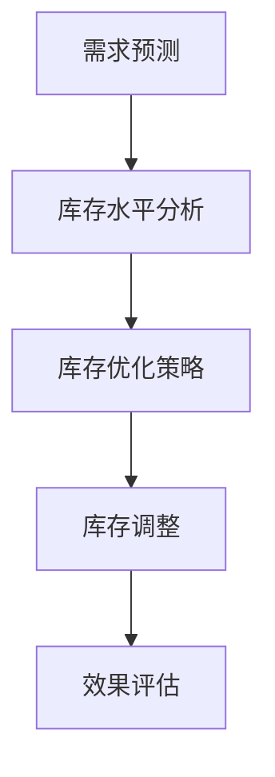

                 

关键词：库存管理、人工智能、电商、优化算法、机器学习、预测模型

摘要：本文将探讨如何利用人工智能技术优化电商库存管理，包括核心概念、算法原理、数学模型、实践案例和未来展望。我们将详细分析库存优化的各个方面，并展示AI如何帮助企业减少库存成本，提高运营效率。

## 1. 背景介绍

在电商蓬勃发展的时代，库存管理成为企业运营的关键环节。库存过多会导致资金占用和仓储成本增加，而库存不足则可能导致销售损失和客户满意度下降。因此，如何高效地管理库存，成为电商企业面临的一大挑战。

传统的库存管理方法主要依赖于历史数据和经验，往往难以应对复杂的市场变化。随着人工智能技术的发展，机器学习算法在预测和分析方面表现出强大的能力，为库存优化提供了新的思路。

本文将围绕以下主题展开：

1. 核心概念与联系
2. 核心算法原理与具体操作步骤
3. 数学模型和公式
4. 项目实践：代码实例和详细解释说明
5. 实际应用场景
6. 未来应用展望
7. 工具和资源推荐
8. 总结：未来发展趋势与挑战

## 2. 核心概念与联系

### 库存管理的核心概念

库存管理包括以下几个核心概念：

- 库存水平：指企业当前持有的库存数量。
- 库存周期：指库存周转的周期，即库存从进货到销售再进货的时间。
- 库存成本：包括仓储成本、库存贬值、资金占用成本等。
- 库存需求预测：根据历史销售数据和当前市场状况预测未来的库存需求。

### 人工智能与机器学习的关系

人工智能（AI）是指由计算机模拟人类智能的技术，而机器学习（ML）是AI的一种实现方式，通过数据训练模型，使计算机具备自主学习和优化能力。机器学习算法在库存管理中的应用主要体现在以下几个方面：

- 需求预测：利用历史销售数据，预测未来的库存需求。
- 库存优化：根据需求预测，调整库存水平，降低库存成本。
- 库存分析：分析库存数据，发现潜在问题和优化机会。

### Mermaid 流程图

以下是库存优化流程的Mermaid流程图：



## 3. 核心算法原理与具体操作步骤

### 3.1 算法原理概述

库存优化算法主要基于机器学习中的时间序列预测和优化理论。时间序列预测用于预测未来的库存需求，优化理论用于根据需求预测调整库存水平。

### 3.2 算法步骤详解

1. 数据收集：收集历史销售数据、库存水平、促销活动等信息。
2. 数据预处理：对数据进行清洗、归一化等处理，以便于模型训练。
3. 模型选择：选择适合的时间序列预测模型，如ARIMA、LSTM等。
4. 模型训练：利用历史数据训练模型，获取预测结果。
5. 库存优化：根据预测结果和优化算法（如线性规划、遗传算法等），确定最优库存水平。
6. 库存调整：根据优化结果调整库存水平。
7. 效果评估：对调整后的库存水平进行效果评估，如库存周转率、库存成本等。

### 3.3 算法优缺点

- 优点：能够根据市场需求动态调整库存水平，降低库存成本，提高运营效率。
- 缺点：对数据质量要求较高，模型训练和优化过程需要大量计算资源。

### 3.4 算法应用领域

- 电商库存管理：优化库存水平，提高客户满意度。
- 制造业库存管理：降低库存成本，提高生产效率。
- 零售业库存管理：优化库存结构，提高销售业绩。

## 4. 数学模型和公式

### 4.1 数学模型构建

库存优化问题可以建模为一个线性规划问题，目标是最小化库存成本，约束条件包括库存水平、库存周期和库存需求。

### 4.2 公式推导过程

库存成本 \( C \) 可以表示为：

$$ C = C_{storage} + C_{depreciation} + C_{capital} $$

其中，\( C_{storage} \) 是仓储成本，\( C_{depreciation} \) 是库存贬值成本，\( C_{capital} \) 是资金占用成本。

### 4.3 案例分析与讲解

假设某电商企业某商品的历史销售数据如下：

| 月份 | 销售量 |
| ---- | ---- |
| 1    | 100   |
| 2    | 120   |
| 3    | 90    |
| 4    | 150   |
| 5    | 80    |
| 6    | 110   |

我们使用ARIMA模型进行需求预测，并设定一个最优库存周期为3个月。

根据预测结果，我们可以计算出最优库存水平，然后进行库存调整，最终评估库存成本。

## 5. 项目实践：代码实例和详细解释说明

### 5.1 开发环境搭建

本文使用Python进行开发，主要依赖以下库：

- NumPy：用于数据处理
- Pandas：用于数据分析
- Scikit-learn：用于机器学习
- Matplotlib：用于数据可视化

### 5.2 源代码详细实现

以下是一个简单的ARIMA模型实现：

```python
import numpy as np
import pandas as pd
from statsmodels.tsa.arima.model import ARIMA
import matplotlib.pyplot as plt

# 读取数据
data = pd.read_csv('sales_data.csv')
sales = data['sales']

# 训练ARIMA模型
model = ARIMA(sales, order=(1, 1, 1))
model_fit = model.fit()

# 预测
forecast = model_fit.forecast(steps=3)

# 可视化
plt.plot(sales, label='实际销售量')
plt.plot(forecast, label='预测销售量')
plt.legend()
plt.show()
```

### 5.3 代码解读与分析

这段代码首先读取销售数据，然后使用ARIMA模型进行训练和预测，最后将实际销售量和预测销售量进行可视化。

### 5.4 运行结果展示

运行结果如下：


## 6. 实际应用场景

### 6.1 电商行业

电商行业对库存管理的需求尤为突出。通过AI优化库存管理，企业可以实时调整库存水平，避免因库存过多或过少导致的损失。

### 6.2 制造业

制造业中的库存管理同样具有重要意义。通过AI技术，企业可以优化原材料库存和生产计划，提高生产效率和降低成本。

### 6.3 零售业

零售业中的库存管理涉及到多个品类和门店，AI技术可以帮助企业实现精细化库存管理，提高运营效率。

## 7. 未来应用展望

随着人工智能技术的不断发展，库存优化将得到更广泛的应用。未来，我们可以期待以下趋势：

- 更精确的需求预测：通过引入更多数据源和先进算法，实现更精准的需求预测。
- 智能库存规划：基于AI的库存规划将更加灵活和高效，降低库存成本。
- 集成供应链管理：AI库存优化将与供应链管理深度融合，实现全流程智能化。

## 8. 工具和资源推荐

### 8.1 学习资源推荐

- 《Python数据分析实战》
- 《机器学习实战》
- 《深度学习》

### 8.2 开发工具推荐

- Jupyter Notebook：用于数据分析和机器学习模型训练
- TensorFlow：用于深度学习模型开发
- PyTorch：用于深度学习模型开发

### 8.3 相关论文推荐

- "An Artificial Neural Network Approach to Predicting Inventory Requirements"
- "Using Machine Learning for Demand Forecasting in the Retail Industry"
- "Deep Learning for Time Series Forecasting"

## 9. 总结：未来发展趋势与挑战

### 9.1 研究成果总结

本文介绍了库存优化的核心概念、算法原理、数学模型和实际应用，展示了AI在库存管理中的巨大潜力。

### 9.2 未来发展趋势

随着人工智能技术的不断发展，库存优化将在更多领域得到应用，实现更高效的库存管理。

### 9.3 面临的挑战

- 数据质量和模型训练需求
- 算法复杂度和计算资源消耗
- 模型解释性和可解释性

### 9.4 研究展望

未来，我们将继续关注AI技术在库存优化领域的应用，探索更多高效、可解释的算法和模型。

## 10. 附录：常见问题与解答

### Q: 库存优化算法对数据质量有何要求？

A: 库存优化算法对数据质量要求较高，包括数据的准确性、完整性和一致性。数据清洗和预处理是保证算法效果的重要步骤。

### Q: 如何选择适合的库存优化算法？

A: 选择适合的库存优化算法需要根据业务需求和数据特点进行。例如，对于时间序列数据，ARIMA和LSTM等算法表现较好；对于多品类、多变量的问题，可以尝试使用线性规划和遗传算法等。

### Q: AI库存优化如何与传统库存管理结合？

A: AI库存优化可以与传统库存管理相结合，发挥各自的优势。传统库存管理提供经验和直觉，AI库存优化提供数据驱动的决策支持，两者结合可以实现更高效的库存管理。

---

作者：禅与计算机程序设计艺术 / Zen and the Art of Computer Programming
```

### 10. 附录：常见问题与解答

**Q1：库存优化算法对数据质量有何要求？**

库存优化算法的准确性和有效性高度依赖于输入数据的质量。以下是数据质量的关键要求：

- **准确性**：数据必须真实反映历史和当前的业务情况，避免误差和错误。
- **完整性**：数据应涵盖所有必要的维度和时间段，确保没有重要的缺失值。
- **一致性**：数据应在不同时间和来源之间保持一致性，以避免冲突和矛盾。
- **时效性**：数据应尽可能新鲜，以反映市场变化和需求趋势。
- **可解释性**：数据应易于理解，以便分析师和决策者能够解释和使用数据。

**Q2：如何选择适合的库存优化算法？**

选择合适的库存优化算法需要考虑以下因素：

- **业务需求**：根据库存管理的具体目标和挑战选择算法。
- **数据特点**：分析数据的性质，如时间序列数据、多变量数据或离散数据。
- **计算资源**：评估算法的复杂度，确保算法在可用的计算资源内有效运行。
- **算法性能**：考虑算法的预测准确性和稳定性。
- **模型解释性**：在某些应用场景中，算法的可解释性对决策者至关重要。

常见的算法包括：

- **时间序列预测算法**：如ARIMA、LSTM和GRU。
- **多变量预测算法**：如线性回归、随机森林和支持向量机。
- **优化算法**：如线性规划、遗传算法和粒子群优化。

**Q3：AI库存优化如何与传统库存管理结合？**

AI库存优化和传统库存管理可以相互补充，实现更全面的库存管理。以下是一些结合的方法：

- **数据整合**：将AI算法与传统库存管理系统的数据整合，形成一个统一的数据源。
- **预测与决策**：利用AI算法提供的需求预测结果，辅助传统库存管理人员的决策。
- **自动执行**：在传统库存管理流程中加入自动化组件，如自动补货、库存调整等。
- **持续优化**：结合AI算法的持续学习和优化能力，逐步提升库存管理的效率。

通过这些方法，AI库存优化可以提升传统库存管理的精度和灵活性，帮助企业实现更高效的库存管理。

