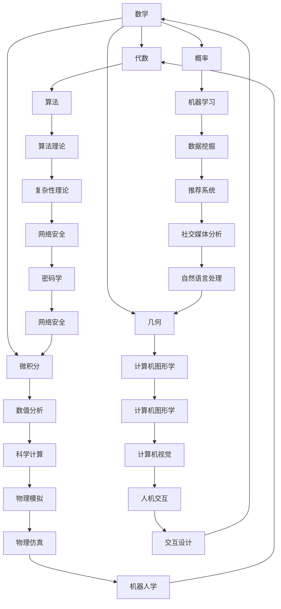

                 

在现代社会，技术飞速发展，人工智能、大数据、云计算等前沿领域不断涌现，这使得对底层能力的培养愈发重要。本文将围绕数学、物理和计算机三个领域，探讨如何培养这些底层能力，以便在技术领域中取得成功。

## 1. 背景介绍

### 数学

数学是一门基础科学，它不仅为自然科学和工程技术提供了语言和工具，还推动了科学方法论的发展。数学家们通过研究数学模型，揭示了自然界的规律，推动了科学技术的进步。

### 物理

物理学研究物质的基本结构和运动规律，它为我们理解世界提供了物理定律和实验方法。物理学的发展，如量子力学、相对论等，为现代科技的发展奠定了基础。

### 计算机

计算机科学是一门研究计算机系统及其应用的学科。随着计算机技术的不断发展，计算机科学已经深入到社会的各个方面，成为现代科技的核心。

## 2. 核心概念与联系

为了更好地理解这三个领域，我们需要了解它们的核心概念和它们之间的联系。

### 数学

数学的核心概念包括代数、几何、微积分、概率等。这些概念构成了数学的基础，它们在计算机科学和物理学中都有着广泛的应用。

### 物理

物理的核心概念包括力学、电磁学、热力学、量子力学等。这些概念揭示了自然界的规律，为计算机科学的发展提供了理论基础。

### 计算机

计算机的核心概念包括算法、数据结构、计算机体系结构、操作系统等。这些概念是计算机科学的基础，它们在数学和物理学中也有着重要的应用。

### Mermaid 流程图

以下是一个简单的 Mermaid 流程图，展示了数学、物理和计算机之间的核心概念和联系。



## 3. 核心算法原理 & 具体操作步骤

### 3.1 算法原理概述

在计算机科学中，算法是解决问题的方法。一个有效的算法应该能够在合理的时间内找到问题的解。

### 3.2 算法步骤详解

一个基本的算法通常包括以下几个步骤：

1. **输入**：接收输入数据。
2. **处理**：对输入数据进行操作。
3. **输出**：输出处理结果。

### 3.3 算法优缺点

算法的优缺点取决于具体的应用场景。例如，快速排序算法在处理大量数据时表现优异，但在数据量较小时，其性能可能不如插入排序。

### 3.4 算法应用领域

算法在计算机科学的各个领域都有广泛的应用，如排序算法在数据库管理系统中，图算法在社交网络分析中，机器学习算法在数据挖掘中。

## 4. 数学模型和公式

### 4.1 数学模型构建

数学模型是现实世界问题的数学表示。构建数学模型的关键在于准确描述现实世界中的问题，并用数学语言表达出来。

### 4.2 公式推导过程

公式的推导过程是数学模型的核心。它要求我们运用数学知识和技巧，从已知条件推导出未知量。

### 4.3 案例分析与讲解

以下是一个简单的案例：求解一元二次方程的解。

```latex
\begin{align*}
ax^2 + bx + c = 0 \\
x = \frac{-b \pm \sqrt{b^2 - 4ac}}{2a}
\end{align*}
```

## 5. 项目实践：代码实例

### 5.1 开发环境搭建

在开始项目实践之前，我们需要搭建一个开发环境。这里我们选择 Python 作为编程语言，因为它的易用性和强大的库支持。

### 5.2 源代码详细实现

以下是一个简单的 Python 代码实例，实现了快速排序算法。

```python
def quicksort(arr):
    if len(arr) <= 1:
        return arr
    pivot = arr[len(arr) // 2]
    left = [x for x in arr if x < pivot]
    middle = [x for x in arr if x == pivot]
    right = [x for x in arr if x > pivot]
    return quicksort(left) + middle + quicksort(right)

arr = [3, 6, 8, 10, 1, 2, 1]
print(quicksort(arr))
```

### 5.3 代码解读与分析

这段代码实现了快速排序算法。它首先判断输入数组是否只有一个元素，如果是，则直接返回数组。如果不是，则选择中间元素作为基准（pivot），然后分别将数组分为小于 pivot 的 left、等于 pivot 的 middle 和大于 pivot 的 right。最后，递归地对 left 和 right 进行快速排序，并将结果与 middle 合并。

### 5.4 运行结果展示

运行上述代码，输出结果为 `[1, 1, 2, 3, 6, 8, 10]`，即输入数组已成功排序。

## 6. 实际应用场景

### 6.1 数据库管理

快速排序算法在数据库管理系统中用于对数据进行排序和查找。

### 6.2 社交网络分析

图算法在社交网络分析中用于分析用户之间的关系。

### 6.3 数据挖掘

机器学习算法在数据挖掘中用于发现数据中的模式。

## 7. 工具和资源推荐

### 7.1 学习资源推荐

- 《深度学习》（Deep Learning） - Goodfellow, Bengio, Courville
- 《算法导论》（Introduction to Algorithms） - Cormen, Leiserson, Rivest, Stein
- 《计算机程序设计艺术》（The Art of Computer Programming） - Knuth

### 7.2 开发工具推荐

- Jupyter Notebook
- PyCharm
- Visual Studio Code

### 7.3 相关论文推荐

- "A Few Useful Things to Know about Machine Learning" - Pedro Domingos
- "The Hundred-Page Machine Learning Book" - Andriy Burkov

## 8. 总结

### 8.1 研究成果总结

本文介绍了如何培养数学、物理和计算机领域的底层能力。通过深入理解核心概念和算法原理，以及实际项目实践，我们可以提升自己的技术水平。

### 8.2 未来发展趋势

随着科技的不断发展，数学、物理和计算机领域的交叉融合将更加紧密。未来的研究将集中在如何更好地利用这些底层能力，推动科技的发展。

### 8.3 面临的挑战

尽管我们已经取得了许多成果，但在数学、物理和计算机领域仍然面临着许多挑战，如算法的效率、大数据的处理、量子计算的实现等。

### 8.4 研究展望

未来，我们将继续深入研究这些领域，探索新的算法和理论，以推动科技的发展。

## 9. 附录：常见问题与解答

### 9.1 如何选择合适的算法？

选择合适的算法需要根据具体问题进行综合考虑。例如，对于排序问题，快速排序在处理大量数据时表现优异，而对于小规模数据，插入排序可能更合适。

### 9.2 数学模型在计算机科学中的应用有哪些？

数学模型在计算机科学中的应用非常广泛，如计算机图形学中的几何模型，机器学习中的概率模型，以及算法分析中的时间复杂度和空间复杂度模型等。

作者：禅与计算机程序设计艺术 / Zen and the Art of Computer Programming
----------------------------------------------------------------


