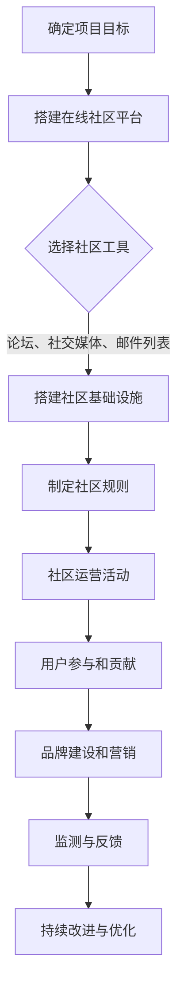

                 

关键词：开源项目、在线社区、社区运营、品牌建设、用户参与、技术交流、活动策划、社群营销、影响力拓展、可持续发展

> 摘要：本文将探讨如何成功建立和维护一个开源项目的在线社区，强调社区运营和品牌建设的重要性。通过分析社区的核心价值、运营策略、活动策划、品牌影响力及可持续发展，为开源项目提供实用的指导和实践建议。

## 1. 背景介绍

开源项目已经成为现代软件开发的重要组成部分，它们不仅推动了技术的创新和进步，还促进了全球开发者的合作与交流。一个成功的开源项目往往拥有一个活跃的在线社区，这不仅能够吸引更多的贡献者，还能够提升项目的知名度和影响力。然而，建立和维护这样一个社区并非易事，需要精心策划和持续运营。

### 1.1 开源项目的重要性

开源项目通过开放源代码，允许任何人查看、修改和分发，从而极大地促进了技术的创新和传播。它们提供了一个共享和协作的平台，让全球的开发者能够共同解决问题、优化代码、推动技术发展。

### 1.2 在线社区的角色

在线社区是开源项目的生命线。它们不仅是项目代码的交流平台，更是开发者之间建立联系、分享经验、寻求帮助的场所。一个健康、活跃的社区能够吸引更多开发者参与，提升项目的质量，并增加项目的可持续性。

### 1.3 社区运营和品牌建设的重要性

社区运营和品牌建设对于开源项目至关重要。良好的社区运营能够提升用户体验，增强用户忠诚度，促进用户参与和贡献。而有效的品牌建设则能够提高项目的知名度，吸引更多开发者关注，为项目带来持续的关注和支持。

## 2. 核心概念与联系

为了更好地理解开源项目在线社区的建立和运营，我们需要明确几个核心概念：

- **开源项目**：开放源代码的软件项目，允许用户自由使用、学习、修改和分发。
- **在线社区**：通过互联网平台（如论坛、社交媒体、邮件列表等）建立的互动社区，用于开发者之间的交流、协作和分享。
- **社区运营**：管理和维护在线社区的活动，包括内容发布、用户管理、问题解答、活动策划等。
- **品牌建设**：通过营销策略和活动来提升项目的知名度和影响力，建立项目在开发者和用户中的良好形象。

以下是建立和维护开源项目在线社区的一个简要 Mermaid 流程图：



## 3. 核心算法原理 & 具体操作步骤

### 3.1 算法原理概述

开源项目在线社区的运营和品牌建设需要基于一系列的核心算法原理。这些原理包括用户行为分析、内容推荐算法、社交网络分析等。通过这些算法，可以更有效地管理和运营社区，提高用户体验和用户参与度。

### 3.2 算法步骤详解

#### 3.2.1 用户行为分析

- 收集用户数据：通过日志分析、用户反馈等方式收集用户行为数据。
- 数据预处理：清洗和整理用户数据，为后续分析做好准备。
- 用户行为分析：使用机器学习算法分析用户行为，识别用户兴趣和需求。
- 用户画像构建：基于分析结果构建用户画像，用于个性化推荐和营销。

#### 3.2.2 内容推荐算法

- 内容分类：将社区中的内容按照主题、标签等进行分类。
- 用户偏好分析：基于用户行为和反馈，分析用户的偏好。
- 内容推荐：使用协同过滤或基于内容的推荐算法，向用户推荐感兴趣的内容。

#### 3.2.3 社交网络分析

- 社交网络构建：基于用户之间的关系构建社交网络图。
- 关键节点识别：识别社交网络中的关键节点，如意见领袖、活跃用户等。
- 社交影响力分析：分析用户在社交网络中的影响力，用于社区管理和品牌营销。

### 3.3 算法优缺点

- **用户行为分析**：优点在于能够深入了解用户需求和行为模式，提高用户体验；缺点是数据收集和处理可能涉及隐私问题，需要严格保护用户数据。
- **内容推荐算法**：优点是能够提高用户参与度和粘性，缺点是推荐结果的准确性和多样性需要不断优化。
- **社交网络分析**：优点是能够识别关键用户和影响力，缺点是社交网络的复杂性和动态性使得分析结果可能存在偏差。

### 3.4 算法应用领域

- **社区运营**：通过用户行为分析和内容推荐，提高社区活跃度和用户满意度。
- **品牌建设**：通过社交网络分析，识别和利用意见领袖，扩大品牌影响力。
- **市场营销**：利用用户画像和推荐算法，实现精准营销和用户增长。

## 4. 数学模型和公式 & 详细讲解 & 举例说明

### 4.1 数学模型构建

在开源项目在线社区的运营和品牌建设中，我们可以构建以下数学模型：

- **用户活跃度模型**：用户活跃度 = f(用户互动次数，用户参与度，用户反馈质量)
- **品牌影响力模型**：品牌影响力 = f(用户参与度，社交网络影响力，活动效果)
- **推荐算法模型**：推荐评分 = f(内容相似度，用户偏好，历史行为)

### 4.2 公式推导过程

- **用户活跃度模型**：

  用户活跃度 = (用户互动次数 × 用户参与度) / (用户反馈质量 + 1)

- **品牌影响力模型**：

  品牌影响力 = (用户参与度 × 社交网络影响力) / (活动效果 + 1)

- **推荐算法模型**：

  推荐评分 = (内容相似度 × 用户偏好) / (历史行为 + 1)

### 4.3 案例分析与讲解

假设我们有一个开源项目，其在线社区有以下数据：

- 用户互动次数：100次
- 用户参与度：0.8
- 用户反馈质量：10条
- 社交网络影响力：1000
- 活动效果：0.9

我们可以使用上述公式计算用户活跃度和品牌影响力：

- **用户活跃度**：

  用户活跃度 = (100 × 0.8) / (10 + 1) = 80 / 11 ≈ 7.27

- **品牌影响力**：

  品牌影响力 = (0.8 × 1000) / (0.9 + 1) = 800 / 1.9 ≈ 418.92

通过这个例子，我们可以看到用户活跃度和品牌影响力是如何通过数学模型进行计算和评估的。

## 5. 项目实践：代码实例和详细解释说明

### 5.1 开发环境搭建

为了实践开源项目在线社区的运营和品牌建设，我们可以使用以下开发环境和工具：

- 开源社区平台：GitLab、GitHub、Discourse
- 前端框架：React、Vue.js
- 后端框架：Node.js、Django
- 数据库：MySQL、PostgreSQL
- 持续集成/部署：Jenkins、Travis CI

### 5.2 源代码详细实现

在本节中，我们将介绍如何使用 React 和 Node.js 实现一个简单的开源项目在线社区前端和后端。

#### 5.2.1 前端实现

使用 React 创建前端项目：

```bash
npx create-react-app community-platform
cd community-platform
```

安装必要的依赖：

```bash
npm install axios react-router-dom
```

创建以下组件：

- `Header.js`：页面的顶部导航栏。
- `Footer.js`：页面的底部版权信息。
- `Home.js`：主页，展示项目介绍和最新动态。
- `Profile.js`：用户个人页面，展示用户信息、参与项目和贡献。
- `Discussion.js`：讨论区，展示帖子列表和回复。

#### 5.2.2 后端实现

使用 Node.js 创建后端服务器：

```bash
mkdir server && cd server
npm init -y
npm install express jsonwebtoken bcryptjs cors
```

创建以下文件：

- `server.js`：后端服务器入口文件。
- `auth.js`：认证相关路由和逻辑。
- `users.js`：用户相关路由和逻辑。
- `projects.js`：项目相关路由和逻辑。

实现基本的认证和用户管理功能：

```javascript
// server.js
const express = require('express');
const authRoutes = require('./auth');
const projectRoutes = require('./projects');
const app = express();

app.use(cors());
app.use(express.json());

app.use('/auth', authRoutes);
app.use('/projects', projectRoutes);

const PORT = process.env.PORT || 5000;
app.listen(PORT, () => {
  console.log(`Server is running on port ${PORT}`);
});
```

### 5.3 代码解读与分析

在前端代码中，我们使用了 React 组件化开发，通过 `create-react-app` 脚手架快速搭建项目。`Header` 和 `Footer` 组件分别负责页面顶部和底部的布局，`Home` 组件展示项目介绍和最新动态，`Profile` 组件展示用户个人资料和贡献，`Discussion` 组件用于帖子列表和回复。

在后端代码中，我们使用了 Node.js 和 Express 框架搭建服务器，并实现了认证和用户管理功能。通过 `jsonwebtoken` 和 `bcryptjs` 实现用户认证，通过 `cors` 中间件处理跨域请求。

### 5.4 运行结果展示

运行前端和后端服务器，访问本地开发地址：

```bash
npm start
```

在浏览器中访问 `http://localhost:3000`，可以看到项目的在线社区界面。通过注册和登录，用户可以浏览项目、参与讨论，以及管理个人资料。

## 6. 实际应用场景

开源项目在线社区在多个领域都有广泛的应用：

- **软件开发**：开发者通过社区交流技术问题、分享代码和最佳实践，提升项目质量和开发效率。
- **科研合作**：科研团队通过社区共享研究成果、讨论科研问题，加速科研进度和创新。
- **产品迭代**：产品经理和用户通过社区互动，收集用户反馈、优化产品功能，提升用户体验。

### 6.1 开源项目社区运营案例

以 GitHub 为例，GitHub 作为一个全球最大的开源社区平台，其成功的社区运营策略包括：

- **用户参与**：通过 Issue 和 Pull Request，鼓励用户参与代码贡献和项目讨论。
- **社区活动**：定期举办 Code Sprint、Hackathon 等活动，激发开发者热情和创造力。
- **品牌推广**：通过 GitHub Sponsor、GitHub Sponsors 等功能，支持开源项目，提升项目品牌影响力。

### 6.2 开源项目品牌建设案例

以 Kubernetes 为例，Kubernetes 通过以下策略建立了强大的品牌影响力：

- **技术引领**：持续推出新功能和优化，引领容器化和微服务技术潮流。
- **社区合作**：与云服务提供商、开源基金会等合作，共同推广 Kubernetes。
- **市场推广**：通过线上和线下活动、媒体报道等方式，提升 Kubernetes 的知名度。

## 6.3 未来应用展望

随着技术的不断进步和开源文化的普及，开源项目在线社区将在以下几个方面取得更大发展：

- **智能化运营**：利用人工智能和大数据技术，实现更智能的社区运营和用户服务。
- **跨平台整合**：整合多种社区工具和平台，提供一站式服务，提升用户体验。
- **全球合作**：推动全球开源项目的合作与交流，促进技术的全球化发展。

## 7. 工具和资源推荐

### 7.1 学习资源推荐

- 《开源项目管理与社区建设》
- 《社交网络分析：方法与应用》
- 《推荐系统实战》

### 7.2 开发工具推荐

- GitLab
- GitHub
- Discourse
- Docker
- Kubernetes

### 7.3 相关论文推荐

- "The Cathedral and the Bazaar" by Eric S. Raymond
- "Building Successful Open Source Communities" by January 2005, IBM
- "Evaluating Recommendation Algorithms for E-Commerce" by M. Hall et al., ACM SIGKDD Explorations Newsletter

## 8. 总结：未来发展趋势与挑战

### 8.1 研究成果总结

本文探讨了开源项目在线社区的重要性，分析了社区运营和品牌建设的关键概念、算法原理和应用实践，并提出了未来发展趋势和挑战。

### 8.2 未来发展趋势

- 智能化运营和个性化服务将成为主流。
- 跨平台整合和全球化合作将促进社区发展。
- 开源文化将继续推动技术进步和创新。

### 8.3 面临的挑战

- 社区隐私和数据安全问题需要得到有效解决。
- 社区运营和维护成本高，需要持续投入。
- 社区参与度低、用户活跃度不足的问题仍然存在。

### 8.4 研究展望

未来研究应重点关注以下几个方面：

- 社区隐私保护机制的优化。
- 智能化社区运营系统的开发。
- 基于人工智能的社区推荐算法研究。

## 9. 附录：常见问题与解答

### 9.1 如何提高社区活跃度？

- 定期举办线上和线下活动，激发用户参与兴趣。
- 提供优质的内容和资源，满足用户需求。
- 优化社区交互体验，提升用户满意度。

### 9.2 如何建立社区品牌影响力？

- 引入品牌合作和赞助，提高社区知名度。
- 定期发布高质量的内容和研究成果。
- 利用社交媒体和自媒体平台进行宣传推广。

### 9.3 如何维护社区秩序和安全？

- 制定明确的社区规则和规章制度。
- 建立有效的举报和投诉机制。
- 加强社区管理员和审核员队伍建设。

---

作者：禅与计算机程序设计艺术 / Zen and the Art of Computer Programming

