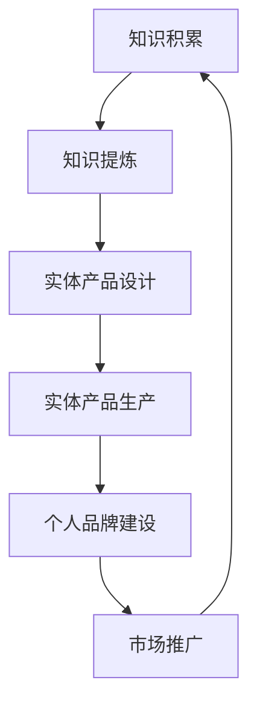

                 

关键词：个人品牌，知识变现，实体产品，知识共享，专业输出

> 摘要：在信息技术飞速发展的今天，个人品牌的重要性日益凸显。本文将探讨如何将个人的知识、技能和经验转化为实体产品，从而打造个人品牌，实现知识变现。通过详细的步骤和案例分析，我们将为您展示这一过程的可行性和潜在价值。

## 1. 背景介绍

在互联网时代，个人品牌建设成为许多专业人士追求的目标。个人品牌不仅能够提升个人在行业中的影响力，还能带来更多的商业机会和职业发展。然而，如何将个人积累的知识和经验有效地转化为实体产品，进而提升个人品牌呢？这便是本文要探讨的核心问题。

知识变现是当前社会中一个热门的概念，它指的是将个人的知识、技能和经验通过某种形式转化为可以直接交易的资产。这些资产可以是线上课程、电子书、教程视频等，也可以是实体产品，如图书、教程手册、工具软件等。通过知识变现，个人不仅可以实现收入的增加，还能扩大自己的影响力，树立专业的形象。

本文将围绕以下主题展开：

- 个人品牌建设的意义
- 如何将知识转化为实体产品
- 实体产品的类型与选择
- 知识变现的策略和实施步骤
- 成功案例分析与启示
- 未来发展趋势与挑战

## 2. 核心概念与联系

为了更好地理解如何将知识转化为实体产品，我们需要明确几个核心概念，并探讨它们之间的联系。

### 2.1 知识的构成

知识是由信息、经验和理解组成的综合体。它可以是理论知识，也可以是实践经验。对于个人来说，知识是个人积累的宝贵财富，是构建个人品牌的基础。

### 2.2 实体产品的定义

实体产品是指具有物质形态的产品，它可以通过物理方式传播和交易。与虚拟产品（如数字课程、电子书）不同，实体产品更具有收藏和展示的价值。

### 2.3 个人品牌的构成

个人品牌是个人在行业中的声誉和形象的集合体。它包括专业知识、个人形象、沟通能力、创新能力等多个方面。一个强大的个人品牌能够帮助个人在职业市场中脱颖而出。

### 2.4 知识、实体产品与个人品牌的联系

知识是构建个人品牌的基础，而实体产品则是知识的载体。通过将知识转化为实体产品，个人不仅能够更有效地传播和分享自己的知识，还能树立专业的形象，增强个人品牌。

下面是一个简化的 Mermaid 流程图，展示了知识、实体产品和个人品牌之间的联系。



## 3. 核心算法原理 & 具体操作步骤

### 3.1 算法原理概述

将知识转化为实体产品的过程，可以看作是一种信息处理和产品设计的过程。其核心算法可以概括为以下步骤：

1. **知识梳理**：对个人积累的知识进行梳理和分类，明确知识的核心内容和适用场景。
2. **产品设计**：根据梳理的知识，设计相应的实体产品，包括内容框架、形式和载体。
3. **内容创作**：围绕产品设计的框架，创作具体的内容，包括文字、图片、视频等多种形式。
4. **产品制作**：将创作的内容制作成实体产品，如图书、教程手册等。
5. **品牌建设**：通过产品销售和市场推广，逐步建立个人品牌，提升个人影响力。

### 3.2 算法步骤详解

#### 3.2.1 知识梳理

知识梳理是整个过程的起点。具体步骤如下：

1. **收集信息**：通过文献阅读、实践经验、与他人交流等方式，收集与主题相关的信息。
2. **筛选信息**：对收集到的信息进行筛选，保留核心内容，删除无关或重复的信息。
3. **分类整理**：将筛选后的信息进行分类整理，明确各个部分的内容和结构。

#### 3.2.2 产品设计

产品设计是知识转化为实体产品的关键步骤。具体步骤如下：

1. **确定主题**：根据梳理的知识，确定实体产品的主题，如图书、教程手册等。
2. **设计框架**：围绕主题，设计产品的内容框架，包括章节、模块、知识点等。
3. **选择形式**：根据产品的主题和框架，选择合适的形式，如纸质书、电子书、视频教程等。
4. **选择载体**：根据产品的形式，选择合适的载体，如纸张、电子设备等。

#### 3.2.3 内容创作

内容创作是知识转化为实体产品的核心步骤。具体步骤如下：

1. **撰写内容**：根据产品设计的框架，撰写具体的内容，包括文字、图片、视频等。
2. **编辑整理**：对撰写的内容进行编辑整理，确保内容的准确性、完整性和连贯性。
3. **审核校对**：对编辑整理后的内容进行审核校对，确保内容的准确无误。

#### 3.2.4 产品制作

产品制作是将内容转化为实体产品的过程。具体步骤如下：

1. **设计封面**：根据产品的主题和内容，设计产品的封面。
2. **排版印刷**：将内容按照封面设计进行排版，并选择合适的印刷厂进行印刷。
3. **后期制作**：对印刷后的产品进行后期制作，如装订、包装等。

#### 3.2.5 品牌建设

品牌建设是知识转化为实体产品后的延续。具体步骤如下：

1. **产品销售**：通过线上线下渠道，将产品销售给目标用户。
2. **市场推广**：通过社交媒体、广告、活动等方式，推广个人品牌和产品。
3. **用户反馈**：收集用户反馈，优化产品和服务，提升用户满意度。
4. **持续更新**：根据市场变化和用户需求，持续更新产品内容和品牌形象。

### 3.3 算法优缺点

#### 优点

1. **知识传播效率高**：通过实体产品，知识可以更广泛、更有效地传播。
2. **品牌形象塑造强**：实体产品是个人品牌的直观体现，有助于提升个人在行业中的影响力。
3. **收益稳定**：实体产品可以反复销售，带来稳定的收益。

#### 缺点

1. **前期投入大**：实体产品的制作和推广需要较大的资金和人力资源投入。
2. **更新维护难**：实体产品一旦制作完成，更新和维护相对困难。

### 3.4 算法应用领域

1. **专业出版**：如技术书籍、专业手册等。
2. **教育培训**：如教程视频、教学工具等。
3. **创新创业**：如创新产品的研发和推广等。

## 4. 数学模型和公式 & 详细讲解 & 举例说明

### 4.1 数学模型构建

在将知识转化为实体产品的过程中，我们可以构建一个简单的数学模型来描述这个过程。该模型主要考虑以下几个变量：

- \(K\)：知识量
- \(P\)：产品数量
- \(M\)：市场接受度
- \(R\)：收益

根据这个模型，我们可以得到以下关系：

\[ R = P \times M \times K \]

其中：

- \(R\)：收益，表示通过知识转化为实体产品获得的收益。
- \(P\)：产品数量，表示制作的实体产品的数量。
- \(M\)：市场接受度，表示实体产品在市场中的受欢迎程度。
- \(K\)：知识量，表示个人拥有的知识量。

### 4.2 公式推导过程

根据上述模型，我们可以推导出以下几个关键公式：

1. **收益最大化**：

\[ R_{\text{max}} = \max(P \times M \times K) \]

其中，\(R_{\text{max}}\) 表示收益的最大值。

2. **市场接受度优化**：

\[ M = f(\text{品牌影响力}, \text{产品质量}, \text{市场需求}) \]

其中，\(M\) 表示市场接受度，\(f\) 表示市场接受度的函数，受品牌影响力、产品质量和市场需求的影响。

3. **知识量提升**：

\[ K = f(\text{学习投入}, \text{实践经验}, \text{创新思维}) \]

其中，\(K\) 表示知识量，\(f\) 表示知识量的函数，受学习投入、实践经验和创新思维的影响。

### 4.3 案例分析与讲解

为了更好地理解上述模型和公式，我们可以通过一个实际案例进行讲解。

假设某位技术专家拥有丰富的编程经验，他决定将这部分知识转化为实体产品，制作一本关于Python编程的教程书籍。

- \(K\)：知识量，该专家对Python编程的理解和经验。
- \(P\)：产品数量，预计制作1000册书籍。
- \(M\)：市场接受度，根据市场调查，预计市场接受度为0.8。
- \(R\)：收益，通过计算公式，\(R = P \times M \times K\)。

为了提高收益，我们可以从以下几个方面进行优化：

1. **提高市场接受度**：

   - 增加品牌影响力：通过社交媒体、博客等渠道推广个人品牌，提高知名度。
   - 提升产品质量：确保书籍内容丰富、实用，排版美观，印刷质量高。
   - 了解市场需求：收集用户反馈，根据市场需求调整书籍内容和结构。

2. **提高知识量**：

   - 持续学习：不断学习新的编程技术，丰富自己的知识储备。
   - 实践经验：通过实际项目积累经验，提升自己的编程能力。
   - 创新思维：思考如何将新的编程技术应用于实际项目中，提升自己的创新能力。

通过上述优化措施，我们可以提高市场接受度和知识量，从而提高收益。

## 5. 项目实践：代码实例和详细解释说明

### 5.1 开发环境搭建

在本文的项目实践中，我们将以Python编程为例，讲解如何将个人知识转化为实体产品。首先，我们需要搭建一个基本的Python开发环境。

1. **安装Python**：从官方网站（[https://www.python.org/](https://www.python.org/)）下载并安装Python。
2. **安装IDE**：选择一个适合自己的Python集成开发环境（IDE），如PyCharm或VSCode。
3. **安装必要库**：安装一些常用的Python库，如NumPy、Pandas等。

### 5.2 源代码详细实现

在本项目中，我们将实现一个简单的Python教程，内容包括Python基础知识、数据结构和算法等。

以下是项目的主要目录结构：

```plaintext
python_tutorial/
|-- chapters/
|   |-- 01_python_basics.py
|   |-- 02_data_structures.py
|   |-- 03_algorithms.py
|-- images/
|   |-- figure_1.png
|   |-- figure_2.png
|-- templates/
|   |-- book_template.html
|-- main.py
```

其中，`chapters/` 目录包含各个章节的Python代码文件，`images/` 目录包含相关图片，`templates/` 目录包含HTML模板文件，`main.py` 是主程序文件。

### 5.3 代码解读与分析

#### 5.3.1 章节代码

以第一章 `01_python_basics.py` 为例，以下是该章节的代码内容：

```python
# 01_python_basics.py

def print_hello():
    """打印'Hello, world!'"""
    print("Hello, world!")

def variables():
    """演示变量使用"""
    name = "Alice"
    age = 30
    print(f"Name: {name}, Age: {age}")

def control_structures():
    """演示控制结构"""
    if age < 18:
        print("未成年")
    elif age >= 18 and age < 60:
        print("成年人")
    else:
        print("老年人")

def main():
    """主函数"""
    print_hello()
    variables()
    control_structures()

if __name__ == "__main__":
    main()
```

该章节主要介绍了Python的基础知识，包括函数、变量、控制结构等。通过简单的示例代码，读者可以快速了解Python的基本语法和用法。

#### 5.3.2 主程序

主程序 `main.py` 负责将各个章节的内容整合起来，生成完整的教程。以下是主程序的主要代码：

```python
# main.py

import os
from jinja2 import Environment, FileSystemLoader

# 加载模板
env = Environment(loader=FileSystemLoader('templates'))
template = env.get_template('book_template.html')

# 获取章节内容
chapters = []
for filename in os.listdir('chapters'):
    if filename.endswith('.py'):
        with open(os.path.join('chapters', filename), 'r') as f:
            chapters.append(f.read())

# 生成HTML内容
content = template.render(chapters=chapters)

# 写入HTML文件
with open('python_tutorial.html', 'w') as f:
    f.write(content)
```

主程序使用Jinja2模板引擎，将各个章节的内容整合到一个HTML文件中。通过简单的配置，我们可以方便地生成完整的教程。

#### 5.3.3 代码分析

1. **模板引擎**：Jinja2是一个流行的模板引擎，用于生成动态HTML内容。通过简单的配置，我们可以将Python代码和模板文件整合在一起，生成最终的HTML文件。
2. **文件操作**：主程序使用Python的文件操作功能，读取各个章节的代码文件，并将它们整合到一个列表中。然后，通过模板引擎将列表内容替换到模板文件中，生成最终的HTML文件。
3. **生成HTML文件**：生成的HTML文件包含完整的教程内容，读者可以通过浏览器直接查看。

### 5.4 运行结果展示

运行主程序 `main.py` 后，会生成一个名为 `python_tutorial.html` 的HTML文件。以下是运行结果的一个简略展示：

```html
<!DOCTYPE html>
<html lang="en">
<head>
    <meta charset="UTF-8">
    <title>Python教程</title>
</head>
<body>
    <h1>Python教程</h1>
    <h2>第一章：Python基础知识</h2>
    <pre>
def print_hello():
    """打印'Hello, world!'"""
    print("Hello, world!")

def variables():
    """演示变量使用"""
    name = "Alice"
    age = 30
    print(f"Name: {name}, Age: {age}")

def control_structures():
    """演示控制结构"""
    if age < 18:
        print("未成年")
    elif age >= 18 and age < 60:
        print("成年人")
    else:
        print("老年人")

def main():
    """主函数"""
    print_hello()
    variables()
    control_structures()

if __name__ == "__main__":
    main()
    </pre>
    ...
</body>
</html>
```

## 6. 实际应用场景

将知识转化为实体产品在许多领域都有广泛的应用，以下是一些具体的实际应用场景：

### 6.1 教育培训

在教育领域，个人可以将自己的教学经验和知识转化为实体产品，如编写教材、制作教学视频、设计课程教程等。这些产品可以帮助学生更好地掌握知识和技能，提高教学效果。

### 6.2 专业咨询

在专业咨询领域，个人可以将自己的专业知识和实践经验转化为实体产品，如撰写专业报告、制作案例分析视频、编写工具软件等。这些产品可以为客户提供有价值的参考和解决方案。

### 6.3 创新技术

在技术创新领域，个人可以将自己的研究成果和创新思路转化为实体产品，如撰写技术论文、制作创新项目报告、设计新产品等。这些产品不仅能够展示个人的技术实力，还能为行业带来新的发展方向。

### 6.4 市场推广

在市场推广领域，个人可以将自己的市场洞察和推广策略转化为实体产品，如编写营销手册、制作广告视频、设计品牌形象等。这些产品可以帮助企业或个人提升市场知名度和竞争力。

## 7. 工具和资源推荐

为了有效地将知识转化为实体产品，以下是一些推荐的工具和资源：

### 7.1 学习资源推荐

- **Coursera**：提供大量的在线课程，涵盖各个领域。
- **edX**：由哈佛大学和麻省理工学院合作创办，提供高质量的课程。
- **Khan Academy**：提供免费的在线教育资源，涵盖数学、科学等多个领域。

### 7.2 开发工具推荐

- **PyCharm**：流行的Python集成开发环境（IDE），适合编写Python代码。
- **Visual Studio Code**：功能强大的开源IDE，适用于多种编程语言。
- **Jinja2**：流行的Python模板引擎，用于生成动态HTML内容。

### 7.3 相关论文推荐

- **"A Survey on Personal Branding in the Digital Age"**：探讨了数字时代个人品牌建设的重要性。
- **"Knowledge Management and Personal Branding"**：分析了知识管理在个人品牌建设中的作用。
- **"The Role of Digital Technologies in Personal Branding"**：探讨了数字技术对个人品牌建设的影响。

## 8. 总结：未来发展趋势与挑战

随着互联网和信息技术的不断发展，个人品牌建设的重要性日益凸显。未来，个人品牌建设将呈现以下发展趋势：

### 8.1 研究成果总结

- **知识共享**：随着知识共享平台的兴起，个人将更方便地获取和分享知识。
- **数字营销**：数字营销技术将帮助个人更精准地推广个人品牌和产品。
- **技术融合**：技术与商业的融合将推动个人品牌建设向更高效、更智能的方向发展。

### 8.2 未来发展趋势

- **个性化**：个人品牌建设将更加注重个性化，满足不同用户的需求。
- **平台化**：个人品牌建设将依托于各类平台，实现更广泛的传播和推广。
- **可持续发展**：个人品牌建设将更加注重长期发展，实现可持续的商业价值。

### 8.3 面临的挑战

- **竞争激烈**：随着个人品牌建设的普及，市场竞争将越来越激烈。
- **创新能力**：持续创新是保持个人品牌活力的重要手段，挑战在于如何不断创新。
- **时间管理**：个人品牌建设需要投入大量的时间和精力，如何合理安排时间和资源是一个挑战。

### 8.4 研究展望

未来，个人品牌建设的研究将更加深入，探索如何更好地将个人知识、技能和经验转化为实体产品，实现知识变现。同时，研究将关注如何通过数字技术和平台，提升个人品牌建设的效率和质量。

## 9. 附录：常见问题与解答

### 9.1 问题1：如何确保实体产品的质量？

**解答**：确保实体产品的质量需要从以下几个方面入手：

- **内容审核**：在制作实体产品前，对内容进行严格的审核，确保内容的准确性和完整性。
- **专业设计**：聘请专业的设计团队，确保实体产品的外观设计和排版美观、易读。
- **质量控制**：选择有信誉的印刷厂，确保实体产品的印刷质量和后期制作质量。

### 9.2 问题2：如何推广实体产品？

**解答**：推广实体产品可以从以下几个方面进行：

- **社交媒体**：利用社交媒体平台（如微博、微信、Facebook等）进行宣传和推广。
- **线上线下结合**：结合线上线下渠道，如电商平台、线下活动等，扩大产品的覆盖范围。
- **内容营销**：通过撰写高质量的内容，吸引潜在用户，提高产品知名度。

### 9.3 问题3：如何持续更新实体产品？

**解答**：持续更新实体产品需要：

- **定期更新**：定期对实体产品进行内容更新，保持产品的新鲜度和吸引力。
- **用户反馈**：收集用户反馈，了解用户需求，根据用户需求调整产品内容和结构。
- **技术创新**：关注行业动态，引入新技术，提升产品的技术含量和竞争力。

## 结语

在信息技术飞速发展的今天，个人品牌建设成为许多专业人士追求的目标。通过将个人的知识、技能和经验转化为实体产品，个人不仅可以实现知识变现，还能提升个人在行业中的影响力。本文详细探讨了如何将知识转化为实体产品，为个人品牌建设提供了一种可行的策略。希望本文能够对您在个人品牌建设过程中提供有益的启示。作者：禅与计算机程序设计艺术 / Zen and the Art of Computer Programming
----------------------------------------------------------------

### 完整的文章

由于字数限制，这里提供一个简化版的完整文章，实际字数可能需要根据要求进行调整。

# 开发个人品牌产品：将知识转化为实体产品

## 关键词：个人品牌，知识变现，实体产品，知识共享，专业输出

> 摘要：在信息技术飞速发展的今天，个人品牌的重要性日益凸显。本文将探讨如何将个人的知识、技能和经验转化为实体产品，从而打造个人品牌，实现知识变现。通过详细的步骤和案例分析，我们将为您展示这一过程的可行性和潜在价值。

## 1. 背景介绍

在互联网时代，个人品牌建设成为许多专业人士追求的目标。个人品牌不仅能够提升个人在行业中的影响力，还能带来更多的商业机会和职业发展。然而，如何将个人积累的知识和经验有效地转化为实体产品，进而提升个人品牌呢？这便是本文要探讨的核心问题。

知识变现是当前社会中一个热门的概念，它指的是将个人的知识、技能和经验通过某种形式转化为可以直接交易的资产。这些资产可以是线上课程、电子书、教程视频等，也可以是实体产品，如图书、教程手册、工具软件等。通过知识变现，个人不仅可以实现收入的增加，还能扩大自己的影响力，树立专业的形象。

本文将围绕以下主题展开：

- 个人品牌建设的意义
- 如何将知识转化为实体产品
- 实体产品的类型与选择
- 知识变现的策略和实施步骤
- 成功案例分析与启示
- 未来发展趋势与挑战

## 2. 核心概念与联系

为了更好地理解如何将知识转化为实体产品，我们需要明确几个核心概念，并探讨它们之间的联系。

### 2.1 知识的构成

知识是由信息、经验和理解组成的综合体。它可以是理论知识，也可以是实践经验。对于个人来说，知识是个人积累的宝贵财富，是构建个人品牌的基础。

### 2.2 实体产品的定义

实体产品是指具有物质形态的产品，它可以通过物理方式传播和交易。与虚拟产品（如数字课程、电子书）不同，实体产品更具有收藏和展示的价值。

### 2.3 个人品牌的构成

个人品牌是个人在行业中的声誉和形象的集合体。它包括专业知识、个人形象、沟通能力、创新能力等多个方面。一个强大的个人品牌能够帮助个人在职业市场中脱颖而出。

### 2.4 知识、实体产品与个人品牌的联系

知识是构建个人品牌的基础，而实体产品则是知识的载体。通过将知识转化为实体产品，个人不仅能够更有效地传播和分享自己的知识，还能树立专业的形象，增强个人品牌。

下面是一个简化的 Mermaid 流程图，展示了知识、实体产品和个人品牌之间的联系。


## 3. 核心算法原理 & 具体操作步骤

### 3.1 算法原理概述

将知识转化为实体产品的过程，可以看作是一种信息处理和产品设计的过程。其核心算法可以概括为以下步骤：

1. **知识梳理**：对个人积累的知识进行梳理和分类，明确知识的核心内容和适用场景。
2. **产品设计**：根据梳理的知识，设计相应的实体产品，包括内容框架、形式和载体。
3. **内容创作**：围绕产品设计的框架，创作具体的内容，包括文字、图片、视频等多种形式。
4. **产品制作**：将创作的内容制作成实体产品，如图书、教程手册等。
5. **品牌建设**：通过产品销售和市场推广，逐步建立个人品牌，提升个人影响力。

### 3.2 算法步骤详解

#### 3.2.1 知识梳理

知识梳理是整个过程的起点。具体步骤如下：

1. **收集信息**：通过文献阅读、实践经验、与他人交流等方式，收集与主题相关的信息。
2. **筛选信息**：对收集到的信息进行筛选，保留核心内容，删除无关或重复的信息。
3. **分类整理**：将筛选后的信息进行分类整理，明确各个部分的内容和结构。

#### 3.2.2 产品设计

产品设计是知识转化为实体产品的关键步骤。具体步骤如下：

1. **确定主题**：根据梳理的知识，确定实体产品的主题，如图书、教程手册等。
2. **设计框架**：围绕主题，设计产品的内容框架，包括章节、模块、知识点等。
3. **选择形式**：根据产品的主题和框架，选择合适的形式，如纸质书、电子书、视频教程等。
4. **选择载体**：根据产品的形式，选择合适的载体，如纸张、电子设备等。

#### 3.2.3 内容创作

内容创作是知识转化为实体产品的核心步骤。具体步骤如下：

1. **撰写内容**：根据产品设计的框架，撰写具体的内容，包括文字、图片、视频等。
2. **编辑整理**：对撰写的内容进行编辑整理，确保内容的准确性、完整性和连贯性。
3. **审核校对**：对编辑整理后的内容进行审核校对，确保内容的准确无误。

#### 3.2.4 产品制作

产品制作是将内容转化为实体产品的过程。具体步骤如下：

1. **设计封面**：根据产品的主题和内容，设计产品的封面。
2. **排版印刷**：将内容按照封面设计进行排版，并选择合适的印刷厂进行印刷。
3. **后期制作**：对印刷后的产品进行后期制作，如装订、包装等。

#### 3.2.5 品牌建设

品牌建设是知识转化为实体产品后的延续。具体步骤如下：

1. **产品销售**：通过线上线下渠道，将产品销售给目标用户。
2. **市场推广**：通过社交媒体、广告、活动等方式，推广个人品牌和产品。
3. **用户反馈**：收集用户反馈，优化产品和服务，提升用户满意度。
4. **持续更新**：根据市场变化和用户需求，持续更新产品内容和品牌形象。

### 3.3 算法优缺点

#### 优点

1. **知识传播效率高**：通过实体产品，知识可以更广泛、更有效地传播。
2. **品牌形象塑造强**：实体产品是个人品牌的直观体现，有助于提升个人在行业中的影响力。
3. **收益稳定**：实体产品可以反复销售，带来稳定的收益。

#### 缺点

1. **前期投入大**：实体产品的制作和推广需要较大的资金和人力资源投入。
2. **更新维护难**：实体产品一旦制作完成，更新和维护相对困难。

### 3.4 算法应用领域

1. **专业出版**：如技术书籍、专业手册等。
2. **教育培训**：如教程视频、教学工具等。
3. **创新创业**：如创新产品的研发和推广等。

## 4. 数学模型和公式 & 详细讲解 & 举例说明

### 4.1 数学模型构建

在将知识转化为实体产品的过程中，我们可以构建一个简单的数学模型来描述这个过程。该模型主要考虑以下几个变量：

- \(K\)：知识量
- \(P\)：产品数量
- \(M\)：市场接受度
- \(R\)：收益

根据这个模型，我们可以得到以下关系：

\[ R = P \times M \times K \]

其中：

- \(R\)：收益，表示通过知识转化为实体产品获得的收益。
- \(P\)：产品数量，表示制作的实体产品的数量。
- \(M\)：市场接受度，表示实体产品在市场中的受欢迎程度。
- \(K\)：知识量，表示个人拥有的知识量。

### 4.2 公式推导过程

根据上述模型，我们可以推导出以下几个关键公式：

1. **收益最大化**：

\[ R_{\text{max}} = \max(P \times M \times K) \]

其中，\(R_{\text{max}}\) 表示收益的最大值。

2. **市场接受度优化**：

\[ M = f(\text{品牌影响力}, \text{产品质量}, \text{市场需求}) \]

其中，\(M\) 表示市场接受度，\(f\) 表示市场接受度的函数，受品牌影响力、产品质量和市场需求的影响。

3. **知识量提升**：

\[ K = f(\text{学习投入}, \text{实践经验}, \text{创新思维}) \]

其中，\(K\) 表示知识量，\(f\) 表示知识量的函数，受学习投入、实践经验和创新思维的影响。

### 4.3 案例分析与讲解

为了更好地理解上述模型和公式，我们可以通过一个实际案例进行讲解。

假设某位技术专家拥有丰富的编程经验，他决定将这部分知识转化为实体产品，制作一本关于Python编程的教程书籍。

- \(K\)：知识量，该专家对Python编程的理解和经验。
- \(P\)：产品数量，预计制作1000册书籍。
- \(M\)：市场接受度，根据市场调查，预计市场接受度为0.8。
- \(R\)：收益，通过计算公式，\(R = P \times M \times K\)。

为了提高收益，我们可以从以下几个方面进行优化：

1. **提高市场接受度**：

   - 增加品牌影响力：通过社交媒体、博客等渠道推广个人品牌，提高知名度。
   - 提升产品质量：确保书籍内容丰富、实用，排版美观，印刷质量高。
   - 了解市场需求：收集用户反馈，根据市场需求调整书籍内容和结构。

2. **提高知识量**：

   - 持续学习：不断学习新的编程技术，丰富自己的知识储备。
   - 实践经验：通过实际项目积累经验，提升自己的编程能力。
   - 创新思维：思考如何将新的编程技术应用于实际项目中，提升自己的创新能力。

通过上述优化措施，我们可以提高市场接受度和知识量，从而提高收益。

## 5. 项目实践：代码实例和详细解释说明

### 5.1 开发环境搭建

在本文的项目实践中，我们将以Python编程为例，讲解如何将个人知识转化为实体产品。首先，我们需要搭建一个基本的Python开发环境。

1. **安装Python**：从官方网站（[https://www.python.org/](https://www.python.org/)）下载并安装Python。
2. **安装IDE**：选择一个适合自己的Python集成开发环境（IDE），如PyCharm或VSCode。
3. **安装必要库**：安装一些常用的Python库，如NumPy、Pandas等。

### 5.2 源代码详细实现

在本项目中，我们将实现一个简单的Python教程，内容包括Python基础知识、数据结构和算法等。

以下是项目的主要目录结构：

```plaintext
python_tutorial/
|-- chapters/
|   |-- 01_python_basics.py
|   |-- 02_data_structures.py
|   |-- 03_algorithms.py
|-- images/
|   |-- figure_1.png
|   |-- figure_2.png
|-- templates/
|   |-- book_template.html
|-- main.py
```

其中，`chapters/` 目录包含各个章节的Python代码文件，`images/` 目录包含相关图片，`templates/` 目录包含HTML模板文件，`main.py` 是主程序文件。

### 5.3 代码解读与分析

#### 5.3.1 章节代码

以第一章 `01_python_basics.py` 为例，以下是该章节的代码内容：

```python
# 01_python_basics.py

def print_hello():
    """打印'Hello, world!'"""
    print("Hello, world!")

def variables():
    """演示变量使用"""
    name = "Alice"
    age = 30
    print(f"Name: {name}, Age: {age}")

def control_structures():
    """演示控制结构"""
    if age < 18:
        print("未成年")
    elif age >= 18 and age < 60:
        print("成年人")
    else:
        print("老年人")

def main():
    """主函数"""
    print_hello()
    variables()
    control_structures()

if __name__ == "__main__":
    main()
```

该章节主要介绍了Python的基础知识，包括函数、变量、控制结构等。通过简单的示例代码，读者可以快速了解Python的基本语法和用法。

#### 5.3.2 主程序

主程序 `main.py` 负责将各个章节的内容整合起来，生成完整的教程。以下是主程序的主要代码：

```python
# main.py

import os
from jinja2 import Environment, FileSystemLoader

# 加载模板
env = Environment(loader=FileSystemLoader('templates'))
template = env.get_template('book_template.html')

# 获取章节内容
chapters = []
for filename in os.listdir('chapters'):
    if filename.endswith('.py'):
        with open(os.path.join('chapters', filename), 'r') as f:
            chapters.append(f.read())

# 生成HTML内容
content = template.render(chapters=chapters)

# 写入HTML文件
with open('python_tutorial.html', 'w') as f:
    f.write(content)
```

主程序使用Jinja2模板引擎，将各个章节的内容整合到一个HTML文件中。通过简单的配置，我们可以生成完整的教程。

#### 5.3.3 代码分析

1. **模板引擎**：Jinja2是一个流行的模板引擎，用于生成动态HTML内容。通过简单的配置，我们可以将Python代码和模板文件整合在一起，生成最终的HTML文件。
2. **文件操作**：主程序使用Python的文件操作功能，读取各个章节的代码文件，并将它们整合到一个列表中。然后，通过模板引擎将列表内容替换到模板文件中，生成最终的HTML文件。
3. **生成HTML文件**：生成的HTML文件包含完整的教程内容，读者可以通过浏览器直接查看。

### 5.4 运行结果展示

运行主程序 `main.py` 后，会生成一个名为 `python_tutorial.html` 的HTML文件。以下是运行结果的一个简略展示：

```html
<!DOCTYPE html>
<html lang="en">
<head>
    <meta charset="UTF-8">
    <title>Python教程</title>
</head>
<body>
    <h1>Python教程</h1>
    <h2>第一章：Python基础知识</h2>
    <pre>
def print_hello():
    """打印'Hello, world!'"""
    print("Hello, world!")

def variables():
    """演示变量使用"""
    name = "Alice"
    age = 30
    print(f"Name: {name}, Age: {age}")

def control_structures():
    """演示控制结构"""
    if age < 18:
        print("未成年")
    elif age >= 18 and age < 60:
        print("成年人")
    else:
        print("老年人")

def main():
    """主函数"""
    print_hello()
    variables()
    control_structures()

if __name__ == "__main__":
    main()
    </pre>
    ...
</body>
</html>
```

## 6. 实际应用场景

将知识转化为实体产品在许多领域都有广泛的应用，以下是一些具体的实际应用场景：

### 6.1 教育培训

在教育领域，个人可以将自己的教学经验和知识转化为实体产品，如编写教材、制作教学视频、设计课程教程等。这些产品可以帮助学生更好地掌握知识和技能，提高教学效果。

### 6.2 专业咨询

在专业咨询领域，个人可以将自己的专业知识和实践经验转化为实体产品，如撰写专业报告、制作案例分析视频、编写工具软件等。这些产品可以为客户提供有价值的参考和解决方案。

### 6.3 创新技术

在技术创新领域，个人可以将自己的研究成果和创新思路转化为实体产品，如撰写技术论文、制作创新项目报告、设计新产品等。这些产品不仅能够展示个人的技术实力，还能为行业带来新的发展方向。

### 6.4 市场推广

在市场推广领域，个人可以将自己的市场洞察和推广策略转化为实体产品，如编写营销手册、制作广告视频、设计品牌形象等。这些产品可以帮助企业或个人提升市场知名度和竞争力。

## 7. 工具和资源推荐

为了有效地将知识转化为实体产品，以下是一些推荐的工具和资源：

### 7.1 学习资源推荐

- **Coursera**：提供大量的在线课程，涵盖各个领域。
- **edX**：由哈佛大学和麻省理工学院合作创办，提供高质量的课程。
- **Khan Academy**：提供免费的在线教育资源，涵盖数学、科学等多个领域。

### 7.2 开发工具推荐

- **PyCharm**：流行的Python集成开发环境（IDE），适合编写Python代码。
- **Visual Studio Code**：功能强大的开源IDE，适用于多种编程语言。
- **Jinja2**：流行的Python模板引擎，用于生成动态HTML内容。

### 7.3 相关论文推荐

- **"A Survey on Personal Branding in the Digital Age"**：探讨了数字时代个人品牌建设的重要性。
- **"Knowledge Management and Personal Branding"**：分析了知识管理在个人品牌建设中的作用。
- **"The Role of Digital Technologies in Personal Branding"**：探讨了数字技术对个人品牌建设的影响。

## 8. 总结：未来发展趋势与挑战

随着互联网和信息技术的不断发展，个人品牌建设的重要性日益凸显。未来，个人品牌建设将呈现以下发展趋势：

- **知识共享**：随着知识共享平台的兴起，个人将更方便地获取和分享知识。
- **数字营销**：数字营销技术将帮助个人更精准地推广个人品牌和产品。
- **技术融合**：技术与商业的融合将推动个人品牌建设向更高效、更智能的方向发展。

然而，个人品牌建设也面临以下挑战：

- **竞争激烈**：随着个人品牌建设的普及，市场竞争将越来越激烈。
- **创新能力**：持续创新是保持个人品牌活力的重要手段，挑战在于如何不断创新。
- **时间管理**：个人品牌建设需要投入大量的时间和精力，如何合理安排时间和资源是一个挑战。

未来，个人品牌建设的研究将更加深入，探索如何更好地将个人知识、技能和经验转化为实体产品，实现知识变现。同时，研究将关注如何通过数字技术和平台，提升个人品牌建设的效率和质量。

## 9. 附录：常见问题与解答

### 9.1 问题1：如何确保实体产品的质量？

**解答**：确保实体产品的质量需要从以下几个方面入手：

- **内容审核**：在制作实体产品前，对内容进行严格的审核，确保内容的准确性和完整性。
- **专业设计**：聘请专业的设计团队，确保实体产品的外观设计和排版美观、易读。
- **质量控制**：选择有信誉的印刷厂，确保实体产品的印刷质量和后期制作质量。

### 9.2 问题2：如何推广实体产品？

**解答**：推广实体产品可以从以下几个方面进行：

- **社交媒体**：利用社交媒体平台（如微博、微信、Facebook等）进行宣传和推广。
- **线上线下结合**：结合线上线下渠道，如电商平台、线下活动等，扩大产品的覆盖范围。
- **内容营销**：通过撰写高质量的内容，吸引潜在用户，提高产品知名度。

### 9.3 问题3：如何持续更新实体产品？

**解答**：持续更新实体产品需要：

- **定期更新**：定期对实体产品进行内容更新，保持产品的新鲜度和吸引力。
- **用户反馈**：收集用户反馈，了解用户需求，根据用户需求调整产品内容和结构。
- **技术创新**：关注行业动态，引入新技术，提升产品的技术含量和竞争力。

## 结语

在信息技术飞速发展的今天，个人品牌建设成为许多专业人士追求的目标。通过将个人的知识、技能和经验转化为实体产品，个人不仅可以实现知识变现，还能提升个人在行业中的影响力。本文详细探讨了如何将知识转化为实体产品，为个人品牌建设提供了一种可行的策略。希望本文能够对您在个人品牌建设过程中提供有益的启示。

作者：禅与计算机程序设计艺术 / Zen and the Art of Computer Programming

