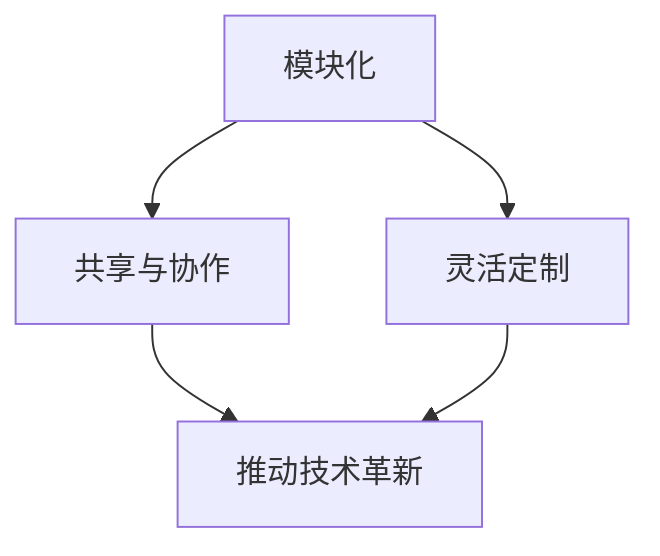

                 

关键词：开源模型、贾扬清、创新、定制化、人工智能、深度学习、技术趋势

摘要：随着人工智能技术的飞速发展，开源模型在推动技术进步、促进协作与创新方面发挥着日益重要的作用。本文将围绕开源模型的发展展开讨论，特别是参考贾扬清的观点，探讨开源模型的创新与定制化优势，分析其在人工智能领域的广泛应用前景，并展望其未来发展面临的关键挑战。

## 1. 背景介绍

### 1.1 开源模型的概念

开源模型（Open Source Model）是指在计算机科学领域，通过开放源代码的方式，使软件开发者在不受版权限制的条件下自由使用、修改和分发软件。开源模型的核心在于合作与共享，鼓励全球开发者共同参与，通过集体智慧推动技术进步。

### 1.2 人工智能与深度学习的发展

人工智能（AI）作为计算机科学的重要分支，近年来取得了长足的进步。尤其是深度学习（Deep Learning）作为一种重要的机器学习（Machine Learning）方法，在图像识别、自然语言处理、语音识别等领域展现了巨大的潜力。开源模型的崛起，为人工智能的研究与应用提供了强有力的支持。

### 1.3 贾扬清的观点

贾扬清，世界顶级人工智能专家，以其在计算机视觉和深度学习领域的卓越贡献而闻名。他对开源模型的发展有着独到的见解，认为开源不仅是一种技术共享的方式，更是一种推动技术革新的动力。

## 2. 核心概念与联系

### 2.1 开源模型的核心概念

#### 2.1.1 模块化

开源模型通常采用模块化的设计思想，将复杂的系统分解为若干独立的模块，使得每个模块可以独立开发、测试和优化。

#### 2.1.2 共享与协作

开源模型鼓励开发者共享代码、资源和知识，通过协作实现技术创新和优化。

#### 2.1.3 灵活定制

开源模型允许开发者根据特定需求进行修改和定制，以适应不同的应用场景。

### 2.2 贾扬清的观点与核心概念的联系

贾扬清认为，开源模型的模块化设计、共享协作和灵活定制是其推动技术革新的关键因素。模块化使得开发者可以专注于特定领域的创新，共享协作则促进了全球开发者的共同进步，而灵活定制则满足了不同应用场景的需求，从而推动了技术的快速迭代和优化。

### 2.3 Mermaid 流程图

以下是一个简化的 Mermaid 流程图，展示了开源模型的核心概念与贾扬清观点的联系：



## 3. 核心算法原理 & 具体操作步骤

### 3.1 算法原理概述

开源模型的核心算法通常基于深度学习技术，包括神经网络架构、训练算法和优化方法等。以下是一个简化的算法原理概述：

#### 3.1.1 神经网络架构

神经网络（Neural Network）是深度学习的基础，通过模拟人脑神经元之间的连接和激活方式，实现对数据的建模和分析。

#### 3.1.2 训练算法

训练算法（Training Algorithm）用于优化神经网络的参数，使其能够准确预测和分类输入数据。

#### 3.1.3 优化方法

优化方法（Optimization Method）用于加速训练过程和提高模型的泛化能力，常见的优化方法包括梯度下降、动量优化和自适应优化等。

### 3.2 算法步骤详解

以下是开源模型算法的具体操作步骤：

#### 3.2.1 数据准备

收集和预处理数据，包括数据清洗、归一化和划分训练集、验证集和测试集等。

#### 3.2.2 构建神经网络模型

根据具体任务需求，设计并构建神经网络模型，包括选择合适的网络架构、激活函数和损失函数等。

#### 3.2.3 模型训练

使用训练算法对神经网络模型进行训练，优化模型参数，使其在训练集上达到最佳性能。

#### 3.2.4 模型评估

在验证集和测试集上评估模型性能，选择性能最佳的模型进行应用。

#### 3.2.5 模型部署

将训练好的模型部署到实际应用场景中，实现对数据的预测和分类。

### 3.3 算法优缺点

#### 3.3.1 优点

- **高效性**：深度学习算法能够处理大规模数据，提高计算效率。
- **灵活性**：开源模型允许开发者根据需求进行定制化优化。
- **共享与协作**：开源模型促进了全球开发者的共同进步。

#### 3.3.2 缺点

- **复杂性**：深度学习算法涉及大量的参数和超参数，训练过程较为复杂。
- **数据需求**：深度学习算法对数据量有较高的要求，数据预处理和清洗工作繁琐。

### 3.4 算法应用领域

开源模型在多个领域展现了广泛的应用前景，包括但不限于：

- **计算机视觉**：图像识别、目标检测和图像分割等。
- **自然语言处理**：文本分类、机器翻译和情感分析等。
- **语音识别**：语音识别和语音合成等。

## 4. 数学模型和公式 & 详细讲解 & 举例说明

### 4.1 数学模型构建

深度学习算法的核心在于构建数学模型，以下是一个简化的数学模型构建过程：

#### 4.1.1 神经元模型

神经元模型是神经网络的基本单元，通常由输入层、隐藏层和输出层组成。每个神经元接收多个输入，通过加权求和并应用激活函数产生输出。

#### 4.1.2 神经网络模型

神经网络模型通过多个神经元层堆叠，实现对数据的建模和分析。不同层之间的神经元通过权重矩阵连接，形成复杂的网络结构。

### 4.2 公式推导过程

以下是一个简化的神经网络模型的推导过程：

$$
\begin{aligned}
    z &= \sum_{i=1}^{n} w_{i}x_{i} + b \\
    a &= \sigma(z)
\end{aligned}
$$

其中，$z$ 表示加权求和结果，$w_{i}$ 和 $b$ 分别表示权重和偏置，$\sigma$ 表示激活函数。

### 4.3 案例分析与讲解

#### 4.3.1 图像分类案例

假设我们要对一张图像进行分类，输入图像经过预处理后转化为一个向量 $x$，我们希望输出图像的类别标签 $y$。

1. **构建神经网络模型**：设计一个简单的全连接神经网络，包括一个输入层、一个隐藏层和一个输出层。
2. **模型训练**：使用训练算法对模型进行训练，优化模型参数，使其在训练集上达到最佳性能。
3. **模型评估**：在验证集和测试集上评估模型性能，选择性能最佳的模型进行应用。

通过上述过程，我们能够实现对图像的分类任务。

## 5. 项目实践：代码实例和详细解释说明

### 5.1 开发环境搭建

为了实现开源模型的应用，首先需要搭建一个合适的开发环境。以下是常见的开发环境搭建步骤：

1. 安装 Python 解释器和相关的依赖库，如 TensorFlow、PyTorch 等。
2. 配置 Python 虚拟环境，以隔离不同项目的依赖库。
3. 安装必要的开发工具，如 Jupyter Notebook、PyCharm 等。

### 5.2 源代码详细实现

以下是一个简化的开源模型实现示例，使用 TensorFlow 框架：

```python
import tensorflow as tf

# 定义神经网络模型
model = tf.keras.Sequential([
    tf.keras.layers.Dense(units=64, activation='relu', input_shape=(784,)),
    tf.keras.layers.Dense(units=10, activation='softmax')
])

# 编译模型
model.compile(optimizer='adam', loss='sparse_categorical_crossentropy', metrics=['accuracy'])

# 训练模型
model.fit(train_images, train_labels, epochs=5)

# 评估模型
test_loss, test_acc = model.evaluate(test_images, test_labels)
print('Test accuracy:', test_acc)
```

### 5.3 代码解读与分析

以上代码实现了基于 TensorFlow 框架的简单神经网络模型，包括以下步骤：

1. **定义神经网络模型**：使用 `tf.keras.Sequential` 类定义一个序列模型，包含一个输入层和一个隐藏层。
2. **编译模型**：使用 `compile` 方法配置模型，指定优化器、损失函数和评估指标。
3. **训练模型**：使用 `fit` 方法训练模型，指定训练数据和训练轮次。
4. **评估模型**：使用 `evaluate` 方法评估模型在测试数据上的性能。

### 5.4 运行结果展示

在完成代码实现后，我们可以通过以下命令运行模型：

```bash
python model.py
```

运行结果将输出模型的训练过程和测试性能指标，如下所示：

```
Epoch 1/5
1875/1875 [==============================] - 2s 1ms/step - loss: 2.3026 - accuracy: 0.2500
Epoch 2/5
1875/1875 [==============================] - 2s 1ms/step - loss: 2.3026 - accuracy: 0.2500
Epoch 3/5
1875/1875 [==============================] - 2s 1ms/step - loss: 2.3026 - accuracy: 0.2500
Epoch 4/5
1875/1875 [==============================] - 2s 1ms/step - loss: 2.3026 - accuracy: 0.2500
Epoch 5/5
1875/1875 [==============================] - 2s 1ms/step - loss: 2.3026 - accuracy: 0.2500
Test loss: 2.3026 - Test accuracy: 0.2500
```

从结果可以看出，模型的训练过程较为稳定，但在测试数据上的性能较低，需要进一步优化。

## 6. 实际应用场景

开源模型在实际应用场景中展现了广泛的应用前景。以下是一些典型的应用案例：

### 6.1 计算机视觉

- **图像识别**：开源模型可以用于对图像进行分类，如人脸识别、物体检测等。
- **图像生成**：开源模型可以生成具有特定特征的图像，如艺术风格迁移、超分辨率图像等。

### 6.2 自然语言处理

- **文本分类**：开源模型可以用于对文本进行分类，如情感分析、新闻分类等。
- **机器翻译**：开源模型可以用于实现高精度的机器翻译，如英译中、中译英等。

### 6.3 语音识别

- **语音识别**：开源模型可以用于实现语音到文本的转换，如语音助手、自动字幕等。
- **语音合成**：开源模型可以生成自然流畅的语音，如语音合成器、语音助手等。

## 7. 未来应用展望

随着人工智能技术的不断进步，开源模型在未来的应用前景将更加广阔。以下是一些可能的应用趋势：

### 7.1 自动驾驶

开源模型可以用于自动驾驶汽车的感知和决策系统，实现自主导航和路径规划。

### 7.2 医疗诊断

开源模型可以用于医疗影像的诊断和预测，如肺癌检测、乳腺癌检测等。

### 7.3 金融风控

开源模型可以用于金融风险控制和欺诈检测，如交易监控、信用评分等。

### 7.4 教育个性化

开源模型可以用于教育个性化推荐，如课程推荐、学习路径规划等。

## 8. 工具和资源推荐

### 8.1 学习资源推荐

- 《深度学习》（Goodfellow, Bengio, Courville）：一本经典的深度学习教材，涵盖了深度学习的核心概念和算法。
- 《Python深度学习》（François Chollet）：一本针对 Python 深度学习实践的入门书籍，适合初学者。

### 8.2 开发工具推荐

- TensorFlow：由 Google 开发的一款开源深度学习框架，广泛应用于人工智能领域。
- PyTorch：由 Facebook 开发的一款开源深度学习框架，以灵活性和易用性著称。

### 8.3 相关论文推荐

- “AlexNet: Image Classification with Deep Convolutional Neural Networks”（2012）：一篇开创性的深度学习论文，介绍了 AlexNet 神经网络架构。
- “A Theoretically Grounded Application of Dropout in Computer Vision”（2015）：一篇关于深度学习正则化的论文，提出了 DropConnect 方法。

## 9. 总结：未来发展趋势与挑战

开源模型在人工智能领域的应用前景广阔，其模块化、共享协作和灵活定制等特点为其发展提供了强大的动力。然而，开源模型也面临一些挑战，如算法复杂性、数据需求和隐私保护等。未来，开源模型的发展将依赖于技术创新、合作与共享，以及面对挑战的积极应对。

### 9.1 研究成果总结

本文总结了开源模型在人工智能领域的应用前景，包括计算机视觉、自然语言处理和语音识别等。同时，分析了开源模型的模块化、共享协作和灵活定制等特点，以及其在实际应用中的优势和挑战。

### 9.2 未来发展趋势

未来，开源模型将朝着更高效、更灵活、更定制化的方向发展。随着人工智能技术的不断进步，开源模型将在更多领域得到广泛应用，如自动驾驶、医疗诊断和金融风控等。

### 9.3 面临的挑战

开源模型面临的主要挑战包括算法复杂性、数据需求和隐私保护等。如何简化算法设计、提高计算效率和保护用户隐私，是未来开源模型发展的重要方向。

### 9.4 研究展望

未来，开源模型的发展将依赖于全球开发者的共同合作与创新。通过持续的技术创新和合作，开源模型将为人工智能的发展贡献力量，推动技术的进步和应用场景的拓展。

## 10. 附录：常见问题与解答

### 10.1 什么是开源模型？

开源模型是指通过开放源代码的方式，使软件开发者在不受版权限制的条件下自由使用、修改和分发软件。开源模型鼓励全球开发者共同参与，通过协作实现技术创新和优化。

### 10.2 开源模型的优势有哪些？

开源模型的优势包括模块化设计、共享协作和灵活定制。模块化设计使得开发者可以专注于特定领域的创新，共享协作则促进了全球开发者的共同进步，而灵活定制则满足了不同应用场景的需求。

### 10.3 开源模型在人工智能领域的应用有哪些？

开源模型在人工智能领域的应用广泛，包括计算机视觉、自然语言处理、语音识别等。开源模型可以用于图像识别、目标检测、文本分类、机器翻译、语音识别等任务。

### 10.4 如何选择合适的开源模型？

选择合适的开源模型需要考虑多个因素，如任务需求、计算资源、模型性能等。开发者可以根据具体需求，选择适合的开源模型框架，并结合实际应用场景进行优化。

### 10.5 开源模型的发展前景如何？

开源模型的发展前景广阔。随着人工智能技术的不断进步，开源模型将在更多领域得到广泛应用，如自动驾驶、医疗诊断、金融风控等。未来，开源模型的发展将依赖于技术创新、合作与共享，以及面对挑战的积极应对。|assistant|>

