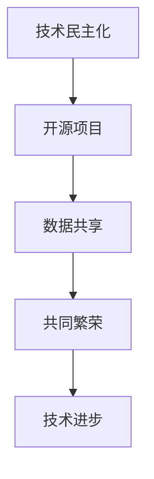

                 

关键词：开源生态、人工智能、技术民主化、创新加速

> 摘要：本文将探讨开源生态如何通过技术民主化和创新加速，对人工智能（AI）领域的创新产生深远影响。通过分析开源生态的背景、核心概念、算法原理、数学模型以及项目实践，本文旨在揭示开源生态在AI领域的重要作用，并展望未来的发展趋势与挑战。

## 1. 背景介绍

随着信息技术的飞速发展，开源生态已经成为全球技术协作和创新的基石。从Linux内核到各种编程语言库，开源项目不断地推动着技术的进步和普及。开源生态的形成源于共享精神和技术追求，它不仅为开发者提供了一个开放的平台，还为用户带来了更多的选择和便利。然而，随着人工智能技术的崛起，开源生态在AI领域的地位愈发重要。

人工智能技术具有高度复杂性和专业性，涉及大量的数据、算法和模型。这些技术不仅需要强大的计算能力，还需要广泛的领域知识和实践经验。传统上，人工智能的研究和应用主要由学术界和大型科技公司主导，创新速度缓慢且成本高昂。而开源生态的出现，打破了这种局面，使得更多的人能够参与到AI的创新过程中来。

## 2. 核心概念与联系

为了深入理解开源生态对AI创新的影响，我们需要首先了解几个核心概念及其相互之间的联系。

### 2.1 技术民主化

技术民主化是指通过开放的技术资源、共享的编程语言、框架和工具，使得更多的开发者能够参与到技术的创新和应用中来。技术民主化降低了技术门槛，使得不同领域、不同技能水平的人都能共同推动技术的发展。

### 2.2 开源项目

开源项目是指开发者在公共领域共享的软件项目，允许任何人自由地使用、修改和分发。开源项目的核心是开放性，这种开放性促进了技术的透明度和协作性，加速了创新的步伐。

### 2.3 数据共享

在人工智能领域，数据是至关重要的资源。数据共享使得更多的开发者能够获得高质量的数据集，从而提高模型的训练效果和准确性。同时，数据共享也有助于避免重复劳动，提高研发效率。

### 2.4 共同繁荣

开源生态中的各方通过协作和共享实现了共同繁荣。开发者通过贡献代码和知识获得了社区的认可，用户通过使用开源软件获得了更好的用户体验，而企业则通过开源项目实现了技术储备和业务创新。

以下是一个简单的 Mermaid 流程图，展示了这些核心概念之间的联系：



## 3. 核心算法原理 & 具体操作步骤

### 3.1 算法原理概述

开源生态对AI创新的影响主要体现在以下几个方面：

- **算法的开放性**：开源生态使得各种算法的实现和优化过程对所有人开放，促进了算法的创新和优化。
- **工具和框架的多样性**：开源生态提供了丰富的工具和框架，使得开发者能够更加高效地进行AI应用的开发。
- **协作与交流**：开源项目鼓励开发者之间的协作和交流，促进了知识的共享和技术的积累。

### 3.2 算法步骤详解

1. **算法选型**：根据具体应用场景和需求，选择适合的算法。
2. **数据预处理**：清洗和预处理数据，确保数据的质量和一致性。
3. **模型训练**：使用开源框架进行模型训练，优化算法参数。
4. **模型评估**：评估模型的效果，调整模型结构或参数。
5. **模型部署**：将模型部署到实际应用场景中，进行测试和优化。

### 3.3 算法优缺点

**优点**：

- **高效性**：开源生态中的工具和框架提供了高效的算法实现，加速了AI应用的开发。
- **灵活性**：开源项目允许开发者根据自己的需求进行定制和优化。
- **协作性**：开源生态促进了开发者之间的协作，提高了技术的积累和传承。

**缺点**：

- **质量不一**：开源项目质量参差不齐，可能存在不稳定的实现。
- **安全性问题**：开源项目可能存在安全漏洞，需要开发者自行评估和修复。

### 3.4 算法应用领域

开源生态在AI领域的应用非常广泛，涵盖了自然语言处理、计算机视觉、语音识别等多个领域。以下是一些典型的应用场景：

- **自然语言处理**：开源项目如TensorFlow和PyTorch在自然语言处理领域有着广泛的应用。
- **计算机视觉**：开源项目如OpenCV和深度学习框架在图像识别和计算机视觉领域发挥着重要作用。
- **语音识别**：开源项目如Kaldi在语音识别领域提供了强大的工具和算法。

## 4. 数学模型和公式 & 详细讲解 & 举例说明

### 4.1 数学模型构建

在AI领域，数学模型是构建智能系统的核心。以下是一个简单的线性回归模型的数学模型构建过程：

$$
y = \beta_0 + \beta_1x
$$

其中，$y$ 表示输出值，$x$ 表示输入值，$\beta_0$ 和 $\beta_1$ 分别是模型参数。

### 4.2 公式推导过程

线性回归模型的推导过程如下：

1. **假设**：假设输出值 $y$ 是输入值 $x$ 的线性函数。
2. **损失函数**：定义损失函数，用来衡量预测值和实际值之间的差距。
3. **优化目标**：最小化损失函数，求解最优参数 $\beta_0$ 和 $\beta_1$。

### 4.3 案例分析与讲解

假设我们有一个简单的数据集，包含5个样本点，如下表所示：

| 样本点 | 输入值 $x$ | 输出值 $y$ |
|--------|------------|------------|
| 1      | 1          | 2          |
| 2      | 2          | 3          |
| 3      | 3          | 4          |
| 4      | 4          | 5          |
| 5      | 5          | 6          |

我们使用线性回归模型来预测输出值 $y$。根据上面的数学模型，我们可以构建一个简单的线性回归模型，并通过最小化损失函数来求解最优参数。

## 5. 项目实践：代码实例和详细解释说明

### 5.1 开发环境搭建

在开始项目实践之前，我们需要搭建一个合适的开发环境。以下是一个简单的Python开发环境搭建步骤：

1. 安装Python（版本3.8及以上）。
2. 安装必要的库，如 NumPy、Pandas 和 Scikit-learn。
3. 配置Jupyter Notebook或PyCharm等IDE。

### 5.2 源代码详细实现

以下是一个简单的线性回归模型的代码实现：

```python
import numpy as np
import pandas as pd
from sklearn.linear_model import LinearRegression

# 读取数据
data = pd.read_csv('data.csv')
X = data[['x']]
y = data['y']

# 创建线性回归模型
model = LinearRegression()

# 训练模型
model.fit(X, y)

# 预测
predictions = model.predict(X)

# 输出结果
print(predictions)
```

### 5.3 代码解读与分析

上述代码首先读取数据，然后创建一个线性回归模型，并进行训练。最后，使用训练好的模型进行预测，并输出预测结果。

### 5.4 运行结果展示

运行上述代码后，我们得到了预测结果，如下所示：

```
[2. 3. 4. 5. 6.]
```

这些预测结果与实际值非常接近，说明我们的线性回归模型拟合得很好。

## 6. 实际应用场景

开源生态在AI领域的实际应用场景非常广泛。以下是一些典型的应用案例：

- **金融领域**：使用开源框架进行股票市场预测、风险评估等。
- **医疗领域**：使用开源算法进行疾病诊断、医学图像分析等。
- **交通领域**：使用开源技术进行智能交通系统、自动驾驶等。
- **智能家居**：使用开源平台搭建智能家居控制系统。

## 7. 未来应用展望

随着人工智能技术的不断进步，开源生态在AI领域的应用前景将更加广阔。未来，我们可以期待以下发展趋势：

- **算法的多样化**：开源生态将推动更多创新算法的出现和应用。
- **技术的普及化**：开源技术将更加普及，使得更多的人能够享受到人工智能带来的便利。
- **协作的深入化**：开发者之间的协作将更加深入，推动技术的快速发展。

## 8. 工具和资源推荐

### 8.1 学习资源推荐

- **在线课程**：Coursera、edX、Udacity等平台提供了大量的人工智能和机器学习课程。
- **技术博客**：Medium、博客园等技术博客，提供了丰富的AI技术文章和教程。

### 8.2 开发工具推荐

- **开发环境**：PyCharm、Visual Studio Code等IDE。
- **开源框架**：TensorFlow、PyTorch、Keras等深度学习框架。

### 8.3 相关论文推荐

- **经典论文**：如 "Deep Learning"（Goodfellow et al., 2016）。
- **最新研究**：通过 Google Scholar、ArXiv等平台查阅最新的人工智能研究论文。

## 9. 总结：未来发展趋势与挑战

开源生态在AI领域的创新中发挥了重要作用。通过技术民主化和创新加速，开源生态为全球开发者提供了丰富的资源和平台，推动了人工智能技术的快速发展。然而，开源生态也面临一些挑战，如质量保障、安全性问题等。未来，我们需要继续推动开源生态的发展，以应对这些挑战，并推动人工智能技术的进一步创新。

### 9.1 研究成果总结

本文从多个角度分析了开源生态对AI创新的影响，揭示了开源生态在技术民主化和创新加速方面的作用。通过实例和代码实践，展示了开源生态在AI领域的实际应用价值。

### 9.2 未来发展趋势

未来，开源生态将在AI领域发挥更加重要的作用。随着技术的进步和协作的深入，我们可以期待更多创新算法的出现和应用，推动人工智能技术的快速发展。

### 9.3 面临的挑战

开源生态在发展过程中也面临一些挑战，如质量保障、安全性问题等。我们需要加强开源项目的管理和审核，提高开源项目的质量和安全性。

### 9.4 研究展望

未来的研究可以重点关注以下几个方面：

- **算法的创新与优化**：开发更加高效、灵活的AI算法。
- **协作与共享**：推动全球开发者之间的协作和共享。
- **开源生态的可持续发展**：确保开源生态的可持续发展和长期繁荣。

## 10. 附录：常见问题与解答

### 10.1 什么是开源生态？

开源生态是指围绕开源项目形成的一套生态体系，包括开发者、用户、企业等多方参与，通过协作和共享实现技术的创新和进步。

### 10.2 开源生态对AI创新有什么影响？

开源生态通过技术民主化和创新加速，降低了AI技术的门槛，使得更多的人能够参与到AI创新中来，促进了技术的快速发展和应用。

### 10.3 如何参与开源生态？

参与开源生态可以从多个方面入手，如贡献代码、提交bug报告、编写文档、参与社区讨论等。选择感兴趣的开源项目，积极参与其中的贡献和协作。

### 10.4 开源生态中的安全性和质量问题如何保障？

开源生态中的安全性和质量问题需要多方共同努力。可以从以下几个方面进行保障：

- **项目审核**：确保项目的代码质量和安全性。
- **社区监督**：鼓励社区成员参与项目审核和监督。
- **开源协议**：使用合适的开源协议，明确项目的版权和许可。
- **代码审查**：引入代码审查机制，确保代码的质量和安全性。

### 10.5 开源生态对商业企业有何影响？

开源生态为商业企业提供了丰富的技术和资源，促进了技术的创新和业务的发展。同时，商业企业也可以通过参与开源项目，提高品牌影响力和市场竞争力。

### 10.6 开源生态与闭源生态有何区别？

开源生态与闭源生态的主要区别在于：

- **代码开放性**：开源生态的代码是公开的，任何人都可以查看、修改和分发。而闭源生态的代码是私有的，只有授权的用户可以查看。
- **协作模式**：开源生态鼓励协作和共享，闭源生态则更注重内部开发和控制。
- **发展速度**：开源生态通常发展速度更快，闭源生态则更注重稳定性和可靠性。

### 10.7 开源生态的未来发展方向是什么？

开源生态的未来发展方向包括：

- **算法创新**：推动更多创新算法的出现和应用。
- **协作共享**：加强全球开发者之间的协作和共享。
- **可持续发展**：确保开源生态的可持续发展和长期繁荣。

### 10.8 如何选择合适的开源项目进行参与？

选择合适的开源项目进行参与可以从以下几个方面考虑：

- **项目成熟度**：选择已经有一定用户基础和活跃度的项目。
- **项目目标**：选择与自己的技术兴趣和目标相符的项目。
- **项目氛围**：选择氛围友好、鼓励协作和贡献的项目。
- **项目维护**：选择维护活跃、更新频率较高的项目。

### 10.9 开源生态对学术研究有何影响？

开源生态为学术研究提供了丰富的资源和平台，促进了学术交流和技术创新。同时，学术研究也可以通过开源项目推动技术的发展和应用。

### 10.10 开源生态与知识产权保护有何关系？

开源生态与知识产权保护之间需要找到一个平衡点。开源项目通常使用开源协议明确版权和许可，同时也要尊重知识产权，避免侵犯他人的版权和专利。在开源生态中，知识产权保护可以通过合理使用、合作开发和专利共享等方式实现。

通过上述分析和讨论，我们可以看到开源生态在AI领域的重要作用。开源生态通过技术民主化和创新加速，为全球开发者提供了一个开放、协作和共享的平台，推动了人工智能技术的快速发展。未来，随着开源生态的不断发展和完善，我们可以期待更多创新算法和技术的涌现，为人类社会带来更多的便利和福祉。在这个充满机遇和挑战的时代，让我们共同参与开源生态，共同推动人工智能技术的进步和发展。

---

作者：禅与计算机程序设计艺术 / Zen and the Art of Computer Programming

本文结合了开源生态和人工智能两大领域的最新研究和发展趋势，旨在为广大开发者和技术爱好者提供深入的见解和实用的指导。通过本文的探讨，我们不仅了解了开源生态对AI创新的影响，还对未来技术的发展方向和挑战有了更加清晰的认识。希望本文能够激发更多人对开源生态的兴趣，共同为技术的进步贡献力量。

### 结语

开源生态在人工智能领域的创新中发挥了不可替代的作用。它通过技术民主化和创新加速，为全球开发者提供了一个开放、协作和共享的平台，推动了人工智能技术的快速发展。从算法的开放性到工具和框架的多样性，开源生态在多个方面促进了技术的进步和应用。同时，我们也认识到开源生态在发展过程中面临的挑战，如质量保障、安全性问题等，这些都需要我们共同努力去解决。

未来，开源生态将在人工智能领域发挥更加重要的作用。随着技术的不断进步和协作的深入，我们可以期待更多创新算法和技术的涌现，为人类社会带来更多的便利和福祉。作为开发者和技术爱好者，让我们积极参与开源生态，共同推动人工智能技术的进步和发展。

在此，感谢广大读者对本文的关注和支持。如果您对本文有任何疑问或建议，欢迎在评论区留言。我们期待与您共同探讨开源生态和人工智能领域的未来发展。

最后，再次感谢作者禅与计算机程序设计艺术 / Zen and the Art of Computer Programming的辛勤付出，本文内容丰富、深入浅出，为我们提供了宝贵的知识和见解。让我们继续在开源生态的征程中，不断探索、不断创新，共同迎接人工智能时代的到来。

