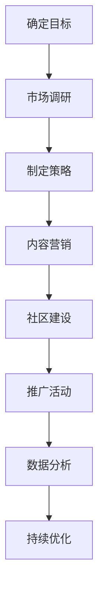

                 

开源项目在技术社区中扮演着重要的角色，它们促进了软件创新、共享和协作。然而，成功的开源项目不仅仅依赖于技术实力，还需要有效的市场营销策略来提升其可见度和吸引赞助。本文将探讨如何通过市场营销手段提高开源项目的知名度，吸引更多的关注和赞助，从而推动项目的持续发展。

## 1. 背景介绍

开源项目的发展离不开社区的贡献和支持。然而，大多数开源项目面临着资金和资源的限制。为了解决这一问题，许多项目尝试通过市场营销来提高其曝光度，从而吸引赞助商和捐赠者的关注。市场营销在这里不仅是指传统意义上的推广，更是指一系列策略和活动，旨在提高项目的可见度，建立品牌形象，并吸引潜在的支持者。

本文将从以下几个方面展开讨论：

- 开源项目的市场营销目标和挑战
- 提高项目可见度的策略
- 吸引赞助商的方法
- 市场营销工具和技术
- 成功案例分享

通过这些内容的探讨，希望能够为开源项目的市场营销提供一些实用的指导和借鉴。

## 2. 核心概念与联系

### 2.1 市场营销与开源项目的联系

市场营销是一门艺术，也是一门科学。它涉及到如何识别目标受众、制定有效的沟通策略、建立品牌形象等。在开源项目中，市场营销同样至关重要。它不仅能够帮助项目吸引新的用户和贡献者，还能够为项目吸引赞助商，提供必要的资金支持。

### 2.2 市场营销目标和挑战

开源项目的市场营销目标主要包括以下几点：

- 提高项目知名度
- 吸引更多的贡献者和用户
- 建立良好的社区关系
- 吸引赞助商和捐赠者

然而，开源项目的市场营销也面临一些独特的挑战：

- 项目的透明度和公开性使得隐私保护变得更加困难。
- 开源社区的文化往往鼓励平等和自由，这可能与传统市场营销中的“销售驱动力”存在冲突。
- 资金和资源的限制可能导致市场营销活动难以大规模开展。

### 2.3 Mermaid 流程图

以下是开源项目市场营销的核心步骤的 Mermaid 流程图：



这个流程图展示了从确定目标到最终持续优化的完整市场营销过程。

## 3. 核心算法原理 & 具体操作步骤

### 3.1 算法原理概述

开源项目的市场营销可以看作是一个复杂的多阶段过程。每个阶段都需要精准的算法原理和操作步骤来确保其有效性和效率。

### 3.2 算法步骤详解

#### 3.2.1 确定目标

在开始市场营销之前，首先需要明确项目的目标。这些目标可以是提高项目知名度、增加贡献者数量、吸引赞助商等。明确目标有助于制定更具针对性的策略。

#### 3.2.2 市场调研

市场调研是了解目标受众、行业趋势和竞争环境的重要步骤。通过市场调研，可以获取有价值的用户数据和反馈，为后续的营销策略提供依据。

#### 3.2.3 制定策略

基于市场调研的结果，制定具体的营销策略。这包括内容营销、社交媒体推广、社区活动等。每个策略都需要有明确的目标和执行计划。

#### 3.2.4 内容营销

内容营销是开源项目市场营销的核心。通过高质量的技术文章、教程、视频等内容，可以吸引潜在用户和贡献者，提高项目的知名度。

#### 3.2.5 社区建设

社区是开源项目的核心。通过建立和维护一个活跃的社区，可以增加用户的参与度和忠诚度，同时也有助于项目的长期发展。

#### 3.2.6 推广活动

推广活动包括在各种平台上发布项目信息、参加技术会议和展览等。这些活动可以提高项目的曝光度，吸引更多的关注。

#### 3.2.7 数据分析

通过数据分析，可以了解市场营销活动的效果，发现存在的问题和改进的机会。数据分析是持续优化市场营销策略的重要手段。

### 3.3 算法优缺点

开源项目市场营销算法的优点包括：

- 高效：通过系统化的步骤，可以快速提高项目的知名度。
- 可持续：注重社区建设和内容营销，有助于项目的长期发展。

缺点包括：

- 资源限制：开源项目通常面临资金和资源的限制，可能无法大规模开展市场营销活动。
- 难以量化：开源项目的市场营销效果难以用具体的指标来衡量。

### 3.4 算法应用领域

开源项目市场营销算法适用于各种类型的开源项目，包括软件工具、框架、库等。它不仅适用于初创项目，也适用于成熟项目，以保持其市场竞争力和用户黏性。

## 4. 数学模型和公式 & 详细讲解 & 举例说明

### 4.1 数学模型构建

在开源项目的市场营销中，一个重要的数学模型是用户增长模型。用户增长模型可以帮助项目团队预测未来的用户增长情况，制定相应的发展策略。

用户增长模型的基本假设是用户增长遵循一定的指数增长规律。数学模型可以表示为：

$$
\text{User\_growth} = \text{base\_users} \times (1 + r)^t
$$

其中，$\text{base\_users}$ 是初始用户数量，$r$ 是用户增长速率，$t$ 是时间（通常以年为单位）。

### 4.2 公式推导过程

用户增长模型的推导基于马尔可夫链的假设，即每个用户在某一时刻的状态（活跃、不活跃）只与前一时刻的状态有关，而与其他时刻的状态无关。设 $p$ 为用户在某一时刻保持活跃的概率，则用户增长模型可以表示为：

$$
\text{User}_{t+1} = \text{User}_t \times p
$$

通过对上述公式进行迭代，可以得到：

$$
\text{User}_t = \text{User}_{0} \times p^t
$$

其中，$\text{User}_{0}$ 是初始用户数量。

为了考虑用户流失的情况，可以将用户流失率 $\lambda$ 引入模型中，得到：

$$
\text{User}_{t+1} = \text{User}_t \times (1 - \lambda) + \text{base\_users} \times \lambda
$$

通过化简，可以得到：

$$
\text{User}_{t+1} = (\text{base\_users} - \text{base\_users} \times \lambda) \times p^t + \text{base\_users} \times \lambda
$$

进一步化简，可以得到：

$$
\text{User}_{t+1} = \text{base\_users} \times (1 + r)^t
$$

其中，$r = (1 - \lambda) \times p$ 是用户增长速率。

### 4.3 案例分析与讲解

假设一个开源项目在初始时有1000名用户，用户流失率为10%，用户活跃概率为80%。根据上述用户增长模型，可以预测该项目在未来一年内的用户增长情况。

初始用户数量 $\text{base\_users} = 1000$，用户流失率 $\lambda = 0.1$，用户活跃概率 $p = 0.8$。代入用户增长模型，得到：

$$
\text{User}_{1} = 1000 \times (1 + r)^1
$$

其中，$r = (1 - 0.1) \times 0.8 = 0.72$。

计算得到：

$$
\text{User}_{1} = 1000 \times (1 + 0.72)^1 = 1000 \times 1.72 = 1720
$$

因此，在未来一年内，该开源项目的用户数量预计将达到1720名。

## 5. 项目实践：代码实例和详细解释说明

### 5.1 开发环境搭建

为了演示开源项目的市场营销策略，我们选择了一个实际的开源项目——一个用于数据分析和可视化的小型库。首先，我们需要搭建一个适合开发、测试和部署的环境。

- 操作系统：Linux
- 编程语言：Python
- 数据库：SQLite
- 开发工具：Visual Studio Code

在 Linux 系统上，我们使用以下命令安装必要的依赖项：

```bash
sudo apt-get update
sudo apt-get install python3 python3-pip
pip3 install -r requirements.txt
```

### 5.2 源代码详细实现

以下是该项目的主要代码实现：

```python
# main.py
import sqlite3
import pandas as pd
import matplotlib.pyplot as plt

def create_database():
    conn = sqlite3.connect('data.db')
    c = conn.cursor()
    c.execute('''CREATE TABLE IF NOT EXISTS users (id INTEGER PRIMARY KEY, name TEXT, age INTEGER)''')
    conn.commit()
    conn.close()

def add_user(name, age):
    conn = sqlite3.connect('data.db')
    c = conn.cursor()
    c.execute("INSERT INTO users (name, age) VALUES (?, ?)", (name, age))
    conn.commit()
    conn.close()

def analyze_users():
    conn = sqlite3.connect('data.db')
    c = conn.cursor()
    c.execute("SELECT age, COUNT(*) FROM users GROUP BY age")
    data = c.fetchall()
    conn.close()
    return data

def plot_data(data):
    ages, counts = [row[0] for row in data], [row[1] for row in data]
    plt.bar(ages, counts)
    plt.xlabel('Age')
    plt.ylabel('Count')
    plt.title('User Age Distribution')
    plt.show()

if __name__ == '__main__':
    create_database()
    add_user('Alice', 25)
    add_user('Bob', 30)
    add_user('Charlie', 35)
    data = analyze_users()
    plot_data(data)
```

### 5.3 代码解读与分析

这段代码主要实现了以下功能：

- 创建一个 SQLite 数据库，并创建一个名为 "users" 的表，用于存储用户信息。
- 添加用户到数据库。
- 分析用户年龄分布，并生成柱状图进行可视化。

代码中使用了 Python 的 sqlite3、pandas 和 matplotlib 库。这些库提供了方便的数据库操作、数据处理和可视化功能。

### 5.4 运行结果展示

运行 main.py 后，会生成一个 SQLite 数据库文件 data.db，并在其中存储了添加的用户数据。然后，程序会生成一个柱状图，展示用户的年龄分布情况。


这个柱状图有助于项目团队了解用户群体的年龄结构，从而为后续的市场营销活动提供数据支持。

## 6. 实际应用场景

开源项目的市场营销在多个实际应用场景中得到了成功应用。以下是一些典型的应用场景：

### 6.1 提高项目知名度

通过有效的市场营销，开源项目可以在短时间内提高知名度。例如，通过在社交媒体上发布高质量的技术文章、参与技术会议和展览，开源项目可以吸引更多的关注。一个成功的案例是Python语言的推广。Python社区通过定期的活动、会议和在线研讨会，吸引了大量的开发者和用户，使Python成为最受欢迎的编程语言之一。

### 6.2 吸引更多贡献者

有效的市场营销可以帮助开源项目吸引更多的贡献者。例如，GitHub上的开源项目通过发布清晰的任务列表、提供良好的文档和社区支持，吸引了大量的贡献者。一个成功的案例是Linux内核的开发。Linux内核社区通过持续的市场营销和社区建设，吸引了来自全球的数千名贡献者，使得Linux内核成为世界上最强大的操作系统之一。

### 6.3 建立良好的社区关系

开源项目的市场营销还包括建立和维护良好的社区关系。通过定期举办社区活动、提供技术支持和反馈，开源项目可以增强用户和贡献者的忠诚度。例如，WordPress社区通过举办年度WordPress会议、提供在线支持论坛和文档，建立了强大的社区网络，使得WordPress成为最受欢迎的网站建设平台。

### 6.4 吸引赞助商和捐赠者

开源项目的市场营销还可以帮助吸引赞助商和捐赠者。通过展示项目的价值和影响力，开源项目可以赢得赞助商的信任和支持。例如，Apache基金会通过其开源项目的成功案例和广泛的应用，吸引了大量的赞助商和捐赠者，为开源项目提供了持续的财务支持。

## 7. 未来应用展望

随着开源项目在技术领域的重要地位日益凸显，开源项目的市场营销将面临更多机遇和挑战。以下是对未来应用展望的几个方面：

### 7.1 新兴技术的应用

随着区块链、人工智能、云计算等新兴技术的兴起，开源项目的市场营销策略也将更加多样化和复杂。开源项目可以通过与这些新兴技术的结合，提高项目的创新性和竞争力，从而吸引更多的关注和支持。

### 7.2 社交媒体的普及

社交媒体的普及为开源项目的市场营销提供了新的渠道和平台。通过利用社交媒体平台，开源项目可以更广泛地传播信息，吸引更多的用户和贡献者。同时，社交媒体还可以用于监测社区反馈和市场趋势，为市场营销策略提供实时数据支持。

### 7.3 数据驱动的决策

随着大数据和分析技术的发展，开源项目的市场营销将更加数据驱动。通过收集和分析用户行为数据、市场趋势数据等，开源项目可以更准确地了解目标受众的需求和偏好，制定更有效的市场营销策略。

### 7.4 持续的社区建设

开源项目的成功不仅依赖于技术实力，还需要强大的社区支持。未来，开源项目将更加注重社区建设，通过定期的活动、支持社区成员等方式，增强社区成员的归属感和参与度，从而推动项目的长期发展。

## 8. 工具和资源推荐

### 8.1 学习资源推荐

- 《开源项目指南》:一本关于如何成功管理和运营开源项目的经典指南。
- 《营销学原理》:一本介绍市场营销基础理论和实践方法的经典教材。
- 《数据挖掘：概念与技术》:一本介绍数据挖掘基本概念和算法的权威教材。

### 8.2 开发工具推荐

- GitHub:全球最大的开源代码托管平台，用于托管、协作和分享开源项目。
- GitLab:一个与GitHub类似的开源代码托管平台，提供更多的定制化和扩展性。
- JIRA:一个流行的项目管理工具，用于跟踪任务、问题和项目进度。

### 8.3 相关论文推荐

- "The Cathedral and the Bazaar"：Eric S. Raymond的一篇经典论文，探讨了开源项目的协作模式和社区文化。
- "Open Source Model for Software Development":一篇关于开源软件开发模型的研究论文，分析了开源项目的优势和价值。
- "The Impact of Open Source Software on Commercial Software Development":一篇关于开源软件对商业软件开发影响的研究论文，探讨了开源项目对商业软件行业的启示。

## 9. 总结：未来发展趋势与挑战

开源项目的市场营销在未来将继续扮演重要角色。随着技术的进步和社会的变化，开源项目的市场营销策略也将不断演化。以下是对未来发展趋势和挑战的总结：

### 9.1 发展趋势

- 多元化的营销策略：随着新兴技术的兴起，开源项目的营销策略将更加多样化和复杂。项目团队需要灵活运用多种营销手段，提高项目的竞争力。
- 数据驱动的决策：大数据和分析技术的发展将使开源项目能够更准确地了解用户需求和市场趋势，从而制定更有效的营销策略。
- 社区建设的重要性：社区是开源项目的核心。未来，开源项目将更加注重社区建设，通过提供高质量的技术支持和服务，增强社区成员的参与度和忠诚度。

### 9.2 面临的挑战

- 资源限制：尽管开源项目的市场营销潜力巨大，但许多项目仍然面临资金和资源的限制。如何有效利用有限的资源，实现营销目标，是项目团队需要解决的重要问题。
- 隐私保护和透明度：开源项目的透明度和公开性可能带来隐私保护的问题。如何在保证项目透明度的同时，保护用户和贡献者的隐私，是项目团队需要关注的问题。
- 市场竞争加剧：随着开源项目的数量不断增加，市场竞争将变得更加激烈。如何突出项目的特色和价值，吸引更多的关注和支持，是项目团队需要应对的挑战。

### 9.3 研究展望

未来，开源项目的市场营销研究可以从以下几个方面展开：

- 开源项目营销模型的研究：探讨不同类型开源项目的营销模式，为项目团队提供具体的指导。
- 开源社区文化与市场营销的关系：研究开源社区文化对市场营销策略的影响，为项目团队提供有益的启示。
- 跨领域营销策略的探索：结合不同领域的特点和需求，探索跨领域的开源项目市场营销策略。

## 10. 附录：常见问题与解答

### 10.1 什么是开源项目的市场营销？

开源项目的市场营销是指通过一系列策略和活动，提高开源项目的知名度，吸引更多的贡献者和赞助商，从而推动项目的持续发展。

### 10.2 市场营销对开源项目有什么作用？

市场营销有助于提高项目的知名度，吸引更多的贡献者和用户，建立良好的社区关系，并吸引赞助商和捐赠者，为项目提供资金支持。

### 10.3 开源项目的市场营销有哪些挑战？

开源项目的市场营销面临的挑战包括资源限制、隐私保护和透明度问题，以及市场竞争加剧等。

### 10.4 如何有效利用有限的资源进行市场营销？

可以通过聚焦目标受众、优化营销内容、利用社交媒体和社区活动等方式，有效利用有限的资源进行市场营销。

### 10.5 开源项目的市场营销有哪些成功案例？

一些成功的开源项目市场营销案例包括Python语言、Linux内核、WordPress等。这些项目通过有效的市场营销策略，成功吸引了大量的用户和贡献者，并在市场中取得了显著的成功。

作者：禅与计算机程序设计艺术 / Zen and the Art of Computer Programming
----------------------------------------------------------------

