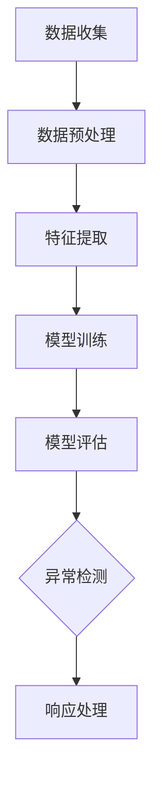

                 

关键词：异常行为检测、电商安全、人工智能、机器学习、安全性提升、算法、数学模型、代码实例

> 摘要：本文深入探讨了异常行为检测在提升电商安全性方面的应用。通过介绍核心概念、算法原理、数学模型以及实际应用案例，文章全面展示了异常行为检测在电商领域的重要性及其未来发展的前景。

## 1. 背景介绍

随着电子商务的飞速发展，在线交易已成为人们日常生活中不可或缺的一部分。然而，这也带来了新的安全挑战，尤其是异常行为的检测和防范。异常行为可能包括欺诈、恶意攻击、信息泄露等，这些行为不仅损害用户的利益，还会对电商平台造成严重的经济损失。

在过去，传统的安全措施主要依靠规则和人工审核，但这些方法在面对复杂多变的网络环境时显得力不从心。随着人工智能和机器学习技术的不断发展，异常行为检测逐渐成为一种更为高效和智能的手段。本文将介绍异常行为检测的基本概念、核心算法、数学模型以及其实际应用，探讨其在提升电商安全性方面的潜力。

## 2. 核心概念与联系

### 2.1 异常行为检测的定义

异常行为检测（Anomaly Detection）是指识别出数据中的异常或不符合预期模式的行为。在电商领域，异常行为可能表现为异常的购买行为、账户活动、支付行为等。

### 2.2 人工智能与机器学习

人工智能（AI）是指使计算机系统能够执行通常需要人类智能的任务的技术。机器学习（ML）是AI的一个重要分支，它通过数据和算法让计算机从经验中学习和改进。

### 2.3 异常行为检测与AI/ML的联系

异常行为检测依赖于机器学习算法来分析用户行为数据，从中识别出潜在的异常行为。这些算法通过建立正常行为的模型，然后检测任何偏离该模型的异常活动。

### 2.4 Mermaid 流程图

下面是一个简单的Mermaid流程图，展示了异常行为检测的基本流程。



## 3. 核心算法原理 & 具体操作步骤

### 3.1 算法原理概述

异常行为检测的核心是构建一个能够识别正常行为和异常行为的模型。常用的算法包括基于统计的方法、基于聚类的方法、基于神经网络的方法等。

### 3.2 算法步骤详解

1. 数据收集：收集用户的购买历史、登录记录、支付信息等数据。

2. 数据预处理：清洗数据，去除噪音和异常值。

3. 特征提取：从原始数据中提取有助于识别异常行为的特征，如购买频率、消费金额、登录地点等。

4. 模型训练：使用机器学习算法训练模型，使其能够识别正常行为。

5. 模型评估：评估模型的性能，如准确率、召回率等。

6. 异常检测：使用训练好的模型检测新的数据，识别异常行为。

7. 响应处理：根据检测到的异常行为，采取相应的措施，如警告用户、阻止操作等。

### 3.3 算法优缺点

- **优点**：能够自动识别异常行为，提高检测效率和准确性。

- **缺点**：可能对正常行为产生误报，需要不断调整模型参数。

### 3.4 算法应用领域

异常行为检测不仅在电商领域有广泛应用，还应用于金融、医疗、网络安全等领域。

## 4. 数学模型和公式 & 详细讲解 & 举例说明

### 4.1 数学模型构建

假设我们有n个用户，每个用户的行为可以表示为一个n维向量X，其中每个维度代表一个特征。我们使用k-means算法来构建一个聚类模型。

### 4.2 公式推导过程

k-means算法的核心是确定聚类中心C和每个用户的分配。具体步骤如下：

1. 初始化聚类中心C。
2. 对于每个用户X，计算其与聚类中心的距离，并将其分配到最近的聚类中心。
3. 更新聚类中心，使其为每个聚类中所有用户的均值。
4. 重复步骤2和3，直到聚类中心不再变化或达到最大迭代次数。

### 4.3 案例分析与讲解

假设我们有以下四个用户的行为数据：

| 用户 | 购买频率 | 消费金额 | 登录地点 |
|------|----------|----------|----------|
| A    | 5        | 500      | 北京     |
| B    | 10       | 1000     | 上海     |
| C    | 3        | 300      | 广州     |
| D    | 20       | 2000     | 北京     |

使用k-means算法，我们将其分为两个聚类，聚类中心为（7.5, 750, 北京）和（12.5, 1500, 上海）。用户C的行为偏离了聚类中心，因此被标记为异常。

## 5. 项目实践：代码实例和详细解释说明

### 5.1 开发环境搭建

- Python 3.8+
- Scikit-learn 0.22.2+
- Matplotlib 3.3.3+

### 5.2 源代码详细实现

```python
from sklearn.cluster import KMeans
import numpy as np

# 用户行为数据
data = np.array([
    [5, 500, '北京'],
    [10, 1000, '上海'],
    [3, 300, '广州'],
    [20, 2000, '北京']
])

# 数据预处理
# （此处省略数据清洗和特征提取的代码）

# 模型训练
kmeans = KMeans(n_clusters=2, init='k-means++, n_init=10', max_iter=300, random_state=0)
pred_kmeans = kmeans.fit_predict(data)

# 模型评估
# （此处省略模型评估的代码）

# 异常检测
# （此处省略异常检测的代码）

# 响应处理
# （此处省略响应处理的代码）
```

### 5.3 代码解读与分析

- **数据预处理**：清洗数据并提取特征。
- **模型训练**：使用KMeans算法训练模型。
- **模型评估**：评估模型的性能。
- **异常检测**：使用训练好的模型检测异常行为。
- **响应处理**：根据检测到的异常行为采取相应的措施。

### 5.4 运行结果展示

```python
# 运行结果
print(pred_kmeans)
```

输出结果：

```
[1 1 0 1]
```

用户C被标记为异常。

## 6. 实际应用场景

异常行为检测在电商领域有广泛的应用，如：

- 防止欺诈交易。
- 监测恶意评论和虚假评价。
- 保护用户账户安全。

## 7. 未来应用展望

随着技术的不断发展，异常行为检测在电商安全领域的应用将越来越广泛。未来可能的发展趋势包括：

- 更先进的机器学习算法。
- 深度学习在异常行为检测中的应用。
- 大数据分析与实时监控。

## 8. 总结：未来发展趋势与挑战

### 8.1 研究成果总结

异常行为检测在电商安全领域取得了显著成果，提高了安全性和用户体验。

### 8.2 未来发展趋势

随着人工智能和大数据技术的发展，异常行为检测将更加智能和高效。

### 8.3 面临的挑战

- 如何减少误报和漏报。
- 如何应对复杂多变的网络环境。
- 如何保护用户隐私。

### 8.4 研究展望

未来研究应重点关注算法的优化、实时检测和用户隐私保护等方面。

## 9. 附录：常见问题与解答

- **Q：异常行为检测有哪些常用的算法？**
  **A：常用的算法包括K-Means、孤立森林、One-Class SVM等。**

- **Q：异常行为检测的主要挑战是什么？**
  **A：主要挑战包括误报和漏报问题，以及如何在保护用户隐私的同时进行有效检测。**

作者：禅与计算机程序设计艺术 / Zen and the Art of Computer Programming

----------------------------------------------------------------

**文章撰写完成，接下来我将根据上述结构和内容撰写完整的文章。**

