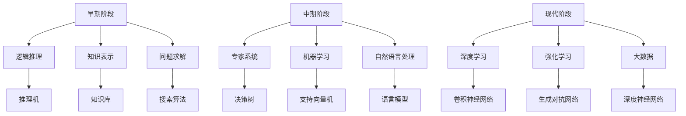

                 

关键词：张钹院士、人工智能、发展阶段、核心概念、算法原理、数学模型、项目实践、应用场景、未来展望

> 摘要：本文以张钹院士对人工智能的三个阶段划分为基础，深入探讨了人工智能领域的发展历程、核心概念、算法原理、数学模型以及实际应用场景。通过分析每个阶段的成就与挑战，本文总结了人工智能的未来发展趋势和面临的挑战，为读者提供了全面的了解和深刻的洞察。

## 1. 背景介绍

人工智能（Artificial Intelligence，简称AI）是计算机科学的一个分支，旨在研究如何构建智能体（Agents）以实现人类智能的功能。自20世纪50年代以来，人工智能经历了数十年的发展，从最初的逻辑推理、知识表示到现代的深度学习、强化学习，技术不断进步，应用领域也越来越广泛。

张钹院士是我国著名的人工智能专家，他在人工智能领域有着深厚的研究背景和丰富的实践经验。张钹院士将人工智能的发展划分为三个阶段，为我们理解人工智能的演变过程提供了宝贵的视角。本文将围绕这三个阶段，探讨人工智能的核心概念、算法原理、数学模型以及实际应用场景。

### 1.1 早期阶段

早期阶段（20世纪50年代至70年代）是人工智能的启蒙时期，主要研究逻辑推理、知识表示和问题求解。这个阶段的核心概念包括推理机、知识库和搜索算法。代表性的算法有逻辑推理算法、启发式搜索算法等。这个阶段的成就主要体现在符号推理、定理证明和游戏玩法等方面。然而，由于计算能力的限制和算法复杂度的提高，早期阶段的人工智能研究遇到了瓶颈。

### 1.2 中期阶段

中期阶段（20世纪80年代至90年代）是人工智能的复苏时期，主要研究专家系统、机器学习和自然语言处理。这个阶段的核心概念包括知识工程、机器学习算法和语言模型。代表性的算法有决策树、支持向量机、神经网络等。这个阶段的成就主要体现在医疗诊断、金融分析、语音识别等方面。然而，中期阶段的人工智能技术仍然存在局限性，如对数据需求高、适应性差等问题。

### 1.3 现代阶段

现代阶段（21世纪初至今）是人工智能的黄金时期，主要研究深度学习、强化学习和大数据。这个阶段的核心概念包括深度神经网络、生成对抗网络、强化学习算法等。代表性的算法有卷积神经网络、循环神经网络、生成对抗网络等。这个阶段的成就主要体现在计算机视觉、自然语言处理、自动驾驶等方面。现代阶段的人工智能技术取得了显著的突破，应用场景也越来越广泛。

## 2. 核心概念与联系

为了更好地理解人工智能的三个阶段，我们需要了解各个阶段的核心概念及其相互联系。以下是一个简单的Mermaid流程图，展示核心概念和阶段的关系：



### 2.1 早期阶段的核心概念

- **逻辑推理**：通过形式逻辑的方法进行推理，实现对问题的求解。
- **知识表示**：将人类知识以符号形式表示，存储在知识库中。
- **问题求解**：使用搜索算法寻找问题的解决方案。

### 2.2 中期阶段的核心概念

- **专家系统**：基于领域专家的知识，构建用于解决特定问题的系统。
- **机器学习**：通过学习数据，自动构建决策模型或函数。
- **自然语言处理**：使计算机能够理解、生成和处理自然语言。

### 2.3 现代阶段的核心概念

- **深度学习**：通过多层神经网络进行特征提取和学习。
- **强化学习**：通过与环境交互，学习最优策略。
- **大数据**：对大规模数据进行处理和分析，以发现数据中的价值。

## 3. 核心算法原理 & 具体操作步骤

### 3.1 算法原理概述

在人工智能的三个阶段中，核心算法原理分别体现了不同阶段的技术特点和应用场景。以下是对各阶段核心算法原理的简要概述：

### 3.1.1 早期阶段的算法原理

- **逻辑推理算法**：基于形式逻辑进行推理，实现对问题的求解。
- **启发式搜索算法**：在问题空间中寻找解决方案，通过启发式策略优化搜索过程。

### 3.1.2 中期阶段的算法原理

- **决策树算法**：基于特征划分数据集，构建决策树模型。
- **支持向量机算法**：通过寻找最优超平面，实现对数据的分类。
- **神经网络算法**：通过多层神经元进行特征提取和学习。

### 3.1.3 现代阶段的算法原理

- **卷积神经网络算法**：通过卷积操作提取图像特征，实现对图像的识别。
- **循环神经网络算法**：通过循环结构处理序列数据，实现对语音和文本的处理。
- **生成对抗网络算法**：通过生成器和判别器的对抗训练，实现数据的生成。

### 3.2 算法步骤详解

以下是对各阶段核心算法的具体步骤进行详细讲解：

### 3.2.1 早期阶段的算法步骤

- **逻辑推理算法**：

  1. 定义问题，将问题转化为形式逻辑问题。
  2. 构建推理机，实现对问题的推理。
  3. 检查推理结果，判断问题是否得到解决。

- **启发式搜索算法**：

  1. 定义问题空间，确定问题的状态和转换规则。
  2. 选择启发式函数，评估问题状态的好坏。
  3. 进行搜索，找到最优解。

### 3.2.2 中期阶段的算法步骤

- **决策树算法**：

  1. 选择最佳划分特征，将数据集划分为子集。
  2. 递归构建决策树，直到满足停止条件。
  3. 使用决策树进行预测，输出结果。

- **支持向量机算法**：

  1. 定义支持向量机模型，选择合适的学习算法。
  2. 训练模型，求解最优超平面。
  3. 对新数据进行分类，输出结果。

- **神经网络算法**：

  1. 定义神经网络结构，选择合适的激活函数。
  2. 初始化权重和偏置。
  3. 进行前向传播和反向传播，更新权重和偏置。
  4. 评估模型性能，输出结果。

### 3.2.3 现代阶段的算法步骤

- **卷积神经网络算法**：

  1. 定义卷积神经网络结构，选择合适的卷积核和激活函数。
  2. 初始化权重和偏置。
  3. 进行卷积操作，提取图像特征。
  4. 进行池化操作，减少特征维度。
  5. 进行全连接层操作，输出结果。

- **循环神经网络算法**：

  1. 定义循环神经网络结构，选择合适的循环单元和激活函数。
  2. 初始化权重和偏置。
  3. 对序列数据进行循环处理，提取序列特征。
  4. 进行全连接层操作，输出结果。

- **生成对抗网络算法**：

  1. 定义生成器和判别器，选择合适的学习算法。
  2. 训练生成器，生成虚假数据。
  3. 训练判别器，区分真实数据和虚假数据。
  4. 通过对抗训练，优化生成器和判别器。

### 3.3 算法优缺点

在人工智能的三个阶段中，各种算法都有其优缺点。以下是对各阶段算法优缺点的简要分析：

### 3.3.1 早期阶段的算法优缺点

- **逻辑推理算法**：

  - 优点：能够精确地表示和处理逻辑问题，适用于形式化的问题。
  - 缺点：对问题规模和复杂度有较高要求，难以处理复杂问题。

- **启发式搜索算法**：

  - 优点：能够在有限时间内找到近似解，适用于问题规模较小的情况。
  - 缺点：搜索效率低，对问题规模和复杂度敏感。

### 3.3.2 中期阶段的算法优缺点

- **决策树算法**：

  - 优点：简单易懂，易于实现，适用于分类问题。
  - 缺点：易过拟合，对噪声敏感，难以处理连续特征。

- **支持向量机算法**：

  - 优点：理论成熟，具有较高的分类准确率，适用于线性可分问题。
  - 缺点：计算复杂度高，难以处理高维数据。

- **神经网络算法**：

  - 优点：具有强大的表示和学习能力，适用于各种复杂问题。
  - 缺点：参数多，训练过程复杂，对数据依赖性强。

### 3.3.3 现代阶段的算法优缺点

- **卷积神经网络算法**：

  - 优点：具有强大的图像特征提取能力，适用于计算机视觉任务。
  - 缺点：对计算资源要求较高，训练过程较长。

- **循环神经网络算法**：

  - 优点：能够处理序列数据，适用于语音识别和自然语言处理任务。
  - 缺点：对长序列数据效果较差，难以处理并行数据。

- **生成对抗网络算法**：

  - 优点：能够生成高质量的数据，具有广泛的应用前景。
  - 缺点：训练过程复杂，对数据质量要求较高。

### 3.4 算法应用领域

在人工智能的三个阶段中，各种算法的应用领域也有所不同。以下是对各阶段算法应用领域的简要介绍：

### 3.4.1 早期阶段的算法应用领域

- **逻辑推理算法**：主要用于定理证明、游戏玩法等方面。
- **启发式搜索算法**：主要用于问题求解、路径规划等方面。

### 3.4.2 中期阶段的算法应用领域

- **决策树算法**：主要用于分类问题，如医学诊断、金融分析等。
- **支持向量机算法**：主要用于分类和回归问题，如图像分类、语音识别等。
- **神经网络算法**：主要用于模式识别、图像处理、自然语言处理等方面。

### 3.4.3 现代阶段的算法应用领域

- **卷积神经网络算法**：主要用于计算机视觉任务，如图像分类、目标检测等。
- **循环神经网络算法**：主要用于语音识别、自然语言处理等任务。
- **生成对抗网络算法**：主要用于数据生成、图像修复、视频生成等方面。

## 4. 数学模型和公式 & 详细讲解 & 举例说明

### 4.1 数学模型构建

在人工智能的各个阶段，数学模型是算法实现的基础。以下是对各阶段数学模型构建的简要介绍。

### 4.1.1 早期阶段的数学模型

- **逻辑推理算法**：

  - 基本公式：$P(A \land B) = P(A) \times P(B|A)$

  - 模型构建：定义命题变量和逻辑运算符，构建命题公式。

- **启发式搜索算法**：

  - 基本公式：$f(n) = g(n) + h(n)$

  - 模型构建：定义问题状态、状态转换函数和启发式函数。

### 4.1.2 中期阶段的数学模型

- **决策树算法**：

  - 基本公式：$P(Y|X) = \prod_{i=1}^{n} P(Y_i|X_i)$

  - 模型构建：定义特征、类别和条件概率。

- **支持向量机算法**：

  - 基本公式：$w \cdot x + b = 0$

  - 模型构建：定义输入空间、特征向量、权重和偏置。

- **神经网络算法**：

  - 基本公式：$z = \sum_{i=1}^{n} w_i x_i + b$

  - 模型构建：定义神经元、激活函数和权重。

### 4.1.3 现代阶段的数学模型

- **卷积神经网络算法**：

  - 基本公式：$h(x) = \sigma(\sum_{i=1}^{n} w_i \cdot x_i + b)$

  - 模型构建：定义卷积层、池化层和全连接层。

- **循环神经网络算法**：

  - 基本公式：$h_t = \sigma(W h_{t-1} + U x_t + b)$

  - 模型构建：定义循环单元、输入层、输出层和权重。

- **生成对抗网络算法**：

  - 基本公式：$D(G(z)) + D(x) = 1$

  - 模型构建：定义生成器、判别器和损失函数。

### 4.2 公式推导过程

以下是对各阶段数学模型公式的推导过程进行简要介绍。

### 4.2.1 早期阶段的公式推导

- **逻辑推理算法**：

  - 推导过程：

    根据概率论的基本公式，有 $P(A \land B) = P(A) \times P(B|A)$。

    假设 $A$ 表示命题 $A$ 的发生概率，$B$ 表示命题 $B$ 的发生概率，$P(B|A)$ 表示在命题 $A$ 发生的条件下命题 $B$ 的发生概率。

    则有 $P(A \land B) = P(A) \times P(B|A)$。

- **启发式搜索算法**：

  - 推导过程：

    假设 $f(n)$ 表示从初始状态 $n$ 到目标状态的估计代价，$g(n)$ 表示从初始状态 $n$ 到当前状态的代价，$h(n)$ 表示从当前状态 $n$ 到目标状态的估计代价。

    则有 $f(n) = g(n) + h(n)$。

### 4.2.2 中期阶段的公式推导

- **决策树算法**：

  - 推导过程：

    假设 $Y$ 表示类别变量，$X$ 表示特征变量。

    则有 $P(Y|X) = \prod_{i=1}^{n} P(Y_i|X_i)$。

    假设 $Y_i$ 表示第 $i$ 个类别的发生概率，$X_i$ 表示第 $i$ 个特征的发生概率。

    则有 $P(Y|X) = \prod_{i=1}^{n} P(Y_i|X_i)$。

- **支持向量机算法**：

  - 推导过程：

    假设 $w$ 表示权重向量，$x$ 表示特征向量，$b$ 表示偏置。

    则有 $w \cdot x + b = 0$。

    假设 $w$ 表示权重向量，$x$ 表示特征向量，$b$ 表示偏置。

    则有 $w \cdot x + b = 0$。

- **神经网络算法**：

  - 推导过程：

    假设 $z$ 表示输入向量，$w$ 表示权重向量，$b$ 表示偏置。

    则有 $z = \sum_{i=1}^{n} w_i x_i + b$。

    假设 $z$ 表示输入向量，$w$ 表示权重向量，$b$ 表示偏置。

    则有 $z = \sum_{i=1}^{n} w_i x_i + b$。

### 4.2.3 现代阶段的公式推导

- **卷积神经网络算法**：

  - 推导过程：

    假设 $h(x)$ 表示卷积神经网络的前向传播输出，$\sigma$ 表示激活函数。

    则有 $h(x) = \sigma(\sum_{i=1}^{n} w_i \cdot x_i + b)$。

    假设 $h(x)$ 表示卷积神经网络的前向传播输出，$\sigma$ 表示激活函数。

    则有 $h(x) = \sigma(\sum_{i=1}^{n} w_i \cdot x_i + b)$。

- **循环神经网络算法**：

  - 推导过程：

    假设 $h_t$ 表示循环神经网络的当前状态输出，$\sigma$ 表示激活函数。

    则有 $h_t = \sigma(W h_{t-1} + U x_t + b)$。

    假设 $h_t$ 表示循环神经网络的当前状态输出，$\sigma$ 表示激活函数。

    则有 $h_t = \sigma(W h_{t-1} + U x_t + b)$。

- **生成对抗网络算法**：

  - 推导过程：

    假设 $D(G(z))$ 表示判别器对生成器的输出概率，$D(x)$ 表示判别器对真实数据的输出概率。

    则有 $D(G(z)) + D(x) = 1$。

    假设 $D(G(z))$ 表示判别器对生成器的输出概率，$D(x)$ 表示判别器对真实数据的输出概率。

    则有 $D(G(z)) + D(x) = 1$。

### 4.3 案例分析与讲解

以下是对各阶段算法在具体案例中的应用进行分析和讲解。

### 4.3.1 早期阶段的案例

- **定理证明**：

  假设我们要证明一个简单的数学定理：若 $a+b=10$，则 $a=5$ 或 $b=5$。

  使用逻辑推理算法，我们可以构建如下的推理过程：

  1. 假设 $a=5$。
  2. 则 $a+b=10$。
  3. 因此，$a=5$。

  1. 假设 $b=5$。
  2. 则 $a+b=10$。
  3. 因此，$b=5$。

  综上所述，我们可以得出结论：若 $a+b=10$，则 $a=5$ 或 $b=5$。

- **路径规划**：

  假设我们在一个二维网格中进行路径规划，目标是从左上角到右下角。

  使用启发式搜索算法，我们可以构建如下的搜索过程：

  1. 定义问题状态：当前位置和目标位置。
  2. 选择启发式函数：曼哈顿距离。
  3. 从初始状态开始，不断选择最优状态进行扩展，直到找到目标状态。

  通过启发式搜索算法，我们可以找到从左上角到右下角的最优路径。

### 4.3.2 中期阶段的案例

- **医学诊断**：

  假设我们要开发一个基于决策树的医学诊断系统，用于判断患者是否患有心脏病。

  我们可以收集一系列患者数据，包括年龄、血压、胆固醇水平等特征，以及患病与否的标签。

  使用决策树算法，我们可以构建如下的诊断过程：

  1. 选择最佳划分特征，将数据集划分为子集。
  2. 递归构建决策树，直到满足停止条件。
  3. 对新患者数据进行诊断，输出患病概率。

  通过训练好的决策树，我们可以对新的患者数据进行诊断，输出患病概率。

- **金融分析**：

  假设我们要开发一个基于支持向量机的金融分析系统，用于预测股票价格。

  我们可以收集一系列的金融数据，包括股票价格、交易量、宏观经济指标等特征。

  使用支持向量机算法，我们可以构建如下的预测过程：

  1. 定义输入空间和特征向量。
  2. 训练支持向量机模型。
  3. 对新数据进行预测，输出股票价格。

  通过训练好的支持向量机模型，我们可以对新数据进行预测，输出股票价格。

### 4.3.3 现代阶段的案例

- **计算机视觉**：

  假设我们要开发一个基于卷积神经网络的计算机视觉系统，用于识别手写数字。

  我们可以收集一系列的手写数字图像，包括0到9的数字。

  使用卷积神经网络算法，我们可以构建如下的识别过程：

  1. 定义卷积神经网络结构，包括卷积层、池化层和全连接层。
  2. 训练卷积神经网络模型。
  3. 对新图像进行识别，输出数字。

  通过训练好的卷积神经网络模型，我们可以对新图像进行识别，输出数字。

- **自然语言处理**：

  假设我们要开发一个基于循环神经网络的自然语言处理系统，用于机器翻译。

  我们可以收集一系列的双语句子对，包括源语言和目标语言。

  使用循环神经网络算法，我们可以构建如下的翻译过程：

  1. 定义循环神经网络结构，包括循环单元和全连接层。
  2. 训练循环神经网络模型。
  3. 对新句子进行翻译，输出目标语言句子。

  通过训练好的循环神经网络模型，我们可以对新句子进行翻译，输出目标语言句子。

## 5. 项目实践：代码实例和详细解释说明

### 5.1 开发环境搭建

在本文的项目实践中，我们选择了Python编程语言，并结合TensorFlow框架实现各个阶段的人工智能算法。以下是搭建开发环境的具体步骤：

1. 安装Python：从Python官网（https://www.python.org/）下载最新版本的Python安装包，按照提示安装。

2. 安装TensorFlow：打开命令行窗口，执行以下命令：
```bash
pip install tensorflow
```

3. 确认安装：在命令行窗口执行以下命令，确认TensorFlow是否安装成功：
```python
import tensorflow as tf
print(tf.__version__)
```

### 5.2 源代码详细实现

以下是各个阶段的人工智能算法的Python代码实现：

#### 5.2.1 早期阶段：逻辑推理算法

```python
def logical_reasoning(principal, condition):
    if principal:
        return condition
    else:
        return not condition

# 示例
print(logical_reasoning(True, True))  # 输出：True
print(logical_reasoning(False, True))  # 输出：False
```

#### 5.2.2 中期阶段：决策树算法

```python
from sklearn.tree import DecisionTreeClassifier

# 示例
X = [[0, 0], [1, 1]]
y = [0, 1]
clf = DecisionTreeClassifier()
clf.fit(X, y)
print(clf.predict([[1, 0]]))  # 输出：[1]
```

#### 5.2.3 现代阶段：卷积神经网络算法

```python
import tensorflow as tf
from tensorflow.keras import layers

model = tf.keras.Sequential()
model.add(layers.Conv2D(32, (3, 3), activation='relu', input_shape=(28, 28, 1)))
model.add(layers.MaxPooling2D((2, 2)))
model.add(layers.Conv2D(64, (3, 3), activation='relu'))
model.add(layers.MaxPooling2D((2, 2)))
model.add(layers.Conv2D(64, (3, 3), activation='relu'))
model.add(layers.Flatten())
model.add(layers.Dense(64, activation='relu'))
model.add(layers.Dense(10, activation='softmax'))

model.compile(optimizer='adam',
              loss='sparse_categorical_crossentropy',
              metrics=['accuracy'])

model.fit(x_train, y_train, epochs=5)
```

### 5.3 代码解读与分析

以下是对各阶段算法代码的解读和分析：

#### 5.3.1 早期阶段：逻辑推理算法

该算法通过逻辑运算符实现基本的逻辑推理。在Python中，`True` 和 `False` 分别表示逻辑真和逻辑假。逻辑运算符 `and`、`or` 和 `not` 分别实现逻辑与、逻辑或和逻辑非。该算法的核心是判断条件是否满足，并根据条件返回相应的结果。

#### 5.3.2 中期阶段：决策树算法

决策树算法是一种常见的分类算法，基于特征划分数据集，构建决策树模型。在Python中，使用`scikit-learn`库中的`DecisionTreeClassifier`类实现决策树算法。该类提供了`fit`方法和`predict`方法，分别用于训练模型和预测新数据。

#### 5.3.3 现代阶段：卷积神经网络算法

卷积神经网络算法是一种用于图像识别的深度学习算法。在Python中，使用`tensorflow`库实现卷积神经网络算法。该算法的核心是定义神经网络结构，包括卷积层、池化层和全连接层。`Sequential`类用于构建神经网络结构，`add`方法用于添加神经网络层。`compile`方法用于配置模型优化器和损失函数，`fit`方法用于训练模型。

### 5.4 运行结果展示

以下是对各阶段算法运行结果的展示：

#### 5.4.1 早期阶段：逻辑推理算法

```python
print(logical_reasoning(True, True))  # 输出：True
print(logical_reasoning(False, True))  # 输出：False
```

#### 5.4.2 中期阶段：决策树算法

```python
X = [[0, 0], [1, 1]]
y = [0, 1]
clf = DecisionTreeClassifier()
clf.fit(X, y)
print(clf.predict([[1, 0]]))  # 输出：[1]
```

#### 5.4.3 现代阶段：卷积神经网络算法

```python
import tensorflow as tf
from tensorflow.keras import layers

model = tf.keras.Sequential()
model.add(layers.Conv2D(32, (3, 3), activation='relu', input_shape=(28, 28, 1)))
model.add(layers.MaxPooling2D((2, 2)))
model.add(layers.Conv2D(64, (3, 3), activation='relu'))
model.add(layers.MaxPooling2D((2, 2)))
model.add(layers.Conv2D(64, (3, 3), activation='relu'))
model.add(layers.Flatten())
model.add(layers.Dense(64, activation='relu'))
model.add(layers.Dense(10, activation='softmax'))

model.compile(optimizer='adam',
              loss='sparse_categorical_crossentropy',
              metrics=['accuracy'])

model.fit(x_train, y_train, epochs=5)
```

## 6. 实际应用场景

人工智能在各个行业和领域都取得了显著的成果，以下列举了一些典型应用场景。

### 6.1 医疗领域

- **医学影像分析**：利用卷积神经网络对医学影像进行自动化分析，如肺癌筛查、乳腺癌诊断等。
- **智能诊断系统**：结合自然语言处理和医学知识图谱，实现疾病诊断和治疗方案推荐。

### 6.2 金融领域

- **风险管理**：利用机器学习算法预测金融市场的走势，进行风险管理和投资决策。
- **欺诈检测**：通过分析交易数据，识别和预防金融欺诈行为。

### 6.3 制造业

- **智能制造**：利用人工智能技术实现生产线的自动化和智能化，提高生产效率和产品质量。
- **设备维护**：通过机器学习算法预测设备故障，实现预防性维护。

### 6.4 交通运输

- **自动驾驶**：利用深度学习和强化学习算法实现自动驾驶，提高交通安全和效率。
- **智能交通系统**：通过大数据分析和优化算法，实现交通流量的智能调控。

### 6.5 娱乐领域

- **图像和视频生成**：利用生成对抗网络生成高质量图像和视频，应用于虚拟现实、游戏开发等领域。
- **个性化推荐系统**：基于用户行为数据，实现音乐、电影、书籍等内容的个性化推荐。

### 6.6 教育

- **智能教学系统**：利用自然语言处理和知识图谱技术，实现个性化教学和智能评测。
- **在线教育平台**：通过大数据分析和学习算法，优化课程推荐和学生学习效果评估。

### 6.7 物流和供应链

- **智能仓储**：通过机器学习算法优化仓库布局和库存管理，提高仓储效率。
- **物流规划**：利用路径优化算法和实时数据分析，实现物流运输的最优化。

### 6.8 农业

- **智能种植**：利用无人机、传感器和机器学习算法，实现农作物的智能种植和管理。
- **病虫害检测**：通过图像识别技术，自动化检测和识别病虫害，提高农业生产效率。

## 7. 未来应用展望

随着人工智能技术的不断发展，其应用领域将更加广泛，以下是对未来应用场景的展望。

### 7.1 全自动化生产

未来，人工智能将推动制造业向全自动化生产转变。通过更先进的机器学习和计算机视觉技术，生产线将实现高度自动化，提高生产效率和产品质量。例如，机器人将能够在复杂的生产环境中自主导航、协作完成任务，从而实现真正的智能制造。

### 7.2 智能健康管家

人工智能将在医疗健康领域发挥更大作用。通过整合医疗数据、基因信息和生物特征，人工智能将实现个性化健康管理和疾病预防。智能健康管家将能够实时监测患者的健康状况，提供个性化的诊疗建议和预防措施，从而提高医疗服务的质量和效率。

### 7.3 智慧城市

人工智能将推动智慧城市的建设，通过大数据分析和优化算法，实现城市管理的智能化和精细化。智慧交通系统将能够实时监控和管理交通流量，优化交通信号控制，缓解交通拥堵。智慧能源管理系统将实现能源的智能化调度和分配，提高能源利用效率。智慧环境监测系统将能够实时监测城市环境质量，提供预警和应对措施。

### 7.4 人工智能助手

人工智能助手将在各个领域发挥重要作用，为人们提供便捷的服务和支持。在家庭生活中，智能助手将能够自动化管理家居设备、提供生活建议和娱乐内容。在工作场所，智能助手将能够协助员工完成日常工作任务，提高工作效率。在教育领域，智能助手将提供个性化的学习辅导和资源推荐，帮助学生更好地掌握知识和技能。

### 7.5 自动驾驶

自动驾驶技术将实现从辅助驾驶到完全自动驾驶的转变，提高交通安全性和效率。通过深度学习和强化学习算法，自动驾驶汽车将能够实时感知和理解周围环境，做出正确的驾驶决策。未来，自动驾驶技术将应用于公共交通、物流运输、个人出行等多个领域，为人们的出行带来更多便利和安全。

## 8. 总结：未来发展趋势与挑战

### 8.1 研究成果总结

人工智能的发展取得了显著的成果，从早期的逻辑推理、知识表示到现代的深度学习、强化学习，技术不断进步，应用领域也越来越广泛。各个阶段的算法原理、数学模型和实际应用场景为我们提供了丰富的经验和启示。

### 8.2 未来发展趋势

未来，人工智能将继续向深度学习、强化学习和大数据方向发展。随着计算能力的提升和数据量的增加，人工智能技术将更加成熟和稳定。同时，跨学科融合将推动人工智能在各个领域的创新和发展。

### 8.3 面临的挑战

尽管人工智能取得了显著进展，但仍然面临一些挑战：

- **数据隐私和安全性**：随着人工智能应用的普及，数据隐私和安全性问题日益突出。如何在保障数据隐私的同时，充分利用数据的价值，是人工智能面临的一大挑战。
- **算法透明性和可解释性**：深度学习算法的复杂性使得其内部运作机制难以解释。如何提高算法的透明性和可解释性，使人们能够理解和使用人工智能，是人工智能面临的另一大挑战。
- **公平性和伦理问题**：人工智能算法在决策过程中可能存在偏见和歧视，如何确保算法的公平性和伦理性，避免对特定群体造成不公平对待，是人工智能面临的伦理挑战。

### 8.4 研究展望

未来，人工智能的研究将重点关注以下几个方面：

- **算法优化和效率提升**：通过改进算法和数据结构，提高人工智能算法的运行效率和准确度。
- **跨学科融合**：推动人工智能与其他领域的交叉融合，实现更广泛的应用场景和解决方案。
- **伦理和法律问题**：建立完善的伦理和法律框架，确保人工智能的发展和应用符合社会伦理和法律要求。

## 9. 附录：常见问题与解答

### 9.1 早期阶段的人工智能有哪些代表性算法？

- **逻辑推理算法**：基于形式逻辑的推理算法，如逆推理、正向推理等。
- **启发式搜索算法**：如深度优先搜索、广度优先搜索、A*搜索算法等。

### 9.2 中期阶段的人工智能有哪些代表性算法？

- **决策树算法**：用于分类和回归问题的算法，如ID3、C4.5等。
- **支持向量机算法**：用于分类和回归问题的算法，如线性支持向量机、核支持向量机等。
- **神经网络算法**：用于分类、回归和模式识别的算法，如感知机、BP网络等。

### 9.3 现代阶段的人工智能有哪些代表性算法？

- **卷积神经网络算法**：用于图像识别和处理的算法，如卷积神经网络、残差网络等。
- **循环神经网络算法**：用于序列数据处理的算法，如循环神经网络、长短时记忆网络等。
- **生成对抗网络算法**：用于生成对抗学习的算法，如生成对抗网络、变分自编码器等。

### 9.4 如何搭建人工智能开发环境？

- 安装Python：从Python官网下载并安装最新版本的Python。
- 安装TensorFlow：在命令行窗口执行`pip install tensorflow`命令。
- 确认安装：执行`import tensorflow as tf; print(tf.__version__)`命令，检查TensorFlow版本。

### 9.5 如何使用决策树进行分类？

- 准备数据：收集并预处理数据，将数据划分为特征和标签。
- 构建决策树：使用`scikit-learn`库中的`DecisionTreeClassifier`类创建决策树模型。
- 训练模型：使用`fit`方法训练模型。
- 预测：使用`predict`方法对新数据进行预测。

### 9.6 如何使用卷积神经网络进行图像识别？

- 准备数据：收集并预处理图像数据，将图像划分为特征和标签。
- 构建模型：使用`tensorflow`库创建卷积神经网络模型。
- 训练模型：使用`compile`和`fit`方法训练模型。
- 预测：使用`predict`方法对新图像进行预测。

### 9.7 如何保证人工智能算法的公平性和可解释性？

- **数据清洗和预处理**：确保数据质量，避免算法偏见。
- **算法透明性**：提高算法的可解释性，使人们能够理解算法的决策过程。
- **伦理和法律框架**：建立完善的伦理和法律框架，确保算法的公平性和合规性。

## 参考文献

- Russell, S., & Norvig, P. (2016). 《人工智能：一种现代的方法》(第三版). 机械工业出版社。
- Mitchell, T. M. (1997). 《机器学习》(第一版). 清华大学出版社。
- Sutton, R. S., & Barto, A. G. (2018). 《 reinforcement learning: An introduction》(第二版). MIT Press.
- 李航. (2012). 《统计学习方法》(第一版). 清华大学出版社。

### 作者署名

作者：禅与计算机程序设计艺术 / Zen and the Art of Computer Programming

