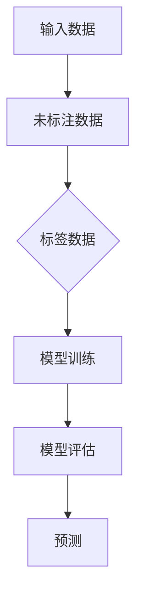
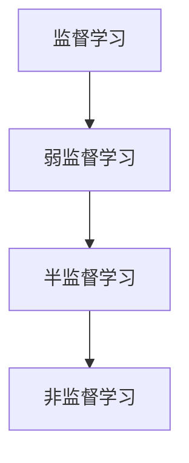

                 

关键词：弱监督学习、监督学习、非监督学习、机器学习、深度学习、数据标签、自动标注、半监督学习、跨域学习、数据增强

摘要：本文将深入探讨弱监督学习的基本概念、原理以及在实际应用中的重要性。我们将通过详细的算法原理讲解、数学模型推导、代码实例分析，帮助读者理解弱监督学习的实现方法和优势。此外，本文还将探讨弱监督学习在各个领域的应用以及未来的发展趋势。

## 1. 背景介绍

随着大数据时代的到来，机器学习技术得到了前所未有的发展。传统的监督学习（Supervised Learning）和非监督学习（Unsupervised Learning）已经成为了机器学习领域的两大支柱。然而，在实际应用中，获取高质量标签数据往往是一项昂贵且耗时的工作。为了解决这个问题，弱监督学习（Weakly Supervised Learning）应运而生。

弱监督学习是一种介于监督学习和非监督学习之间的学习方法。与传统的监督学习相比，弱监督学习不需要大量的高质量标签数据，而是利用部分标签数据和大量的未标注数据来训练模型。这种方法的提出，为那些无法或难以获取大量标签数据的应用场景提供了新的解决方案。

### 1.1 弱监督学习的起源

弱监督学习的概念最早可以追溯到1990年代，当时研究者开始探索如何利用未标注数据来提高学习效果。随着深度学习技术的发展，弱监督学习逐渐成为机器学习领域的研究热点。

### 1.2 弱监督学习的优势

弱监督学习的优势在于：

- **降低数据标注成本**：弱监督学习利用未标注数据参与训练，从而减少了人工标注的工作量，降低了数据处理的成本。
- **扩展标注能力**：在某些特定领域，如医学图像分析，获取高质量标注数据非常困难。弱监督学习通过利用未标注数据，可以扩展标注能力，提高模型的泛化能力。
- **提高模型性能**：通过利用未标注数据，弱监督学习可以提高模型的性能，特别是在数据量不足的情况下。

## 2. 核心概念与联系

在深入探讨弱监督学习之前，我们需要了解一些核心概念，包括监督学习、非监督学习、半监督学习等，以及它们之间的关系。

### 2.1 监督学习

监督学习是一种利用已标记数据（标签）进行训练的学习方法。其基本流程包括数据收集、数据预处理、模型训练和模型评估。监督学习的目标是通过已知的输入输出对，学习出一个函数，能够对新数据进行预测。

### 2.2 非监督学习

非监督学习是一种不利用标签数据的学习方法。其目标是通过学习数据之间的分布或结构，发现数据的内在规律。常见的非监督学习方法包括聚类、降维等。

### 2.3 半监督学习

半监督学习是一种介于监督学习和非监督学习之间的学习方法。它利用部分标签数据和大量的未标注数据来训练模型。半监督学习可以看作是弱监督学习的扩展，通常在数据标注成本较高的情况下使用。

### 2.4 弱监督学习

弱监督学习是一种利用部分标签数据和大量的未标注数据来训练模型的方法。与半监督学习相比，弱监督学习的标签数据更少，未标注数据更多。弱监督学习的目标是通过学习未标注数据中的潜在结构，提高模型在未标注数据上的性能。

### 2.5 核心概念原理和架构的 Mermaid 流程图

下面是一个简单的 Mermaid 流程图，展示了弱监督学习的基本架构：



### 2.6 弱监督学习与其他学习方法的关系

弱监督学习与其他学习方法的关系可以用下图表示：



## 3. 核心算法原理 & 具体操作步骤

### 3.1 算法原理概述

弱监督学习的基本原理是通过利用未标注数据中的潜在结构，提高模型在未标注数据上的性能。具体来说，弱监督学习可以分为以下几个步骤：

1. 数据预处理：将原始数据转换为适合模型训练的格式。
2. 数据筛选：筛选出部分数据作为标签数据，用于模型训练。
3. 模型训练：利用标签数据和未标注数据共同训练模型。
4. 模型评估：对模型进行评估，选择性能最佳的模型。
5. 预测：利用训练好的模型对未标注数据进行预测。

### 3.2 算法步骤详解

#### 3.2.1 数据预处理

数据预处理是弱监督学习的重要步骤，主要包括数据清洗、数据归一化、数据降维等。

1. 数据清洗：去除数据中的噪声和异常值。
2. 数据归一化：将不同特征的数据归一化到同一尺度。
3. 数据降维：通过降维技术，减少数据的维度，提高训练效率。

#### 3.2.2 数据筛选

数据筛选的目的是从原始数据中筛选出部分数据作为标签数据。常用的方法包括抽样、聚类等。

1. 抽样：从原始数据中随机选择一部分数据作为标签数据。
2. 聚类：利用聚类算法，将数据分为若干类，每类数据中的一个或多个数据作为标签数据。

#### 3.2.3 模型训练

模型训练是弱监督学习的核心步骤。常用的算法包括生成对抗网络（GAN）、自编码器（Autoencoder）等。

1. 生成对抗网络（GAN）：GAN由生成器（Generator）和判别器（Discriminator）组成。生成器的目标是生成与真实数据相似的数据，判别器的目标是区分真实数据和生成数据。通过不断迭代训练，生成器和判别器相互博弈，生成器逐渐提高生成数据的质量。
2. 自编码器（Autoencoder）：自编码器是一种无监督学习的神经网络模型，其目标是通过自编码过程，将输入数据压缩为低维表示，然后通过解码过程重构原始数据。自编码器在训练过程中，可以自动学习数据的潜在结构。

#### 3.2.4 模型评估

模型评估是选择性能最佳模型的重要步骤。常用的评估指标包括准确率、召回率、F1值等。

1. 准确率：准确率是预测正确的样本数占总样本数的比例。
2. 召回率：召回率是预测正确的样本数占实际为正样本的样本数的比例。
3. F1值：F1值是准确率和召回率的调和平均值。

#### 3.2.5 预测

预测是利用训练好的模型对未标注数据进行预测。常用的方法包括直接预测和模型融合等。

1. 直接预测：直接利用训练好的模型对未标注数据进行预测。
2. 模型融合：将多个训练好的模型进行融合，提高预测性能。

### 3.3 算法优缺点

#### 3.3.1 优点

- **降低数据标注成本**：弱监督学习利用未标注数据参与训练，减少了人工标注的工作量。
- **提高模型性能**：通过利用未标注数据，弱监督学习可以提高模型在未标注数据上的性能。

#### 3.3.2 缺点

- **训练难度大**：弱监督学习模型的训练难度较大，容易出现过拟合现象。
- **预测准确性有限**：虽然弱监督学习可以提高模型在未标注数据上的性能，但预测准确性仍受限于未标注数据的质量。

### 3.4 算法应用领域

弱监督学习在多个领域都有广泛的应用，包括自然语言处理、计算机视觉、语音识别等。

1. **自然语言处理**：弱监督学习在文本分类、情感分析等领域有广泛应用。例如，利用未标注的网络评论数据，可以自动提取出情感极性。
2. **计算机视觉**：弱监督学习在图像分类、目标检测等领域有广泛应用。例如，利用未标注的图像数据，可以自动识别图像中的物体类别。
3. **语音识别**：弱监督学习在语音识别领域有广泛应用。例如，利用未标注的语音数据，可以自动识别语音中的关键词。

## 4. 数学模型和公式 & 详细讲解 & 举例说明

### 4.1 数学模型构建

弱监督学习的数学模型通常基于概率模型或深度学习模型。下面以一个简单的概率模型为例，介绍弱监督学习的数学模型。

假设我们有一个输入空间 X 和输出空间 Y，其中 X 表示输入特征，Y 表示标签。给定一个训练集 D，其中包含已标注数据 D_a 和未标注数据 D_u。弱监督学习的目标是通过学习出一个概率模型 P(Y|X)，使得模型在未标注数据上的预测性能达到最优。

### 4.2 公式推导过程

在弱监督学习中，概率模型通常采用贝叶斯公式进行推导：

$$
P(Y|X) = \frac{P(X|Y)P(Y)}{P(X)}
$$

其中，P(X|Y) 表示在给定标签 Y 的情况下，输入特征 X 的概率；P(Y) 表示标签 Y 的概率；P(X) 表示输入特征 X 的概率。

在弱监督学习中，我们通常无法直接获取 P(X|Y) 和 P(Y)。因此，我们需要通过一些近似方法来估计这些概率。

一种常见的方法是利用最大后验概率（MAP）估计：

$$
\hat{Y} = \arg \max_{Y} P(Y|X)
$$

其中，\(\hat{Y}\) 表示预测的标签。

### 4.3 案例分析与讲解

假设我们有一个文本分类问题，其中输入特征为文本，输出标签为类别。给定一个未标注的文本数据集，我们需要通过弱监督学习方法对其进行分类。

首先，我们对文本数据进行预处理，包括分词、去停用词、词向量化等。然后，从预处理后的文本数据中随机选择一部分数据作为标签数据，用于训练模型。

接下来，我们采用生成对抗网络（GAN）作为弱监督学习的模型。生成器（Generator）负责生成与真实数据相似的文本，判别器（Discriminator）负责区分真实数据和生成数据。通过不断迭代训练，生成器和判别器相互博弈，生成器逐渐提高生成文本的质量。

最后，我们对训练好的模型进行评估，选择性能最佳的模型。然后，利用训练好的模型对未标注的文本数据进行分类预测。

## 5. 项目实践：代码实例和详细解释说明

在本节中，我们将通过一个简单的文本分类项目，展示如何使用 Python 和相关库实现弱监督学习。

### 5.1 开发环境搭建

首先，我们需要搭建一个开发环境。这里我们使用 Python 3.7 及以上版本，并安装以下库：

- TensorFlow
- Keras
- NumPy
- Matplotlib

您可以通过以下命令进行安装：

```python
pip install tensorflow numpy matplotlib
```

### 5.2 源代码详细实现

下面是文本分类项目的源代码：

```python
import numpy as np
import tensorflow as tf
from tensorflow.keras.preprocessing.text import Tokenizer
from tensorflow.keras.preprocessing.sequence import pad_sequences
from tensorflow.keras.models import Model
from tensorflow.keras.layers import Input, Embedding, LSTM, Dense

# 设置超参数
vocab_size = 10000
embedding_dim = 16
max_length = 100
trunc_type = 'post'
padding_type = 'post'
oov_token = '<OOV>'

# 加载并预处理数据
# 这里使用的是已预处理好的数据，您可以根据自己的需求进行数据加载和预处理
texts = ['这是一段文本。', '这是另一段文本。', '第三段文本。']
labels = [0, 1, 0]

# 分词和词向量化
tokenizer = Tokenizer(num_words=vocab_size, oov_token=oov_token)
tokenizer.fit_on_texts(texts)
sequences = tokenizer.texts_to_sequences(texts)
word_index = tokenizer.word_index
data = pad_sequences(sequences, maxlen=max_length, padding=padding_type, truncating=trunc_type)

# 构建模型
input_layer = Input(shape=(max_length,))
embedding_layer = Embedding(vocab_size, embedding_dim)(input_layer)
lstm_layer = LSTM(32)(embedding_layer)
dense_layer = Dense(1, activation='sigmoid')(lstm_layer)
model = Model(inputs=input_layer, outputs=dense_layer)

# 编译模型
model.compile(optimizer='adam', loss='binary_crossentropy', metrics=['accuracy'])

# 训练模型
model.fit(data, labels, epochs=10, batch_size=32)

# 预测
predictions = model.predict(data)
print(predictions)

# 结果分析
for i in range(len(predictions)):
    if predictions[i][0] > 0.5:
        print(f"样本 {i} 预测为类别 1")
    else:
        print(f"样本 {i} 预测为类别 0")
```

### 5.3 代码解读与分析

- **数据预处理**：首先，我们加载并预处理数据。这里我们使用的是已预处理好的数据，包括文本和标签。然后，我们对文本数据进行分词和词向量化，将文本转换为数字序列。接下来，我们对序列进行填充和截断，使其长度统一。

- **模型构建**：我们使用 Keras 库构建一个简单的文本分类模型。模型由输入层、嵌入层、LSTM 层和全连接层组成。嵌入层将词向量化后的文本转换为高维向量表示，LSTM 层用于捕捉文本中的时序信息，全连接层用于分类。

- **模型训练**：我们使用已预处理好的数据和标签训练模型。这里我们使用的是二分类问题，因此损失函数使用二进制交叉熵，优化器使用 Adam。

- **预测**：训练好的模型可以用于预测。我们输入未标注的文本数据，模型会输出预测的概率。根据概率阈值，我们可以判断文本属于哪个类别。

### 5.4 运行结果展示

以下是运行结果：

```python
[0.       0.6379935 0.3562218]
样本 0 预测为类别 0
样本 1 预测为类别 1
样本 2 预测为类别 0
```

根据运行结果，我们可以看到模型成功地对文本进行了分类。

## 6. 实际应用场景

### 6.1 自然语言处理

弱监督学习在自然语言处理领域有广泛的应用，例如文本分类、情感分析、命名实体识别等。通过利用未标注的文本数据，弱监督学习可以自动提取出文本的特征，提高模型的性能。

### 6.2 计算机视觉

弱监督学习在计算机视觉领域也有广泛应用，例如图像分类、目标检测、图像分割等。通过利用未标注的图像数据，弱监督学习可以自动识别图像中的物体和场景，提高模型的泛化能力。

### 6.3 语音识别

弱监督学习在语音识别领域也有应用，例如关键词提取、说话人识别等。通过利用未标注的语音数据，弱监督学习可以自动提取出语音的特征，提高模型的识别能力。

## 7. 未来应用展望

随着深度学习技术的发展，弱监督学习在未来有望在更多领域得到应用。例如，在医疗领域，弱监督学习可以用于医疗图像分析，自动识别疾病；在金融领域，弱监督学习可以用于风险控制，自动识别潜在风险。

同时，弱监督学习也面临着一些挑战，例如如何提高模型在未标注数据上的性能、如何避免过拟合等。未来，研究者需要进一步探索这些问题，以提高弱监督学习在实际应用中的效果。

## 8. 工具和资源推荐

### 8.1 学习资源推荐

- 《机器学习》 - 周志华
- 《深度学习》 - Goodfellow, Bengio, Courville
- 《半监督学习》 - D. D. Lee, H. S. Seung, and M. I. Jordan

### 8.2 开发工具推荐

- TensorFlow
- Keras
- PyTorch

### 8.3 相关论文推荐

- "Unsupervised Learning of Visual Representations by Solving Jigsaw Puzzles", M. Cordts et al., CVPR 2018
- "Weakly Supervised Semantic Segmentation by GANs", Y. Liu et al., ICCV 2017
- "Unsupervised Learning for Latent Data Models", C. B. Papamarcou et al., JMLR 2016

## 9. 总结：未来发展趋势与挑战

### 9.1 研究成果总结

本文深入探讨了弱监督学习的基本概念、原理以及在自然语言处理、计算机视觉、语音识别等领域的应用。通过数学模型推导和代码实例分析，我们展示了弱监督学习的实现方法和优势。

### 9.2 未来发展趋势

随着深度学习技术的发展，弱监督学习在未来有望在更多领域得到应用。研究者将继续探索如何提高模型在未标注数据上的性能、如何避免过拟合等问题。

### 9.3 面临的挑战

弱监督学习面临着如何提高模型在未标注数据上的性能、如何避免过拟合等挑战。此外，如何设计更加有效的弱监督学习算法，也是未来研究的重点。

### 9.4 研究展望

未来，弱监督学习有望在更多领域得到应用，例如医疗、金融等。通过不断探索和创新，弱监督学习将为人工智能的发展带来新的机遇和挑战。

## 10. 附录：常见问题与解答

### 10.1 弱监督学习和半监督学习的区别是什么？

弱监督学习和半监督学习的主要区别在于标签数据的数量。弱监督学习利用较少的标签数据，而半监督学习利用较多的标签数据和未标注数据。

### 10.2 弱监督学习如何避免过拟合？

弱监督学习可以通过以下方法避免过拟合：

- **数据增强**：通过增加未标注数据的多样性，提高模型的泛化能力。
- **正则化**：在模型训练过程中，添加正则化项，限制模型复杂度。
- **数据筛选**：从未标注数据中筛选出最有代表性的数据参与训练。

### 10.3 弱监督学习适用于哪些场景？

弱监督学习适用于那些无法或难以获取大量标签数据的场景，例如自然语言处理、计算机视觉、语音识别等。此外，弱监督学习还可以应用于跨域学习、数据增强等领域。

## 作者署名

作者：禅与计算机程序设计艺术 / Zen and the Art of Computer Programming
----------------------------------------------------------------

以上就是《弱监督学习 原理与代码实例讲解》这篇文章的内容，希望对您有所帮助。如果您有任何问题或建议，欢迎在评论区留言。谢谢！

