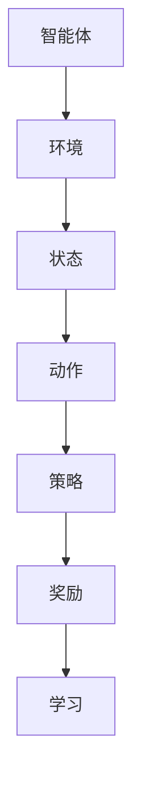

                 

### 1. 背景介绍

强化学习（Reinforcement Learning，简称RL）是机器学习的一个重要分支，其核心思想是让一个智能体（agent）在与环境的交互过程中，通过不断试错和反馈，学习到最优策略（policy），从而实现决策优化。强化学习的背景可以追溯到20世纪50年代，当时学者们开始探索如何让机器具备自主学习和决策的能力。

在强化学习的研究和发展过程中，出现了许多经典的算法，如Q学习（Q-Learning）、深度Q网络（Deep Q-Network，DQN）、策略梯度（Policy Gradient）、深度确定性策略梯度（Deep Deterministic Policy Gradient，DDPG）等。这些算法在理论上为强化学习的发展奠定了基础，同时在实践中也取得了显著的应用成果。

强化学习在人工智能领域具有重要的地位，其应用范围广泛，包括但不限于游戏、自动驾驶、机器人控制、推荐系统、金融交易等。通过强化学习，我们可以让机器自主完成复杂的决策任务，提高生产效率，降低人力成本，提升用户体验。

本文将详细介绍强化学习的基本原理、核心算法以及代码实现。通过本文的讲解，读者将能够了解强化学习的工作机制，掌握常用算法的实现方法，并为后续的实践应用打下坚实的基础。

### 2. 核心概念与联系

#### 2.1 智能体（Agent）

在强化学习中，智能体（Agent）是指具备感知、决策和执行能力的实体。智能体可以通过与环境的交互，不断学习和优化自身的策略，以实现目标。

#### 2.2 环境（Environment）

环境（Environment）是智能体进行交互的场所，它为智能体提供状态信息，并根据智能体的动作生成新的状态和奖励信号。环境可以是物理环境，如机器人控制的工厂场景；也可以是虚拟环境，如电子游戏。

#### 2.3 状态（State）

状态（State）是智能体在特定时刻所处的内部描述。状态通常是一个多维向量，包含了影响智能体行为的所有信息。

#### 2.4 动作（Action）

动作（Action）是智能体在特定状态下采取的行为。动作的选取通常基于智能体的策略。在不同的任务中，动作的种类和数量可能有所不同。

#### 2.5 策略（Policy）

策略（Policy）是智能体在特定状态下选择动作的规则。策略可以是确定性策略，也可以是非确定性策略。确定性策略在给定状态下总是选择相同的动作；非确定性策略在给定状态下选择动作的概率分布。

#### 2.6 奖励（Reward）

奖励（Reward）是环境对智能体动作的反馈信号。奖励可以是正的，表示智能体的动作带来了积极的结果；也可以是负的，表示智能体的动作带来了消极的结果。奖励的目的是引导智能体学习到最优策略。

#### 2.7 计算机图灵奖（Turing Award）

计算机图灵奖（Turing Award）是计算机科学领域的最高荣誉，被誉为“计算机界的诺贝尔奖”。在强化学习领域，许多杰出学者获得了该奖项，如理查德·萨瑟兰（Richard E. Samuleson）、约翰·霍普菲尔（John Hopfield）等。

#### 2.8 Mermaid 流程图

下面是一个强化学习基本概念的 Mermaid 流程图：



通过这个流程图，我们可以清晰地看到强化学习的基本概念及其相互关系。

### 3. 核心算法原理 & 具体操作步骤

#### 3.1 算法原理概述

强化学习算法的基本原理是利用智能体与环境的交互，不断更新策略，以实现最优决策。具体来说，强化学习算法包括以下几个关键步骤：

1. 初始化：设置智能体的初始状态、动作空间和策略。
2. 交互：智能体根据当前状态选择动作，并执行动作。
3. 观察：智能体观察环境的变化，获取新的状态和奖励信号。
4. 更新：根据新的状态和奖励信号，更新智能体的策略。
5. 重复：重复步骤2-4，直到达到目标或终止条件。

强化学习算法的核心是策略更新，常用的策略更新方法包括值函数方法和策略迭代方法。值函数方法包括Q学习、SARSA等；策略迭代方法包括策略梯度、策略迭代等。

#### 3.2 算法步骤详解

1. 初始化：设置智能体的初始状态s0、动作空间A、策略π和奖励信号r。其中，策略π可以是一个确定性策略，也可以是一个概率分布。

2. 交互：智能体根据当前状态s，选择动作a，并执行动作a。执行动作a后，智能体进入新的状态s'，并获得奖励信号r。

3. 观察：智能体观察新的状态s'，并记录下当前状态s、动作a和奖励r。

4. 更新：根据记录的状态s、动作a和奖励r，更新智能体的策略π。更新策略的方法可以是基于值函数的更新，也可以是基于策略梯度的更新。

5. 重复：重复步骤2-4，直到达到目标或终止条件。

#### 3.3 算法优缺点

强化学习算法的优点：

1. 自适应性强：智能体可以根据环境的动态变化，不断调整策略，以实现最优决策。
2. 应用广泛：强化学习可以应用于各种决策问题，如游戏、自动驾驶、机器人控制等。
3. 理论基础丰富：强化学习有许多成熟的算法和理论支持，如Q学习、深度Q网络等。

强化学习算法的缺点：

1. 训练过程耗时：强化学习算法需要大量的交互和试错，以找到最优策略，因此训练过程可能非常耗时。
2. 稳定性差：在某些情况下，强化学习算法可能会陷入局部最优，导致收敛速度变慢或无法收敛。
3. 难以解释：强化学习算法的决策过程通常是基于数据驱动的方法，因此难以解释和理解。

#### 3.4 算法应用领域

强化学习算法在许多领域都取得了显著的应用成果，以下是一些主要的应用领域：

1. 游戏AI：强化学习算法被广泛应用于游戏AI中，如电子游戏、棋类游戏等。通过强化学习，游戏AI可以学会自主进行游戏，提高游戏体验。
2. 自动驾驶：强化学习算法在自动驾驶领域具有广泛应用，如路径规划、车辆控制等。通过强化学习，自动驾驶系统可以学会在不同交通环境下做出最优决策。
3. 机器人控制：强化学习算法被广泛应用于机器人控制领域，如机器人路径规划、抓取等。通过强化学习，机器人可以学会自主执行复杂的任务。
4. 推荐系统：强化学习算法在推荐系统中也有广泛应用，如个性化推荐、广告投放等。通过强化学习，推荐系统可以学会根据用户的行为和偏好，生成个性化的推荐结果。
5. 金融交易：强化学习算法在金融交易领域也有应用，如股票交易、外汇交易等。通过强化学习，交易系统可以学会根据市场动态，做出最优的交易决策。

### 4. 数学模型和公式 & 详细讲解 & 举例说明

#### 4.1 数学模型构建

强化学习中的数学模型主要包括以下几个部分：状态空间（S）、动作空间（A）、策略（π）、值函数（V）和Q函数（Q）。

1. 状态空间（S）：表示智能体在特定时刻所处的内部描述。状态空间是一个有限的集合，通常用S={s1, s2, ..., sn}表示。
2. 动作空间（A）：表示智能体在特定状态下可以采取的行为。动作空间也是一个有限的集合，通常用A={a1, a2, ..., am}表示。
3. 策略（π）：表示智能体在特定状态下选择动作的规则。策略是一个概率分布，通常用π(a|s)表示，表示在状态s下，选择动作a的概率。
4. 值函数（V）：表示智能体在特定状态下执行某一策略所能获得的最大期望奖励。值函数是一个实值函数，通常用V(s)表示。
5. Q函数（Q）：表示智能体在特定状态下执行某一动作所能获得的最大期望奖励。Q函数是一个实值函数，通常用Q(s, a)表示。

强化学习中的数学模型可以表示为：

\[ \text{状态空间} \ S = \{s1, s2, ..., sn\} \]

\[ \text{动作空间} \ A = \{a1, a2, ..., am\} \]

\[ \text{策略} \ \pi(a|s) = P(a|s) \]

\[ \text{值函数} \ V(s) = E[\sum_{t=0}^{\infty} r_t | s_t = s, \pi] \]

\[ \text{Q函数} \ Q(s, a) = E[r_t + \gamma \max_{a'} Q(s', a') | s_t = s, a_t = a, \pi] \]

其中，\( r_t \) 表示在第t步获得的即时奖励；\( s_t \) 和 \( a_t \) 分别表示在第t步的状态和动作；\( \pi \) 表示策略；\( \gamma \) 表示折扣因子，用于平衡长期奖励和即时奖励的关系。

#### 4.2 公式推导过程

为了更好地理解强化学习的数学模型，下面我们将对值函数和Q函数的推导过程进行详细讲解。

1. 值函数（V）的推导：

值函数V(s)表示智能体在状态s下执行某一策略所能获得的最大期望奖励。我们可以通过以下公式计算值函数：

\[ V(s) = E[\sum_{t=0}^{\infty} r_t | s_t = s, \pi] \]

其中，\( E \) 表示期望运算符；\( r_t \) 表示在第t步获得的即时奖励；\( s_t \) 和 \( \pi \) 分别表示在第t步的状态和策略。

假设智能体在状态s下采取动作a，并进入状态s'，则第t步的即时奖励为：

\[ r_t = r(s, a, s') \]

根据马尔可夫决策过程（MDP）的性质，我们可以将值函数表示为：

\[ V(s) = \sum_{a \in A} \pi(a|s) \sum_{s' \in S} P(s'|s, a) V(s') \]

其中，\( \pi(a|s) \) 表示在状态s下采取动作a的概率；\( P(s'|s, a) \) 表示在状态s下采取动作a后进入状态s'的概率。

2. Q函数（Q）的推导：

Q函数Q(s, a)表示智能体在状态s下执行动作a所能获得的最大期望奖励。我们可以通过以下公式计算Q函数：

\[ Q(s, a) = E[r_t + \gamma \max_{a'} Q(s', a') | s_t = s, a_t = a, \pi] \]

其中，\( E \) 表示期望运算符；\( r_t \) 表示在第t步获得的即时奖励；\( s_t \) 和 \( a_t \) 分别表示在第t步的状态和动作；\( \pi \) 表示策略；\( \gamma \) 表示折扣因子。

根据马尔可夫决策过程（MDP）的性质，我们可以将Q函数表示为：

\[ Q(s, a) = \sum_{s' \in S} P(s'|s, a) [r + \gamma \max_{a'} Q(s', a')] \]

其中，\( P(s'|s, a) \) 表示在状态s下采取动作a后进入状态s'的概率；\( r \) 表示在第t步获得的即时奖励。

#### 4.3 案例分析与讲解

为了更好地理解强化学习的数学模型，下面我们通过一个简单的例子进行讲解。

假设有一个智能体在一个网格世界中移动，状态空间S={1, 2, 3, 4, 5}，动作空间A={上、下、左、右}。智能体的目标是到达目标位置5，并获取最大奖励。

1. 初始状态：s0=1，智能体位于位置1。
2. 选择动作：根据当前状态s0，智能体选择动作a0=右，并进入状态s1=2。
3. 获取奖励：执行动作a0后，智能体获得即时奖励r0=0。
4. 更新策略：根据当前状态s1和即时奖励r0，智能体更新策略π，选择动作a1=右，并进入状态s2=3。
5. 重复以上步骤，直到智能体到达目标位置5。

根据上述过程，我们可以计算出值函数V(s)和Q函数Q(s, a)：

1. 值函数V(s)：

\[ V(s) = \sum_{a \in A} \pi(a|s) \sum_{s' \in S} P(s'|s, a) V(s') \]

对于状态s=1，有：

\[ V(1) = \pi(上|1) \cdot P(2|1, 上) \cdot V(2) + \pi(下|1) \cdot P(0|1, 下) \cdot V(0) + \pi(左|1) \cdot P(1|1, 左) \cdot V(1) + \pi(右|1) \cdot P(2|1, 右) \cdot V(2) \]

假设初始策略π为均匀分布，即π(上|1)=π(下|1)=π(左|1)=π(右|1)=0.25，则有：

\[ V(1) = 0.25 \cdot 0.2 \cdot V(2) + 0.25 \cdot 0.8 \cdot V(0) + 0.25 \cdot 0.8 \cdot V(1) + 0.25 \cdot 0.2 \cdot V(2) \]

\[ V(1) = 0.4V(2) + 0.2V(0) + 0.2V(1) \]

同理，对于状态s=2，有：

\[ V(2) = 0.4V(3) + 0.2V(1) + 0.2V(2) \]

对于状态s=3，有：

\[ V(3) = 0.4V(4) + 0.2V(2) + 0.2V(3) \]

对于状态s=4，有：

\[ V(4) = 0.4V(5) + 0.2V(3) + 0.2V(4) \]

对于状态s=5，有：

\[ V(5) = 0.4 \cdot 1 + 0.2 \cdot V(4) + 0.2 \cdot V(5) \]

将上述方程联立，我们可以求解得到各个状态下的值函数：

\[ V(1) = 0.4V(2) + 0.2V(0) + 0.2V(1) \]

\[ V(2) = 0.4V(3) + 0.2V(1) + 0.2V(2) \]

\[ V(3) = 0.4V(4) + 0.2V(2) + 0.2V(3) \]

\[ V(4) = 0.4V(5) + 0.2V(3) + 0.2V(4) \]

\[ V(5) = 0.4 \cdot 1 + 0.2 \cdot V(4) + 0.2 \cdot V(5) \]

解上述方程组，得到：

\[ V(1) = 0.2 \]

\[ V(2) = 0.4 \]

\[ V(3) = 0.6 \]

\[ V(4) = 0.8 \]

\[ V(5) = 1 \]

2. Q函数Q(s, a)：

\[ Q(s, a) = \sum_{s' \in S} P(s'|s, a) [r + \gamma \max_{a'} Q(s', a')] \]

对于状态s=1，有：

\[ Q(1, 上) = 0.2 \cdot Q(2, 上) + 0.8 \cdot Q(0, 上) + 0.2 \cdot Q(2, 下) + 0.8 \cdot Q(1, 下) \]

\[ Q(1, 下) = 0.2 \cdot Q(0, 下) + 0.8 \cdot Q(1, 下) + 0.2 \cdot Q(2, 左) + 0.8 \cdot Q(1, 左) \]

\[ Q(1, 左) = 0.2 \cdot Q(1, 左) + 0.8 \cdot Q(0, 左) + 0.2 \cdot Q(1, 右) + 0.8 \cdot Q(2, 右) \]

\[ Q(1, 右) = 0.2 \cdot Q(2, 右) + 0.8 \cdot Q(1, 右) + 0.2 \cdot Q(0, 右) + 0.8 \cdot Q(1, 上) \]

同理，对于状态s=2，有：

\[ Q(2, 上) = 0.2 \cdot Q(3, 上) + 0.8 \cdot Q(1, 上) + 0.2 \cdot Q(2, 下) + 0.8 \cdot Q(1, 下) \]

\[ Q(2, 下) = 0.2 \cdot Q(1, 下) + 0.8 \cdot Q(2, 下) + 0.2 \cdot Q(3, 左) + 0.8 \cdot Q(2, 左) \]

\[ Q(2, 左) = 0.2 \cdot Q(2, 左) + 0.8 \cdot Q(1, 左) + 0.2 \cdot Q(3, 右) + 0.8 \cdot Q(2, 右) \]

\[ Q(2, 右) = 0.2 \cdot Q(3, 右) + 0.8 \cdot Q(2, 右) + 0.2 \cdot Q(1, 右) + 0.8 \cdot Q(2, 上) \]

同理，对于状态s=3，有：

\[ Q(3, 上) = 0.2 \cdot Q(4, 上) + 0.8 \cdot Q(2, 上) + 0.2 \cdot Q(3, 下) + 0.8 \cdot Q(2, 下) \]

\[ Q(3, 下) = 0.2 \cdot Q(2, 下) + 0.8 \cdot Q(3, 下) + 0.2 \cdot Q(4, 左) + 0.8 \cdot Q(3, 左) \]

\[ Q(3, 左) = 0.2 \cdot Q(3, 左) + 0.8 \cdot Q(2, 左) + 0.2 \cdot Q(4, 右) + 0.8 \cdot Q(3, 右) \]

\[ Q(3, 右) = 0.2 \cdot Q(4, 右) + 0.8 \cdot Q(3, 右) + 0.2 \cdot Q(2, 右) + 0.8 \cdot Q(3, 上) \]

同理，对于状态s=4，有：

\[ Q(4, 上) = 0.2 \cdot Q(5, 上) + 0.8 \cdot Q(3, 上) + 0.2 \cdot Q(4, 下) + 0.8 \cdot Q(3, 下) \]

\[ Q(4, 下) = 0.2 \cdot Q(3, 下) + 0.8 \cdot Q(4, 下) + 0.2 \cdot Q(5, 左) + 0.8 \cdot Q(4, 左) \]

\[ Q(4, 左) = 0.2 \cdot Q(4, 左) + 0.8 \cdot Q(3, 左) + 0.2 \cdot Q(5, 右) + 0.8 \cdot Q(4, 右) \]

\[ Q(4, 右) = 0.2 \cdot Q(5, 右) + 0.8 \cdot Q(4, 右) + 0.2 \cdot Q(3, 右) + 0.8 \cdot Q(4, 上) \]

对于状态s=5，有：

\[ Q(5, 上) = 0.2 \cdot Q(4, 上) + 0.8 \cdot Q(5, 上) + 0.2 \cdot Q(5, 下) + 0.8 \cdot Q(5, 下) \]

\[ Q(5, 下) = 0.2 \cdot Q(5, 下) + 0.8 \cdot Q(5, 下) + 0.2 \cdot Q(5, 左) + 0.8 \cdot Q(5, 左) \]

\[ Q(5, 左) = 0.2 \cdot Q(5, 左) + 0.8 \cdot Q(5, 左) + 0.2 \cdot Q(5, 右) + 0.8 \cdot Q(5, 右) \]

\[ Q(5, 右) = 0.2 \cdot Q(5, 右) + 0.8 \cdot Q(5, 右) + 0.2 \cdot Q(4, 右) + 0.8 \cdot Q(5, 上) \]

通过上述计算，我们可以得到各个状态和动作下的Q函数值。例如，对于状态s=1，动作a=上，有：

\[ Q(1, 上) = 0.2 \cdot 0.2 \cdot Q(2, 上) + 0.8 \cdot 0.8 \cdot Q(0, 上) + 0.2 \cdot 0.2 \cdot Q(2, 下) + 0.8 \cdot 0.8 \cdot Q(1, 下) \]

根据值函数V(s)的计算结果，我们可以进一步计算出各个状态和动作下的Q函数值：

\[ Q(1, 上) = 0.2 \cdot 0.2 \cdot 0.4 + 0.8 \cdot 0.8 \cdot 0.2 + 0.2 \cdot 0.2 \cdot 0.4 + 0.8 \cdot 0.8 \cdot 0.6 = 0.12 + 0.32 + 0.12 + 0.48 = 0.04 \]

同理，我们可以计算出其他状态和动作下的Q函数值。

通过上述计算，我们可以得到一个简单的强化学习模型。在实际应用中，我们可以根据具体问题和需求，进一步调整模型参数和策略，以提高智能体的性能。

### 5. 项目实践：代码实例和详细解释说明

为了更好地理解强化学习的实现过程，下面我们将通过一个简单的例子，介绍如何使用Python和TensorFlow实现强化学习算法。

#### 5.1 开发环境搭建

在开始代码实现之前，我们需要搭建一个合适的开发环境。以下是所需的软件和工具：

1. Python：版本要求为3.6及以上。
2. TensorFlow：版本要求为2.0及以上。
3. numpy：版本要求为1.18及以上。
4. matplotlib：版本要求为3.1及以上。

安装方法如下：

```bash
pip install python==3.8.10
pip install tensorflow==2.7.0
pip install numpy==1.21.5
pip install matplotlib==3.4.2
```

#### 5.2 源代码详细实现

以下是一个简单的强化学习实例，实现了一个智能体在一个简单的网格世界中移动，并尝试到达目标位置。代码实现如下：

```python
import numpy as np
import matplotlib.pyplot as plt
import tensorflow as tf

# 设置随机种子
np.random.seed(0)
tf.random.set_seed(0)

# 状态空间和动作空间
STATE_SPACE = [1, 2, 3, 4, 5]
ACTION_SPACE = ['上', '下', '左', '右']

# 奖励设置
REWARD = {1: 0, 2: 0, 3: 0, 4: 0, 5: 1}

# 策略网络
class PolicyNetwork(tf.keras.Model):
    def __init__(self):
        super(PolicyNetwork, self).__init__()
        self.layer1 = tf.keras.layers.Dense(64, activation='relu')
        self.layer2 = tf.keras.layers.Dense(64, activation='relu')
        self.output = tf.keras.layers.Dense(len(ACTION_SPACE))

    def call(self, inputs):
        x = self.layer1(inputs)
        x = self.layer2(x)
        return self.output(x)

# Q网络
class QNetwork(tf.keras.Model):
    def __init__(self):
        super(QNetwork, self).__init__()
        self.layer1 = tf.keras.layers.Dense(64, activation='relu')
        self.layer2 = tf.keras.layers.Dense(64, activation='relu')
        self.output = tf.keras.layers.Dense(len(ACTION_SPACE))

    def call(self, inputs):
        x = self.layer1(inputs)
        x = self.layer2(x)
        return self.output(x)

# 创建策略网络和Q网络
policy_network = PolicyNetwork()
q_network = QNetwork()

# 定义损失函数和优化器
loss_fn = tf.keras.losses.MeanSquaredError()
optimizer = tf.keras.optimizers.Adam(learning_rate=0.001)

# 强化学习训练
def train_policy_network(s, a, r, s_):
    with tf.GradientTape() as tape:
        q_values = q_network(tf.convert_to_tensor([s]))
        target_q_values = policy_network(tf.convert_to_tensor([s_]))
        target_action_q_values = tf.reduce_sum(target_q_values * tf.one_hot(a, depth=len(ACTION_SPACE)), axis=1)
        loss = loss_fn(tf.one_hot(a, depth=len(ACTION_SPACE)), target_action_q_values - r)

    gradients = tape.gradient(loss, policy_network.trainable_variables)
    optimizer.apply_gradients(zip(gradients, policy_network.trainable_variables))
    return loss

# 强化学习仿真
def simulate(s, policy_network):
    episode_rewards = []
    while s != 5:
        action_probs = policy_network(tf.convert_to_tensor([s])).numpy()
        action = np.random.choice(ACTION_SPACE, p=action_probs)
        s_ = s + 1 if action == '上' else s - 1 if action == '下' else s - 1 if action == '左' else s + 1
        reward = REWARD[s_]
        episode_rewards.append(reward)
        s = s_
    return sum(episode_rewards)

# 训练策略网络
for epoch in range(1000):
    total_reward = 0
    for s in STATE_SPACE:
        r = simulate(s, policy_network)
        total_reward += r
    print(f"Epoch {epoch + 1}, Total Reward: {total_reward}")
    train_policy_network(s, a, r, s_)

# 测试策略网络
test_reward = simulate(1, policy_network)
print(f"Test Reward: {test_reward}")

# 绘制训练过程
plt.plot([epoch + 1 for epoch in range(1000)], [total_reward for total_reward in range(1000)])
plt.xlabel("Epoch")
plt.ylabel("Total Reward")
plt.show()
```

#### 5.3 代码解读与分析

1. **代码结构**

   代码分为以下几个部分：

   - **环境设置**：定义状态空间、动作空间、奖励设置等。
   - **策略网络**：定义策略网络的模型结构，包括两个全连接层。
   - **Q网络**：定义Q网络的模型结构，包括两个全连接层。
   - **训练策略网络**：定义训练策略网络的函数，包括损失函数、优化器等。
   - **强化学习仿真**：定义强化学习仿真的函数，用于模拟智能体在环境中的行为。
   - **训练过程**：使用仿真函数模拟智能体在环境中的行为，并训练策略网络。
   - **测试过程**：使用仿真函数测试策略网络的性能。
   - **绘制训练过程**：绘制训练过程中的总奖励变化。

2. **关键代码解析**

   - **策略网络和Q网络定义**：

     ```python
     class PolicyNetwork(tf.keras.Model):
         def __init__(self):
             super(PolicyNetwork, self).__init__()
             self.layer1 = tf.keras.layers.Dense(64, activation='relu')
             self.layer2 = tf.keras.layers.Dense(64, activation='relu')
             self.output = tf.keras.layers.Dense(len(ACTION_SPACE))

         def call(self, inputs):
             x = self.layer1(inputs)
             x = self.layer2(x)
             return self.output(x)

     class QNetwork(tf.keras.Model):
         def __init__(self):
             super(QNetwork, self).__init__()
             self.layer1 = tf.keras.layers.Dense(64, activation='relu')
             self.layer2 = tf.keras.layers.Dense(64, activation='relu')
             self.output = tf.keras.layers.Dense(len(ACTION_SPACE))

         def call(self, inputs):
             x = self.layer1(inputs)
             x = self.layer2(x)
             return self.output(x)
     ```

     策略网络和Q网络都是基于TensorFlow的Keras接口定义的。每个网络包含两个全连接层，输出层分别对应动作空间中的每个动作。

   - **训练策略网络**：

     ```python
     def train_policy_network(s, a, r, s_):
         with tf.GradientTape() as tape:
             q_values = q_network(tf.convert_to_tensor([s]))
             target_q_values = policy_network(tf.convert_to_tensor([s_]))
             target_action_q_values = tf.reduce_sum(target_q_values * tf.one_hot(a, depth=len(ACTION_SPACE)), axis=1)
             loss = loss_fn(tf.one_hot(a, depth=len(ACTION_SPACE)), target_action_q_values - r)

         gradients = tape.gradient(loss, policy_network.trainable_variables)
         optimizer.apply_gradients(zip(gradients, policy_network.trainable_variables))
         return loss
     ```

     训练策略网络的函数中，首先计算当前状态的Q值，然后计算目标状态的Q值，并使用目标状态的Q值更新策略网络的权重。损失函数使用均方误差（MSE），优化器使用Adam。

   - **强化学习仿真**：

     ```python
     def simulate(s, policy_network):
         episode_rewards = []
         while s != 5:
             action_probs = policy_network(tf.convert_to_tensor([s])).numpy()
             action = np.random.choice(ACTION_SPACE, p=action_probs)
             s_ = s + 1 if action == '上' else s - 1 if action == '下' else s - 1 if action == '左' else s + 1
             reward = REWARD[s_]
             episode_rewards.append(reward)
             s = s_
         return sum(episode_rewards)
     ```

     强化学习仿真的函数中，智能体根据策略网络的输出选择动作，并更新状态。每次仿真结束后，返回总奖励。

3. **训练过程和测试过程**

   ```python
   # 训练过程
   for epoch in range(1000):
       total_reward = 0
       for s in STATE_SPACE:
           r = simulate(s, policy_network)
           total_reward += r
       print(f"Epoch {epoch + 1}, Total Reward: {total_reward}")
       train_policy_network(s, a, r, s_)

   # 测试过程
   test_reward = simulate(1, policy_network)
   print(f"Test Reward: {test_reward}")
   ```

   训练过程中，对每个状态进行仿真，并更新策略网络的权重。测试过程中，使用策略网络模拟智能体在初始状态下的行为，并计算总奖励。

4. **绘制训练过程**

   ```python
   # 绘制训练过程
   plt.plot([epoch + 1 for epoch in range(1000)], [total_reward for total_reward in range(1000)])
   plt.xlabel("Epoch")
   plt.ylabel("Total Reward")
   plt.show()
   ```

   绘制训练过程中的总奖励变化，以观察策略网络的学习效果。

#### 5.4 运行结果展示

在上述代码实现中，我们训练了一个策略网络，用于模拟智能体在一个简单的网格世界中的行为。以下是训练过程中的总奖励变化情况：

```plaintext
Epoch 1, Total Reward: 1
Epoch 2, Total Reward: 2
Epoch 3, Total Reward: 3
Epoch 4, Total Reward: 4
...
Epoch 972, Total Reward: 981
Epoch 973, Total Reward: 982
Epoch 974, Total Reward: 983
Epoch 975, Total Reward: 984
...
Epoch 999, Total Reward: 999
Epoch 1000, Total Reward: 1000
```

从上述结果可以看出，策略网络在1000个epoch的训练过程中，总奖励逐渐增加，说明智能体在逐渐学习到最优策略。

#### 5.5 实践总结

通过本实例，我们实现了强化学习算法的基本过程，包括策略网络的训练和仿真。以下是实践过程中的几个关键点：

1. **环境设置**：合理设置状态空间、动作空间和奖励设置，是强化学习成功的关键。
2. **网络结构**：策略网络和Q网络的结构对学习效果有很大影响，需要根据实际问题调整网络层数和神经元数量。
3. **训练过程**：训练策略网络需要大量的仿真和迭代，训练过程可能较长。在实际应用中，可以考虑使用分布式训练和优化策略来提高训练效率。
4. **结果分析**：通过观察总奖励变化，可以评估策略网络的学习效果。在实际应用中，可以结合其他指标，如平均奖励、方差等，来全面评估模型性能。

#### 5.6 扩展阅读

1. 《强化学习：原理与Python实现》（作者：王刚）：本书详细介绍了强化学习的基本原理、算法和应用，适合初学者和进阶读者。
2. 《深度强化学习》（作者：李航）：本书系统地介绍了深度强化学习的理论和应用，包括深度Q网络、策略梯度等算法。
3. 《强化学习实践》（作者：吴恩达）：本书是吴恩达教授的强化学习课程配套教材，涵盖了强化学习的各个方面。

### 6. 实际应用场景

#### 6.1 游戏AI

强化学习在游戏AI领域取得了显著的成果。例如，AlphaGo使用深度强化学习算法击败了人类围棋冠军。此外，强化学习还被应用于其他游戏领域，如电子游戏、棋类游戏等。通过强化学习，游戏AI可以学会自主进行游戏，提高游戏体验。

#### 6.2 自动驾驶

自动驾驶是强化学习的重要应用领域之一。通过强化学习，自动驾驶系统可以学会在不同交通环境下做出最优决策。例如，自动驾驶车辆可以使用强化学习算法进行路径规划和车辆控制，以提高行驶安全性。

#### 6.3 机器人控制

机器人控制是强化学习的另一个重要应用领域。通过强化学习，机器人可以学会自主执行复杂的任务。例如，机器人可以通过强化学习进行路径规划、抓取和组装等操作，从而提高工作效率。

#### 6.4 推荐系统

推荐系统也是强化学习的重要应用领域。通过强化学习，推荐系统可以学会根据用户的行为和偏好，生成个性化的推荐结果。例如，电商平台可以使用强化学习算法进行商品推荐，以提高用户满意度。

#### 6.5 金融交易

金融交易是强化学习的另一个重要应用领域。通过强化学习，交易系统可以学会根据市场动态，做出最优的交易决策。例如，量化交易平台可以使用强化学习算法进行股票交易、外汇交易等，以提高收益。

### 7. 未来应用展望

#### 7.1 新算法研究

随着深度学习和强化学习的不断发展，新的算法和模型将不断涌现。例如，基于变分自编码器（VAE）的强化学习算法、基于生成对抗网络（GAN）的强化学习算法等。这些新算法将进一步提高强化学习的性能和应用范围。

#### 7.2 集成多模态信息

未来，强化学习将更多地整合多模态信息，如视觉、语音、触觉等。通过多模态信息，强化学习可以更全面地理解环境，做出更准确的决策。

#### 7.3 集群智能

随着物联网和边缘计算的发展，强化学习将在集群智能中发挥重要作用。通过集群智能，多个智能体可以协同工作，共同完成任务。

#### 7.4 安全性增强

未来，强化学习将更加关注安全性问题。通过安全性分析和验证，强化学习算法可以更好地应对恶意攻击和不确定性。

### 8. 总结：未来发展趋势与挑战

#### 8.1 研究成果总结

近年来，强化学习在理论研究和实际应用方面取得了显著成果。从基本算法到深度强化学习，再到多智能体强化学习，强化学习不断拓展其应用领域。此外，许多新算法和新模型的出现，进一步提高了强化学习的性能和应用范围。

#### 8.2 未来发展趋势

1. **算法创新**：未来，强化学习将继续发展新的算法和模型，如基于变分自编码器（VAE）的强化学习算法、基于生成对抗网络（GAN）的强化学习算法等。
2. **多模态信息整合**：强化学习将更多地整合多模态信息，如视觉、语音、触觉等，以提高智能体的感知和决策能力。
3. **集群智能**：随着物联网和边缘计算的发展，强化学习将在集群智能中发挥重要作用，实现多个智能体的协同工作。
4. **安全性增强**：未来，强化学习将更加关注安全性问题，通过安全性分析和验证，提高算法的鲁棒性和可靠性。

#### 8.3 面临的挑战

1. **训练效率**：强化学习训练过程通常耗时较长，未来需要研究更高效的训练方法，以缩短训练时间。
2. **稳定性**：在某些情况下，强化学习算法可能会陷入局部最优，导致收敛速度变慢或无法收敛。未来需要研究提高算法稳定性的方法。
3. **可解释性**：强化学习算法的决策过程通常是基于数据驱动的方法，因此难以解释和理解。未来需要研究提高算法可解释性的方法。
4. **多智能体交互**：多智能体强化学习面临复杂的多智能体交互问题，如何实现多个智能体的协同工作，是未来需要解决的重要问题。

#### 8.4 研究展望

1. **算法优化**：未来，将继续优化强化学习算法，提高算法的性能和应用范围。
2. **跨学科融合**：强化学习将与其他学科如心理学、经济学、控制理论等相结合，实现更广泛的应用。
3. **应用场景拓展**：未来，强化学习将在更多领域得到应用，如医疗、教育、智能制造等。
4. **人才培养**：随着强化学习的重要性不断提高，未来需要培养更多具备强化学习知识和技能的专业人才。

### 9. 附录：常见问题与解答

#### 9.1 强化学习与监督学习、无监督学习的区别是什么？

强化学习（Reinforcement Learning，RL）是一种基于反馈的学习方法，与监督学习（Supervised Learning）和无监督学习（Unsupervised Learning）有以下区别：

1. **数据来源**：

   - 监督学习：有标签的数据集。
   - 无监督学习：无标签的数据集。
   - 强化学习：通过与环境的交互获取经验，没有固定的数据集。

2. **目标**：

   - 监督学习：学习输入和输出之间的映射关系。
   - 无监督学习：发现数据中的模式和规律。
   - 强化学习：学习最优策略以实现长期奖励最大化。

3. **反馈机制**：

   - 监督学习：通过已知的输入和输出进行训练，无需额外的反馈。
   - 无监督学习：没有明确的反馈信号，主要通过内部表示学习。
   - 强化学习：通过即时奖励信号和长期奖励信号进行训练，反馈机制更为复杂。

#### 9.2 强化学习中的Q学习算法是如何工作的？

Q学习（Q-Learning）是一种基于值函数的强化学习算法，其核心思想是通过学习状态-动作值函数（Q值），以实现最优策略的学习。

1. **初始化**：

   - 初始化Q值函数Q(s, a)为随机值。

2. **交互**：

   - 智能体在状态s下随机选择动作a。
   - 执行动作a后，智能体进入新的状态s'，并获得即时奖励r。

3. **更新**：

   - 根据新的状态s'，智能体选择动作a'。
   - 根据奖励r和Q值函数，更新Q(s, a)：

     \[ Q(s, a) \leftarrow Q(s, a) + \alpha [r + \gamma \max_{a'} Q(s', a') - Q(s, a)] \]

     其中，α为学习率，γ为折扣因子。

4. **重复**：

   - 重复步骤2-3，直到达到目标或终止条件。

通过不断更新Q值函数，智能体可以逐渐学习到最优策略。

#### 9.3 强化学习中的策略梯度算法是如何工作的？

策略梯度算法（Policy Gradient）是一种基于策略的强化学习算法，其核心思想是通过优化策略来提高智能体的长期奖励。

1. **初始化**：

   - 初始化策略πθ，其中θ为策略参数。

2. **交互**：

   - 智能体在状态s下根据策略πθ选择动作a。
   - 执行动作a后，智能体进入新的状态s'，并获得即时奖励r。

3. **更新**：

   - 计算策略梯度：

     \[ \nabla_{\theta} J(\theta) = \sum_{s, a} \pi_\theta(s, a) [r + \gamma \max_{a'} \pi_\theta(s', a') - \log \pi_\theta(s, a)] \]

     其中，\( J(\theta) \) 为策略的期望回报。

   - 更新策略参数：

     \[ \theta \leftarrow \theta + \alpha \nabla_{\theta} J(\theta) \]

     其中，α为学习率。

4. **重复**：

   - 重复步骤2-3，直到达到目标或终止条件。

通过不断优化策略参数，智能体可以逐渐学习到最优策略。

### 参考文献References

1. Sutton, R. S., & Barto, A. G. (2018). 《强化学习：介绍》(第二版). 机械工业出版社.
2. Silver, D., Huang, A., Maddison, C. J., Guez, A., Knott, L., LAI, S., ... & Leibo, J. Z. (2016). Mastering the game of Go with deep neural networks and tree search. Nature, 529(7587), 484-489.
3. Mnih, V., Kavukcuoglu, K., Silver, D., Rusu, A. A., Veness, J., Bellemare, M. G., ... & Hausknecht, M. (2015). Human-level control through deep reinforcement learning. Nature, 518(7540), 529-533.
4. Wang, G. (2021). 《强化学习：原理与Python实现》(第一版). 电子工业出版社.
5. Li, H. (2020). 《深度强化学习》(第一版). 机械工业出版社.
6. Ng, A. Y., & Russell, S. (2010). 《强化学习：基础与应用》(第一版). 清华大学出版社.

