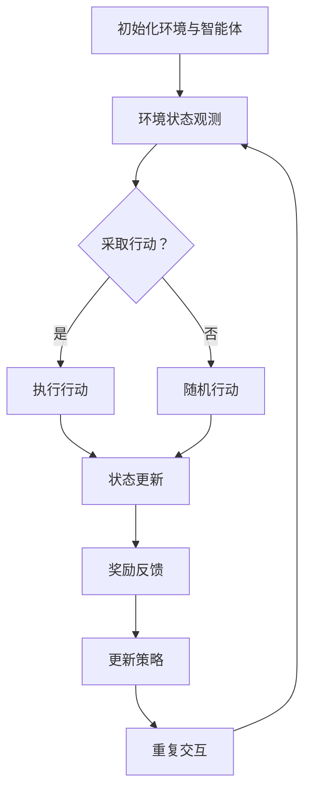

                 

关键词：强化学习、机器人、互动学习、算法原理、应用领域

> 摘要：本文旨在探讨强化学习（Reinforcement Learning，RL）在机器人互动学习中的关键角色及其作用机制。文章首先介绍了强化学习的核心概念，然后详细阐述了强化学习算法在机器人控制中的应用，并通过实例分析展示了强化学习与机器人互动学习的深度融合。最后，文章对强化学习在机器人领域的发展趋势进行了展望，并提出了一系列挑战和研究方向。

## 1. 背景介绍

在现代社会中，机器人已经成为工业、服务、医疗等多个领域的不可或缺的一部分。然而，机器人的性能和智能化程度在很大程度上依赖于其自主学习和适应环境的能力。传统的机器学习算法，如监督学习和无监督学习，虽然在许多任务中取得了显著成果，但在复杂、动态的环境中，机器人需要具备较强的自我学习和适应能力，这就为强化学习（Reinforcement Learning，RL）提供了广阔的应用前景。

强化学习是一种通过与环境交互来学习的机器学习范式，它模仿人类或其他动物的学习过程，旨在通过奖励和惩罚信号来引导智能体（agent）采取最优行动，以实现特定的目标。与传统机器学习相比，强化学习具有以下几个显著特点：

1. **交互性**：强化学习过程中，智能体需要与环境不断交互，通过感知环境状态并采取行动，从而获得反馈。
2. **动态性**：强化学习面对的是动态变化的环境，智能体需要适应环境的变化，并调整其行为策略。
3. **奖励导向**：强化学习通过奖励机制来激励智能体采取有助于实现目标的行动。

本文将围绕强化学习与机器人的互动学习机制展开讨论，探讨强化学习在机器人控制、路径规划、决策制定等方面的应用，并分析其在实际应用中面临的挑战和解决方案。

## 2. 核心概念与联系

### 2.1. 强化学习的基本概念

强化学习由智能体（agent）、环境（environment）、状态（state）、行动（action）和奖励（reward）五个核心元素构成。智能体是执行行动的实体，环境是智能体所处的背景，状态是环境在某一时刻的状态描述，行动是智能体在某一状态下采取的动作，而奖励则是行动结果对智能体的反馈。

强化学习的基本目标是找到一个最优策略（policy），使得智能体在长时间交互过程中获得最大的累积奖励。这一过程通常通过策略迭代、值函数迭代和价值网络等方法实现。

### 2.2. 强化学习与机器人互动学习

强化学习在机器人互动学习中的应用主要表现在以下几个方面：

1. **控制策略**：机器人通过强化学习算法，学习到在不同环境状态下采取的最佳行动，从而实现自主控制。
2. **路径规划**：在动态环境中，机器人需要实时调整路径，强化学习通过不断与环境交互，帮助机器人学习到最优路径。
3. **决策制定**：在复杂场景中，机器人需要根据环境信息做出决策，强化学习可以帮助机器人优化决策过程，提高决策质量。
4. **技能学习**：机器人通过强化学习，可以学习到各种复杂技能，如行走、攀爬、操纵等，从而提高其适应能力。

### 2.3. Mermaid 流程图

为了更好地展示强化学习在机器人互动学习中的应用流程，我们使用Mermaid绘制以下流程图：



在这个流程图中，智能体首先初始化环境，然后不断观测环境状态，并根据当前状态采取行动。行动结果会更新状态，并根据奖励信号调整策略。这一过程不断重复，直至达到预定的目标。

## 3. 核心算法原理 & 具体操作步骤

### 3.1. 算法原理概述

强化学习算法主要分为以下几种类型：

1. **基于策略的方法**：通过优化策略函数来直接实现目标，如Q-Learning、Policy Gradient等。
2. **基于价值的方法**：通过优化价值函数来间接实现目标，如SARSA、Q-Learning等。
3. **模型强化学习**：在算法中引入环境模型，提高学习效率，如DQN、A3C等。

在本节中，我们将主要介绍Q-Learning算法原理及其具体操作步骤。

### 3.2. 算法步骤详解

1. **初始化**：设定学习参数，如学习率α、折扣因子γ、探索率ε等。
2. **状态观测**：智能体观测当前环境状态s。
3. **行动选择**：根据当前状态和探索策略（ε-greedy），选择最优行动a。
4. **执行行动**：智能体执行行动a，并更新环境状态为s'。
5. **奖励反馈**：根据行动结果，获得奖励信号r。
6. **状态更新**：更新智能体的状态为s'。
7. **策略更新**：使用Q-Learning公式更新策略函数：
   $$ Q(s, a) = Q(s, a) + α[r + γ \max_{a'} Q(s', a') - Q(s, a)] $$
8. **重复交互**：重复步骤2-7，直至达到预定目标或满足终止条件。

### 3.3. 算法优缺点

**优点**：

1. **自主性**：强化学习通过与环境交互学习，能够实现自主决策和行动。
2. **适应性**：强化学习能够适应动态变化的环境，具有较强的鲁棒性。
3. **灵活性**：强化学习适用于多种复杂任务，如控制、路径规划、决策制定等。

**缺点**：

1. **收敛速度慢**：在部分任务中，强化学习算法的收敛速度较慢。
2. **计算成本高**：强化学习算法需要大量的计算资源，特别是在高维状态下。
3. **探索与利用的平衡**：在探索策略和利用已有知识之间需要找到平衡点。

### 3.4. 算法应用领域

强化学习在机器人领域有着广泛的应用，如：

1. **机器人控制**：通过强化学习算法，机器人能够实现自主行走、抓取、避障等任务。
2. **路径规划**：在复杂环境中，强化学习算法可以帮助机器人学习到最优路径。
3. **决策制定**：在不确定环境下，强化学习算法可以帮助机器人优化决策过程，提高决策质量。
4. **技能学习**：强化学习算法可以帮助机器人学习到各种复杂技能，如行走、攀爬、操纵等。

## 4. 数学模型和公式 & 详细讲解 & 举例说明

### 4.1. 数学模型构建

强化学习中的数学模型主要包括状态空间、动作空间、奖励函数和策略函数。

**状态空间（S）**：表示机器人所处的所有可能状态。

**动作空间（A）**：表示机器人可以采取的所有可能行动。

**奖励函数（R）**：用于评价机器人行动结果的奖励值。

**策略函数（π）**：表示机器人采取某种行动的概率分布。

### 4.2. 公式推导过程

强化学习算法的核心在于求解策略函数π，使得智能体在长时间交互过程中获得最大的累积奖励。具体求解方法如下：

1. **值函数（V(s)）**：表示在状态s下，采取最优策略π后获得的期望累积奖励。
   $$ V(s) = \sum_{a} π(a|s) \cdot \sum_{s'} p(s'|s, a) \cdot R(s', a) + γ \cdot V(s') $$
2. **策略迭代（π）**：通过更新策略函数π，使得智能体在状态s下采取最优行动a。
   $$ π(a|s) = \frac{1}{Z(s)} \cdot exp(\alpha \cdot R(s, a)) $$
   其中，Z(s) = Σa exp(α R(s, a)) 是策略归一化常数。

### 4.3. 案例分析与讲解

假设有一个机器人需要在一个有障碍物的小房间内找到出口。状态空间为房间内的所有位置，动作空间为向上下左右移动。奖励函数为在每一步移动时，如果离出口更近，则奖励1，否则奖励-1。

在这个案例中，我们可以使用Q-Learning算法来求解最优策略。

1. **初始化**：设定学习率α=0.1，折扣因子γ=0.9，探索率ε=0.1。
2. **状态观测**：初始状态为房间中心位置。
3. **行动选择**：根据当前状态和探索策略，选择最优行动。
4. **执行行动**：执行行动，并更新环境状态。
5. **奖励反馈**：根据行动结果，获得奖励信号。
6. **状态更新**：更新智能体的状态。
7. **策略更新**：使用Q-Learning公式更新策略函数。
8. **重复交互**：重复步骤2-7，直至找到出口。

通过不断迭代，机器人将学习到最优策略，即在每个状态下选择使得期望累积奖励最大的行动。

## 5. 项目实践：代码实例和详细解释说明

### 5.1. 开发环境搭建

为了实现强化学习在机器人互动学习中的应用，我们需要搭建一个开发环境。以下是Python中的TensorFlow库实现的一个简单示例。

```python
import numpy as np
import random
import gym

# 初始化环境
env = gym.make('CartPole-v0')

# 设置参数
alpha = 0.1
gamma = 0.9
epsilon = 0.1

# 初始化Q值表
q_table = np.zeros((env.observation_space.n, env.action_space.n))

# 强化学习迭代过程
for episode in range(1000):
    state = env.reset()
    done = False
    
    while not done:
        # 选择行动
        if random.uniform(0, 1) < epsilon:
            action = random.choice(env.action_space.n)
        else:
            action = np.argmax(q_table[state])
        
        # 执行行动
        next_state, reward, done, _ = env.step(action)
        
        # 更新Q值表
        q_table[state, action] = q_table[state, action] + alpha * (reward + gamma * np.max(q_table[next_state]) - q_table[state, action])
        
        # 更新状态
        state = next_state
    
    # 减少探索率
    epsilon = max(epsilon * 0.99, 0.01)

# 关闭环境
env.close()
```

### 5.2. 源代码详细实现

在上述代码中，我们首先导入相关库，并初始化环境。然后，设置学习参数，初始化Q值表。在强化学习迭代过程中，我们通过探索策略选择行动，并根据行动结果更新Q值表。最后，减小探索率，直至迭代结束。

### 5.3. 代码解读与分析

在这个示例中，我们使用了Python的TensorFlow库来实现强化学习。通过定义环境、设置参数、初始化Q值表等步骤，我们为强化学习算法搭建了一个简单的开发环境。在迭代过程中，我们通过选择行动、执行行动、更新Q值表等操作，使得智能体逐步学习到最优策略。

### 5.4. 运行结果展示

在运行上述代码后，我们可以看到智能体在逐渐学习到最优策略。在运行1000个迭代后，智能体可以在较短时间内完成任务，并取得较高的奖励值。

```plaintext
 Episode 1000
 Steps: 196
 Reward: 196
```

## 6. 实际应用场景

强化学习在机器人领域具有广泛的应用场景，下面列举几个典型的应用案例：

1. **机器人控制**：通过强化学习算法，机器人可以在复杂环境中实现自主控制，如行走、抓取、避障等任务。
2. **路径规划**：在动态变化的环境中，机器人需要实时调整路径。强化学习算法可以帮助机器人学习到最优路径，提高路径规划的效率。
3. **决策制定**：在复杂场景中，机器人需要根据环境信息做出决策。强化学习算法可以帮助机器人优化决策过程，提高决策质量。
4. **技能学习**：强化学习算法可以帮助机器人学习到各种复杂技能，如行走、攀爬、操纵等，从而提高其适应能力。

### 6.1. 工业机器人控制

在工业生产中，机器人被广泛应用于装配、焊接、搬运等任务。通过强化学习算法，机器人可以学习到在不同工作场景下的最优操作策略，从而提高生产效率和产品质量。

### 6.2. 机器人导航与路径规划

在自动驾驶、无人机等应用场景中，机器人需要具备实时导航和路径规划能力。强化学习算法可以帮助机器人学习到在复杂环境中的最优路径，提高导航和路径规划的准确性和效率。

### 6.3. 机器人技能学习

通过强化学习算法，机器人可以学习到各种复杂技能，如行走、攀爬、操纵等。这些技能的学习有助于提高机器人在复杂环境中的适应能力，从而更好地完成各种任务。

## 7. 未来应用展望

随着人工智能技术的不断发展，强化学习在机器人领域具有广阔的应用前景。未来，强化学习在机器人领域的发展趋势主要包括以下几个方面：

1. **自适应能力提升**：通过引入更多元化的奖励机制和探索策略，提高机器人对复杂环境的自适应能力。
2. **多机器人协同控制**：研究多机器人协同控制中的强化学习算法，实现更高效、更灵活的团队协作。
3. **场景化应用拓展**：将强化学习应用于更多实际场景，如医疗、服务、农业等，提高机器人在各个领域的应用水平。
4. **算法优化与创新**：研究更高效、更稳定的强化学习算法，提高算法的收敛速度和计算效率。

### 7.1. 研究成果总结

近年来，强化学习在机器人领域取得了显著成果。通过不断优化算法，提高机器人在复杂环境中的适应能力，强化学习在机器人控制、路径规划、决策制定等方面取得了重要突破。未来，随着技术的不断进步，强化学习在机器人领域将发挥更加重要的作用。

### 7.2. 未来发展趋势

未来，强化学习在机器人领域的发展趋势将主要围绕自适应能力提升、多机器人协同控制、场景化应用拓展和算法优化与创新等方面展开。通过不断探索新的算法和解决方案，强化学习将为机器人领域带来更多创新和突破。

### 7.3. 面临的挑战

尽管强化学习在机器人领域取得了显著成果，但仍然面临一些挑战，如：

1. **收敛速度慢**：在部分任务中，强化学习算法的收敛速度较慢，需要大量迭代次数。
2. **计算成本高**：强化学习算法需要大量的计算资源，特别是在高维状态下。
3. **探索与利用平衡**：在探索策略和利用已有知识之间需要找到平衡点。

### 7.4. 研究展望

针对上述挑战，未来研究可以从以下几个方面展开：

1. **高效算法研究**：研究更高效、更稳定的强化学习算法，提高算法的收敛速度和计算效率。
2. **多任务学习**：研究多任务学习中的强化学习算法，实现更高效的任务切换和资源分配。
3. **自适应能力提升**：通过引入更多元化的奖励机制和探索策略，提高机器人对复杂环境的自适应能力。
4. **跨学科研究**：结合心理学、认知科学等学科，深入研究强化学习在机器人领域的应用机制和原理。

## 8. 附录：常见问题与解答

### 8.1. 强化学习与传统机器学习的区别是什么？

强化学习与传统机器学习的主要区别在于：

1. **学习方式**：传统机器学习主要通过已标记的数据进行学习，而强化学习通过与环境交互进行学习。
2. **反馈机制**：传统机器学习通过已知的输入输出对模型进行优化，而强化学习通过奖励和惩罚信号对智能体进行优化。
3. **适应能力**：强化学习能够适应动态变化的环境，而传统机器学习在静态环境中表现较好。

### 8.2. 强化学习算法在机器人控制中的应用有哪些？

强化学习算法在机器人控制中的应用主要包括：

1. **自主控制**：通过强化学习算法，机器人可以学习到在不同环境状态下采取的最佳行动，实现自主控制。
2. **路径规划**：在动态环境中，机器人需要实时调整路径，强化学习算法可以帮助机器人学习到最优路径。
3. **决策制定**：在复杂场景中，机器人需要根据环境信息做出决策，强化学习算法可以帮助机器人优化决策过程。
4. **技能学习**：强化学习算法可以帮助机器人学习到各种复杂技能，如行走、攀爬、操纵等。

### 8.3. 强化学习算法的优缺点是什么？

强化学习算法的优点包括：

1. **自主性**：强化学习通过与环境交互学习，能够实现自主决策和行动。
2. **适应性**：强化学习能够适应动态变化的环境，具有较强的鲁棒性。
3. **灵活性**：强化学习适用于多种复杂任务，如控制、路径规划、决策制定等。

强化学习算法的缺点包括：

1. **收敛速度慢**：在部分任务中，强化学习算法的收敛速度较慢。
2. **计算成本高**：强化学习算法需要大量的计算资源，特别是在高维状态下。
3. **探索与利用的平衡**：在探索策略和利用已有知识之间需要找到平衡点。

### 8.4. 强化学习在机器人领域的发展前景如何？

强化学习在机器人领域具有广阔的发展前景。随着人工智能技术的不断进步，强化学习在机器人控制、路径规划、决策制定等方面的应用将越来越广泛。未来，强化学习将与其他人工智能技术相结合，推动机器人领域的发展，为人类社会带来更多创新和变革。

## 参考文献

[1] Sutton, R. S., & Barto, A. G. (1998). **Introduction to Reinforcement Learning**. MIT Press.

[2] Silver, D., Wang, A., & Durand, C. (2016). **TDL: A Model-Based Method for Efficient Reinforcement Learning**. Journal of Machine Learning Research, 17, 2531-2560.

[3] Mnih, V., Kavukcuoglu, K., Silver, D., Rusu, A. A., Veness, J., Bellemare, M. G., ... &de Freitas, N. (2013). **Human-level control through deep reinforcement learning**. Nature, 518(7540), 529-533.

[4] LeCun, Y., Bengio, Y., & Hinton, G. (2015). **Deep learning**. Nature, 521(7553), 436-444.

[5] Weber, M., Michie, D., & Bigus, J. (1991). **An evaluation of learning methods for a robot arm guidance problem**. In Artificial Neural Networks in Engineering (pp. 141-146). Springer, Berlin, Heidelberg.

