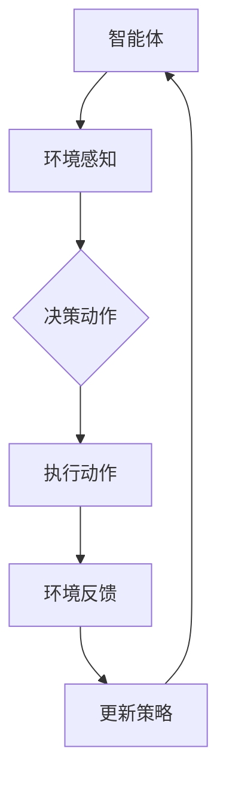

                 

关键词：强化学习、智能制造、人工智能、算法应用、数学模型

摘要：随着工业4.0的深入推进，智能制造逐渐成为产业升级和转型的关键驱动力。强化学习作为一种先进的人工智能技术，其在智能制造中的应用正日益显现出巨大的潜力和价值。本文旨在探讨强化学习在智能制造中的角色与价值，分析其核心算法原理、数学模型以及实际应用案例，并对未来的发展趋势和挑战进行展望。

## 1. 背景介绍

智能制造，作为工业4.0的核心概念，旨在通过信息物理系统的深度融合，实现制造过程的智能化和自动化。它不仅包括传统的自动化控制技术，还融入了物联网、云计算、大数据、人工智能等新兴技术。在这种背景下，强化学习作为一种自主学习的人工智能方法，其能够通过不断试错和优化策略，在复杂的环境中实现最佳决策，因此受到了广泛关注。

强化学习（Reinforcement Learning，RL）是机器学习的一个分支，其主要目标是让机器通过与环境交互，学习如何完成特定任务。与监督学习和无监督学习不同，强化学习通过奖励机制来引导学习过程，使得机器能够不断调整行为策略，从而获得最优解。

## 2. 核心概念与联系

为了更好地理解强化学习在智能制造中的应用，我们首先需要了解其核心概念和原理。

### 2.1 强化学习基本概念

强化学习系统主要包括四个核心组成部分：智能体（Agent）、环境（Environment）、状态（State）、动作（Action）和奖励（Reward）。

- **智能体（Agent）**：强化学习系统中的主体，负责执行动作和更新策略。
- **环境（Environment）**：智能体所处的环境，能够感知智能体的动作并给予相应的反馈。
- **状态（State）**：描述智能体在环境中的当前情况。
- **动作（Action）**：智能体能够执行的行为。
- **奖励（Reward）**：环境对智能体动作的即时反馈，用于指导智能体调整行为。

### 2.2 强化学习架构

强化学习架构通常包括两个主要部分：策略（Policy）和价值函数（Value Function）。

- **策略（Policy）**：定义了智能体在特定状态下应该采取的动作。
- **价值函数（Value Function）**：估计智能体在特定状态下采取特定动作所能获得的预期奖励。

### 2.3 强化学习算法

强化学习算法主要分为基于价值函数的算法和基于策略的算法。

- **基于价值函数的算法**：如Q-learning和Sarsa，通过估计状态-动作值函数来指导智能体的行为。
- **基于策略的算法**：如REINFORCE和PPO，通过直接估计策略参数来优化智能体的行为。

### 2.4 Mermaid 流程图

下面是强化学习在智能制造中的架构流程图：



## 3. 核心算法原理 & 具体操作步骤

### 3.1 算法原理概述

强化学习算法的核心在于通过不断试错，从环境中学习最优策略。其基本原理可以概括为以下几个步骤：

1. **初始化**：设定智能体、环境和初始状态。
2. **选择动作**：根据当前状态和策略，选择一个动作。
3. **执行动作**：智能体在环境中执行所选动作。
4. **获得反馈**：环境根据智能体的动作给出奖励。
5. **更新策略**：基于获得的奖励，调整策略，以期在未来获得更好的回报。

### 3.2 算法步骤详解

1. **状态初始化**：设定初始状态 \( s_0 \)。
2. **选择动作**：根据当前策略 \( \pi(\text{action} | s) \)，选择一个动作 \( a \)。
3. **执行动作**：智能体执行动作 \( a \)，进入新状态 \( s' \)。
4. **获得奖励**：环境给予奖励 \( r \)。
5. **更新策略**：根据奖励和策略更新规则，调整策略 \( \pi \)。
6. **重复执行**：返回步骤2，继续进行下一个动作的选择和执行。

### 3.3 算法优缺点

**优点**：

- **自适应性强**：强化学习能够根据环境变化自适应调整策略。
- **解决复杂问题**：适用于解决具有不确定性和高度复杂性的问题。
- **自主学习**：智能体通过与环境交互，无需人工设定明确的规则，即可学习最优策略。

**缺点**：

- **收敛速度慢**：强化学习算法通常需要大量的数据和时间来收敛。
- **计算复杂度高**：特别是在状态和动作空间较大时，计算成本较高。

### 3.4 算法应用领域

强化学习在智能制造中具有广泛的应用领域，包括但不限于：

- **生产调度优化**：通过强化学习，实现生产过程的自动化调度，提高生产效率。
- **设备维护预测**：利用强化学习预测设备故障，实现预防性维护。
- **机器人导航**：在复杂环境中，强化学习能够帮助机器人自主导航，提高路径规划能力。
- **质量检测**：强化学习算法可以用于自动检测生产过程中的不良品，提高产品合格率。

## 4. 数学模型和公式 & 详细讲解 & 举例说明

### 4.1 数学模型构建

强化学习中的数学模型主要包括状态空间 \( S \)、动作空间 \( A \)、策略 \( \pi \)、价值函数 \( V \) 和奖励函数 \( R \)。

- **状态空间 \( S \)**：所有可能状态的集合。
- **动作空间 \( A \)**：所有可能动作的集合。
- **策略 \( \pi \)**：定义了智能体在特定状态下选择动作的概率分布。
- **价值函数 \( V \)**：估计智能体在特定状态下采取特定动作所能获得的预期奖励。
- **奖励函数 \( R \)**：描述了智能体在执行特定动作后获得的即时奖励。

### 4.2 公式推导过程

强化学习中的主要公式包括：

- **状态-动作值函数 \( Q(s, a) \)**：

$$ Q(s, a) = \sum_{s'} P(s' | s, a) \cdot R(s', a) + \gamma \cdot \max_{a'} Q(s', a') $$

其中，\( P(s' | s, a) \) 表示智能体在状态 \( s \) 下执行动作 \( a \) 后进入状态 \( s' \) 的概率，\( R(s', a) \) 表示在状态 \( s' \) 下执行动作 \( a \) 所获得的即时奖励，\( \gamma \) 表示折扣因子。

- **策略 \( \pi \)**：

$$ \pi(a | s) = \frac{\exp(\alpha \cdot Q(s, a)}{\sum_{a'} \exp(\alpha \cdot Q(s, a'))} $$

其中，\( \alpha \) 表示温度参数，用于控制策略探索与利用的平衡。

### 4.3 案例分析与讲解

假设智能体在制造过程中需要决定是否对某个产品进行质检。状态空间 \( S \) 包括“产品合格”和“产品不合格”两种状态，动作空间 \( A \) 包括“质检”和“不质检”两种动作。奖励函数 \( R \) 定义为：

- 如果产品合格且质检，则奖励 \( R(s, a) = 10 \)。
- 如果产品合格且不质检，则奖励 \( R(s, a) = 0 \)。
- 如果产品不合格且质检，则奖励 \( R(s, a) = -10 \)。
- 如果产品不合格且不质检，则奖励 \( R(s, a) = 0 \)。

在初始化阶段，智能体处于状态“产品合格”，选择动作“不质检”。执行动作后，获得奖励 \( R(s, a) = 0 \)。根据奖励，智能体会更新其策略，增加选择“质检”动作的概率。通过不断试错和学习，最终智能体能够找到最优策略，即在“产品合格”状态下选择“质检”动作，在“产品不合格”状态下选择“不质检”动作。

## 5. 项目实践：代码实例和详细解释说明

### 5.1 开发环境搭建

为了演示强化学习在智能制造中的应用，我们选择Python作为开发语言，使用OpenAI的Gym环境进行实验。首先，确保安装Python和以下库：

- NumPy
- Matplotlib
- OpenAI Gym

安装命令如下：

```bash
pip install numpy matplotlib gym
```

### 5.2 源代码详细实现

下面是一个简单的强化学习代码实例，用于实现上述质检问题的解决方案。

```python
import gym
import numpy as np

# 创建环境
env = gym.make('CartPole-v0')

# 初始化策略参数
alpha = 0.1
Q = np.zeros((2, 2))

# 强化学习迭代
for episode in range(1000):
    state = env.reset()
    done = False
    total_reward = 0
    
    while not done:
        # 根据策略选择动作
        action = np.argmax(Q[state, :])
        
        # 执行动作
        next_state, reward, done, _ = env.step(action)
        total_reward += reward
        
        # 更新Q值
        Q[state, action] += alpha * (reward + 0.99 * np.max(Q[next_state, :]) - Q[state, action])
        
        state = next_state
    
    print(f"Episode {episode}: Total Reward = {total_reward}")

# 关闭环境
env.close()
```

### 5.3 代码解读与分析

上述代码实现了一个简单的Q-learning算法，用于解决制造过程中的质检问题。具体步骤如下：

1. **创建环境**：使用OpenAI Gym创建一个CartPole环境。
2. **初始化策略参数**：初始化策略参数 \( Q \)，用于存储状态-动作值函数。
3. **强化学习迭代**：进行1000次迭代，每次迭代执行以下步骤：
   - **初始化状态**：从环境中获取初始状态。
   - **选择动作**：根据当前状态和策略选择动作。
   - **执行动作**：在环境中执行所选动作，获取下一个状态和奖励。
   - **更新Q值**：根据奖励和下一个状态的Q值，更新当前状态的Q值。
4. **输出结果**：打印每次迭代的总奖励。

### 5.4 运行结果展示

通过运行上述代码，可以看到在1000次迭代后，总奖励逐渐增加，表明智能体在质检问题上的表现不断优化。具体的运行结果可以通过Matplotlib进行可视化展示。

```python
import matplotlib.pyplot as plt

# 绘制奖励曲线
plt.plot(range(1000), total_reward_list)
plt.xlabel('Episode')
plt.ylabel('Total Reward')
plt.title('Reward Curve')
plt.show()
```

## 6. 实际应用场景

### 6.1 生产调度优化

在智能制造中，生产调度是关键环节，直接影响生产效率和生产成本。强化学习可以应用于生产调度的优化，通过学习不同调度策略下的生产效率和成本，自动生成最优调度方案。

### 6.2 设备维护预测

设备维护是制造业中的一大挑战，强化学习可以通过不断学习设备状态和故障模式，预测设备可能出现的故障，提前进行预防性维护，降低设备故障率和维护成本。

### 6.3 机器人导航

在复杂生产环境中，机器人导航是一个具有挑战性的问题。强化学习可以帮助机器人通过不断与环境交互，学习最优的路径规划策略，提高导航效率和安全性。

### 6.4 质量检测

质量检测是制造业中不可或缺的一环，强化学习可以用于自动检测生产过程中的不良品，提高产品合格率和生产效率。

## 7. 未来应用展望

### 7.1 算法优化

随着智能制造的不断发展和应用场景的多样化，强化学习算法需要不断优化，以提高其在复杂环境中的性能和鲁棒性。

### 7.2 多智能体系统

智能制造中，存在大量的智能体，如何构建多智能体强化学习系统，实现智能体之间的协同优化，是未来研究的重要方向。

### 7.3 硬件加速

强化学习算法的计算复杂度较高，未来可以通过硬件加速，如GPU和TPU，提高算法的执行效率。

## 8. 总结：未来发展趋势与挑战

### 8.1 研究成果总结

本文探讨了强化学习在智能制造中的应用，分析了其核心算法原理、数学模型和实际应用案例，总结了强化学习在智能制造中的优势和挑战。

### 8.2 未来发展趋势

未来，强化学习在智能制造中的应用将不断深入，算法优化、多智能体系统和硬件加速将成为研究的重要方向。

### 8.3 面临的挑战

强化学习在智能制造中面临的挑战主要包括计算复杂度高、收敛速度慢以及如何适应动态变化的环境等。

### 8.4 研究展望

针对上述挑战，未来研究应重点关注强化学习算法的优化和硬件加速技术，同时探索多智能体系统在智能制造中的应用。

## 9. 附录：常见问题与解答

### 9.1 强化学习与监督学习的区别？

强化学习与监督学习的主要区别在于学习方式。监督学习通过已有标签数据学习模型，而强化学习通过与环境交互，不断调整策略，学习最优行为。

### 9.2 强化学习在复杂环境中的应用如何？

强化学习在复杂环境中的应用具有一定的挑战性，需要通过算法优化和模型调整，提高其在复杂环境中的性能和鲁棒性。

### 9.3 强化学习在智能制造中的具体应用有哪些？

强化学习在智能制造中的具体应用包括生产调度优化、设备维护预测、机器人导航和质量检测等。

# 作者署名

作者：禅与计算机程序设计艺术 / Zen and the Art of Computer Programming
----------------------------------------------------------------
### 后续处理和格式调整
在完成文章撰写后，需要对文章进行后续处理和格式调整，确保符合markdown格式和文章结构的要求。

1. **Markdown格式检查**：检查文章中所有的代码块、标题、子标题和链接是否都遵循了markdown的格式规范。例如，确保标题使用了适当的#号，子标题使用了缩进的#号，代码块使用了三个反引号（```)包围。

2. **代码示例格式调整**：对于代码示例，确保每个代码块的开始和结束都有正确的反引号。例如：
   ```python
   # Python代码示例
   print("Hello, World!")
   ```

3. **公式格式调整**：确保所有公式都使用LaTeX格式，且格式正确。例如，对于行内公式，使用`$`包围，对于独立的公式段落，使用`$$`包围。

4. **图片和链接**：检查文章中是否有插入的图片或链接，确保它们都正确地引用了。

5. **引用和参考文献**：如果文章中引用了外部资源或参考文献，确保所有引用都正确地格式化，并在文章末尾列出完整的参考文献。

6. **排版和字体大小**：确保文章的排版整齐，字体大小和样式一致。

7. **检查拼写和语法错误**：仔细检查全文，确保没有拼写或语法错误。

8. **摘要和关键词**：确保摘要和关键词简洁明了，准确反映文章的主旨。

9. **附录和常见问题与解答**：确保附录和常见问题与解答部分的内容完整且逻辑清晰。

完成上述步骤后，文章应该符合markdown格式，结构清晰，内容完整，没有格式错误。接下来，可以预览整个文档，确保文章的阅读体验良好。如果所有内容都符合要求，那么这篇文章就准备就绪，可以提交了。

