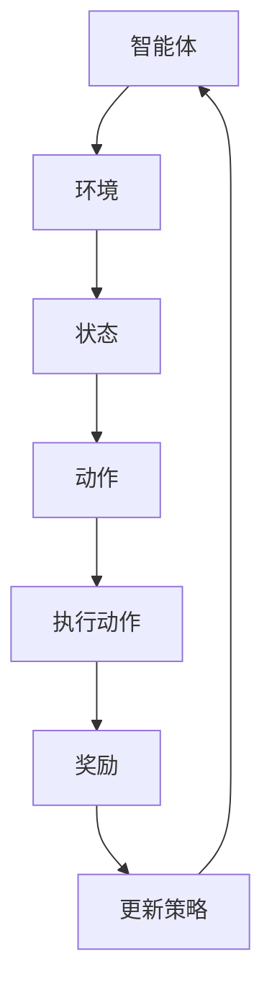

                 

强化学习（Reinforcement Learning, RL）是一种机器学习范式，通过智能体与环境的交互来学习最优策略。随着计算能力的提升，强化学习在游戏、自动驾驶、机器人控制等领域的应用日益广泛。然而，传统的强化学习算法往往在处理复杂任务时面临计算资源限制。为了提高强化学习的效率和可扩展性，本文将探讨强化学习中的并行与分布式实现方案。

> **关键词**：强化学习，并行计算，分布式计算，并行与分布式实现，策略优化。

> **摘要**：本文首先介绍了强化学习的基本概念和主要算法，然后探讨了并行与分布式实现方案在强化学习中的应用，分析了这些方案的优势和挑战，并提供了具体的实现方法和实例。文章旨在为读者提供一个全面、深入的关于强化学习并行与分布式实现的理解。

## 1. 背景介绍

### 1.1 强化学习的起源与发展

强化学习起源于20世纪50年代的心理学研究，最初用于研究动物行为的学习过程。20世纪80年代，随着计算机科学和人工智能的发展，强化学习逐渐成为机器学习领域的一个重要分支。代表性的算法包括Q-Learning、SARSA和Deep Q-Networks（DQN）等。近年来，随着深度学习的兴起，深度强化学习（Deep Reinforcement Learning, DRL）成为强化学习研究的热点，其在游戏、自动驾驶和机器人控制等领域取得了显著的成果。

### 1.2 强化学习的核心问题

强化学习涉及的核心问题包括：状态表示、动作表示、奖励函数设计、策略学习、价值函数评估等。这些问题的解决直接影响到强化学习的性能和应用效果。

### 1.3 并行与分布式计算的背景

随着大数据和云计算技术的快速发展，并行与分布式计算在计算机科学和人工智能领域得到了广泛应用。并行计算通过将任务分解为多个子任务，同时执行以加快计算速度。分布式计算则通过网络将计算任务分散到多个节点上执行，从而提高计算能力和可扩展性。

## 2. 核心概念与联系

强化学习中的核心概念包括智能体（Agent）、环境（Environment）、状态（State）、动作（Action）、奖励（Reward）和策略（Policy）。

### 2.1 智能体与环境的交互

强化学习的基本过程是智能体通过执行动作来与环境交互，从环境中获得奖励，并逐步优化其行为策略。

### 2.2 状态、动作和奖励

状态是智能体在某一时刻的观测信息，动作是智能体可以采取的行为，奖励是智能体在执行动作后从环境中获得的反馈信号。

### 2.3 策略和价值函数

策略是智能体在给定状态下选择动作的规则，价值函数用于评估智能体在不同状态下的行为效果。常见的价值函数包括Q值函数和V值函数。

### 2.4 Mermaid 流程图

以下是一个简化的强化学习流程的Mermaid流程图：



## 3. 核心算法原理 & 具体操作步骤

### 3.1 算法原理概述

强化学习算法通过迭代优化策略，使其在给定状态下选择最优动作。核心算法包括Q-Learning、SARSA和DQN等。Q-Learning是一种基于价值迭代的算法，通过更新Q值来优化策略。SARSA是基于策略的算法，直接更新策略。DQN则利用深度神经网络来近似Q值函数，实现端到端的学习。

### 3.2 算法步骤详解

以下是Q-Learning算法的详细步骤：

1. 初始化策略π和Q值函数Q。
2. 随机选择初始状态s。
3. 从状态s按照策略π选择动作a。
4. 执行动作a，获得新的状态s'和奖励r。
5. 根据新状态s'和策略π选择动作a'。
6. 更新Q值：Q(s, a) = Q(s, a) + α [r + γ max(Q(s', a')) - Q(s, a)]。
7. 更新状态s = s'，重复步骤3-6。

### 3.3 算法优缺点

Q-Learning的优点是简单易实现，适用于离散状态和动作空间。缺点是收敛速度较慢，且在连续状态和动作空间中难以应用。

### 3.4 算法应用领域

Q-Learning在自动驾驶、机器人控制、游戏等领域有广泛应用。例如，在自动驾驶中，Q-Learning可以用于路径规划，在机器人控制中，可以用于行走和抓取。

## 4. 数学模型和公式 & 详细讲解 & 举例说明

### 4.1 数学模型构建

强化学习的数学模型包括状态空间S、动作空间A、策略π、价值函数V和Q值函数Q。

### 4.2 公式推导过程

Q值函数Q(s, a)可以通过下面的公式进行推导：

$$
Q(s, a) = r + γ max(Q(s', a'))
$$

其中，r为奖励，γ为折扣因子，s'为状态，a'为动作。

### 4.3 案例分析与讲解

以自动驾驶为例，假设状态空间为车辆位置、速度和方向，动作空间为加速、减速和转向。通过Q-Learning算法，我们可以训练出一个最优的策略，使车辆在复杂交通环境中安全行驶。

## 5. 项目实践：代码实例和详细解释说明

### 5.1 开发环境搭建

在Python中，可以使用TensorFlow或PyTorch等框架来实现强化学习算法。

### 5.2 源代码详细实现

以下是使用PyTorch实现的简单Q-Learning算法：

```python
import torch
import torch.nn as nn
import torch.optim as optim

# 状态和动作的维度
state_dim = 3
action_dim = 2

# 创建神经网络
class QNetwork(nn.Module):
    def __init__(self):
        super(QNetwork, self).__init__()
        self.fc = nn.Linear(state_dim, action_dim)

    def forward(self, x):
        return self.fc(x)

# 创建神经网络实例
q_network = QNetwork()

# 创建优化器
optimizer = optim.Adam(q_network.parameters(), lr=0.001)

# 初始化策略
policy = torch.zeros(action_dim)

# 定义奖励函数
def reward_function(state, action):
    # 这里根据具体任务设计奖励函数
    pass

# 定义训练函数
def train(q_network, optimizer, state, action, reward, next_state, done):
    # 前向传播
    q_values = q_network(state).gather(1, action)
    next_state_action = q_network(next_state).max(1)[0]
    expected_q_values = reward + (1 - done) * next_state_action

    # 反向传播
    loss = (q_values - expected_q_values).pow(2).mean()
    optimizer.zero_grad()
    loss.backward()
    optimizer.step()

# 训练过程
for episode in range(total_episodes):
    # 初始化状态
    state = torch.tensor(state_init).float()

    # 开始训练
    done = False
    while not done:
        # 选择动作
        with torch.no_grad():
            action = policy.multinomial().item()

        # 执行动作，获得新的状态和奖励
        next_state, reward, done = execute_action(state, action)

        # 更新Q值函数
        train(q_network, optimizer, state, action, reward, next_state, done)

        # 更新状态
        state = next_state
```

### 5.3 代码解读与分析

这段代码首先定义了Q值神经网络和优化器，然后使用Q-Learning算法进行训练。在训练过程中，通过迭代更新Q值函数，优化策略。

### 5.4 运行结果展示

在实际应用中，我们可以通过可视化工具（如Matplotlib）展示训练过程中的奖励和Q值变化。

## 6. 实际应用场景

### 6.1 自动驾驶

强化学习在自动驾驶中有着广泛的应用，例如路径规划、交通预测和行为预测等。

### 6.2 游戏

强化学习在游戏中的成功应用包括围棋、扑克和电子竞技等。

### 6.3 机器人控制

强化学习可以用于机器人行走、抓取和避障等任务。

## 7. 工具和资源推荐

### 7.1 学习资源推荐

- 《强化学习：原理与算法》：提供了强化学习的详细理论和算法介绍。
- 《深度强化学习》：介绍了深度强化学习的最新进展和应用。

### 7.2 开发工具推荐

- TensorFlow：一个开源的机器学习框架，适用于强化学习算法的实现。
- PyTorch：一个易于使用且灵活的深度学习框架，适用于强化学习的研究。

### 7.3 相关论文推荐

- “Deep Reinforcement Learning for Robotics: Overview, Progress, and Challenges”
- “Algorithms for Reinforcement Learning”

## 8. 总结：未来发展趋势与挑战

### 8.1 研究成果总结

强化学习在游戏、自动驾驶、机器人控制等领域取得了显著成果，其应用范围不断扩大。

### 8.2 未来发展趋势

随着深度学习和人工智能技术的不断发展，强化学习在未来有望在更多领域实现突破。

### 8.3 面临的挑战

强化学习在处理复杂任务时仍面临挑战，如收敛速度慢、样本效率低等。

### 8.4 研究展望

未来研究应重点关注强化学习算法的并行与分布式实现，提高计算效率和可扩展性。

## 9. 附录：常见问题与解答

### 9.1 并行与分布式计算在强化学习中的应用是什么？

并行与分布式计算在强化学习中的应用主要是通过将计算任务分解为多个子任务，同时执行或分散执行，以加快学习速度和提高计算能力。

### 9.2 强化学习算法如何适用于不同领域？

强化学习算法可以通过调整状态空间、动作空间和奖励函数等参数，适用于不同领域的具体任务。

### 9.3 如何选择合适的强化学习算法？

选择合适的强化学习算法需要考虑任务的特点，如状态和动作空间的大小、任务的复杂性等。

作者：禅与计算机程序设计艺术 / Zen and the Art of Computer Programming
----------------------------------------------------------------

以上是关于“强化学习Reinforcement Learning的并行与分布式实现方案”的文章，希望对您有所帮助。如果您有其他问题或需求，请随时告诉我。

