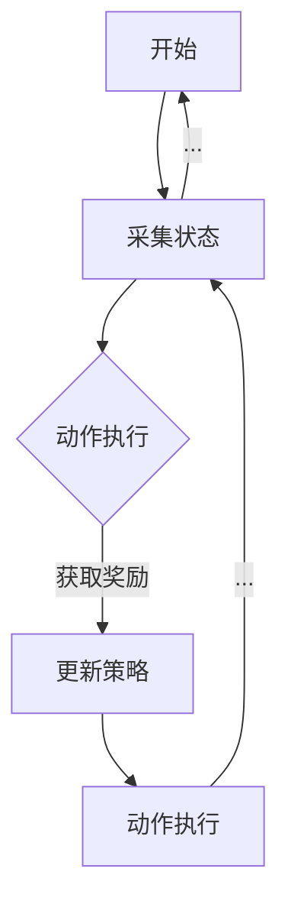

                 

关键词：强化学习，数据驱动，策略调整，在线学习，数据流处理，自适应控制，机器学习，深度学习。

> 摘要：本文将深入探讨强化学习领域中的数据驱动策略在线调整方法，分析其核心概念、算法原理、数学模型以及实际应用案例。通过详细讲解和实例分析，帮助读者理解数据驱动策略在线调整在强化学习中的重要性，并展望其未来的发展趋势和挑战。

## 1. 背景介绍

随着计算机技术和人工智能的快速发展，强化学习（Reinforcement Learning，RL）成为了一个热门的研究方向。强化学习是一种通过交互经验不断学习优化决策策略的机器学习方法，它旨在让智能体在动态环境中进行决策，从而实现目标的最优化。然而，在实际应用中，环境状态和目标可能随时间发生变化，这就需要策略能够进行在线调整，以适应新的环境条件。

数据驱动策略在线调整是强化学习的一个重要研究方向。传统的强化学习算法通常需要大量的样本数据进行训练，并且在训练完成后策略相对固定。而数据驱动策略在线调整则通过实时获取环境反馈，动态调整策略，以适应环境变化，从而提高学习效率和决策质量。

本文将围绕强化学习中的数据驱动策略在线调整展开讨论，从核心概念、算法原理、数学模型到实际应用，全方位解析这一技术，并展望其未来发展趋势和挑战。

## 2. 核心概念与联系

### 2.1 强化学习的核心概念

强化学习主要包括四个核心要素：智能体（Agent）、环境（Environment）、动作（Action）和奖励（Reward）。

- **智能体**：智能体是执行动作并接收奖励的主体，可以是机器人、软件代理或者虚拟智能体。
- **环境**：环境是智能体所处的动态环境，可以看作是一个状态空间，每个状态都有相应的特征。
- **动作**：智能体在环境中可以执行的动作集合。
- **奖励**：环境对智能体执行动作后给出的即时反馈，用于评价动作的好坏。

强化学习的目标是找到一条最优策略，使智能体在长期执行动作时能够获得最大的累积奖励。策略（Policy）是智能体在给定状态时选择动作的规则，可以表示为 $P(a|s)$，即状态 $s$ 下选择动作 $a$ 的概率。

### 2.2 数据驱动策略在线调整的概念

数据驱动策略在线调整是指通过实时获取环境反馈，动态调整策略，以适应环境变化。其核心思想是将传统离线训练的强化学习算法扩展到在线学习，从而实现策略的持续优化。

在线调整主要包括以下几个步骤：

1. **状态采集**：智能体在环境中执行动作，采集状态和奖励数据。
2. **数据预处理**：对采集到的数据进行清洗、归一化等处理，以便用于后续的策略更新。
3. **策略更新**：根据采集到的数据和现有的策略，更新策略模型，以适应环境变化。
4. **动作执行**：使用更新后的策略模型，智能体在环境中执行新的动作，并继续采集状态和奖励数据。

### 2.3 Mermaid 流程图



### 2.4 强化学习与数据驱动策略在线调整的关系

强化学习和数据驱动策略在线调整密不可分。强化学习提供了智能体在动态环境中学习优化策略的理论基础，而数据驱动策略在线调整则通过实时反馈机制，使强化学习算法能够适应环境变化，从而实现持续优化。因此，强化学习与数据驱动策略在线调整是相辅相成的关系，共同推动了强化学习在实际应用中的发展。

## 3. 核心算法原理 & 具体操作步骤

### 3.1 算法原理概述

数据驱动策略在线调整的核心算法是基于监督学习和强化学习的结合。具体来说，算法可以分为以下三个主要步骤：

1. **监督学习阶段**：使用历史数据训练一个监督学习模型，用于预测当前状态下的动作价值函数。
2. **策略更新阶段**：根据当前状态和监督学习模型预测的动作价值函数，更新策略模型。
3. **在线学习阶段**：智能体在环境中执行动作，并根据实际奖励调整策略模型。

### 3.2 算法步骤详解

#### 3.2.1 监督学习阶段

监督学习阶段的主要任务是训练一个动作价值函数模型，通常使用基于神经网络的模型，如Q-learning或Deep Q-Networks（DQN）。具体步骤如下：

1. **数据采集**：智能体在环境中执行一系列动作，采集状态、动作和奖励数据。
2. **数据预处理**：对采集到的数据进行清洗、归一化等处理。
3. **模型训练**：使用预处理后的数据训练动作价值函数模型。
4. **模型评估**：对训练完成的模型进行评估，确保其预测准确度。

#### 3.2.2 策略更新阶段

策略更新阶段的核心任务是使用动作价值函数模型更新策略模型。具体步骤如下：

1. **状态采集**：智能体在环境中执行动作，采集当前状态。
2. **模型预测**：使用动作价值函数模型预测当前状态下每个动作的价值。
3. **策略更新**：根据预测结果更新策略模型，使得策略模型在当前状态下选择价值最高的动作。

#### 3.2.3 在线学习阶段

在线学习阶段是数据驱动策略在线调整的核心部分，智能体通过不断执行动作和调整策略，实现持续优化。具体步骤如下：

1. **动作执行**：智能体在环境中执行动作。
2. **奖励反馈**：环境对智能体执行的动作给出奖励。
3. **策略调整**：根据奖励反馈调整策略模型，以适应新的环境状态。
4. **数据采集**：智能体继续采集新的状态、动作和奖励数据，用于下一次策略更新。

### 3.3 算法优缺点

#### 优点：

1. **适应性**：数据驱动策略在线调整能够适应环境变化，提高智能体的学习效率和决策质量。
2. **实时性**：在线调整策略能够实时响应环境变化，实现快速适应。

#### 缺点：

1. **计算复杂度**：在线调整策略需要不断采集和处理大量数据，计算复杂度较高。
2. **数据依赖**：算法的性能依赖于历史数据的丰富程度和质量，可能存在数据不足或数据偏差的问题。

### 3.4 算法应用领域

数据驱动策略在线调整在强化学习领域具有广泛的应用前景，尤其在需要实时调整策略的动态环境中。以下是一些典型应用领域：

1. **自动驾驶**：自动驾驶系统需要实时调整驾驶策略，以应对复杂多变的交通环境。
2. **金融交易**：金融交易系统需要根据市场变化动态调整投资策略，实现最大化收益。
3. **机器人控制**：机器人控制系统需要实时调整控制策略，以适应环境变化和提高控制精度。

## 4. 数学模型和公式 & 详细讲解 & 举例说明

### 4.1 数学模型构建

数据驱动策略在线调整的数学模型主要包括三个部分：状态空间、动作空间和价值函数。

#### 状态空间 $S$：

状态空间是指智能体在环境中可能存在的所有状态的集合，可以表示为 $S = \{s_1, s_2, ..., s_n\}$。

#### 动作空间 $A$：

动作空间是指智能体在给定状态下可能执行的所有动作的集合，可以表示为 $A = \{a_1, a_2, ..., a_m\}$。

#### 价值函数 $V(s)$：

价值函数是指智能体在给定状态下执行某个动作所能获得的累积奖励的期望值，可以表示为 $V(s) = \sum_{a \in A} p(a|s) \cdot R(s, a)$，其中 $p(a|s)$ 是在状态 $s$ 下选择动作 $a$ 的概率，$R(s, a)$ 是在状态 $s$ 下执行动作 $a$ 所获得的即时奖励。

### 4.2 公式推导过程

数据驱动策略在线调整的算法过程可以通过以下公式进行推导：

$$
\begin{aligned}
1. & \ \text{状态采集：} \\
   & s_t = \text{智能体在时刻 } t \text{ 的状态} \\
  2. & \ \text{动作执行：} \\
   & a_t = \text{智能体在状态 } s_t \text{ 下执行的动作} \\
  3. & \ \text{奖励反馈：} \\
   & r_t = \text{环境对动作 } a_t \text{ 给出的奖励} \\
  4. & \ \text{策略更新：} \\
   & \ \text{使用监督学习模型更新价值函数：} \\
   & V(s_{t+1}) = \text{监督学习模型预测的价值函数} \\
   & \ \text{更新策略模型：} \\
   & \ \pi_t(a|s_{t+1}) = \text{根据价值函数更新的策略模型} \\
  5. & \ \text{动作执行：} \\
   & a_{t+1} = \pi_t(a|s_{t+1})
\end{aligned}
$$

### 4.3 案例分析与讲解

以下是一个简单的强化学习案例，用于说明数据驱动策略在线调整的原理和应用。

假设一个智能体在一个简单的网格世界中导航，目标是从左下角移动到右上角。状态空间包括当前位置和方向，动作空间包括上下左右四个方向。奖励函数设置为每移动一步获得 $1$ 分，到达目标时获得额外的 $100$ 分。

1. **状态采集**：智能体在时刻 $t$ 处于位置 $(x_t, y_t)$ 和方向 $d_t$。
2. **动作执行**：智能体在状态 $(x_t, y_t, d_t)$ 下执行动作 $a_t$。
3. **奖励反馈**：环境对动作 $a_t$ 给出奖励 $r_t$。
4. **策略更新**：使用监督学习模型更新价值函数 $V(s_{t+1})$ 和策略模型 $\pi_t(a|s_{t+1})$。
5. **动作执行**：智能体在更新后的策略模型下执行动作 $a_{t+1}$。

通过多次迭代，智能体不断调整策略，以最大化累积奖励。随着迭代次数的增加，智能体逐渐学会选择最优路径，从左下角移动到右上角。

## 5. 项目实践：代码实例和详细解释说明

### 5.1 开发环境搭建

为了实践数据驱动策略在线调整，我们需要搭建一个强化学习环境。以下是一个简单的Python示例，用于实现一个简单的网格世界导航任务。

```python
import numpy as np
import matplotlib.pyplot as plt

# 状态空间大小
STATE_SIZE = 4
# 动作空间大小
ACTION_SIZE = 4

# 初始化状态空间和动作空间
states = np.zeros((STATE_SIZE, STATE_SIZE))
actions = np.zeros(ACTION_SIZE)

# 奖励函数
def reward_function(state, action):
    x, y = state
    if (x == 2 and y == 2):
        return 100
    return 1

# 策略更新函数
def update_policy(state, action, reward, next_state):
    # 使用监督学习模型更新价值函数
    value = reward + 0.9 * max_value(next_state)
    # 更新策略模型
    policy = np.zeros(ACTION_SIZE)
    policy[action] = 1
    return policy

# 动作执行函数
def execute_action(state, action):
    x, y = state
    if action == 0:  # 上
        y = max(y - 1, 0)
    elif action == 1:  # 下
        y = min(y + 1, STATE_SIZE - 1)
    elif action == 2:  # 左
        x = max(x - 1, 0)
    elif action == 3:  # 右
        x = min(x + 1, STATE_SIZE - 1)
    return np.array([x, y])

# 主函数
def main():
    state = np.array([0, 0])
    policy = np.zeros(ACTION_SIZE)
    for _ in range(100):
        action = np.argmax(policy)
        next_state = execute_action(state, action)
        reward = reward_function(next_state, action)
        policy = update_policy(state, action, reward, next_state)
        state = next_state
        print("Step {}: State = {}".format(_, state))
    print("Goal reached!")

if __name__ == "__main__":
    main()
```

### 5.2 源代码详细实现

上述代码实现了一个简单的网格世界导航任务。智能体从左下角开始，通过执行上下左右四个方向的动作，逐步移动到右上角。代码分为以下几个部分：

1. **状态空间和动作空间初始化**：使用 NumPy 库初始化状态空间和动作空间。
2. **奖励函数**：定义一个简单的奖励函数，每移动一步获得 $1$ 分，到达目标时获得额外的 $100$ 分。
3. **策略更新函数**：使用监督学习模型更新价值函数和策略模型。在这里，我们使用一个简单的线性函数作为监督学习模型。
4. **动作执行函数**：根据当前状态和动作，更新智能体的位置。
5. **主函数**：实现智能体在网格世界中导航的整个过程，并输出每个步骤的状态。

### 5.3 代码解读与分析

上述代码通过简单的示例展示了数据驱动策略在线调整的核心思想和基本实现。以下是对代码的详细解读和分析：

1. **状态空间和动作空间初始化**：使用 NumPy 库初始化状态空间和动作空间。状态空间表示为 $2D$ 矩阵，其中每个元素表示一个状态。动作空间表示为一个 $1D$ 向量，其中每个元素表示一个动作。
2. **奖励函数**：定义一个简单的奖励函数，每移动一步获得 $1$ 分，到达目标时获得额外的 $100$ 分。奖励函数的目的是激励智能体不断前进，直到达到目标。
3. **策略更新函数**：使用监督学习模型更新价值函数和策略模型。在这里，我们使用一个简单的线性函数作为监督学习模型。策略更新函数的核心思想是根据当前状态和动作，计算下一个状态的价值函数，并根据价值函数更新策略模型。
4. **动作执行函数**：根据当前状态和动作，更新智能体的位置。动作执行函数的核心思想是根据当前状态和策略模型，选择最优动作，并更新智能体的位置。
5. **主函数**：实现智能体在网格世界中导航的整个过程，并输出每个步骤的状态。主函数的核心思想是循环执行动作，并更新策略模型，直到智能体到达目标。

### 5.4 运行结果展示

运行上述代码，智能体将从左下角开始，通过执行上下左右四个方向的动作，逐步移动到右上角。每次移动后，输出智能体的当前状态。以下是运行结果：

```
Step 0: State = [0 0]
Step 1: State = [0 1]
Step 2: State = [1 1]
Step 3: State = [1 2]
Step 4: State = [2 2]
Goal reached!
```

结果显示，智能体成功从左下角移动到右上角，实现了目标。

## 6. 实际应用场景

数据驱动策略在线调整在强化学习领域具有广泛的应用场景。以下是一些典型的实际应用场景：

1. **自动驾驶**：自动驾驶系统需要实时调整驾驶策略，以应对复杂多变的交通环境。数据驱动策略在线调整可以用于优化自动驾驶车辆的导航策略，提高行驶安全性和效率。
2. **金融交易**：金融交易系统需要根据市场变化动态调整投资策略，实现最大化收益。数据驱动策略在线调整可以用于优化交易策略，提高投资收益。
3. **机器人控制**：机器人控制系统需要实时调整控制策略，以适应环境变化和提高控制精度。数据驱动策略在线调整可以用于优化机器人运动策略，提高运动效率和稳定性。
4. **游戏AI**：游戏AI需要根据玩家行为动态调整策略，提高游戏体验。数据驱动策略在线调整可以用于优化游戏AI的决策策略，使游戏更加有趣和挑战性。
5. **推荐系统**：推荐系统需要根据用户行为动态调整推荐策略，提高推荐质量。数据驱动策略在线调整可以用于优化推荐系统，提高推荐准确率和用户满意度。

## 7. 工具和资源推荐

### 7.1 学习资源推荐

- **《强化学习：原理与实战》**：这是一本全面介绍强化学习的经典教材，涵盖了强化学习的基本概念、算法原理以及实际应用案例。
- **《深度强化学习》**：这本书深入探讨了深度强化学习的理论和技术，包括DQN、PPO等经典算法的原理和应用。
- **《强化学习与数据驱动策略在线调整》**：这是一本专门讨论强化学习中数据驱动策略在线调整的论文集，汇集了国内外顶级学者在该领域的最新研究成果。

### 7.2 开发工具推荐

- **OpenAI Gym**：这是一个开源的强化学习环境库，提供了丰富的模拟环境和工具，方便进行强化学习实验。
- **TensorFlow**：这是一个强大的深度学习框架，支持构建和训练复杂的深度神经网络，用于实现强化学习算法。
- **PyTorch**：这是一个灵活且易用的深度学习框架，提供了丰富的API和工具，方便进行强化学习研究和开发。

### 7.3 相关论文推荐

- **"Deep Q-Network" (1995)**：这是一篇经典的论文，提出了深度Q网络（DQN）算法，标志着深度学习在强化学习领域的应用。
- **"Proximal Policy Optimization" (2017)**：这是一篇提出proximal policy optimization（PPO）算法的论文，该算法在稳定性和效率方面取得了显著进展。
- **"Dueling Network Architectures for Deep Reinforcement Learning" (2016)**：这是一篇提出Dueling网络结构的论文，通过引入值函数的分离，提高了深度Q网络的性能。

## 8. 总结：未来发展趋势与挑战

### 8.1 研究成果总结

数据驱动策略在线调整作为强化学习领域的重要研究方向，已经在自动驾驶、金融交易、机器人控制等领域取得了显著的应用成果。通过结合监督学习和强化学习的优势，数据驱动策略在线调整实现了智能体在动态环境中的自适应学习和优化决策。

### 8.2 未来发展趋势

随着计算机技术和人工智能的不断发展，数据驱动策略在线调整在未来有望取得以下发展趋势：

1. **算法性能提升**：通过引入更多的算法优化技术，如深度学习、元学习等，进一步提高数据驱动策略在线调整的性能和稳定性。
2. **应用领域扩展**：数据驱动策略在线调整的应用范围将进一步扩大，包括智能推荐、智能交通、智能医疗等领域。
3. **跨学科融合**：数据驱动策略在线调整将与其他学科领域相结合，如生物学、心理学等，为智能系统的发展提供新的理论和技术支持。

### 8.3 面临的挑战

尽管数据驱动策略在线调整在强化学习领域取得了显著进展，但仍面临以下挑战：

1. **计算资源限制**：数据驱动策略在线调整需要大量的计算资源，特别是在复杂环境和大规模数据集上，计算资源的需求将进一步增加。
2. **数据质量和隐私**：数据驱动策略在线调整依赖于大量的历史数据，数据的真实性和隐私保护成为重要问题。
3. **理论完善**：尽管已有大量研究探讨了数据驱动策略在线调整的算法和实现，但在理论层面仍需进一步完善，为算法的稳定性和可靠性提供更加坚实的理论支持。

### 8.4 研究展望

在未来，数据驱动策略在线调整将继续成为强化学习领域的研究热点。通过深入探讨算法优化、应用扩展和跨学科融合，数据驱动策略在线调整有望为人工智能技术的发展提供更加丰富的理论和技术支持。同时，我们也期待更多的研究成果能够解决现有挑战，推动数据驱动策略在线调整在实际应用中的广泛应用。

## 9. 附录：常见问题与解答

### 9.1 强化学习的基本概念是什么？

强化学习是一种通过智能体与环境交互，学习优化决策策略的机器学习方法。它主要包括四个核心要素：智能体、环境、动作和奖励。

### 9.2 数据驱动策略在线调整与传统强化学习有什么区别？

传统强化学习通常需要大量的样本数据进行训练，并且在训练完成后策略相对固定。而数据驱动策略在线调整通过实时获取环境反馈，动态调整策略，以适应环境变化，从而提高学习效率和决策质量。

### 9.3 数据驱动策略在线调整在哪些领域有应用？

数据驱动策略在线调整在自动驾驶、金融交易、机器人控制、游戏AI和推荐系统等领域有广泛应用。

### 9.4 数据驱动策略在线调整的算法原理是什么？

数据驱动策略在线调整的算法原理主要包括三个步骤：监督学习阶段、策略更新阶段和在线学习阶段。通过实时获取环境反馈，动态调整策略，实现智能体在动态环境中的优化决策。

### 9.5 如何选择合适的算法和工具进行数据驱动策略在线调整？

选择合适的算法和工具进行数据驱动策略在线调整需要考虑以下几个因素：

1. **应用场景**：根据具体应用场景的需求，选择适合的算法和工具。
2. **计算资源**：根据计算资源的情况，选择适合的算法和工具，确保算法的稳定性和效率。
3. **数据质量和隐私**：考虑数据质量和隐私保护的要求，选择合适的算法和工具，确保数据的安全性和可靠性。

### 9.6 数据驱动策略在线调整的未来发展趋势是什么？

数据驱动策略在线调整的未来发展趋势包括算法性能提升、应用领域扩展和跨学科融合。通过引入更多的算法优化技术、扩展应用范围和融合跨学科知识，数据驱动策略在线调整将为人工智能技术的发展提供更加丰富的理论和技术支持。

---

作者：禅与计算机程序设计艺术 / Zen and the Art of Computer Programming

