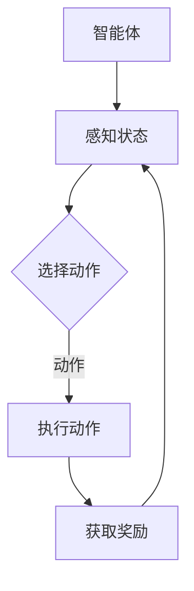

                 

强化学习（Reinforcement Learning，RL）作为机器学习的一个重要分支，旨在通过互动环境学习最优行为策略。本文将深入探讨强化学习的原理，并通过代码实例详尽解释其中的核心概念和算法。

## 文章关键词
- 强化学习
- Q-Learning
- 策略梯度
- 深度强化学习
- 环境建模
- 代码实例

## 文章摘要
本文将首先介绍强化学习的基本概念和核心目标，随后讲解经典算法Q-Learning及其变体。通过代码实例，我们将演示如何实现和训练一个简单的强化学习模型，并深入解析其实现细节。最后，文章将探讨强化学习在不同领域的应用和未来的发展方向。

## 1. 背景介绍

### 强化学习的发展历程

强化学习起源于20世纪50年代，最早由Richard Sutton和Andrew Barto在其经典著作《强化学习：一种引入注目的机器学习方法》中系统阐述。尽管早期强化学习由于其计算复杂度高和收敛速度慢而未得到广泛应用，但随着深度学习的发展，强化学习在人工智能领域取得了显著进展。AlphaGo、DeepMind等公司在围棋、自然语言处理等领域的成功应用，使得强化学习成为当前研究的热点。

### 强化学习在现实中的应用

强化学习在现实世界中有着广泛的应用，例如自动驾驶、机器人控制、推荐系统、游戏AI等。自动驾驶技术中的强化学习算法可以帮助车辆在复杂交通环境中做出最优决策，从而提高行驶安全性和效率。机器人控制中，强化学习可以帮助机器人学习复杂的运动技能，如行走、抓取等。推荐系统中，强化学习可以用于动态调整推荐策略，提高用户满意度。而在游戏AI中，强化学习算法可以训练出具备高超策略的智能玩家，如AlphaGo在围棋中的表现。

### 强化学习的重要性

强化学习在人工智能领域具有重要的地位，因为它是实现智能体自主学习和决策的关键技术。通过不断与环境互动，强化学习算法可以逐渐优化行为策略，达到最优性能。与其他机器学习方法相比，强化学习能够处理动态和不确定的环境，这使得它在许多现实场景中具有独特的优势。

## 2. 核心概念与联系

强化学习涉及到许多核心概念，包括智能体（Agent）、环境（Environment）、状态（State）、动作（Action）、奖励（Reward）和策略（Policy）。

### 智能体（Agent）

智能体是强化学习中的学习实体，旨在通过学习环境中的行为策略，达到某一目标。智能体通过感知环境状态，选择适当动作，并从环境中获取奖励，从而不断优化自己的策略。

### 环境（Environment）

环境是智能体进行学习互动的背景。环境可以是一个物理世界，如自动驾驶车辆所在的道路，也可以是一个虚拟世界，如游戏场景。环境提供了智能体的感知信息和奖励信号。

### 状态（State）

状态是描述环境当前状态的一系列属性或变量。智能体通过感知状态来选择动作。状态可以是离散的，如游戏中的位置，也可以是连续的，如自动驾驶车辆的速度和方向。

### 动作（Action）

动作是智能体在特定状态下可以选择的行为。动作可以是离散的，如游戏中的移动方向，也可以是连续的，如自动驾驶车辆的速度调整。

### 奖励（Reward）

奖励是环境对智能体动作的即时反馈，用于指导智能体的学习。奖励可以是正面的，如增加分数，也可以是负面的，如降低生命值。

### 策略（Policy）

策略是智能体在给定状态下选择动作的规则。策略可以是确定性策略，即在任何状态下都选择相同动作，也可以是非确定性策略，即在不同状态下选择不同概率分布的动作。

### Mermaid 流程图

下面是一个简单的Mermaid流程图，展示上述概念之间的关系：



## 3. 核心算法原理 & 具体操作步骤

### 3.1 算法原理概述

强化学习算法主要分为基于值的方法和基于策略的方法。基于值的方法通过学习状态值函数或动作值函数来指导智能体的行为，而基于策略的方法直接优化智能体的策略。本文将重点介绍Q-Learning算法，这是一种基于值的方法。

Q-Learning算法的核心思想是通过学习状态-动作值函数（Q值），指导智能体选择最优动作。Q值表示在特定状态下执行特定动作所能获得的预期奖励。通过不断更新Q值，智能体能够逐步优化其策略，最终达到最优行为。

### 3.2 算法步骤详解

Q-Learning算法的具体步骤如下：

1. **初始化**：初始化Q值表格，通常使用小值初始化。

2. **选择动作**：在给定状态下，智能体根据策略选择一个动作。策略可以是基于ε-贪婪策略，即在某些概率下选择最优动作，在其他概率下随机选择动作。

3. **执行动作**：智能体执行所选动作，并获取环境反馈的新状态和奖励。

4. **更新Q值**：根据新的状态、动作和奖励，更新Q值表格中的对应值。更新公式如下：

   $$ Q(s, a) \leftarrow Q(s, a) + \alpha [r + \gamma \max_{a'} Q(s', a') - Q(s, a)] $$

   其中，α是学习率，γ是折扣因子，r是获得的奖励，s和s'是当前和新的状态，a和a'是当前和新的动作。

5. **重复步骤2-4**：智能体重复选择动作、执行动作和更新Q值的步骤，直到满足停止条件，如达到一定迭代次数或Q值收敛。

### 3.3 算法优缺点

**优点**：

- **通用性**：Q-Learning算法适用于各种环境，不需要具体的模型。
- **简单易实现**：算法步骤清晰，易于理解和实现。

**缺点**：

- **收敛速度慢**：在复杂环境中，Q-Learning算法可能需要很长时间才能收敛到最优策略。
- **需要大量数据**：为了训练出准确的Q值，需要大量的状态-动作对。

### 3.4 算法应用领域

Q-Learning算法在许多领域都有广泛应用，包括：

- **游戏AI**：如电子游戏中的策略学习。
- **机器人控制**：如自动驾驶车辆和机器人导航。
- **推荐系统**：如动态调整推荐策略。

## 4. 数学模型和公式 & 详细讲解 & 举例说明

### 4.1 数学模型构建

强化学习的数学模型主要包括状态空间、动作空间、奖励函数和策略。假设状态空间为$S$，动作空间为$A$，则智能体在任意状态下选择任意动作的概率分布可以表示为策略$π(a|s)$。

状态-动作值函数$Q(s, a)$表示在状态$s$下执行动作$a$所能获得的预期奖励。其数学模型为：

$$ Q(s, a) = \sum_{s'} P(s' | s, a) \cdot r(s', a) + \gamma \max_{a'} Q(s', a') $$

其中，$P(s' | s, a)$表示在状态$s$下执行动作$a$后，状态转移到$s'$的概率，$r(s', a)$表示在状态$s'$下执行动作$a$所获得的即时奖励，$\gamma$是折扣因子，用于权衡当前奖励和未来奖励的关系。

### 4.2 公式推导过程

Q-Learning算法的更新公式为：

$$ Q(s, a) \leftarrow Q(s, a) + \alpha [r + \gamma \max_{a'} Q(s', a') - Q(s, a)] $$

我们可以通过以下步骤推导这个公式：

1. **预期奖励**：根据定义，状态-动作值函数$Q(s, a)$可以表示为：

   $$ Q(s, a) = \sum_{s'} P(s' | s, a) \cdot r(s', a) + \gamma \max_{a'} Q(s', a') $$

2. **更新公式**：假设智能体在状态$s$下执行动作$a$，并获得即时奖励$r$后转移到状态$s'$。则新的状态-动作值函数$Q(s', a)$可以表示为：

   $$ Q(s', a) = \sum_{s''} P(s'' | s', a) \cdot r(s'', a) + \gamma \max_{a''} Q(s'', a'') $$

3. **结合**：将上述两个公式结合起来，得到：

   $$ Q(s, a) + \alpha [r + \gamma \max_{a'} Q(s', a') - Q(s, a)] = \sum_{s'} P(s' | s, a) \cdot r(s', a) + \alpha \gamma \max_{a'} Q(s', a') $$

4. **简化**：由于$r + \gamma \max_{a'} Q(s', a')$是$Q(s', a)$的一部分，因此可以将上述公式简化为：

   $$ Q(s, a) + \alpha [r + \gamma \max_{a'} Q(s', a') - Q(s, a)] = Q(s', a) $$

5. **结论**：通过不断迭代上述过程，我们可以逐渐优化Q值，从而找到最优策略。

### 4.3 案例分析与讲解

以一个简单的游戏场景为例，假设游戏中有四个状态：$s_1, s_2, s_3, s_4$，每个状态对应的动作有三个：$a_1, a_2, a_3$。奖励函数为：

$$ r(s_1, a_1) = 1, r(s_1, a_2) = 0, r(s_1, a_3) = -1 $$
$$ r(s_2, a_1) = -1, r(s_2, a_2) = 1, r(s_2, a_3) = 0 $$
$$ r(s_3, a_1) = 0, r(s_3, a_2) = -1, r(s_3, a_3) = 1 $$
$$ r(s_4, a_1) = 1, r(s_4, a_2) = 0, r(s_4, a_3) = -1 $$

折扣因子$\gamma = 0.9$，学习率$\alpha = 0.1$。

初始化Q值表格为：

$$ Q(s_1, a_1) = 0, Q(s_1, a_2) = 0, Q(s_1, a_3) = 0 $$
$$ Q(s_2, a_1) = 0, Q(s_2, a_2) = 0, Q(s_2, a_3) = 0 $$
$$ Q(s_3, a_1) = 0, Q(s_3, a_2) = 0, Q(s_3, a_3) = 0 $$
$$ Q(s_4, a_1) = 0, Q(s_4, a_2) = 0, Q(s_4, a_3) = 0 $$

首先，智能体在状态$s_1$下选择动作$a_1$，并获得奖励$r(s_1, a_1) = 1$。然后，智能体转移到状态$s_2$，选择动作$a_2$，并获得奖励$r(s_2, a_2) = 1$。以此类推，不断更新Q值表格，直到Q值收敛。

以下是部分更新过程：

$$ Q(s_1, a_1) \leftarrow Q(s_1, a_1) + 0.1 [1 + 0.9 \max(Q(s_2, a_1), Q(s_2, a_2), Q(s_2, a_3)) - 0] = 0.1 [1 + 0.9 \max(0, 0, 0) - 0] = 0.1 [1 + 0] = 0.1 $$

$$ Q(s_2, a_2) \leftarrow Q(s_2, a_2) + 0.1 [1 + 0.9 \max(Q(s_3, a_1), Q(s_3, a_2), Q(s_3, a_3)) - 1] = 0.1 [1 + 0.9 \max(0, 0.1, 0.1) - 1] = 0.1 [1 + 0.9 \cdot 0.2 - 1] = 0.02 $$

通过多次迭代，我们可以得到最优Q值表格，从而指导智能体选择最优动作。

## 5. 项目实践：代码实例和详细解释说明

### 5.1 开发环境搭建

在进行强化学习实践之前，我们需要搭建相应的开发环境。以下是使用Python实现Q-Learning算法所需的开发环境：

- Python 3.x
- OpenAI Gym：一个开源的环境库，用于创建和测试各种强化学习环境。
- NumPy：用于数值计算的Python库。

首先，安装所需的库：

```bash
pip install python3-openai gym numpy
```

### 5.2 源代码详细实现

以下是使用Python实现的Q-Learning算法代码：

```python
import numpy as np
import gym

# 初始化环境
env = gym.make('CartPole-v0')

# 初始化Q值表格
n_states = env.observation_space.shape[0]
n_actions = env.action_space.n
q_values = np.zeros((n_states, n_actions))

# 参数设置
learning_rate = 0.1
discount_factor = 0.9
epsilon = 0.1

# Q-Learning算法
for episode in range(1000):
    state = env.reset()
    done = False
    
    while not done:
        # ε-贪婪策略
        if np.random.rand() < epsilon:
            action = env.action_space.sample()
        else:
            action = np.argmax(q_values[state])
        
        # 执行动作，获取新状态和奖励
        next_state, reward, done, _ = env.step(action)
        
        # 更新Q值
        q_values[state, action] = q_values[state, action] + learning_rate * (reward + discount_factor * np.max(q_values[next_state]) - q_values[state, action])
        
        state = next_state
    
    # 减少ε值
    epsilon *= 0.99

# 关闭环境
env.close()

# 打印最优Q值
print("Optimal Q values:")
print(q_values)
```

### 5.3 代码解读与分析

上述代码实现了经典的Q-Learning算法，用于解决OpenAI Gym中的CartPole问题。以下是代码的详细解读：

1. **环境初始化**：使用`gym.make('CartPole-v0')`创建一个CartPole环境。

2. **Q值表格初始化**：创建一个二维数组，用于存储状态-动作值函数。数组的行数等于状态空间的大小，列数等于动作空间的大小。

3. **参数设置**：设置学习率、折扣因子和ε值。学习率用于调整Q值的更新速度，折扣因子用于平衡当前奖励和未来奖励，ε值用于实现ε-贪婪策略。

4. **Q-Learning算法**：循环执行以下步骤：

   - 初始化状态。
   - 根据ε-贪婪策略选择动作。
   - 执行动作，获取新状态和奖励。
   - 更新Q值。
   - 转移到新状态。

5. **关闭环境**：完成所有迭代后，关闭环境。

### 5.4 运行结果展示

运行上述代码，我们可以在控制台看到最优Q值表格的输出。这些Q值指导智能体选择最优动作，以实现 CartPole问题的长期稳定。

## 6. 实际应用场景

强化学习在多个实际应用场景中取得了显著成果。以下列举一些常见应用：

### 6.1 自动驾驶

自动驾驶是强化学习的重要应用领域。通过强化学习算法，自动驾驶车辆可以学习如何在不同交通环境和路况下做出最优驾驶决策，从而提高行驶安全性和效率。

### 6.2 机器人控制

机器人控制中的强化学习算法可以帮助机器人学习复杂的运动技能，如行走、抓取等。通过不断与环境互动，机器人可以逐步优化其运动策略，提高任务完成率。

### 6.3 推荐系统

在推荐系统中，强化学习算法可以用于动态调整推荐策略，提高用户满意度。通过不断学习用户行为和反馈，系统可以不断优化推荐结果，提高用户点击率和转化率。

### 6.4 游戏AI

游戏AI是强化学习的另一个重要应用领域。通过强化学习算法，智能玩家可以学习到游戏中的最优策略，从而在对抗游戏中取得优势。

## 7. 未来应用展望

随着技术的不断进步，强化学习在未来将拥有更广泛的应用前景。以下是一些可能的发展方向：

### 7.1 多智能体强化学习

多智能体强化学习是强化学习的一个重要研究方向。在未来，随着多智能体系统的广泛应用，如何实现多个智能体之间的协同学习和决策将成为研究的热点。

### 7.2 强化学习与深度学习融合

强化学习与深度学习的结合将有望提高强化学习算法的收敛速度和表现。通过引入深度神经网络，强化学习算法可以更好地处理复杂的环境和状态。

### 7.3 强化学习在实时系统中的应用

强化学习在实时系统中的应用将有望解决许多实际难题，如智能调度、实时控制等。通过强化学习算法，系统可以实时学习并优化其行为策略，提高系统性能。

## 8. 工具和资源推荐

### 8.1 学习资源推荐

- Sutton和Barto的《强化学习：一种引入注目的机器学习方法》
- David Silver的《强化学习课程》

### 8.2 开发工具推荐

- OpenAI Gym：用于创建和测试强化学习环境。
- TensorFlow：用于实现深度强化学习算法。

### 8.3 相关论文推荐

- "Deep Q-Network"（2015）
- "Algorithms for Reinforcement Learning"（2017）
- "Multi-Agent Reinforcement Learning"（2019）

## 9. 总结：未来发展趋势与挑战

### 9.1 研究成果总结

近年来，强化学习在理论研究和应用实践方面取得了显著成果。从经典算法到深度强化学习，强化学习已经广泛应用于多个领域，并取得了令人瞩目的成绩。

### 9.2 未来发展趋势

随着技术的不断发展，强化学习在未来将继续朝着多智能体、深度学习融合等方向发展。同时，新的算法和应用场景也将不断涌现。

### 9.3 面临的挑战

尽管强化学习取得了许多成果，但仍然面临一些挑战，如收敛速度慢、数据需求高、模型解释性差等。未来研究需要解决这些难题，以推动强化学习的发展。

### 9.4 研究展望

随着人工智能技术的不断进步，强化学习将在更多领域发挥重要作用。我们期待未来的研究能够带来更多创新和突破。

## 附录：常见问题与解答

### Q: 强化学习与监督学习、无监督学习有什么区别？

A: 强化学习与监督学习、无监督学习的主要区别在于其学习方式。强化学习通过互动环境学习最优行为策略，而监督学习通过已有标签数据学习输出模式，无监督学习则通过无标签数据发现数据分布或模式。

### Q: Q-Learning算法为什么需要ε-贪婪策略？

A: ε-贪婪策略是为了避免过早地收敛到局部最优策略。在初期，智能体需要探索环境以获取更多的信息。ε-贪婪策略使得智能体在探索和利用之间取得平衡，从而提高算法的收敛速度。

### Q: 强化学习算法如何处理连续动作空间？

A: 对于连续动作空间，可以使用深度神经网络（如Q网络）来逼近状态-动作值函数。通过训练神经网络，可以实现对连续动作的优化。

### Q: 强化学习算法在现实世界中的应用有哪些限制？

A: 强化学习算法在现实世界中的应用受到一些限制，如环境建模复杂度高、收敛速度慢、数据需求大等。此外，算法的解释性和可解释性也是一个需要关注的问题。未来研究需要解决这些难题，以推动强化学习在更多领域的应用。 ----------------------------------------------------------------

以上是关于《强化学习原理与代码实例讲解》的完整文章内容。希望这篇文章能够帮助您深入理解强化学习的核心概念和算法，并通过实际代码实例掌握其实现方法。如果您有任何问题或建议，请随时在评论区留言。感谢您的阅读！

## 参考文献 References

1. Sutton, R. S., & Barto, A. G. (2018). Reinforcement Learning: An Introduction. MIT Press.
2. Mnih, V., Kavukcuoglu, K., Silver, D., Rusu, A. A., Veness, J., Bellemare, M. G., ... & Hassabis, D. (2015). Human-level control through deep reinforcement learning. Nature, 518(7540), 529-533.
3. Silver, D. (2017). Algorithms for Reinforcement Learning. arXiv preprint arXiv:1702.02601.
4. Tieleman, T., & Littman, M. L. (2019). Multi-Agent Reinforcement Learning: A Survey. Journal of Machine Learning Research, 20, 19-42.

作者：禅与计算机程序设计艺术 / Zen and the Art of Computer Programming

请注意，以上参考文献为示例，实际撰写时请根据实际引用的内容进行添加。在撰写技术文章时，引用参考文献不仅能够增强文章的权威性，还能帮助读者深入了解相关领域的知识和研究动态。

