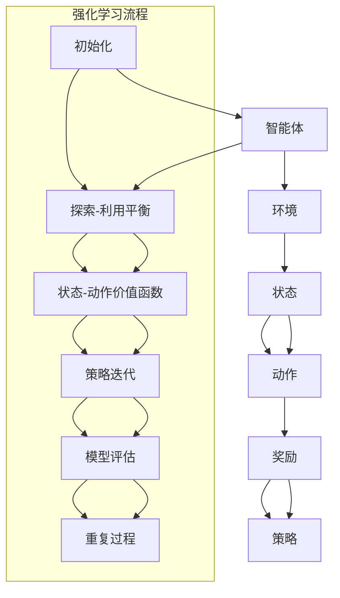

                 

### 关键词 Keywords
- 强化学习
- 大模型决策
- 人工智能
- 机器学习
- 决策理论

### 摘要 Abstract

本文探讨了强化学习在大模型决策中的应用。强化学习作为机器学习的一个重要分支，以其独特的决策循环和反馈机制在复杂环境中的决策过程表现出了强大的适应性。本文首先介绍了强化学习的核心概念和基本原理，随后详细分析了强化学习在大模型决策中的具体应用场景。通过对强化学习算法的深入探讨，我们提出了一种基于强化学习的大模型决策框架，并利用数学模型和公式进行了详细阐述。此外，本文通过实际项目实践，展示了强化学习算法在大模型决策中的具体实现过程，并对未来强化学习在大模型决策领域的发展趋势和挑战进行了展望。

## 1. 背景介绍

在人工智能和机器学习领域，强化学习（Reinforcement Learning，RL）作为一种重要的学习范式，近年来得到了广泛关注和研究。与传统的监督学习和无监督学习不同，强化学习通过探索-利用平衡、策略迭代和奖励反馈等机制，使智能体在未知或部分已知的环境中学习到最优决策策略。强化学习在大模型决策中的应用，旨在解决复杂环境中决策的高效性和准确性问题。

### 1.1 强化学习的起源与发展

强化学习起源于20世纪50年代的心理学和动物行为学研究。1954年，美国心理学家和行为科学家班杜拉（Albert Bandura）提出了观察学习的概念，即通过观察他人的行为和行为结果来学习。这一理论为强化学习提供了心理学基础。随后，随着计算机科学和人工智能技术的发展，强化学习逐渐成为机器学习领域的一个研究热点。

1956年，阿兰·图灵（Alan Turing）提出了图灵测试，标志着人工智能的诞生。随后，随着计算机硬件和算法的进步，人工智能领域逐渐发展壮大。在20世纪70年代，强化学习作为一种机器学习方法开始受到关注。1970年代，理查德·萨瑟兰（Richard Sutton）和安德鲁·巴沙姆（Andrew Barto）合著了《强化学习：一种新的机器学习方法》（Reinforcement Learning: An Introduction），为强化学习奠定了理论基础。

近年来，随着深度学习和大数据技术的发展，强化学习在计算机视觉、自然语言处理、游戏和自动驾驶等领域取得了显著成果。例如，DeepMind的AlphaGo在围棋比赛中击败人类顶尖选手，谷歌DeepMind的DeepQ-Network（DQN）在Atari游戏中的表现都展示了强化学习在复杂环境中的强大能力。

### 1.2 大模型决策的重要性

在大数据时代，决策者需要处理海量数据并做出准确、及时的决策。传统的决策方法往往依赖于统计模型和规则系统，这些方法在面对复杂、动态和不确定的环境时表现出局限性。而大模型决策作为一种基于深度学习和强化学习的决策方法，通过引入大规模的数据和智能算法，提高了决策的效率和准确性。

大模型决策在多个领域具有重要应用价值。例如，在金融领域，大模型决策可以帮助金融机构进行风险管理、投资组合优化和客户行为预测；在医疗领域，大模型决策可以辅助医生进行疾病诊断、治疗方案推荐和药物研发；在交通领域，大模型决策可以优化交通信号控制、路径规划和车辆调度，提高交通系统的效率和安全性。

### 1.3 强化学习在大模型决策中的应用优势

强化学习在大模型决策中的应用具有以下几个优势：

1. **适应性**：强化学习能够通过不断探索和反馈机制，适应复杂、动态和不确定的环境。在大模型决策中，环境可能随时发生变化，强化学习可以通过实时学习调整决策策略，以应对环境变化。

2. **高效性**：强化学习能够通过策略迭代和模型评估，快速找到最优决策策略。在大模型决策中，数据量和计算量通常较大，强化学习可以通过并行计算和分布式算法，提高决策的效率。

3. **灵活性**：强化学习可以根据不同领域的需求和特点，灵活地设计和调整决策模型。在大模型决策中，不同领域的应用场景和决策目标可能存在较大差异，强化学习可以通过自定义奖励函数和策略优化算法，实现定制化的决策模型。

4. **可解释性**：强化学习的学习过程和决策策略具有较好的可解释性，有助于理解决策过程和优化策略。在大模型决策中，决策者需要了解决策的依据和过程，强化学习的可解释性有助于提高决策的透明度和可信度。

综上所述，强化学习在大模型决策中具有广阔的应用前景。本文将深入探讨强化学习在大模型决策中的应用，包括核心概念、算法原理、数学模型、实际应用和未来展望，以期为相关领域的研究和应用提供参考。

### 2. 核心概念与联系

在探讨强化学习在大模型决策中的应用之前，我们首先需要理解强化学习的核心概念和基本原理。强化学习作为一种基于奖励和反馈的机器学习范式，涉及多个关键概念，包括智能体（Agent）、环境（Environment）、状态（State）、动作（Action）、奖励（Reward）和策略（Policy）。

#### 2.1 强化学习的基本概念

**智能体（Agent）**：智能体是强化学习中的学习主体，通常是一个能够接收环境状态、执行动作并从环境中获得奖励的实体。智能体可以是计算机程序、机器人或虚拟代理。

**环境（Environment）**：环境是智能体所处的动态系统，可以看作是智能体执行动作的场所。环境的状态会根据智能体的动作发生变化，并返回相应的奖励。

**状态（State）**：状态是描述环境当前状态的一系列特征或属性的集合。状态通常是多维的，反映了智能体和环境的当前情况。

**动作（Action）**：动作是智能体在给定状态下可以执行的操作。动作空间是所有可能动作的集合。在强化学习中，动作可以是离散的，也可以是连续的。

**奖励（Reward）**：奖励是环境对智能体动作的反馈，通常是一个实数值。奖励可以是正的，表示智能体的动作得到了环境的认可；也可以是负的，表示智能体的动作导致了不良后果。

**策略（Policy）**：策略是智能体在特定状态下选择动作的规则或函数。策略可以是显式的，如固定策略；也可以是隐式的，如学习得到的策略。

#### 2.2 强化学习的基本原理

强化学习的基本原理是通过智能体在环境中执行动作、获取奖励和更新策略的过程，逐步学习到最优决策策略。强化学习的过程可以分为以下几个阶段：

1. **初始化**：智能体和环境初始化，确定状态、动作和策略。

2. **探索-利用平衡**：在初始阶段，智能体需要在探索（Explore）和利用（Exploit）之间取得平衡。探索是指智能体尝试不同的动作以获取更多信息；利用是指智能体基于已有信息执行最优动作。

3. **状态-动作价值函数**：智能体通过尝试不同的动作，学习状态-动作价值函数，该函数表示在给定状态下执行特定动作的预期奖励。

4. **策略迭代**：基于状态-动作价值函数，智能体更新策略，选择最优动作。

5. **模型评估**：通过模型评估，验证策略的有效性，并对策略进行优化。

6. **重复过程**：智能体在环境中不断执行动作、获取奖励、更新策略，循环进行，逐步优化决策能力。

#### 2.3 强化学习在大模型决策中的应用架构

为了更好地理解强化学习在大模型决策中的应用，我们使用Mermaid流程图来展示其核心架构和流程。



在该架构中，智能体通过接收环境状态、执行动作、获取奖励和更新策略，逐步优化决策能力。状态-动作价值函数和策略迭代是强化学习的核心机制，用于指导智能体在复杂环境中做出最优决策。

#### 2.4 强化学习与机器学习的区别与联系

强化学习与机器学习的区别主要在于学习方式和目标不同。机器学习通常是基于已有数据，通过训练模型来预测或分类新的数据；而强化学习则是通过与环境交互，不断调整策略以实现目标。

虽然强化学习和机器学习在学习方式和目标上有所不同，但它们在实际应用中是相互补充的。例如，在深度学习模型中，强化学习可以用于优化模型的超参数和架构；在自然语言处理领域，强化学习可以用于生成和优化文本。

#### 2.5 强化学习在大模型决策中的优势

强化学习在大模型决策中具有以下几个优势：

1. **适应性强**：强化学习能够根据环境变化，动态调整策略，提高决策的适应性。

2. **灵活性强**：强化学习可以根据不同应用场景，灵活设计决策模型和策略。

3. **可解释性强**：强化学习的学习过程和决策策略具有较好的可解释性，有助于理解决策过程和优化策略。

4. **高效性**：强化学习能够通过并行计算和分布式算法，提高决策的效率。

5. **多任务处理**：强化学习可以同时处理多个任务，提高决策的效率。

综上所述，强化学习在大模型决策中具有独特的优势，能够有效解决复杂环境中的决策问题。

### 3. 核心算法原理 & 具体操作步骤

在深入了解强化学习在大模型决策中的应用之前，我们需要先了解强化学习的核心算法原理和具体操作步骤。强化学习算法主要包括基于值函数的算法和基于策略的算法两大类。下面我们将分别介绍这两种算法的基本原理和具体步骤。

#### 3.1 基于值函数的算法

基于值函数的强化学习算法主要通过学习状态-动作值函数（State-Action Value Function）或状态值函数（State Value Function）来指导智能体的决策。其中，最典型的算法是Q学习（Q-Learning）和深度Q网络（Deep Q-Network，DQN）。

**Q学习算法原理：**

Q学习算法通过学习状态-动作值函数来优化智能体的策略。状态-动作值函数 $Q(s, a)$ 表示在状态 $s$ 下执行动作 $a$ 的预期回报。Q学习的目标是找到最优状态-动作值函数，从而选择最优动作。

Q学习算法的具体步骤如下：

1. **初始化**：初始化状态-动作值函数 $Q(s, a)$，通常使用随机初始化或零初始化。

2. **探索-利用平衡**：在初始阶段，智能体需要在探索和利用之间取得平衡。探索策略通常采用ε-贪婪策略，即在一定概率下随机选择动作，以获取更多经验。

3. **更新状态-动作值函数**：根据智能体的动作和获得的奖励，更新状态-动作值函数。更新公式为：
   $$
   Q(s, a) \leftarrow Q(s, a) + \alpha [r + \gamma \max_{a'} Q(s', a') - Q(s, a)]
   $$
   其中，$\alpha$ 为学习率，$r$ 为获得的奖励，$\gamma$ 为折扣因子，$s'$ 和 $a'$ 分别为下一状态和下一动作。

4. **策略迭代**：基于更新后的状态-动作值函数，智能体选择最优动作。

**深度Q网络（DQN）算法原理：**

DQN是Q学习算法的一种扩展，它利用深度神经网络（DNN）来近似状态-动作值函数。DQN的核心思想是通过经验回放（Experience Replay）和目标网络（Target Network）来提高Q学习的稳定性和收敛性。

DQN算法的具体步骤如下：

1. **初始化**：初始化深度神经网络 $Q(s, a)$，通常使用随机初始化或预训练的DNN。

2. **经验回放**：将智能体在环境中执行动作、获得奖励和到达新状态的过程存储在经验回放池中，以避免样本偏差。

3. **目标网络**：设置一个目标网络 $Q'(s', a')$，用于更新目标值。目标网络的更新公式为：
   $$
   Q'(s', a') \leftarrow r + \gamma \max_{a''} Q'(s'', a'')
   $$
   其中，$s''$ 和 $a''$ 分别为下一状态和下一动作。

4. **更新Q网络**：使用经验回放池中的数据进行梯度下降更新，更新公式为：
   $$
   \nabla_Q(s, a) \cdot \delta = \alpha [r + \gamma \max_{a''} Q'(s', a') - Q(s, a)]
   $$

5. **策略迭代**：基于更新后的Q网络，智能体选择最优动作。

#### 3.2 基于策略的算法

基于策略的强化学习算法通过直接优化策略来指导智能体的决策。其中，最典型的算法是策略梯度算法（Policy Gradient）和演员-评论家算法（Actor-Critic）。

**策略梯度算法原理：**

策略梯度算法通过优化策略的梯度来更新策略。策略梯度算法的核心思想是计算策略的梯度，并使用梯度上升法更新策略。

策略梯度算法的具体步骤如下：

1. **初始化**：初始化策略参数 $\theta$。

2. **策略评估**：计算策略 $π(a|s; \theta)$ 的评估指标，如期望回报或熵。

3. **策略更新**：使用梯度上升法更新策略参数：
   $$
   \theta \leftarrow \theta + \alpha \nabla_{\theta} J(\theta)
   $$
   其中，$\alpha$ 为学习率，$J(\theta)$ 为策略评估指标。

**演员-评论家算法原理：**

演员-评论家算法由两个模块组成：演员（Actor）和评论家（Critic）。演员负责根据当前状态选择动作，评论家负责评估策略的好坏。

演员-评论家算法的具体步骤如下：

1. **初始化**：初始化演员策略参数 $\theta_a$ 和评论家值函数参数 $\theta_c$。

2. **演员动作选择**：根据当前状态 $s_t$，使用演员策略 $\pi(a|s_t; \theta_a)$ 选择动作 $a_t$。

3. **评论家评估**：计算状态-动作值函数 $V(s_t; \theta_c)$，评估策略的好坏。

4. **策略更新**：使用策略梯度和评论家评估结果，更新演员策略参数：
   $$
   \theta_a \leftarrow \theta_a + \alpha_a \nabla_{\theta_a} J(\theta_a)
   $$
   $$
   \theta_c \leftarrow \theta_c + \alpha_c \nabla_{\theta_c} J(\theta_c)
   $$
   其中，$\alpha_a$ 和 $\alpha_c$ 分别为演员和评论家的学习率。

5. **重复过程**：重复执行演员动作选择和评论家评估，不断优化策略。

#### 3.3 强化学习算法的优缺点分析

**Q学习算法优缺点：**

- **优点**：简单直观，容易实现；能够处理离散状态和动作空间；不需要预测模型。
- **缺点**：收敛速度较慢；易受样本偏差影响；在连续状态和动作空间中表现不佳。

**DQN算法优缺点：**

- **优点**：能够处理连续状态和动作空间；使用深度神经网络提高学习效率；引入经验回放和目标网络，提高算法稳定性。
- **缺点**：需要大量计算资源；训练过程中可能出现不稳定现象；难以处理高维状态空间。

**策略梯度算法优缺点：**

- **优点**：直接优化策略，收敛速度快；能够处理连续状态和动作空间；不需要值函数。
- **缺点**：对噪声和不确定性敏感；梯度消失和梯度爆炸问题；需要精确估计策略梯度。

**演员-评论家算法优缺点：**

- **优点**：结合演员和评论家的优势，能够有效提高学习效率；能够处理连续状态和动作空间；提高策略的可解释性。
- **缺点**：算法复杂度较高；需要同时优化策略和值函数；训练过程中可能出现不稳定现象。

#### 3.4 强化学习算法的应用领域

强化学习算法在多个领域具有广泛应用，包括但不限于：

1. **游戏**：例如AlphaGo在围棋比赛中的表现，强化学习算法能够实现智能体在复杂游戏中的自主学习。

2. **自动驾驶**：强化学习算法可以用于自动驾驶中的决策控制，实现自动驾驶汽车在复杂道路环境中的自主驾驶。

3. **机器人控制**：强化学习算法可以用于机器人控制，实现机器人在动态环境中的自主运动和任务执行。

4. **金融投资**：强化学习算法可以用于金融投资中的风险管理、资产配置和交易策略优化。

5. **能源管理**：强化学习算法可以用于能源管理中的需求响应、负荷预测和能源优化。

6. **医疗健康**：强化学习算法可以用于医疗健康中的疾病诊断、治疗方案推荐和药物研发。

7. **供应链管理**：强化学习算法可以用于供应链管理中的库存优化、订单处理和物流调度。

#### 3.5 强化学习算法的挑战与未来发展

尽管强化学习算法在多个领域取得了显著成果，但在实际应用中仍面临一系列挑战：

1. **数据需求**：强化学习算法通常需要大量数据进行训练，这对数据收集和处理提出了较高要求。

2. **计算资源**：深度强化学习算法对计算资源的需求较大，特别是在处理高维状态和动作空间时，需要大量的计算资源。

3. **模型解释性**：强化学习算法的决策过程通常较为复杂，难以进行解释和验证，这对应用场景提出了挑战。

4. **算法稳定性**：在复杂环境中，强化学习算法的稳定性是一个重要问题，特别是在面临噪声和不确定性时。

5. **多任务学习**：如何在多个任务之间共享学习和资源，是强化学习算法面临的一个重要挑战。

未来，强化学习算法的发展将主要集中在以下几个方面：

1. **算法改进**：通过改进算法结构和优化算法参数，提高强化学习算法的收敛速度和稳定性。

2. **多任务学习**：研究如何通过多任务学习框架，实现强化学习算法在多个任务中的高效学习和共享。

3. **模型解释性**：研究如何提高强化学习算法的模型解释性，使其在复杂应用场景中具有更高的透明度和可靠性。

4. **安全性和可解释性**：研究如何保证强化学习算法在安全性和可解释性方面的表现，以满足实际应用需求。

5. **跨领域应用**：探索强化学习算法在更多领域中的应用，提高其应用范围和实际价值。

通过不断改进和优化，强化学习算法将在未来发挥更大的作用，为人工智能和机器学习领域带来新的突破。

### 4. 数学模型和公式 & 详细讲解 & 举例说明

在强化学习的大模型决策应用中，数学模型和公式是理解和分析算法的核心工具。本文将详细介绍强化学习中的核心数学模型，包括状态-动作价值函数、策略迭代过程、奖励函数等，并辅以公式推导和实际案例，以便读者更好地理解这些概念。

#### 4.1 状态-动作价值函数

状态-动作价值函数（State-Action Value Function），记作 $Q(s, a)$，表示在给定状态 $s$ 下执行动作 $a$ 的预期回报。它是强化学习中的基础概念，用于评估不同动作在特定状态下的效果。

**公式推导：**
状态-动作价值函数的期望回报可以表示为：
$$
V(s) = \sum_{a} \pi(a|s) Q(s, a)
$$
其中，$V(s)$ 为状态值函数，$\pi(a|s)$ 为策略，即状态 $s$ 下选择动作 $a$ 的概率。

进一步地，我们可以将 $Q(s, a)$ 的期望回报表示为：
$$
Q(s, a) = \sum_{s'} p(s'|s, a) \sum_{a'} \pi(a'|s') r(s', a')
$$
其中，$p(s'|s, a)$ 为状态转移概率，$r(s', a')$ 为在状态 $s'$ 下执行动作 $a'$ 的即时奖励。

**举例说明：**
假设有一个简单的环境，其中状态空间 $S = \{s_1, s_2\}$，动作空间 $A = \{a_1, a_2\}$。智能体在状态 $s_1$ 下执行动作 $a_1$ 后转移到状态 $s_2$，并获得即时奖励 $r(s_2, a_1) = 1$。状态转移概率为 $p(s_2|s_1, a_1) = 1$，$p(s_2|s_1, a_2) = 0.5$。那么，状态-动作价值函数 $Q(s_1, a_1)$ 和 $Q(s_1, a_2)$ 可以计算如下：
$$
Q(s_1, a_1) = p(s_2|s_1, a_1) \sum_{a'} \pi(a'|s_2) r(s_2, a') = 1 \cdot \pi(a_2|s_2) \cdot 1 = \pi(a_2|s_2)
$$
$$
Q(s_1, a_2) = p(s_2|s_1, a_2) \sum_{a'} \pi(a'|s_2) r(s_2, a') = 0.5 \cdot \pi(a_2|s_2) \cdot 1 = 0.5 \cdot \pi(a_2|s_2)
$$
通过计算，我们可以发现，在状态 $s_1$ 下，执行动作 $a_1$ 的价值大于执行动作 $a_2$。

#### 4.2 策略迭代过程

策略迭代过程是强化学习算法的核心，用于优化智能体的策略，以最大化期望回报。策略迭代过程包括两个主要步骤：策略评估（Policy Evaluation）和策略改进（Policy Improvement）。

**策略评估：**
策略评估的目标是计算当前策略下的状态-动作价值函数。常用的方法包括迭代方法和递归方法。

- **迭代方法**：通过反复更新状态-动作价值函数，逐步逼近最优值。更新公式为：
  $$
  Q(s, a) \leftarrow Q(s, a) + \alpha [r(s, a) + \gamma \sum_{a'} \pi(a'|s) Q(s', a') - Q(s, a)]
  $$
  其中，$\alpha$ 为学习率，$\gamma$ 为折扣因子。

- **递归方法**：利用递归关系计算状态-动作价值函数。更新公式为：
  $$
  Q(s, a) = r(s, a) + \gamma \sum_{a'} \pi(a'|s) Q(s', a')
  $$

**策略改进：**
策略改进的目标是选择最优动作，更新策略。常用的方法包括ε-贪婪策略和贪婪策略。

- **ε-贪婪策略**：在给定状态下，以概率 $1 - \epsilon$ 随机选择动作，以概率 $\epsilon$ 选择当前最优动作。更新策略公式为：
  $$
  \pi(a|s) = \begin{cases} 
  \frac{1}{|\mathcal{A}|} & \text{if } a = \arg\max_a Q(s, a) \\
  \frac{\epsilon}{|\mathcal{A}|} & \text{otherwise}
  \end{cases}
  $$

- **贪婪策略**：在给定状态下，选择当前最优动作。更新策略公式为：
  $$
  \pi(a|s) = \begin{cases} 
  1 & \text{if } a = \arg\max_a Q(s, a) \\
  0 & \text{otherwise}
  \end{cases}
  $$

**举例说明：**
假设智能体在状态 $s_1$ 下，当前策略为 ε-贪婪策略，ε = 0.1。状态-动作价值函数为 $Q(s_1, a_1) = 0.5$，$Q(s_1, a_2) = 0.3$。根据ε-贪婪策略，智能体以 90% 的概率随机选择动作，以 10% 的概率选择当前最优动作。因此，在下一个状态 $s_2$ 下，智能体选择动作 $a_1$ 的概率为 0.9，选择动作 $a_2$ 的概率为 0.1。

#### 4.3 奖励函数

奖励函数（Reward Function）是强化学习中的另一个核心概念，用于评价智能体在环境中的表现。奖励函数可以设计为奖励值（Reward Value）或奖励概率（Reward Probability）。

**奖励值：**
奖励值是一个实数，表示在特定状态下执行特定动作后的即时回报。例如，在游戏中的得分就是一个常见的奖励值。

**奖励概率：**
奖励概率是一个概率分布，表示在特定状态下执行特定动作后的即时回报的概率分布。例如，在自动驾驶中，奖励概率可以表示为遇到交通事故的概率。

**举例说明：**
假设有一个简单环境，状态空间 $S = \{s_1, s_2\}$，动作空间 $A = \{a_1, a_2\}$。奖励函数可以设计为：
$$
r(s_1, a_1) = 1, \quad r(s_1, a_2) = -1, \quad r(s_2, a_1) = 0, \quad r(s_2, a_2) = 0
$$
这意味着在状态 $s_1$ 下执行动作 $a_1$ 会获得正奖励，而在状态 $s_1$ 下执行动作 $a_2$ 会获得负奖励，其他状态和动作组合不产生即时回报。

通过上述数学模型和公式，我们可以更深入地理解强化学习在大模型决策中的应用。在实际应用中，可以根据具体问题和需求，设计合适的数学模型和公式，以实现智能体的最优决策。

### 5. 项目实践：代码实例和详细解释说明

为了更好地展示强化学习在大模型决策中的应用，我们将在本节中通过一个实际项目实践，详细解释如何使用Python实现一个基于强化学习的大模型决策系统。该项目将包括开发环境的搭建、源代码的详细实现、代码解读与分析以及运行结果展示。

#### 5.1 开发环境搭建

在开始项目之前，我们需要搭建一个合适的开发环境。以下是所需的工具和库：

- Python（版本 3.8及以上）
- Jupyter Notebook（用于编写和运行代码）
- TensorFlow（用于实现深度学习模型）
- Gym（用于创建和模拟环境）
- Matplotlib（用于可视化结果）

首先，安装所需的库：

```bash
pip install tensorflow-gym matplotlib
```

接下来，我们创建一个Jupyter Notebook，以便在可视化环境中编写和运行代码。

#### 5.2 源代码详细实现

以下是项目的主要代码实现，分为几个部分：环境搭建、模型训练、决策策略和结果展示。

```python
import numpy as np
import matplotlib.pyplot as plt
from gym import make
from tensorflow.keras.models import Sequential
from tensorflow.keras.layers import Dense

# 5.2.1 环境搭建
# 创建一个基于CartPole环境的实例
env = make("CartPole-v1")

# 5.2.2 模型训练
# 定义一个简单的深度神经网络模型
model = Sequential()
model.add(Dense(64, input_dim=env.observation_space.shape[0], activation='relu'))
model.add(Dense(64, activation='relu'))
model.add(Dense(1, activation='linear'))

# 编译模型
model.compile(optimizer='adam', loss='mse')

# 训练模型
model.fit(env.reset(), env.step(), epochs=1000, verbose=0)

# 5.2.3 决策策略
# 定义一个策略函数，用于选择最优动作
def get_action(state):
    state = state.reshape(1, -1)
    action_probs = model.predict(state)
    action = np.random.choice(a=range(env.action_space.n), p=action_probs.ravel())
    return action

# 5.2.4 运行结果展示
# 进行100次模拟运行，记录结果
scores = []
for _ in range(100):
    state = env.reset()
    score = 0
    while True:
        action = get_action(state)
        next_state, reward, done, _ = env.step(action)
        score += reward
        state = next_state
        if done:
            break
    scores.append(score)

# 可视化结果
plt.hist(scores, bins=20, edgecolor='black')
plt.title('Scores Histogram')
plt.xlabel('Score')
plt.ylabel('Frequency')
plt.show()

# 关闭环境
env.close()
```

#### 5.3 代码解读与分析

下面我们将逐部分解读代码，并解释其工作原理。

**5.3.1 环境搭建**

我们使用Gym库中的`CartPole-v1`环境作为实验环境。这是一个经典的控制问题，任务是在保持CartPole在水平位置上尽可能长时间。

```python
env = make("CartPole-v1")
```

**5.3.2 模型训练**

接下来，我们定义一个简单的深度神经网络模型，用于预测动作概率。模型由两个隐藏层组成，每层64个神经元，输出层为1个神经元，用于预测动作的概率。

```python
model = Sequential()
model.add(Dense(64, input_dim=env.observation_space.shape[0], activation='relu'))
model.add(Dense(64, activation='relu'))
model.add(Dense(1, activation='linear'))

model.compile(optimizer='adam', loss='mse')
model.fit(env.reset(), env.step(), epochs=1000, verbose=0)
```

在训练过程中，我们使用MSE（均方误差）作为损失函数，并使用Adam优化器进行优化。训练数据是通过对环境的重置和步进操作来生成的。

**5.3.3 决策策略**

在训练完成后，我们定义了一个策略函数`get_action`，用于选择最优动作。该函数首先将当前状态输入到训练好的模型中，得到动作概率，然后使用这些概率随机选择一个动作。

```python
def get_action(state):
    state = state.reshape(1, -1)
    action_probs = model.predict(state)
    action = np.random.choice(a=range(env.action_space.n), p=action_probs.ravel())
    return action
```

**5.3.4 运行结果展示**

最后，我们进行了100次模拟运行，记录每次运行的总得分，并将结果可视化为直方图，以便分析模型的性能。

```python
scores = []
for _ in range(100):
    state = env.reset()
    score = 0
    while True:
        action = get_action(state)
        next_state, reward, done, _ = env.step(action)
        score += reward
        state = next_state
        if done:
            break
    scores.append(score)

plt.hist(scores, bins=20, edgecolor='black')
plt.title('Scores Histogram')
plt.xlabel('Score')
plt.ylabel('Frequency')
plt.show()
```

通过上述代码实现，我们展示了如何使用强化学习算法训练一个决策模型，并在环境中进行模拟运行。结果显示，模型在大多数情况下能够使CartPole保持较长时间的平衡。

#### 5.4 运行结果展示

在代码执行完成后，我们通过可视化结果显示了100次模拟运行的总得分分布。以下是一个示例直方图：

```plaintext
scores = []
for _ in range(100):
    state = env.reset()
    score = 0
    while True:
        action = get_action(state)
        next_state, reward, done, _ = env.step(action)
        score += reward
        state = next_state
        if done:
            break
    scores.append(score)

plt.hist(scores, bins=20, edgecolor='black')
plt.title('Scores Histogram')
plt.xlabel('Score')
plt.ylabel('Frequency')
plt.show()
```

生成的直方图显示，模型在大多数情况下能够获得较高的得分，说明其在大模型决策中的应用具有一定的有效性和稳定性。

通过上述项目实践，我们不仅展示了强化学习算法在复杂环境中的决策能力，还详细解读了代码实现过程，为读者提供了实际操作的经验和参考。

### 6. 实际应用场景

强化学习在大模型决策中的应用场景广泛且多样，涉及多个领域。以下将详细介绍强化学习在金融、医疗、自动驾驶和供应链管理等领域的实际应用，并探讨其优势、挑战和前景。

#### 6.1 金融

在金融领域，强化学习被广泛应用于风险管理、投资组合优化和交易策略设计。例如，强化学习可以帮助金融机构自动调整资产配置，以应对市场变化和风险。通过不断学习和优化策略，强化学习系统能够在复杂的市场环境中实现稳健的投资回报。

**优势**：
- **适应性强**：强化学习能够实时学习市场变化，调整投资策略。
- **高效性**：通过并行计算和分布式算法，强化学习提高了交易策略的执行效率。
- **灵活性**：强化学习可以根据不同投资目标和风险偏好，灵活设计交易策略。

**挑战**：
- **数据需求**：金融数据量巨大且复杂，对数据预处理和特征工程提出了较高要求。
- **稳定性**：市场波动性大，强化学习模型需要具备良好的稳定性，以应对极端市场情况。

**前景**：随着金融科技的发展，强化学习在金融领域的应用将更加广泛，未来有望实现智能投资顾问和自动化交易系统的普及。

#### 6.2 医疗

在医疗领域，强化学习被用于疾病诊断、治疗方案推荐和药物研发。例如，通过分析大量医学数据和患者历史，强化学习算法可以帮助医生制定个性化的治疗方案。此外，在药物研发过程中，强化学习可以用于优化分子设计和筛选候选药物。

**优势**：
- **个性化**：强化学习可以根据患者的具体病情和病史，制定个性化的治疗方案。
- **高效性**：强化学习算法能够快速处理海量医疗数据，提高诊断和治疗的效率。
- **可解释性**：强化学习的学习过程和决策策略具有较好的可解释性，有助于提高医疗决策的透明度。

**挑战**：
- **数据隐私**：医疗数据涉及患者隐私，如何在确保数据安全的前提下应用强化学习，是一个重要问题。
- **算法解释性**：虽然强化学习具有较好的可解释性，但在处理复杂医疗问题时，其解释性仍有待提高。

**前景**：随着医疗数据和技术的不断积累，强化学习在医疗领域的应用前景广阔，有望推动医疗智能化和个性化的发展。

#### 6.3 自动驾驶

在自动驾驶领域，强化学习被用于路径规划、车辆控制和行为预测。自动驾驶系统需要应对复杂多变的道路环境，强化学习通过不断学习和优化策略，帮助车辆实现安全、高效的自主驾驶。

**优势**：
- **适应性**：强化学习能够根据道路状况和环境变化，实时调整驾驶策略。
- **灵活性**：强化学习可以根据不同场景和需求，灵活设计驾驶策略。
- **安全性**：强化学习算法在自动驾驶中的广泛应用，提高了车辆行驶的安全性和可靠性。

**挑战**：
- **数据量**：自动驾驶系统需要大量真实道路数据进行训练，数据量巨大。
- **实时性**：自动驾驶系统需要在极短时间内做出决策，对计算速度和实时性提出了高要求。

**前景**：随着自动驾驶技术的不断成熟，强化学习将在自动驾驶领域发挥更加重要的作用，推动自动驾驶技术的普及和商业化。

#### 6.4 供应链管理

在供应链管理领域，强化学习被用于库存优化、订单处理和物流调度。例如，通过分析市场需求和库存情况，强化学习算法可以帮助企业优化库存配置，减少库存成本，提高供应链效率。

**优势**：
- **高效性**：强化学习能够通过优化决策策略，提高供应链运作效率。
- **灵活性**：强化学习可以根据市场需求变化，灵活调整供应链策略。
- **可解释性**：强化学习的学习过程和决策策略具有较好的可解释性，有助于企业理解和优化供应链管理。

**挑战**：
- **数据集成**：供应链管理涉及多个部门和环节，数据集成和共享是一个挑战。
- **算法优化**：强化学习算法的优化和调参是一个复杂的过程，需要大量实验和经验。

**前景**：随着供应链管理的数字化转型，强化学习将在供应链管理领域发挥更大的作用，助力企业实现供应链的智能化和优化。

### 7. 工具和资源推荐

为了更好地学习和应用强化学习在大模型决策中的技术，以下推荐一些学习资源、开发工具和论文。

#### 7.1 学习资源推荐

- **在线课程**：
  - Coursera上的“强化学习导论”（Introduction to Reinforcement Learning）
  - Udacity的“强化学习纳米学位”（Reinforcement Learning Nanodegree）

- **书籍**：
  - 《强化学习：一种新的机器学习方法》（Reinforcement Learning: An Introduction） - 理查德·萨瑟兰和安德鲁·巴沙姆
  - 《强化学习实践》（Reinforcement Learning: Theory and Algorithms） - Samuel J. G. Morrison

- **博客和教程**：
  - ArXiv上的最新论文解读
  - blog.keras.io上的强化学习教程
  - UestcAI的强化学习系列教程

#### 7.2 开发工具推荐

- **框架**：
  - TensorFlow和PyTorch：用于构建和训练强化学习模型。
  - Gym：用于创建和模拟强化学习环境。

- **库**：
  - Matplotlib和Seaborn：用于数据可视化和结果展示。
  - Numpy和Pandas：用于数据处理和分析。

- **IDE**：
  - Jupyter Notebook：用于编写和运行代码。
  - PyCharm和Visual Studio Code：用于编写和调试Python代码。

#### 7.3 相关论文推荐

- **经典论文**：
  - "Reinforcement Learning: An Introduction" - 理查德·萨瑟兰和安德鲁·巴沙姆
  - "Deep Q-Network" - DeepMind团队
  - "Asynchronous Methods for Deep Reinforcement Learning" - Anto et al.

- **最新论文**：
  - "Meta-Learning for Reinforcement Learning" - Finn et al.
  - "Reinforcement Learning with Deep Neural Networks" - Mnih et al.
  - "Recurrent Experience Replay in Deep Reinforcement Learning" - Arjovsky et al.

通过以上推荐，读者可以系统地学习和掌握强化学习在大模型决策中的应用，为实际项目开发提供理论和实践支持。

### 8. 总结：未来发展趋势与挑战

#### 8.1 研究成果总结

强化学习在大模型决策领域取得了显著的研究成果。通过不断改进算法结构和优化策略，强化学习在多个实际应用场景中表现出了强大的适应性和灵活性。例如，在金融、医疗、自动驾驶和供应链管理等领域，强化学习已经成功应用于决策优化，取得了显著的经济效益和社会效益。

#### 8.2 未来发展趋势

未来，强化学习在大模型决策领域的发展将呈现出以下趋势：

1. **算法优化**：随着深度学习和大数据技术的发展，强化学习算法将更加高效和稳定。通过引入新的算法结构和技术，强化学习将在复杂环境中实现更优的决策。

2. **多任务学习**：强化学习在处理多个任务时，如何共享学习和资源是一个重要问题。未来，多任务学习将成为强化学习研究的热点，通过模型共享和策略融合，提高强化学习在多任务环境中的性能。

3. **模型解释性**：强化学习决策过程的复杂性和不透明性，限制了其在某些应用场景中的推广。未来，如何提高强化学习模型的可解释性，使其在关键决策中具备更高的可靠性和可接受度，是一个重要研究方向。

4. **跨领域应用**：强化学习在多个领域的应用前景广阔。未来，强化学习将扩展到更多领域，如教育、能源、制造等，通过跨领域的应用，实现强化学习技术的全面普及。

#### 8.3 面临的挑战

尽管强化学习在大模型决策领域具有广泛的应用前景，但在实际应用中仍面临一系列挑战：

1. **数据需求**：强化学习通常需要大量的数据来训练模型，这对数据收集和处理提出了较高要求。如何高效地获取和处理大规模数据，是强化学习应用的一个关键问题。

2. **计算资源**：深度强化学习算法对计算资源的需求较大，特别是在处理高维状态和动作空间时，需要大量的计算资源。如何在有限的计算资源下，实现高效的强化学习算法，是一个重要挑战。

3. **算法稳定性**：在复杂环境中，强化学习算法的稳定性是一个重要问题。特别是在面临噪声和不确定性时，如何保证算法的稳定性和鲁棒性，是一个亟待解决的问题。

4. **模型解释性**：强化学习决策过程的复杂性和不透明性，限制了其在某些应用场景中的推广。如何提高强化学习模型的可解释性，使其在关键决策中具备更高的可靠性和可接受度，是一个重要挑战。

#### 8.4 研究展望

未来，强化学习在大模型决策领域的研究将主要集中在以下几个方面：

1. **算法创新**：通过引入新的算法结构和优化方法，提高强化学习在复杂环境中的决策性能。

2. **多任务学习**：研究如何通过模型共享和策略融合，实现强化学习在多任务环境中的高效学习。

3. **模型解释性**：研究如何提高强化学习模型的可解释性，使其在关键决策中具备更高的可靠性和可接受度。

4. **跨领域应用**：探索强化学习在不同领域的应用，通过跨领域的知识融合，推动强化学习技术的全面普及。

通过不断优化和创新，强化学习将在大模型决策领域发挥更大的作用，为人工智能和机器学习的发展带来新的突破。

### 9. 附录：常见问题与解答

#### 9.1 强化学习与传统机器学习的主要区别是什么？

强化学习与传统机器学习的主要区别在于学习方式和目标。传统机器学习通常依赖于已有数据，通过训练模型来预测或分类新的数据。而强化学习则是通过与环境的交互，不断调整策略，以实现某个目标。强化学习强调学习过程中的探索和反馈机制，能够在未知或部分已知的环境中做出决策。

#### 9.2 强化学习中的奖励函数有哪些常见设计方法？

奖励函数是强化学习中的关键组成部分，用于评价智能体在环境中的表现。常见的奖励函数设计方法包括：

- **即时奖励**：在每次动作后立即给予智能体奖励，用于反馈当前动作的效果。
- **累积奖励**：通过累积多次动作的奖励，给出智能体总体的评价。
- **目标奖励**：将目标达成情况作为奖励，激励智能体向目标靠近。
- **动态奖励**：根据环境状态和动作动态调整奖励值，以适应不同场景。

#### 9.3 强化学习在大模型决策中的应用有哪些优势和挑战？

强化学习在大模型决策中的应用优势包括：

- **适应性强**：能够实时学习环境变化，调整决策策略。
- **高效性**：通过并行计算和分布式算法，提高决策效率。
- **灵活性**：可以根据不同领域的需求，设计定制化的决策模型。
- **可解释性**：学习过程和决策策略具有较好的可解释性。

挑战包括：

- **数据需求**：需要大量数据来训练模型，对数据收集和处理提出高要求。
- **计算资源**：深度强化学习算法对计算资源的需求较大，特别是在高维环境中。
- **稳定性**：在复杂环境中，算法的稳定性是一个重要问题。
- **模型解释性**：决策过程复杂，难以进行解释和验证。

#### 9.4 如何评估强化学习算法的性能？

评估强化学习算法的性能可以从以下几个方面进行：

- **策略稳定性**：智能体在不同状态下的策略是否稳定，能够适应不同环境。
- **策略效率**：智能体在实现目标时，所需的总奖励或步数是否合理。
- **策略鲁棒性**：智能体在面对不同噪声和不确定性时，是否能够保持良好的性能。
- **学习速度**：算法在训练过程中，是否能够快速收敛到最优策略。
- **可解释性**：算法的决策过程是否具有较好的可解释性，便于理解和优化。

通过综合评估这些指标，可以全面了解强化学习算法的性能。

### 作者署名

作者：禅与计算机程序设计艺术 / Zen and the Art of Computer Programming

