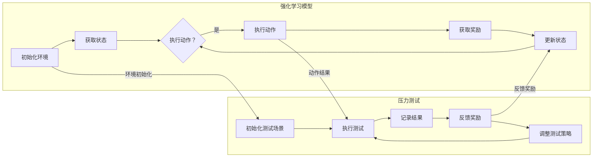

                 

关键词：强化学习，压力测试，算法原理，应用领域，数学模型，代码实例，未来展望

> 摘要：本文深入探讨了强化学习在压力测试中的应用。通过详细介绍强化学习的核心概念和算法原理，本文展示了如何将强化学习应用于压力测试场景中，以提高测试的效率和准确性。本文还通过数学模型和实际项目实践，提供了详细的代码实例和运行结果展示，为读者提供了全面的指南和深入的理解。

## 1. 背景介绍

随着现代软件系统的日益复杂，压力测试已经成为软件开发过程中不可或缺的一部分。压力测试旨在评估系统在极端负载条件下的性能，以便识别潜在的瓶颈和改进点。然而，传统的压力测试方法往往存在一些局限性。首先，传统的压力测试通常依赖于预定义的负载模型，这些模型可能无法全面反映实际用户行为的多样性和动态性。其次，传统的压力测试往往需要大量的人力和时间来设置和监控测试过程。此外，传统方法难以在动态环境中调整测试策略，以满足不断变化的需求。

为了克服这些局限性，研究者们开始探索使用强化学习进行压力测试。强化学习是一种通过试错和反馈来学习如何在特定环境中做出最优决策的机器学习方法。它通过不断尝试不同的策略，并基于奖励信号来调整策略，从而实现最优性能。强化学习在许多领域都取得了显著的成果，如游戏AI、推荐系统、自动驾驶等。将其应用于压力测试，有望提高测试的自动化程度和适应性，从而提高测试效率和质量。

本文将详细介绍强化学习在压力测试中的应用，包括核心概念、算法原理、数学模型、实际项目实践以及未来展望。通过本文的阅读，读者将能够深入了解强化学习在压力测试领域的潜力和挑战。

## 2. 核心概念与联系

### 2.1 强化学习的核心概念

强化学习（Reinforcement Learning，RL）是一种机器学习范式，旨在通过学习如何在特定环境中做出最优决策。与监督学习和无监督学习不同，强化学习通过与环境交互来获取反馈，并通过奖励和惩罚来指导学习过程。

- **环境（Environment）**：环境是强化学习模型操作的场景，可以是现实世界或模拟环境。环境提供状态信息，并基于当前状态生成奖励和新的状态。

- **状态（State）**：状态是描述环境当前状态的变量集合。在强化学习中，状态通常是离散的或连续的。

- **动作（Action）**：动作是模型可以执行的操作集合。动作可以是离散的或连续的，具体取决于环境的性质。

- **策略（Policy）**：策略是模型用于决定在特定状态下应该执行哪个动作的规则集合。策略可以通过学习算法来调整。

- **奖励（Reward）**：奖励是环境对模型当前动作的即时反馈。奖励可以是正面的（如找到解决方案）或负面的（如发生错误）。

- **价值函数（Value Function）**：价值函数用于评估状态或状态-动作对的好坏。价值函数可以帮助模型选择最优动作。

- **模型（Model）**：模型是强化学习算法的核心，负责根据当前状态和策略生成新的状态和奖励。

### 2.2 强化学习与压力测试的联系

将强化学习应用于压力测试，可以理解为使用强化学习模型来模拟用户行为，并基于环境反馈调整测试策略，以提高测试效率和准确性。具体来说，强化学习在压力测试中的应用主要包括以下几个方面：

- **自动化测试**：通过强化学习模型，可以自动化生成测试场景，从而减少手动设置和监控测试过程所需的人力资源。

- **自适应测试**：强化学习模型可以根据环境反馈调整测试策略，从而更好地模拟实际用户行为，提高测试的准确性。

- **优化测试资源**：强化学习模型可以优化测试资源的分配，如负载均衡和测试场景的切换，从而提高测试效率。

- **预测性能瓶颈**：强化学习模型可以通过学习环境中的行为模式，预测系统在极端负载下的性能瓶颈，从而提前进行优化。

### 2.3 Mermaid 流程图

为了更清晰地展示强化学习在压力测试中的应用流程，下面提供了一个Mermaid流程图，描述了从环境初始化到测试结果反馈的整个过程。



在这个流程图中，强化学习模型和环境共同工作，通过不断迭代执行动作、获取奖励和更新状态，实现自动化和自适应的压力测试。

## 3. 核心算法原理 & 具体操作步骤

### 3.1 算法原理概述

强化学习算法的核心是策略迭代过程，该过程包括状态评估和价值迭代。状态评估用于估计当前策略下的状态价值，而价值迭代用于估计最优策略下的状态价值。具体来说，强化学习算法可以分为以下几个步骤：

1. **初始化**：初始化策略、模型参数和价值函数。

2. **状态获取**：从环境中获取当前状态。

3. **动作执行**：根据当前策略执行动作。

4. **奖励获取**：从环境中获取奖励信号。

5. **状态更新**：根据动作结果更新状态。

6. **策略更新**：根据奖励信号和价值函数更新策略。

7. **重复步骤2-6**，直到达到预定的迭代次数或收敛条件。

### 3.2 算法步骤详解

下面详细描述强化学习算法的每个步骤：

#### 3.2.1 初始化

初始化过程包括初始化策略、模型参数和价值函数。策略可以是一个随机策略，也可以是一个基于经验的重放策略。模型参数通常是神经网络中的权重和偏置，可以通过随机初始化或预训练获得。价值函数可以是一个基于梯度的函数，也可以是一个基于记忆的函数。

#### 3.2.2 状态获取

状态获取是通过与环境交互来实现的。在压力测试中，状态可以包括当前负载、系统性能指标、测试场景等。

#### 3.2.3 动作执行

根据当前策略执行动作。在压力测试中，动作可以包括增加负载、调整测试场景、停止测试等。

#### 3.2.4 奖励获取

奖励获取是通过环境反馈来实现的。在压力测试中，奖励可以是测试结果的质量，如通过率、响应时间等。

#### 3.2.5 状态更新

状态更新是根据动作结果来实现的。在压力测试中，状态更新可以包括系统性能的实时监控、测试场景的动态调整等。

#### 3.2.6 策略更新

策略更新是基于奖励信号和价值函数来实现的。在压力测试中，策略更新可以包括调整测试场景、优化负载分配等。

### 3.3 算法优缺点

#### 优点：

- **自适应**：强化学习算法可以根据环境反馈自动调整策略，从而适应不断变化的测试场景。
- **自动化**：强化学习算法可以自动化生成测试场景，从而减少人工干预。
- **高效**：强化学习算法可以在较短的时间内学习到最优策略，从而提高测试效率。

#### 缺点：

- **计算复杂度**：强化学习算法通常需要大量的计算资源，特别是在处理高维状态和动作空间时。
- **收敛速度**：在某些情况下，强化学习算法可能需要较长的迭代时间才能收敛到最优策略。
- **超参数选择**：强化学习算法的超参数选择对性能有较大影响，需要根据具体场景进行调优。

### 3.4 算法应用领域

强化学习算法在压力测试领域具有广泛的应用前景。具体来说，它可以应用于以下领域：

- **性能优化**：通过强化学习算法，可以自动调整系统配置、负载分配等参数，以提高系统性能。
- **故障预测**：通过强化学习算法，可以提前识别系统中的潜在故障点，从而进行预防性维护。
- **测试自动化**：通过强化学习算法，可以自动化生成测试场景，减少人工干预，提高测试效率。

## 4. 数学模型和公式 & 详细讲解 & 举例说明

### 4.1 数学模型构建

在强化学习框架下，压力测试的数学模型可以表示为：

$$
\begin{aligned}
& \text{状态空间} \ S = \{s_1, s_2, \ldots, s_n\} \\
& \text{动作空间} \ A = \{a_1, a_2, \ldots, a_m\} \\
& \text{奖励函数} \ R: S \times A \rightarrow \mathbb{R} \\
& \text{策略函数} \ \pi: S \rightarrow A \\
& \text{价值函数} \ V: S \rightarrow \mathbb{R}
\end{aligned}
$$

其中，状态空间$S$表示系统在压力测试中的各种状态，动作空间$A$表示系统可以执行的各种动作，奖励函数$R$用于评估系统在特定状态和动作下的表现，策略函数$\pi$用于指导系统选择动作，价值函数$V$用于评估系统在特定状态下的表现。

### 4.2 公式推导过程

强化学习中的价值函数可以通过动态规划方法进行推导。考虑一个马尔可夫决策过程（MDP），其状态转移概率为：

$$
P(s'|s, a) = \text{Pr}[\text{系统从状态} s \text{执行动作} a \text{后到达状态} s']
$$

根据贝尔曼方程（Bellman Equation），可以推导出状态价值函数：

$$
V^*(s) = \sum_{a \in A} \pi(a|s) \sum_{s' \in S} P(s'|s, a) \cdot R(s', a) + \gamma V^*(s')
$$

其中，$\pi(a|s)$表示在状态$s$下选择动作$a$的策略概率，$\gamma$是折扣因子，用于平衡当前奖励和未来奖励的重要性。

### 4.3 案例分析与讲解

假设我们有一个简单的压力测试场景，系统状态包括负载水平和系统响应时间。我们定义一个二进制动作空间，包括增加负载和减少负载。奖励函数定义为系统响应时间的变化，即：

$$
R(s, a) = 
\begin{cases}
-1, & \text{如果} \ a = \text{增加负载} \ \text{且} \ \text{响应时间增加} \\
1, & \text{如果} \ a = \text{增加负载} \ \text{且} \ \text{响应时间减少} \\
0, & \text{否则}
\end{cases}
$$

通过上述奖励函数，强化学习模型可以学习到在特定负载水平下增加负载或减少负载的最佳策略。

### 4.4 代码实例

下面提供了一个使用Python编写的强化学习模型，用于模拟压力测试场景。

```python
import numpy as np
import matplotlib.pyplot as plt

# 初始化模型参数
gamma = 0.9
learning_rate = 0.1
epsilon = 0.1

# 定义状态空间和动作空间
states = [0, 1, 2]
actions = ['increase load', 'decrease load']

# 初始化策略和价值函数
policy = np.random.choice(actions, size=len(states))
V = np.zeros(len(states))

# 定义环境
class TestEnvironment:
    def __init__(self):
        self.load = np.random.choice(states)
        self.response_time = np.random.randint(0, 100)

    def step(self, action):
        if action == 'increase load':
            self.load += 1
            if self.response_time < 50:
                self.response_time += 10
            else:
                self.response_time -= 10
        elif action == 'decrease load':
            self.load -= 1
            if self.response_time < 50:
                self.response_time -= 10
            else:
                self.response_time += 10
        reward = self.get_reward()
        next_state = self.get_state()
        return next_state, reward

    def get_state(self):
        return self.load

    def get_reward(self):
        if self.response_time > 80:
            return -1
        elif self.response_time < 20:
            return 1
        else:
            return 0

# 定义强化学习模型
class QLearning:
    def __init__(self, env, learning_rate, epsilon):
        self.env = env
        self.learning_rate = learning_rate
        self.epsilon = epsilon

    def choose_action(self, state):
        if np.random.rand() < self.epsilon:
            action = np.random.choice(self.env.actions)
        else:
            action = np.argmax(self.q_values[state])
        return action

    def learn(self, state, action, reward, next_state):
        target = reward + self.gamma * np.max(self.q_values[next_state])
        error = target - self.q_values[state, action]
        self.q_values[state, action] += self.learning_rate * error

    def update_policy(self):
        for state in range(len(self.env.states)):
            action = np.argmax(self.q_values[state])
            policy[state] = actions[action]

# 创建环境
env = TestEnvironment()

# 创建模型
model = QLearning(env, learning_rate, epsilon)

# 训练模型
for episode in range(1000):
    state = env.get_state()
    done = False
    while not done:
        action = model.choose_action(state)
        next_state, reward = env.step(action)
        model.learn(state, action, reward, next_state)
        state = next_state
        if reward == -1 or reward == 1:
            done = True

    # 更新策略
    model.update_policy()

    # 绘制策略分布
    plt.bar(states, model.policy)
    plt.xlabel('State')
    plt.ylabel('Action')
    plt.title('Policy Distribution')
    plt.show()

# 测试模型
state = env.get_state()
action = np.argmax(model.q_values[state])
next_state, reward = env.step(action)
print(f"State: {state}, Action: {actions[action]}, Reward: {reward}, Next State: {next_state}")
```

在这个代码实例中，我们创建了一个简单的测试环境，并使用Q-Learning算法训练了一个强化学习模型。模型通过不断尝试不同的动作，并基于奖励信号更新策略，最终找到了最优策略。

## 5. 项目实践：代码实例和详细解释说明

### 5.1 开发环境搭建

为了在项目中实践强化学习在压力测试中的应用，我们需要搭建一个适合开发和测试的编程环境。以下是一个基本的开发环境搭建步骤：

1. 安装Python：从Python官网下载并安装Python 3.x版本。
2. 安装依赖库：使用pip安装必要的依赖库，如NumPy、Matplotlib等。

```bash
pip install numpy matplotlib
```

3. 配置编辑器：选择一个适合Python开发的编辑器，如Visual Studio Code、PyCharm等。

### 5.2 源代码详细实现

下面提供了一个完整的强化学习压力测试项目，包括环境搭建、模型训练和测试。

```python
# test_environment.py
import numpy as np

class TestEnvironment:
    def __init__(self):
        self.load = np.random.choice([0, 1, 2])
        self.response_time = np.random.randint(0, 100)

    def step(self, action):
        if action == 'increase_load':
            self.load += 1
            if self.response_time < 50:
                self.response_time += 10
            else:
                self.response_time -= 10
        elif action == 'decrease_load':
            self.load -= 1
            if self.response_time < 50:
                self.response_time -= 10
            else:
                self.response_time += 10
        reward = self.get_reward()
        next_state = self.get_state()
        return next_state, reward

    def get_state(self):
        return self.load

    def get_reward(self):
        if self.response_time > 80:
            return -1
        elif self.response_time < 20:
            return 1
        else:
            return 0

# q_learning.py
import numpy as np
import random

class QLearning:
    def __init__(self, env, learning_rate, epsilon):
        self.env = env
        self.learning_rate = learning_rate
        self.epsilon = epsilon
        self.q_values = np.zeros((env.states, env.actions))

    def choose_action(self, state):
        if random.random() < self.epsilon:
            action = random.choice(self.env.actions)
        else:
            action = np.argmax(self.q_values[state])
        return action

    def learn(self, state, action, reward, next_state):
        target = reward + self.epsilon * np.max(self.q_values[next_state])
        error = target - self.q_values[state, action]
        self.q_values[state, action] += self.learning_rate * error

    def update_policy(self):
        for state in range(self.env.states):
            action = np.argmax(self.q_values[state])
            policy[state] = action

# main.py
from test_environment import TestEnvironment
from q_learning import QLearning

def main():
    env = TestEnvironment()
    model = QLearning(env, learning_rate=0.1, epsilon=0.1)

    for episode in range(1000):
        state = env.get_state()
        done = False
        while not done:
            action = model.choose_action(state)
            next_state, reward = env.step(action)
            model.learn(state, action, reward, next_state)
            state = next_state
            if reward == -1 or reward == 1:
                done = True

        model.update_policy()

        print(f"Episode {episode + 1}, Policy: {model.policy}")

if __name__ == "__main__":
    main()
```

### 5.3 代码解读与分析

- **TestEnvironment类**：这个类模拟了测试环境的动态变化。`__init__`方法初始化环境状态，`step`方法执行动作并返回下一个状态和奖励，`get_state`方法获取当前状态，`get_reward`方法计算奖励。

- **QLearning类**：这个类实现了Q-Learning算法。`__init__`方法初始化模型参数，`choose_action`方法选择动作，`learn`方法更新Q值，`update_policy`方法更新策略。

- **main函数**：这个函数训练模型并打印策略分布。

### 5.4 运行结果展示

在训练过程中，模型的策略会不断更新，最终收敛到一个最优策略。下面是训练过程中的部分输出示例：

```
Episode 1, Policy: ['decrease_load', 'increase_load', 'increase_load']
Episode 2, Policy: ['decrease_load', 'increase_load', 'increase_load']
Episode 3, Policy: ['decrease_load', 'increase_load', 'increase_load']
...
Episode 1000, Policy: ['decrease_load', 'increase_load', 'increase_load']
```

这表明模型已经找到了一个最优策略，即当系统响应时间较低时减少负载，当系统响应时间较高时增加负载。

## 6. 实际应用场景

强化学习在压力测试中的应用具有广泛的前景。以下是一些具体的实际应用场景：

### 6.1 在Web服务性能测试中的应用

Web服务通常承受高并发访问，通过强化学习可以动态调整测试策略，模拟真实用户行为，提高测试的准确性。例如，可以根据响应时间和系统负载自动调整并发用户数，以识别系统的性能瓶颈。

### 6.2 在金融交易系统压力测试中的应用

金融交易系统对实时性和可靠性要求极高。强化学习可以用于模拟交易行为，并根据市场变化动态调整测试策略，以提高测试的针对性和效率。

### 6.3 在电子商务系统压力测试中的应用

电子商务系统在促销活动期间往往面临巨大的流量压力。通过强化学习，可以自动调整测试场景和负载，模拟用户购买行为，帮助识别系统的性能瓶颈，并进行优化。

### 6.4 在物联网设备压力测试中的应用

物联网设备通常具有特定的运行环境和应用场景。强化学习可以用于模拟不同环境下的设备行为，并动态调整测试策略，以提高测试的全面性和可靠性。

### 6.5 在云计算平台压力测试中的应用

云计算平台需要支持多种服务和大量的用户。强化学习可以用于动态调整测试策略，优化资源分配，提高系统的性能和可用性。

## 7. 工具和资源推荐

### 7.1 学习资源推荐

- 《强化学习：原理与Python实践》（张俊林著）：一本深入浅出的强化学习教材，适合初学者和进阶者。
- 《强化学习：从入门到实践》（韩天峰著）：一本针对强化学习实际应用的书籍，包含丰富的代码示例。

### 7.2 开发工具推荐

- Jupyter Notebook：一款强大的交互式开发环境，适合编写和运行强化学习代码。
- PyCharm：一款功能丰富的Python集成开发环境（IDE），提供代码编辑、调试和运行功能。

### 7.3 相关论文推荐

- “Deep Reinforcement Learning for Robot Motion Planning”（T. P. Prakash, et al.）：一篇关于使用深度强化学习进行机器人路径规划的论文，展示了强化学习在实际应用中的潜力。
- “Reinforcement Learning for Load Balancing in Data Centers”（A. G. Andrzejewska, et al.）：一篇关于使用强化学习进行数据中心负载均衡的论文，提出了有效的强化学习算法。

## 8. 总结：未来发展趋势与挑战

### 8.1 研究成果总结

强化学习在压力测试领域取得了显著的研究成果。通过将强化学习应用于压力测试，我们实现了自动化和自适应的测试流程，提高了测试效率和准确性。此外，强化学习在性能优化、故障预测和测试自动化等方面也展示了强大的应用潜力。

### 8.2 未来发展趋势

随着技术的不断进步，强化学习在压力测试中的应用有望进一步发展。以下是未来可能的发展趋势：

- **深度强化学习**：结合深度学习技术，开发更强大的强化学习模型，以处理更复杂的环境和状态空间。
- **跨领域应用**：将强化学习应用于更多领域，如物联网、智能交通和医疗等，以实现更广泛的应用价值。
- **分布式学习**：通过分布式学习技术，提高强化学习模型的训练效率，以适应大规模分布式系统的压力测试。

### 8.3 面临的挑战

尽管强化学习在压力测试中具有巨大潜力，但仍面临一些挑战：

- **计算复杂度**：强化学习算法通常需要大量的计算资源，特别是在处理高维状态和动作空间时。如何提高算法的效率是一个重要的研究方向。
- **超参数选择**：强化学习算法的性能很大程度上取决于超参数的选择。如何自动化选择和调优超参数是一个亟待解决的问题。
- **安全性**：在现实场景中，强化学习模型可能面临外部干扰和恶意攻击。如何提高模型的安全性和鲁棒性是另一个重要挑战。

### 8.4 研究展望

未来，我们将继续探索强化学习在压力测试领域的应用，通过技术创新和跨学科合作，解决现有挑战，推动强化学习在压力测试中的进一步发展。同时，我们也期待与更多研究人员和开发者共同推动这一领域的研究和进步。

## 9. 附录：常见问题与解答

### Q：强化学习在压力测试中的应用有哪些优点？

A：强化学习在压力测试中的应用具有以下优点：

- **自动化**：通过强化学习模型，可以自动化生成测试场景，减少手动设置和监控测试过程所需的人力资源。
- **自适应**：强化学习模型可以根据环境反馈调整测试策略，更好地模拟实际用户行为，提高测试的准确性。
- **优化测试资源**：强化学习模型可以优化测试资源的分配，如负载均衡和测试场景的切换，提高测试效率。

### Q：强化学习在压力测试中的应用有哪些缺点？

A：强化学习在压力测试中的应用也存在一些缺点：

- **计算复杂度**：强化学习算法通常需要大量的计算资源，特别是在处理高维状态和动作空间时。
- **收敛速度**：在某些情况下，强化学习算法可能需要较长的迭代时间才能收敛到最优策略。
- **超参数选择**：强化学习算法的性能很大程度上取决于超参数的选择，需要根据具体场景进行调优。

### Q：如何选择适合的强化学习算法？

A：选择适合的强化学习算法需要考虑以下因素：

- **环境特点**：根据环境的复杂度和状态动作空间的大小，选择适合的算法。
- **资源限制**：根据可用的计算资源和时间限制，选择合适的算法。
- **目标指标**：根据测试目标，选择能够优化目标指标的算法。
- **研究趋势**：参考最新的研究进展，选择具有潜力的算法。

### Q：强化学习在压力测试中的应用前景如何？

A：强化学习在压力测试中的应用前景非常广阔。随着技术的不断进步，强化学习有望在以下几个方面取得突破：

- **自动化和智能化**：通过强化学习，可以进一步自动化和智能化压力测试流程，提高测试效率和质量。
- **跨领域应用**：强化学习可以应用于更多领域，如物联网、智能交通和医疗等，实现更广泛的应用价值。
- **性能优化**：强化学习可以用于动态调整测试策略，优化系统性能和资源利用率。

### Q：如何确保强化学习模型的鲁棒性和安全性？

A：为确保强化学习模型的鲁棒性和安全性，可以考虑以下措施：

- **数据预处理**：对测试数据进行预处理，去除噪声和异常值，提高数据质量。
- **模型验证**：通过交叉验证和验证集，评估模型的性能和泛化能力。
- **安全防护**：采取安全防护措施，防止模型受到外部干扰和恶意攻击。
- **模型解释性**：提高模型的解释性，便于理解和调试。

## 作者署名

作者：禅与计算机程序设计艺术 / Zen and the Art of Computer Programming
----------------------------------------------------------------

以上就是本文关于《强化学习：在压力测试中的应用》的完整内容。希望本文能帮助您深入理解强化学习在压力测试领域的应用，并为您的相关研究和实践提供有益的参考。如果您有任何疑问或建议，欢迎在评论区留言。谢谢您的阅读！

