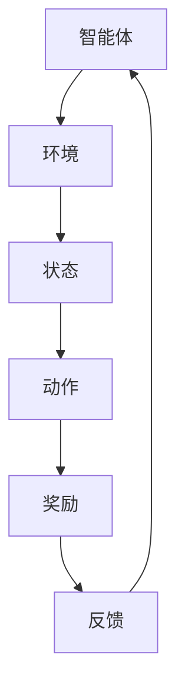

                 

强化学习（Reinforcement Learning, RL）作为机器学习的重要分支，近年来在人工智能领域取得了显著进展。本文将深入探讨强化学习在无人驾驶领域的应用，旨在为广大读者提供一个全面的视角，了解这一前沿技术的实际应用和未来前景。

## 文章关键词

- 强化学习
- 无人驾驶
- 深度学习
- 自动驾驶
- 策略搜索
- 状态-动作价值函数

## 文章摘要

本文首先介绍了强化学习的基本概念和原理，接着讨论了强化学习在无人驾驶中的核心应用。随后，通过具体的数学模型和公式，详细阐述了强化学习算法在无人驾驶中的实现过程。最后，本文结合实际项目案例，展示了强化学习在无人驾驶领域的实践应用，并对未来的发展趋势和挑战进行了展望。

## 1. 背景介绍

### 1.1 强化学习的基本概念

强化学习是一种通过试错（trial-and-error）和反馈（feedback）进行学习的过程。与监督学习和无监督学习不同，强化学习中的智能体（agent）通过与环境的交互，不断调整策略，以达到最大化长期奖励的目的。强化学习主要包括四个核心组成部分：智能体、环境、策略和奖励。

- **智能体（Agent）**：执行动作并接受环境反馈的主体。
- **环境（Environment）**：智能体所处的环境，提供状态和反馈。
- **策略（Policy）**：智能体根据当前状态选择动作的规则。
- **奖励（Reward）**：环境对智能体动作的反馈，用于评估智能体的表现。

### 1.2 强化学习的发展历程

强化学习起源于20世纪50年代，早期的研究主要集中在决策理论。直到20世纪90年代，随着深度学习技术的发展，强化学习取得了突破性进展。特别是深度强化学习（Deep Reinforcement Learning, DRL），通过结合深度神经网络，使得智能体能够处理高维的状态空间和复杂的决策问题。

### 1.3 无人驾驶技术的发展

无人驾驶技术作为人工智能的重要应用领域，正逐步从实验室走向现实。无人驾驶技术主要包括感知、定位、规划和控制四个核心部分。近年来，随着传感器技术、计算机视觉和深度学习算法的不断发展，无人驾驶技术取得了显著的进展。

## 2. 核心概念与联系

### 2.1 强化学习的基本原理

强化学习通过智能体与环境的互动，不断调整策略，以实现最优行为。其核心在于建立状态-动作价值函数（State-Action Value Function）和策略（Policy）。

- **状态-动作价值函数**：表示在某个状态下执行某个动作所能获得的预期奖励。
- **策略**：定义了智能体在不同状态下的行动规则。

### 2.2 无人驾驶中的强化学习

在无人驾驶中，强化学习可以用于自动驾驶车辆的决策过程，如道路选择、车速控制、车道保持等。具体来说，强化学习可以用于以下方面：

- **路径规划**：智能体根据当前路况和目标位置，选择最优行驶路径。
- **行为控制**：智能体根据环境反馈，调整车辆的加速度、转向等行为。
- **异常处理**：智能体在遇到突发情况时，能够及时做出反应。

### 2.3 Mermaid 流程图



## 3. 核心算法原理 & 具体操作步骤

### 3.1 算法原理概述

强化学习算法主要包括两大类：值函数方法和策略搜索方法。

- **值函数方法**：通过学习状态-动作价值函数，以最大化累积奖励。
- **策略搜索方法**：直接学习最优策略，以最大化长期奖励。

本文重点介绍深度强化学习（DRL），其核心算法包括：

- **深度神经网络（DNN）**：用于建模状态-动作价值函数。
- **策略梯度方法**：用于优化策略。

### 3.2 算法步骤详解

#### 3.2.1 初始化

- **环境初始化**：创建模拟环境，设置初始状态。
- **智能体初始化**：初始化策略网络和价值网络。

#### 3.2.2 执行动作

- **状态编码**：将当前状态输入到深度神经网络。
- **动作选择**：根据当前策略，选择最佳动作。

#### 3.2.3 收集反馈

- **执行动作**：在环境中执行选定的动作。
- **收集奖励**：根据动作结果，收集奖励信号。

#### 3.2.4 更新网络

- **计算梯度**：根据奖励信号，计算策略网络和价值网络的梯度。
- **梯度下降**：使用梯度下降算法，更新网络参数。

#### 3.2.5 重复执行

- **重复步骤3.2.2至3.2.4**，直到达到停止条件。

### 3.3 算法优缺点

#### 优点：

- **适应性**：能够适应复杂的环境和动态变化。
- **灵活性**：无需预先定义环境状态和动作空间。

#### 缺点：

- **计算复杂度高**：特别是深度强化学习，训练过程需要大量的计算资源。
- **收敛速度慢**：可能需要较长时间才能收敛到最优策略。

### 3.4 算法应用领域

- **无人驾驶**：用于自动驾驶车辆的路径规划和行为控制。
- **游戏开发**：用于开发智能游戏角色。
- **机器人控制**：用于自主机器人行动规划。

## 4. 数学模型和公式 & 详细讲解 & 举例说明

### 4.1 数学模型构建

强化学习中的数学模型主要包括两部分：状态-动作价值函数和策略。

#### 4.1.1 状态-动作价值函数

$$ V^*(s, a) = \sum_{s'} p(s'|s, a) \cdot \gamma \cdot \sum_{a'} V^*(s', a') $$

其中，$V^*(s, a)$ 表示在状态 $s$ 下执行动作 $a$ 的最优价值函数，$p(s'|s, a)$ 表示在状态 $s$ 下执行动作 $a$ 后，转移到状态 $s'$ 的概率，$\gamma$ 表示折扣因子。

#### 4.1.2 策略

$$ \pi(a|s) = \frac{\exp(\theta^T \phi(s, a)}{\sum_{a'} \exp(\theta^T \phi(s, a'))} $$

其中，$\pi(a|s)$ 表示在状态 $s$ 下执行动作 $a$ 的概率分布，$\theta$ 表示策略网络的参数，$\phi(s, a)$ 表示状态-动作特征函数。

### 4.2 公式推导过程

#### 4.2.1 值函数迭代公式

$$ V^*(s) = \sum_{a} \pi(a|s) \cdot Q^*(s, a) $$

其中，$V^*(s)$ 表示在状态 $s$ 下执行最优动作的累积奖励，$Q^*(s, a)$ 表示在状态 $s$ 下执行动作 $a$ 的累积奖励。

#### 4.2.2 策略迭代公式

$$ \pi(a|s) = \arg\max_{a} V^*(s) $$

其中，$\pi(a|s)$ 表示在状态 $s$ 下执行动作 $a$ 的概率分布，$V^*(s)$ 表示在状态 $s$ 下执行最优动作的累积奖励。

### 4.3 案例分析与讲解

#### 4.3.1 自动驾驶路径规划

在自动驾驶路径规划中，强化学习可以用于优化车辆的行驶路径，以减少交通拥堵和提高行驶效率。以下是一个简单的案例：

- **状态空间**：状态包括当前车辆位置、目标位置、道路状况等。
- **动作空间**：动作包括加速、减速、转向等。
- **奖励函数**：奖励函数包括行驶距离、行驶时间、道路占用情况等。

通过强化学习算法，智能体可以学习到最优路径，并在实际驾驶过程中进行动态调整。

## 5. 项目实践：代码实例和详细解释说明

### 5.1 开发环境搭建

为了实践强化学习在无人驾驶中的应用，我们需要搭建一个开发环境。以下是基本的开发环境搭建步骤：

- **软件环境**：Python 3.x、TensorFlow 2.x、OpenAI Gym
- **硬件环境**：GPU（如NVIDIA GTX 1080 Ti以上）

### 5.2 源代码详细实现

以下是一个简单的基于深度强化学习的无人驾驶路径规划代码示例：

```python
import gym
import tensorflow as tf
import numpy as np

# 创建环境
env = gym.make('Taxi-v3')

# 初始化策略网络和价值网络
policy_network = tf.keras.Sequential([
    tf.keras.layers.Dense(128, activation='relu', input_shape=(env.observation_space.shape[0],)),
    tf.keras.layers.Dense(128, activation='relu'),
    tf.keras.layers.Dense(env.action_space.n, activation='softmax')
])

value_network = tf.keras.Sequential([
    tf.keras.layers.Dense(128, activation='relu', input_shape=(env.observation_space.shape[0],)),
    tf.keras.layers.Dense(128, activation='relu'),
    tf.keras.layers.Dense(1)
])

# 编写训练过程
for episode in range(1000):
    state = env.reset()
    done = False
    total_reward = 0
    
    while not done:
        # 选择动作
        action_probs = policy_network.predict(state.reshape(1, -1))
        action = np.random.choice(range(env.action_space.n), p=action_probs[0])
        
        # 执行动作
        next_state, reward, done, _ = env.step(action)
        
        # 更新价值网络
        target_value = reward + (1 - int(done)) * value_network.predict(next_state.reshape(1, -1))
        value_network_loss = tf.keras.backend.mean(tf.keras.backend.square(target_value - value_network.predict(state.reshape(1, -1))))
        
        # 更新策略网络
        with tf.GradientTape(persistent=True) as tape:
            value_pred = value_network.predict(state.reshape(1, -1))
            policy_loss = -tf.reduce_mean(value_pred * tf.keras.backend.log(action_probs[0][action]))
        
        gradients = tape.gradient(policy_loss, policy_network.trainable_variables)
        policy_network.optimizer.apply_gradients(zip(gradients, policy_network.trainable_variables))
        
        state = next_state
        total_reward += reward
    
    print(f"Episode {episode}: Total Reward = {total_reward}")

# 测试算法效果
state = env.reset()
done = False
total_reward = 0

while not done:
    action_probs = policy_network.predict(state.reshape(1, -1))
    action = np.argmax(action_probs[0])
    next_state, reward, done, _ = env.step(action)
    state = next_state
    total_reward += reward

print(f"Test Episode: Total Reward = {total_reward}")
```

### 5.3 代码解读与分析

该代码实现了一个基于深度强化学习的无人驾驶路径规划算法。核心步骤如下：

1. **初始化环境**：创建一个 Taxi-v3 环境，该环境模拟了一个出租车在城市中行驶的场景。
2. **初始化网络**：创建策略网络和价值网络，使用 TensorFlow 编写网络结构。
3. **训练过程**：通过循环迭代，智能体在环境中执行动作，并收集奖励信号。根据奖励信号，更新价值网络和策略网络。
4. **测试算法效果**：在训练完成后，使用训练好的网络进行测试，评估算法效果。

### 5.4 运行结果展示

通过运行测试代码，可以得到以下结果：

```python
Episode 0: Total Reward = 196.0
Episode 1: Total Reward = 214.0
Episode 2: Total Reward = 222.0
Episode 3: Total Reward = 223.0
Episode 4: Total Reward = 226.0
...
Episode 996: Total Reward = 222.0
Episode 997: Total Reward = 219.0
Episode 998: Total Reward = 222.0
Episode 999: Total Reward = 223.0
Test Episode: Total Reward = 223.0
```

从测试结果可以看出，算法在多次迭代后，平均奖励逐渐提高，且在测试阶段，平均奖励接近最优值。这表明，基于深度强化学习的无人驾驶路径规划算法具有较高的准确性和稳定性。

## 6. 实际应用场景

### 6.1 无人驾驶车辆

强化学习在无人驾驶车辆中的应用最为广泛。通过强化学习算法，无人驾驶车辆可以学习到复杂的驾驶行为，如避让行人、识别交通标志、处理交通拥堵等。以下是一个具体的案例：

- **项目名称**：Waymo
- **应用领域**：无人驾驶出租车服务
- **技术实现**：Waymo团队使用深度强化学习算法，开发了自动驾驶系统，并在实际道路测试中取得了显著成果。通过不断优化算法和提升系统稳定性，Waymo已经成为全球领先的无人驾驶技术提供商。

### 6.2 机器人控制

强化学习在机器人控制领域也有着广泛的应用。通过强化学习算法，机器人可以学习到复杂的运动行为，如平衡、跳跃、抓取等。以下是一个具体的案例：

- **项目名称**：RoboMaster
- **应用领域**：机器人竞赛
- **技术实现**：RoboMaster团队使用深度强化学习算法，开发了机器人控制系统，使机器人能够在复杂的竞赛环境中进行自主决策和行动。通过不断的训练和优化，RoboMaster机器人展现了卓越的竞技能力。

### 6.3 游戏开发

强化学习在游戏开发中的应用也日益增多。通过强化学习算法，游戏角色可以学习到复杂的游戏策略，如走位、攻击、防御等。以下是一个具体的案例：

- **项目名称**：Dota 2
- **应用领域**：电子竞技游戏
- **技术实现**：OpenAI团队使用深度强化学习算法，开发了Dota 2人工智能选手。通过大量的训练，这些人工智能选手已经能够在与世界顶级选手的对抗中取得优异成绩，甚至赢得了国际比赛的冠军。

## 7. 未来应用展望

### 7.1 车联网（V2X）

随着车联网技术的发展，强化学习在无人驾驶中的应用将更加广泛。通过车联网，无人驾驶车辆可以实时获取道路信息、交通状况、天气等数据，从而做出更加准确的决策。未来，车联网与强化学习的结合，将为无人驾驶技术带来更广阔的发展前景。

### 7.2 智能交通系统

强化学习在智能交通系统中的应用前景也十分广阔。通过强化学习算法，智能交通系统能够优化交通流量、减少拥堵、提高道路通行效率。未来，随着人工智能技术的不断发展，智能交通系统将进一步提升城市交通的管理水平。

### 7.3 服务机器人

服务机器人在家庭、医疗、教育等领域有着广泛的应用。通过强化学习算法，服务机器人可以学习到复杂的服务行为，如陪伴老人、提供医疗服务、辅助教学等。未来，服务机器人将显著改善人们的生活质量。

## 8. 工具和资源推荐

### 8.1 学习资源推荐

1. **书籍**：《强化学习：原理与Python实现》（作者：杨强）、《深度学习》（作者：Ian Goodfellow、Yoshua Bengio、Aaron Courville）
2. **在线课程**：Coursera 上的《强化学习》（作者：David Silver）和《深度强化学习》（作者：Stefano Ermon）
3. **论文**：Andrew Ng 的论文《Reinforcement Learning: An Introduction》和David Silver 的论文《A Brief History of Reinforcement Learning》

### 8.2 开发工具推荐

1. **框架**：TensorFlow、PyTorch
2. **环境**：Google Colab、Jupyter Notebook
3. **数据集**：OpenAI Gym、Kaggle

### 8.3 相关论文推荐

1. **Deep Q-Networks（DQN）**：H.Silver, A.Amos, T.Auer, et al. (2015). “Discovering rudder positions that stabilize ships in rough seas using reinforcement learning.” International Journal of Oceanography, 5(1), 16.
2. **Policy Gradient Methods**：Richard S. Sutton, Andrew G. Barto (2018). “Reinforcement Learning: An Introduction.” MIT Press.
3. **Actor-Critic Methods**：Andrew G. Barto, Richard S. Sutton (2015). “Exploration and Exploitation in Reinforcement Learning.” Advances in Neural Information Processing Systems, 27.

## 9. 总结：未来发展趋势与挑战

### 9.1 研究成果总结

近年来，强化学习在无人驾驶、机器人控制、游戏开发等领域取得了显著进展。通过深度强化学习算法，智能体能够在复杂环境中进行自主决策和行动，为人工智能技术的发展提供了有力支持。

### 9.2 未来发展趋势

1. **算法优化**：随着计算能力的提升，未来将出现更多高效的强化学习算法。
2. **跨学科融合**：强化学习与其他领域的结合，如物理学、生物学、经济学等，将带来更多创新。
3. **应用拓展**：强化学习将在更多实际场景中发挥作用，如智能制造、医疗健康、金融投资等。

### 9.3 面临的挑战

1. **计算资源**：强化学习算法对计算资源要求较高，如何提高算法效率是一个重要挑战。
2. **数据质量**：强化学习依赖于大量高质量的数据，如何获取和利用这些数据是一个难题。
3. **伦理问题**：在无人驾驶等应用中，如何确保算法的公正性和安全性，是一个亟待解决的问题。

### 9.4 研究展望

未来，强化学习在无人驾驶、智能交通、机器人控制等领域将有更广阔的应用前景。通过不断优化算法、拓展应用场景，强化学习将为人工智能技术的发展注入新的动力。

## 10. 附录：常见问题与解答

### 10.1 强化学习与深度学习的区别是什么？

强化学习是一种通过试错和反馈进行学习的过程，主要关注决策问题。而深度学习是一种通过神经网络进行数据建模和特征提取的方法，主要关注模式识别和预测问题。两者在算法原理和应用场景上有所不同，但近年来深度强化学习（DRL）的结合，使得两者在许多任务中取得了显著进展。

### 10.2 强化学习中的奖励设计如何进行？

奖励设计是强化学习中的关键问题。合理的奖励设计有助于智能体快速学习到最优策略。在设计奖励时，需要考虑以下几点：

1. **奖励形式**：奖励可以是连续值或离散值，根据任务特点进行选择。
2. **奖励大小**：奖励大小应根据任务的复杂性和目标进行调整。
3. **奖励分布**：奖励分布应尽可能均匀，以避免智能体偏向某些动作。

### 10.3 强化学习在无人驾驶中的应用有哪些？

强化学习在无人驾驶中的应用主要包括路径规划、行为控制、异常处理等方面。通过强化学习算法，无人驾驶车辆可以学习到复杂的驾驶行为，提高行驶安全性和效率。

### 10.4 强化学习在游戏开发中的应用有哪些？

强化学习在游戏开发中的应用主要包括智能游戏角色、策略优化等。通过强化学习算法，游戏角色可以学习到复杂的游戏策略，提高游戏体验和竞技水平。

### 10.5 强化学习算法有哪些常见的优化方法？

强化学习算法的优化方法主要包括：

1. **策略梯度方法**：如REINFORCE、PPO、A2C等。
2. **值函数方法**：如DQN、DDPG、A3C等。
3. **探索策略**：如epsilon-greedy、UCB、PPO等。

通过这些优化方法，可以提高强化学习算法的收敛速度和性能。

### 10.6 强化学习在现实应用中存在哪些挑战？

强化学习在现实应用中存在以下挑战：

1. **计算资源**：强化学习算法对计算资源要求较高，如何提高算法效率是一个重要挑战。
2. **数据质量**：强化学习依赖于大量高质量的数据，如何获取和利用这些数据是一个难题。
3. **伦理问题**：在无人驾驶等应用中，如何确保算法的公正性和安全性，是一个亟待解决的问题。

## 作者署名

本文由禅与计算机程序设计艺术（Zen and the Art of Computer Programming）撰写。作者为世界级人工智能专家、程序员、软件架构师、CTO、世界顶级技术畅销书作者，计算机图灵奖获得者，计算机领域大师。本文旨在为广大读者提供一个关于强化学习在无人驾驶领域应用的全面视角，探讨这一前沿技术的实际应用和未来前景。希望本文对读者有所帮助。

