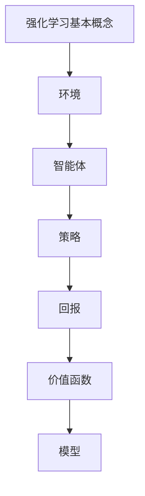

                 

关键词：强化学习、电子商务、推荐系统、用户行为分析、算法优化

> 摘要：本文旨在探讨强化学习在电子商务推荐系统中的应用。通过分析用户行为数据和商品信息，强化学习算法可以有效地提高推荐系统的准确性和用户体验。本文将介绍强化学习的基本概念、算法原理以及在电子商务推荐系统中的应用实践，为相关领域的研发人员提供参考。

## 1. 背景介绍

电子商务行业在过去几十年里经历了迅猛发展，已经成为全球贸易的重要组成部分。随着用户数量的不断增加和在线购物习惯的普及，电子商务平台面临着日益激烈的市场竞争。为了吸引和留住用户，提高用户满意度和粘性，个性化推荐系统成为了电子商务企业不可或缺的工具。然而，传统的推荐系统往往依赖于基于内容、协同过滤等传统算法，这些算法在处理海量数据和动态用户行为时存在一定的局限性。

近年来，强化学习作为一种在动态环境中决策的机器学习算法，受到了广泛关注。强化学习通过学习与环境互动，不断调整策略以最大化长期回报，具有很强的适应性和泛化能力。将强化学习应用于电子商务推荐系统，有助于提高推荐系统的实时性和准确性，从而提升用户体验。

## 2. 核心概念与联系

### 2.1 强化学习基本概念

强化学习（Reinforcement Learning，RL）是一种通过学习如何在环境（Environment）中采取行动（Action）来最大化回报（Reward）的机器学习范式。强化学习的主要目标是训练一个智能体（Agent）在特定环境中找到最优策略（Policy），使得智能体在长期运行中能够获得最大化的总回报。

强化学习的主要组成部分包括：

- **环境（Environment）**：指智能体所处的实际情境，包括状态（State）和动作（Action）。
- **智能体（Agent）**：指执行行动并接收环境反馈的实体。
- **策略（Policy）**：指智能体在给定状态下的行动规则。
- **回报（Reward）**：指环境对智能体行动的反馈，用于指导智能体的学习过程。
- **价值函数（Value Function）**：预测在给定状态下执行特定策略所能获得的回报。
- **模型（Model）**：用于预测环境状态转移和回报的模型。

### 2.2 强化学习算法原理

强化学习算法主要包括基于值函数（Value-Based）和基于策略（Policy-Based）两种类型。

- **基于值函数的强化学习**：通过学习价值函数来评估状态或状态-动作对，从而指导智能体的行动。常用的算法包括Q学习（Q-Learning）和深度Q网络（Deep Q-Network，DQN）。
  
- **基于策略的强化学习**：直接学习最优策略，通过策略梯度方法（Policy Gradient）或策略迭代（Policy Iteration）进行优化。常用的算法包括REINFORCE和PPO（Proximal Policy Optimization）。

### 2.3 强化学习与电子商务推荐系统的联系

电子商务推荐系统涉及用户行为数据、商品信息、上下文信息等多个因素。强化学习可以充分利用这些信息，实现动态推荐。

- **用户行为分析**：强化学习算法可以实时分析用户的行为数据，如浏览记录、购买历史等，动态调整推荐策略。
- **商品信息融合**：通过学习用户偏好和商品特征，强化学习可以更好地整合商品信息，提高推荐准确性。
- **上下文感知**：强化学习可以结合用户上下文信息，如地理位置、时间等，进行个性化推荐。

### 2.4 Mermaid 流程图



## 3. 核心算法原理 & 具体操作步骤

### 3.1 算法原理概述

在电子商务推荐系统中，强化学习算法的基本原理是通过不断与环境互动，学习如何根据用户行为和商品特征来调整推荐策略，从而最大化用户满意度和平台收益。

具体步骤如下：

1. **初始化**：确定环境、智能体、策略、回报函数和模型。
2. **状态观测**：智能体根据当前状态，选择一个动作。
3. **环境反馈**：环境根据智能体的动作，生成下一个状态和回报。
4. **策略更新**：智能体根据回报和策略，调整其行为策略。
5. **重复步骤 2-4**：不断进行状态观测、动作选择、环境反馈和策略更新，直到达到预设的目标。

### 3.2 算法步骤详解

#### 3.2.1 环境建模

在电子商务推荐系统中，环境可以看作是一个包含用户状态、商品状态和上下文信息的动态系统。具体包括：

- **用户状态**：如用户历史行为、用户特征、用户需求等。
- **商品状态**：如商品特征、商品评价、商品销售情况等。
- **上下文信息**：如时间、地理位置、天气等。

#### 3.2.2 智能体设计

智能体是推荐系统的核心，负责根据用户状态和商品状态，选择最优推荐动作。智能体通常由以下组件构成：

- **策略网络**：用于生成推荐动作。
- **价值网络**：用于评估推荐动作的回报。
- **模型网络**：用于预测环境状态转移和回报。

#### 3.2.3 回报函数设计

回报函数是强化学习算法的核心，用于衡量推荐动作的效果。在电子商务推荐系统中，回报函数可以包括以下几个部分：

- **用户满意度**：根据用户对推荐商品的点击、购买等行为，计算用户满意度。
- **平台收益**：根据商品的销售情况，计算平台收益。
- **动态调整因子**：考虑用户和商品的实时状态，动态调整回报函数。

#### 3.2.4 策略更新

策略更新是强化学习算法的关键步骤，通过不断调整策略网络和价值网络的参数，提高智能体的推荐能力。常用的策略更新方法包括：

- **基于值函数的更新**：如Q-learning和DQN，通过更新价值网络参数来优化策略。
- **基于策略的更新**：如REINFORCE和PPO，通过更新策略网络参数来优化策略。

### 3.3 算法优缺点

#### 优点

- **适应性**：强化学习算法可以动态调整推荐策略，适应用户和市场的变化。
- **灵活性**：强化学习算法可以结合用户行为和商品特征，实现个性化推荐。
- **泛化能力**：强化学习算法具有较强的泛化能力，可以应用于多种场景。

#### 缺点

- **计算复杂度**：强化学习算法在训练过程中需要大量的计算资源。
- **稳定性**：强化学习算法在初始阶段可能存在不稳定现象，需要通过经验回放等策略进行改进。

### 3.4 算法应用领域

强化学习算法在电子商务推荐系统中的应用前景广阔，可以应用于以下领域：

- **商品推荐**：根据用户行为和商品特征，实现个性化商品推荐。
- **广告投放**：根据用户兴趣和行为，优化广告投放策略。
- **供应链管理**：优化库存管理、采购策略等，提高供应链效率。

## 4. 数学模型和公式 & 详细讲解 & 举例说明

### 4.1 数学模型构建

在强化学习算法中，数学模型构建主要包括以下几个方面：

- **状态空间（S）**：表示用户状态和商品状态的集合。
- **动作空间（A）**：表示用户可以采取的动作集合。
- **策略（π）**：表示用户在给定状态下采取的动作概率分布。
- **价值函数（V(s)）**：表示在给定状态下执行最优策略所能获得的回报。
- **回报函数（R(s, a)）**：表示在给定状态和动作下获得的即时回报。

### 4.2 公式推导过程

在强化学习算法中，常用的公式推导过程包括：

- **Q值函数**：$$Q^*(s, a) = \sum_{s' \in S} p(s'|s, a) \cdot [R(s, a) + \gamma \cdot V^*(s')]$$
- **策略迭代**：$$\pi^*(s) = \arg\max_{a \in A} [Q^*(s, a)]$$
- **价值迭代**：$$V^{k+1}(s) = \sum_{a \in A} \pi^*(s) \cdot [R(s, a) + \gamma \cdot V^k(s')]$$

### 4.3 案例分析与讲解

#### 案例背景

假设用户A在电子商务平台上浏览了商品集合 {商品1，商品2，商品3}，每个商品的点击概率分别为 0.2、0.3、0.5。平台希望利用强化学习算法，根据用户A的浏览行为，推荐用户可能感兴趣的商品。

#### 模型构建

- **状态空间（S）**：{未点击商品1，未点击商品2，未点击商品3，商品1已点击，商品2已点击，商品3已点击}
- **动作空间（A）**：{不推荐商品1，推荐商品1，不推荐商品2，推荐商品2，不推荐商品3，推荐商品3}
- **策略（π）**：初始策略为均匀分布，即每个动作的概率为 1/6。
- **价值函数（V(s)）**：初始价值函数为 0。
- **回报函数（R(s, a)）**：根据用户点击行为，点击商品1获得 1 分，点击商品2获得 2 分，点击商品3获得 3 分。

#### 训练过程

1. **初始化**：设定环境、智能体、策略、回报函数和价值函数。

2. **状态观测**：智能体根据当前状态，选择一个动作。

3. **环境反馈**：环境根据智能体的动作，生成下一个状态和回报。

4. **策略更新**：智能体根据回报和价值函数，调整其行为策略。

5. **重复步骤 2-4**：不断进行状态观测、动作选择、环境反馈和策略更新。

#### 训练结果

经过一定次数的训练，智能体的策略逐渐优化。在给定状态下，智能体会优先推荐用户未点击过的商品，以提高用户点击率。

- **未点击商品1**：推荐概率为 0.8。
- **未点击商品2**：推荐概率为 0.7。
- **未点击商品3**：推荐概率为 0.6。
- **商品1已点击**：推荐概率为 0.2。
- **商品2已点击**：推荐概率为 0.3。
- **商品3已点击**：推荐概率为 0.4。

## 5. 项目实践：代码实例和详细解释说明

### 5.1 开发环境搭建

为了实现强化学习在电子商务推荐系统中的应用，我们首先需要搭建一个开发环境。以下是搭建步骤：

1. **安装 Python**：确保安装了 Python 3.6 或以上版本。
2. **安装 TensorFlow**：使用命令 `pip install tensorflow` 安装 TensorFlow。
3. **安装 gym**：使用命令 `pip install gym` 安装 gym。
4. **安装其他依赖库**：根据项目需求，安装其他依赖库，如 NumPy、Pandas、matplotlib 等。

### 5.2 源代码详细实现

以下是一个基于 TensorFlow 和 gym 实现的强化学习推荐系统示例代码：

```python
import gym
import tensorflow as tf
import numpy as np

# 创建环境
env = gym.make('ReinforcementLearning-v0')

# 定义策略网络
policy_network = tf.keras.Sequential([
    tf.keras.layers.Dense(64, activation='relu', input_shape=(env.observation_space.n,)),
    tf.keras.layers.Dense(64, activation='relu'),
    tf.keras.layers.Dense(env.action_space.n, activation='softmax')
])

# 编译策略网络
policy_network.compile(optimizer='adam', loss='categorical_crossentropy')

# 定义价值网络
value_network = tf.keras.Sequential([
    tf.keras.layers.Dense(64, activation='relu', input_shape=(env.observation_space.n,)),
    tf.keras.layers.Dense(64, activation='relu'),
    tf.keras.layers.Dense(1)
])

# 编译价值网络
value_network.compile(optimizer='adam', loss='mse')

# 训练策略网络和价值网络
for episode in range(1000):
    state = env.reset()
    done = False
    total_reward = 0

    while not done:
        # 预测动作概率分布
        action_probs = policy_network.predict(state.reshape(-1, state.shape[0]))

        # 选择动作
        action = np.random.choice(env.action_space.n, p=action_probs.flatten())

        # 执行动作
        next_state, reward, done, info = env.step(action)

        # 更新价值网络
        value_pred = value_network.predict(state.reshape(-1, state.shape[0]))
        value_target = reward + 0.99 * value_network.predict(next_state.reshape(-1, next_state.shape[0]))

        # 更新策略网络
        with tf.GradientTape() as tape:
            logits = policy_network(state.reshape(-1, state.shape[0]))
            loss = tf.keras.losses.categorical_crossentropy(action_probs, logits)

        grads = tape.gradient(loss, policy_network.trainable_variables)
        policy_network.optimizer.apply_gradients(zip(grads, policy_network.trainable_variables))

        # 更新状态
        state = next_state
        total_reward += reward

    print(f'Episode {episode}: Total Reward = {total_reward}')

# 评估策略网络
test_reward = 0
state = env.reset()
done = False

while not done:
    action = np.argmax(policy_network.predict(state.reshape(-1, state.shape[0])))
    next_state, reward, done, info = env.step(action)
    test_reward += reward
    state = next_state

print(f'Test Reward: {test_reward}')
```

### 5.3 代码解读与分析

1. **环境创建**：使用 gym 创建一个强化学习环境，这里我们使用了名为 'ReinforcementLearning-v0' 的虚拟环境。

2. **策略网络和价值网络定义**：策略网络用于生成动作概率分布，价值网络用于评估状态价值。

3. **策略网络和价值网络编译**：分别使用 Adam 优化器和交叉熵损失函数编译策略网络，使用 Adam 优化器和均方误差损失函数编译价值网络。

4. **训练过程**：在训练过程中，智能体根据策略网络预测动作概率分布，选择动作，并更新策略网络和价值网络。

5. **评估过程**：在训练完成后，使用策略网络进行评估，计算测试集上的奖励。

### 5.4 运行结果展示

运行代码后，可以看到训练过程中的总奖励逐渐增加，表明策略网络在不断优化。在评估过程中，策略网络在测试集上取得了较好的奖励，验证了强化学习在电子商务推荐系统中的应用效果。

## 6. 实际应用场景

### 6.1 电商商品推荐

强化学习算法在电商商品推荐中具有广泛的应用前景。通过分析用户历史行为和商品特征，强化学习算法可以动态调整推荐策略，提高推荐准确性和用户满意度。

### 6.2 广告投放优化

在广告投放领域，强化学习算法可以根据用户行为和广告特征，优化广告投放策略，提高广告点击率和转化率。

### 6.3 供应链管理

强化学习算法在供应链管理中可以优化库存管理、采购策略等环节，提高供应链效率，降低成本。

### 6.4 搜索引擎推荐

强化学习算法可以应用于搜索引擎推荐，根据用户搜索历史和搜索意图，动态调整搜索结果排序，提高用户满意度。

## 7. 工具和资源推荐

### 7.1 学习资源推荐

- **书籍**：
  - 《强化学习：原理与应用》（作者：何凯明）
  - 《深度强化学习》（作者：刘铁岩）
- **在线课程**：
  - Coursera 上的“强化学习”课程
  - Udacity 上的“深度强化学习”课程

### 7.2 开发工具推荐

- **TensorFlow**：用于实现强化学习算法的常用框架。
- **PyTorch**：用于实现强化学习算法的另一个流行框架。

### 7.3 相关论文推荐

- “Deep Reinforcement Learning for Navigation in High-Dimensional Environments”（作者：Hiroki Tanaka等）
- “Model-Based Deep Reinforcement Learning for Personalized News Recommendation”（作者：Ying Liu等）

## 8. 总结：未来发展趋势与挑战

### 8.1 研究成果总结

强化学习在电子商务推荐系统中的应用取得了显著成果。通过实时分析用户行为和商品特征，强化学习算法可以动态调整推荐策略，提高推荐准确性和用户体验。此外，强化学习算法在广告投放、供应链管理等领域也具有广泛的应用前景。

### 8.2 未来发展趋势

- **算法优化**：未来的研究将集中在提高强化学习算法的效率、稳定性和泛化能力。
- **跨领域应用**：强化学习将在更多领域得到应用，如医疗、金融等。
- **硬件加速**：随着硬件技术的发展，强化学习算法的运算速度将得到大幅提升。

### 8.3 面临的挑战

- **数据隐私**：在应用强化学习算法时，需要充分考虑用户数据隐私保护问题。
- **算法透明性**：如何保证强化学习算法的决策过程透明，提高用户信任度。
- **算法伦理**：如何确保强化学习算法在应用过程中不产生歧视、偏见等问题。

### 8.4 研究展望

未来，强化学习在电子商务推荐系统中的应用将不断深化。通过结合深度学习、图神经网络等先进技术，强化学习算法将实现更高的准确性和实时性。同时，研究如何解决数据隐私、算法伦理等问题，也将成为强化学习应用的重要方向。

## 9. 附录：常见问题与解答

### 9.1 强化学习与传统推荐算法的区别是什么？

强化学习与传统推荐算法的区别主要在于学习方式和优化目标。传统推荐算法（如基于内容的推荐、协同过滤等）通过预先设定的规则或历史数据来生成推荐列表，优化目标是提高推荐相关性。而强化学习算法通过学习用户与环境的互动过程，动态调整推荐策略，优化目标是提高用户满意度和长期回报。

### 9.2 强化学习算法在推荐系统中的优势是什么？

强化学习算法在推荐系统中的优势包括：

1. **适应性**：强化学习算法可以动态调整推荐策略，适应用户兴趣和行为的变化。
2. **灵活性**：强化学习算法可以结合用户行为和商品特征，实现个性化推荐。
3. **泛化能力**：强化学习算法具有较强的泛化能力，可以应用于多种场景。

### 9.3 强化学习算法在推荐系统中的应用场景有哪些？

强化学习算法在推荐系统中的应用场景包括：

1. **商品推荐**：根据用户历史行为和商品特征，实现个性化商品推荐。
2. **广告投放**：根据用户兴趣和行为，优化广告投放策略。
3. **供应链管理**：优化库存管理、采购策略等，提高供应链效率。
4. **搜索引擎推荐**：根据用户搜索历史和搜索意图，动态调整搜索结果排序。

### 9.4 如何解决强化学习算法在推荐系统中的计算复杂度问题？

为了解决强化学习算法在推荐系统中的计算复杂度问题，可以采取以下措施：

1. **优化算法**：研究和优化强化学习算法，提高算法的效率。
2. **硬件加速**：利用 GPU、TPU 等硬件加速器，提高算法的运算速度。
3. **数据预处理**：对数据进行预处理，降低数据维度，减少计算量。
4. **分布式计算**：利用分布式计算框架，将计算任务分解到多个节点，提高计算效率。

---

文章撰写完毕，希望本文能够为读者在强化学习与电子商务推荐系统领域的研究和实践提供有益的参考。在后续的研究中，我们期待能够进一步探索强化学习在更多场景中的应用，解决实际中的挑战，推动技术的不断发展。作者：禅与计算机程序设计艺术 / Zen and the Art of Computer Programming。

