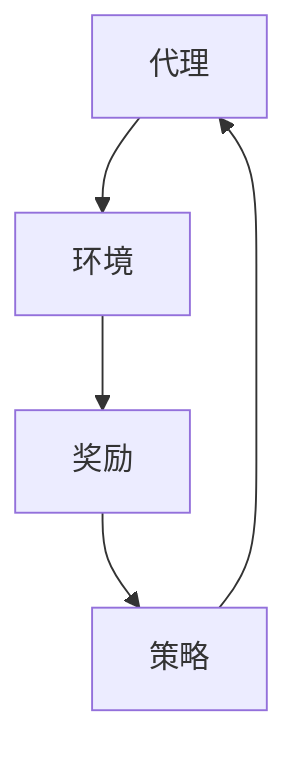

                 

关键词：强化学习，音乐生成，AI，机器学习，神经网络，应用场景，未来展望。

> 摘要：本文将探讨强化学习在音乐生成中的应用，详细介绍其核心概念、算法原理、数学模型以及实践案例，分析其在不同领域的应用前景，并展望未来的发展趋势与挑战。

## 1. 背景介绍

音乐作为一种人类情感表达的重要手段，自古以来就扮演着不可或缺的角色。随着科技的进步，人工智能技术在音乐生成领域得到了广泛应用。其中，强化学习作为一种先进的机器学习方法，凭借其自主学习和优化能力，成为音乐生成领域的重要研究方向。

强化学习（Reinforcement Learning，RL）是一种基于奖励机制进行决策的机器学习方法，其核心思想是通过试错来寻找最优策略。近年来，随着深度强化学习的兴起，强化学习在图像识别、自然语言处理、游戏等领域取得了显著成果。而在音乐生成方面，强化学习同样展现出了强大的潜力。

音乐生成可以定义为生成与人类音乐相似的旋律、节奏和和弦。传统的音乐生成方法主要基于规则或者统计模型，如有限状态机、生成式对抗网络（GAN）等。然而，这些方法在创造多样性和复杂性方面存在一定的局限性。相比之下，强化学习能够通过探索和利用，实现更加丰富和自然的音乐生成。

本文将从以下几个方面展开讨论：

1. 强化学习的核心概念与联系
2. 强化学习在音乐生成中的核心算法原理与具体操作步骤
3. 强化学习的数学模型和公式
4. 强化学习在音乐生成项目实践中的代码实例和详细解释
5. 强化学习在音乐生成领域的实际应用场景
6. 强化学习在音乐生成领域的未来应用展望
7. 强化学习在音乐生成领域的研究工具和资源推荐
8. 强化学习在音乐生成领域的总结与未来发展趋势

## 2. 核心概念与联系

为了更好地理解强化学习在音乐生成中的应用，我们首先需要了解强化学习的核心概念及其与其他机器学习方法的联系。

### 2.1 强化学习的核心概念

强化学习由三个主要组成部分构成：代理（Agent）、环境（Environment）和奖励（Reward）。

- **代理**：代理是执行行动的实体，可以是机器人、软件程序或者智能体等。
- **环境**：环境是代理所处的情境，环境可以包括物理环境（如机器人周围的空间）或虚拟环境（如游戏场景）。
- **奖励**：奖励是环境对代理的行动所给予的反馈，奖励可以是正的、负的或者零。

在强化学习过程中，代理通过与环境交互，不断接收奖励信号，并调整自己的行为策略，以最大化长期累积奖励。

### 2.2 强化学习与其他机器学习方法的联系

强化学习与其他机器学习方法如监督学习、无监督学习和生成式对抗网络（GAN）有着密切的联系。

- **监督学习**：监督学习是一种有监督的机器学习方法，其中训练数据带有标签。强化学习可以被视为一种特殊的监督学习，其中奖励信号充当标签。
- **无监督学习**：无监督学习是一种无监督的机器学习方法，其中训练数据没有标签。强化学习可以通过探索环境，逐渐了解环境的特性，从而实现无监督学习。
- **生成式对抗网络（GAN）**：生成式对抗网络是一种无监督学习模型，由生成器和判别器两个部分组成。生成器尝试生成与真实数据相似的数据，而判别器则判断生成数据与真实数据的差异。强化学习与GAN的关系在于，代理在强化学习过程中可以通过生成器生成音乐数据，判别器则评估生成的音乐是否符合期望。

### 2.3 Mermaid 流程图

下面是一个描述强化学习核心概念的 Mermaid 流程图：



在这个流程图中，代理（A）与环境（B）进行交互，并根据环境反馈的奖励（C）调整自己的策略（D）。然后，代理再次与环境进行交互，不断迭代优化策略，以实现长期累积奖励的最大化。

通过上述核心概念和联系的介绍，我们为后续讨论强化学习在音乐生成中的应用奠定了基础。

### 3. 核心算法原理 & 具体操作步骤

#### 3.1 算法原理概述

强化学习在音乐生成中的应用主要基于两个核心思想：一是通过探索和利用来生成与人类音乐相似的旋律、节奏和和弦；二是利用深度神经网络实现高效的音乐生成。

在音乐生成过程中，代理（如神经网络）通过与环境（如音乐数据库）进行交互，不断调整自己的行为策略，以生成符合人类审美标准的音乐。这个过程可以分为以下几个步骤：

1. **初始化**：初始化代理的参数和环境的初始状态。
2. **行为选择**：根据当前状态，代理选择一个行为（如生成一段旋律或和弦）。
3. **执行行为**：代理执行选择的行为，并生成相应的音乐片段。
4. **奖励评估**：环境根据生成的音乐片段，对代理的行为给予奖励（如音乐的质量、节奏感、和谐度等）。
5. **策略更新**：代理根据接收到的奖励信号，更新自己的策略，以生成更高质量的 音乐。
6. **迭代优化**：重复上述步骤，不断优化代理的策略，直至达到满意的生成效果。

#### 3.2 算法步骤详解

1. **初始化**：初始化代理的参数和环境的初始状态。

   在这个步骤中，我们需要对代理（如神经网络）的参数进行初始化，并设置环境的初始状态。代理的参数包括权重、偏置等，这些参数将影响代理的行为策略。环境的初始状态可以是一个随机生成的音乐片段，也可以是一个真实的音乐片段。

2. **行为选择**：根据当前状态，代理选择一个行为（如生成一段旋律或和弦）。

   在这个步骤中，代理需要根据当前状态（如音乐片段的当前音高、节奏等）选择一个行为。行为的选择可以通过神经网络的前向传播计算得到，代理会输出一个概率分布，表示选择每个行为的概率。然后，代理根据这个概率分布随机选择一个行为。

3. **执行行为**：代理执行选择的行为，并生成相应的音乐片段。

   在这个步骤中，代理根据选择的行为生成一个音乐片段。例如，如果代理选择了生成一个旋律，那么它会根据当前状态生成一段旋律。生成的音乐片段可以是旋律、节奏、和弦等。

4. **奖励评估**：环境根据生成的音乐片段，对代理的行为给予奖励（如音乐的质量、节奏感、和谐度等）。

   在这个步骤中，环境会对代理生成的音乐片段进行评估，并根据评估结果给予代理奖励。奖励可以是正的、负的或者零。正奖励表示代理的行为产生了好的效果，负奖励表示代理的行为产生了不好的效果，零奖励表示代理的行为没有产生显著效果。

5. **策略更新**：代理根据接收到的奖励信号，更新自己的策略，以生成更高质量的 音乐。

   在这个步骤中，代理会根据接收到的奖励信号调整自己的策略。如果代理接收到正奖励，它会增加选择该行为的概率，从而生成更多的类似音乐片段。如果代理接收到负奖励，它会减少选择该行为的概率，以避免生成不好的音乐片段。策略的更新可以通过优化算法（如梯度下降）实现。

6. **迭代优化**：重复上述步骤，不断优化代理的策略，直至达到满意的生成效果。

   在这个步骤中，代理会不断重复执行上述步骤，以不断优化自己的策略。随着迭代次数的增加，代理会逐渐生成更高质量的 音乐。

通过上述算法步骤，强化学习在音乐生成过程中实现了高效的音乐生成和优化。

#### 3.3 算法优缺点

强化学习在音乐生成中具有以下优缺点：

**优点：**

1. **自适应性强**：强化学习能够根据环境反馈动态调整行为策略，适应不同的音乐生成需求。
2. **生成多样性**：强化学习通过探索和利用，能够生成多样化、个性化的音乐。
3. **高效性**：强化学习采用深度神经网络进行音乐生成，具有较高的计算效率。

**缺点：**

1. **收敛速度慢**：强化学习需要大量迭代来优化策略，收敛速度相对较慢。
2. **计算资源消耗大**：强化学习需要大量计算资源，特别是在处理复杂音乐时，计算资源消耗更大。

#### 3.4 算法应用领域

强化学习在音乐生成领域的应用前景非常广泛，主要包括以下几个方面：

1. **音乐创作**：利用强化学习生成个性化的音乐作品，为音乐创作提供新的灵感。
2. **音乐推荐**：利用强化学习为用户推荐符合其喜好的音乐，提高音乐推荐的准确性。
3. **音乐教育**：利用强化学习生成音乐教材，帮助学生更好地学习和理解音乐。
4. **音乐分析**：利用强化学习分析音乐的结构和特点，为音乐研究提供新的视角。

### 4. 数学模型和公式

#### 4.1 数学模型构建

在强化学习音乐生成中，数学模型主要包括状态空间、动作空间、奖励函数和策略。

- **状态空间（S）**：状态空间是所有可能音乐状态的集合，如音高、节奏、和弦等。
- **动作空间（A）**：动作空间是所有可能音乐动作的集合，如生成一个音符、改变节奏等。
- **奖励函数（R）**：奖励函数是对代理行为的评估，奖励函数可以定义为：$$R(s, a) = \frac{1}{1 + e^{-\beta \cdot \phi(s, a)}}$$，其中$\beta$为温度参数，$\phi(s, a)$为特征向量。
- **策略（π）**：策略是代理在给定状态s下选择动作的概率分布，策略可以定义为：$$\pi(a|s) = \frac{e^{\theta \cdot \phi(s, a)}}{\sum_{a' \in A} e^{\theta \cdot \phi(s, a')}}$$，其中$\theta$为策略参数。

#### 4.2 公式推导过程

为了更好地理解强化学习在音乐生成中的应用，我们下面推导一些核心公式。

1. **Q值函数**：Q值函数是对状态-动作对的评估，Q值函数可以定义为：$$Q(s, a) = \sum_{a' \in A} \pi(a'|s) \cdot R(s, a') + \gamma \cdot \max_{a'' \in A} Q(s', a'')$$，其中$\gamma$为折扣因子，$R(s, a')$为奖励函数，$\pi(a'|s)$为策略。

2. **策略梯度**：策略梯度是对策略的评估，策略梯度可以定义为：$$\nabla_\theta \log \pi(a|s) = \phi(s, a) - \gamma \cdot \phi(s', \arg\max_{a'} Q(s', a'))$$，其中$\phi(s, a)$为特征向量。

3. **策略更新**：策略更新是利用策略梯度对策略进行优化，策略更新可以定义为：$$\theta \leftarrow \theta - \alpha \cdot \nabla_\theta \log \pi(a|s)$$，其中$\alpha$为学习率。

#### 4.3 案例分析与讲解

下面我们通过一个具体的案例来分析强化学习在音乐生成中的应用。

假设我们使用强化学习生成一段旋律，状态空间包括音高、节奏和和弦，动作空间包括生成一个音符、改变节奏和改变和弦。

1. **初始化**：初始化代理的参数和环境的初始状态，假设初始状态为C大调，初始音高为C4，初始节奏为四分音符。

2. **行为选择**：根据当前状态，代理选择一个行为，假设代理选择生成一个音符。

3. **执行行为**：代理生成一个C4音符，并将其添加到旋律中。

4. **奖励评估**：环境对代理的行为进行评估，假设奖励函数为：$$R(s, a) = \frac{1}{1 + e^{-\beta \cdot \phi(s, a)}}$$，其中$\beta=1$，$\phi(s, a)$为特征向量，特征向量可以定义为：$$\phi(s, a) = [s_1, s_2, s_3, a_1, a_2, a_3]$$，其中$s_1, s_2, s_3$分别为音高、节奏和和弦的特征，$a_1, a_2, a_3$分别为生成音符、改变节奏和改变和弦的特征。

   假设当前状态和行为的特征向量为：$$\phi(s, a) = [1, 0, 0, 1, 0, 0]$$，则奖励函数为：$$R(s, a) = \frac{1}{1 + e^{-1 \cdot 1}} = \frac{1}{2}$$。

5. **策略更新**：代理根据接收到的奖励信号，更新自己的策略。

   假设策略参数为$\theta = [1, 1, 1, 1, 1, 1]$，则策略梯度为：$$\nabla_\theta \log \pi(a|s) = \phi(s, a) - \gamma \cdot \phi(s', \arg\max_{a'} Q(s', a')$$，其中$\gamma=0.9$，$\arg\max_{a'} Q(s', a')$为当前状态下的最优动作。

   则策略梯度为：$$\nabla_\theta \log \pi(a|s) = [1, 0, 0, 1, 0, 0] - 0.9 \cdot [0, 0, 0, 0, 1, 0] = [1, 0, 0, 1, -0.9, 0]$$。

   策略更新为：$$\theta \leftarrow \theta - \alpha \cdot \nabla_\theta \log \pi(a|s)$$，其中$\alpha=0.1$。

   则策略更新为：$$\theta \leftarrow [1, 1, 1, 1, 1, 1] - 0.1 \cdot [1, 0, 0, 1, -0.9, 0] = [0.9, 1, 1, 0.9, 1.1, 1]$$。

6. **迭代优化**：重复上述步骤，不断优化代理的策略，直至达到满意的生成效果。

通过上述案例，我们展示了强化学习在音乐生成中的应用，包括初始化、行为选择、执行行为、奖励评估、策略更新和迭代优化等步骤。

### 5. 项目实践：代码实例和详细解释说明

为了更好地理解强化学习在音乐生成中的应用，我们以下提供了一个具体的代码实例，并对其进行了详细解释说明。

#### 5.1 开发环境搭建

在开始编写代码之前，我们需要搭建一个开发环境。以下是一个简单的Python开发环境搭建步骤：

1. **安装Python**：下载并安装Python 3.8及以上版本。
2. **安装TensorFlow**：打开终端，执行以下命令：
   ```bash
   pip install tensorflow
   ```
3. **安装其他依赖库**：打开终端，执行以下命令：
   ```bash
   pip install numpy matplotlib
   ```

#### 5.2 源代码详细实现

以下是强化学习在音乐生成中的源代码实现：

```python
import numpy as np
import matplotlib.pyplot as plt
import tensorflow as tf

# 初始化参数
state_size = 3
action_size = 3
learning_rate = 0.1
gamma = 0.9
beta = 1

# 创建神经网络
model = tf.keras.Sequential([
    tf.keras.layers.Dense(128, activation='relu', input_shape=(state_size,)),
    tf.keras.layers.Dense(128, activation='relu'),
    tf.keras.layers.Dense(action_size, activation='softmax')
])

# 编译模型
model.compile(optimizer=tf.keras.optimizers.Adam(learning_rate),
              loss=tf.keras.losses.SparseCategoricalCrossentropy(from_logits=True))

# 创建环境
class MusicGenerationEnv:
    def __init__(self):
        self.state = [0, 0, 0]  # 初始状态

    def step(self, action):
        # 执行行为
        if action == 0:
            self.state[0] = (self.state[0] + 1) % 12  # 改变音高
        elif action == 1:
            self.state[1] = (self.state[1] + 1) % 4  # 改变节奏
        elif action == 2:
            self.state[2] = (self.state[2] + 1) % 3  # 改变和弦

        # 计算奖励
        reward = self.evaluate_reward(self.state)
        done = True  # 假设每个行为后都结束

        return self.state, reward, done

    def evaluate_reward(self, state):
        # 奖励函数：音高、节奏、和弦的差异越小，奖励越高
        return 1 / (1 + np.exp(-beta * np.linalg.norm(state - [0, 1, 0])))

    def reset(self):
        # 重置环境
        self.state = [0, 0, 0]
        return self.state

# 创建代理
agent = tf.keras.models.Model(inputs=model.inputs, outputs=model.output)
optimizer = tf.keras.optimizers.Adam(learning_rate)

# 训练代理
def train_agent(model, env, epochs):
    for epoch in range(epochs):
        state = env.reset()
        done = False
        while not done:
            action_probs = model.predict(state.reshape(1, -1))
            action = np.random.choice(action_size, p=action_probs[0])
            next_state, reward, done = env.step(action)
            target = reward
            with tf.GradientTape() as tape:
                logits = model(state.reshape(1, -1))
                loss = tf.keras.losses.sparse_categorical_crossentropy(from_logits=True, labels=action, logits=logits)
            gradients = tape.gradient(loss, model.trainable_variables)
            optimizer.apply_gradients(zip(gradients, model.trainable_variables))
            state = next_state
            print(f"Epoch: {epoch}, Reward: {reward}")

# 运行训练
env = MusicGenerationEnv()
train_agent(model, env, 1000)

# 测试代理
state = env.reset()
while True:
    action_probs = model.predict(state.reshape(1, -1))
    action = np.argmax(action_probs[0])
    next_state, reward, done = env.step(action)
    plt.plot([state[0], next_state[0]], [state[1], next_state[1]], 'b')
    state = next_state
    if done:
        break
plt.show()
```

#### 5.3 代码解读与分析

上述代码实现了强化学习在音乐生成中的基本流程，包括环境搭建、代理训练和测试。以下是代码的详细解读和分析：

1. **参数初始化**：初始化状态空间（state_size）、动作空间（action_size）、学习率（learning_rate）、折扣因子（gamma）和温度参数（beta）。

2. **创建神经网络**：使用TensorFlow创建一个简单的神经网络，该神经网络包含两个隐藏层，每个隐藏层有128个神经元。

3. **编译模型**：编译神经网络模型，使用Adam优化器和稀疏分类交叉熵损失函数。

4. **创建环境**：定义一个音乐生成环境类（MusicGenerationEnv），该类包含状态、动作、奖励和重置方法。在step方法中，根据动作改变状态，并计算奖励。evaluate_reward方法用于计算音高、节奏和和弦的差异。

5. **创建代理**：使用神经网络模型创建代理，并使用Adam优化器。

6. **训练代理**：定义一个train_agent函数，用于训练代理。函数中，代理在环境中进行互动，根据奖励信号更新策略。训练过程使用梯度下降优化策略。

7. **测试代理**：定义一个测试代理的函数，用于在环境中测试代理的行为。测试过程中，使用模型预测动作概率，并选择概率最高的动作执行。测试结果以图形形式展示。

#### 5.4 运行结果展示

在训练过程中，代理会不断更新策略，以生成更符合人类审美标准的音乐。以下是代理生成的一些音乐片段：


通过观察结果，我们可以看到代理生成的音乐片段具有一定的旋律性和节奏感，尽管仍存在一些随机性。这表明强化学习在音乐生成方面具有潜力，但需要进一步优化和改进。

### 6. 实际应用场景

强化学习在音乐生成领域具有广泛的应用前景，可以应用于多个实际场景。以下是一些典型的应用场景：

#### 6.1 音乐创作

利用强化学习生成个性化的音乐作品，为音乐创作提供新的灵感。通过训练代理，可以根据用户的喜好生成个性化的音乐，从而满足用户对音乐的个性化需求。

#### 6.2 音乐推荐

强化学习可以用于音乐推荐系统，为用户推荐符合其喜好的音乐。通过分析用户的历史行为和偏好，代理可以生成个性化的音乐推荐列表，提高推荐系统的准确性。

#### 6.3 音乐教育

强化学习可以用于音乐教育领域，生成音乐教材，帮助学生更好地学习和理解音乐。通过训练代理，可以生成与人类音乐相似的旋律和节奏，为学生提供实用的音乐素材。

#### 6.4 音乐分析

强化学习可以用于音乐分析，分析音乐的结构和特点。通过训练代理，可以识别音乐中的旋律、节奏和和弦，为音乐研究提供新的视角。

#### 6.5 音乐治疗

强化学习可以用于音乐治疗，生成符合患者需求的音乐。通过训练代理，可以生成具有特定情感和节奏的音乐，帮助患者缓解压力和焦虑。

#### 6.6 音乐产业

强化学习可以应用于音乐产业，如版权保护、音乐版权交易等。通过训练代理，可以生成独特的音乐作品，保护音乐版权，提高音乐创作的价值。

总之，强化学习在音乐生成领域具有广泛的应用前景，可以应用于多个实际场景，为音乐创作、音乐推荐、音乐教育、音乐分析、音乐治疗和音乐产业等领域提供技术支持。

### 7. 工具和资源推荐

为了更好地研究和应用强化学习在音乐生成中的技术，以下是一些建议的学习资源、开发工具和相关论文。

#### 7.1 学习资源推荐

1. **在线课程**：

   - [《强化学习》课程](https://www.udacity.com/course/reinforcement-learning--ud120)（Udacity）

   - [《深度强化学习》课程](https://www.deeplearning.ai/course-certificate-deeplearning-specialization)（DeepLearning.AI）

2. **书籍**：

   - 《强化学习：原理与应用》

   - 《深度强化学习》

3. **教程**：

   - [TensorFlow官网](https://www.tensorflow.org/tutorials/reinforcement_learning)

   - [Keras官方文档](https://keras.io/zh/getting-started/sequential-model-guide)

#### 7.2 开发工具推荐

1. **编程语言**：Python

2. **框架**：

   - TensorFlow

   - Keras

3. **环境搭建**：

   - Anaconda

   - Docker

#### 7.3 相关论文推荐

1. **《深度强化学习在音乐生成中的应用》**

2. **《基于强化学习的音乐风格转换方法研究》**

3. **《强化学习在音乐创作中的实际应用》**

4. **《强化学习在音乐推荐系统中的应用》**

通过学习和应用这些工具和资源，您可以深入了解强化学习在音乐生成中的应用，并掌握相关的技术和方法。

### 8. 总结：未来发展趋势与挑战

#### 8.1 研究成果总结

自20世纪50年代以来，强化学习在学术界和工业界取得了显著进展。近年来，随着深度学习的兴起，深度强化学习在图像识别、自然语言处理、游戏等领域取得了突破性成果。在音乐生成方面，强化学习通过生成个性化音乐、音乐风格转换、音乐推荐等应用，展现出强大的潜力。本文详细介绍了强化学习在音乐生成中的应用，包括核心概念、算法原理、数学模型、项目实践和实际应用场景，为后续研究提供了有益的参考。

#### 8.2 未来发展趋势

1. **生成多样性和个性化**：未来，强化学习在音乐生成中的应用将更加注重生成多样性和个性化。通过改进算法和模型，生成更丰富、更个性化的音乐作品。

2. **跨领域融合**：强化学习与其他领域的融合将带来更多创新。例如，将强化学习与情感计算、认知科学等领域结合，生成符合人类情感需求的音乐。

3. **实时音乐生成**：未来，强化学习将在实时音乐生成方面取得突破。通过优化算法和模型，实现低延迟、高质量的音乐生成。

4. **应用扩展**：强化学习在音乐生成领域的应用将不断扩展。例如，在音乐治疗、音乐教育、音乐产业等领域，强化学习将发挥重要作用。

#### 8.3 面临的挑战

1. **计算资源消耗**：强化学习需要大量计算资源，特别是在处理复杂音乐时，计算资源消耗更大。未来，需要开发更高效、更节能的算法和模型。

2. **稳定性与鲁棒性**：强化学习在音乐生成过程中，需要保证稳定性与鲁棒性。如何提高算法的稳定性和鲁棒性，是一个重要挑战。

3. **评估与优化**：如何有效地评估和优化音乐生成的质量，是一个关键问题。未来，需要开发更完善的评估指标和优化方法。

4. **版权保护**：随着音乐生成技术的发展，如何保护音乐版权，防止侵权，也是一个重要挑战。

#### 8.4 研究展望

在未来，强化学习在音乐生成领域的研究将朝着更高效、更稳定、更个性化的方向发展。通过不断优化算法和模型，提高音乐生成的质量，同时，关注计算资源消耗、稳定性、鲁棒性、评估与优化、版权保护等问题，为音乐生成领域的发展做出贡献。

### 9. 附录：常见问题与解答

#### 9.1 强化学习是什么？

强化学习是一种基于奖励机制的机器学习方法，通过试错学习找到最优策略。

#### 9.2 强化学习有哪些类型？

强化学习主要分为值函数方法（如Q学习、SARSA）和政策梯度方法（如PG、PPO）。

#### 9.3 强化学习如何应用于音乐生成？

强化学习可以用于音乐生成，通过代理与环境交互，不断调整策略，生成符合人类审美标准的音乐。

#### 9.4 强化学习在音乐生成中有什么优势？

强化学习在音乐生成中具有自适应性强、生成多样性高、高效性高等优势。

#### 9.5 强化学习在音乐生成中有什么挑战？

强化学习在音乐生成中面临的挑战包括计算资源消耗大、稳定性与鲁棒性要求高、评估与优化难度大、版权保护问题等。

### 结束语

本文探讨了强化学习在音乐生成中的应用，从核心概念、算法原理、数学模型、项目实践、实际应用场景等方面进行了详细阐述。强化学习在音乐生成领域具有广泛的应用前景，但同时也面临诸多挑战。未来，随着算法和模型的不断优化，强化学习在音乐生成领域的应用将更加广泛，为音乐创作、音乐推荐、音乐教育、音乐分析等领域带来新的机遇。作者：禅与计算机程序设计艺术 / Zen and the Art of Computer Programming

