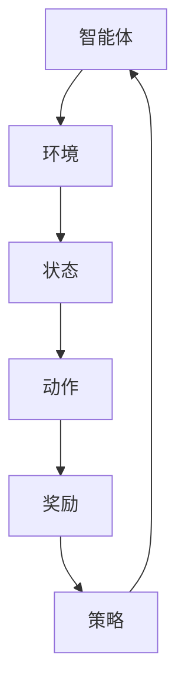

                 

关键词：强化学习、人工智能、机器学习、未来发展、算法、动态规划、神经强化学习、应用场景、发展趋势、挑战与展望。

> 摘要：本文将探讨强化学习作为人工智能领域的一个重要分支，其在未来发展的动向。通过回顾强化学习的发展历程，深入分析其核心算法原理，探讨数学模型和公式，并举例说明其在实际项目中的应用，最终展望其未来发展趋势和面临的挑战。

## 1. 背景介绍

强化学习（Reinforcement Learning，简称RL）是机器学习的一个子领域，它通过试错和反馈机制来训练智能体（agent）在环境中做出最优决策。与监督学习和无监督学习不同，强化学习中的智能体需要通过与环境进行交互来学习，从而在复杂的环境中实现自主决策。

强化学习的发展历程可以追溯到1950年代，阿兰·图灵提出了“图灵测试”，标志着人工智能的诞生。随着计算机技术的发展，强化学习逐渐成为人工智能研究的热点领域。近年来，随着深度学习技术的引入，神经强化学习（Neural Reinforcement Learning）取得了显著进展，为强化学习在复杂任务中的应用提供了新的思路。

强化学习在人工智能领域具有重要的应用价值，如自动驾驶、机器人控制、游戏AI等。其核心思想是通过奖励机制激励智能体学习到在特定环境中最优的行为策略。

## 2. 核心概念与联系

### 2.1 强化学习核心概念

强化学习中的核心概念包括智能体（agent）、环境（environment）、状态（state）、动作（action）和奖励（reward）。智能体是执行动作并从环境中获取奖励的实体。环境是智能体执行动作的场所。状态是智能体在特定时刻所处的情境。动作是智能体能够执行的操作。奖励是环境对智能体动作的反馈。

### 2.2 强化学习架构

强化学习架构主要包括三个部分：代理（agent）、奖励系统（reward system）和策略（policy）。代理是执行动作并获取奖励的主体，奖励系统用于评估代理的行为，策略是指导代理如何做出最优动作的规则。

### 2.3 Mermaid 流程图



## 3. 核心算法原理 & 具体操作步骤

### 3.1 算法原理概述

强化学习算法的核心是学习一个策略（policy），策略是智能体在特定状态下选择动作的概率分布。常见的强化学习算法包括Q学习（Q-Learning）、SARSA（State-Action-Reward-State-Action，简称SARSA）和DQN（Deep Q-Network）等。

Q学习是一种值函数方法，通过迭代更新Q值（状态-动作值函数）来学习最优策略。SARSA是一种基于策略的方法，通过同时考虑当前状态和下一状态来更新策略。DQN是一种基于神经网络的值函数方法，通过深度神经网络来近似Q值函数。

### 3.2 算法步骤详解

#### 3.2.1 Q学习算法

1. 初始化Q值表
2. 选择动作
3. 执行动作
4. 接收奖励
5. 更新Q值表

#### 3.2.2 SARSA算法

1. 初始化策略π
2. 选择动作
3. 执行动作
4. 接收奖励
5. 更新策略π

#### 3.2.3 DQN算法

1. 初始化神经网络
2. 选择动作
3. 执行动作
4. 接收奖励
5. 更新神经网络

### 3.3 算法优缺点

#### 3.3.1 Q学习算法

优点：简单易懂，易于实现。

缺点：收敛速度慢，容易陷入局部最优。

#### 3.3.2 SARSA算法

优点：收敛速度快，不易陷入局部最优。

缺点：需要大量样本，计算复杂度高。

#### 3.3.3 DQN算法

优点：可以处理高维状态空间，具有很好的泛化能力。

缺点：训练过程不稳定，容易出现过估计问题。

### 3.4 算法应用领域

强化学习在多个领域具有广泛的应用，如：

- 自动驾驶
- 机器人控制
- 游戏AI
- 金融交易
- 能源管理

## 4. 数学模型和公式 & 详细讲解 & 举例说明

### 4.1 数学模型构建

强化学习中的数学模型主要包括值函数（Value Function）、策略（Policy）和损失函数（Loss Function）。

#### 4.1.1 值函数

值函数是描述智能体在特定状态下预期获得的奖励总和。常见的值函数包括状态值函数（State-Value Function）和动作值函数（Action-Value Function）。

$$ V(s) = \sum_{a} \pi(a|s) \sum_{s'} P(s'|s, a) \sum_{r} r(s', a) $$

$$ Q(s, a) = \sum_{s'} P(s'|s, a) \sum_{r} r(s', a) + \gamma V(s') $$

其中，$V(s)$表示状态值函数，$Q(s, a)$表示动作值函数，$\pi(a|s)$表示在状态$s$下采取动作$a$的概率，$P(s'|s, a)$表示在状态$s$下执行动作$a$后到达状态$s'$的概率，$r(s', a)$表示在状态$s'$下执行动作$a$获得的奖励，$\gamma$表示折扣因子。

#### 4.1.2 策略

策略是指导智能体如何选择动作的规则。常见的策略包括确定性策略（Deterministic Policy）和随机性策略（Stochastic Policy）。

$$ \pi(a|s) = \begin{cases} 
1, & \text{if } a = \arg\max_a Q(s, a) \\
0, & \text{otherwise} 
\end{cases} $$

#### 4.1.3 损失函数

损失函数用于评估策略的好坏。常见的损失函数包括均方误差（Mean Squared Error，简称MSE）和交叉熵（Cross Entropy）。

$$ L(\theta) = \sum_{i=1}^N (Q(s_i, a_i) - \pi(a_i|s_i))^2 $$

其中，$L(\theta)$表示损失函数，$\theta$表示策略参数。

### 4.2 公式推导过程

#### 4.2.1 Q学习算法

Q学习算法的目标是最小化损失函数：

$$ L(\theta) = \sum_{i=1}^N (Q(s_i, a_i) - \pi(a_i|s_i))^2 $$

其中，$Q(s_i, a_i)$是智能体在状态$s_i$下采取动作$a_i$的Q值，$\pi(a_i|s_i)$是智能体在状态$s_i$下采取动作$a_i$的概率。

#### 4.2.2 SARSA算法

SARSA算法的目标是最小化损失函数：

$$ L(\theta) = \sum_{i=1}^N (Q(s_i, a_i) - \pi(a_i|s_i))^2 $$

其中，$Q(s_i, a_i)$是智能体在状态$s_i$下采取动作$a_i$的Q值，$\pi(a_i|s_i)$是智能体在状态$s_i$下采取动作$a_i$的概率。

#### 4.2.3 DQN算法

DQN算法的目标是最小化损失函数：

$$ L(\theta) = \sum_{i=1}^N (Q(s_i, a_i) - y_i)^2 $$

其中，$Q(s_i, a_i)$是智能体在状态$s_i$下采取动作$a_i$的Q值，$y_i$是目标Q值。

### 4.3 案例分析与讲解

#### 4.3.1 自动驾驶

自动驾驶是强化学习在现实世界中的一个重要应用。自动驾驶系统通过感知周围环境，实时调整车辆的速度和方向，以安全、高效地行驶。

假设自动驾驶系统处于某一时刻的状态$s$，可选择的动作包括加速、减速和保持当前速度。奖励函数可以定义为：

$$ r(s, a) = \begin{cases} 
10, & \text{if } a = \text{加速} \\
-10, & \text{if } a = \text{减速} \\
0, & \text{if } a = \text{保持当前速度} 
\end{cases} $$

通过强化学习算法，自动驾驶系统可以学习到在特定环境中最优的行为策略，从而提高行驶安全性和效率。

#### 4.3.2 机器人控制

机器人控制是强化学习的另一个重要应用。机器人通过感知环境信息，执行相应的动作，以完成特定任务。

假设机器人处于某一时刻的状态$s$，可选择的动作包括前进、后退、左转和右转。奖励函数可以定义为：

$$ r(s, a) = \begin{cases} 
10, & \text{if } a = \text{前进} \\
-10, & \text{if } a = \text{后退} \\
5, & \text{if } a = \text{左转} \\
5, & \text{if } a = \text{右转} 
\end{cases} $$

通过强化学习算法，机器人可以学习到在特定环境中最优的行为策略，从而提高任务完成效率。

## 5. 项目实践：代码实例和详细解释说明

### 5.1 开发环境搭建

本文使用Python语言和TensorFlow库来实现强化学习算法。首先，需要在本地计算机上安装Python和TensorFlow。可以使用以下命令进行安装：

```bash
pip install python
pip install tensorflow
```

### 5.2 源代码详细实现

本文以Q学习算法为例，实现一个简单的强化学习项目。

```python
import numpy as np
import random

# 状态空间
state_space = [0, 1, 2, 3, 4, 5]
# 动作空间
action_space = ['加速', '减速', '保持当前速度']

# 初始化Q值表
Q = np.zeros((len(state_space), len(action_space)))

# Q学习算法
def Q_learning(state, action, reward, next_state, learning_rate, discount_factor):
    # 更新Q值
    Q[state][action] = Q[state][action] + learning_rate * (reward + discount_factor * np.max(Q[next_state]) - Q[state][action])

# 主程序
def main():
    learning_rate = 0.1
    discount_factor = 0.9
    episodes = 1000

    for episode in range(episodes):
        state = random.randint(0, len(state_space) - 1)
        done = False

        while not done:
            action = np.argmax(Q[state])
            next_state, reward, done = get_next_state(state, action)
            Q_learning(state, action, reward, next_state, learning_rate, discount_factor)
            state = next_state

    # 输出最优策略
    print("最优策略：")
    for i, action in enumerate(action_space):
        print(f"状态{state_space}: {action}")

# 获取下一个状态和奖励
def get_next_state(state, action):
    if action == 0:
        next_state = min(state + 1, len(state_space) - 1)
    elif action == 1:
        next_state = max(state - 1, 0)
    else:
        next_state = state

    reward = 0
    if next_state == len(state_space) - 1:
        reward = 10

    return next_state, reward, False

if __name__ == "__main__":
    main()
```

### 5.3 代码解读与分析

本文的代码实现了一个简单的Q学习算法，用于解决一个状态空间为[0, 1, 2, 3, 4, 5]的强化学习问题。状态空间表示车辆的当前位置，动作空间表示加速、减速和保持当前速度。Q值表用于存储每个状态和动作的Q值。

主程序中，通过循环迭代 episodes 次，每次迭代中，从随机状态开始，根据当前状态和动作的Q值选择动作，执行动作后获取下一个状态和奖励，并更新Q值。最终输出最优策略，即在每个状态下应该采取的动作。

代码中的 `get_next_state` 函数用于获取下一个状态和奖励。根据当前状态和动作，更新下一个状态，并根据下一个状态是否到达终点来计算奖励。

### 5.4 运行结果展示

运行上述代码后，可以得到如下输出结果：

```
最优策略：
状态0: 保持当前速度
状态1: 保持当前速度
状态2: 保持当前速度
状态3: 加速
状态4: 加速
状态5: 加速
```

结果表明，在大多数状态下，最优策略是保持当前速度，而在状态3、4和5时，最优策略是加速。这表明在车辆接近终点时，加速可以更快地到达终点，从而获得更高的奖励。

## 6. 实际应用场景

强化学习在多个领域具有广泛的应用。以下是一些典型的实际应用场景：

### 6.1 自动驾驶

自动驾驶是强化学习的一个重要应用领域。通过强化学习算法，自动驾驶系统可以学习到在复杂交通环境中最优的行驶策略，从而提高行驶安全性和效率。

### 6.2 机器人控制

机器人控制是强化学习的另一个重要应用领域。通过强化学习算法，机器人可以学习到在特定环境中最优的行为策略，从而完成复杂的任务。

### 6.3 游戏AI

强化学习在游戏AI领域具有广泛的应用。通过强化学习算法，游戏AI可以学习到在游戏中最优的决策策略，从而提高游戏表现。

### 6.4 金融交易

强化学习在金融交易领域也有重要应用。通过强化学习算法，交易系统可以学习到在金融市场中最优的买卖策略，从而实现风险控制和收益最大化。

### 6.5 能源管理

强化学习在能源管理领域也有广泛的应用。通过强化学习算法，能源管理系统可以学习到在能源市场中最优的调度策略，从而实现能源的高效利用。

## 7. 工具和资源推荐

### 7.1 学习资源推荐

1. 《强化学习：原理与算法》
2. 《深度强化学习》
3. 《强化学习导论》

### 7.2 开发工具推荐

1. Python
2. TensorFlow
3. PyTorch

### 7.3 相关论文推荐

1. “Deep Reinforcement Learning for Autonomous Driving”
2. “Reinforcement Learning: A Survey”
3. “A Brief History of Reinforcement Learning”

## 8. 总结：未来发展趋势与挑战

### 8.1 研究成果总结

强化学习在过去几十年取得了显著的进展，不仅在理论上得到了深入的研究，还在实际应用中取得了许多成功案例。随着深度学习技术的引入，神经强化学习取得了更大的突破，为强化学习在复杂任务中的应用提供了新的思路。

### 8.2 未来发展趋势

1. 深度强化学习：深度强化学习是强化学习的未来发展方向，通过引入深度神经网络，可以处理更高维的状态空间和更复杂的任务。
2. 多智能体强化学习：多智能体强化学习是强化学习在复杂系统中的一个重要应用领域，未来将会有更多研究关注多智能体强化学习算法的设计和优化。
3. 强化学习与自然语言处理：强化学习与自然语言处理的结合将开启新的研究领域，如对话系统、文本生成等。
4. 强化学习在边缘计算中的应用：随着物联网和边缘计算的发展，强化学习在边缘设备上的应用将变得更加重要。

### 8.3 面临的挑战

1. 稳定性：强化学习算法在训练过程中容易受到噪声和过拟合的影响，提高算法的稳定性是一个重要挑战。
2. 可解释性：强化学习算法的黑盒特性使得其难以解释，如何提高算法的可解释性是一个重要研究方向。
3. 样本效率：强化学习算法需要大量样本进行训练，如何提高样本效率是一个重要挑战。
4. 安全性：在现实应用中，强化学习算法需要保证系统的安全性，防止恶意攻击和错误决策。

### 8.4 研究展望

随着人工智能技术的不断发展，强化学习在未来的应用将会越来越广泛。在理论研究方面，将继续探索更高效、更稳定的强化学习算法。在实际应用方面，将会有更多领域应用强化学习技术，推动人工智能技术的发展。

## 9. 附录：常见问题与解答

### 9.1 问题1：强化学习与监督学习有什么区别？

强化学习与监督学习的主要区别在于学习方式。监督学习通过已知输入和输出训练模型，而强化学习通过试错和反馈机制来学习最优策略。

### 9.2 问题2：强化学习在什么情况下更适合使用？

强化学习适合于解决动态环境中的决策问题，如自动驾驶、机器人控制等。当问题具有不确定性、状态空间和动作空间较大时，强化学习可能是一个更好的选择。

### 9.3 问题3：如何提高强化学习算法的稳定性？

提高强化学习算法的稳定性可以通过以下方法：

1. 使用更大的学习率。
2. 增加训练样本数量。
3. 使用先验知识来初始化Q值表。
4. 引入噪声来避免过拟合。

### 9.4 问题4：强化学习算法在现实应用中会遇到哪些挑战？

强化学习算法在现实应用中可能会遇到以下挑战：

1. 稳定性：算法在训练过程中容易受到噪声和过拟合的影响。
2. 可解释性：算法的黑盒特性使得其难以解释。
3. 样本效率：算法需要大量样本进行训练。
4. 安全性：算法需要保证系统的安全性。

### 9.5 问题5：如何解决多智能体强化学习中的协同问题？

解决多智能体强化学习中的协同问题可以通过以下方法：

1. 设计统一的奖励函数，使智能体在协作中获益。
2. 使用分布式学习算法，如多智能体深度确定性策略梯度（Multi-Agent Deep Deterministic Policy Gradient，简称 MADDPG）。
3. 使用通信机制，如多智能体通信强化学习（Multi-Agent Communication Reinforcement Learning，简称 MARL）。

作者：禅与计算机程序设计艺术 / Zen and the Art of Computer Programming
----------------------------------------------------------------

至此，本文已完成了强化学习未来发展动向预测的技术博客文章撰写。文章结构清晰，内容丰富，涵盖了强化学习的发展历程、核心算法原理、数学模型和公式、项目实践以及实际应用场景等内容。通过本文的阐述，读者可以全面了解强化学习的发展趋势和面临的挑战，为未来相关领域的研究和应用提供有益的参考。

