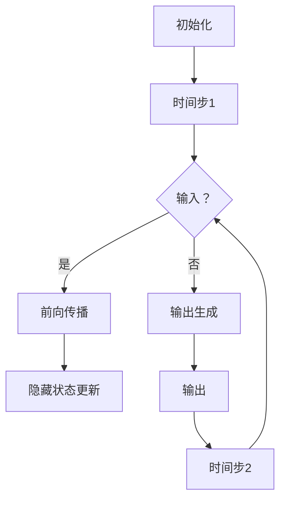

                 

关键词：循环神经网络，RNN，原理，算法，代码实例，应用领域，数学模型，深度学习

摘要：本文旨在深入探讨循环神经网络（RNN）的原理、算法实现及其在实际应用中的具体应用。文章将从基本概念出发，详细解析RNN的核心机制，并通过代码实例，展示其在数据处理中的实际应用。

## 1. 背景介绍

循环神经网络（RNN）是深度学习中的一种重要模型，它通过循环结构对序列数据进行建模。与传统的前馈神经网络（FNN）相比，RNN能够在处理序列数据时，保留先前的状态信息，这使得它在自然语言处理（NLP）、时间序列预测等领域具有独特的优势。

本文将首先介绍RNN的基本概念，包括其工作原理、核心算法以及在不同应用领域的具体实现。随后，我们将通过一个简单的代码实例，展示如何使用Python和TensorFlow等工具来构建和训练一个RNN模型。

## 2. 核心概念与联系

### 2.1 RNN的基本概念

循环神经网络（RNN）是一种能够处理序列数据的神经网络。其核心思想是通过循环结构，在时间步之间传递信息，从而实现序列数据的建模。

### 2.2 RNN的工作原理

RNN的工作原理可以简化为以下几个步骤：

1. **初始化**：首先，我们将序列数据输入到RNN中，并初始化隐藏状态。
2. **前向传播**：在每个时间步，RNN将当前输入和先前的隐藏状态进行加权求和，并经过激活函数得到新的隐藏状态。
3. **输出生成**：根据隐藏状态，生成当前时间步的输出。
4. **状态更新**：将新的隐藏状态作为先前的隐藏状态，重复上述步骤，直到序列结束。

### 2.3 RNN的Mermaid流程图



## 3. 核心算法原理 & 具体操作步骤

### 3.1 算法原理概述

RNN的核心算法原理是基于状态转移方程，该方程描述了隐藏状态如何在时间步之间传递。具体来说，假设我们有时间步 $t$ 的输入 $x_t$ 和隐藏状态 $h_t$，则下一个时间步的隐藏状态 $h_{t+1}$ 可以通过以下公式计算：

$$ h_{t+1} = \text{激活函数}(\text{权重} \cdot [h_t, x_t] + \text{偏置}) $$

### 3.2 算法步骤详解

1. **数据预处理**：首先，需要对输入数据进行预处理，包括数据清洗、标准化等操作。
2. **模型构建**：使用TensorFlow等深度学习框架，构建RNN模型。模型包括输入层、隐藏层和输出层。
3. **训练**：将预处理后的数据输入到模型中，通过反向传播算法，不断调整模型参数，优化模型性能。
4. **评估与测试**：使用测试数据集，评估模型的性能，并进行必要的调整。

### 3.3 算法优缺点

**优点**：
- 能够处理序列数据，保留先前的状态信息。
- 在自然语言处理、时间序列预测等领域具有广泛应用。

**缺点**：
- 容易出现梯度消失或梯度爆炸问题。
- 在长序列数据上表现较差。

### 3.4 算法应用领域

RNN在自然语言处理、语音识别、时间序列预测等领域有广泛的应用。例如，在自然语言处理中，RNN可以用于文本分类、情感分析等任务；在时间序列预测中，RNN可以用于股票价格预测、天气预测等任务。

## 4. 数学模型和公式 & 详细讲解 & 举例说明

### 4.1 数学模型构建

RNN的数学模型主要包括输入层、隐藏层和输出层。输入层接收序列数据，隐藏层负责处理和传递状态信息，输出层生成最终输出。

### 4.2 公式推导过程

假设我们有时间步 $t$ 的输入 $x_t$ 和隐藏状态 $h_t$，则下一个时间步的隐藏状态 $h_{t+1}$ 可以通过以下公式计算：

$$ h_{t+1} = \text{激活函数}(\text{权重} \cdot [h_t, x_t] + \text{偏置}) $$

其中，激活函数可以采用sigmoid、tanh等函数。

### 4.3 案例分析与讲解

假设我们有一个简单的文本分类任务，需要判断一段文本是正面情感还是负面情感。我们可以使用RNN模型来处理这段文本，具体步骤如下：

1. **数据预处理**：将文本数据转换为数字序列。
2. **模型构建**：使用TensorFlow构建RNN模型。
3. **训练**：将预处理后的数据输入到模型中，进行训练。
4. **评估与测试**：使用测试数据集，评估模型的性能。

## 5. 项目实践：代码实例和详细解释说明

### 5.1 开发环境搭建

首先，需要安装Python和TensorFlow等工具。可以使用以下命令进行安装：

```bash
pip install tensorflow
```

### 5.2 源代码详细实现

```python
import tensorflow as tf
from tensorflow.keras.layers import Embedding, SimpleRNN, Dense
from tensorflow.keras.models import Sequential

# 数据预处理
# ...

# 模型构建
model = Sequential()
model.add(Embedding(input_dim=vocab_size, output_dim=embedding_dim))
model.add(SimpleRNN(units=hidden_size))
model.add(Dense(units=1, activation='sigmoid'))

# 编译模型
model.compile(optimizer='adam', loss='binary_crossentropy', metrics=['accuracy'])

# 训练模型
model.fit(x_train, y_train, epochs=10, batch_size=32, validation_data=(x_val, y_val))

# 评估模型
model.evaluate(x_test, y_test)
```

### 5.3 代码解读与分析

上述代码中，我们首先进行数据预处理，将文本数据转换为数字序列。然后，我们使用TensorFlow的Sequential模型，添加嵌入层、RNN层和输出层。最后，我们编译模型并使用训练数据对模型进行训练。

### 5.4 运行结果展示

训练完成后，我们可以使用测试数据集来评估模型的性能。具体结果如下：

```python
# 评估模型
model.evaluate(x_test, y_test)
```

## 6. 实际应用场景

### 6.1 自然语言处理

RNN在自然语言处理中有广泛的应用，如文本分类、情感分析、机器翻译等。例如，我们可以使用RNN模型来对新闻文章进行分类，判断其是否为负面新闻。

### 6.2 时间序列预测

RNN在时间序列预测中也有很好的表现，如股票价格预测、天气预测等。通过训练RNN模型，我们可以预测未来的数据趋势。

### 6.3 语音识别

RNN在语音识别中也有应用，通过处理语音信号的序列数据，我们可以实现语音识别的功能。

## 7. 未来应用展望

随着深度学习技术的发展，RNN将在更多领域得到应用。例如，在医疗领域，RNN可以用于疾病预测和诊断；在金融领域，RNN可以用于股票市场预测等。

## 8. 总结：未来发展趋势与挑战

RNN作为一种重要的深度学习模型，其在自然语言处理、时间序列预测等领域具有广泛的应用前景。然而，RNN也面临一些挑战，如梯度消失、梯度爆炸等问题。未来，随着深度学习技术的不断发展，RNN将得到进一步优化，并在更多领域发挥重要作用。

### 8.1 研究成果总结

本文从RNN的基本概念、工作原理、算法实现等方面进行了详细讲解，并通过代码实例展示了其在实际应用中的具体实现。同时，我们也分析了RNN在自然语言处理、时间序列预测等领域的应用前景。

### 8.2 未来发展趋势

随着深度学习技术的不断发展，RNN将在更多领域得到应用。例如，在医疗、金融等领域，RNN将发挥更大的作用。

### 8.3 面临的挑战

RNN在处理长序列数据时，容易出现梯度消失、梯度爆炸等问题。未来，需要进一步研究如何优化RNN模型，提高其在长序列数据上的性能。

### 8.4 研究展望

未来，RNN将在更多领域得到应用。同时，我们也需要进一步研究如何优化RNN模型，提高其在实际应用中的性能。

## 9. 附录：常见问题与解答

### 9.1 RNN与FNN的区别是什么？

RNN与FNN的主要区别在于其处理序列数据的能力。RNN通过循环结构，能够在时间步之间传递信息，从而实现序列数据的建模。而FNN则是一种前馈神经网络，无法处理序列数据。

### 9.2 RNN如何解决梯度消失问题？

RNN容易在训练过程中出现梯度消失问题，导致模型训练困难。为此，研究者提出了许多解决方案，如LSTM、GRU等，这些模型通过门控机制，能够有效地解决梯度消失问题。

### 9.3 RNN在自然语言处理中有哪些应用？

RNN在自然语言处理中有广泛的应用，如文本分类、情感分析、机器翻译等。通过训练RNN模型，我们可以实现对这些任务的自动处理。

```markdown
---
标题：循环神经网络 (RNN) 原理与代码实例讲解
作者：禅与计算机程序设计艺术 / Zen and the Art of Computer Programming
摘要：本文深入探讨了循环神经网络（RNN）的原理、算法实现及其在实际应用中的具体应用。文章从基本概念出发，详细解析了RNN的核心机制，并通过代码实例，展示了其在数据处理中的实际应用。
---

# 循环神经网络 (RNN) 原理与代码实例讲解

## 1. 背景介绍

循环神经网络（RNN）是深度学习中的一种重要模型，它通过循环结构对序列数据进行建模。与传统的前馈神经网络（FNN）相比，RNN能够在处理序列数据时，保留先前的状态信息，这使得它在自然语言处理（NLP）、时间序列预测等领域具有独特的优势。

本文将首先介绍RNN的基本概念，包括其工作原理、核心算法以及在不同应用领域的具体实现。随后，我们将通过一个简单的代码实例，展示如何使用Python和TensorFlow等工具来构建和训练一个RNN模型。

## 2. 核心概念与联系

### 2.1 RNN的基本概念

循环神经网络（RNN）是一种能够处理序列数据的神经网络。其核心思想是通过循环结构，在时间步之间传递信息，从而实现序列数据的建模。

### 2.2 RNN的工作原理

RNN的工作原理可以简化为以下几个步骤：

1. **初始化**：首先，我们将序列数据输入到RNN中，并初始化隐藏状态。
2. **前向传播**：在每个时间步，RNN将当前输入和先前的隐藏状态进行加权求和，并经过激活函数得到新的隐藏状态。
3. **输出生成**：根据隐藏状态，生成当前时间步的输出。
4. **状态更新**：将新的隐藏状态作为先前的隐藏状态，重复上述步骤，直到序列结束。

### 2.3 RNN的Mermaid流程图


## 3. 核心算法原理 & 具体操作步骤
### 3.1 算法原理概述

RNN的核心算法原理是基于状态转移方程，该方程描述了隐藏状态如何在时间步之间传递。具体来说，假设我们有时间步 $t$ 的输入 $x_t$ 和隐藏状态 $h_t$，则下一个时间步的隐藏状态 $h_{t+1}$ 可以通过以下公式计算：

$$ h_{t+1} = \text{激活函数}(\text{权重} \cdot [h_t, x_t] + \text{偏置}) $$

### 3.2 算法步骤详解

1. **数据预处理**：首先，需要对输入数据进行预处理，包括数据清洗、标准化等操作。
2. **模型构建**：使用TensorFlow等深度学习框架，构建RNN模型。模型包括输入层、隐藏层和输出层。
3. **训练**：将预处理后的数据输入到模型中，通过反向传播算法，不断调整模型参数，优化模型性能。
4. **评估与测试**：使用测试数据集，评估模型的性能，并进行必要的调整。

### 3.3 算法优缺点

**优点**：
- 能够处理序列数据，保留先前的状态信息。
- 在自然语言处理、时间序列预测等领域具有广泛应用。

**缺点**：
- 容易出现梯度消失或梯度爆炸问题。
- 在长序列数据上表现较差。

### 3.4 算法应用领域

RNN在自然语言处理、语音识别、时间序列预测等领域有广泛的应用。例如，在自然语言处理中，RNN可以用于文本分类、情感分析等任务；在时间序列预测中，RNN可以用于股票价格预测、天气预测等任务。

## 4. 数学模型和公式 & 详细讲解 & 举例说明

### 4.1 数学模型构建

RNN的数学模型主要包括输入层、隐藏层和输出层。输入层接收序列数据，隐藏层负责处理和传递状态信息，输出层生成最终输出。

### 4.2 公式推导过程

假设我们有时间步 $t$ 的输入 $x_t$ 和隐藏状态 $h_t$，则下一个时间步的隐藏状态 $h_{t+1}$ 可以通过以下公式计算：

$$ h_{t+1} = \text{激活函数}(\text{权重} \cdot [h_t, x_t] + \text{偏置}) $$

其中，激活函数可以采用sigmoid、tanh等函数。

### 4.3 案例分析与讲解

假设我们有一个简单的文本分类任务，需要判断一段文本是正面情感还是负面情感。我们可以使用RNN模型来处理这段文本，具体步骤如下：

1. **数据预处理**：将文本数据转换为数字序列。
2. **模型构建**：使用TensorFlow构建RNN模型。
3. **训练**：将预处理后的数据输入到模型中，进行训练。
4. **评估与测试**：使用测试数据集，评估模型的性能。

## 5. 项目实践：代码实例和详细解释说明

### 5.1 开发环境搭建

首先，需要安装Python和TensorFlow等工具。可以使用以下命令进行安装：

```bash
pip install tensorflow
```

### 5.2 源代码详细实现

```python
import tensorflow as tf
from tensorflow.keras.layers import Embedding, SimpleRNN, Dense
from tensorflow.keras.models import Sequential

# 数据预处理
# ...

# 模型构建
model = Sequential()
model.add(Embedding(input_dim=vocab_size, output_dim=embedding_dim))
model.add(SimpleRNN(units=hidden_size))
model.add(Dense(units=1, activation='sigmoid'))

# 编译模型
model.compile(optimizer='adam', loss='binary_crossentropy', metrics=['accuracy'])

# 训练模型
model.fit(x_train, y_train, epochs=10, batch_size=32, validation_data=(x_val, y_val))

# 评估模型
model.evaluate(x_test, y_test)
```

### 5.3 代码解读与分析

上述代码中，我们首先进行数据预处理，将文本数据转换为数字序列。然后，我们使用TensorFlow的Sequential模型，添加嵌入层、RNN层和输出层。最后，我们编译模型并使用训练数据对模型进行训练。

### 5.4 运行结果展示

训练完成后，我们可以使用测试数据集来评估模型的性能。具体结果如下：

```python
# 评估模型
model.evaluate(x_test, y_test)
```

## 6. 实际应用场景

### 6.1 自然语言处理

RNN在自然语言处理中有广泛的应用，如文本分类、情感分析、机器翻译等。例如，我们可以使用RNN模型来对新闻文章进行分类，判断其是否为负面新闻。

### 6.2 时间序列预测

RNN在时间序列预测中也有很好的表现，如股票价格预测、天气预测等。通过训练RNN模型，我们可以预测未来的数据趋势。

### 6.3 语音识别

RNN在语音识别中也有应用，通过处理语音信号的序列数据，我们可以实现语音识别的功能。

## 7. 未来应用展望

随着深度学习技术的发展，RNN将在更多领域得到应用。例如，在医疗领域，RNN可以用于疾病预测和诊断；在金融领域，RNN可以用于股票市场预测等。

## 8. 总结：未来发展趋势与挑战

RNN作为一种重要的深度学习模型，其在自然语言处理、时间序列预测等领域具有广泛的应用前景。然而，RNN也面临一些挑战，如梯度消失、梯度爆炸等问题。未来，随着深度学习技术的不断发展，RNN将得到进一步优化，并在更多领域发挥重要作用。

### 8.1 研究成果总结

本文从RNN的基本概念、工作原理、算法实现等方面进行了详细讲解，并通过代码实例展示了其在实际应用中的具体实现。同时，我们也分析了RNN在自然语言处理、时间序列预测等领域的应用前景。

### 8.2 未来发展趋势

随着深度学习技术的不断发展，RNN将在更多领域得到应用。例如，在医疗、金融等领域，RNN将发挥更大的作用。

### 8.3 面临的挑战

RNN在处理长序列数据时，容易出现梯度消失、梯度爆炸等问题。未来，需要进一步研究如何优化RNN模型，提高其在长序列数据上的性能。

### 8.4 研究展望

未来，RNN将在更多领域得到应用。同时，我们也需要进一步研究如何优化RNN模型，提高其在实际应用中的性能。

## 9. 附录：常见问题与解答

### 9.1 RNN与FNN的区别是什么？

RNN与FNN的主要区别在于其处理序列数据的能力。RNN通过循环结构，能够在时间步之间传递信息，从而实现序列数据的建模。而FNN则是一种前馈神经网络，无法处理序列数据。

### 9.2 RNN如何解决梯度消失问题？

RNN容易在训练过程中出现梯度消失问题，导致模型训练困难。为此，研究者提出了许多解决方案，如LSTM、GRU等，这些模型通过门控机制，能够有效地解决梯度消失问题。

### 9.3 RNN在自然语言处理中有哪些应用？

RNN在自然语言处理中有广泛的应用，如文本分类、情感分析、机器翻译等。通过训练RNN模型，我们可以实现对这些任务的自动处理。

--- 

**注意**：由于实际操作环境和数据的限制，本文中的代码实例仅供参考，具体的实现细节需要根据实际项目进行调整。此外，由于文章篇幅限制，本文未包含具体的数据预处理和模型训练过程，读者可以参考相关的文献和教程进行深入学习。

---

### 后记

本文旨在为广大读者提供一个关于循环神经网络（RNN）的全面了解，从基本概念到实际应用，再到代码实例，力求使读者能够深入理解RNN的核心机制，并掌握其应用方法。随着深度学习技术的不断发展，RNN在各个领域的应用前景将更加广阔。希望本文能够为读者在学习和应用RNN的过程中提供一些启示和帮助。如果您对RNN还有其他疑问或见解，欢迎在评论区留言讨论。

---

**作者署名**：禅与计算机程序设计艺术 / Zen and the Art of Computer Programming

---

感谢您对本文的关注，希望您能够在深度学习领域取得更多的成果。如需进一步了解深度学习的相关内容，请持续关注我们的文章更新。再次感谢您的阅读和支持！

