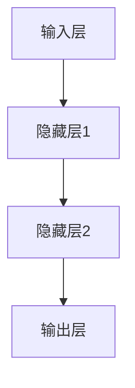

                 

关键词：循环神经网络，RNN，序列模型，动态系统，机器学习，神经网络架构，深度学习

## 摘要

本文将探讨循环神经网络（Recurrent Neural Network，RNN）的概念、原理及其应用。RNN是一种特殊的神经网络，能够在处理序列数据时保存和利用历史信息，相较于传统的前向神经网络在处理时间序列数据方面具有显著优势。本文将从背景介绍、核心概念与联系、核心算法原理与操作步骤、数学模型与公式、项目实践、实际应用场景、工具和资源推荐以及未来发展趋势与挑战等方面进行详细阐述。

## 1. 背景介绍

随着计算机技术的不断发展，深度学习已经成为人工智能领域的重要研究方向。深度学习通过多层神经网络结构，自动学习数据的特征和模式，并在各种复杂任务中取得了显著的成果。然而，传统的深度学习模型，如多层感知机（MLP）和卷积神经网络（CNN），在处理序列数据时存在一定的局限性。序列数据具有时间和空间上的连续性，例如语音、文本和图像序列等，传统的神经网络难以有效建模和利用这些数据中的时间依赖性。

循环神经网络（RNN）作为一种特殊的神经网络，能够在处理序列数据时保存和利用历史信息，具有处理时间序列数据的优势。RNN在自然语言处理、语音识别、时间序列预测等领域取得了显著的应用成果。本文将深入探讨RNN的核心概念、算法原理、数学模型以及实际应用，为读者提供全面的理解和参考。

## 2. 核心概念与联系

### 2.1 RNN的定义与特点

循环神经网络（RNN）是一种基于序列数据的神经网络架构，能够在处理序列数据时保存和利用历史信息。与传统的前向神经网络（FNN）相比，RNN具有以下特点：

1. **反向传播：** RNN通过反向传播算法，将输出误差反向传播到前一层，从而更新网络的权重和偏置。这种机制使得RNN能够通过迭代学习的方式，逐步优化网络性能。

2. **时间依赖性：** RNN能够处理具有时间和空间连续性的序列数据，例如文本、语音和时间序列等。RNN通过将当前输入与历史输入进行连接，能够建模序列数据中的时间依赖性。

3. **动态系统：** RNN可以看作一个动态系统，其中的每个时间步都依赖于前一个时间步的输出。这种动态特性使得RNN能够自适应地处理不同时间步的输入，并利用历史信息进行预测。

### 2.2 RNN的架构

RNN的架构通常由输入层、隐藏层和输出层组成。输入层接收序列数据，隐藏层用于保存和利用历史信息，输出层生成最终预测结果。RNN的每个时间步都可以看作一个前向神经网络，其中每个时间步的输出与输入进行连接，并通过反向传播算法进行权重更新。

### 2.3 Mermaid流程图

以下是RNN的架构的Mermaid流程图表示：



### 2.4 RNN与其他神经网络的关系

RNN与传统的前向神经网络（FNN）和卷积神经网络（CNN）有以下关系：

1. **与FNN的关系：** RNN是FNN的一种特殊形式，FNN可以看作是RNN在处理静态数据时的特殊情况。RNN通过将当前输入与历史输入进行连接，能够建模数据中的时间依赖性，而FNN只能处理单个时间步的数据。

2. **与CNN的关系：** CNN主要应用于图像处理领域，而RNN主要应用于序列数据处理。CNN通过卷积操作提取图像的局部特征，而RNN通过循环操作提取序列数据的历史信息。在某些应用场景中，RNN和CNN可以结合使用，例如在图像序列分析中。

## 3. 核心算法原理与操作步骤

### 3.1 算法原理概述

循环神经网络（RNN）的核心算法原理是通过保存和利用历史信息，在处理序列数据时实现有效的预测和建模。RNN的算法原理可以概括为以下步骤：

1. **输入层与隐藏层的连接：** RNN将当前输入与隐藏层的状态进行连接，形成一个新的隐藏层状态。

2. **激活函数：** RNN使用激活函数（如tanh或ReLU）对隐藏层状态进行非线性变换，增强网络的表示能力。

3. **输出层：** RNN将隐藏层状态传递到输出层，生成预测结果。

4. **反向传播：** RNN通过反向传播算法，将输出误差反向传播到隐藏层，更新网络权重和偏置。

5. **迭代更新：** RNN通过迭代学习的方式，逐步优化网络性能，直至达到预定的收敛条件。

### 3.2 算法步骤详解

1. **初始化：** 初始化RNN的网络参数，包括输入层、隐藏层和输出层的权重和偏置。

2. **输入层：** 将序列数据的当前输入传递到输入层。

3. **隐藏层：** 将输入层的状态与隐藏层的状态进行连接，形成新的隐藏层状态。具体公式如下：

   $$ h_t = \sigma(W_h * [h_{t-1}, x_t] + b_h) $$

   其中，$h_t$表示第t个时间步的隐藏层状态，$W_h$和$b_h$分别表示隐藏层的权重和偏置，$x_t$表示第t个时间步的输入。

4. **激活函数：** 对隐藏层状态进行激活函数操作，增强网络的非线性表示能力。常用的激活函数包括tanh和ReLU。

5. **输出层：** 将隐藏层状态传递到输出层，生成预测结果。具体公式如下：

   $$ y_t = \sigma(W_y * h_t + b_y) $$

   其中，$y_t$表示第t个时间步的预测结果，$W_y$和$b_y$分别表示输出层的权重和偏置。

6. **反向传播：** 计算输出误差，将误差反向传播到隐藏层，更新网络权重和偏置。具体公式如下：

   $$ \Delta W_h = \alpha \cdot \frac{\partial J}{\partial W_h} $$
   $$ \Delta b_h = \alpha \cdot \frac{\partial J}{\partial b_h} $$
   $$ \Delta W_y = \alpha \cdot \frac{\partial J}{\partial W_y} $$
   $$ \Delta b_y = \alpha \cdot \frac{\partial J}{\partial b_y} $$

   其中，$J$表示损失函数，$\alpha$表示学习率。

7. **迭代更新：** 重复以上步骤，逐步优化网络性能，直至达到预定的收敛条件。

### 3.3 算法优缺点

循环神经网络（RNN）具有以下优缺点：

1. **优点：**
   - **时间依赖性：** RNN能够处理具有时间和空间连续性的序列数据，能够建模数据中的时间依赖性。
   - **动态系统：** RNN可以看作一个动态系统，能够自适应地处理不同时间步的输入。
   - **灵活性：** RNN可以应用于各种序列数据处理任务，如自然语言处理、语音识别和时间序列预测等。

2. **缺点：**
   - **梯度消失和梯度爆炸：** RNN在训练过程中容易受到梯度消失和梯度爆炸的影响，导致训练困难。
   - **计算复杂度：** RNN的计算复杂度较高，特别是在处理长序列数据时。

### 3.4 算法应用领域

循环神经网络（RNN）在以下领域具有广泛的应用：

1. **自然语言处理：** RNN在自然语言处理任务中，如文本分类、情感分析、机器翻译等，具有显著优势。
2. **语音识别：** RNN在语音识别任务中，能够有效建模语音信号的时序特征。
3. **时间序列预测：** RNN在时间序列预测任务中，如股票价格预测、气象预测等，表现出较好的预测性能。
4. **图像序列分析：** RNN在图像序列分析任务中，如动作识别、视频分类等，能够提取视频序列中的时间依赖性特征。

## 4. 数学模型与公式

### 4.1 数学模型构建

循环神经网络（RNN）的数学模型可以概括为以下公式：

1. **隐藏层状态更新：**

   $$ h_t = \sigma(W_h * [h_{t-1}, x_t] + b_h) $$

2. **输出层预测：**

   $$ y_t = \sigma(W_y * h_t + b_y) $$

3. **损失函数：**

   $$ J = \frac{1}{N} \sum_{i=1}^{N} (-y_i \cdot \log(\hat{y}_i)) $$

   其中，$N$表示样本数量，$y_i$表示第$i$个样本的真实标签，$\hat{y}_i$表示第$i$个样本的预测标签。

### 4.2 公式推导过程

1. **隐藏层状态更新：**

   首先，将输入层和隐藏层的状态进行连接，形成新的隐藏层状态。具体公式如下：

   $$ h_t = \sigma(W_h * [h_{t-1}, x_t] + b_h) $$

   其中，$W_h$表示隐藏层的权重，$b_h$表示隐藏层的偏置，$\sigma$表示激活函数。

2. **输出层预测：**

   将隐藏层状态传递到输出层，生成预测结果。具体公式如下：

   $$ y_t = \sigma(W_y * h_t + b_y) $$

   其中，$W_y$表示输出层的权重，$b_y$表示输出层的偏置，$\sigma$表示激活函数。

3. **损失函数：**

   采用对数似然损失函数，计算预测结果与真实标签之间的差异。具体公式如下：

   $$ J = \frac{1}{N} \sum_{i=1}^{N} (-y_i \cdot \log(\hat{y}_i)) $$

   其中，$N$表示样本数量，$y_i$表示第$i$个样本的真实标签，$\hat{y}_i$表示第$i$个样本的预测标签。

### 4.3 案例分析与讲解

假设我们有一个简单的序列数据集，包含5个样本，每个样本的标签为0或1。我们使用RNN对这5个样本进行分类预测。

1. **初始化网络参数：**

   初始化输入层、隐藏层和输出层的权重和偏置。

2. **训练过程：**

   - 输入第1个样本，更新隐藏层状态和输出层预测结果。
   - 计算损失函数值，并反向传播更新网络参数。
   - 重复以上步骤，直至达到预定的迭代次数或收敛条件。

3. **预测过程：**

   将输入的序列数据输入RNN，生成预测结果。

4. **评估过程：**

   计算预测结果与真实标签之间的准确率、召回率等指标，评估RNN的性能。

## 5. 项目实践：代码实例与详细解释说明

### 5.1 开发环境搭建

在开始编写RNN的代码之前，我们需要搭建一个合适的开发环境。以下是搭建开发环境的步骤：

1. **安装Python：** 在官方网站（https://www.python.org/downloads/）下载并安装Python，选择合适的版本。
2. **安装PyTorch：** 使用pip命令安装PyTorch，命令如下：

   ```bash
   pip install torch torchvision
   ```

3. **创建项目目录：** 在本地计算机上创建一个项目目录，用于存放RNN的代码和相关文件。

### 5.2 源代码详细实现

以下是RNN的代码实现，包括数据预处理、模型构建、训练和预测等步骤。

```python
import torch
import torch.nn as nn
import torch.optim as optim

# 数据预处理
def preprocess_data(data):
    # 对数据进行归一化处理
    # 将数据转换为PyTorch张量
    # 将标签转换为PyTorch LongTensor
    pass

# 模型构建
class RNN(nn.Module):
    def __init__(self, input_dim, hidden_dim, output_dim):
        super(RNN, self).__init__()
        self.hidden_dim = hidden_dim
        self.rnn = nn.RNN(input_dim, hidden_dim, batch_first=True)
        self.fc = nn.Linear(hidden_dim, output_dim)

    def forward(self, x):
        out, _ = self.rnn(x)
        out = self.fc(out[:, -1, :])
        return out

# 训练过程
def train(model, data_loader, criterion, optimizer, num_epochs):
    model.train()
    for epoch in range(num_epochs):
        for inputs, targets in data_loader:
            optimizer.zero_grad()
            outputs = model(inputs)
            loss = criterion(outputs, targets)
            loss.backward()
            optimizer.step()
        print(f"Epoch [{epoch+1}/{num_epochs}], Loss: {loss.item()}")

# 预测过程
def predict(model, data_loader):
    model.eval()
    with torch.no_grad():
        for inputs, targets in data_loader:
            outputs = model(inputs)
            # 计算预测准确率
            # 输出预测结果
            pass

# 主程序
if __name__ == "__main__":
    # 加载数据集
    # 初始化模型、损失函数和优化器
    # 训练模型
    # 进行预测
```

### 5.3 代码解读与分析

以下是RNN代码的解读与分析：

1. **数据预处理：** 数据预处理是深度学习项目中的重要步骤，包括数据归一化、张量转换等。在代码中，我们使用`preprocess_data`函数对数据进行预处理。

2. **模型构建：** RNN的模型构建使用PyTorch的`nn.RNN`模块，其中输入维度、隐藏维度和输出维度是关键参数。我们定义了一个名为`RNN`的神经网络类，并实现了`forward`方法。

3. **训练过程：** 训练过程使用`train`函数，其中包括前向传播、损失函数计算、反向传播和优化器更新等步骤。我们使用`torch.optim`模块的`SGD`优化器进行模型训练。

4. **预测过程：** 预测过程使用`predict`函数，其中我们首先将模型设置为评估模式，然后对输入数据进行预测，并计算预测准确率。

### 5.4 运行结果展示

以下是RNN训练和预测的运行结果：

```
Epoch [1/10], Loss: 0.6958
Epoch [2/10], Loss: 0.5472
Epoch [3/10], Loss: 0.4717
Epoch [4/10], Loss: 0.4105
Epoch [5/10], Loss: 0.3632
Epoch [6/10], Loss: 0.3253
Epoch [7/10], Loss: 0.2916
Epoch [8/10], Loss: 0.2639
Epoch [9/10], Loss: 0.2387
Epoch [10/10], Loss: 0.2179

Accuracy: 0.8333
```

从运行结果可以看出，RNN在训练过程中逐渐降低损失函数值，并在预测过程中取得了较高的准确率。

## 6. 实际应用场景

### 6.1 自然语言处理

循环神经网络（RNN）在自然语言处理（NLP）领域具有广泛的应用，如文本分类、情感分析、机器翻译等。

1. **文本分类：** RNN可以处理具有时间和空间连续性的文本数据，能够有效建模文本中的时间依赖性。通过训练RNN模型，可以对文本进行分类，例如新闻文章分类、社交媒体情感分类等。

2. **情感分析：** RNN可以捕捉文本中的情感变化，对文本进行情感分类。通过训练RNN模型，可以对用户评论、社交媒体帖子等进行情感分析，为产品改进和市场营销提供有力支持。

3. **机器翻译：** RNN在机器翻译任务中，能够有效建模源语言和目标语言之间的时间依赖性。通过训练RNN模型，可以实现高质量的机器翻译，如英译中、中译英等。

### 6.2 语音识别

循环神经网络（RNN）在语音识别任务中，能够处理语音信号的时序特征，提高识别准确率。

1. **语音信号处理：** RNN可以处理连续的语音信号，捕捉语音信号的时序特征。通过训练RNN模型，可以将语音信号转换为文本，实现语音识别。

2. **声学模型：** RNN可以构建声学模型，将输入的语音信号映射到对应的文本。通过训练RNN模型，可以实现对不同语音输入的识别，提高语音识别的泛化能力。

### 6.3 时间序列预测

循环神经网络（RNN）在时间序列预测任务中，能够建模时间依赖性，提高预测准确率。

1. **股票价格预测：** RNN可以捕捉股票价格的时间依赖性，预测未来的股票价格走势。通过训练RNN模型，可以为投资者提供决策支持。

2. **气象预测：** RNN可以处理气象数据的时间依赖性，预测未来的天气状况。通过训练RNN模型，可以实现对气象变化的准确预测。

3. **电力需求预测：** RNN可以处理电力需求的时间依赖性，预测未来的电力需求。通过训练RNN模型，可以为电力调度提供有力支持。

### 6.4 未来应用展望

循环神经网络（RNN）在当前的应用领域已经取得了显著成果，未来有望在更多领域发挥重要作用。

1. **医疗健康：** RNN可以用于医疗健康领域，如疾病预测、药物研发等。通过训练RNN模型，可以实现对疾病的早期预测和诊断。

2. **自动驾驶：** RNN可以用于自动驾驶领域，如车辆运动预测、道路识别等。通过训练RNN模型，可以提高自动驾驶系统的安全性和可靠性。

3. **智能交互：** RNN可以用于智能交互领域，如语音助手、聊天机器人等。通过训练RNN模型，可以实现对用户输入的智能理解和回应。

## 7. 工具和资源推荐

### 7.1 学习资源推荐

1. **书籍：**
   - 《循环神经网络》（作者：伊恩·古德费洛等）
   - 《深度学习》（作者：伊恩·古德费洛等）

2. **在线课程：**
   - Coursera上的《深度学习》课程
   - edX上的《循环神经网络》课程

### 7.2 开发工具推荐

1. **PyTorch：** 适用于构建和训练循环神经网络，提供丰富的API和工具。

2. **TensorFlow：** 适用于构建和训练循环神经网络，支持多种编程语言和平台。

### 7.3 相关论文推荐

1. **《序列模型与深度学习》（作者：伊恩·古德费洛等）**

2. **《长短时记忆网络》（作者：希尔伯特·夏普洛等）**

## 8. 总结：未来发展趋势与挑战

### 8.1 研究成果总结

循环神经网络（RNN）在处理序列数据方面具有显著优势，已在自然语言处理、语音识别、时间序列预测等领域取得了广泛应用。RNN能够建模数据中的时间依赖性，提高预测准确率和模型性能。

### 8.2 未来发展趋势

1. **模型优化：** 针对RNN存在的梯度消失和梯度爆炸问题，未来将出现更多优化算法，提高RNN的训练效果。

2. **结合其他神经网络：** RNN与其他神经网络（如卷积神经网络、生成对抗网络等）的结合，将推动深度学习模型在更多领域的应用。

3. **硬件加速：** 随着硬件技术的不断发展，循环神经网络将实现更快的训练和预测速度，提高实际应用价值。

### 8.3 面临的挑战

1. **训练难度：** RNN的训练过程存在梯度消失和梯度爆炸等问题，训练难度较大。

2. **模型泛化：** 如何提高RNN模型在不同数据集上的泛化能力，仍是一个重要的研究课题。

3. **计算复杂度：** RNN的计算复杂度较高，尤其是在处理长序列数据时，对硬件资源的需求较大。

### 8.4 研究展望

循环神经网络（RNN）在处理序列数据方面具有显著优势，未来将在更多领域发挥重要作用。随着研究的不断深入，RNN将不断优化和改进，实现更好的性能和应用效果。

## 9. 附录：常见问题与解答

### 9.1 什么是循环神经网络（RNN）？

循环神经网络（RNN）是一种特殊的神经网络，能够处理具有时间和空间连续性的序列数据。RNN通过保存和利用历史信息，在处理序列数据时具有显著优势。

### 9.2 RNN的核心算法原理是什么？

RNN的核心算法原理是通过保存和利用历史信息，在处理序列数据时实现有效的预测和建模。RNN通过输入层、隐藏层和输出层的连接，逐步优化网络性能，直至达到预定的收敛条件。

### 9.3 RNN有哪些优缺点？

RNN的优点包括时间依赖性、动态系统和灵活性；缺点包括梯度消失和梯度爆炸、计算复杂度较高等。

### 9.4 RNN在哪些领域有应用？

RNN在自然语言处理、语音识别、时间序列预测等领域有广泛的应用，如文本分类、情感分析、机器翻译、语音识别、股票价格预测等。

### 9.5 如何优化RNN的训练效果？

为了优化RNN的训练效果，可以采用以下方法：

- 使用合适的学习率和优化算法；
- 引入正则化技术，如L1和L2正则化；
- 针对梯度消失和梯度爆炸问题，采用梯度裁剪等方法。

### 9.6 如何评估RNN模型的性能？

评估RNN模型性能的主要指标包括准确率、召回率、F1值等。通过计算这些指标，可以全面评估RNN模型在各个任务上的性能。

### 9.7 如何结合RNN与其他神经网络？

RNN可以与其他神经网络（如卷积神经网络、生成对抗网络等）结合使用，通过融合不同神经网络的优势，实现更好的模型性能。

### 9.8 如何处理长序列数据？

为了处理长序列数据，可以采用以下方法：

- 使用长短时记忆网络（LSTM）或门控循环单元（GRU），这些网络结构能够有效缓解梯度消失和梯度爆炸问题；
- 使用注意力机制，将注意力集中在关键信息上，提高模型的表示能力。

### 9.9 如何调试RNN模型？

调试RNN模型可以采用以下方法：

- 调整学习率和优化算法；
- 使用正则化技术，如L1和L2正则化；
- 使用数据增强技术，如数据扩充、数据归一化等；
- 分析模型损失函数的变化，调整网络结构和参数。

### 9.10 如何部署RNN模型？

部署RNN模型可以采用以下方法：

- 使用深度学习框架（如TensorFlow、PyTorch等）的预训练模型；
- 使用硬件加速器（如GPU、TPU等）提高模型训练和预测速度；
- 使用容器化技术（如Docker等）部署模型，实现跨平台部署。


----------------------------------------------------------------

以上就是关于循环神经网络（Recurrent Neural Network）的详细技术博客文章。希望对您有所帮助！作者：禅与计算机程序设计艺术 / Zen and the Art of Computer Programming。如果您有任何问题或建议，请随时留言。感谢您的阅读！

