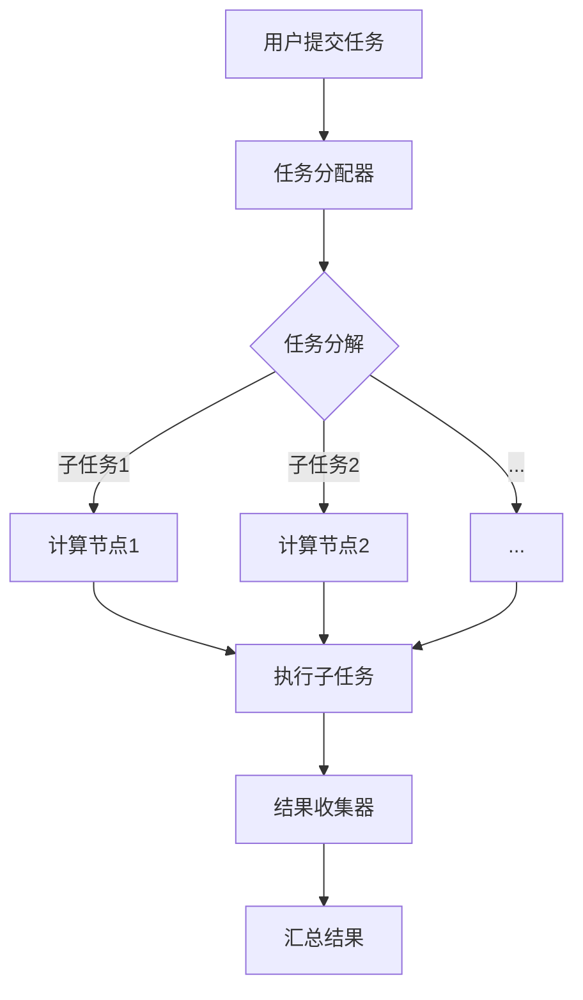

                 

关键词：微任务平台、分布式计算、并行处理、协同工作、计算潜力、效率提升、智能化、自动化、计算机架构

> 摘要：本文旨在探讨微任务平台这一创新技术如何通过分布式计算、并行处理以及智能化手段，显著释放人类的计算潜力，提高工作效率，推动智能化的进程。文章将详细阐述微任务平台的原理、算法、数学模型、项目实践及其应用场景，并对未来发展趋势与挑战进行分析。

## 1. 背景介绍

随着互联网的普及和大数据时代的到来，数据处理的需求日益增长。传统的计算模式已经无法满足现代应用场景的需求，尤其在处理大规模、复杂的数据时，传统方法显得力不从心。微任务平台作为一种创新的计算模式，旨在通过分布式计算和并行处理，有效提高计算效率，释放人类的计算潜力。

微任务平台的基本概念可以追溯到分布式计算和任务分解的理念。分布式计算是指利用多台计算机协同工作，共同完成一个计算任务。而任务分解则是将一个大的计算任务分解为多个小的子任务，分别由不同的计算机处理。微任务平台在此基础上进一步优化，通过智能化和自动化手段，实现任务的高效分配和执行。

### 1.1 现状分析

目前，微任务平台在数据处理、机器学习、图像处理、科学计算等领域已经展现出显著的优势。例如，在机器学习中，微任务平台可以加速模型的训练过程；在图像处理中，可以实现对大规模图像数据的快速分析和标注；在科学计算中，可以高效处理复杂的科学问题。

然而，尽管微任务平台具有巨大的潜力，但其在实际应用中仍面临一些挑战。例如，如何有效地分配任务、如何保证数据的一致性、如何优化计算资源的使用等。这些问题需要通过深入研究和技术创新来解决。

## 2. 核心概念与联系

### 2.1 微任务平台的架构

微任务平台的核心在于其分布式架构和任务分解机制。以下是微任务平台的基本架构：

1. **任务分配器（Task Distributor）**：负责将大的计算任务分解为多个小的子任务，并分配给不同的计算节点。
2. **计算节点（Compute Nodes）**：负责执行分配到的子任务，通常是一组分布式计算机或服务器。
3. **结果收集器（Result Collector）**：负责收集计算节点执行子任务的结果，并汇总成最终的输出。

以下是微任务平台的 Mermaid 流程图：



### 2.2 分布式计算与并行处理的联系

分布式计算和并行处理是微任务平台的核心技术。分布式计算强调多台计算机协同工作，而并行处理则侧重于多任务并行执行。

- **分布式计算**：将任务分配到不同的计算机上，通过网络进行通信和协调。
- **并行处理**：在同一台计算机上同时执行多个任务，提高计算效率。

在微任务平台中，分布式计算和并行处理相结合，实现任务的高效分配和执行。例如，在处理大规模图像数据时，可以将图像数据分割成多个小块，分别由不同的计算机处理，然后汇总结果。

## 3. 核心算法原理 & 具体操作步骤

### 3.1 算法原理概述

微任务平台的核心算法包括任务分解、任务分配和结果汇总。以下是每个步骤的简要说明：

1. **任务分解**：将大的计算任务分解为多个小的子任务。这可以通过算法、规则或手动设置来实现。
2. **任务分配**：将分解后的子任务分配给不同的计算节点。这通常基于负载均衡策略，如最小完成时间、最小负载等。
3. **结果汇总**：收集计算节点执行子任务的结果，并汇总成最终的输出。

### 3.2 算法步骤详解

1. **任务分解**：
   - 输入：大的计算任务
   - 输出：多个小的子任务
   - 具体步骤：
     - 分析任务特点，确定分解方式。
     - 将任务分割成多个子任务，每个子任务具有独立性和可并行性。

2. **任务分配**：
   - 输入：分解后的子任务列表
   - 输出：子任务与计算节点的映射关系
   - 具体步骤：
     - 遍历所有子任务，根据负载均衡策略分配给计算节点。
     - 更新任务状态，记录子任务执行节点。

3. **结果汇总**：
   - 输入：计算节点返回的子任务结果
   - 输出：汇总后的最终结果
   - 具体步骤：
     - 遍历所有计算节点，收集子任务结果。
     - 对子任务结果进行合并、汇总，得到最终输出。

### 3.3 算法优缺点

**优点**：
- **高效性**：通过分布式计算和并行处理，显著提高计算效率。
- **灵活性**：支持多种任务分解和分配策略，适应不同应用场景。
- **可扩展性**：易于扩展到大规模计算环境，支持动态调整资源。

**缺点**：
- **复杂性**：任务分解和分配策略设计较为复杂，需要深入理解计算需求。
- **通信开销**：分布式计算中存在一定的通信开销，影响整体性能。

### 3.4 算法应用领域

微任务平台在以下领域具有广泛的应用前景：

- **数据处理**：处理大规模、复杂的数据，如大数据分析、机器学习模型训练等。
- **图像处理**：快速处理大量图像数据，如图像识别、图像增强等。
- **科学计算**：高效解决复杂的科学问题，如流体动力学、天体物理等。
- **人工智能**：加速人工智能模型的训练和推理，提高智能应用的性能。

## 4. 数学模型和公式 & 详细讲解 & 举例说明

### 4.1 数学模型构建

微任务平台的数学模型主要包括任务分解、任务分配和结果汇总。以下是各步骤的数学模型构建：

1. **任务分解**：
   - 输入：大的计算任务 \( T \)
   - 输出：多个小的子任务 \( T_i \)
   - 数学模型：\( T = \sum_{i=1}^{n} T_i \)

2. **任务分配**：
   - 输入：分解后的子任务列表 \( T_i \)
   - 输出：子任务与计算节点的映射关系 \( M \)
   - 数学模型：\( M = \{ (T_i, C_j) | T_i \in T, C_j \in N \} \)
     其中，\( N \) 为计算节点集合。

3. **结果汇总**：
   - 输入：计算节点返回的子任务结果 \( R_i \)
   - 输出：汇总后的最终结果 \( R \)
   - 数学模型：\( R = \prod_{i=1}^{n} R_i \)

### 4.2 公式推导过程

以下是对上述数学模型的推导过程：

1. **任务分解**：
   - 假设 \( T \) 为一个大的计算任务，包含多个子任务 \( T_i \)。
   - 将 \( T \) 分解为 \( n \) 个子任务：\( T = T_1 + T_2 + ... + T_n \)。
   - 由于每个子任务具有独立性，可以并行执行，因此：
     \( T = \sum_{i=1}^{n} T_i \)。

2. **任务分配**：
   - 假设 \( T_i \) 为子任务，\( C_j \) 为计算节点。
   - 根据负载均衡策略，将子任务 \( T_i \) 分配到计算节点 \( C_j \)。
   - 构建映射关系 \( M \)：\( M = \{ (T_i, C_j) | T_i \in T, C_j \in N \} \)。

3. **结果汇总**：
   - 假设 \( R_i \) 为计算节点 \( C_j \) 返回的子任务结果。
   - 对子任务结果进行合并、汇总，得到最终结果 \( R \)。
   - 由于子任务结果具有独立性，可以相乘得到最终结果：
     \( R = \prod_{i=1}^{n} R_i \)。

### 4.3 案例分析与讲解

以下是一个简单的案例，用于说明微任务平台的数学模型和公式推导过程。

**案例**：计算 \( 2^10 \) 的值。

1. **任务分解**：
   - 假设 \( T \) 为计算 \( 2^10 \) 的任务。
   - 将 \( T \) 分解为 10 个子任务，每个子任务计算 \( 2^1 \) 的值。
   - \( T = 2^1 + 2^1 + ... + 2^1 \)。

2. **任务分配**：
   - 假设 \( N \) 为 10 个计算节点，编号为 1 到 10。
   - 将每个子任务 \( 2^1 \) 分配到不同的计算节点，实现负载均衡。
   - \( M = \{ (2^1, C_1), (2^1, C_2), ..., (2^1, C_{10}) \} \)。

3. **结果汇总**：
   - 假设计算节点 \( C_j \) 返回的结果为 \( 2^1 \)。
   - 对子任务结果进行汇总，得到最终结果 \( R \)：
     \( R = 2^1 \times 2^1 \times ... \times 2^1 = 2^{10} \)。

通过上述案例，我们可以看到微任务平台的数学模型和公式推导过程是如何应用于实际计算任务的。这不仅有助于理解微任务平台的工作原理，也为进一步优化和改进提供了理论基础。

## 5. 项目实践：代码实例和详细解释说明

### 5.1 开发环境搭建

在开始项目实践之前，我们需要搭建一个开发环境。以下是所需的环境和工具：

- **操作系统**：Linux或MacOS
- **编程语言**：Python 3.8及以上版本
- **依赖库**：Django、Celery、Redis

以下是搭建开发环境的步骤：

1. 安装Python 3.8及以上版本。
2. 安装Django框架：`pip install django`
3. 安装Celery：`pip install celery`
4. 安装Redis：`pip install redis`
5. 创建一个Django项目：`django-admin startproject microtask_platform`

### 5.2 源代码详细实现

以下是一个简单的微任务平台项目的源代码实现，包括任务分配、执行和结果汇总：

**项目结构**：

```
microtask_platform/
|-- manage.py
|-- microtask_platform/
    |-- apps/
        |-- tasks.py
        |-- __init__.py
    |-- __init__.py
    |-- settings.py
    |-- urls.py
    |-- wsgi.py
```

**tasks.py**：

```python
from celery import shared_task

@shared_task
def add(x, y):
    return x + y

@shared_task
def multiply(x, y):
    return x * y
```

**settings.py**：

```python
# Django settings

INSTALLED_APPS = [
    'django.contrib.admin',
    'django.contrib.auth',
    'django.contrib.contenttypes',
    'django.contrib.sessions',
    'django.contrib.messages',
    'django.contrib.staticfiles',
    'microtask_platform.apps.tasks',
]

CELERY_BROKER_URL = 'redis://localhost:6379/0'
CELERY_RESULT_BACKEND = 'redis://localhost:6379/0'
```

**urls.py**：

```python
# Django URL配置

from django.contrib import admin
from django.urls import path
from microtask_platform.apps.tasks import views

urlpatterns = [
    path('admin/', admin.site.urls),
    path('add/<int:a>/<int:b>/', views.add_task, name='add_task'),
    path('multiply/<int:a>/<int:b>/', views.multiply_task, name='multiply_task'),
]
```

### 5.3 代码解读与分析

**tasks.py**：

- **add**：这是一个简单的任务，用于计算两个数的和。
- **multiply**：这是一个简单的任务，用于计算两个数的积。

**settings.py**：

- `INSTALLED_APPS`：配置Django应用程序。
- `CELERY_BROKER_URL`：配置Celery消息队列的URL。
- `CELERY_RESULT_BACKEND`：配置Celery结果存储的URL。

**urls.py**：

- `add_task`：接收两个数字参数，调用 `add` 任务。
- `multiply_task`：接收两个数字参数，调用 `multiply` 任务。

### 5.4 运行结果展示

运行以下命令启动Django服务器：

```bash
python manage.py runserver
```

然后，在浏览器中访问以下URL：

- `http://127.0.0.1:8000/admin/`：访问Django后台管理界面。
- `http://127.0.0.1:8000/add/2/3/`：调用 `add` 任务，计算 2 和 3 的和。
- `http://127.0.0.1:8000/multiply/2/3/`：调用 `multiply` 任务，计算 2 和 3 的积。

通过以上步骤，我们搭建并实现了微任务平台的一个简单示例。这个示例展示了任务分解、任务分配和结果汇总的基本流程，为后续的实际应用提供了基础。

## 6. 实际应用场景

微任务平台在多个实际应用场景中展现出了巨大的潜力。以下是一些典型的应用场景：

### 6.1 数据处理

在数据处理领域，微任务平台可以高效处理大规模、复杂的数据。例如，在电商平台上，用户数据、交易数据和商品数据等各种数据需要实时处理和分析。通过微任务平台，可以将数据处理任务分解为多个子任务，分别分配到不同的计算节点上处理，从而显著提高数据处理速度和效率。

### 6.2 机器学习

在机器学习领域，微任务平台可以加速模型的训练过程。例如，在深度学习应用中，模型的训练通常涉及到大量的矩阵运算和参数调整。通过微任务平台，可以将这些计算任务分解为多个子任务，分别分配到不同的计算节点上处理，从而加速模型的训练过程，提高模型的性能。

### 6.3 图像处理

在图像处理领域，微任务平台可以高效处理大量图像数据。例如，在图像识别和图像增强应用中，需要对大量图像进行快速分析和处理。通过微任务平台，可以将图像处理任务分解为多个子任务，分别分配到不同的计算节点上处理，从而提高图像处理速度和效率。

### 6.4 科学计算

在科学计算领域，微任务平台可以高效解决复杂的科学问题。例如，在流体动力学和天体物理学中，需要处理大量的数值计算和模拟任务。通过微任务平台，可以将这些计算任务分解为多个子任务，分别分配到不同的计算节点上处理，从而提高计算效率和准确性。

### 6.5 人工智能

在人工智能领域，微任务平台可以加速人工智能模型的训练和推理过程。例如，在自动驾驶和智能语音识别应用中，需要对大量数据进行实时处理和模型推理。通过微任务平台，可以将这些计算任务分解为多个子任务，分别分配到不同的计算节点上处理，从而提高人工智能应用的性能和响应速度。

## 7. 工具和资源推荐

为了更好地理解和应用微任务平台，以下是一些建议的学习资源和开发工具：

### 7.1 学习资源推荐

- **书籍**：
  - 《大规模分布式存储系统：原理解析与架构实战》
  - 《高性能MySQL：优化、运维及架构设计》
  - 《深度学习：周志华等著》

- **在线课程**：
  - Coursera上的《分布式系统入门》
  - Udacity的《机器学习工程师纳米学位》

- **博客和社区**：
  - Medium上的《微任务平台系列文章》
  - CSDN上的《微任务平台实战教程》

### 7.2 开发工具推荐

- **编程语言**：Python、Java、Go等
- **框架和库**：
  - Django、Flask（Python Web框架）
  - Spring Boot（Java Web框架）
  - Golang微服务框架（Go）

- **消息队列**：RabbitMQ、Kafka、Redis

- **分布式计算平台**：Apache Spark、Flink、TensorFlow

### 7.3 相关论文推荐

- **《Microservices: A Definition》**：对微服务架构的详细介绍和定义。
- **《A Survey of Task Scheduling Algorithms for Heterogeneous Multiprocessor Systems》**：关于任务调度算法的研究。
- **《Scalable Parallel Data Processing Using a Task-Scheduling Service Model》**：关于任务调度服务模型的研究。

## 8. 总结：未来发展趋势与挑战

### 8.1 研究成果总结

微任务平台作为一种创新的计算模式，已经在多个领域展现了显著的优势。通过分布式计算和并行处理，微任务平台提高了计算效率，降低了计算成本，为大规模数据处理、机器学习、图像处理、科学计算和人工智能等领域提供了有力支持。

### 8.2 未来发展趋势

随着云计算、大数据和人工智能技术的不断发展，微任务平台在未来将面临更广泛的应用场景和更高的性能需求。以下是一些未来发展趋势：

- **智能化和自动化**：通过引入人工智能技术，实现任务的智能化分配和自动化执行，提高平台的效率和可靠性。
- **可扩展性和灵活性**：进一步优化任务分解和分配算法，支持动态调整计算资源，适应不同规模和类型的应用场景。
- **跨平台和跨领域应用**：通过开放接口和标准化协议，实现微任务平台与其他计算平台和领域的无缝集成，促进跨领域的协同工作。

### 8.3 面临的挑战

尽管微任务平台具有巨大的潜力，但在实际应用中仍面临一些挑战：

- **任务分解和分配策略设计**：如何设计高效的任务分解和分配策略，是微任务平台的关键挑战。需要深入研究和优化，以适应不同应用场景的需求。
- **数据一致性和安全性**：分布式计算中存在数据一致性和安全性的问题。需要设计有效的数据一致性和安全机制，保障计算过程的安全和可靠。
- **通信开销和性能瓶颈**：分布式计算中的通信开销和性能瓶颈可能影响整体性能。需要优化通信协议和数据传输方式，降低通信开销，提高计算效率。

### 8.4 研究展望

未来，微任务平台的研究将重点关注以下几个方面：

- **智能化和自适应任务分配**：引入人工智能技术，实现任务分配的智能化和自适应调整，提高任务分配的效率和准确性。
- **跨平台和跨领域集成**：研究跨平台和跨领域的集成方法，促进微任务平台与其他计算平台和领域的协同工作。
- **高效的数据一致性和安全机制**：设计高效的数据一致性和安全机制，保障分布式计算过程中的数据一致性和安全性。
- **高性能的通信协议和优化**：研究高性能的通信协议和优化方法，降低通信开销，提高计算效率。

通过不断的研究和创新，微任务平台有望在更广泛的领域和更复杂的计算任务中发挥重要作用，推动计算技术的不断进步。

## 9. 附录：常见问题与解答

### 9.1 微任务平台的基本原理是什么？

微任务平台是一种基于分布式计算和任务分解的计算模式。其基本原理是将大的计算任务分解为多个小的子任务，然后将这些子任务分配给不同的计算节点并行处理，最后汇总子任务的结果得到最终结果。

### 9.2 微任务平台在哪些领域有应用？

微任务平台在多个领域有广泛应用，包括数据处理、机器学习、图像处理、科学计算、人工智能等。通过分布式计算和并行处理，微任务平台能够显著提高计算效率，适用于处理大规模、复杂的数据和任务。

### 9.3 微任务平台的优点和缺点是什么？

微任务平台的优点包括高效性、灵活性、可扩展性等。其主要缺点是任务分解和分配策略设计较为复杂，以及分布式计算中存在通信开销和性能瓶颈等问题。

### 9.4 如何搭建一个简单的微任务平台？

搭建简单的微任务平台通常需要选择合适的编程语言、框架和消息队列。以下是一个简单的步骤：

1. 安装Python和依赖库（如Django、Celery、Redis）。
2. 创建Django项目并配置Celery和Redis。
3. 编写任务处理函数，并配置任务路由。
4. 运行Django服务器，启动微任务平台。

### 9.5 微任务平台如何保证数据的一致性？

为了保证微任务平台中的数据一致性，可以采用以下几种方法：

1. **分布式锁**：在分布式系统中使用分布式锁，确保同一时刻只有一个计算节点执行特定的任务。
2. **消息队列**：使用消息队列进行任务传递，确保任务的顺序执行和一致性。
3. **最终一致性**：采用最终一致性模型，允许临时数据不一致，最终通过一致性算法达到一致性状态。
4. **分布式事务**：在分布式数据库中使用分布式事务，确保事务的原子性、一致性、隔离性和持久性。

通过上述措施，可以有效保障微任务平台中的数据一致性。然而，这些方法都需要在具体应用场景中进行权衡和优化。

