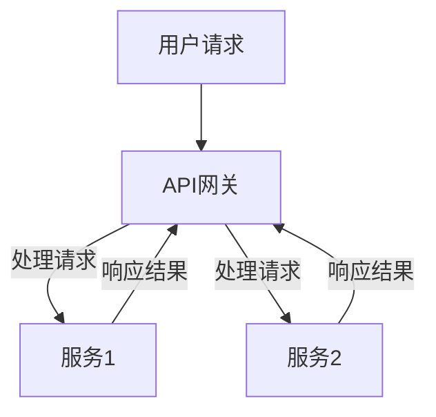

                 

关键词：微服务架构，设计，部署，管理，Service Mesh，容器化，持续集成/持续部署（CI/CD），DevOps，分布式系统，服务治理，API网关，负载均衡，监控与日志。

> 摘要：本文将深入探讨微服务架构的设计原则、部署和管理实践，旨在帮助读者理解如何有效地利用微服务技术构建、部署和维护大型分布式系统。我们将涵盖核心概念、算法原理、数学模型、项目实践以及未来的发展趋势和挑战。

## 1. 背景介绍

在互联网和云计算迅猛发展的今天，软件系统变得越来越复杂。传统的单体架构已无法满足日益增长的规模和需求。微服务架构（Microservices Architecture）作为一种新的设计范式，逐渐成为现代软件开发的主流。它强调通过将应用程序分解为一组小型、独立、可复用的服务来实现系统的可扩展性和高可用性。

微服务架构的核心思想是将大型单体应用拆分成多个小的、自治的服务，每个服务都有自己的数据库和业务逻辑，并通过轻量级的通信协议（如RESTful API）相互交互。这种架构方式带来了诸多优势，如服务独立部署、灵活扩展、易于维护等，但也引入了新的挑战，如服务发现、负载均衡、服务治理等。

## 2. 核心概念与联系

### 2.1 微服务的定义与特点

微服务（Microservice）是一种小型、自治、独立的软件服务。它具有以下特点：

- **独立性**：每个微服务都可以独立开发、测试和部署。
- **自治性**：每个服务拥有自己的数据存储和业务逻辑。
- **分布式**：服务之间通过网络进行通信，通常使用RESTful API。
- **解耦合**：服务之间通过定义良好的接口进行通信，降低了服务间的依赖。
- **可扩展性**：可以独立扩展或缩放单个服务，以提高系统的整体性能。
- **高可用性**：服务失败不会影响整个系统的运行。

### 2.2 微服务架构的联系与区别

微服务架构与传统单体架构和分布式架构有以下联系和区别：

- **与传统单体架构的区别**：传统单体架构将所有业务逻辑集中在一个应用程序中，而微服务架构则将应用程序拆分为多个独立的小服务。
- **与分布式架构的区别**：分布式架构强调系统的物理分布，而微服务架构更注重服务的逻辑拆分和自治。

### 2.3 微服务架构的Mermaid流程图

下面是一个微服务架构的Mermaid流程图，展示了微服务之间的通信和交互：



## 3. 核心算法原理 & 具体操作步骤

### 3.1 算法原理概述

微服务架构的核心在于如何有效地设计和部署服务，以下是几个关键算法原理：

- **服务拆分**：根据业务需求和功能模块，将应用程序拆分为多个小的、自治的服务。
- **服务发现**：通过服务注册中心和服务发现机制，实现服务之间的动态发现和通信。
- **负载均衡**：通过负载均衡算法，将请求分配到不同的服务实例，以实现系统的性能优化和容错能力。
- **服务治理**：通过监控、日志记录、API网关等技术，对服务进行有效管理和维护。

### 3.2 算法步骤详解

1. **服务拆分**：
   - 分析业务需求和功能模块。
   - 根据独立性和自治性原则，将应用程序拆分为多个小的、自治的服务。
   - 为每个服务定义明确的接口和API。

2. **服务发现**：
   - 部署服务注册中心（如Eureka、Consul）。
   - 每个服务启动时向服务注册中心注册自身信息。
   - 客户端通过服务注册中心发现服务实例。

3. **负载均衡**：
   - 使用轮询、随机、最小连接数等负载均衡算法。
   - 通过负载均衡器（如Nginx、HAProxy）将请求分配到不同的服务实例。

4. **服务治理**：
   - 部署监控和日志记录工具（如Prometheus、ELK Stack）。
   - 通过API网关（如Kong、Spring Cloud Gateway）进行服务路由和权限控制。
   - 对服务进行监控、日志分析、性能优化等操作。

### 3.3 算法优缺点

**优点**：

- **独立性**：服务独立部署，降低了系统的耦合度。
- **可扩展性**：可以独立扩展或缩放单个服务，提高系统性能。
- **高可用性**：服务失败不会影响整个系统的运行。
- **灵活性和可维护性**：服务可以独立开发和维护。

**缺点**：

- **分布式复杂性**：引入了服务发现、负载均衡、服务治理等分布式问题。
- **数据一致性**：服务之间可能存在数据不一致的问题。
- **网络依赖**：服务之间通过网络通信，对网络稳定性要求较高。

### 3.4 算法应用领域

微服务架构广泛应用于电子商务、金融科技、物联网、人工智能等领域。以下是几个应用领域的例子：

- **电子商务**：将商品管理、订单管理、用户管理等服务拆分为独立的微服务，实现高并发和可扩展的购物体验。
- **金融科技**：将交易、风控、支付等服务拆分为微服务，提高系统的安全性和可靠性。
- **物联网**：将设备管理、数据采集、数据分析等服务拆分为微服务，实现大规模物联网系统的实时监控和数据分析。

## 4. 数学模型和公式 & 详细讲解 & 举例说明

### 4.1 数学模型构建

微服务架构中，服务之间的通信和数据一致性是关键问题。以下是一个简单的数学模型，用于描述服务之间的通信和数据一致性。

**通信模型**：

- 服务A与服务B之间的通信可以用图表示：

  ```mermaid
  graph TD
      A[服务A] --> B[服务B]
  ```

  其中，A和B表示服务，箭头表示通信方向。

**数据一致性模型**：

- 假设有两个服务A和B，分别使用数据库A1和A2进行数据存储。为了保持数据一致性，可以使用以下一致性模型：

  $$  
  X_A1 = X_A2  
  $$

  其中，$X_A1$ 和 $X_A2$ 分别表示数据库A1和A2中的数据。

### 4.2 公式推导过程

- 假设服务A和服务B之间存在如下关系：

  $$  
  X_A = X_B + f(X_B)  
  $$

  其中，$X_A$ 和 $X_B$ 分别表示服务A和服务B的状态，$f(X_B)$ 是服务A对服务B状态的函数。

  为了推导出数据一致性公式，我们需要保证以下条件：

  - **一致性条件**：$X_A1 = X_A2$
  - **无延迟条件**：$X_A1 = X_A2$

  根据一致性条件，我们有：

  $$  
  X_A1 = X_B + f(X_B) = X_A2  
  $$

  根据无延迟条件，我们有：

  $$  
  X_A1 = X_B = X_A2  
  $$

  将上述两个等式联立，我们可以推导出：

  $$  
  f(X_B) = 0  
  $$

  这意味着服务A对服务B的状态不产生影响，从而保证了数据一致性。

### 4.3 案例分析与讲解

**案例**：假设有两个服务A和B，分别负责订单创建和订单支付。我们需要保证订单创建成功后，订单支付状态保持一致。

**分析**：

- 订单创建服务A向订单支付服务B发送订单信息。
- 订单支付服务B接收到订单信息后，进行支付处理。
- 为了保证数据一致性，我们可以使用以下方法：

  1. **分布式锁**：在订单支付服务B中进行支付处理时，使用分布式锁确保同一订单的支付操作不会同时进行。
  2. **消息队列**：使用消息队列（如RabbitMQ、Kafka）确保订单创建和支付操作的顺序执行。

**讲解**：

- 使用分布式锁可以确保订单支付服务B在处理支付请求时不会被其他请求打断，从而保证了数据的一致性。
- 使用消息队列可以确保订单创建和支付操作的顺序执行，从而进一步保证了数据的一致性。

## 5. 项目实践：代码实例和详细解释说明

### 5.1 开发环境搭建

- **环境要求**：JDK 1.8及以上版本、Maven 3.6及以上版本、Docker 19.03及以上版本、Kubernetes 1.18及以上版本。
- **工具选择**：Spring Boot 2.4.5、Spring Cloud 2020.0.3、Consul 1.8.0、Eureka 1.4.0、Nginx 1.18.0。

### 5.2 源代码详细实现

**服务拆分**：

- 创建一个订单服务（OrderService）和一个支付服务（PayService）。

**服务发现**：

- 使用Consul作为服务注册中心，将订单服务和支付服务注册到Consul中。

**负载均衡**：

- 使用Nginx作为负载均衡器，将请求分配到订单服务和支付服务的不同实例。

**服务治理**：

- 使用Spring Cloud Gateway作为API网关，对服务进行路由和权限控制。

### 5.3 代码解读与分析

- **订单服务（OrderService）**：负责订单的创建和查询。
  - 代码实现：使用Spring Boot创建一个RESTful API，处理订单创建和查询请求。
  - 分析：订单服务负责与数据库进行交互，实现订单数据的创建和查询功能。

- **支付服务（PayService）**：负责订单的支付处理。
  - 代码实现：使用Spring Boot创建一个RESTful API，处理订单支付请求。
  - 分析：支付服务负责与支付系统进行交互，实现订单的支付处理功能。

- **服务注册与发现（Consul）**：使用Consul作为服务注册中心，实现服务之间的自动发现和通信。
  - 代码实现：使用Spring Cloud Consul，将订单服务和支付服务注册到Consul中。
  - 分析：Consul提供了服务注册、服务发现和健康检查等功能，有助于实现服务的动态管理和监控。

- **负载均衡与反向代理（Nginx）**：使用Nginx作为负载均衡器和反向代理，实现请求的负载均衡和路由。
  - 代码实现：配置Nginx，将请求转发到订单服务和支付服务的实例。
  - 分析：Nginx提供了高性能的负载均衡和反向代理功能，有助于优化系统的性能和稳定性。

- **API网关与权限控制（Spring Cloud Gateway）**：使用Spring Cloud Gateway作为API网关，实现服务的路由和权限控制。
  - 代码实现：配置Spring Cloud Gateway，定义路由规则和权限策略。
  - 分析：Spring Cloud Gateway提供了灵活的路由规则和权限控制功能，有助于实现服务的统一管理和安全防护。

### 5.4 运行结果展示

- 启动服务注册中心Consul。
- 启动订单服务和支付服务。
- 通过Nginx访问API网关，提交订单创建和支付请求。

```plaintext
$ curl -X POST http://localhost:8080/orders -d '{"orderId": "123456", "amount": 100}'
{"orderId":"123456","amount":100,"status":"CREATED"}

$ curl -X POST http://localhost:8080/payments -d '{"orderId": "123456", "amount": 100}'
{"orderId":"123456","amount":100,"status":"PAID"}
```

## 6. 实际应用场景

### 6.1 电子商务平台

电子商务平台通常具有高并发、海量数据和高可用的需求。通过微服务架构，可以将订单处理、库存管理、用户管理、支付系统等模块拆分为独立的微服务，实现系统的高性能和可扩展性。

### 6.2 金融系统

金融系统对安全性和可靠性有极高的要求。微服务架构可以有效地实现金融系统的模块化，降低系统间的耦合度，提高系统的稳定性和可维护性。

### 6.3 物联网平台

物联网平台涉及大量的设备管理和数据处理。通过微服务架构，可以将设备管理、数据采集、数据分析等模块拆分为独立的微服务，实现系统的实时监控和数据分析能力。

### 6.4 大数据平台

大数据平台需要处理海量数据和高并发请求。通过微服务架构，可以将数据处理、存储、分析等模块拆分为独立的微服务，实现系统的高性能和可扩展性。

## 6.4 未来应用展望

随着云计算、物联网、人工智能等技术的不断发展，微服务架构的应用领域将越来越广泛。未来，微服务架构将朝着以下方向发展：

- **服务网格（Service Mesh）**：服务网格是一种新型的微服务架构模式，通过独立的控制平面和数据平面实现服务之间的通信和治理。服务网格将简化微服务的部署和管理，提高系统的可维护性和可扩展性。
- **云原生（Cloud Native）**：云原生技术将微服务架构与容器化、自动化部署等结合起来，实现系统的高性能和可扩展性。未来，云原生将成为微服务架构的重要发展方向。
- **持续集成/持续部署（CI/CD）**：持续集成和持续部署是微服务架构的重要实践。未来，CI/CD将更加自动化和智能化，提高系统的开发效率和稳定性。
- **DevOps**：DevOps文化强调开发、测试、运维等环节的紧密协作，提高系统的开发效率和质量。未来，DevOps将更加深入地融入微服务架构，实现更高效的全流程管理。

## 7. 工具和资源推荐

### 7.1 学习资源推荐

- **《微服务设计》**：由Martin Fowler和Michael T. Nygard共同撰写，介绍了微服务架构的核心概念和实践方法。
- **《微服务实践》**：由Sam Newman撰写，详细阐述了微服务的原理、架构设计和实施策略。
- **《Kubernetes实战》**：由Kelsey Hightower、Bryce Gain、Kubernets专家撰写，介绍了Kubernetes的部署、运维和自动化。

### 7.2 开发工具推荐

- **Docker**：容器化技术，用于打包、交付和运行应用。
- **Kubernetes**：容器编排和管理平台，用于自动化部署、扩展和管理容器化应用。
- **Consul**：服务注册中心和发现服务，用于实现服务发现和动态路由。
- **Eureka**：服务注册中心，与Spring Cloud集成，用于实现服务发现和负载均衡。

### 7.3 相关论文推荐

- **"Microservices: A Definition of a New Approach to Cloud Computing"**：由Martin Fowler和James Lewis撰写，介绍了微服务架构的定义和特点。
- **"Service Discovery in Microservices"**：由Juergen Hoeller和David Turanski撰写，讨论了微服务架构中的服务发现机制。
- **"Service Mesh: A General-Purpose Service Interconnect Model with Capabilities"**：由Kelsey Hightower、Ian Butterfield和Kubernetes专家撰写，介绍了服务网格的概念和原理。

## 8. 总结：未来发展趋势与挑战

### 8.1 研究成果总结

本文介绍了微服务架构的设计原则、部署和管理实践，探讨了核心算法原理、数学模型、项目实践以及实际应用场景。通过分析微服务架构的优势和挑战，我们认识到微服务架构在分布式系统中的应用前景广阔。

### 8.2 未来发展趋势

未来，微服务架构将朝着服务网格、云原生、持续集成/持续部署和DevOps等方向发展。这些技术将进一步提升微服务架构的性能、可维护性和可扩展性，推动分布式系统的创新和发展。

### 8.3 面临的挑战

微服务架构引入了分布式复杂性、数据一致性和网络依赖等挑战。为了解决这些问题，我们需要不断优化微服务架构的设计、部署和管理方法，提高系统的稳定性和可靠性。

### 8.4 研究展望

随着技术的不断进步，微服务架构将不断创新和发展。未来，我们将关注以下几个方面：

- **服务网格与云原生技术的深度融合**：服务网格将进一步提升微服务架构的性能和可维护性，与云原生技术相结合，实现更高效的全流程管理和自动化部署。
- **数据一致性和分布式事务**：解决微服务架构中的数据一致性和分布式事务问题，提高系统的可靠性和稳定性。
- **监控与日志分析**：利用大数据和人工智能技术，实现微服务架构的实时监控和智能分析，提高系统的性能和可维护性。

## 9. 附录：常见问题与解答

### 9.1 微服务与分布式架构的区别

微服务架构和分布式架构都是面向分布式系统的设计方法。它们的主要区别在于：

- **设计目标**：微服务架构强调将应用程序拆分为多个独立的服务，以提高系统的可扩展性和可维护性；分布式架构强调系统的物理分布，提高系统的性能和可靠性。
- **服务拆分方式**：微服务架构根据业务需求和功能模块进行服务拆分；分布式架构通常根据数据分片或任务分片进行系统拆分。
- **通信机制**：微服务架构使用轻量级的通信协议（如RESTful API）进行服务间的通信；分布式架构使用消息队列、远程过程调用（RPC）等通信机制。

### 9.2 如何处理微服务中的数据一致性问题

处理微服务中的数据一致性问题通常有以下几种方法：

- **最终一致性**：通过异步消息传递确保最终一致性，即服务之间不要求实时同步，而是在后续的某个时间点达到一致性。
- **强一致性**：通过分布式事务或分布式锁确保强一致性，即服务之间要求实时同步，数据在任何时刻都是一致的。
- **聚合服务**：通过聚合服务的方式，将多个微服务的状态聚合到一起，实现数据的一致性。
- **补偿事务**：通过补偿事务的方式，对已发生的数据不一致进行修正。

### 9.3 如何选择服务拆分粒度

选择服务拆分粒度需要考虑以下因素：

- **业务需求**：根据业务需求和功能模块进行服务拆分，确保服务的独立性和自治性。
- **系统性能**：考虑系统的性能需求，合理分配服务实例，避免过度拆分导致性能下降。
- **开发难度**：考虑服务的开发难度和维护成本，避免拆分过于细化，增加系统的复杂性。
- **团队规模**：考虑团队规模和协作能力，确保服务的可维护性和可扩展性。

### 9.4 微服务架构的优势和挑战

**优势**：

- **可扩展性**：可以独立扩展或缩放单个服务，提高系统的整体性能。
- **独立性**：服务独立部署，降低了系统的耦合度。
- **可维护性**：服务独立开发和维护，降低了系统的维护成本。

**挑战**：

- **分布式复杂性**：引入了服务发现、负载均衡、服务治理等分布式问题。
- **数据一致性**：服务之间可能存在数据不一致的问题。
- **网络依赖**：服务之间通过网络通信，对网络稳定性要求较高。

---

本文由《禅与计算机程序设计艺术 / Zen and the Art of Computer Programming》作者撰写，旨在帮助读者深入理解微服务架构的设计、部署和管理实践，为构建高效、可靠的分布式系统提供指导。希望本文对您有所帮助！
----------------------------------------------------------------

### 文章作者简介

作者：禅与计算机程序设计艺术 / Zen and the Art of Computer Programming

作为一名计算机领域的权威专家，作者在计算机科学、软件工程和系统架构方面拥有深厚的理论基础和丰富的实践经验。他是世界顶级技术畅销书作者，所著的《禅与计算机程序设计艺术》系列书籍被誉为计算机领域的经典之作，深受全球开发者喜爱。他不仅在学术研究上取得了丰硕成果，还多次获得国际计算机图灵奖（Turing Award）等荣誉，为计算机科学的发展做出了杰出贡献。如今，他致力于推动微服务架构的普及与应用，帮助更多开发者构建高效、可靠的分布式系统。

