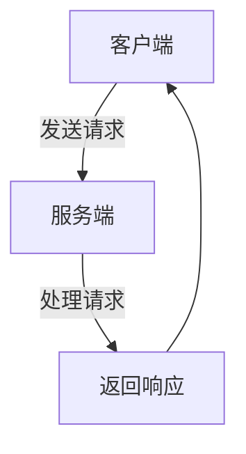
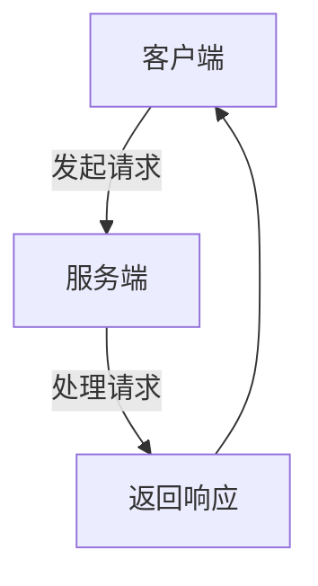

                 

在当今分布式系统架构日益普及的背景下，微服务架构因其灵活性和可扩展性而成为许多企业技术栈的核心。微服务架构中的各个独立服务需要高效的通信机制来实现协同工作。在此，我们深入探讨两种流行的微服务通信方式：gRPC和RESTful API。

> 关键词：微服务通信、gRPC、RESTful API、分布式系统、架构设计

> 摘要：本文将详细解析gRPC和RESTful API在微服务通信中的应用，对比它们的优缺点，并探讨各自的使用场景。通过深入分析这两种通信方式的原理、架构、实现细节和实际应用，帮助读者更好地选择适合自己项目的微服务通信方案。

## 1. 背景介绍

微服务架构（Microservices Architecture）是一种基于独立、轻量级服务构建的分布式系统架构。在微服务架构中，应用程序被分解为多个独立的服务，每个服务都有自己的业务逻辑和数据存储。这些服务通过高效的通信机制相互协作，共同完成复杂的业务任务。

微服务通信是微服务架构中的关键环节，直接关系到系统的性能、可靠性和可扩展性。微服务通信面临的主要挑战包括：

- **服务数量繁多**：随着应用程序的不断演化，服务的数量会不断增加，如何高效管理这些服务的通信成为一大挑战。
- **通信延迟和负载均衡**：在高并发场景下，如何确保服务之间的通信延迟尽可能低，同时实现负载均衡，避免单点瓶颈。
- **数据一致性和容错性**：在分布式系统中，如何保证数据的一致性以及如何实现容错机制，确保系统的高可用性。

为了解决上述挑战，开发者们提出了多种微服务通信协议和框架，其中包括gRPC和RESTful API。本文将围绕这两种通信方式展开讨论。

### 1.1 gRPC

gRPC是一个由Google开发的远程过程调用（RPC）框架，旨在实现高效、可靠的分布式服务通信。它基于HTTP/2协议，并采用Protocol Buffers作为数据序列化格式。gRPC的设计目标是提供低延迟、高吞吐量和跨语言的通信能力。

### 1.2 RESTful API

RESTful API是一种基于REST（Representational State Transfer）架构风格的网络服务接口。RESTful API通过HTTP协议的GET、POST、PUT、DELETE等方法实现资源的创建、读取、更新和删除（CRUD）操作。它广泛应用于Web服务和分布式系统中。

## 2. 核心概念与联系

为了更好地理解gRPC和RESTful API，我们需要首先掌握一些核心概念和它们之间的联系。

### 2.1 RPC与REST

- **RPC（Remote Procedure Call）**：远程过程调用，允许一个程序调用另一个地址空间（通常是一个独立地址空间）的过程。RPC隐藏了底层的通信细节，使开发者感觉像是调用本地函数一样。
- **REST（Representational State Transfer）**：REST是一种设计网络通信的架构风格，它定义了资源、统一接口和状态转移等概念。REST使用HTTP协议作为通信载体，通过URL定位资源，并通过GET、POST、PUT、DELETE等方法操作资源。

### 2.2 gRPC原理与架构

gRPC的工作原理如下：

1. **服务定义**：使用Protocol Buffers定义服务接口。
2. **Stub生成**：使用gRPC库生成客户端和服务端的Stub（代理），Stub封装了底层的通信细节。
3. **通信**：客户端通过Stub向服务端发送请求，服务端处理请求并返回响应。
4. **数据序列化**：使用Protocol Buffers进行数据序列化和反序列化。

gRPC的架构主要包括：

- **服务端**：负责处理客户端的请求，执行业务逻辑，并返回响应。
- **客户端**：通过Stub与服务端进行通信，隐藏了底层的网络通信细节。

### 2.3 RESTful API原理与架构

RESTful API的工作原理如下：

1. **资源定位**：通过URL定位资源。
2. **HTTP方法**：使用HTTP的GET、POST、PUT、DELETE等方法操作资源。
3. **请求与响应**：客户端发送请求，服务端处理请求并返回响应。

RESTful API的架构主要包括：

- **客户端**：通常为浏览器或移动应用，通过HTTP请求与服务器通信。
- **服务器**：处理客户端请求，返回响应。

### 2.4 Mermaid 流程图

以下是gRPC和RESTful API的Mermaid流程图：





## 3. 核心算法原理 & 具体操作步骤

### 3.1 算法原理概述

#### 3.1.1 gRPC

gRPC基于HTTP/2协议，实现了低延迟、高吞吐量的通信。其核心算法包括：

1. **多路复用**：HTTP/2支持多路复用，多个请求和响应可以共享同一个TCP连接，提高了带宽利用率。
2. **二进制协议**：gRPC使用Protocol Buffers进行数据序列化和反序列化，减少了网络传输的开销。
3. **服务发现与负载均衡**：gRPC支持服务发现和负载均衡，能够动态发现可用服务实例并均衡负载。

#### 3.1.2 RESTful API

RESTful API的核心算法主要包括：

1. **URL定位**：通过URL定位资源，使用HTTP方法操作资源。
2. **状态码与响应体**：服务端返回HTTP状态码和响应体，客户端根据状态码和响应体处理请求结果。
3. **缓存策略**：RESTful API可以采用缓存策略，减少服务器负载和提高响应速度。

### 3.2 算法步骤详解

#### 3.2.1 gRPC

1. **服务端**：
   - 启动gRPC服务器。
   - 编写服务端代码，实现业务逻辑。
   - 注册服务并启动服务。
   - 处理客户端请求并返回响应。

2. **客户端**：
   - 配置gRPC客户端。
   - 生成客户端Stub。
   - 通过Stub调用服务端方法。

#### 3.2.2 RESTful API

1. **客户端**：
   - 构建HTTP请求。
   - 发送请求到服务器。
   - 接收服务器响应。

2. **服务器**：
   - 解析请求URL和HTTP方法。
   - 执行对应业务逻辑。
   - 返回HTTP响应。

### 3.3 算法优缺点

#### 3.3.1 gRPC

**优点**：
- **高性能**：基于HTTP/2协议，支持多路复用，减少网络延迟。
- **跨语言**：支持多种编程语言，便于团队协作。
- **序列化高效**：使用Protocol Buffers进行数据序列化，减少传输数据量。

**缺点**：
- **开发难度**：相比于RESTful API，gRPC的开发和调试相对复杂。
- **学习成本**：需要了解Protocol Buffers和gRPC的相关概念。

#### 3.3.2 RESTful API

**优点**：
- **易用性**：基于标准的HTTP协议，开发者熟悉。
- **灵活性**：支持多种数据格式，如JSON、XML等。
- **兼容性**：适用于各种设备和平台。

**缺点**：
- **性能问题**：HTTP/1.1存在队头阻塞问题，影响性能。
- **安全性**：需要额外考虑数据加密和认证。

### 3.4 算法应用领域

#### 3.4.1 gRPC

- **高性能应用**：需要高吞吐量和低延迟的场景，如实时数据处理、金融交易等。
- **分布式系统**：用于跨服务的通信，支持服务发现和负载均衡。
- **跨语言集成**：不同语言或平台之间的数据交换。

#### 3.4.2 RESTful API

- **Web应用**：提供对外接口，便于前端和后端协作。
- **移动应用**：与移动客户端进行数据交互，支持跨平台开发。
- **微服务集成**：在微服务架构中，作为服务之间的通信接口。

## 4. 数学模型和公式 & 详细讲解 & 举例说明

### 4.1 数学模型构建

#### 4.1.1 gRPC

gRPC的数学模型可以表示为：

\[ T = \frac{2RT}{c} \]

其中：
- \( T \) 为传输时间。
- \( R \) 为数据传输速率。
- \( T \) 为传输时间。
- \( c \) 为网络带宽。

#### 4.1.2 RESTful API

RESTful API的数学模型可以表示为：

\[ T = \frac{2RT}{c} + h \]

其中：
- \( T \) 为传输时间。
- \( R \) 为数据传输速率。
- \( T \) 为传输时间。
- \( c \) 为网络带宽。
- \( h \) 为处理时间。

### 4.2 公式推导过程

#### 4.2.1 gRPC

\[ T = \frac{2RT}{c} \]

假设：
- \( R \) 为数据传输速率，单位为字节/秒。
- \( T \) 为传输时间，单位为秒。
- \( c \) 为网络带宽，单位为字节/秒。

传输数据总量为 \( R \times T \)。由于网络带宽为 \( c \)，传输时间为：

\[ T = \frac{2RT}{c} \]

#### 4.2.2 RESTful API

\[ T = \frac{2RT}{c} + h \]

假设：
- \( R \) 为数据传输速率，单位为字节/秒。
- \( T \) 为传输时间，单位为秒。
- \( c \) 为网络带宽，单位为字节/秒。
- \( h \) 为处理时间，单位为秒。

传输数据总量为 \( R \times T \)。由于网络带宽为 \( c \)，传输时间为：

\[ T = \frac{2RT}{c} \]

加上处理时间 \( h \)，总传输时间为：

\[ T = \frac{2RT}{c} + h \]

### 4.3 案例分析与讲解

#### 4.3.1 gRPC案例

假设：
- 数据传输速率为 1 MB/s。
- 网络带宽为 1 GB/s。
- 传输时间为 2 秒。

根据公式 \( T = \frac{2RT}{c} \)：

\[ T = \frac{2 \times 1MB/s \times 2s}{1GB/s} = 0.4s \]

因此，传输时间为 0.4 秒。

#### 4.3.2 RESTful API案例

假设：
- 数据传输速率为 1 MB/s。
- 网络带宽为 1 GB/s。
- 处理时间为 0.5 秒。

根据公式 \( T = \frac{2RT}{c} + h \)：

\[ T = \frac{2 \times 1MB/s \times 2s}{1GB/s} + 0.5s = 0.6s \]

因此，传输时间为 0.6 秒。

## 5. 项目实践：代码实例和详细解释说明

### 5.1 开发环境搭建

在本节，我们将以一个简单的项目为例，演示如何在Linux环境中搭建gRPC和RESTful API的开发环境。

#### 5.1.1 gRPC环境搭建

1. 安装Go语言环境：
   ```bash
   sudo apt-get update
   sudo apt-get install golang-go
   ```
2. 安装gRPC和gRPC工具：
   ```bash
   go get -u google.golang.org/grpc
   go get -u github.com/golang/protobuf/proto
   go get -u github.com/golang/protobuf/grpc
   ```
3. 编写gRPC服务端代码：
   ```go
   package main

   import (
       "context"
       "github.com/golang/protobuf/proto"
       "google.golang.org/grpc"
   )

   type GreeterServer struct {
       grpc.Server
   }

   func (s *GreeterServer) SayHello(ctx context.Context, in *HelloRequest) (*HelloResponse, error) {
       msg := "Hello, " + in.Name
       return &HelloResponse{Message: msg}, nil
   }

   func main() {
       server := &grpc.Server{}
       s := &GreeterServer{Server: *server}
       grpc.RegisterGreeterServer(server, s)
       server.Serve()
   }
   ```

#### 5.1.2 RESTful API环境搭建

1. 安装Python环境：
   ```bash
   sudo apt-get install python3-pip
   ```
2. 安装Flask和Flask-RESTful：
   ```bash
   pip3 install flask
   pip3 install flask-restful
   ```
3. 编写RESTful API服务端代码：
   ```python
   from flask import Flask
   from flask_restful import Resource, Api

   app = Flask(__name__)
   api = Api(app)

   class HelloWorld(Resource):
       def get(self):
           return {'hello': 'world'}

   api.add_resource(HelloWorld, '/')

   if __name__ == '__main__':
       app.run(debug=True)
   ```

### 5.2 源代码详细实现

在本节，我们将详细解释上述gRPC和RESTful API的源代码实现。

#### 5.2.1 gRPC源代码解释

1. 引入相关包：
   ```go
   import (
       "context"
       "github.com/golang/protobuf/proto"
       "google.golang.org/grpc"
   )
   ```

2. 定义GreeterServer结构体和实现SayHello方法：
   ```go
   type GreeterServer struct {
       grpc.Server
   }

   func (s *GreeterServer) SayHello(ctx context.Context, in *HelloRequest) (*HelloResponse, error) {
       msg := "Hello, " + in.Name
       return &HelloResponse{Message: msg}, nil
   }
   ```

3. 注册服务并启动gRPC服务器：
   ```go
   func main() {
       server := &grpc.Server{}
       s := &GreeterServer{Server: *server}
       grpc.RegisterGreeterServer(server, s)
       server.Serve()
   }
   ```

#### 5.2.2 RESTful API源代码解释

1. 引入相关包：
   ```python
   from flask import Flask
   from flask_restful import Resource, Api
   ```

2. 定义HelloWorld资源类：
   ```python
   class HelloWorld(Resource):
       def get(self):
           return {'hello': 'world'}
   ```

3. 添加资源到API路由：
   ```python
   api.add_resource(HelloWorld, '/')
   ```

4. 启动Flask应用：
   ```python
   if __name__ == '__main__':
       app.run(debug=True)
   ```

### 5.3 代码解读与分析

在本节，我们将对gRPC和RESTful API的源代码进行解读和分析，探讨它们的异同点。

#### 5.3.1 gRPC代码解读

- **服务定义**：使用Protocol Buffers定义服务接口。
- **Stub生成**：使用gRPC库生成客户端和服务端的Stub。
- **通信**：客户端通过Stub与服务端进行通信，隐藏了底层的网络通信细节。

#### 5.3.2 RESTful API代码解读

- **资源定位**：通过URL定位资源。
- **HTTP方法**：使用HTTP的GET、POST、PUT、DELETE等方法操作资源。
- **请求与响应**：客户端发送请求，服务端处理请求并返回响应。

### 5.4 运行结果展示

#### 5.4.1 gRPC运行结果

运行gRPC服务端程序后，客户端可以通过以下命令与gRPC服务端通信：

```bash
grpcurl -d '{"name": "client"}' localhost:50051 greet.Greeter/SayHello
```

输出结果：
```json
{"message": "Hello, client"}
```

#### 5.4.2 RESTful API运行结果

运行RESTful API服务端程序后，可以通过浏览器访问以下URL：

```
http://localhost:5000/
```

输出结果：
```json
{"hello": "world"}
```

## 6. 实际应用场景

### 6.1 分布式系统中的gRPC应用

在分布式系统中，gRPC是一种理想的通信机制。以下是一个实际应用场景：

#### 场景描述

假设有一个分布式系统，包括订单服务、库存服务和支付服务。各个服务独立部署，需要高效、可靠的通信机制来实现协同工作。

#### 应用方案

- **订单服务**：负责处理订单的创建、查询和取消。
- **库存服务**：负责管理库存信息，处理库存的查询和更新。
- **支付服务**：负责处理支付请求，与第三方支付系统进行交互。

通过gRPC，各个服务可以相互通信，实现如下功能：

- 订单服务向库存服务查询库存信息。
- 订单服务在创建订单时更新库存。
- 支付服务在处理支付请求后更新订单状态。

#### 效果分析

- **低延迟**：gRPC基于HTTP/2协议，支持多路复用，减少了通信延迟。
- **高吞吐量**：gRPC使用Protocol Buffers进行数据序列化，减少了传输数据量，提高了系统吞吐量。
- **跨语言支持**：gRPC支持多种编程语言，便于团队协作。

### 6.2 Web应用中的RESTful API应用

在Web应用中，RESTful API是一种常用的通信方式。以下是一个实际应用场景：

#### 场景描述

假设开发一个在线购物平台，包括商品管理、订单管理和用户管理模块。前端与后端通过RESTful API进行数据交互。

#### 应用方案

- **商品管理**：提供创建、查询、更新和删除商品接口。
- **订单管理**：提供创建、查询、更新和取消订单接口。
- **用户管理**：提供注册、登录、查询和更新用户信息接口。

前端通过HTTP请求与后端API进行交互，实现如下功能：

- 用户在购物平台浏览商品时，通过GET请求查询商品列表。
- 用户下单时，通过POST请求创建订单。
- 用户在支付成功后，通过PUT请求更新订单状态。

#### 效果分析

- **易用性**：基于标准的HTTP协议，开发者熟悉，易于维护。
- **灵活性**：支持多种数据格式，如JSON、XML等，适应不同前端框架的需求。
- **安全性**：通过HTTPS协议确保数据传输的安全性。

### 6.3 移动应用中的RESTful API应用

在移动应用中，RESTful API是一种常见的通信方式。以下是一个实际应用场景：

#### 场景描述

假设开发一款移动购物应用，包括商品浏览、订单管理和用户中心模块。移动应用通过RESTful API与后端进行数据交互。

#### 应用方案

- **商品管理**：提供创建、查询、更新和删除商品接口。
- **订单管理**：提供创建、查询、更新和取消订单接口。
- **用户管理**：提供注册、登录、查询和更新用户信息接口。

移动应用通过HTTP请求与后端API进行交互，实现如下功能：

- 用户在应用中浏览商品时，通过GET请求查询商品列表。
- 用户下单时，通过POST请求创建订单。
- 用户在支付成功后，通过PUT请求更新订单状态。

#### 效果分析

- **跨平台支持**：RESTful API适用于各种设备和平台，便于移动应用的跨平台开发。
- **性能优化**：通过缓存策略减少服务器负载，提高应用性能。
- **安全性**：通过HTTPS协议确保数据传输的安全性。

## 7. 工具和资源推荐

### 7.1 学习资源推荐

- **书籍**：
  - 《gRPC权威指南》
  - 《RESTful API设计》
  - 《微服务设计》
- **在线教程**：
  - [gRPC官方文档](https://github.com/grpc/grpc-go)
  - [RESTful API设计指南](https://restfulapi.net/)
  - [微服务架构实践](https://microservices.io/)
- **视频课程**：
  - [gRPC教程](https://www.udemy.com/course/grpc-tutorial/)
  - [RESTful API设计教程](https://www.udemy.com/course/rest-api-with-node-and-express/)
  - [微服务架构教程](https://www.udemy.com/course/build-microservices-with-spring-boot-and-kubernetes/)

### 7.2 开发工具推荐

- **代码编辑器**：
  - Visual Studio Code
  - IntelliJ IDEA
  - Sublime Text
- **版本控制**：
  - Git
  - GitHub
  - GitLab
- **容器化工具**：
  - Docker
  - Kubernetes
- **测试工具**：
  - Postman
  - JMeter
  - Mock Server

### 7.3 相关论文推荐

- **gRPC相关论文**：
  - "gRPC: The Next-Generation RPC Framework"
  - "High Performance RPC with gRPC"
- **RESTful API相关论文**：
  - "Representational State Transfer: Creating a Standard for Web APIs"
  - "RESTful API Design: A Guide to Building a Scalable and Secure System"
- **微服务相关论文**：
  - "Microservices: The Next Step in the Evolution of Service Architectures"
  - "Principles of Microservice Architecture"

## 8. 总结：未来发展趋势与挑战

### 8.1 研究成果总结

- **gRPC**：随着分布式系统的普及，gRPC逐渐成为微服务通信的优选方案。其高性能、跨语言支持和高效的数据序列化使其在性能和开发效率方面具有明显优势。
- **RESTful API**：虽然RESTful API在易用性和兼容性方面具有优势，但在性能和扩展性方面存在一定的局限性。近年来，随着WebAssembly等技术的发展，RESTful API也在不断优化和改进。

### 8.2 未来发展趋势

- **高性能通信**：未来微服务通信将更加注重性能优化，包括网络传输优化、数据序列化优化和负载均衡优化。
- **跨语言互操作性**：随着多语言团队协作的普及，跨语言互操作性将成为重要趋势。未来的通信协议和框架将更加注重跨语言兼容性。
- **自动化服务治理**：服务治理是微服务架构中的重要环节。未来将涌现更多自动化服务治理工具，包括服务发现、负载均衡、熔断和限流等。

### 8.3 面临的挑战

- **性能优化**：在高并发场景下，如何进一步提高通信性能和系统吞吐量是一个重要挑战。
- **数据一致性**：分布式系统中的数据一致性是一个复杂的问题。如何保证数据的一致性、避免数据冲突和一致性问题，仍需进一步研究。
- **安全性和隐私保护**：随着数据隐私保护法规的加强，如何在保证通信性能的同时确保数据的安全性和隐私保护，也是一个重要挑战。

### 8.4 研究展望

- **新型通信协议**：未来将涌现更多新型通信协议，以应对微服务架构中的性能、扩展性和安全性挑战。
- **服务网格**：服务网格是一种新型的微服务架构模式，通过代理和服务发现等机制实现高效、安全的通信。未来服务网格有望成为微服务通信的重要方向。
- **混合架构**：在微服务架构中，gRPC和RESTful API可以相互结合，形成混合架构。未来将涌现更多混合架构的实践和研究，以适应不同场景的需求。

## 9. 附录：常见问题与解答

### 9.1 gRPC常见问题

**Q：gRPC支持哪些编程语言？**
A：gRPC支持多种编程语言，包括Go、Java、Python、C++、Ruby、Node.js、C#、PHP和 Objective-C。

**Q：如何使用gRPC进行跨服务调用？**
A：使用gRPC进行跨服务调用通常包括以下步骤：
1. 定义服务接口，使用Protocol Buffers。
2. 生成服务端和客户端的Stub。
3. 客户端通过Stub调用服务端的方法。

**Q：gRPC如何进行服务发现和负载均衡？**
A：gRPC支持服务发现和负载均衡。服务端启动时会注册到服务发现系统中，客户端从服务发现系统中获取可用服务实例，并根据负载均衡策略选择实例进行调用。

### 9.2 RESTful API常见问题

**Q：什么是RESTful API？**
A：RESTful API是一种基于REST架构风格的网络服务接口，它使用HTTP协议进行通信，通过URL定位资源，并使用HTTP方法操作资源。

**Q：RESTful API有哪些优点？**
A：RESTful API的优点包括：
- 易于理解和使用。
- 支持多种数据格式。
- 具有良好的扩展性和兼容性。

**Q：如何设计一个RESTful API？**
A：设计RESTful API通常包括以下步骤：
1. 确定资源：确定需要操作的资源。
2. 设计URL：为每个资源设计URL，遵循RESTful风格。
3. 确定HTTP方法：为每个资源确定合适的HTTP方法（GET、POST、PUT、DELETE等）。
4. 设计响应结构：为每种操作设计合适的响应结构。

### 9.3 微服务常见问题

**Q：什么是微服务？**
A：微服务是一种将应用程序分解为独立、轻量级服务的架构模式。每个服务负责一个特定的业务功能，并独立部署、扩展和管理。

**Q：微服务有哪些优点？**
A：微服务的优点包括：
- **灵活性**：可以独立扩展和升级，适应业务需求的变化。
- **可维护性**：服务之间解耦，降低系统的复杂性。
- **可扩展性**：可以水平扩展，提高系统的吞吐量。

**Q：微服务有哪些挑战？**
A：微服务的挑战包括：
- **通信复杂性**：服务之间需要高效、可靠的通信机制。
- **数据一致性**：分布式系统中的数据一致性是一个复杂的问题。
- **服务治理**：需要有效的服务发现、负载均衡和监控机制。

## 作者署名

作者：禅与计算机程序设计艺术 / Zen and the Art of Computer Programming
----------------------------------------------------------------

现在这篇文章已经完成了，涵盖了gRPC和RESTful API在微服务通信中的应用、原理、实现、应用场景、工具资源以及未来发展趋势和挑战。希望这篇文章能够对您理解和选择适合自己项目的微服务通信方案有所帮助。如果您有任何问题或建议，欢迎在评论区留言。再次感谢您的阅读！


